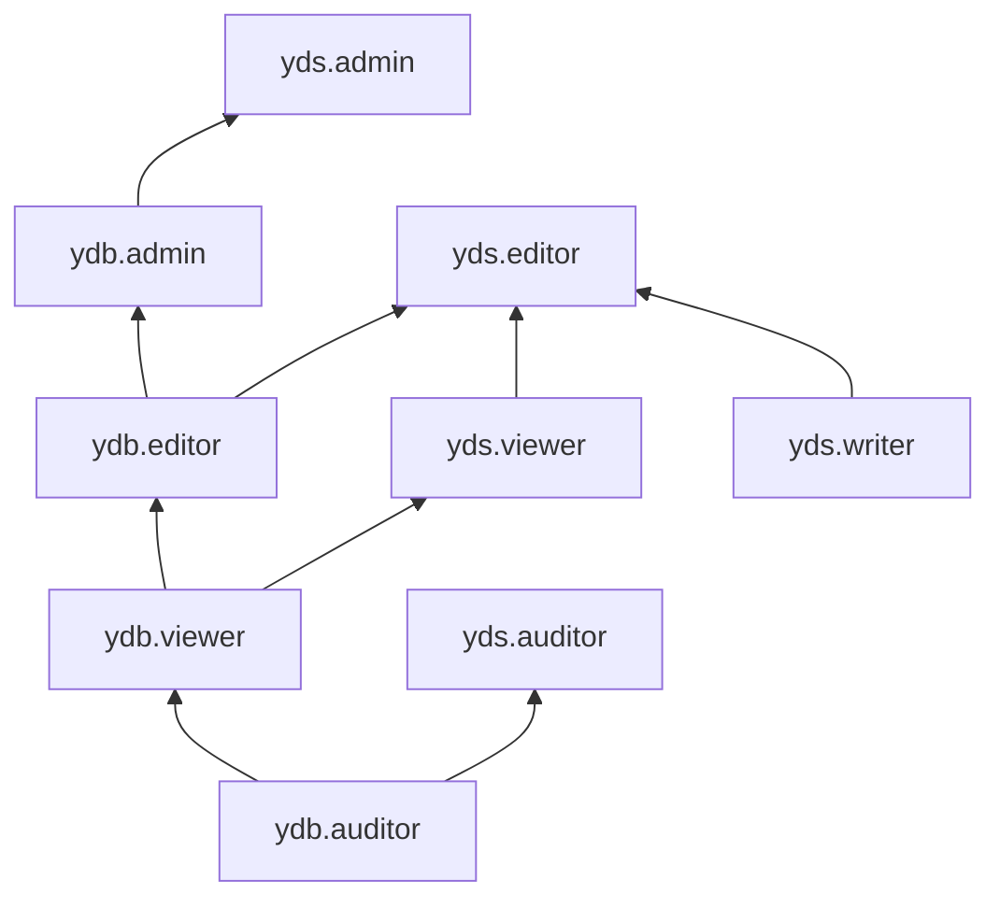

[Документация Yandex Cloud](../../index.md) > [Yandex Data Streams](../index.md) > Управление доступом

# Управление доступом в Data Streams

Для управления правами доступа в Data Streams используются [роли](../../iam/concepts/access-control/roles.md).

Пользователь Yandex Cloud может выполнять только те операции над ресурсами, которые разрешены назначенными ему [ролями](../../iam/concepts/access-control/roles.md). Пока у пользователя нет никаких ролей, почти все операции ему запрещены.

Чтобы разрешить доступ к ресурсам сервиса Yandex Data Streams (потоки данных, базы данных Yandex Managed Service for YDB, где хранятся потоки, и их пользователи), назначьте аккаунту на Яндексе, [сервисному аккаунту](../../iam/concepts/users/service-accounts.md), [федеративным](../../iam/concepts/users/accounts.md#saml-federation) или [локальным](../../iam/concepts/users/accounts.md#local) пользователям, [группе пользователей](../../organization/operations/manage-groups.md), [системной группе](../../iam/concepts/access-control/system-group.md) или [публичной группе](../../iam/concepts/access-control/public-group.md) нужные роли из приведенного ниже списка. На данный момент роль может быть назначена только на родительский ресурс (каталог или облако), роли которого наследуются вложенными ресурсами.

Подробнее о наследовании ролей читайте в разделе [Наследование прав доступа](../../resource-manager/concepts/resources-hierarchy.md#access-rights-inheritance) документации сервиса Yandex Resource Manager.

Назначать роли на ресурс могут пользователи, у которых на этот ресурс есть роль `yds.admin` или одна из следующих ролей:

* `admin`;
* `resource-manager.admin`;
* `organization-manager.admin`;
* `resource-manager.clouds.owner`;
* `organization-manager.organizations.owner`.

## Назначение ролей {#grant-roles}

Чтобы назначить пользователю роль:

1. При необходимости [добавьте](../../organization/operations/add-account.md) нужного пользователя.
1. В [консоли управления](https://console.yandex.cloud) слева [выберите](../../resource-manager/operations/cloud/switch-cloud.md) облако.
1. Перейдите на вкладку **Права доступа**.
1. Нажмите кнопку **Настроить доступ**.
1. В открывшемся окне выберите раздел **Пользовательские аккаунты**.
1. Выберите пользователя из списка или воспользуйтесь поиском.
1. Нажмите кнопку  **Добавить роль** и выберите роль в облаке.
1. Нажмите кнопку **Сохранить**.

## Какие роли действуют в сервисе {#roles-list}

Ниже перечислены все роли, которые учитываются при проверке прав доступа в сервисе Data Streams.

### Сервисные роли {#service-roles}

#### yds.auditor {#yds-auditor}

Роль `yds.auditor` позволяет просматривать метаданные потоков данных Data Streams, устанавливать соединения c базами данных YDB, просматривать информацию о БД YDB и назначенных правах доступа к ним, а также о схемных объектах и резервных копиях БД YDB.

Пользователи с этой ролью могут:
* просматривать метаданные [потоков данных](../concepts/glossary.md#stream-concepts) Data Streams;
* устанавливать соединения c [базами данных YDB](../../ydb/concepts/resources.md#database);
* просматривать список баз данных и информацию о них, а также о назначенных [правах доступа](../../iam/concepts/access-control/index.md) к базам данных YDB;
* просматривать информацию о резервных копиях баз данных YDB и назначенных правах доступа к таким резервным копиям;
* просматривать список схемных объектов БД YDB (таблиц, индексов и каталогов) и информацию о них;
* просматривать информацию о [квотах](../../ydb/concepts/limits.md#ydb-quotas) сервиса Managed Service for YDB;
* просматривать информацию об [облаке](../../resource-manager/concepts/resources-hierarchy.md#cloud) и [каталоге](../../resource-manager/concepts/resources-hierarchy.md#folder).

Включает разрешения, предоставляемые ролью `ydb.auditor`.

#### yds.viewer {#yds-viewer}

Роль `yds.viewer` позволяет читать данные из потоков данных Data Streams и просматривать их настройки, а также устанавливать соединения c БД YDB, выполнять запросы на чтение данных, просматривать информацию о БД YDB и назначенных правах доступа к ним.

Пользователи с этой ролью могут:
* просматривать метаданные [потоков данных](../concepts/glossary.md#stream-concepts) Data Streams и читать данные из таких потоков;
* устанавливать соединения c [базами данных YDB](../../ydb/concepts/resources.md#database) и выполнять запросы на чтение данных;
* просматривать список баз данных YDB и информацию о них, а также о назначенных [правах доступа](../../iam/concepts/access-control/index.md) к базам данных YDB;
* просматривать информацию о резервных копиях баз данных YDB и назначенных правах доступа к резервным копиям;
* просматривать список схемных объектов БД YDB (таблиц, индексов и каталогов) и информацию о них;
* просматривать информацию о [квотах](../../ydb/concepts/limits.md#ydb-quotas) сервиса Managed Service for YDB;
* просматривать информацию об [облаке](../../resource-manager/concepts/resources-hierarchy.md#cloud) и [каталоге](../../resource-manager/concepts/resources-hierarchy.md#folder).

Включает разрешения, предоставляемые ролью `ydb.viewer`.

#### yds.writer {#yds-writer}

Роль `yds.writer` позволяет записывать данные в [потоки Data Streams](../concepts/glossary.md#stream-concepts), а также устанавливать соединения c [базами данных YDB](../../ydb/concepts/resources.md#database).

#### yds.editor {#yds-editor}

Роль `yds.editor` позволяет создавать, изменять и удалять потоки данных Data Streams, а также выполнять чтение и запись данных в потоках.

Пользователи с этой ролью могут:
* просматривать информацию о [потоках данных](../concepts/glossary.md#stream-concepts), а также создавать, изменять и удалять потоки данных;
* выполнять чтение и запись данных в потоках Data Streams;
* просматривать список [баз данных YDB](../../ydb/concepts/resources.md#database) и информацию о них и назначенных [правах доступа](../../iam/concepts/access-control/index.md) к ним, а также создавать, запускать, останавливать, изменять и удалять базы данных YDB; 
* устанавливать соединения c базами данных YDB и выполнять запросы на чтение и запись данных;
* просматривать информацию о резервных копиях баз данных YDB и назначенных правах доступа к резервным копиям, а также создавать резервные копии, удалять их и восстанавливать базы данных YDB из резервных копий;
* просматривать список схемных объектов БД YDB (таблиц, индексов и каталогов) и информацию о них, а также создавать, изменять и удалять схемные объекты БД YDB;
* просматривать информацию о [квотах](../../ydb/concepts/limits.md#ydb-quotas) сервиса Managed Service for YDB;
* просматривать информацию об [облаке](../../resource-manager/concepts/resources-hierarchy.md#cloud) и [каталоге](../../resource-manager/concepts/resources-hierarchy.md#folder).

Включает разрешения, предоставляемые ролями `ydb.editor` и `yds.writer`.

#### yds.admin {#yds-admin}

Роль `yds.admin` позволяет создавать, изменять и удалять потоки данных Data Streams, а также выполнять чтение и запись данных в потоках.

Пользователи с этой ролью могут:
* просматривать информацию о [потоках данных](../concepts/glossary.md#stream-concepts), а также создавать, изменять и удалять потоки данных;
* выполнять чтение и запись данных в потоках Data Streams;
* просматривать список [баз данных YDB](../../ydb/concepts/resources.md#database) и информацию о них, а также создавать, запускать, останавливать, изменять и удалять базы данных YDB;
* просматривать информацию о назначенных [правах доступа](../../iam/concepts/access-control/index.md) к базам данных YDB и изменять такие права доступа;
* устанавливать соединения c базами данных YDB и выполнять запросы на чтение и запись данных;
* просматривать информацию о резервных копиях баз данных YDB, а также создавать резервные копии, удалять их и восстанавливать базы данных YDB из резервных копий;
* просматривать информацию о назначенных правах доступа к резервным копиям и изменять такие права доступа;
* просматривать список схемных объектов БД YDB (таблиц, индексов и каталогов) и информацию о них, а также создавать, изменять и удалять схемные объекты БД YDB;
* просматривать информацию о [квотах](../../ydb/concepts/limits.md#ydb-quotas) сервиса Managed Service for YDB;
* просматривать информацию об [облаке](../../resource-manager/concepts/resources-hierarchy.md#cloud) и [каталоге](../../resource-manager/concepts/resources-hierarchy.md#folder).

Включает разрешения, предоставляемые ролью `ydb.admin`.

### Примитивные роли {#primitive-roles}

Примитивные роли позволяют пользователям совершать действия во [всех сервисах](../../overview/concepts/services.md) Yandex Cloud.

#### auditor {#auditor}

Роль `auditor` предоставляет разрешения на чтение конфигурации и метаданных любых ресурсов Yandex Cloud без возможности доступа к данным.

Например, пользователи с этой ролью могут:
* просматривать информацию о [ресурсе](../../resource-manager/concepts/resources-hierarchy.md);
* просматривать метаданные ресурса;
* просматривать список операций с ресурсом.

Роль `auditor` — наиболее безопасная роль, исключающая доступ к данным [сервисов](../../overview/concepts/services.md). Роль подходит для пользователей, которым необходим минимальный уровень доступа к ресурсам Yandex Cloud.

#### viewer {#viewer}

Роль `viewer` предоставляет разрешения на чтение информации о любых [ресурсах](../../resource-manager/concepts/resources-hierarchy.md) Yandex Cloud.

Включает разрешения, предоставляемые ролью `auditor`.

В отличие от роли `auditor`, роль `viewer` предоставляет доступ к данным [сервисов](../../overview/concepts/services.md) в режиме чтения.

#### editor {#editor}

Роль `editor` предоставляет разрешения на управление любыми [ресурсами](../../resource-manager/concepts/resources-hierarchy.md) Yandex Cloud, кроме назначения ролей другим пользователям, передачи прав владения [организацией](../../organization/concepts/organization.md) и ее удаления, а также удаления [ключей шифрования](../../kms/concepts/index.md) Key Management Service.

Например, пользователи с этой ролью могут создавать, изменять и удалять ресурсы.

Включает разрешения, предоставляемые ролью `viewer`.

#### admin {#admin}

Роль `admin` позволяет назначать любые роли, кроме `resource-manager.clouds.owner` и `organization-manager.organizations.owner`, а также предоставляет разрешения на управление любыми [ресурсами](../../resource-manager/concepts/resources-hierarchy.md) Yandex Cloud, кроме передачи прав владения [организацией](../../organization/concepts/organization.md) и ее удаления.

Прежде чем назначить роль `admin` на организацию, [облако](../../resource-manager/concepts/resources-hierarchy.md#cloud) или [платежный аккаунт](../../billing/concepts/billing-account.md), ознакомьтесь с информацией о защите [привилегированных аккаунтов](../../security/standard/all.md#privileged-users).

Включает разрешения, предоставляемые ролью `editor`.

Вместо примитивных ролей мы рекомендуем использовать роли сервисов. Такой подход позволит более гранулярно управлять доступом и обеспечить соблюдение [принципа минимальных привилегий](../../security/standard/all.md#min-privileges).

Подробнее о примитивных ролях в [справочнике ролей Yandex Cloud](../../iam/roles-reference.md#primitive-roles).