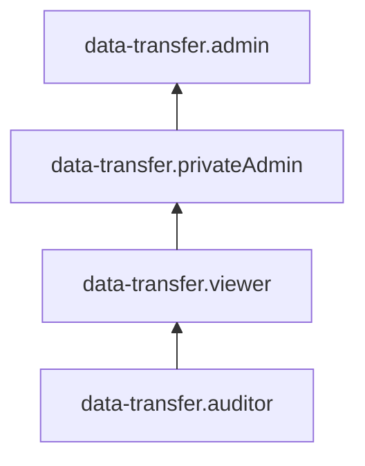

# Управление доступом в {{ data-transfer-name }}

В этом разделе вы узнаете:

* [на какие ресурсы можно назначить роль](#resources);
* [какие роли действуют в сервисе](#roles-list);
* [какие роли необходимы](#required-roles) для того или иного действия.

Для использования сервиса необходимо аутентифицироваться в консоли управления с [аккаунтом на Яндексе](../../iam/concepts/users/accounts.md#passport), [федеративным](../../iam/concepts/users/accounts.md#saml-federation) или [локальным](../../iam/concepts/users/accounts.md#local) аккаунтом.

## Об управлении доступом {#about-access-control}

Все операции в {{ yandex-cloud }} проверяются в сервисе [{{ iam-full-name }}](../../iam/index.md). Если у субъекта нет необходимых разрешений, сервис вернет ошибку.

Чтобы выдать разрешения к ресурсу, [назначьте роли](../../iam/operations/roles/grant.md) на этот ресурс субъекту, который будет выполнять операции. Роли можно назначить [аккаунту на Яндексе](../../iam/concepts/users/accounts.md#passport), [сервисному аккаунту](../../iam/concepts/users/service-accounts.md), [локальному пользователю](../../iam/concepts/users/accounts.md#local), [федеративному пользователю](../../iam/concepts/federations.md), [группе пользователей](../../organization/operations/manage-groups.md), [системной группе](../../iam/concepts/access-control/system-group.md) или [публичной группе](../../iam/concepts/access-control/public-group.md). Подробнее читайте в разделе [{#T}](../../iam/concepts/access-control/index.md).

Назначать роли на ресурс могут пользователи, у которых на этот ресурс есть хотя бы одна из ролей:

* `admin`;
* `resource-manager.admin`;
* `organization-manager.admin`;
* `resource-manager.clouds.owner`;
* `organization-manager.organizations.owner`.

## На какие ресурсы можно назначить роль {#resources}

Роль можно назначить на [организацию](../../organization/concepts/organization.md), [облако](../../resource-manager/concepts/resources-hierarchy.md#cloud) и [каталог](../../resource-manager/concepts/resources-hierarchy.md#folder). Роли, назначенные на организацию, облако или каталог, действуют и на вложенные ресурсы.

## Какие роли действуют в сервисе {#roles-list}

На диаграмме показано, какие роли есть в сервисе и как они наследуют разрешения друг друга. Например, в `{{ roles-editor }}` входят все разрешения `{{ roles-viewer }}`. После диаграммы дано описание каждой роли.

### Сервисные роли {#service-roles}

#### data-transfer.auditor {#data-transfer-auditor}

Роль `data-transfer.auditor` позволяет просматривать метаданные сервиса, в том числе информацию о [каталоге](../../resource-manager/concepts/resources-hierarchy.md#folder), [эндпоинтах](../concepts/index.md#endpoint) и [трансферах](../concepts/index.md#transfer), а также о [квотах](../concepts/limits.md#dataproc-quotas) сервиса {{ data-transfer-name }}.

Сейчас эту роль можно назначить только на каталог или облако.

#### data-transfer.viewer {#data-transfer-viewer}

Роль `data-transfer.viewer` позволяет просматривать информацию о [каталоге](../../resource-manager/concepts/resources-hierarchy.md#folder), [эндпоинтах](../concepts/index.md#endpoint) и [трансферах](../concepts/index.md#transfer), а также о [квотах](../concepts/limits.md#dataproc-quotas) сервиса {{ data-transfer-name }}.

Включает разрешения, предоставляемые ролью `data-transfer.auditor`.

Сейчас эту роль можно назначить только на каталог или облако.

#### data-transfer.privateAdmin {#data-transfer-privateadmin}

Роль `data-transfer.privateAdmin` позволяет управлять эндпоинтами и трансферами с передачей данных только в сетях {{ yandex-cloud }}, а также просматривать информацию о каталоге и квотах сервиса {{ data-transfer-name }}.

Пользователи с этой ролью могут:
* просматривать информацию о [трансферах](../concepts/index.md#transfer), а также создавать, изменять, удалять, активировать, использовать и деактивировать трансферы с передачей данных в сетях {{ yandex-cloud }};
* просматривать информацию об [эндпоинтах](../concepts/index.md#endpoint), а также создавать, изменять и удалять эндпоинты в {{ yandex-cloud }};
* просматривать информацию о [каталоге](../../resource-manager/concepts/resources-hierarchy.md#folder);
* просматривать информацию о [квотах](../concepts/limits.md#dataproc-quotas) сервиса {{ data-transfer-name }}.

Включает разрешения, предоставляемые ролью `data-transfer.viewer`.

Сейчас эту роль можно назначить только на каталог или облако.

#### data-transfer.admin {#data-transfer-admin}

Роль `data-transfer.admin` позволяет управлять эндпоинтами и трансферами с передачей данных в сетях {{ yandex-cloud }} и через интернет, а также просматривать информацию о каталоге и квотах сервиса {{ data-transfer-name }}.

Пользователи с этой ролью могут:
* просматривать информацию о [трансферах](../concepts/index.md#transfer), а также создавать, изменять, удалять, активировать, использовать и деактивировать трансферы с передачей данных как в сетях {{ yandex-cloud }}, так и через интернет;
* просматривать информацию об [эндпоинтах](../concepts/index.md#endpoint), а также создавать, изменять и удалять эндпоинты как в {{ yandex-cloud }}, так и за его пределами;
* просматривать информацию о [каталоге](../../resource-manager/concepts/resources-hierarchy.md#folder);
* просматривать информацию о [квотах](../concepts/limits.md#dataproc-quotas) сервиса {{ data-transfer-name }}.

Включает разрешения, предоставляемые ролью `data-transfer.privateAdmin`.

Сейчас эту роль можно назначить только на каталог или облако.

### Примитивные роли {#primitive-roles}

#### {{ roles-viewer }} {#viewer}

Роль `viewer` предоставляет разрешения на чтение информации о любых [ресурсах]({{ link-docs }}/resource-manager/concepts/resources-hierarchy) Yandex Cloud.

Включает разрешения, предоставляемые ролью `auditor`.

В отличие от роли `auditor`, роль `viewer` предоставляет доступ к данным [сервисов]({{ link-docs }}/overview/concepts/services) в режиме чтения.

#### {{ roles-editor }} {#editor}

Роль `editor` предоставляет разрешения на управление любыми [ресурсами]({{ link-docs }}/resource-manager/concepts/resources-hierarchy) Yandex Cloud, кроме назначения ролей другим пользователям, передачи прав владения [организацией]({{ link-docs }}/organization/concepts/organization) и ее удаления, а также удаления [ключей шифрования]({{ link-docs }}/kms/concepts/) Key Management Service.

Например, пользователи с этой ролью могут создавать, изменять и удалять ресурсы.

Включает разрешения, предоставляемые ролью `viewer`.

#### {{ roles-admin }} {#admin}

Роль `admin` позволяет назначать любые роли, кроме `resource-manager.clouds.owner` и `organization-manager.organizations.owner`, а также предоставляет разрешения на управление любыми [ресурсами]({{ link-docs }}/resource-manager/concepts/resources-hierarchy) Yandex Cloud, кроме передачи прав владения [организацией]({{ link-docs }}/organization/concepts/organization) и ее удаления.

Прежде чем назначить роль `admin` на организацию, [облако]({{ link-docs }}/resource-manager/concepts/resources-hierarchy#cloud) или [платежный аккаунт]({{ link-docs }}/billing/concepts/billing-account), ознакомьтесь с информацией о защите [привилегированных аккаунтов]({{ link-docs }}/security/standard/all#privileged-users).

Включает разрешения, предоставляемые ролью `editor`.

## Какие роли необходимы {#required-roles}

Чтобы пользоваться сервисом, необходима [роль](../../iam/concepts/access-control/roles.md) `editor` или выше на каталог, в котором создаются ресурсы {{ data-transfer-name }}. Роль `viewer` позволит только просматривать список проектов и содержимое файлов, которые были загружены.

Если вы создаете эндпоинт управляемой базы данных для кластера, который находится в другом каталоге, вам потребуется сервисная или примитивная [роль `viewer`](../../iam/roles-reference.md#viewer), выданная на этот каталог.

Если вы создаете эндпоинт управляемой базы данных для стороннего кластера с доступом через интернет, вам потребуется примитивная роль `admin` или сервисная роль `data-transfer.admin` на каталог, в котором создается эндпоинт.

Вы всегда можете назначить роль, которая дает более широкие разрешения (например, `admin` вместо `editor`), или назначить роли, которые разрешают только отдельные действия. Подробнее о том, какие роли нужны для совершения конкретных действий с ресурсами {{ data-transfer-name }}, — в таблице:

| Действие                                                                    | Необходимые роли             |
|-----------------------------------------------------------------------------|------------------------------|
| Получить мета-данные о трансферах и эндпоинтах                              | `data-transfer.viewer`       |
| Получить информацию о квотах сервиса {{ data-transfer-name }}               | `data-transfer.viewer`       |
| Получить информацию о трансферах и эндпоинтах                               | `data-transfer.viewer`       |
| Создать эндпоинт в {{ yandex-cloud }}                                       | `data-transfer.privateAdmin` |
| Изменить эндпоинт в {{ yandex-cloud }}                                      | `data-transfer.privateAdmin` |
| Удалить эндпоинт в {{ yandex-cloud }}                                       | `data-transfer.privateAdmin` |
| Создать трансфер с передачей данных в {{ yandex-cloud }}                    | `data-transfer.privateAdmin` |
| Изменить трансфер с передачей данных в {{ yandex-cloud }}                   | `data-transfer.privateAdmin` |
| Активировать трансфер с передачей данных в {{ yandex-cloud }}               | `data-transfer.privateAdmin` |
| Деактивировать трансфер с передачей данных в {{ yandex-cloud }}             | `data-transfer.privateAdmin` |
| Удалить трансфер с передачей данных в {{ yandex-cloud }}                    | `data-transfer.privateAdmin` |
| Создать эндпоинт в {{ yandex-cloud }} или за его пределами                  | `data-transfer.admin`        |
| Изменить эндпоинт в {{ yandex-cloud }} или за его пределами                 | `data-transfer.admin`        |
| Удалить эндпоинт в {{ yandex-cloud }} или за его пределами                  | `data-transfer.admin`        |
| Создать трансфер с передачей данных в {{ yandex-cloud }} или через интернет | `data-transfer.admin`        |
| Изменить трансфер с передачей данных в {{ yandex-cloud }} или через интернет | `data-transfer.admin`       |
| Активировать трансфер с передачей данных в {{ yandex-cloud }} или через интернет | `data-transfer.admin`   |
| Деактивировать трансфер с передачей данных в {{ yandex-cloud }} или через интернет | `data-transfer.admin` |
| Удалить трансфер с передачей данных в {{ yandex-cloud }} или через интернет | `data-transfer.admin`        |

## Что дальше {#whats-next}

* [Как назначить роль](../../iam/operations/roles/grant.md).
* [Как отозвать роль](../../iam/operations/roles/revoke.md).
* [Подробнее об управлении доступом в {{ yandex-cloud }}](../../iam/concepts/access-control/index.md).
* [Подробнее о наследовании ролей](../../resource-manager/concepts/resources-hierarchy.md#access-rights-inheritance).