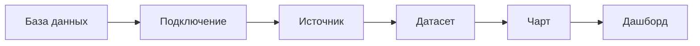
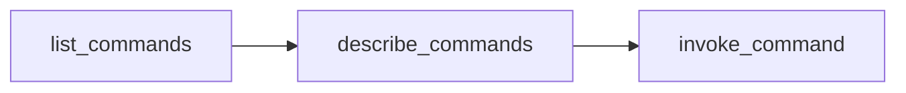

[Документация Yandex Cloud](../../index.md) > [Yandex DataLens](../index.md) > AI-агенты > AI-агенты в DataLens

# AI-агенты в Yandex DataLens

AI-агенты [работают](../operations/ai-agents.md) с DataLens как полноценный инструмент автоматизации. Они могут создавать и изменять подключения, датасеты, чарты и дашборды, анализировать зависимости между объектами, клонировать и переносить контент между воркбуками.

Для этого DataLens предоставляет три уровня интеграции:

| Уровень | Инструмент | Для чего |
| --- | --- | --- |
| Протокол | [MCP-сервер `@datalens-tech/mcp`](https://www.npmjs.com/package/@datalens-tech/mcp) | Прямой доступ AI-агента к [Public API](../operations/api-start.md) через инструменты (tools) в интерактивной сессии |
| Знания | [Навыки `datalens-skills`](https://github.com/datalens-tech/datalens-skills) | Доменные знания о DataLens: модель объектов, различия установок, правильные приемы работы |
| Код | [Python SDK `datalens-sdk`](https://pypi.org/project/datalens-sdk/) | Типизированная автоматизация, которая сохраняется как код в репозитории |

Все три уровня построены поверх Public API и дополняют друг друга: навыки учат AI-агента, *как* работать с DataLens, а MCP-сервер и SDK дают ему *возможность* это делать.


## Как это устроено {#architecture}

```text
AI-агент
  │
  ├── навыки datalens-skills ──── знания: модель объектов, установки, приемы
  │
  ├── MCP-сервер @datalens-tech/mcp ──┐
  │                                   ├──► Public API (api.datalens.tech)
  └── Python SDK datalens-sdk ────────┘
```

Public API DataLens доступно по адресу `api.datalens.tech`, описывается спецификацией OpenAPI и построено в RPC-стиле: вы вызываете именованные команды с JSON-параметрами. Спецификация OpenAPI доступна по адресу `https://api.datalens.tech/json/`. Для аутентификации используются [IAM-токен](../../iam/concepts/authorization/iam-token.md) Yandex Cloud и идентификатор организации в заголовке `x-dl-org-id`. Подробнее в разделе [Работа с Public API](../operations/api-start.md).

Модель данных DataLens, с которой работает AI-агент:



Объекты — [подключения](connection/index.md), [датасеты](../dataset/index.md), [чарты](chart/index.md) и [дашборды](dashboard.md) — хранятся в [воркбуках](../workbooks-collections/index.md), а воркбуки — в коллекциях. Объекты ссылаются друг на друга по идентификаторам, поэтому AI-агенту важно строить их слева направо — ему это знание поставляют навыки.


## MCP-сервер {#mcp}

[MCP-сервер](https://github.com/datalens-tech/datalens-mcp) `@datalens-tech/mcp` открывает AI-агентам доступ к Public API по протоколу [Model Context Protocol](https://modelcontextprotocol.io). При запуске сервер загружает OpenAPI-спецификацию API и превращает каждую команду в вызываемую операцию. Чтобы не регистрировать сотни отдельных инструментов и не переполнять контекст модели, сервер предоставляет компактный шлюз из трех инструментов:

| Инструмент | Назначение |
| --- | --- |
| `list_commands` | Список всех команд API с краткими описаниями — AI-агент вызывает его первым |
| `describe_commands` | Полное описание и схема параметров для выбранных команд |
| `invoke_command` | Вызов команды по имени с передачей параметров |

Типичный сценарий работы AI-агента:



Этот путь хорошо подходит для интерактивных задач — навигации, инспекции объектов, точечных правок. Для создания сложных объектов, например [Wizard-чартов](chart/dataset-based-charts.md), надежнее использовать [Python SDK](#sdk): через MCP AI-агент собирает конфигурацию объекта как сырой JSON без валидации на стороне клиента.


## Python SDK {#sdk}

[datalens-sdk](https://pypi.org/project/datalens-sdk/) — типизированный Python SDK для API DataLens. Он подходит для всего, что нужно сохранить в виде кода: скрипты миграции, генерация дашбордов, экспорт и клонирование объектов, CI-автоматизация.

SDK — рекомендуемый инструмент для создания Wizard-чартов и в целом там, где важно качество автоматизированной визуализации. Конфигурация Wizard-чарта — сложная вложенная структура. SDK дает AI-агенту два преимущества, которых нет у прямых вызовов API: типизированные билдеры проверяют конфигурацию еще до отправки в API, а навык `datalens-sdk` снабжает AI-агента инструкциями по построению визуализаций, соответствующими установленной версии пакета. В результате AI-агент собирает чарты и дашборды предсказуемо валидными, а не подбирает структуру JSON методом проб и ошибок.


### SDK и AI-агенты {#sdk-agents}

Чтобы установить SDK для AI-агента, используйте навык `datalens-sdk` из коллекции `datalens-skills`.

Действия навыка:

* Подбирает безопасное Python-окружение проекта (venv, uv или Poetry) и устанавливает или обновляет пакет с подтверждением пользователя;
* Загружает инструкции по работе с SDK **из установленного пакета**, поэтому они всегда соответствуют фактической версии API, а не устаревшему снимку;
* Подключает слои с деталями конкретной установки DataLens, если они доступны в окружении.

После установки навыка достаточно сформулировать задачу — AI-агент сам выполнит подготовку окружения и напишет корректный код. Пример задачи:

```text
Создай в воркбуке <идентификатор_воркбука> чарт-линию
по датасету <идентификатор_датасета>:
продажи по месяцам с разбивкой по регионам.
```


## Что выбрать: MCP, SDK или API {#choosing}

| Сценарий | Инструмент |
| --- | --- |
| Интерактивные разовые задачи в сессии AI-агента: «найди», «покажи», «переименуй», «проверь зависимости» | MCP-сервер |
| Повторяемая автоматизация, которая сохраняется как код в репозитории: миграции, генерация, CI | Python SDK + навык `datalens-sdk` |
| Создание Wizard-чартов и сложных визуализаций, где важно качество результата | Python SDK + навык `datalens-sdk` |
| Ответы на вопросы о DataLens, выбор подхода, знание модели объектов | Навык `datalens` |
| AI-отчеты в виде автономных HTML-страниц | Навык `datalens-html-pages` |
| Программный доступ из других языков и сред | Public API напрямую (спецификация — `https://api.datalens.tech/json/`) |



Не рекомендуется смешивать MCP и SDK в рамках одной задачи.




## Авторизация и переменные окружения {#auth-env}

По умолчанию сервер сам получает IAM-токен с помощью команды `yc iam create-token`: токен запрашивается при первом обращении к API и автоматически обновляется до истечения срока действия. Для этого обязательна переменная `DATALENS_ORG_ID`.

MCP-сервер и SDK поддерживают статическую авторизацию готовым IAM-токеном. Это позволяет использовать AI-агенты, когда Yandex Cloud CLI недоступен, например в изолированном окружении. Срок жизни IAM-токена — 12 часов, и обновлять его в этом режиме нужно самостоятельно.

Пример статической авторизации без Yandex Cloud CLI:

```json
"env": {
  "DATALENS_ORG_ID": "<идентификатор_организации>",
  "DATALENS_YC_STATIC_AUTH": "1",
  "DATALENS_API_AUTH_HEADER": "Bearer <IAM-токен>"
}
```

| Переменная | Обязательна | По умолчанию | Назначение |
| --- | --- | --- | --- |
| `DATALENS_ORG_ID`             | Да | — | Идентификатор организации для заголовка `x-dl-org-id` |
| `DATALENS_API_URL`            | —  | `https://api.datalens.tech` | Базовый URL API |
| `DATALENS_YC_PROFILE`         | —  | Активный профиль | Имя профиля Yandex Cloud CLI |
| `DATALENS_YC_BIN`             | —  | `yc` | Путь к бинарному файлу `yc` |
| `DATALENS_YC_STATIC_AUTH`     | —  | — | `1` — статическая авторизация вместо Yandex Cloud CLI |
| `DATALENS_API_AUTH_HEADER`    | —  | — | Значение заголовка `Authorization` при статической авторизации |
| `DATALENS_SCHEMA_URL`         | —  | `{DATALENS_API_URL}/json/` | URL OpenAPI-спецификации |
| `DATALENS_API_VERSION`        | —  | `latest` | Версия API для заголовка `x-dl-api-version` |
| `DATALENS_MAX_RESPONSE_CHARS` | —  | `100000` | Лимит длины ответа, сверх которого ответ усекается |


## Навыки (Agent Skills) {#skills}

MCP-сервер и SDK дают AI-агенту доступ к API, но не знание предметной области: с какой установкой DataLens идет работа, как связаны объекты, в каком порядке их создавать, каких ошибок избегать. Эти знания поставляет репозиторий [datalens-tech/datalens-skills](https://github.com/datalens-tech/datalens-skills) — официальная коллекция навыков по открытому стандарту [Agent Skills](https://agentskills.io). Каждый навык — папка с файлом `SKILL.md`, опциональными скриптами и справочными материалами. Навыки переносимы между совместимыми AI-агентами.


### Состав коллекции {#skills-list}

| Навык | Назначение |
| --- | --- |
| `datalens` | Стартовая точка: что такое DataLens, модель объектов, выбор интерфейса. Маршрутизирует к остальным навыкам |
| `datalens-sdk` | Работа с DataLens из Python: подключения, датасеты, чарты, дашборды. Сам подготавливает окружение и загружает инструкции, соответствующие установленной версии SDK |
| `datalens-html-pages` | Создание, валидация и публикация автономных HTML-страниц (AI-отчетов), которые DataLens строит в изолированном iframe |
| `datalens-yc-rls-resolve` | Преобразование пользователей и групп Yandex Cloud в идентификаторы субъектов для RLSv2, миграция legacy-конфигураций `rls` |


## Особенности и ограничения {#limitations}

* На запросы к Public API действуют [лимиты](limits.md).
* Срок жизни IAM-токена — 12 часов. При авторизации через Yandex Cloud CLI MCP-сервер и SDK обновляют его автоматически. При статической авторизации обновление токена и перезапуск MCP-сервера — на стороне пользователя.
* AI-агент работает с объектами DataLens, но не интерпретирует бизнес-значения метрик и не взаимодействует с веб-интерфейсом. Например, AI-агент не может сделать скриншот или нажать кнопку.


## Полезные ссылки {#see-also}

* [Использование Yandex DataLens с AI-агентами](../operations/ai-agents.md)
* [Работа с Public API в Yandex DataLens](../operations/api-start.md)
* [MCP-сервер @datalens-tech/mcp](https://github.com/datalens-tech/datalens-mcp)
* [npm](https://www.npmjs.com/package/@datalens-tech/mcp)
* [Коллекция навыков datalens-skills](https://github.com/datalens-tech/datalens-skills)
* [Python SDK datalens-sdk](https://pypi.org/project/datalens-sdk/)
* [Стандарт Agent Skills](https://agentskills.io)
* [Model Context Protocol](https://modelcontextprotocol.io)