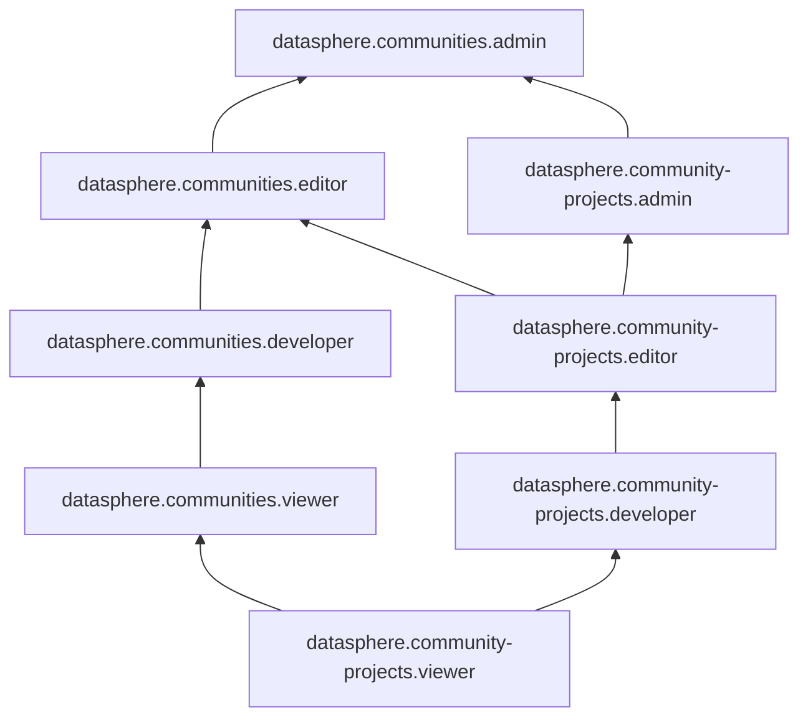

# Управление доступом в {{ ml-platform-name }}

Доступ к сервису {{ ml-platform-full-name }} регулируется путем назначения прав в организации. Управление организациями осуществляется с помощью сервиса [{{ org-full-name }}](../../organization/index.md).

Список операций, доступных пользователю {{ ml-platform-short-name }}, определяется его ролью. Роли можно назначить аккаунту на Яндексе, [сервисному аккаунту](../../iam/concepts/users/service-accounts.md), [федеративным](../../iam/concepts/users/accounts.md#saml-federation) или [локальным](../../iam/concepts/users/accounts.md#local) пользователям, [группе пользователей](../../organization/operations/manage-groups.md), [системной группе](../../iam/concepts/access-control/system-group.md) или [публичной группе](../../iam/concepts/access-control/public-group.md). Подробнее об управлении доступом в {{ yandex-cloud }} см. раздел [{#T}](../../iam/concepts/access-control/index.md).

## На какие ресурсы можно назначить роль {#resources}

Разграничение прав доступа происходит на уровне [сообществ](../concepts/community.md) и [проектов](../concepts/project.md). Также вы можете открыть доступ к ресурсу для всех пользователей сообщества, [опубликовав](../operations/index.md#share) его в сообществе. Выданные права доступа распространяются на всю иерархию ресурсов. Например, если вы назначите пользователю роль на проект {{ ml-platform-name }}, то все разрешения будут действовать и на ресурсы внутри этого проекта. Подробнее о [взаимосвязи ресурсов в {{ ml-platform-name }}](../concepts/resource-model.md).

## Как назначить роль {#grant-role}

Вы можете назначить роль пользователю в интерфейсе {{ ml-platform-name }}:
* [{#T}](../operations/community/add-user.md).
* [{#T}](../operations/projects/add-user.md).
* [Поделиться ресурсами с участниками сообщества](../operations/index.md#share).

Также вы можете назначить права доступа через [интерфейс {{ org-full-name }} в {{ cloud-center }}]({{ link-org-cloud-center }}), с помощью [{{ TF }}]({{ tf-provider-link }}) и [API {{ yandex-cloud }}](../api-ref/authentication.md).

## Какие роли действуют в сервисе {#roles-list}

### Сервисные роли {#service-roles}

#### datasphere.community-projects.viewer {#datasphere-communityprojects-viewer}

Роль `datasphere.community-projects.viewer` позволяет просматривать информацию о [проектах](../concepts/project.md), настройках проектов и закрепленных за ними [ресурсах](../concepts/resources.md), а также о назначенных [правах доступа](../../iam/concepts/access-control/index.md) к проектам.

В интерфейсе {{ ml-platform-name }} пользователи с ролью `datasphere.community-projects.viewer` имеют роль `Viewer` на вкладке **Участники** на странице проекта.

#### datasphere.community-projects.developer {#datasphere-communityprojects-developer}

Роль `datasphere.community-projects.developer` позволяет работать в проектах и управлять ресурсами, которые закреплены за проектами.

Пользователи с этой ролью могут:
* просматривать информацию о [проектах](../concepts/project.md), настройках проектов и закрепленных за ними [ресурсах](../concepts/resources.md);
* создавать, изменять и удалять ресурсы в проектах;
* запускать IDE и исполнение ячеек с кодом в проектах;
* просматривать информацию о назначенных [правах доступа](../../iam/concepts/access-control/index.md) к проектам.

Включает разрешения, предоставляемые ролью `datasphere.community-projects.viewer`.

В интерфейсе {{ ml-platform-name }} пользователи с ролью `datasphere.community-projects.developer` имеют роль `Developer` на вкладке **Участники** на странице проекта.

#### datasphere.community-projects.editor {#datasphere-communityprojects-editor}

Роль `datasphere.community-projects.editor` позволяет работать в проектах, изменять и удалять их, а также управлять ресурсами, которые закреплены за проектами, и делиться такими ресурсами в сообществе.

Пользователи с этой ролью могут:
* просматривать информацию о [проектах](../concepts/project.md), настройках проектов и закрепленных за ними ресурсах, а также изменять и удалять проекты;
* создавать, изменять и удалять [ресурсы](../concepts/resources.md) в проектах, а также делиться ресурсами этого проекта с сообществами, в которых пользователь имеет права `Developer` (роль `datasphere.communities.developer` и выше);
* запускать IDE и исполнение ячеек с кодом в проектах;
* просматривать информацию о назначенных [правах доступа](../../iam/concepts/access-control/index.md) к проектам.

Включает разрешения, предоставляемые ролью `datasphere.community-projects.developer`.

В интерфейсе {{ ml-platform-name }} пользователи с ролью `datasphere.community-projects.editor` имеют роль `Editor` на вкладке **Участники** на странице проекта.

#### datasphere.community-projects.admin {#datasphere-communityprojects-admin}

Роль `datasphere.community-projects.admin` позволяет управлять доступом к проектам, работать в них, изменять и удалять проекты, а также управлять ресурсами, которые закреплены за проектами, и делиться такими ресурсами в сообществе.

Пользователи с этой ролью могут:
* просматривать информацию о назначенных [правах доступа](../../iam/concepts/access-control/index.md) к проектам и изменять права доступа;
* просматривать информацию о [проектах](../concepts/project.md), настройках проектов и закрепленных за ними ресурсах, а также изменять и удалять проекты;
* создавать, изменять и удалять [ресурсы](../concepts/resources.md) в проектах, а также делиться ресурсами этого проекта с сообществами, в которых пользователь имеет роль `Developer` (`datasphere.communities.developer`) и выше;
* запускать IDE и исполнение ячеек с кодом в проектах.

Включает разрешения, предоставляемые ролью `datasphere.community-projects.editor`.

В интерфейсе {{ ml-platform-name }} пользователи с ролью `datasphere.community-projects.admin` имеют роль `Admin` на вкладке **Участники** на странице проекта.

#### datasphere.communities.viewer {#datasphere-communities-viewer}

Роль `datasphere.communities.viewer` позволяет просматривать информацию о сообществах и проектах, а также о назначенных правах доступа к ним.

Пользователи с этой ролью могут:
* просматривать информацию о [сообществах](../concepts/community.md) и назначенных [правах доступа](../../iam/concepts/access-control/index.md) к ним;
* просматривать информацию о [проектах](../concepts/project.md) сообществ, настройках проектов и закрепленных за ними [ресурсах](../concepts/resources.md), а также о назначенных правах доступа к проектам;
* просматривать информацию об [организации](../../organization/concepts/organization.md).

Включает разрешения, предоставляемые ролью `datasphere.community-projects.viewer`.

В интерфейсе {{ ml-platform-name }} пользователи с ролью `datasphere.communities.viewer` имеют роль `Viewer` на вкладке **Участники** на странице сообщества.

#### datasphere.communities.developer {#datasphere-communities-developer}

Роль `datasphere.communities.developer` позволяет создавать новые проекты и публиковать ресурсы проектов в сообществах, а также просматривать информацию о сообществах и проектах.

Пользователи с этой ролью могут:
* просматривать информацию о [сообществах](../concepts/community.md) и назначенных [правах доступа](../../iam/concepts/access-control/index.md) к ним;
* создавать новые [проекты](../concepts/project.md) в сообществах;
* публиковать [ресурсы](../concepts/resources.md) проектов в сообществах, в которых пользователь имеет права `Developer` (роль `datasphere.communities.developer`) и выше;
* просматривать информацию о проектах, настройках проектов и закрепленных за ними ресурсах, а также о назначенных правах доступа к проектам;
* просматривать информацию об [организации](../../organization/concepts/organization.md).

Включает разрешения, предоставляемые ролью `datasphere.communities.viewer`.

В интерфейсе {{ ml-platform-name }} пользователи с ролью `datasphere.communities.developer` имеют роль `Developer` на вкладке **Участники** на странице сообщества.

#### datasphere.communities.editor {#datasphere-communities-editor}

Роль `datasphere.communities.editor` позволяет привязывать платежный аккаунт к сообществам, удалять сообщества и редактировать их настройки, а также управлять проектами и ресурсами сообществ.

Пользователи с этой ролью могут:
* просматривать информацию о [сообществах](../concepts/community.md) и назначенных [правах доступа](../../iam/concepts/access-control/index.md) к ним, а также изменять и удалять сообщества;
* привязывать [платежный аккаунт](../../billing/concepts/billing-account.md) к сообществам;
* создавать новые [проекты](../concepts/project.md) в сообществах, а также изменять и удалять проекты;
* просматривать информацию о проектах, настройках проектов и закрепленных за ними ресурсах, а также о назначенных правах доступа к проектам;
* создавать, изменять и удалять [ресурсы](../concepts/resources.md) в проектах, а также публиковать ресурсы проектов в сообществах, в которых пользователь имеет права `Developer` (роль `datasphere.communities.developer`) и выше;
* запускать IDE и исполнение ячеек с кодом в проектах;
* просматривать информацию об [организации](../../organization/concepts/organization.md).

Включает разрешения, предоставляемые ролями `datasphere.communities.developer` и `datasphere.community-projects.editor`.

В интерфейсе {{ ml-platform-name }} пользователи с ролью `datasphere.communities.editor` имеют роль `Editor` на вкладке **Участники** на странице сообщества.

#### datasphere.communities.admin {#datasphere-communities-admin}

Роль `datasphere.communities.admin` позволяет управлять сообществами и проектами сообществ, а также доступом к ним.

Пользователи с этой ролью могут:
* просматривать информацию о [сообществах](../concepts/community.md), а также изменять и удалять сообщества;
* просматривать информацию о назначенных [правах доступа](../../iam/concepts/access-control/index.md) к сообществам и изменять права доступа;
* привязывать [платежный аккаунт](../../billing/concepts/billing-account.md) к сообществам;
* создавать новые [проекты](../concepts/project.md) в сообществах, а также изменять и удалять проекты;
* просматривать информацию о проектах, настройках проектов и закрепленных за ними ресурсах;
* просматривать информацию о назначенных правах доступа к проектам и изменять права доступа;
* создавать, изменять и удалять [ресурсы](../concepts/resources.md) в проектах, а также публиковать ресурсы проектов в сообществах, в которых пользователь имеет права `Developer` (роль `datasphere.communities.developer` и выше);
* запускать IDE и исполнение ячеек с кодом в проектах;
* просматривать информацию об [организации](../../organization/concepts/organization.md).

Включает разрешения, предоставляемые ролями `datasphere.communities.editor` и `datasphere.community-projects.admin`.

В интерфейсе {{ ml-platform-name }} пользователи с ролью `datasphere.communities.admin` имеют роль `Admin` на вкладке **Участники** на странице сообщества.

> Например, Валя работает с несколькими командами и состоит в их сообществах с разными правами доступа:
  
  * в сообществе <q>Любители котиков</q> — `Admin` (роль `{{ roles-datasphere-communities-admin }}`);
  * в сообществе <q>Считаем заборы</q> — `Developer` (роль `{{ roles-datasphere-communities-developer }}`);
  * в сообществе <q>Совершенно секретно</q> — `Viewer` (роль `{{ roles-datasphere-communities-viewer }}`), но имеет права `Editor` в проекте <q>Project_111</q> этого сообщества (роль `{{ roles-datasphere-project-editor }}`).
  
  Валя может:
  
  * поделиться ресурсами любого проекта из сообщества <q>Любители котиков</q> в этом сообществе.
  * поделиться ресурсами любого проекта из сообщества <q>Любители котиков</q> в сообществе <q>Считаем заборы</q>.
  * опубликовать ресурсы проекта <q>Project_111</q> в сообществах <q>Любители котиков</q> и <q>Считаем заборы</q>, но не сможет поделиться ими в сообществе <q>Совершенно секретно</q>.

### Примитивные роли {#primitive-roles}

Примитивные роли позволяют пользователям совершать действия во [всех сервисах](../../overview/concepts/services.md) {{ yandex-cloud }}.

#### {{ roles-auditor }} {#auditor}

Роль `auditor` предоставляет разрешения на чтение конфигурации и метаданных любых ресурсов Yandex Cloud без возможности доступа к данным.

Например, пользователи с этой ролью могут:
* просматривать информацию о [ресурсе]({{ link-docs }}/resource-manager/concepts/resources-hierarchy);
* просматривать метаданные ресурса;
* просматривать список операций с ресурсом.

Роль `auditor` — наиболее безопасная роль, исключающая доступ к данным [сервисов]({{ link-docs }}/overview/concepts/services). Роль подходит для пользователей, которым необходим минимальный уровень доступа к ресурсам Yandex Cloud.

#### {{ roles-viewer }} {#viewer}

Роль `viewer` предоставляет разрешения на чтение информации о любых [ресурсах]({{ link-docs }}/resource-manager/concepts/resources-hierarchy) Yandex Cloud.

Включает разрешения, предоставляемые ролью `auditor`.

В отличие от роли `auditor`, роль `viewer` предоставляет доступ к данным [сервисов]({{ link-docs }}/overview/concepts/services) в режиме чтения.

#### {{ roles-editor }} {#editor}

Роль `editor` предоставляет разрешения на управление любыми [ресурсами]({{ link-docs }}/resource-manager/concepts/resources-hierarchy) Yandex Cloud, кроме назначения ролей другим пользователям, передачи прав владения [организацией]({{ link-docs }}/organization/concepts/organization) и ее удаления, а также удаления [ключей шифрования]({{ link-docs }}/kms/concepts/) Key Management Service.

Например, пользователи с этой ролью могут создавать, изменять и удалять ресурсы.

Включает разрешения, предоставляемые ролью `viewer`.

#### {{ roles-admin }} {#admin}

Роль `admin` позволяет назначать любые роли, кроме `resource-manager.clouds.owner` и `organization-manager.organizations.owner`, а также предоставляет разрешения на управление любыми [ресурсами]({{ link-docs }}/resource-manager/concepts/resources-hierarchy) Yandex Cloud, кроме передачи прав владения [организацией]({{ link-docs }}/organization/concepts/organization) и ее удаления.

Прежде чем назначить роль `admin` на организацию, [облако]({{ link-docs }}/resource-manager/concepts/resources-hierarchy#cloud) или [платежный аккаунт]({{ link-docs }}/billing/concepts/billing-account), ознакомьтесь с информацией о защите [привилегированных аккаунтов]({{ link-docs }}/security/standard/all#privileged-users).

Включает разрешения, предоставляемые ролью `editor`.

Вместо примитивных ролей мы рекомендуем использовать роли сервисов. Такой подход позволит более гранулярно управлять доступом и обеспечить соблюдение [принципа минимальных привилегий](../../security/standard/all.md#min-privileges).

Подробнее о примитивных ролях см. в [справочнике ролей {{ yandex-cloud }}](../../iam/roles-reference.md#primitive-roles).

## Какие роли мне необходимы {#choosing-roles}

В таблице ниже перечислено, какие роли нужны для выполнения указанного действия. Вы всегда можете назначить роль, которая дает более широкие разрешения, нежели указанная. Например, назначить `Editor` вместо `Viewer`.

#|
|| **Действие** | **Необходимые роли** ||
|| **Просмотр информации** ||
|| Просмотр проекта, его настроек и пользователей | `Viewer` на проект ||
|| Просмотр сообщества, его настроек и пользователей | `Viewer` на сообщество ||
|| **Управление проектом** ||
|| [Создание проекта](../operations/projects/create.md) | `Developer` на сообщество ||
|| Запуск IDE | `Developer` на проект ||
|| Использование ресурсов | `Developer` на проект ||
|| Создание ресурсов | `Developer` на проект ||
|| Удаление ресурсов | `Developer` на проект ||
|| Публикация ресурсов в сообществе | `Editor` на проект и `Developer` на сообщество ||
|| [Изменение настроек проекта](../operations/projects/update.md) | `Editor` на проект ||
|| [Удаление проекта](../operations/projects/delete.md) | `Editor` на проект ||
|| [Выдача роли](#grant-role) в проекте | `Admin` на проект ||
|| **Управление сообществом** ||
|| Изменение настроек сообщества | `Editor` на сообщество ||
|| [Привязка платежного аккаунта](../operations/community/link-ba.md) | `Editor` на сообщество и `billing.accounts.editor` на платежный аккаунт ||
|| [Удаление сообщества](../operations/community/delete.md) | `Editor` на сообщество ||
|| [Выдача роли](#grant-role) в сообществе | `Admin` на сообщество ||
|#

#### См. также {#see-also}

* [{{ org-full-name }}](../../organization/index.md).
* [{#T}](../../iam/concepts/access-control/index.md).
* [{#T}](../../iam/concepts/users/service-accounts.md).
* [Подробнее о наследовании ролей](../../resource-manager/concepts/resources-hierarchy.md#access-rights-inheritance).