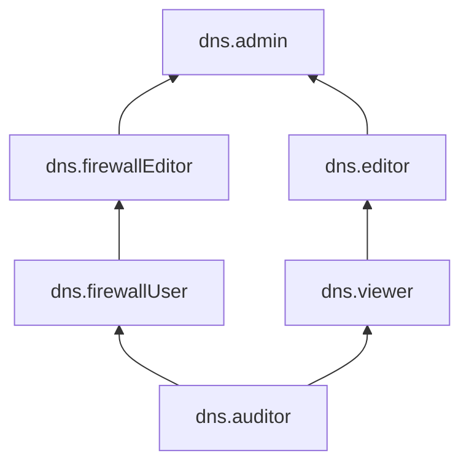

# Управление доступом в Cloud DNS

В этом разделе вы узнаете:
* [на какие ресурсы можно назначить роль](#resources);
* [какие роли действуют в сервисе](#roles-list);
* [какие роли необходимы](#required-roles) для того или иного действия.

## Об управлении доступом {#about-access-control}

Все операции в Yandex Cloud проверяются в сервисе [Yandex Identity and Access Management](../../iam/index.md). Если у субъекта нет необходимых разрешений, сервис вернет ошибку.

Чтобы выдать разрешения к ресурсу, [назначьте роли](../../iam/operations/roles/grant.md) на этот ресурс субъекту, который будет выполнять операции. Роли можно назначить [аккаунту на Яндексе](../../iam/concepts/users/accounts.md#passport), [сервисному аккаунту](../../iam/concepts/users/service-accounts.md), [локальному пользователю](../../iam/concepts/users/accounts.md#local), [федеративному пользователю](../../iam/concepts/federations.md), [группе пользователей](../../organization/operations/manage-groups.md), [системной группе](../../iam/concepts/access-control/system-group.md) или [публичной группе](../../iam/concepts/access-control/public-group.md). Подробнее читайте в разделе [Как устроено управление доступом в Yandex Cloud](../../iam/concepts/access-control/index.md).

Назначать роли на ресурс могут пользователи, у которых на этот ресурс есть роль `dns.admin` или одна из следующих ролей:

* `admin`;
* `resource-manager.admin`;
* `organization-manager.admin`;
* `resource-manager.clouds.owner`;
* `organization-manager.organizations.owner`.

## На какие ресурсы можно назначить роль {#resources}

Роль можно назначить на [организацию](../../organization/concepts/organization.md), [облако](../../resource-manager/concepts/resources-hierarchy.md#cloud) и [каталог](../../resource-manager/concepts/resources-hierarchy.md#folder). Роли, назначенные на организацию, облако или каталог, действуют и на вложенные ресурсы.

На [зону DNS](../concepts/dns-zone.md) роль можно назначить через Yandex Cloud [CLI](../../cli/cli-ref/dns/cli-ref/zone/add-access-binding.md), [API](../api-ref/authentication.md) или [Terraform](../../terraform/resources/dns_zone_iam_binding.md).

## Какие роли действуют в сервисе {#roles-list}

На диаграмме показано, какие роли есть в сервисе и как они наследуют разрешения друг друга. Например, в `editor` входят все разрешения `viewer`. После диаграммы дано описание каждой роли.

### Сервисные роли {#service-roles}

#### dns.auditor {#dns-auditor}

Роль `dns.auditor` позволяет просматривать информацию о [DNS-зонах](../concepts/dns-zone.md) и назначенных [правах доступа](../../iam/concepts/access-control/index.md) к ним, а также о [каталоге](../../resource-manager/concepts/resources-hierarchy.md#folder) и [квотах](../concepts/limits.md#cloud-dns-quotas) сервиса Cloud DNS. Роль не дает доступа к [ресурсным записям](../concepts/resource-record.md).

#### dns.viewer {#dns-viewer}

Роль `dns.viewer` позволяет просматривать информацию о [DNS-зонах](../concepts/dns-zone.md) и назначенных [правах доступа](../../iam/concepts/access-control/index.md) к ним, о [ресурсных записях](../concepts/resource-record.md), а также о [каталоге](../../resource-manager/concepts/resources-hierarchy.md#folder) и [квотах](../concepts/limits.md#cloud-dns-quotas) сервиса Cloud DNS.

Включает разрешения, предоставляемые ролью `dns.auditor`.

#### dns.editor {#dns-editor}

Роль `dns.editor` позволяет управлять DNS-зонами и ресурсными записями, а также просматривать информацию о каталоге и квотах сервиса Cloud DNS.

Пользователи с этой ролью могут:
* просматривать информацию о [DNS-зонах](../concepts/dns-zone.md), а также создавать, использовать, изменять и удалять их;
* просматривать информацию о [ресурсных записях](../concepts/resource-record.md), а также создавать, изменять и удалять их;
* создавать вложенные публичные DNS-зоны;
* просматривать информацию о назначенных [правах доступа](../../iam/concepts/access-control/index.md) к DNS-зонам;
* просматривать информацию о [квотах](../concepts/limits.md#cloud-dns-quotas) сервиса Cloud DNS;
* просматривать информацию о [каталоге](../../resource-manager/concepts/resources-hierarchy.md#folder).

Включает разрешения, предоставляемые ролью `dns.viewer`.

#### dns.firewallUser {#dns-firewallUser}

Роль `dns.firewallUser` позволяет использовать облака, каталоги и облачные сети в качестве ресурсов для DNS-фильтров, а также просматривать информацию о ресурсах и квотах сервиса Cloud DNS.

Пользователи с этой ролью могут:
* просматривать информацию о DNS-фильтрах и назначенных [правах доступа](../../iam/concepts/access-control/index.md) к ним;
* использовать [облака](../../resource-manager/concepts/resources-hierarchy.md#cloud), [каталоги](../../resource-manager/concepts/resources-hierarchy.md#folder) и [облачные сети](../../vpc/concepts/network.md#network) в качестве ресурсов для DNS-фильтров;
* просматривать информацию о [DNS-зонах](../concepts/dns-zone.md) и назначенных правах доступа к ним;
* просматривать информацию о [квотах](../concepts/limits.md#cloud-dns-quotas) сервиса Cloud DNS;
* просматривать информацию о каталоге.

Включает разрешения, предоставляемые ролью `dns.auditor`.

#### dns.firewallEditor {#dns-firewallEditor}

Роль `dns.firewallEditor` позволяет управлять DNS-фильтрами и использовать облака, каталоги и облачные сети в качестве ресурсов для них.

Пользователи с этой ролью могут:
* просматривать информацию о DNS-фильтрах и назначенных [правах доступа](../../iam/concepts/access-control/index.md) к ним;
* создавать, изменять и удалять DNS-фильтры;
* использовать [облака](../../resource-manager/concepts/resources-hierarchy.md#cloud), [каталоги](../../resource-manager/concepts/resources-hierarchy.md#folder) и [облачные сети](../../vpc/concepts/network.md#network) в качестве ресурсов для DNS-фильтров;
* просматривать информацию о [DNS-зонах](../concepts/dns-zone.md) и назначенных правах доступа к ним;
* просматривать информацию о [квотах](../concepts/limits.md#cloud-dns-quotas) сервиса Cloud DNS;
* просматривать информацию о каталоге.

Включает разрешения, предоставляемые ролью `dns.firewallUser`.

#### dns.admin {#dns-admin}

Роль `dns.admin` позволяет управлять ресурсами сервиса Cloud DNS и доступом к ним.

Пользователи с этой ролью могут:
* просматривать информацию о назначенных [правах доступа](../../iam/concepts/access-control/index.md) к [DNS-зонам](../concepts/dns-zone.md) и DNS-фильтрам, а также изменять такие права доступа;
* просматривать информацию о DNS-зонах, а также создавать, использовать, изменять и удалять их;
* создавать вложенные публичные DNS-зоны;
* просматривать информацию о DNS-фильтрах, а также создавать, изменять и удалять их;
* использовать [облака](../../resource-manager/concepts/resources-hierarchy.md#cloud), [каталоги](../../resource-manager/concepts/resources-hierarchy.md#folder) и [облачные сети](../../vpc/concepts/network.md#network) в качестве ресурсов для DNS-фильтров;
* просматривать информацию о [ресурсных записях](../concepts/resource-record.md), а также создавать, изменять и удалять их;
* просматривать информацию о [квотах](../concepts/limits.md#cloud-dns-quotas) сервиса Cloud DNS;
* просматривать информацию о каталоге.

Включает разрешения, предоставляемые ролями `dns.editor` и `dns.firewallEditor`.

### Примитивные роли {#primitive-roles}

Примитивные роли позволяют пользователям совершать действия во [всех сервисах](../../overview/concepts/services.md) Yandex Cloud.

#### auditor {#auditor}

Роль `auditor` предоставляет разрешения на чтение конфигурации и метаданных любых ресурсов Yandex Cloud без возможности доступа к данным.

Например, пользователи с этой ролью могут:
* просматривать информацию о [ресурсе](../../resource-manager/concepts/resources-hierarchy.md);
* просматривать метаданные ресурса;
* просматривать список операций с ресурсом.

Роль `auditor` — наиболее безопасная роль, исключающая доступ к данным [сервисов](../../overview/concepts/services.md). Роль подходит для пользователей, которым необходим минимальный уровень доступа к ресурсам Yandex Cloud.

#### viewer {#viewer}

Роль `viewer` предоставляет разрешения на чтение информации о любых [ресурсах](../../resource-manager/concepts/resources-hierarchy.md) Yandex Cloud.

Включает разрешения, предоставляемые ролью `auditor`.

В отличие от роли `auditor`, роль `viewer` предоставляет доступ к данным [сервисов](../../overview/concepts/services.md) в режиме чтения.

#### editor {#editor}

Роль `editor` предоставляет разрешения на управление любыми [ресурсами](../../resource-manager/concepts/resources-hierarchy.md) Yandex Cloud, кроме назначения ролей другим пользователям, передачи прав владения [организацией](../../organization/concepts/organization.md) и ее удаления, а также удаления [ключей шифрования](../../kms/concepts/index.md) Key Management Service.

Например, пользователи с этой ролью могут создавать, изменять и удалять ресурсы.

Включает разрешения, предоставляемые ролью `viewer`.

#### admin {#admin}

Роль `admin` позволяет назначать любые роли, кроме `resource-manager.clouds.owner` и `organization-manager.organizations.owner`, а также предоставляет разрешения на управление любыми [ресурсами](../../resource-manager/concepts/resources-hierarchy.md) Yandex Cloud, кроме передачи прав владения [организацией](../../organization/concepts/organization.md) и ее удаления.

Прежде чем назначить роль `admin` на организацию, [облако](../../resource-manager/concepts/resources-hierarchy.md#cloud) или [платежный аккаунт](../../billing/concepts/billing-account.md), ознакомьтесь с информацией о защите [привилегированных аккаунтов](../../security/standard/all.md#privileged-users).

Включает разрешения, предоставляемые ролью `editor`.

Вместо примитивных ролей мы рекомендуем использовать роли сервисов. Такой подход позволит более гранулярно управлять доступом и обеспечить соблюдение [принципа минимальных привилегий](../../security/standard/all.md#min-privileges).

Подробнее о примитивных ролях в [справочнике ролей Yandex Cloud](../../iam/roles-reference.md#primitive-roles).

## Какие роли мне необходимы {#required-roles}

В таблице ниже перечислено, какие роли нужны для выполнения указанного действия. Вы всегда можете назначить роль, которая дает более широкие разрешения, нежели указанная. Например, назначить `editor` вместо `viewer` или `dns.admin` вместо `dns.editor`.

| Действие                                                                                                                                            |                              Методы                               | Необходимые роли                                                                                                                                                                            |
|:----------------------------------------------------------------------------------------------------------------------------------------------------|:-----------------------------------------------------------------:|:--------------------------------------------------------------------------------------------------------------------------------------------------------------------------------------------|
| **Просмотр метаинформации**                                                                                                                         |                                                                   |                                                                                                                                                                                             |
| Просмотр информации о DNS-зонах                                                                                                                     |                           `get`, `list`                           | `dns.auditor` на этот ресурс                                                                                                                                                                |
| **Просмотр информации**                                                                                                                             |                                                                   |                                                                                                                                                                                             |
| Просмотр информации о DNS-зонах и ресурсных записях в них                                                                                           |                  `get`, `list`, `listRecordSets`                  | `viewer` или `dns.viewer` на этот ресурс                                                                                                                                                    |
| **Управление DNS-зонами**                                                                                                                           |                                                                   |                                                                                                                                                                                             |
| Создание зоны                                                                                                                                       |                             `create`                              | `editor` или `dns.editor` на каталог, а также `vpc.user` на этот каталог или сеть VPC, если зона внутренняя                                                                |
| Изменение, удаление зон                                                                                                                             |                        `update`, `delete`                         | `editor` или `dns.editor` на каталог, а также `vpc.user` на этот каталог или сеть VPC, если зона внутренняя                                                                |
| Создание подзон                                                                                                                                     |                             `create`                              | `editor` или `dns.editor` на каталог, где находится зона, частями которой будут создаваемые подзоны, а также `vpc.user` на этот каталог или сеть VPC, если зона внутренняя |
| **Управление ресурсными записями**                                                                                                                  |                                                                   |                                                                                                                                                                            |
| Создание ресурсных записей в DNS-зоне                                                                                                               |                             `create`                              | `editor` или `dns.editor` на каталог или зону                                                                                                                              |
| Изменение, удаление ресурсных записей                                                                                                               |                        `update`, `delete`                         | `editor` или `dns.editor`                                                                                                                                                  |
| **Управление доступом к DNS-зонам**                                                                                                                 |                                                                   |                                                                                                                                                                            |
| [Назначение роли](../../iam/operations/roles/grant.md), [отзыв роли](../../iam/operations/roles/revoke.md) и просмотр назначенных ролей на DNS-зоны | `setAccessBindings`, `updateAccessBindings`, `listAccessBindings` | `admin` или `dns.admin` на каталог или зону                                                                                                                                |

Чтобы ограничить доступ пользователям, назначайте им роли на отдельные зоны или подзоны. 

#### Что дальше {#next}

* [Как назначить роль](../../iam/operations/roles/grant.md).
* [Как отозвать роль](../../iam/operations/roles/revoke.md).
* [Подробнее об управлении доступом в Yandex Cloud](../../iam/concepts/access-control/index.md).
* [Подробнее о наследовании ролей](../../resource-manager/concepts/resources-hierarchy.md#access-rights-inheritance).