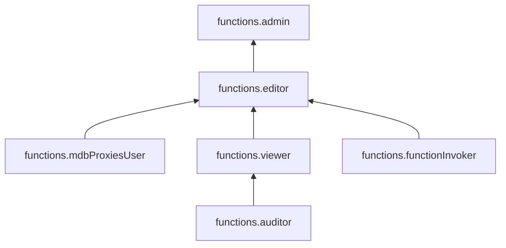

# Управление доступом в {{ sf-name }}

В этом разделе вы узнаете:

* [на какие ресурсы можно назначить роль](#resources);
* [какие роли действуют в сервисе](#roles-list).

## Об управлении доступом {#about-access-control}

Все операции в {{ yandex-cloud }} проверяются в сервисе [{{ iam-full-name }}](../../iam/index.md). Если у субъекта нет необходимых разрешений, сервис вернет ошибку.

Чтобы выдать разрешения к ресурсу, [назначьте роли](../../iam/operations/roles/grant.md) на этот ресурс субъекту, который будет выполнять операции. Роли можно назначить [аккаунту на Яндексе](../../iam/concepts/users/accounts.md#passport), [сервисному аккаунту](../../iam/concepts/users/service-accounts.md), [локальному пользователю](../../iam/concepts/users/accounts.md#local), [федеративному пользователю](../../iam/concepts/federations.md), [группе пользователей](../../organization/operations/manage-groups.md), [системной группе](../../iam/concepts/access-control/system-group.md) или [публичной группе](../../iam/concepts/access-control/public-group.md). Подробнее читайте в разделе [{#T}](../../iam/concepts/access-control/index.md).

Назначать роли на ресурс могут пользователи, у которых на этот ресурс есть роль `functions.admin` или одна из следующих ролей:

* `admin`;
* `resource-manager.admin`;
* `organization-manager.admin`;
* `resource-manager.clouds.owner`;
* `organization-manager.organizations.owner`.



Возможность вызывать функции и управлять ими из определенных [облачных сетей](../../vpc/concepts/network.md#network) или с определенных IP-адресов, а также привязывать к функциям определенные облачные сети может быть ограничена [политиками авторизации](../../iam/concepts/access-control/access-policies.md) на уровне [каталога](../../resource-manager/concepts/resources-hierarchy.md#folder), [облака](../../resource-manager/concepts/resources-hierarchy.md#cloud) или [организации](../../organization/concepts/organization.md). 



## На какие ресурсы можно назначить роль {#resources}

Роль можно назначить на [организацию](../../organization/concepts/organization.md), [облако](../../resource-manager/concepts/resources-hierarchy.md#cloud) и [каталог](../../resource-manager/concepts/resources-hierarchy.md#folder). Роли, назначенные на организацию, облако или каталог, действуют и на вложенные ресурсы.

На [функцию](../concepts/function.md) роль можно назначить через {{ yandex-cloud }} [CLI](../../cli/cli-ref/serverless/cli-ref/function/add-access-binding.md), [API](../api-ref/functions/authentication.md) или [{{ TF }}]({{ tf-provider-resources-link }}/function_iam_binding).

## Какие роли действуют в сервисе {#roles-list}

Ниже перечислены все роли, которые учитываются при проверке прав доступа в сервисе {{ sf-name }}.

### Сервисные роли {#service-roles}

#### functions.auditor {#functions-auditor}

Роль `functions.auditor` позволяет просматривать информацию о функциях, триггерах и подключениях к управляемым БД.

Пользователи с этой ролью могут:
* просматривать список [функций](../concepts/function.md) и информацию о них;
* просматривать список [триггеров](../concepts/trigger/index.md) и информацию о них;
* просматривать список подключений к БД и информацию о таких подключениях;
* просматривать информацию о назначенных [правах доступа](../../iam/concepts/access-control/index.md) к ресурсам сервиса Cloud Functions.

#### functions.viewer {#functions-viewer}

Роль `functions.viewer` позволяет просматривать информацию о функциях, триггерах и подключениях к управляемым БД, а также о квотах сервиса Cloud Functions.

Пользователи с этой ролью могут:
* просматривать список [функций](../concepts/function.md) и информацию о них;
* просматривать список [триггеров](../concepts/trigger/index.md) и информацию о них;
* просматривать список подключений к БД и информацию о таких подключениях;
* просматривать информацию о назначенных [правах доступа](../../iam/concepts/access-control/index.md) к ресурсам сервиса Cloud Functions;
* просматривать информацию о [квотах](../concepts/limits.md#functions-quotas) сервиса Cloud Functions;
* просматривать информацию об [облаке](../../resource-manager/concepts/resources-hierarchy.md#cloud);
* просматривать информацию о [каталоге](../../resource-manager/concepts/resources-hierarchy.md#folder).

Включает разрешения, предоставляемые ролью `functions.auditor`.

#### functions.functionInvoker {#functions-functionInvoker}

Роль `functions.functionInvoker` позволяет вызывать [функции](../concepts/function.md).

#### functions.editor {#functions-editor}

Роль `functions.editor` позволяет управлять функциями, триггерами, API-шлюзами и подключениями к управляемым БД.

Пользователи с этой ролью могут:
* просматривать список [функций](../concepts/function.md) и информацию о них, а также создавать функции и их [версии](../concepts/function.md#version), изменять, вызывать и удалять функции;
* просматривать переменные [окружения](../concepts/runtime/environment-variables.md) и программный код версий функций;
* просматривать список [триггеров](../concepts/trigger/index.md) и информацию о них, а также создавать, останавливать, запускать, изменять и удалять триггеры;
* просматривать список подключений к базам данных и информацию о таких подключениях, а также создавать, изменять и удалять подключения к БД и подключаться к БД из функций;
* создавать, изменять и удалять [API-шлюзы](../../api-gateway/concepts/index.md);
* просматривать информацию о назначенных [правах доступа](../../iam/concepts/access-control/index.md) к ресурсам сервиса Cloud Functions;
* просматривать информацию о [квотах](../concepts/limits.md#functions-quotas) сервиса Cloud Functions;
* просматривать информацию об [облаке](../../resource-manager/concepts/resources-hierarchy.md#cloud);
* просматривать информацию о [каталоге](../../resource-manager/concepts/resources-hierarchy.md#folder).

Включает разрешения, предоставляемые ролью `functions.viewer`.

#### functions.mdbProxiesUser {#functions-mdbProxiesUser}

Роль `functions.mdbProxiesUser` позволяет подключаться к управляемым БД из [функций](../concepts/function.md).

#### functions.admin {#functions-admin}

Роль `functions.admin` позволяет управлять функциями, триггерами, API-шлюзами и подключениями к управляемым БД, а также доступом к ним.

Пользователи с этой ролью могут:
* просматривать информацию о назначенных [правах доступа](../../iam/concepts/access-control/index.md) к ресурсам сервиса Cloud Functions и изменять права доступа;
* просматривать список [функций](../concepts/function.md) и информацию о них, а также создавать функции и их [версии](../concepts/function.md#version), изменять, вызывать и удалять функции;
* просматривать переменные [окружения](../concepts/runtime/environment-variables.md) и программный код версий функций;
* просматривать список [триггеров](../concepts/trigger/index.md) и информацию о них, а также создавать, останавливать, запускать, изменять и удалять триггеры;
* просматривать список подключений к базам данных и информацию о таких подключениях, а также создавать, изменять и удалять подключения к БД и подключаться к БД из функций;
* создавать, изменять и удалять [API-шлюзы](../../api-gateway/concepts/index.md);
* просматривать информацию о [квотах](../concepts/limits.md#functions-quotas) сервиса Cloud Functions;
* просматривать информацию об [облаке](../../resource-manager/concepts/resources-hierarchy.md#cloud);
* просматривать информацию о [каталоге](../../resource-manager/concepts/resources-hierarchy.md#folder).

Включает разрешения, предоставляемые ролью `functions.editor`.

### Примитивные роли {#primitive-roles}

Примитивные роли позволяют пользователям совершать действия во [всех сервисах](../../overview/concepts/services.md) {{ yandex-cloud }}.

#### {{ roles-auditor }} {#auditor}

Роль `auditor` предоставляет разрешения на чтение конфигурации и метаданных любых ресурсов Yandex Cloud без возможности доступа к данным.

Например, пользователи с этой ролью могут:
* просматривать информацию о [ресурсе]({{ link-docs }}/resource-manager/concepts/resources-hierarchy);
* просматривать метаданные ресурса;
* просматривать список операций с ресурсом.

Роль `auditor` — наиболее безопасная роль, исключающая доступ к данным [сервисов]({{ link-docs }}/overview/concepts/services). Роль подходит для пользователей, которым необходим минимальный уровень доступа к ресурсам Yandex Cloud.

#### {{ roles-viewer }} {#viewer}

Роль `viewer` предоставляет разрешения на чтение информации о любых [ресурсах]({{ link-docs }}/resource-manager/concepts/resources-hierarchy) Yandex Cloud.

Включает разрешения, предоставляемые ролью `auditor`.

В отличие от роли `auditor`, роль `viewer` предоставляет доступ к данным [сервисов]({{ link-docs }}/overview/concepts/services) в режиме чтения.

#### {{ roles-editor }} {#editor}

Роль `editor` предоставляет разрешения на управление любыми [ресурсами]({{ link-docs }}/resource-manager/concepts/resources-hierarchy) Yandex Cloud, кроме назначения ролей другим пользователям, передачи прав владения [организацией]({{ link-docs }}/organization/concepts/organization) и ее удаления, а также удаления [ключей шифрования]({{ link-docs }}/kms/concepts/) Key Management Service.

Например, пользователи с этой ролью могут создавать, изменять и удалять ресурсы.

Включает разрешения, предоставляемые ролью `viewer`.

#### {{ roles-admin }} {#admin}

Роль `admin` позволяет назначать любые роли, кроме `resource-manager.clouds.owner` и `organization-manager.organizations.owner`, а также предоставляет разрешения на управление любыми [ресурсами]({{ link-docs }}/resource-manager/concepts/resources-hierarchy) Yandex Cloud, кроме передачи прав владения [организацией]({{ link-docs }}/organization/concepts/organization) и ее удаления.

Прежде чем назначить роль `admin` на организацию, [облако]({{ link-docs }}/resource-manager/concepts/resources-hierarchy#cloud) или [платежный аккаунт]({{ link-docs }}/billing/concepts/billing-account), ознакомьтесь с информацией о защите [привилегированных аккаунтов]({{ link-docs }}/security/standard/all#privileged-users).

Включает разрешения, предоставляемые ролью `editor`.

Вместо примитивных ролей мы рекомендуем использовать роли сервисов. Такой подход позволит более гранулярно управлять доступом и обеспечить соблюдение [принципа минимальных привилегий](../../security/standard/all.md#min-privileges).

Подробнее о примитивных ролях см. в [справочнике ролей {{ yandex-cloud }}](../../iam/roles-reference.md#primitive-roles).