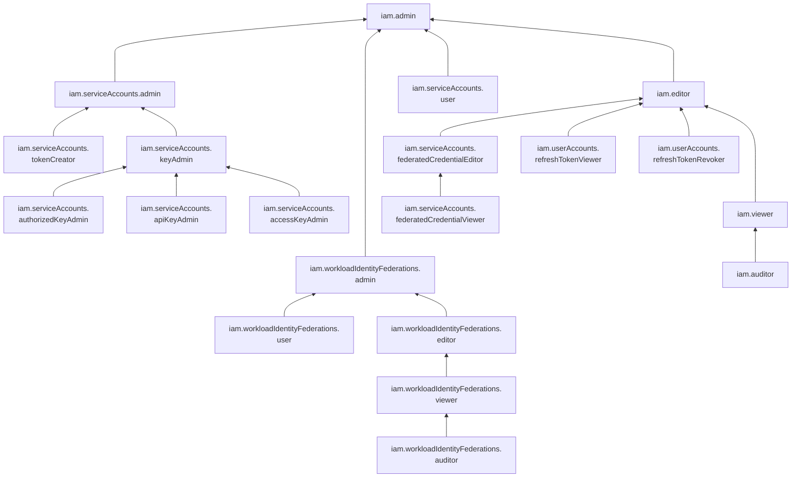

# Управление доступом в сервисе Identity and Access Management

В этом разделе вы узнаете:
* [на какие ресурсы можно назначить роль](#resources);
* [какие роли действуют в сервисе](#roles-list);
* [какие роли необходимы](#choosing-roles) для того или иного действия.

## Об управлении доступом {#about-access-control}

Все операции в Yandex Cloud проверяются в сервисе [Yandex Identity and Access Management](../index.md). Если у субъекта нет необходимых разрешений, сервис вернет ошибку.

Чтобы выдать разрешения к ресурсу, [назначьте роли](../operations/roles/grant.md) на этот ресурс субъекту, который будет выполнять операции. Роли можно назначить [аккаунту на Яндексе](../concepts/users/accounts.md#passport), [сервисному аккаунту](../concepts/users/service-accounts.md), [локальному пользователю](../concepts/users/accounts.md#local), [федеративному пользователю](../concepts/federations.md), [группе пользователей](../../organization/operations/manage-groups.md), [системной группе](../concepts/access-control/system-group.md) или [публичной группе](../concepts/access-control/public-group.md). Подробнее читайте в разделе [Как устроено управление доступом в Yandex Cloud](../concepts/access-control/index.md).

Назначать роли на ресурс могут пользователи, у которых на этот ресурс есть роль `iam.admin` или одна из следующих ролей:

* `admin`;
* `resource-manager.admin`;
* `organization-manager.admin`;
* `resource-manager.clouds.owner`;
* `organization-manager.organizations.owner`.



Даже если [операция](../../api-design-guide/concepts/about-async.md) с ресурсами [сервисов](../../overview/concepts/services.md) Yandex Cloud разрешена [ролью](../concepts/access-control/roles.md), ее выполнение может быть заблокировано, если на [организацию](../../organization/concepts/organization.md), [облако](../../resource-manager/concepts/resources-hierarchy.md#cloud) или [каталог](../../resource-manager/concepts/resources-hierarchy.md#folder) назначена [политика авторизации](../concepts/access-control/access-policies.md), запрещающая эту операцию.



## На какие ресурсы можно назначить роль {#resources}

Роль можно назначить на [организацию](../../organization/concepts/organization.md), [облако](../../resource-manager/concepts/resources-hierarchy.md#cloud) и [каталог](../../resource-manager/concepts/resources-hierarchy.md#folder). Роли, назначенные на организацию, облако или каталог, действуют и на вложенные ресурсы.

Вы также можете назначать роли на отдельные ресурсы сервиса:



- Консоль управления {#console}

  В [консоли управления](https://console.yandex.cloud) вы можете назначить роли на [сервисный аккаунт](../concepts/users/service-accounts.md).

- CLI {#cli}

  Через [Yandex Cloud CLI](../../cli/cli-ref/iam/cli-ref/index.md) вы можете назначить роли на следующие ресурсы:

  * [Сервисный аккаунт](../concepts/users/service-accounts.md)
  * [Федерация сервисных аккаунтов](../concepts/workload-identity.md)

- Terraform {#tf}

  Через [Terraform](../../terraform/index.md) вы можете назначить роли на следующие ресурсы:

  * [Сервисный аккаунт](../concepts/users/service-accounts.md)
  * [Федерация сервисных аккаунтов](../concepts/workload-identity.md)

- API {#api}

  Через [API Yandex Cloud](../api-ref/authentication.md) вы можете назначить роли на следующие ресурсы:

  * [Сервисный аккаунт](../concepts/users/service-accounts.md)
  * [Федерация сервисных аккаунтов](../concepts/workload-identity.md)



## Какие роли действуют в сервисе {#roles-list}

На диаграмме показано, какие роли есть в сервисе и как они наследуют разрешения друг друга. Например, в `editor` входят все разрешения `viewer`. После диаграммы дано описание каждой роли.

### Сервисные роли {#service-roles}

#### iam.serviceAccounts.user {#iam-serviceAccounts-user}

Роль `iam.serviceAccounts.user` позволяет пользователю просматривать список сервисных аккаунтов и информацию о них, а также выполнять операции от имени сервисного аккаунта.

Например, если при создании группы виртуальных машин пользователь укажет [сервисный аккаунт](../concepts/users/accounts.md#sa), сервис IAM проверяет, что у этого пользователя есть права на использование этого сервисного аккаунта.

#### iam.serviceAccounts.admin {#iam-serviceAccounts-admin}

Роль `iam.serviceAccounts.admin` позволяет управлять сервисными аккаунтами, доступом к ним и их ключами, а также позволяет пользователю получать IAM-токен для сервисного аккаунта.

Пользователи с этой ролью могут:
* просматривать список [сервисных аккаунтов](../concepts/users/accounts.md#sa) и информацию о них, а также создавать, использовать, изменять и удалять сервисные аккаунты;
* просматривать информацию о назначенных [правах доступа](../concepts/access-control/index.md) к сервисным аккаунтам и изменять такие права доступа;
* получать [IAM-токен](../concepts/authorization/iam-token.md) для сервисного аккаунта;
* просматривать список [API-ключей](../concepts/authorization/api-key.md) сервисных аккаунтов и информацию о таких ключах, а также создавать, изменять и удалять их;
* просматривать список [статических ключей доступа](../concepts/authorization/access-key.md) сервисных аккаунтов и информацию о таких ключах, а также создавать, изменять и удалять их;
* просматривать информацию об [авторизованных ключах](../concepts/authorization/key.md) сервисных аккаунтов, а также создавать, изменять и удалять их;
* создавать [эфемерные ключи доступа](../concepts/authorization/ephemeral-keys.md) сервисных аккаунтов;
* просматривать информацию о [каталоге](../../resource-manager/concepts/resources-hierarchy.md#folder) и его настройки.

В некоторых сервисах для выполнения операций необходим сервисный аккаунт, например в [Instance Groups](../../compute/concepts/instance-groups/index.md) или [Managed Service for Kubernetes](https://yandex.cloud/ru/services/managed-kubernetes). Если вы указали сервисный аккаунт в запросе, то IAM проверит, что у вас есть права на использование этого аккаунта.

#### iam.serviceAccounts.accessKeyAdmin {#iam-serviceAccounts-accessKeyAdmin}

Роль `iam.serviceAccounts.accessKeyAdmin` позволяет управлять статическими и эфемерными ключами доступа сервисных аккаунтов.

Пользователи с этой ролью могут:
* просматривать список [статических ключей доступа](../concepts/authorization/access-key.md) сервисных аккаунтов и информацию о таких ключах;
* создавать, изменять и удалять статические ключи доступа [сервисных аккаунтов](../concepts/users/accounts.md#sa);
* создавать [эфемерные ключи доступа](../concepts/authorization/ephemeral-keys.md) сервисных аккаунтов.

#### iam.serviceAccounts.apiKeyAdmin {#iam-serviceAccounts-apiKeyAdmin}

Роль `iam.serviceAccounts.apiKeyAdmin` позволяет управлять API-ключами сервисных аккаунтов.

Пользователи с этой ролью могут:
* просматривать список [API-ключей](../concepts/authorization/api-key.md) сервисных аккаунтов и информацию о таких ключах;
* создавать, изменять и удалять API-ключи [сервисных аккаунтов](../concepts/users/accounts.md#sa).

#### iam.serviceAccounts.authorizedKeyAdmin {#iam-serviceAccounts-authorizedKeyAdmin}

Роль `iam.serviceAccounts.authorizedKeyAdmin` позволяет просматривать информацию об [авторизованных ключах](../concepts/authorization/key.md) сервисных аккаунтов, а также создавать, изменять и удалять такие ключи.

#### iam.serviceAccounts.keyAdmin {#iam-serviceAccounts-keyAdmin}

Роль `iam.serviceAccounts.keyAdmin` позволяет управлять ключами доступа сервисных аккаунтов: статическими, эфемерными, авторизованными и API‑ключами.
Пользователи с этой ролью могут:
* просматривать список [статических ключей доступа](../concepts/authorization/access-key.md) сервисных аккаунтов и информацию о таких ключах, а также создавать, изменять и удалять статические ключи доступа;
* просматривать список [API-ключей](../concepts/authorization/api-key.md) сервисных аккаунтов и информацию о таких ключах, а также создавать, изменять и удалять API-ключи;
* просматривать информацию об [авторизованных ключах](../concepts/authorization/key.md) сервисных аккаунтов, а также создавать, изменять и удалять такие ключи;
* создавать [эфемерные ключи доступа](../concepts/authorization/ephemeral-keys.md) сервисных аккаунтов.

Включает разрешения, предоставляемые ролями `iam.serviceAccounts.accessKeyAdmin`, `iam.serviceAccounts.apiKeyAdmin` и `iam.serviceAccounts.authorizedKeyAdmin`.

#### iam.serviceAccounts.tokenCreator {#iam-serviceAccounts-tokenCreator}

Роль `iam.serviceAccounts.tokenCreator` позволяет пользователю получать IAM-токен для сервисного аккаунта.

С помощью такого [IAM-токена](../concepts/authorization/iam-token.md) пользователь сможет [имперсонироваться](../concepts/access-control/impersonation.md) в сервисный аккаунт и выполнять действия, разрешенные для этого [сервисного аккаунта](../concepts/users/accounts.md#sa).

Роль не позволяет пользователю изменять права доступа или удалять сервисный аккаунт.

#### iam.serviceAccounts.federatedCredentialViewer {#iam-serviceAccounts-federatedCredentialViewer}

Роль `iam.serviceAccounts.federatedCredentialViewer` позволяет просматривать список [привязок](../concepts/workload-identity.md#federated-credentials) в [федерациях сервисных аккаунтов](../concepts/workload-identity.md) и информацию о таких привязках.

#### iam.serviceAccounts.federatedCredentialEditor {#iam-serviceAccounts-federatedCredentialEditor}

Роль `iam.serviceAccounts.federatedCredentialEditor` позволяет просматривать список [привязок](../concepts/workload-identity.md#federated-credentials) в [федерациях сервисных аккаунтов](../concepts/workload-identity.md) и информацию о таких привязках, а также создавать и удалять привязки.

Включает разрешения, предоставляемые ролью `iam.serviceAccounts.federatedCredentialViewer`.

#### iam.workloadIdentityFederations.auditor {#iam-workloadIdentityFederations-auditor}

Роль `iam.workloadIdentityFederations.auditor` позволяет просматривать метаданные [федераций сервисных аккаунтов](../concepts/workload-identity.md).

#### iam.workloadIdentityFederations.viewer {#iam-workloadIdentityFederations-viewer}

Роль `iam.workloadIdentityFederations.viewer` позволяет просматривать информацию о [федерациях сервисных аккаунтов](../concepts/workload-identity.md).

Включает разрешения, предоставляемые ролью `iam.workloadIdentityFederations.auditor`.

#### iam.workloadIdentityFederations.user {#iam-workloadIdentityFederations-user}

Роль `iam.workloadIdentityFederations.user` позволяет использовать [федерации сервисных аккаунтов](../concepts/workload-identity.md).

#### iam.workloadIdentityFederations.editor {#iam-workloadIdentityFederations-editor}

Роль `iam.workloadIdentityFederations.editor` позволяет просматривать информацию о [федерациях сервисных аккаунтов](../concepts/workload-identity.md), а также создавать, изменять и удалять такие федерации.

Включает разрешения, предоставляемые ролью `iam.workloadIdentityFederations.viewer`.

#### iam.workloadIdentityFederations.admin {#iam-workloadIdentityFederations-admin}

Роль `iam.workloadIdentityFederations.admin` позволяет просматривать информацию о [федерациях сервисных аккаунтов](../concepts/workload-identity.md), а также создавать, изменять, использовать и удалять такие федерации.

Включает разрешения, предоставляемые ролями `iam.workloadIdentityFederations.editor` и `iam.workloadIdentityFederations.user`.

#### iam.userAccounts.refreshTokenViewer {#iam-userAccounts-refreshTokenViewer}

Роль `iam.userAccounts.refreshTokenViewer` позволяет просматривать списки [refresh-токенов](../concepts/authorization/refresh-token.md) федеративных пользователей. Роль назначается на [организацию](../../organization/concepts/organization.md).

#### iam.userAccounts.refreshTokenRevoker {#iam-userAccounts-refreshTokenRevoker}

Роль `iam.userAccounts.refreshTokenRevoker` позволяет отзывать [refresh-токены](../concepts/authorization/refresh-token.md) федеративных пользователей. Роль назначается на [организацию](../../organization/concepts/organization.md).

#### iam.auditor {#iam-auditor}

Роль `iam.auditor` позволяет просматривать информацию о сервисных аккаунтах и их ключах, а также об операциях с ресурсами и квотах сервиса.

Пользователи с этой ролью могут:
* просматривать список [сервисных аккаунтов](../concepts/users/accounts.md#sa) и информацию о них;
* просматривать информацию о назначенных [правах доступа](../concepts/access-control/index.md) к сервисным аккаунтам;
* просматривать список [API-ключей](../concepts/authorization/api-key.md) сервисных аккаунтов и информацию о таких ключах;
* просматривать список [статических ключей доступа](../concepts/authorization/access-key.md) сервисных аккаунтов и информацию о таких ключах;
* просматривать информацию об [авторизованных ключах](../concepts/authorization/key.md) сервисных аккаунтов;
* просматривать список операций и информацию об операциях с ресурсами сервиса;
* просматривать информацию о [квотах](../concepts/limits.md#iam-quotas) сервиса Identity and Access Management;
* просматривать информацию об [облаке](../../resource-manager/concepts/resources-hierarchy.md#cloud) и его настройки;
* просматривать информацию о [каталоге](../../resource-manager/concepts/resources-hierarchy.md#folder) и его настройки.

#### iam.viewer {#iam-viewer}

Роль `iam.viewer` позволяет просматривать информацию о сервисных аккаунтах и их ключах, а также об операциях с ресурсами и квотах сервиса.

Пользователи с этой ролью могут:
* просматривать список [сервисных аккаунтов](../concepts/users/accounts.md#sa) и информацию о них;
* просматривать информацию о назначенных [правах доступа](../concepts/access-control/index.md) к сервисным аккаунтам;
* просматривать список [API-ключей](../concepts/authorization/api-key.md) сервисных аккаунтов и информацию о таких ключах;
* просматривать список [статических ключей доступа](../concepts/authorization/access-key.md) сервисных аккаунтов и информацию о таких ключах;
* просматривать информацию об [авторизованных ключах](../concepts/authorization/key.md) сервисных аккаунтов;
* просматривать список операций и информацию об операциях с ресурсами сервиса;
* просматривать информацию о [квотах](../concepts/limits.md#iam-quotas) сервиса Identity and Access Management;
* просматривать информацию об [облаке](../../resource-manager/concepts/resources-hierarchy.md#cloud) и его настройки;
* просматривать информацию о [каталоге](../../resource-manager/concepts/resources-hierarchy.md#folder) и его настройки.

Включает разрешения, предоставляемые ролью `iam.auditor`.

#### iam.editor {#iam-editor}

Роль `iam.editor` позволяет управлять сервисными аккаунтами и их ключами, управлять каталогами, а также просматривать информацию об операциях с ресурсами сервиса.

Пользователи с этой ролью могут:
* просматривать список [сервисных аккаунтов](../concepts/users/accounts.md#sa) и информацию о них, а также создавать, использовать, изменять и удалять их;
* просматривать список [API-ключей](../concepts/authorization/api-key.md) сервисных аккаунтов и информацию о таких ключах, а также создавать, изменять и удалять их;
* просматривать список [статических ключей доступа](../concepts/authorization/access-key.md) сервисных аккаунтов и информацию о таких ключах, а также создавать, изменять и удалять их;
* просматривать информацию об [авторизованных ключах](../concepts/authorization/key.md) сервисных аккаунтов, а также создавать, изменять и удалять их;
* создавать [эфемерные ключи доступа](../concepts/authorization/ephemeral-keys.md) сервисных аккаунтов;
* просматривать информацию о назначенных [правах доступа](../concepts/access-control/index.md) к сервисным аккаунтам;
* просматривать список операций и информацию об операциях с ресурсами сервиса;
* просматривать информацию о [квотах](../concepts/limits.md#iam-quotas) сервиса Identity and Access Management;
* просматривать информацию об [облаке](../../resource-manager/concepts/resources-hierarchy.md#cloud) и его настройки;
* просматривать информацию о [каталогах](../../resource-manager/concepts/resources-hierarchy.md#folder) и их настройки;
* создавать, изменять, удалять и настраивать каталоги.

Включает разрешения, предоставляемые ролью `iam.viewer`.

#### iam.admin {#iam-admin}

Роль `iam.admin` позволяет управлять сервисными аккаунтами, доступом к ним и их ключами, управлять каталогами, просматривать информацию о квотах и операциях с ресурсами сервиса, а также позволяет пользователю получать IAM-токен для сервисного аккаунта.

Пользователи с этой ролью могут:
* просматривать список [сервисных аккаунтов](../concepts/users/accounts.md#sa) и информацию о них, а также создавать, использовать, изменять и удалять их;
* просматривать информацию о назначенных [правах доступа](../concepts/access-control/index.md) к сервисным аккаунтам и изменять такие права доступа;
* получать [IAM-токен](../concepts/authorization/iam-token.md) для сервисного аккаунта;
* просматривать список [API-ключей](../concepts/authorization/api-key.md) сервисных аккаунтов и информацию о таких ключах, а также создавать, изменять и удалять их;
* просматривать список [статических ключей доступа](../concepts/authorization/access-key.md) сервисных аккаунтов и информацию о таких ключах, а также создавать, изменять и удалять их;
* просматривать информацию об [авторизованных ключах](../concepts/authorization/key.md) сервисных аккаунтов, а также создавать, изменять и удалять их;
* создавать [эфемерные ключи доступа](../concepts/authorization/ephemeral-keys.md) сервисных аккаунтов;
* просматривать информацию о [федерациях удостоверений](../concepts/federations.md);
* просматривать список операций и информацию об операциях с ресурсами сервиса;
* просматривать информацию о [квотах](../concepts/limits.md#iam-quotas) сервиса Identity and Access Management;
* просматривать информацию об [облаке](../../resource-manager/concepts/resources-hierarchy.md#cloud) и его настройки;
* просматривать информацию о [каталогах](../../resource-manager/concepts/resources-hierarchy.md#folder) и их настройки;
* создавать, изменять, удалять и настраивать каталоги.

Включает разрешения, предоставляемые ролями `iam.editor` и `iam.serviceAccounts.admin`.

### Примитивные роли {#primitive-roles}

Примитивные роли позволяют пользователям совершать действия во [всех сервисах](../../overview/concepts/services.md) Yandex Cloud.

#### auditor {#auditor}

Роль `auditor` предоставляет разрешения на чтение конфигурации и метаданных любых ресурсов Yandex Cloud без возможности доступа к данным.

Например, пользователи с этой ролью могут:
* просматривать информацию о [ресурсе](../../resource-manager/concepts/resources-hierarchy.md);
* просматривать метаданные ресурса;
* просматривать список операций с ресурсом.

Роль `auditor` — наиболее безопасная роль, исключающая доступ к данным [сервисов](../../overview/concepts/services.md). Роль подходит для пользователей, которым необходим минимальный уровень доступа к ресурсам Yandex Cloud.

#### viewer {#viewer}

Роль `viewer` предоставляет разрешения на чтение информации о любых [ресурсах](../../resource-manager/concepts/resources-hierarchy.md) Yandex Cloud.

Включает разрешения, предоставляемые ролью `auditor`.

В отличие от роли `auditor`, роль `viewer` предоставляет доступ к данным [сервисов](../../overview/concepts/services.md) в режиме чтения.

#### editor {#editor}

Роль `editor` предоставляет разрешения на управление любыми [ресурсами](../../resource-manager/concepts/resources-hierarchy.md) Yandex Cloud, кроме назначения ролей другим пользователям, передачи прав владения [организацией](../../organization/concepts/organization.md) и ее удаления, а также удаления [ключей шифрования](../../kms/concepts/index.md) Key Management Service.

Например, пользователи с этой ролью могут создавать, изменять и удалять ресурсы.

Включает разрешения, предоставляемые ролью `viewer`.

#### admin {#admin}

Роль `admin` позволяет назначать любые роли, кроме `resource-manager.clouds.owner` и `organization-manager.organizations.owner`, а также предоставляет разрешения на управление любыми [ресурсами](../../resource-manager/concepts/resources-hierarchy.md) Yandex Cloud, кроме передачи прав владения [организацией](../../organization/concepts/organization.md) и ее удаления.

Прежде чем назначить роль `admin` на организацию, [облако](../../resource-manager/concepts/resources-hierarchy.md#cloud) или [платежный аккаунт](../../billing/concepts/billing-account.md), ознакомьтесь с информацией о защите [привилегированных аккаунтов](../../security/standard/all.md#privileged-users).

Включает разрешения, предоставляемые ролью `editor`.

Вместо примитивных ролей мы рекомендуем использовать роли сервисов. Такой подход позволит более гранулярно управлять доступом и обеспечить соблюдение [принципа минимальных привилегий](../../security/standard/all.md#min-privileges).

Подробнее о примитивных ролях см. в [справочнике ролей Yandex Cloud](../roles-reference.md#primitive-roles).

## Какие роли мне необходимы {#choosing-roles}

В таблице ниже перечислено, какие роли нужны для выполнения указанного действия. Вы всегда можете назначить роль, которая дает более широкие разрешения, нежели указанная. Например, назначить `editor` вместо `viewer`.

Действие | Методы | Необходимые роли
----- | ----- | -----
**Просмотр информации** | |
[Получение IAM-токена](../operations/iam-token/create.md) | `create` | роли не требуются, только аутентификация
[Просмотр информации о пользователе](../../organization/operations/users-get.md) | `get`, `getByLogin` | роли не требуются, только аутентификация
[Просмотр информации о сервисном аккаунте](../operations/sa/get-id.md) | `get`, `list`, `listOperations` | `iam.serviceAccounts.user` или `viewer` на сервисный аккаунт
Просмотр информации о каталоге или облаке | `get`, `list` | `iam.auditor` на каталог или облако
Просмотр информации о любом ресурсе | `get`, `list` | `viewer` на этот ресурс
**Управление ресурсами** | |
[Создание](../operations/sa/create.md) сервисных аккаунтов в каталоге | `create` | `iam.serviceAccounts.admin` на каталог
[Изменение](../operations/sa/update.md), [удаление](../operations/sa/delete.md) сервисных аккаунтов | `update`, `delete` | `editor` на сервисный аккаунт
Создание и удаление ключей для сервисного аккаунта | `create`, `delete` | `iam.serviceAccounts.accessKeyAdmin`, `iam.serviceAccounts.apiKeyAdmin`, `iam.serviceAccounts.authorizedKeyAdmin`, `iam.serviceAccounts.keyAdmin`  на сервисный аккаунт
**Управление доступом к ресурсам** | |
[Сделать нового пользователя владельцем облака](../operations/roles/grant.md) | `setAccessBindings`, `updateAccessBindings` | `resource-manager.clouds.owner` на это облако
[Назначение роли](../operations/roles/grant.md), [отзыв роли](../operations/roles/revoke.md) и просмотр назначенных ролей на ресурс | `setAccessBindings`, `updateAccessBindings`, `listAccessBindings` | `admin` на этот ресурс
Получение IAM-токена для сервисного аккаунта | `create` | `iam.serviceAccounts.tokenCreator` на сервисный аккаунт

#### Что дальше {#what-is-next}

* [Как назначить роль](../operations/roles/grant.md).
* [Как отозвать роль](../operations/roles/revoke.md).
* [Подробнее об управлении доступом в Yandex Cloud](../concepts/access-control/index.md).
* [Подробнее о наследовании ролей](../../resource-manager/concepts/resources-hierarchy.md#access-rights-inheritance).