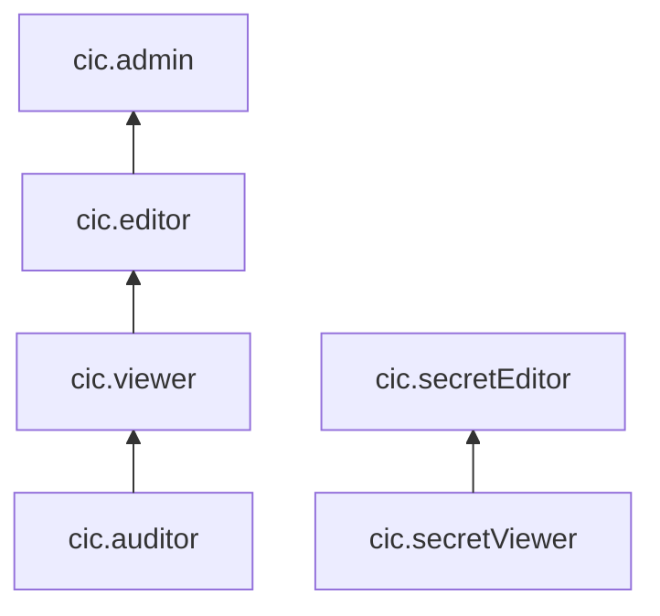

# Управление доступом в Cloud Interconnect

Пользователь Yandex Cloud может выполнять только те операции над ресурсами, которые разрешены назначенными ему [ролями](../../iam/concepts/access-control/roles.md). Пока у пользователя нет никаких ролей, почти все операции ему запрещены.

Чтобы разрешить доступ к ресурсам сервиса Cloud Interconnect, назначьте аккаунту на Яндексе, [сервисному аккаунту](../../iam/concepts/users/service-accounts.md), [федеративным](../../iam/concepts/users/accounts.md#saml-federation) или [локальным](../../iam/concepts/users/accounts.md#local) пользователям, [группе пользователей](../../organization/operations/manage-groups.md), [системной группе](../../iam/concepts/access-control/system-group.md) или [публичной группе](../../iam/concepts/access-control/public-group.md) нужные роли из приведенного ниже списка. На данный момент роль может быть [назначена](../../iam/operations/roles/grant.md) на родительский ресурс (каталог или облако) и на организацию.

Подробнее о наследовании ролей читайте в разделе [Наследование прав доступа](../../resource-manager/concepts/resources-hierarchy.md#access-rights-inheritance) документации сервиса Yandex Resource Manager.

## Об управлении доступом {#about-access-control}

Все операции в Yandex Cloud проверяются в сервисе [Yandex Identity and Access Management](../../iam/index.md). Если у субъекта нет необходимых разрешений, сервис вернет ошибку.

Чтобы выдать разрешения к ресурсу, [назначьте роли](../../iam/operations/roles/grant.md) на этот ресурс субъекту, который будет выполнять операции. Роли можно назначить [аккаунту на Яндексе](../../iam/concepts/users/accounts.md#passport), [сервисному аккаунту](../../iam/concepts/users/service-accounts.md), [локальному пользователю](../../iam/concepts/users/accounts.md#local), [федеративному пользователю](../../iam/concepts/federations.md), [группе пользователей](../../organization/operations/manage-groups.md), [системной группе](../../iam/concepts/access-control/system-group.md) или [публичной группе](../../iam/concepts/access-control/public-group.md). Подробнее читайте в разделе [Как устроено управление доступом в Yandex Cloud](../../iam/concepts/access-control/index.md).

Назначать роли на ресурс могут пользователи, у которых на этот ресурс есть одна из следующих ролей:

* `admin`;
* `resource-manager.admin`;
* `organization-manager.admin`;
* `resource-manager.clouds.owner`;
* `organization-manager.organizations.owner`.

## Назначение ролей {#grant-roles}

Чтобы назначить пользователю роль на облако:

1. При необходимости [добавьте](../../organization/operations/add-account.md) нужного пользователя.
1. В [консоли управления](https://console.yandex.cloud) слева [выберите](../../resource-manager/operations/cloud/switch-cloud.md) облако.
1. Перейдите на вкладку **Права доступа**.
1. Нажмите кнопку **Настроить доступ**.
1. В открывшемся окне выберите раздел **Пользовательские аккаунты**.
1. Выберите пользователя из списка или воспользуйтесь поиском.
1. Нажмите кнопку  **Добавить роль** и выберите роль в облаке.
1. Нажмите кнопку **Сохранить**.

Подробнее о назначении ролей см. в документации сервиса [Yandex Identity and Access Management](../../iam/operations/roles/grant.md).

## На какие ресурсы можно назначить роль {#resources}

Роль можно назначить на [организацию](../../organization/concepts/organization.md), [облако](../../resource-manager/concepts/resources-hierarchy.md#cloud) и [каталог](../../resource-manager/concepts/resources-hierarchy.md#folder). Роли, назначенные на организацию, облако или каталог, действуют и на вложенные ресурсы.

## Какие роли действуют в сервисе {#roles-list}

Ниже перечислены все роли, которые учитываются при проверке прав доступа в сервисе Cloud Interconnect.

### Сервисные роли {#service-roles}

#### cic.auditor {#cic-auditor}

Роль `cic.auditor` позволяет просматривать информацию о ресурсах сервиса Cloud Interconnect.



* просматривать информацию о [точках присутствия](../concepts/pops.md);
* просматривать информацию о [партнерах CIC](../concepts/partners.md);
* просматривать информацию о [транковых подключениях](../concepts/trunk.md);
* просматривать информацию о [приватных соединениях](../concepts/priv-con.md);
* просматривать информацию о [публичных соединениях](../concepts/pub-con.md);
* просматривать информацию о [квотах](../concepts/limits.md#interconnect-quotas) сервиса Cloud Interconnect;
* просматривать информацию об [облаке](../../resource-manager/concepts/resources-hierarchy.md#cloud);
* просматривать информацию о [каталоге](../../resource-manager/concepts/resources-hierarchy.md#folder).



#### cic.viewer {#cic-viewer}

Роль `cic.viewer` позволяет просматривать информацию о ресурсах сервиса Cloud Interconnect.



* просматривать информацию о [точках присутствия](../concepts/pops.md);
* просматривать информацию о [партнерах CIC](../concepts/partners.md);
* просматривать информацию о [транковых подключениях](../concepts/trunk.md);
* просматривать информацию о [приватных соединениях](../concepts/priv-con.md);
* просматривать информацию о [публичных соединениях](../concepts/pub-con.md);
* просматривать информацию о [квотах](../concepts/limits.md#interconnect-quotas) сервиса Cloud Interconnect;
* просматривать информацию об [облаке](../../resource-manager/concepts/resources-hierarchy.md#cloud);
* просматривать информацию о [каталоге](../../resource-manager/concepts/resources-hierarchy.md#folder).



Включает разрешения, предоставляемые ролью `cic.auditor`.

#### cic.editor {#cic-editor}

Роль `cic.editor` позволяет управлять транковыми подключениями, приватными и публичными соединениями, а также просматривать информацию о квотах и ресурсах сервиса Cloud Interconnect.



* просматривать информацию о [транковых подключениях](../concepts/trunk.md), а также создавать, изменять и удалять их;
* просматривать информацию о [приватных соединениях](../concepts/priv-con.md), а также создавать, изменять и удалять их;
* просматривать информацию о [публичных соединениях](../concepts/pub-con.md), а также создавать, изменять и удалять их;
* просматривать информацию о [точках присутствия](../concepts/pops.md);
* просматривать информацию о [партнерах CIC](../concepts/partners.md);
* просматривать информацию о [квотах](../concepts/limits.md#interconnect-quotas) сервиса Cloud Interconnect;
* просматривать информацию об [облаке](../../resource-manager/concepts/resources-hierarchy.md#cloud);
* просматривать информацию о [каталоге](../../resource-manager/concepts/resources-hierarchy.md#folder).



Включает разрешения, предоставляемые ролью `cic.viewer`.

#### cic.admin {#cic-admin}

Роль `cic.admin` позволяет управлять ресурсами сервиса Cloud Interconnect.



* просматривать информацию о [транковых подключениях](../concepts/trunk.md), а также создавать, изменять и удалять их;
* просматривать информацию о [приватных соединениях](../concepts/priv-con.md), а также создавать, изменять и удалять их;
* просматривать информацию о [публичных соединениях](../concepts/pub-con.md), а также создавать, изменять и удалять их;
* просматривать информацию о [точках присутствия](../concepts/pops.md);
* просматривать информацию о [партнерах CIC](../concepts/partners.md);
* просматривать информацию о [квотах](../concepts/limits.md#interconnect-quotas) сервиса Cloud Interconnect;
* просматривать информацию об [облаке](../../resource-manager/concepts/resources-hierarchy.md#cloud);
* просматривать информацию о [каталоге](../../resource-manager/concepts/resources-hierarchy.md#folder).



Включает разрешения, предоставляемые ролью `cic.editor`.

#### cic.secretViewer {#cic-secretviewer}

Роль `cic.secretViewer` позволяет получать секреты [приватных](../concepts/priv-con.md) и [публичных](../concepts/pub-con.md) соединений Cloud Interconnect.

#### cic.secretEditor {#cic-secreteditor}

Роль `cic.secretEditor` позволяет получать и изменять секреты [приватных](../concepts/priv-con.md) и [публичных](../concepts/pub-con.md) соединений Cloud Interconnect.

Включает разрешения, предоставляемые ролью `cic.secretViewer`.

### Примитивные роли {#primitive-roles}

Примитивные роли позволяют пользователям совершать действия во [всех сервисах](../../overview/concepts/services.md) Yandex Cloud.

#### auditor {#auditor}

Роль `auditor` предоставляет разрешения на чтение конфигурации и метаданных любых ресурсов Yandex Cloud без возможности доступа к данным.

Например, пользователи с этой ролью могут:
* просматривать информацию о [ресурсе](../../resource-manager/concepts/resources-hierarchy.md);
* просматривать метаданные ресурса;
* просматривать список операций с ресурсом.

Роль `auditor` — наиболее безопасная роль, исключающая доступ к данным [сервисов](../../overview/concepts/services.md). Роль подходит для пользователей, которым необходим минимальный уровень доступа к ресурсам Yandex Cloud.

#### viewer {#viewer}

Роль `viewer` предоставляет разрешения на чтение информации о любых [ресурсах](../../resource-manager/concepts/resources-hierarchy.md) Yandex Cloud.

Включает разрешения, предоставляемые ролью `auditor`.

В отличие от роли `auditor`, роль `viewer` предоставляет доступ к данным [сервисов](../../overview/concepts/services.md) в режиме чтения.

#### editor {#editor}

Роль `editor` предоставляет разрешения на управление любыми [ресурсами](../../resource-manager/concepts/resources-hierarchy.md) Yandex Cloud, кроме назначения ролей другим пользователям, передачи прав владения [организацией](../../organization/concepts/organization.md) и ее удаления, а также удаления [ключей шифрования](../../kms/concepts/index.md) Key Management Service.

Например, пользователи с этой ролью могут создавать, изменять и удалять ресурсы.

Включает разрешения, предоставляемые ролью `viewer`.

#### admin {#admin}

Роль `admin` позволяет назначать любые роли, кроме `resource-manager.clouds.owner` и `organization-manager.organizations.owner`, а также предоставляет разрешения на управление любыми [ресурсами](../../resource-manager/concepts/resources-hierarchy.md) Yandex Cloud, кроме передачи прав владения [организацией](../../organization/concepts/organization.md) и ее удаления.

Прежде чем назначить роль `admin` на организацию, [облако](../../resource-manager/concepts/resources-hierarchy.md#cloud) или [платежный аккаунт](../../billing/concepts/billing-account.md), ознакомьтесь с информацией о защите [привилегированных аккаунтов](../../security/standard/all.md#privileged-users).

Включает разрешения, предоставляемые ролью `editor`.

Вместо примитивных ролей мы рекомендуем использовать роли сервисов. Такой подход позволит более гранулярно управлять доступом и обеспечить соблюдение [принципа минимальных привилегий](../../security/standard/all.md#min-privileges).

Подробнее о примитивных ролях см. в [справочнике ролей Yandex Cloud](../../iam/roles-reference.md#primitive-roles).