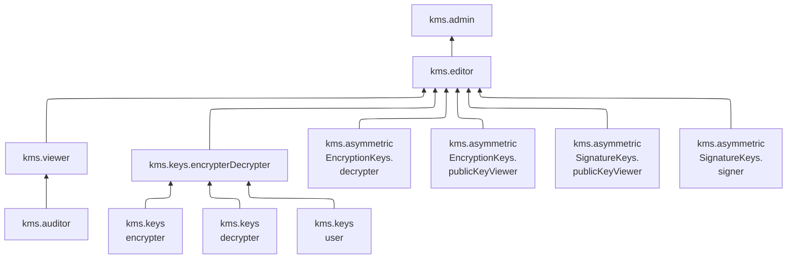

[Документация Yandex Cloud](../../index.md) > [Yandex Key Management Service](../index.md) > Управление доступом

# Управление доступом в Key Management Service

В этом разделе вы узнаете:
* [на какие ресурсы можно назначить роль](#resources);
* [какие роли действуют в сервисе](#roles-list);
* [какие роли необходимы](#choosing-roles) для того или иного действия.

## Об управлении доступом {#about-access-control}

Все операции в Yandex Cloud проверяются в сервисе [Yandex Identity and Access Management](../../iam/index.md). Если у субъекта нет необходимых разрешений, сервис вернет ошибку.

Чтобы выдать разрешения к ресурсу, [назначьте роли](../../iam/operations/roles/grant.md) на этот ресурс субъекту, который будет выполнять операции. Роли можно назначить [аккаунту на Яндексе](../../iam/concepts/users/accounts.md#passport), [сервисному аккаунту](../../iam/concepts/users/service-accounts.md), [локальному пользователю](../../iam/concepts/users/accounts.md#local), [федеративному пользователю](../../iam/concepts/federations.md), [группе пользователей](../../organization/operations/manage-groups.md), [системной группе](../../iam/concepts/access-control/system-group.md) или [публичной группе](../../iam/concepts/access-control/public-group.md). Подробнее читайте в разделе [Как устроено управление доступом в Yandex Cloud](../../iam/concepts/access-control/index.md).

Назначать роли на ресурс могут пользователи, у которых на этот ресурс есть роль `kms.admin` или одна из следующих ролей:

* `admin`;
* `resource-manager.admin`;
* `organization-manager.admin`;
* `resource-manager.clouds.owner`;
* `organization-manager.organizations.owner`.

## На какие ресурсы можно назначить роль {#resources}

Роль можно назначить на [организацию](../../organization/concepts/organization.md), [облако](../../resource-manager/concepts/resources-hierarchy.md#cloud) и [каталог](../../resource-manager/concepts/resources-hierarchy.md#folder). Роли, назначенные на организацию, облако или каталог, действуют и на вложенные ресурсы.

В [консоли управления](https://console.yandex.cloud), через Yandex Cloud [CLI](../../cli/cli-ref/kms/cli-ref/index.md), [API](../api-ref/authentication.md) или [Terraform](../../terraform/index.md) роль можно назначить на отдельные ресурсы сервиса:

# Ресурсы в Key Management Service, на которые можно назначать роли

* [Симметричный ключ шифрования](../operations/key-access.md)
* [Асимметричная ключевая пара шифрования](../operations/asymmetric-encryption-key-access.md)
* [Асимметричная ключевая пара электронной подписи](../operations/asymmetric-signature-key-access.md)

## Какие роли действуют в сервисе {#roles-list}

Управлять доступом к ключам KMS можно как с помощью сервисных, так и с помощью примитивных ролей.

На диаграмме показано, какие роли есть в сервисе и как они наследуют разрешения друг друга. Например, в `editor` входят все разрешения `viewer`. После диаграммы дано описание каждой роли.

### Сервисные роли {#service-roles}

Сервисные роли обеспечивают более гранулярный, учитывающий специфику сервиса, контроль над ключами KMS: предполагают строгое разделение субъектов на администраторов ключей (роль `kms.admin`) и пользователей (роль `kms.keys.encrypterDecrypter`).

Пользователи, у которых отсутствует роль `resource-manager.clouds.owner` или роль `admin`, не могут назначать роли через консоль управления.

#### kms.keys.user {#kms-keys-user}

Роль `kms.keys.user` позволяет просматривать список [симметричных ключей шифрования](../concepts/key.md) и информацию о них, а также использовать такие ключи.

#### kms.keys.encrypter {#kms-keys-encrypter}

Роль `kms.keys.encrypter` позволяет просматривать информацию о [симметричных ключах шифрования](../concepts/key.md) и шифровать данные с помощью таких ключей.

#### kms.keys.decrypter {#kms-keys-decrypter}

Роль `kms.keys.decrypter` позволяет просматривать информацию о [симметричных ключах шифрования](../concepts/key.md) и расшифровывать данные с помощью таких ключей.

#### kms.keys.encrypterDecrypter {#kms-keys-encrypterDecrypter}

Роль `kms.keys.encrypterDecrypter` позволяет просматривать информацию о [симметричных ключах шифрования](../concepts/key.md), а также шифровать и расшифровывать данные с помощью таких ключей.

Включает разрешения, предоставляемые ролями `kms.keys.encrypter` и `kms.keys.decrypter`.

#### kms.asymmetricEncryptionKeys.publicKeyViewer {#kms-asymmetricEncryptionKeys-publicKeyViewer}

Роль `kms.asymmetricEncryptionKeys.publicKeyViewer` позволяет просматривать информацию об [асимметричных ключевых парах шифрования](../concepts/asymmetric-encryption-key.md), а также получать [открытый ключ](../concepts/asymmetric-encryption.md#acquire-public-key) ключевой пары шифрования.

#### kms.asymmetricSignatureKeys.publicKeyViewer {#kms-asymmetricSignatureKeys-publicKeyViewer}

Роль `kms.asymmetricSignatureKeys.publicKeyViewer` позволяет просматривать информацию о [ключевых парах электронной подписи](../concepts/asymmetric-signature-key.md), а также получать открытый ключ ключевой пары электронной подписи.

#### kms.asymmetricSignatureKeys.signer {#kms-asymmetricSignatureKeys-signer}

Роль `kms.asymmetricSignatureKeys.signer` позволяет подписывать данные с помощью закрытого ключа [ключевой пары электронной подписи](../concepts/asymmetric-signature-key.md).

#### kms.asymmetricEncryptionKeys.decrypter {#kms-asymmetricEncryptionKeys-decrypter}

Роль `kms.asymmetricEncryptionKeys.decrypter` позволяет расшифровывать данные с помощью закрытого ключа [асимметричной ключевой пары шифрования](../concepts/asymmetric-encryption-key.md).

#### kms.auditor {#kms-auditor}

Роль `kms.auditor` позволяет просматривать информацию о ключах и ключевых парах шифрования и электронной подписи, а также о назначенных правах доступа к ним.

Пользователи с этой ролью могут:
* просматривать список [симметричных ключей](../concepts/key.md) шифрования, информацию о них и о назначенных [правах доступа](../../iam/concepts/access-control/index.md) к ним;
* просматривать информацию об [асимметричных ключевых парах шифрования](../concepts/asymmetric-encryption-key.md) и о назначенных правах доступа к ним;
* просматривать информацию о [ключевых парах электронной подписи](../concepts/asymmetric-signature-key.md) и о назначенных правах доступа к ним;
* просматривать информацию о [квотах](../concepts/limits.md#kms-quotas) сервиса Key Management Service.

#### kms.viewer {#kms-viewer}

Роль `kms.viewer` позволяет просматривать информацию о ключах и ключевых парах шифрования и электронной подписи, о назначенных правах доступа к ним, а также о квотах сервиса.

Пользователи с этой ролью могут:
* просматривать список [симметричных ключей](../concepts/key.md) шифрования, информацию о них и о назначенных [правах доступа](../../iam/concepts/access-control/index.md) к ним;
* просматривать информацию об [асимметричных ключевых парах шифрования](../concepts/asymmetric-encryption-key.md) и о назначенных правах доступа к ним;
* просматривать информацию о [ключевых парах электронной подписи](../concepts/asymmetric-signature-key.md) и о назначенных правах доступа к ним;
* просматривать информацию о [квотах](../concepts/limits.md#kms-quotas) сервиса Key Management Service.

Включает разрешения, предоставляемые ролью `kms.auditor`.

#### kms.editor {#kms-editor}

Роль `kms.editor` позволяет создавать ключи и ключевые пары шифрования и электронной подписи, а также использовать их для шифрования, расшифрования и подписи данных.

Пользователи с этой ролью могут:
* просматривать список [симметричных ключей](../concepts/key.md) шифрования, информацию о них и о назначенных [правах доступа](../../iam/concepts/access-control/index.md) к ним, а также создавать, ротировать и изменять метаданные симметричных ключей (в т.ч. период их ротации);
* шифровать и расшифровывать данные с помощью симметричных ключей шифрования;
* просматривать информацию об [асимметричных ключевых парах шифрования](../concepts/asymmetric-encryption-key.md) и о назначенных правах доступа к ним, а также создавать ассиметричные ключевые пары шифрования и изменять их метаданные;
* получать [открытый ключ](../concepts/asymmetric-encryption.md#acquire-public-key) и расшифровывать данные с помощью закрытого ключа асимметричной ключевой пары шифрования;
* просматривать информацию о [ключевых парах электронной подписи](../concepts/asymmetric-signature-key.md) и назначенных правах доступа к ним, а также создавать ключевые пары электронной подписи и изменять их метаданные;
* получать открытый ключ и подписывать данные с помощью закрытого ключа ключевой пары электронной подписи;
* просматривать информацию о [квотах](../concepts/limits.md#kms-quotas) сервиса Key Management Service.

#### kms.admin {#kms-admin}

Роль `kms.admin` позволяет управлять ключами и ключевыми парами шифрования и электронной подписи и доступом к ним, а также использовать их для шифрования, расшифрования и подписи данных.

Пользователи с этой ролью могут:
* просматривать информацию о назначенных [правах доступа](../../iam/concepts/access-control/index.md) к [симметричным ключам](../concepts/key.md) шифрования, а также изменять такие права доступа;
* просматривать список симметричных ключей шифрования и информацию о них, а также создавать, активировать, деактивировать, ротировать, удалять симметричные ключи шифрования, изменять их основную версию и метаданные (в т.ч. период ротации);
* шифровать и расшифровывать данные с помощью симметричных ключей шифрования;
* просматривать информацию о назначенных правах доступа к [асимметричным ключевым парам шифрования](../concepts/asymmetric-encryption-key.md), а также изменять такие права доступа;
* просматривать информацию об асимметричных ключевых парах шифрования, а также создавать, активировать, деактивировать, удалять ассиметричные ключевые пары шифрования и изменять их метаданные;
* получать [открытый ключ](../concepts/asymmetric-encryption.md#acquire-public-key) и расшифровывать данные с помощью закрытого ключа асимметричной ключевой пары шифрования;
* просматривать информацию о назначенных правах доступа к [ключевым парам электронной подписи](../concepts/asymmetric-signature-key.md), а также изменять такие права доступа;
* просматривать информацию о ключевых парах электронной подписи, а также создавать, активировать, деактивировать, удалять ключевые пары электронной подписи и изменять их метаданные;
* получать открытый ключ и подписывать данные с помощью закрытого ключа ключевой пары электронной подписи;
* просматривать информацию о [квотах](../concepts/limits.md#kms-quotas) сервиса Key Management Service;
* просматривать информацию о [каталоге](../../resource-manager/concepts/resources-hierarchy.md#folder).

Включает разрешения, предоставляемые ролью `kms.editor`.

### Примитивные роли {#primitive-roles}

Примитивные роли позволяют пользователям совершать действия во [всех сервисах](../../overview/concepts/services.md) Yandex Cloud.

#### auditor {#auditor}

Роль `auditor` предоставляет разрешения на чтение конфигурации и метаданных любых ресурсов Yandex Cloud без возможности доступа к данным.

Например, пользователи с этой ролью могут:
* просматривать информацию о [ресурсе](../../resource-manager/concepts/resources-hierarchy.md);
* просматривать метаданные ресурса;
* просматривать список операций с ресурсом.

Роль `auditor` — наиболее безопасная роль, исключающая доступ к данным [сервисов](../../overview/concepts/services.md). Роль подходит для пользователей, которым необходим минимальный уровень доступа к ресурсам Yandex Cloud.

#### viewer {#viewer}

Роль `viewer` предоставляет разрешения на чтение информации о любых [ресурсах](../../resource-manager/concepts/resources-hierarchy.md) Yandex Cloud.

Включает разрешения, предоставляемые ролью `auditor`.

В отличие от роли `auditor`, роль `viewer` предоставляет доступ к данным [сервисов](../../overview/concepts/services.md) в режиме чтения.

#### editor {#editor}

Роль `editor` предоставляет разрешения на управление любыми [ресурсами](../../resource-manager/concepts/resources-hierarchy.md) Yandex Cloud, кроме назначения ролей другим пользователям, передачи прав владения [организацией](../../organization/concepts/organization.md) и ее удаления, а также удаления [ключей шифрования](../concepts/index.md) Key Management Service.

Например, пользователи с этой ролью могут создавать, изменять и удалять ресурсы.

Включает разрешения, предоставляемые ролью `viewer`.

#### admin {#admin}

Роль `admin` позволяет назначать любые роли, кроме `resource-manager.clouds.owner` и `organization-manager.organizations.owner`, а также предоставляет разрешения на управление любыми [ресурсами](../../resource-manager/concepts/resources-hierarchy.md) Yandex Cloud, кроме передачи прав владения [организацией](../../organization/concepts/organization.md) и ее удаления.

Прежде чем назначить роль `admin` на организацию, [облако](../../resource-manager/concepts/resources-hierarchy.md#cloud) или [платежный аккаунт](../../billing/concepts/billing-account.md), ознакомьтесь с информацией о защите [привилегированных аккаунтов](../../security/standard/all.md#privileged-users).

Включает разрешения, предоставляемые ролью `editor`.

Вместо примитивных ролей мы рекомендуем использовать роли сервисов. Такой подход позволит более гранулярно управлять доступом и обеспечить соблюдение [принципа минимальных привилегий](../../security/standard/all.md#min-privileges).

Подробнее о примитивных ролях в [справочнике ролей Yandex Cloud](../../iam/roles-reference.md#primitive-roles).

## Какие роли мне необходимы {#choosing-roles}

**Пример разграничения доступа к ключам**

С ролями рекомендуется работать следующим образом:
1. Владелец (роль `resource-manager.clouds.owner`) или администратор (роль `admin`) облака назначает роль `kms.admin` администратору KMS. 
1. Администратор KMS создает необходимое количество ключей и назначает (с помощью CLI или API) роли для их использования: субъекты, представляющие разные команды, получают роли `kms.keys.encrypter`, `kms.keys.decrypter`, `kms.asymmetricEncryptionKeys.publicKeyViewer`, `kms.asymmetricEncryptionKeys.decrypter` и `kms.editor` на ключи и каталоги.

Хорошей практикой является хранение ключей KMS в выделенном каталоге, отдельно от других ресурсов Yandex Cloud.

Действие | Методы | Необходимые роли
----- | ----- | -----
**KMS** | | 
Получение информации о ключах и версиях | `get`, `listVersions` | `kms.viewer` на ключ на каталог
Операции [симметричного шифрования и расшифрования](../api-ref/SymmetricCrypto/index.md) | `encrypt`, `decrypt`, `reEncrypt`, `generateDataKey` | `kms.keys.encrypterDecrypter` на ключ (шифрование и расшифрование), `kms.keys.encrypter` на ключ (только шифрование), `kms.keys.decrypter` на ключ (только расшифрование)
Получение списка ключей в каталоге | `list` | `kms.auditor` на каталог
Получение открытого ключа асимметричной ключевой пары шифрования | | `kms.asymmetricEncryptionKeys.publicKeyViewer` на ключ
Расшифрование с помощью закрытого ключа асимметричной ключевой пары шифрования | | `kms.asymmetricEncryptionKeys.decrypter` на ключ
[Создание](../operations/key.md#create) и [изменение](../operations/key.md#update) ключа | `create`, `update` | `kms.editor` на каталог
[Ротация ключа](../operations/key.md#rotate) | `rotate` | `kms.editor` на ключ
[Смена основной версии](../operations/version.md#make-primary) | `setPrimaryVersion` | `kms.admin` на ключ
[Удаление ключей](../operations/key.md#delete) и [удаление версий](../operations/version.md#delete)| `delete`, `scheduleVersionDestruction`, `cancelVersionDestruction` | `kms.admin` на ключ
[Назначение роли](../../iam/operations/roles/grant.md), [отзыв роли](../../iam/operations/roles/revoke.md) | `setAccessBindings`, `updateAccessBindings` | `kms.admin` на ключ
Просмотр назначенных ролей на ключ | `listAccessBindings` | `kms.auditor` на ключ

#### Что дальше {#what-is-next}

* [Безопасное использование Yandex Cloud](../../iam/best-practices/using-iam-securely.md)
* [Как назначить роль](../../iam/operations/roles/grant.md).
* [Как отозвать роль](../../iam/operations/roles/revoke.md).
* [Подробнее об управлении доступом в Yandex Cloud](../../iam/concepts/access-control/index.md).
* [Подробнее о наследовании ролей](../../resource-manager/concepts/resources-hierarchy.md#access-rights-inheritance).