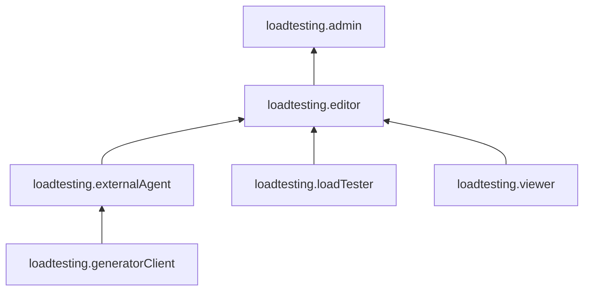

# Управление доступом в Load Testing



С 1 июля 2026 года сервис Load Testing прекращает работу. Подробнее на странице [Закрытие сервиса Yandex Load Testing](../sunset.md).



Для управления правами доступа в Load Testing используются [роли](../../iam/concepts/access-control/roles.md).

В этом разделе вы узнаете:
* [на какие ресурсы можно назначить роль](#resources);
* [какие роли действуют в сервисе](#roles-list);
* [какие роли необходимы](#required-roles) для того или иного действия.

## Об управлении доступом {#about-access-control}

Все операции в Yandex Cloud проверяются в сервисе [Yandex Identity and Access Management](../../iam/index.md). Если у субъекта нет необходимых разрешений, сервис вернет ошибку.

Чтобы выдать разрешения к ресурсу, [назначьте роли](../../iam/operations/roles/grant.md) на этот ресурс субъекту, который будет выполнять операции. Роли можно назначить [аккаунту на Яндексе](../../iam/concepts/users/accounts.md#passport), [сервисному аккаунту](../../iam/concepts/users/service-accounts.md), [локальному пользователю](../../iam/concepts/users/accounts.md#local), [федеративному пользователю](../../iam/concepts/federations.md), [группе пользователей](../../organization/operations/manage-groups.md), [системной группе](../../iam/concepts/access-control/system-group.md) или [публичной группе](../../iam/concepts/access-control/public-group.md). Подробнее читайте в разделе [Как устроено управление доступом в Yandex Cloud](../../iam/concepts/access-control/index.md).

Назначать роли на ресурс могут пользователи, у которых на этот ресурс есть хотя бы одна из ролей:

* `admin`;
* `resource-manager.admin`;
* `organization-manager.admin`;
* `resource-manager.clouds.owner`;
* `organization-manager.organizations.owner`.

## На какие ресурсы можно назначить роль {#resources}

Роль можно назначить на [организацию](../../organization/concepts/organization.md), [облако](../../resource-manager/concepts/resources-hierarchy.md#cloud) и [каталог](../../resource-manager/concepts/resources-hierarchy.md#folder). Роли, назначенные на организацию, облако или каталог, действуют и на вложенные ресурсы.

## Какие роли действуют в сервисе {#roles-list}

На диаграмме показано, какие роли есть в сервисе и как они наследуют разрешения друг друга. Например, в `editor` входят все разрешения `viewer`. После диаграммы дано описание каждой роли.

### Сервисные роли {#service-roles}

#### loadtesting.viewer {#loadtesting-viewer}

Роль `loadtesting.viewer` позволяет просматривать информацию о генераторах нагрузки и нагрузочных тестах, а также метаданные каталога.

Пользователи с этой ролью могут:
* просматривать информацию о нагрузочных тестах и [отчеты](../concepts/reports.md) о результатах их выполнения;
* просматривать информацию о конфигурации нагрузочных тестов;
* просматривать информацию о [дашбордах регрессий](../concepts/load-test-regressions.md#dashbordy-regressij) нагрузочных тестов;
* просматривать информацию об [агентах](../concepts/agent.md);
* просматривать информацию о [бакетах](../../storage/concepts/bucket.md) Yandex Object Storage, использующихся в нагрузочных тестах;
* просматривать информацию о [каталоге](../../resource-manager/concepts/resources-hierarchy.md#folder).

#### loadtesting.editor {#loadtesting-editor}

Роль `loadtesting.editor` позволяет управлять агентами, нагрузочными тестами и их конфигурациями, хранилищами данных и дашбордами регрессий, а также регистрировать в сервисе агентов, созданных вне Load Testing.

Пользователи с этой ролью могут:
* просматривать информацию о нагрузочных тестах и [отчеты](../concepts/reports.md) о результатах их выполнения;
* создавать, изменять, удалять, запускать и останавливать нагрузочные тесты, а также загружать в них [тестовые данные](../concepts/payload.md);
* просматривать информацию о конфигурациях нагрузочных тестов, а также создавать, изменять и удалять такие конфигурации;
* просматривать информацию об [агентах](../concepts/agent.md), а также создавать, изменять, удалять, запускать, перезапускать и останавливать их;
* регистрировать в Load Testing [агентов](../concepts/agent.md), созданных за пределами сервиса;
* просматривать информацию о [бакетах](../../storage/concepts/bucket.md) Yandex Object Storage, использующихся в нагрузочных тестах, загружать в них тестовые данные, а также создавать, изменять и удалять бакеты;
* просматривать информацию о [дашбордах регрессий](../concepts/load-test-regressions.md#dashbordy-regressij) нагрузочных тестов, а также создавать, изменять и удалять такие дашборды;
* просматривать информацию о [каталоге](../../resource-manager/concepts/resources-hierarchy.md#folder).

Включает разрешения, предоставляемые ролями `loadtesting.viewer`, `loadtesting.loadTester` и `loadtesting.externalAgent`.

#### loadtesting.admin {#loadtesting-admin}

Роль `loadtesting.admin` позволяет управлять агентами, нагрузочными тестами и их конфигурациями, хранилищами данных и дашбордами регрессий, а также регистрировать в сервисе агентов, созданных вне Load Testing.

Пользователи с этой ролью могут:
* просматривать информацию о нагрузочных тестах и [отчеты](../concepts/reports.md) о результатах их выполнения;
* создавать, изменять, удалять, запускать и останавливать нагрузочные тесты, а также загружать в них [тестовые данные](../concepts/payload.md);
* просматривать информацию о конфигурациях нагрузочных тестов, а также создавать, изменять и удалять такие конфигурации;
* просматривать информацию об [агентах](../concepts/agent.md), а также создавать, изменять, удалять, запускать, перезапускать и останавливать их;
* регистрировать в Load Testing [агентов](../concepts/agent.md), созданных за пределами сервиса;
* просматривать информацию о [бакетах](../../storage/concepts/bucket.md) Yandex Object Storage, использующихся в нагрузочных тестах, загружать в них тестовые данные, а также создавать, изменять и удалять бакеты;
* просматривать информацию о [дашбордах регрессий](../concepts/load-test-regressions.md#dashbordy-regressij) нагрузочных тестов, а также создавать, изменять и удалять такие дашборды;
* просматривать информацию о [каталоге](../../resource-manager/concepts/resources-hierarchy.md#folder).

Включает разрешения, предоставляемые ролью `loadtesting.editor`.

#### loadtesting.loadTester {#loadtesting-loadtester}

Роль `loadtesting.loadTester` позволяет управлять агентами, нагрузочными тестами и их конфигурациями, хранилищами данных и дашбордами регрессий.

Пользователи с этой ролью могут:
* просматривать информацию о нагрузочных тестах и [отчеты](../concepts/reports.md) о результатах их выполнения;
* создавать, изменять, удалять, запускать и останавливать нагрузочные тесты, а также загружать в них [тестовые данные](../concepts/payload.md);
* просматривать информацию о конфигурациях нагрузочных тестов, а также создавать, изменять и удалять такие конфигурации;
* просматривать информацию об [агентах](../concepts/agent.md), а также создавать, изменять, удалять, запускать, перезапускать и останавливать их;
* просматривать информацию о [бакетах](../../storage/concepts/bucket.md) Yandex Object Storage, использующихся в нагрузочных тестах, загружать в них тестовые данные, а также создавать, изменять и удалять бакеты;
* просматривать информацию о [дашбордах регрессий](../concepts/load-test-regressions.md#dashbordy-regressij) нагрузочных тестов, а также создавать, изменять и удалять такие дашборды;
* просматривать информацию о [каталоге](../../resource-manager/concepts/resources-hierarchy.md#folder).

#### loadtesting.generatorClient {#loadtesting-generatorclient}

Роль `loadtesting.generatorClient` позволяет создавать, изменять и выполнять нагрузочные тесты на агенте, а также дает возможность загружать результаты тестов в хранилище.

Пользователи с этой ролью могут:
* создавать, изменять и запускать нагрузочные тесты;
* создавать и изменять конфигурацию нагрузочных тестов;
* загружать данные [результатов](../concepts/load-test-results.md) тестов в хранилище.

Роль назначается на [сервисный аккаунт](../../iam/concepts/users/service-accounts.md), от имени которого создается ВМ с [агентом](../concepts/agent.md).

#### loadtesting.externalAgent {#loadtesting-externalagent}

Роль `loadtesting.externalAgent` позволяет регистрировать в сервисе агентов, созданных вне Load Testing, а также создавать, изменять и выполнять нагрузочные тесты на агенте.

Пользователи с этой ролью могут:
* регистрировать в Load Testing [агентов](../concepts/agent.md), созданных за пределами сервиса;
* создавать, изменять и запускать нагрузочные тесты;
* создавать и изменять конфигурацию нагрузочных тестов;
* загружать данные [результатов](../concepts/load-test-results.md) тестов в хранилище.

Включает разрешения, предоставляемые ролью `loadtesting.generatorClient`.

Роль назначается на [сервисный аккаунт](../../iam/concepts/users/service-accounts.md), от имени которого создается ВМ с агентом.

### Примитивные роли {#primitive-roles}

Примитивные роли позволяют пользователям совершать действия во [всех сервисах](../../overview/concepts/services.md) Yandex Cloud.

#### auditor {#auditor}

Роль `auditor` предоставляет разрешения на чтение конфигурации и метаданных любых ресурсов Yandex Cloud без возможности доступа к данным.

Например, пользователи с этой ролью могут:
* просматривать информацию о [ресурсе](../../resource-manager/concepts/resources-hierarchy.md);
* просматривать метаданные ресурса;
* просматривать список операций с ресурсом.

Роль `auditor` — наиболее безопасная роль, исключающая доступ к данным [сервисов](../../overview/concepts/services.md). Роль подходит для пользователей, которым необходим минимальный уровень доступа к ресурсам Yandex Cloud.

#### viewer {#viewer}

Роль `viewer` предоставляет разрешения на чтение информации о любых [ресурсах](../../resource-manager/concepts/resources-hierarchy.md) Yandex Cloud.

Включает разрешения, предоставляемые ролью `auditor`.

В отличие от роли `auditor`, роль `viewer` предоставляет доступ к данным [сервисов](../../overview/concepts/services.md) в режиме чтения.

#### editor {#editor}

Роль `editor` предоставляет разрешения на управление любыми [ресурсами](../../resource-manager/concepts/resources-hierarchy.md) Yandex Cloud, кроме назначения ролей другим пользователям, передачи прав владения [организацией](../../organization/concepts/organization.md) и ее удаления, а также удаления [ключей шифрования](../../kms/concepts/index.md) Key Management Service.

Например, пользователи с этой ролью могут создавать, изменять и удалять ресурсы.

Включает разрешения, предоставляемые ролью `viewer`.

#### admin {#admin}

Роль `admin` позволяет назначать любые роли, кроме `resource-manager.clouds.owner` и `organization-manager.organizations.owner`, а также предоставляет разрешения на управление любыми [ресурсами](../../resource-manager/concepts/resources-hierarchy.md) Yandex Cloud, кроме передачи прав владения [организацией](../../organization/concepts/organization.md) и ее удаления.

Прежде чем назначить роль `admin` на организацию, [облако](../../resource-manager/concepts/resources-hierarchy.md#cloud) или [платежный аккаунт](../../billing/concepts/billing-account.md), ознакомьтесь с информацией о защите [привилегированных аккаунтов](../../security/standard/all.md#privileged-users).

Включает разрешения, предоставляемые ролью `editor`.

Вместо примитивных ролей мы рекомендуем использовать роли сервисов. Такой подход позволит более гранулярно управлять доступом и обеспечить соблюдение [принципа минимальных привилегий](../../security/standard/all.md#min-privileges).

Подробнее о примитивных ролях см. в [справочнике ролей Yandex Cloud](../../iam/roles-reference.md#primitive-roles).

#### Что дальше {#next}

* [Как назначить роль](../../iam/operations/roles/grant.md).
* [Как отозвать роль](../../iam/operations/roles/revoke.md).
* [Подробнее об управлении доступом в Yandex Cloud](../../iam/concepts/access-control/index.md).
* [Подробнее о наследовании ролей](../../resource-manager/concepts/resources-hierarchy.md#access-rights-inheritance).