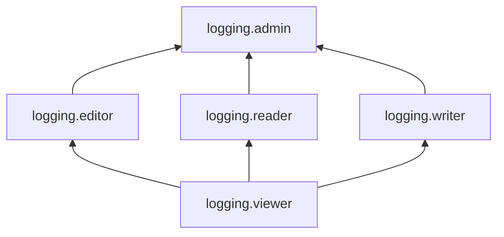

# Управление доступом в {{ cloud-logging-name }}

Для управления правами доступа в {{ cloud-logging-name }} используются [роли](../../iam/concepts/access-control/roles.md).

В этом разделе вы узнаете:

* [на какие ресурсы можно назначить роль](#resources);
* [какие роли действуют в сервисе](#roles-list).

## Об управлении доступом {#about-access-control}

Все операции в {{ yandex-cloud }} проверяются в сервисе [{{ iam-full-name }}](../../iam/index.md). Если у субъекта нет необходимых разрешений, сервис вернет ошибку.

Чтобы выдать разрешения к ресурсу, [назначьте роли](../../iam/operations/roles/grant.md) на этот ресурс субъекту, который будет выполнять операции. Роли можно назначить [аккаунту на Яндексе](../../iam/concepts/users/accounts.md#passport), [сервисному аккаунту](../../iam/concepts/users/service-accounts.md), [локальному пользователю](../../iam/concepts/users/accounts.md#local), [федеративному пользователю](../../iam/concepts/federations.md), [группе пользователей](../../organization/operations/manage-groups.md), [системной группе](../../iam/concepts/access-control/system-group.md) или [публичной группе](../../iam/concepts/access-control/public-group.md). Подробнее читайте в разделе [{#T}](../../iam/concepts/access-control/index.md).

Назначать роли на ресурс могут пользователи, у которых на этот ресурс есть роль `logging.admin` или одна из следующих ролей:

* `admin`;
* `resource-manager.admin`;
* `organization-manager.admin`;
* `resource-manager.clouds.owner`;
* `organization-manager.organizations.owner`.

## На какие ресурсы можно назначить роль {#resources}

Роль можно назначить на [организацию](../../organization/concepts/organization.md), [облако](../../resource-manager/concepts/resources-hierarchy.md#cloud) и [каталог](../../resource-manager/concepts/resources-hierarchy.md#folder). Роли, назначенные на организацию, облако или каталог, действуют и на вложенные ресурсы.

Вы также можете назначать роли на отдельные ресурсы сервиса:



- CLI {#cli}

  Через [{{ yandex-cloud }} CLI](../../cli/cli-ref/logging/cli-ref/index.md) вы можете назначить роли на следующие ресурсы:

  * [Лог-группа](../concepts/log-group.md)
  * [Приемник логов](../operations/create-sink.md)

- API {#api}

  Через [API {{ yandex-cloud }}](../api-ref/authentication.md) вы можете назначить роли на следующие ресурсы:

  # Ресурсы в {{ cloud-logging-name }}, на которые можно назначать роли
  
  * [Лог-группа](../concepts/log-group.md)
  * [Приемник логов](../operations/create-sink.md)
  * [Экспорт](../operations/export-logs.md)



## Какие роли действуют в сервисе {#roles-list}

Ниже перечислены все роли, которые учитываются при проверке прав доступа в сервисе {{ cloud-logging-name }}.

### Сервисные роли {#service-roles}

#### logging.viewer {#logging-viewer}

Роль `logging.viewer` позволяет просматривать информацию о лог-группах, приемниках логов и назначенных правах доступа к ним, а также об облаке и каталоге.

Пользователи с этой ролью могут:
* просматривать информацию о [лог-группах](../concepts/log-group.md);
* просматривать информацию о приемниках логов;
* просматривать информацию о назначенных [правах доступа](../../iam/concepts/access-control/index.md) к ресурсам сервиса Cloud Logging;
* просматривать информацию о выгрузках логов;
* просматривать информацию об [облаке](../../resource-manager/concepts/resources-hierarchy.md#cloud) и [каталоге](../../resource-manager/concepts/resources-hierarchy.md#folder).

#### logging.editor {#logging-editor}

Роль `logging.editor` позволяет просматривать информацию о ресурсах сервиса и управлять ими.

Пользователи с этой ролью могут:
* просматривать информацию о [лог-группах](../concepts/log-group.md), а также создавать, изменять, удалять и использовать их;
* просматривать информацию о приемниках логов, а также создавать, изменять, удалять и использовать их;
* просматривать информацию о назначенных [правах доступа](../../iam/concepts/access-control/index.md) к ресурсам сервиса Cloud Logging;
* просматривать информацию о выгрузках логов, запускать выгрузку, а также создавать, изменять и удалять файлы выгрузки;
* просматривать информацию об [облаке](../../resource-manager/concepts/resources-hierarchy.md#cloud) и [каталоге](../../resource-manager/concepts/resources-hierarchy.md#folder).

Включает разрешения, предоставляемые ролью `logging.viewer`.

#### logging.reader {#logging-reader}

Роль `logging.reader` позволяет просматривать записи в лог-группах и информацию о ресурсах сервиса, а также метаинформацию облака и каталога.

Пользователи с этой ролью могут:
* просматривать записи в [лог-группах](../concepts/log-group.md);
* просматривать информацию о лог-группах;
* просматривать информацию о приемниках логов;
* просматривать информацию о назначенных [правах доступа](../../iam/concepts/access-control/index.md) к ресурсам сервиса Cloud Logging;
* просматривать информацию о выгрузках логов;
* просматривать информацию об [облаке](../../resource-manager/concepts/resources-hierarchy.md#cloud) и [каталоге](../../resource-manager/concepts/resources-hierarchy.md#folder).

Включает разрешения, предоставляемые ролью `logging.viewer`.

#### logging.writer {#logging-writer}

Роль `logging.writer` позволяет добавлять записи в лог-группы и просматривать информацию о ресурсах сервиса, а также об облаке и каталоге.

Пользователи с этой ролью могут:
* добавлять записи в [лог-группы](../concepts/log-group.md);
* просматривать информацию о лог-группах;
* просматривать информацию о приемниках логов;
* просматривать информацию о назначенных [правах доступа](../../iam/concepts/access-control/index.md) к ресурсам сервиса Cloud Logging;
* просматривать информацию о выгрузках логов;
* просматривать информацию об [облаке](../../resource-manager/concepts/resources-hierarchy.md#cloud) и [каталоге](../../resource-manager/concepts/resources-hierarchy.md#folder).

Включает разрешения, предоставляемые ролью `logging.viewer`.

#### logging.admin {#logging-admin}

Роль `logging.admin` позволяет управлять ресурсами сервиса и доступом к ним, а также просматривать и добавлять записи в лог-группы.

Пользователи с этой ролью могут:
* просматривать информацию о назначенных [правах доступа](../../iam/concepts/access-control/index.md) к ресурсам сервиса Cloud Logging и изменять такие права доступа;
* просматривать информацию о [лог-группах](../concepts/log-group.md), а также создавать, изменять, удалять и использовать их;
* просматривать информацию о приемниках логов, а также создавать, изменять, удалять и использовать их;
* просматривать информацию о выгрузках логов, запускать выгрузку, а также создавать, изменять и удалять файлы выгрузки;
* просматривать и добавлять записи в лог-группы;
* просматривать информацию о [квотах](../concepts/limits.md#logging-quotas) сервиса Cloud Logging.
* просматривать информацию об [облаке](../../resource-manager/concepts/resources-hierarchy.md#cloud) и [каталоге](../../resource-manager/concepts/resources-hierarchy.md#folder).

Включает разрешения, предоставляемые ролями `logging.editor`, `logging.reader` и `logging.writer`.

### Примитивные роли {#primitive-roles}

Примитивные роли позволяют пользователям совершать действия во [всех сервисах](../../overview/concepts/services.md) {{ yandex-cloud }}.

#### {{ roles-auditor }} {#auditor}

Роль `auditor` предоставляет разрешения на чтение конфигурации и метаданных любых ресурсов Yandex Cloud без возможности доступа к данным.

Например, пользователи с этой ролью могут:
* просматривать информацию о [ресурсе]({{ link-docs }}/resource-manager/concepts/resources-hierarchy);
* просматривать метаданные ресурса;
* просматривать список операций с ресурсом.

Роль `auditor` — наиболее безопасная роль, исключающая доступ к данным [сервисов]({{ link-docs }}/overview/concepts/services). Роль подходит для пользователей, которым необходим минимальный уровень доступа к ресурсам Yandex Cloud.

#### {{ roles-viewer }} {#viewer}

Роль `viewer` предоставляет разрешения на чтение информации о любых [ресурсах]({{ link-docs }}/resource-manager/concepts/resources-hierarchy) Yandex Cloud.

Включает разрешения, предоставляемые ролью `auditor`.

В отличие от роли `auditor`, роль `viewer` предоставляет доступ к данным [сервисов]({{ link-docs }}/overview/concepts/services) в режиме чтения.

#### {{ roles-editor }} {#editor}

Роль `editor` предоставляет разрешения на управление любыми [ресурсами]({{ link-docs }}/resource-manager/concepts/resources-hierarchy) Yandex Cloud, кроме назначения ролей другим пользователям, передачи прав владения [организацией]({{ link-docs }}/organization/concepts/organization) и ее удаления, а также удаления [ключей шифрования]({{ link-docs }}/kms/concepts/) Key Management Service.

Например, пользователи с этой ролью могут создавать, изменять и удалять ресурсы.

Включает разрешения, предоставляемые ролью `viewer`.

#### {{ roles-admin }} {#admin}

Роль `admin` позволяет назначать любые роли, кроме `resource-manager.clouds.owner` и `organization-manager.organizations.owner`, а также предоставляет разрешения на управление любыми [ресурсами]({{ link-docs }}/resource-manager/concepts/resources-hierarchy) Yandex Cloud, кроме передачи прав владения [организацией]({{ link-docs }}/organization/concepts/organization) и ее удаления.

Прежде чем назначить роль `admin` на организацию, [облако]({{ link-docs }}/resource-manager/concepts/resources-hierarchy#cloud) или [платежный аккаунт]({{ link-docs }}/billing/concepts/billing-account), ознакомьтесь с информацией о защите [привилегированных аккаунтов]({{ link-docs }}/security/standard/all#privileged-users).

Включает разрешения, предоставляемые ролью `editor`.

Вместо примитивных ролей мы рекомендуем использовать роли сервисов. Такой подход позволит более гранулярно управлять доступом и обеспечить соблюдение [принципа минимальных привилегий](../../security/standard/all.md#min-privileges).

Подробнее о примитивных ролях см. в [справочнике ролей {{ yandex-cloud }}](../../iam/roles-reference.md#primitive-roles).