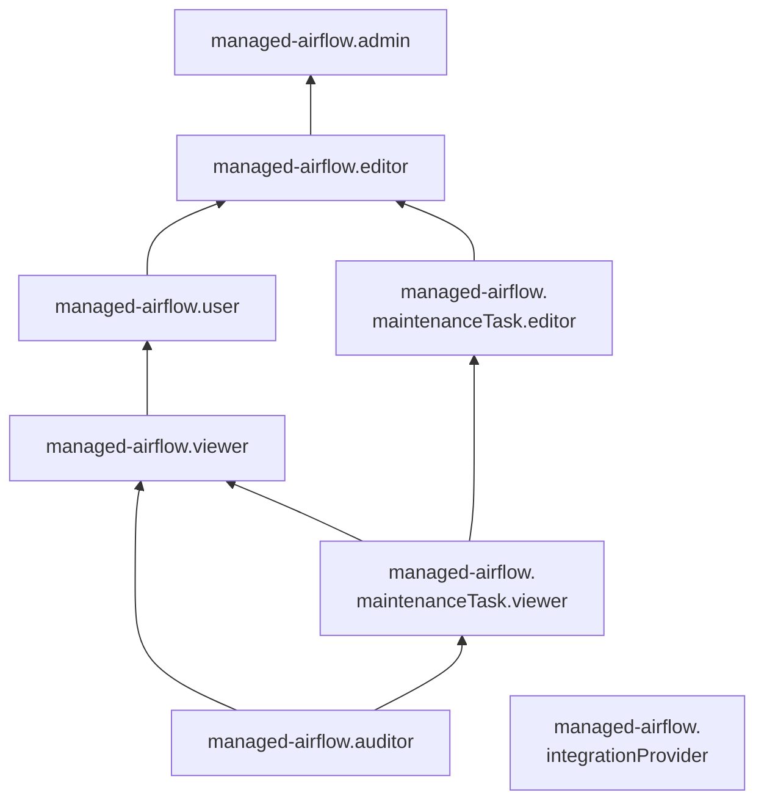

# Управление доступом в {{ maf-name }}

В этом разделе вы узнаете:

* [на какие ресурсы можно назначить роль](#resources);
* [какие роли действуют в сервисе](#roles-list).

## Об управлении доступом {#about-access-control}

Все операции в {{ yandex-cloud }} проверяются в сервисе [{{ iam-full-name }}](../../iam/index.md). Если у субъекта нет необходимых разрешений, сервис вернет ошибку.

Чтобы выдать разрешения к ресурсу, [назначьте роли](../../iam/operations/roles/grant.md) на этот ресурс субъекту, который будет выполнять операции. Роли можно назначить [аккаунту на Яндексе](../../iam/concepts/users/accounts.md#passport), [сервисному аккаунту](../../iam/concepts/users/service-accounts.md), [локальному пользователю](../../iam/concepts/users/accounts.md#local), [федеративному пользователю](../../iam/concepts/federations.md), [группе пользователей](../../organization/operations/manage-groups.md), [системной группе](../../iam/concepts/access-control/system-group.md) или [публичной группе](../../iam/concepts/access-control/public-group.md). Подробнее читайте в разделе [{#T}](../../iam/concepts/access-control/index.md).

Назначать роли на ресурс могут пользователи, у которых на этот ресурс есть роль `managed-airflow.admin` или одна из следующих ролей:

* `admin`;
* `resource-manager.admin`;
* `organization-manager.admin`;
* `resource-manager.clouds.owner`;
* `organization-manager.organizations.owner`.

## На какие ресурсы можно назначить роль {#resources}

Роль можно назначить на [организацию](../../organization/concepts/organization.md), [облако](../../resource-manager/concepts/resources-hierarchy.md#cloud) и [каталог](../../resource-manager/concepts/resources-hierarchy.md#folder). Роли, назначенные на организацию, облако или каталог, действуют и на вложенные ресурсы.

Чтобы разрешить доступ к ресурсам сервиса {{ maf-name }}, назначьте пользователю нужные роли на каталог, облако или организацию, в которых содержатся эти ресурсы.

В [консоли управления]({{ link-console-main }}), через [CLI](../../cli/index.md) или [API](../api-ref/authentication.md) роль также можно назначить на отдельный кластер.

## Какие роли действуют в сервисе {#roles-list}

### Сервисные роли {#service-roles}

Ниже перечислены все роли, которые учитываются при проверке прав доступа в сервисе.

#### managed-airflow.auditor {#managed-airflow-auditor}

Роль `managed-airflow.auditor` позволяет просматривать информацию о [кластерах {{ AF }}](../concepts/index.md#cluster) и назначенных [правах доступа](../../iam/concepts/access-control/index.md) к ним, а также о [квотах](../concepts/limits.md#quotas) сервиса {{ maf-name }}.

#### managed-airflow.viewer {#managed-airflow-viewer}

Роль `managed-airflow.viewer` позволяет просматривать информацию о [кластерах {{ AF }}](../concepts/index.md#cluster) и назначенных [правах доступа](../../iam/concepts/access-control/index.md) к ним, о заданиях на [техническое обслуживание](../concepts/maintenance.md) таких кластеров, а также о [квотах](../concepts/limits.md#quotas) сервиса {{ maf-name }}.

Включает разрешения, предоставляемые ролями `managed-airflow.auditor` и `managed-airflow.maintenanceTask.viewer`.

#### managed-airflow.user {#managed-airflow-user}

Роль `managed-airflow.user` позволяет выполнять базовые операции с кластерами {{ AF }}.

Пользователи с этой ролью могут:
* просматривать информацию о [кластерах {{ AF }}](../concepts/index.md#cluster) и назначенных [правах доступа](../../iam/concepts/access-control/index.md) к ним;
* [использовать веб-интерфейс](../operations/af-interfaces.md#web-gui) {{ AF }};
* [отправлять запросы](../operations/af-interfaces.md#rest-api) к API {{ AF }};
* просматривать информацию о заданиях на [техническое обслуживание](../concepts/maintenance.md) кластеров {{ AF }};
* просматривать информацию о [квотах](../concepts/limits.md#quotas) сервиса {{ maf-name }}.

Включает разрешения, предоставляемые ролью `managed-airflow.viewer`.

#### managed-airflow.editor {#managed-airflow-editor}

Роль `managed-airflow.editor` позволяет управлять кластерами {{ AF }}.

Пользователи с этой ролью могут:
* просматривать информацию о [кластерах {{ AF }}](../concepts/index.md#cluster), а также создавать, изменять, запускать, останавливать и удалять их;
* просматривать информацию о назначенных [правах доступа](../../iam/concepts/access-control/index.md) к кластерам {{ AF }};
* просматривать информацию о заданиях на [техническое обслуживание](../concepts/maintenance.md) кластеров {{ AF }} и изменять такие задания;
* [использовать веб-интерфейс](../operations/af-interfaces.md#web-gui) {{ AF }};
* [отправлять запросы](../operations/af-interfaces.md#rest-api) к API {{ AF }};
* просматривать информацию о [квотах](../concepts/limits.md#quotas) сервиса {{ maf-name }}.

Включает разрешения, предоставляемые ролями `managed-airflow.user` и `managed-airflow.maintenanceTask.editor`.

Для создания кластеров {{ AF }} дополнительно необходима роль `vpc.user`.

#### managed-airflow.admin {#managed-airflow-admin}

Роль `managed-airflow.admin` позволяет управлять кластерами {{ AF }} и доступом к ним.

Пользователи с этой ролью могут:
* просматривать информацию о назначенных [правах доступа](../../iam/concepts/access-control/index.md) к [кластерам {{ AF }}](../concepts/index.md#cluster) и изменять такие права доступа;
* просматривать информацию о кластерах {{ AF }}, а также создавать, изменять, запускать, останавливать и удалять их;
* просматривать информацию о заданиях на [техническое обслуживание](../concepts/maintenance.md) кластеров {{ AF }} и изменять такие задания;
* [использовать веб-интерфейс](../operations/af-interfaces.md#web-gui) {{ AF }};
* [отправлять запросы](../operations/af-interfaces.md#rest-api) к API {{ AF }};
* просматривать информацию о [квотах](../concepts/limits.md#quotas) сервиса {{ maf-name }}.

Включает разрешения, предоставляемые ролью `managed-airflow.editor`.

Для создания кластеров {{ AF }} дополнительно необходима роль `vpc.user`.

#### managed-airflow.maintenanceTask.viewer {#managed-airflow-maintenanceTask-viewer}

Роль `managed-airflow.maintenanceTask.viewer` позволяет просматривать информацию о [кластерах {{ AF }}](../concepts/index.md#cluster) и назначенных [правах доступа](../../iam/concepts/access-control/index.md) к ним, о заданиях на [техническое обслуживание](../concepts/maintenance.md) таких кластеров, а также о [квотах](../concepts/limits.md#quotas) сервиса {{ maf-name }}.

Включает разрешения, предоставляемые ролью `managed-airflow.auditor`.

#### managed-airflow.maintenanceTask.editor {#managed-airflow-maintenanceTask-editor}

Роль `managed-airflow.maintenanceTask.editor` позволяет просматривать информацию о заданиях на [техническое обслуживание](../concepts/maintenance.md) кластеров {{ AF }} и изменять такие задания, просматривать информацию о [кластерах {{ AF }}](../concepts/index.md#cluster) и назначенных [правах доступа](../../iam/concepts/access-control/index.md) к ним, а также о [квотах](../concepts/limits.md#quotas) сервиса {{ maf-name }}.

Включает разрешения, предоставляемые ролью `managed-airflow.maintenanceTask.viewer`.

#### managed-airflow.integrationProvider {#managed-airflow-integrationProvider}

Роль `managed-airflow.integrationProvider` позволяет кластеру {{ AF }} взаимодействовать от имени сервисного аккаунта с пользовательскими ресурсами, необходимыми для работы кластера. Роль назначается сервисному аккаунту, привязанному к кластеру {{ AF }}.



* добавлять записи в [лог-группы](../../logging/concepts/log-group.md);
* просматривать информацию о лог-группах;
* просматривать информацию о приемниках логов;
* просматривать информацию о назначенных [правах доступа](../../iam/concepts/access-control/index.md) к ресурсам сервиса {{ cloud-logging-name }};
* просматривать информацию о выгрузках логов;
* просматривать информацию о [метриках](../../monitoring/concepts/data-model.md#metric) {{ monitoring-name }} и их [метках](../../monitoring/concepts/data-model.md#label), а также загружать и выгружать метрики;
* просматривать список [дашбордов](../../monitoring/concepts/visualization/dashboard.md) и [виджетов](../../monitoring/concepts/visualization/widget.md) {{ monitoring-name }} и информацию о них, а также создавать, изменять и удалять дашборды и виджеты;
* просматривать историю [уведомлений](../../monitoring/concepts/alerting/notification-channel.md) {{ monitoring-name }};
* просматривать список [бакетов](../../storage/concepts/bucket.md) и информацию о них, в том числе о регионе размещения, [версионировании](../../storage/concepts/versioning.md), [шифровании](../../storage/concepts/encryption.md), конфигурации [CORS](../../storage/concepts/cors.md), конфигурации [хостинга статических сайтов](../../storage/concepts/hosting.md), конфигурации [HTTPS](../../storage/concepts/bucket.md#bucket-https), настройках [логирования](../../storage/concepts/server-logs.md), назначенных правах доступа, [публичном доступе](../../storage/concepts/bucket.md#bucket-access) и [классе хранилища](../../storage/concepts/storage-class.md#default-storage-class) по умолчанию;
* просматривать списки [объектов](../../storage/concepts/object.md) в бакетах и информацию об объектах, в том числе о конфигурации [жизненных циклов](../../storage/concepts/lifecycles.md) объектов, назначенных правах доступа к объектам, текущих [составных загрузках](../../storage/concepts/multipart.md), версиях объектов с их [метаданными](../../storage/concepts/object.md#metadata), временных и бессрочных [блокировках версий объектов](../../storage/concepts/object-lock.md);
* просматривать [метки](../../storage/concepts/tags.md) бакетов, объектов и версий объектов, а также статистику сервиса {{ objstorage-name }};
* просматривать информацию о [секретах {{ lockbox-name }}](../../lockbox/concepts/secret.md#secret) и назначенных правах доступа к ним;
* просматривать информацию о квотах сервисов [{{ objstorage-name }}](../../storage/concepts/limits.md#storage-quotas), [{{ monitoring-name }}](../../monitoring/concepts/limits.md#monitoring-quotas) и [{{ lockbox-name }}](../../lockbox/concepts/limits.md#quotas);
* просматривать информацию об [облаке](../../resource-manager/concepts/resources-hierarchy.md#cloud) и [каталоге](../../resource-manager/concepts/resources-hierarchy.md#folder).



Включает разрешения, предоставляемые ролями `logging.writer`, `monitoring.editor`, `storage.viewer` и `lockbox.viewer`.

Роль не разрешает доступ к содержимому секретов {{ lockbox-name }}. Для того чтобы кластер {{ AF }} имел доступ к содержимому секретов в {{ lockbox-name }}, выдайте [сервисному аккаунту](../../iam/concepts/users/service-accounts.md) дополнительную [роль](../../lockbox/security/index.md#lockbox-payloadViewer) `lockbox.payloadViewer` на каталог или на определенные секреты.

### Примитивные роли {#primitive-roles}

#### {{ roles-viewer }} {#viewer}

Роль `{{ roles-viewer }}` позволяет просматривать информацию о кластерах {{ maf-name }} и логах их работы.

#### {{ roles-editor }} {#editor}

Пользователь с ролью `{{ roles-editor }}` может управлять любыми ресурсами, например создать кластер, создать или удалить подкластер в кластере.

Включает в себя роль `{{ roles-viewer }}`.

#### {{ roles-admin }} {#admin}

Пользователь с ролью `{{ roles-admin }}` может управлять правами доступа к ресурсам, например разрешить другим пользователям создавать кластеры {{ maf-name }} или просматривать информацию о правах пользователей.

Включает в себя роль `{{ roles-editor }}`.

## Какие роли необходимы {#required-roles}

Чтобы пользоваться сервисом, необходима роль [{{ roles.maf.editor }} или выше](../../iam/concepts/access-control/roles.md) на каталог, в котором создается кластер. Роль `{{ roles.maf.viewer }}` позволит только просматривать список кластеров.

Чтобы создать кластер {{ maf-name }}, нужна роль [{{ roles-vpc-user }}](../../vpc/security/index.md#vpc-user) и роль `{{ roles.maf.editor }}` или выше.

Вы всегда можете назначить роль, которая дает более широкие разрешения. Например, назначить `{{ roles.maf.admin }}` вместо `{{ roles.maf.editor }}`.

## Что дальше {#whats-next}

* [Как назначить роль](../../iam/operations/roles/grant.md).
* [Как отозвать роль](../../iam/operations/roles/revoke.md).
* [Подробнее об управлении доступом в {{ yandex-cloud }}](../../iam/concepts/access-control/index.md).
* [Подробнее о наследовании ролей](../../resource-manager/concepts/resources-hierarchy.md#access-rights-inheritance).