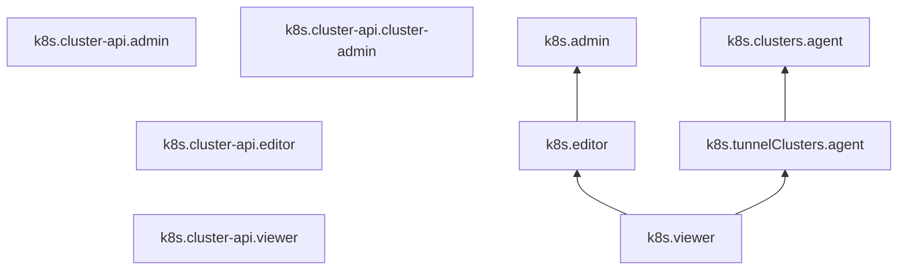

# Управление доступом в {{ managed-k8s-name }}

В этом разделе вы узнаете:
* [На какие ресурсы можно назначить роль](#resources).
* [Какие роли действуют в сервисе](#roles-list).
* [Какие роли необходимы для управления {{ managed-k8s-name }}](#required-roles).
* [Какие роли необходимы сервисным аккаунтам кластера {{ managed-k8s-name }}](#sa-annotation).
* [Какие роли нужны для работы с {{ managed-k8s-name }} через консоль управления {{ yandex-cloud }}](#ui-annotation).

## Об управлении доступом {#about-access-control}

Все операции в {{ yandex-cloud }} проверяются в сервисе [{{ iam-full-name }}](../../iam/index.md). Если у субъекта нет необходимых разрешений, сервис вернет ошибку.


Чтобы выдать разрешения к ресурсу, [назначьте роли](../../iam/operations/roles/grant.md) на этот ресурс субъекту, который будет выполнять операции. Роли можно назначить [аккаунту на Яндексе](../../iam/concepts/users/accounts.md#passport), [сервисному аккаунту](../../iam/concepts/users/service-accounts.md), [локальному пользователю](../../iam/concepts/users/accounts.md#local), [федеративному пользователю](../../iam/concepts/federations.md), [группе пользователей](../../organization/operations/manage-groups.md), [системной группе](../../iam/concepts/access-control/system-group.md) или [публичной группе](../../iam/concepts/access-control/public-group.md). Подробнее читайте в разделе [{#T}](../../iam/concepts/access-control/index.md).

Назначать роли на ресурс могут пользователи, у которых на этот ресурс есть роль `k8s.admin` или одна из следующих ролей:

* `admin`;
* `resource-manager.admin`;
* `organization-manager.admin`;
* `resource-manager.clouds.owner`;
* `organization-manager.organizations.owner`.

## На какие ресурсы можно назначить роль {#resources}

Роль можно назначить на [организацию](../../organization/concepts/organization.md), [облако](../../resource-manager/concepts/resources-hierarchy.md#cloud) и [каталог](../../resource-manager/concepts/resources-hierarchy.md#folder). Роли, назначенные на организацию, облако или каталог, действуют и на вложенные ресурсы.

Также вы можете назначить [роли для доступа к {{ k8s }} API](#k8s-api) на отдельный кластер через {{ yandex-cloud }} [CLI](../../cli/cli-ref/managed-kubernetes/cli-ref/cluster/add-access-binding.md), [{{ TF }}]({{ tf-provider-resources-link }}/kubernetes_cluster_iam_binding) или [API](../api-ref/authentication.md). Подробнее см. на странице [{#T}](../operations/kubernetes-cluster/kubernetes-cluster-access.md).

## Какие роли действуют в сервисе {#roles-list}

На диаграмме показано, какие роли есть в сервисе и как они наследуют разрешения друг друга. Например, в `{{ roles-editor }}` входят все разрешения `{{ roles-viewer }}`. После диаграммы дано описание каждой роли.



### Роли для доступа к {{ k8s }} API {#k8s-api}

Следующие [роли](../../iam/concepts/access-control/roles.md) дают права на управление ресурсами [кластера {{ managed-k8s-name }}](../concepts/index.md#kubernetes-cluster) через {{ k8s }} API. Роли {{ k8s }} API работают по [модели ролевого управления доступом](https://kubernetes.io/docs/reference/access-authn-authz/rbac/) – Role-Based Access Control (RBAC). Для управления кластером {{ managed-k8s-name }} эти роли необходимо компоновать с [ролями для API {{ yandex-cloud }}](#yc-api). Подробнее о ролях в {{ k8s }} RBAC читайте в [документации {{ k8s }}](https://kubernetes.io/docs/reference/access-authn-authz/rbac/#user-facing-roles).

Чтобы просмотреть права на ресурсы кластера {{ managed-k8s-name }}, доступные для определенной роли, выполните команду:

```bash
kubectl describe clusterrole <роль_в_{{ k8s }}_RBAC>
```

#### k8s.cluster-api.viewer {#k8s-cluster-api-viewer}

Пользователь с ролью `k8s.cluster-api.viewer` получает группу `yc:viewer` и роль `view` в {{ k8s }} RBAC для всех пространств имен в кластере.

#### k8s.cluster-api.editor {#k8s-cluster-api-editor}

Пользователь с ролью `k8s.cluster-api.editor` получает группу `yc:editor` и роль `edit` в {{ k8s }} RBAC для всех пространств имен в кластере.

#### k8s.cluster-api.admin {#k8s-cluster-api-admin}

Пользователь с ролью `k8s.cluster-api.admin` получает группу `yc:k8s-core-admin` и роль `admin` в {{ k8s }} RBAC.

#### k8s.cluster-api.cluster-admin {#k8s-cluster-api-cluster-admin}

Пользователь с ролью `k8s.cluster-api.cluster-admin` получает группу `yc:admin` и роль `cluster-admin` в {{ k8s }} RBAC.

### Роли {{ managed-k8s-name }} {#yc-api}

Описанные ниже роли позволяют управлять кластерами {{ managed-k8s-name }} и [группами узлов](../concepts/index.md#node-group) без публичного доступа через API {{ yandex-cloud }}. Для управления ресурсами кластера {{ managed-k8s-name }} эти роли необходимо компоновать с [ролями для {{ k8s }} API](#k8s-api). При создании кластера {{ managed-k8s-name }} проверяются роли его сервисного аккаунта.

Для управления кластером {{ managed-k8s-name }} и группой узлов без публичного доступа необходима роль `k8s.clusters.agent`.

Для управления кластером {{ managed-k8s-name }} и группой с публичным доступом необходимы роли:
* `k8s.clusters.agent`.
* `{{ roles-vpc-public-admin }}`.

Для управления кластером {{ managed-k8s-name }} с облачной сетью из другого каталога дополнительно необходимы роли в этом каталоге:
* [{{ roles-vpc-private-admin }}](../../vpc/security/index.md#vpc-private-admin)
* [{{ roles-vpc-user }}](../../vpc/security/index.md#vpc-user)
* [vpc.bridgeAdmin](../../vpc/security/index.md#vpc-bridge-admin)

Для управления кластером {{ managed-k8s-name }} с [туннельным режимом](../concepts/network-policy.md#cilium) достаточно роли `k8s.tunnelClusters.agent`.

#### k8s.viewer {#k8s-viewer}

Роль `k8s.viewer` позволяет просматривать информацию о кластерах и группах узлов {{ k8s }}.

Пользователи с этой ролью могут:
* просматривать список [кластеров {{ k8s }}](../concepts/index.md#kubernetes-cluster), информацию о них и настройках их взаимодействия с {{ marketplace-name }}, а также о назначенных [правах доступа](../../iam/concepts/access-control/index.md) к ним;
* просматривать список [групп узлов](../concepts/index.md#node-group) кластеров {{ k8s }} и информацию о таких группах узлов;
* просматривать информацию о приложениях из {{ marketplace-name }}, а также о назначенных правах доступа к ним;
* просматривать статистику использования ресурсов и информацию о [квотах](../concepts/limits.md#managed-k8s-quotas) сервиса {{ managed-k8s-name }};
* просматривать информацию об [облаке](../../resource-manager/concepts/resources-hierarchy.md#cloud) и [каталоге](../../resource-manager/concepts/resources-hierarchy.md#folder).

#### k8s.editor {#k8s-editor}

Роль `k8s.editor` позволяет управлять кластерами и группами узлов {{ k8s }}.

Пользователи с этой ролью могут:
* просматривать список [кластеров {{ k8s }}](../concepts/index.md#kubernetes-cluster), информацию о них и о назначенных [правах доступа](../../iam/concepts/access-control/index.md) к ним;
* создавать, изменять, запускать, останавливать и удалять кластеры Kubernetes;
* просматривать список [групп узлов](../concepts/index.md#node-group) кластеров {{ k8s }} и информацию о таких группах узлов;
* создавать, изменять и удалять группы узлов кластеров Kubernetes;
* просматривать и изменять настройки взаимодействия кластеров {{ k8s }} с {{ marketplace-name }};
* просматривать информацию о приложениях из {{ marketplace-name }} и о назначенных правах доступа к ним, а также устанавливать, обновлять и удалять такие приложения;
* просматривать статистику использования ресурсов и информацию о [квотах](../concepts/limits.md#managed-k8s-quotas) сервиса {{ managed-k8s-name }};
* просматривать информацию об [облаке](../../resource-manager/concepts/resources-hierarchy.md#cloud) и [каталоге](../../resource-manager/concepts/resources-hierarchy.md#folder).

Включает разрешения, предоставляемые ролью `k8s.viewer`.

#### k8s.admin {#k8s-admin}

Роль `k8s.admin` позволяет управлять кластерами и группами узлов {{ k8s }}, а также доступом к кластерам {{ k8s }}.

Пользователи с этой ролью могут:
* просматривать список [кластеров {{ k8s }}](../concepts/index.md#kubernetes-cluster) и информацию о них, а также создавать, изменять, запускать, останавливать и удалять кластеры {{ k8s }};
* просматривать информацию о назначенных [правах доступа](../../iam/concepts/access-control/index.md) к кластерам {{ k8s }} и изменять такие права доступа;
* просматривать список [групп узлов](../concepts/index.md#node-group) кластеров {{ k8s }} и информацию о таких группах узлов, а также создавать, изменять и удалять группы узлов кластеров {{ k8s }};
* просматривать и изменять настройки взаимодействия кластеров {{ k8s }} с {{ marketplace-name }};
* просматривать информацию о приложениях из {{ marketplace-name }}, а также устанавливать, обновлять и удалять такие приложения;
* просматривать информацию о назначенных правах доступа к приложениям из {{ marketplace-name }} и изменять такие права доступа;
* просматривать статистику использования ресурсов и информацию о [квотах](../concepts/limits.md#managed-k8s-quotas) сервиса {{ managed-k8s-name }};
* просматривать информацию об [облаке](../../resource-manager/concepts/resources-hierarchy.md#cloud) и [каталоге](../../resource-manager/concepts/resources-hierarchy.md#folder).

Включает разрешения, предоставляемые ролью `k8s.editor`.

#### k8s.tunnelClusters.agent {#k8s-tunnelclusters-agent}

`k8s.tunnelClusters.agent` — специальная роль для создания [кластера {{ k8s }}](../concepts/index.md#kubernetes-cluster) с туннельным режимом. Дает право на создание [групп узлов](../concepts/index.md#node-group), дисков, внутренних балансировщиков. Позволяет использовать заранее созданные [ключи](../../kms/concepts/key.md) {{ kms-full-name }} для шифрования и расшифрования секретов.

Включает разрешения, предоставляемые ролями `compute.admin`, `iam.serviceAccounts.user`, `k8s.viewer`, `kms.keys.encrypterDecrypter` и `load-balancer.privateAdmin`.

#### k8s.clusters.agent {#k8s-clusters-agent}

`k8s.clusters.agent` — специальная роль для сервисного аккаунта [кластера {{ k8s }}](../concepts/index.md#kubernetes-cluster). Дает право на создание [групп узлов](../concepts/index.md#node-group), дисков, внутренних балансировщиков. Позволяет использовать заранее созданные [ключи](../../kms/concepts/key.md) {{ kms-full-name }} для шифрования и расшифрования секретов, а также подключать заранее созданные [группы безопасности](../../vpc/concepts/security-groups.md). В комбинации с [ролью](../../network-load-balancer/security/index.md#load-balancer-admin) `load-balancer.admin` позволяет создать [сетевой балансировщик нагрузки](../../network-load-balancer/concepts/index.md) с публичным IP-адресом.

Включает разрешения, предоставляемые ролями `k8s.tunnelClusters.agent` и `vpc.privateAdmin`.

### Примитивные роли {#primitive-roles}

#### {{ roles-viewer }} {#viewer}

Роль `viewer` предоставляет разрешения на чтение информации о любых [ресурсах]({{ link-docs }}/resource-manager/concepts/resources-hierarchy) Yandex Cloud.

Включает разрешения, предоставляемые ролью `auditor`.

В отличие от роли `auditor`, роль `viewer` предоставляет доступ к данным [сервисов]({{ link-docs }}/overview/concepts/services) в режиме чтения.

#### {{ roles-editor }} {#editor}

Роль `editor` предоставляет разрешения на управление любыми [ресурсами]({{ link-docs }}/resource-manager/concepts/resources-hierarchy) Yandex Cloud, кроме назначения ролей другим пользователям, передачи прав владения [организацией]({{ link-docs }}/organization/concepts/organization) и ее удаления, а также удаления [ключей шифрования]({{ link-docs }}/kms/concepts/) Key Management Service.

Например, пользователи с этой ролью могут создавать, изменять и удалять ресурсы.

Включает разрешения, предоставляемые ролью `viewer`.

#### {{ roles-admin }} {#admin}

Роль `admin` позволяет назначать любые роли, кроме `resource-manager.clouds.owner` и `organization-manager.organizations.owner`, а также предоставляет разрешения на управление любыми [ресурсами]({{ link-docs }}/resource-manager/concepts/resources-hierarchy) Yandex Cloud, кроме передачи прав владения [организацией]({{ link-docs }}/organization/concepts/organization) и ее удаления.

Прежде чем назначить роль `admin` на организацию, [облако]({{ link-docs }}/resource-manager/concepts/resources-hierarchy#cloud) или [платежный аккаунт]({{ link-docs }}/billing/concepts/billing-account), ознакомьтесь с информацией о защите [привилегированных аккаунтов]({{ link-docs }}/security/standard/all#privileged-users).

Включает разрешения, предоставляемые ролью `editor`.



Вы можете предоставить пользователям гранулярный доступ в пространства имен кластера с помощью механизма {{ k8s }} RBAC.



1. Создайте в кластере роль, которая позволит управлять всеми ресурсами в заданном пространстве имен:

    ```yaml
    apiVersion: rbac.authorization.k8s.io/v1
    kind: Role
    metadata:
      namespace: <пространство_имен>
      name: <название_роли>
    rules:
    - apiGroups: [""]
      resources: ["*"]   
      verbs: ["*"]                   
    ```

1. Создайте связь с этой ролью для аккаунта пользователя:

    ```yaml
    apiVersion: rbac.authorization.k8s.io/v1
    kind: RoleBinding
    metadata:
      name: iam-user
      namespace: <пространство_имен>
    roleRef:
      apiGroup: rbac.authorization.k8s.io
      kind: Role
      name: <название_роли>
    subjects:
    - kind: User
      name: <идентификатор_аккаунта>
    ```

Подробности о получении идентификатора аккаунта см. на странице [Получение информации о пользователе](../../organization/operations/users-get.md).

Проверьте создание ресурсов в кластере. В других пространствах имен пользователь не будет иметь право на создание или редактирование ресурсов.





## Какие роли необходимы для создания {{ managed-k8s-name }} {#required-roles}

Для создания кластера {{ managed-k8s-name }} и группы узлов [аккаунт](../../iam/concepts/users/accounts.md), с помощью которого вы собираетесь создавать кластер, должен иметь [роли](../../iam/concepts/access-control/roles.md):
* [{{ roles.k8s.editor }}](#k8s-editor) или выше.
* [iam.serviceAccounts.user](../../iam/security/index.md#iam-serviceAccounts-user).

Чтобы создать кластер {{ managed-k8s-name }} и группу узлов с публичным доступом, дополнительно нужна роль [{{ roles-vpc-public-admin }}](../../vpc/security/index.md#vpc-public-admin).

## Сервисные аккаунты кластера {{ managed-k8s-name }} {#sa-annotation}

При создании кластера {{ managed-k8s-name }} необходимо указать два [сервисных аккаунта](../../iam/concepts/users/service-accounts.md):
* **Сервисный аккаунт кластера** — от имени этого сервисного аккаунта сервис {{ managed-k8s-name }} управляет узлами кластера, [подсетями](../../vpc/concepts/network.md#subnet) для [подов](../concepts/index.md#pod) и [сервисов](../concepts/index.md#service), [дисками](../../compute/concepts/disk.md), [балансировками нагрузки](../../network-load-balancer/concepts/index.md), а также шифрует и дешифрует [секреты](../../lockbox/concepts/secret.md). Минимально рекомендуемая роль для такого аккаунта — `k8s.clusters.agent`.
* **Сервисный аккаунт группы узлов** — от имени этого сервисного аккаунта узлы кластера {{ managed-k8s-name }} аутентифицируются в [{{ container-registry-full-name }}](../../container-registry/concepts/index.md) или в [{{ cloud-registry-full-name }}](../../cloud-registry/concepts/index.md). Для других container registry роли сервисному аккаунту назначать не требуется.
  
  Чтобы узлы могли скачивать Docker-образы из реестра:

  * {{ container-registry-full-name }} — назначьте сервисному аккаунту роль [container-registry.images.puller](../../container-registry/security/index.md#container-registry-images-puller).
  * {{ cloud-registry-full-name }} — назначьте сервисному аккаунту роль [cloud-registry.artifacts.puller](../../cloud-registry/security/index.md#cloud-registry-artifacts-puller).

Для управления кластером {{ managed-k8s-name }} и группами узлов с публичным доступом дополнительно необходима роль `{{ roles-vpc-public-admin }}`.

При использовании в кластере {{ managed-k8s-name }} облачной сети из другого каталога сервисному аккаунту кластера дополнительно необходимы роли в этом каталоге:
* [{{ roles-vpc-private-admin }}](../../vpc/security/index.md#vpc-private-admin)
* [{{ roles-vpc-user }}](../../vpc/security/index.md#vpc-user)
* [vpc.bridgeAdmin](../../vpc/security/index.md#vpc-bridge-admin)

## Доступ к консоли управления {{ managed-k8s-name }} {#ui-annotation}

`k8s.viewer` — минимально необходимая роль для доступа к {{ managed-k8s-name }} через [консоль управления]({{ link-console-main }}) {{ yandex-cloud }}. Роль `k8s.viewer` дает доступ только к основной информации о [группах узлов](../operations/node-group/node-group-list.md#get). 

Комбинация ролей `k8s.viewer` и `k8s.clusters.agent` позволяет просматривать всю информацию о группах узлов, но не об отдельных узлах кластера.

Комбинация ролей `k8s.cluster-api.cluster-admin`, `k8s.clusters.agent` и `monitoring.viewer` дает доступ к просмотру подробной информации о группах узлов и отдельных [узлах кластера](../operations/node-group/node-group-list.md#get-node). В консоли управления для каждого узла становятся доступны все вкладки, включая вкладку **{{ ui-key.yacloud.k8s.node.overview.label_monitoring }}**.

Для просмотра ресурсов кластера [в разделе {{ ui-key.yacloud.k8s.network.label_ingress }}](../operations/kubernetes-console/network.md) нужна [роль](../../application-load-balancer/security/index.md#alb-auditor) `alb.auditor` или выше.

Чтобы предоставить более гранулярный доступ к необходимым ресурсам, вы можете:
* Настроить дополнительные права в {{ k8s }} RBAC для соответствующих пользователей.
* Расширить роли `view` и `edit` в {{ k8s }} RBAC с помощью [агрегации ролей](https://kubernetes.io/docs/reference/access-authn-authz/rbac/#user-facing-roles). Например, вы можете разрешить всем пользователям с ролью `view` в {{ k8s }} API (в том числе пользователям с облачной ролью `k8s.cluster-api.viewer`) просмотр информации об узлах, добавив следующую роль в кластер {{ managed-k8s-name }}:

  ```yaml
  apiVersion: rbac.authorization.k8s.io/v1
  kind: ClusterRole
  metadata:
    name: view-extensions
    labels:
      rbac.authorization.k8s.io/aggregate-to-view: "true"
  rules:
  - apiGroups: [""]
    resources: ["nodes"]
    verbs: ["get", "list", "watch"]
  ```

## Федерации сервисных аккаунтов {{ iam-full-name }}

В {{ managed-k8s-name }} реализована интеграция с _федерациями сервисных аккаунтов_ {{ iam-name }}.

[Федерации сервисных аккаунтов](../../iam/concepts/workload-identity.md) (Workload Identity Federation) позволяют настроить связь между внешними системами и {{ yandex-cloud }} по протоколу [OpenID Connect](https://openid.net/developers/how-connect-works/) (OIDC). За счет этого внешние системы могут выполнять действия с ресурсами {{ yandex-cloud }} от имени [сервисных аккаунтов](../../iam/concepts/users/service-accounts.md) {{ iam-short-name }} без использования [авторизованных ключей](../../iam/concepts/authorization/key.md). Это более безопасный способ, минимизирующий риск утечки учетных данных и возможность несанкционированного доступа.

При включении опции {{ managed-k8s-name }} автоматически создает для конкретного кластера OIDC-провайдер и предоставляет следующие параметры для интеграции с федерациями сервисных аккаунтов:
* `{{ ui-key.yacloud.k8s.IAMService.ClusterIAMSection.iam-issuer_iKJcv }}`.
* `{{ ui-key.yacloud.k8s.IAMService.ClusterIAMSection.iam-jwks-uri_x2AJJ }}`.


Например, вы можете настроить [{#T}](../tutorials/wlif-managed-k8s-integration.md).