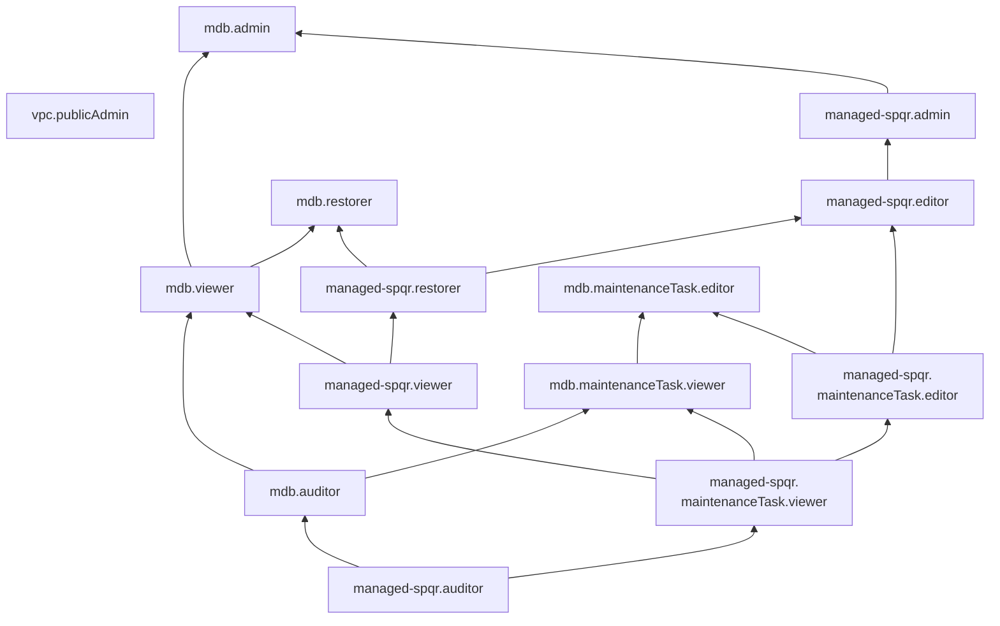

# Управление доступом в Managed Service for Sharded PostgreSQL

В этом разделе вы узнаете:

* [на какие ресурсы можно назначить роль](#resources);
* [какие роли действуют в сервисе](#roles-list);
* [какие роли необходимы](#required-roles) для того или иного действия.

## Об управлении доступом {#about-access-control}

Все операции в Yandex Cloud проверяются в сервисе [Yandex Identity and Access Management](../iam/index.md). Если у субъекта нет необходимых разрешений, сервис вернет ошибку.

Чтобы выдать разрешения к ресурсу, [назначьте роли](../iam/operations/roles/grant.md) на этот ресурс субъекту, который будет выполнять операции. Роли можно назначить [аккаунту на Яндексе](../iam/concepts/users/accounts.md#passport), [сервисному аккаунту](../iam/concepts/users/service-accounts.md), [локальному пользователю](../iam/concepts/users/accounts.md#local), [федеративному пользователю](../iam/concepts/federations.md), [группе пользователей](../organization/operations/manage-groups.md), [системной группе](../iam/concepts/access-control/system-group.md) или [публичной группе](../iam/concepts/access-control/public-group.md). Подробнее читайте в разделе [Как устроено управление доступом в Yandex Cloud](../iam/concepts/access-control/index.md).

Назначать роли на ресурс могут пользователи, у которых на этот ресурс есть роль `mdb.admin`, `managed-spqr.admin` или одна из следующих ролей:

* `admin`;
* `resource-manager.admin`;
* `organization-manager.admin`;
* `resource-manager.clouds.owner`;
* `organization-manager.organizations.owner`.

## На какие ресурсы можно назначить роль {#resources}

Роль можно назначить на [организацию](../organization/concepts/organization.md), [облако](../resource-manager/concepts/resources-hierarchy.md#cloud) и [каталог](../resource-manager/concepts/resources-hierarchy.md#folder). Роли, назначенные на организацию, облако или каталог, действуют и на вложенные ресурсы.

Чтобы разрешить доступ к ресурсам сервиса (кластеры и хосты БД, резервные копии кластеров, базы данных и их пользователи), назначьте пользователю нужные роли на каталог, облако или организацию, в которых содержатся эти ресурсы.

В [консоли управления](https://console.yandex.cloud) или через [API](api-ref/authentication.md) роль также можно назначить на отдельный кластер.

## Какие роли действуют в сервисе {#roles-list}

На диаграмме показано, какие роли есть в сервисе и как они наследуют разрешения друг друга. Например, в `editor` входят все разрешения `viewer`. После диаграммы дано описание каждой роли.

### Сервисные роли {#service-roles}

#### managed-spqr.auditor {#managed-spqr-auditor}

Роль `managed-spqr.auditor` позволяет просматривать информацию о [хостах](concepts/instance-types.md) и [кластерах](concepts/index.md) Sharded PostgreSQL, назначенных [правах доступа](../iam/concepts/access-control/index.md) к кластерам, а также о [квотах](concepts/limits.md#mspqr-quotas) и операциях с ресурсами сервиса Managed Service for Sharded PostgreSQL.

#### managed-spqr.viewer {#managed-spqr-viewer}

Роль `managed-spqr.viewer` позволяет просматривать информацию о кластерах, хостах, базах данных и пользователях в кластерах Sharded PostgreSQL, логи работы кластеров, а также данные о квотах и операциях с ресурсами сервиса.

Пользователи с этой ролью могут:
* просматривать информацию о [кластерах](concepts/index.md) Sharded PostgreSQL и назначенных [правах доступа](../iam/concepts/access-control/index.md) к ним;
* просматривать информацию о заданиях на техническое обслуживание кластеров Sharded PostgreSQL;
* просматривать информацию о [хостах](concepts/instance-types.md) кластеров Sharded PostgreSQL;
* просматривать информацию о базах данных в кластерах Sharded PostgreSQL;
* просматривать информацию о пользователях в кластерах Sharded PostgreSQL;
* просматривать информацию о резервных копиях кластеров Sharded PostgreSQL;
* просматривать логи работы кластеров Sharded PostgreSQL;
* просматривать информацию о [квотах](concepts/limits.md#mspqr-quotas) сервиса Managed Service for Sharded PostgreSQL;
* просматривать информацию об операциях с ресурсами сервиса Managed Service for Sharded PostgreSQL.

Включает разрешения, предоставляемые ролями `managed-spqr.auditor` и `managed-spqr.maintenanceTask.viewer`.

#### managed-spqr.restorer {#managed-spqr-restorer}

Роль `managed-spqr.restorer` позволяет восстанавливать кластеры Sharded PostgreSQL из резервных копий, а также просматривать информацию о кластерах, хостах, базах данных и пользователях в кластерах Sharded PostgreSQL, логи работы кластеров, данные о квотах и операциях с ресурсами сервиса.

Пользователи с этой ролью могут:
* просматривать информацию о резервных копиях [кластеров](concepts/index.md) Sharded PostgreSQL, а также восстанавливать кластеры из резервных копий;
* просматривать информацию о кластерах Sharded PostgreSQL и назначенных [правах доступа](../iam/concepts/access-control/index.md) к ним;
* просматривать информацию о заданиях на техническое обслуживание кластеров Sharded PostgreSQL;
* просматривать информацию о [хостах](concepts/instance-types.md) кластеров Sharded PostgreSQL;
* просматривать информацию о базах данных в кластерах Sharded PostgreSQL;
* просматривать информацию о пользователях в кластерах Sharded PostgreSQL;
* просматривать логи работы кластеров Sharded PostgreSQL;
* просматривать информацию о [квотах](concepts/limits.md#mspqr-quotas) сервиса Managed Service for Sharded PostgreSQL;
* просматривать информацию об операциях с ресурсами сервиса Managed Service for Sharded PostgreSQL.

Включает разрешения, предоставляемые ролью `managed-spqr.viewer`.

#### managed-spqr.editor {#managed-spqr-editor}

Роль `managed-spqr.editor` позволяет управлять кластерами Sharded PostgreSQL.

Пользователи с этой ролью могут:
* просматривать информацию о [кластерах](concepts/index.md) Sharded PostgreSQL и назначенных [правах доступа](../iam/concepts/access-control/index.md) к ним;
* создавать, изменять, удалять, запускать и останавливать кластеры Sharded PostgreSQL;
* просматривать информацию о заданиях на техническое обслуживание кластеров Sharded PostgreSQL и изменять такие задания;
* просматривать информацию о [хостах](concepts/instance-types.md) кластеров Sharded PostgreSQL, а также создавать, изменять и удалять такие хосты;
* просматривать информацию о базах данных в кластерах Sharded PostgreSQL, а также создавать, изменять и удалять такие базы данных;
* просматривать информацию о пользователях в кластерах Sharded PostgreSQL, а также создавать, изменять и удалять таких пользователей;
* просматривать информацию о резервных копиях кластеров Sharded PostgreSQL, создавать и удалять резервные копии, а также восстанавливать кластеры из резервных копий;
* просматривать логи работы кластеров Sharded PostgreSQL;
* просматривать информацию о [квотах](concepts/limits.md#mspqr-quotas) сервиса Managed Service for Sharded PostgreSQL;
* просматривать информацию об операциях с ресурсами сервиса Managed Service for Sharded PostgreSQL.

Включает разрешения, предоставляемые ролями `managed-spqr.viewer`, `managed-spqr.restorer` и `managed-spqr.maintenanceTask.editor`.

#### managed-spqr.admin {#managed-spqr-admin}

Роль `managed-spqr.admin` позволяет управлять кластерами Sharded PostgreSQL и доступом к ним.

Пользователи с этой ролью могут:
* просматривать информацию о назначенных [правах доступа](../iam/concepts/access-control/index.md) к [кластерам Sharded PostgreSQL](concepts/index.md) и изменять такие права доступа;
* просматривать информацию о кластерах Sharded PostgreSQL, а также создавать, изменять, удалять, запускать и останавливать их;
* просматривать информацию о заданиях на техническое обслуживание кластеров Sharded PostgreSQL и изменять такие задания;
* просматривать информацию о [хостах](concepts/instance-types.md) кластеров Sharded PostgreSQL, а также создавать, изменять и удалять такие хосты;
* просматривать информацию о базах данных в кластерах Sharded PostgreSQL, а также создавать, изменять и удалять такие базы данных;
* просматривать информацию о пользователях в кластерах Sharded PostgreSQL, а также создавать, изменять и удалять таких пользователей;
* просматривать информацию о резервных копиях кластеров Sharded PostgreSQL, создавать и удалять резервные копии, а также восстанавливать кластеры из резервных копий;
* просматривать логи работы кластеров Sharded PostgreSQL;
* просматривать информацию о [квотах](concepts/limits.md#mspqr-quotas) сервиса Managed Service for Sharded PostgreSQL;
* просматривать информацию об операциях с ресурсами сервиса Managed Service for Sharded PostgreSQL.

Включает разрешения, предоставляемые ролью `managed-spqr.editor`.

#### managed-spqr.maintenanceTask.viewer {#managed-spqr-maintenanceTask-viewer}

Роль `managed-spqr.maintenanceTask.viewer` позволяет просматривать информацию о заданиях на техническое обслуживание кластеров Sharded PostgreSQL, а также о таких [кластерах](concepts/index.md) и назначенных [правах доступа](../iam/concepts/access-control/index.md) к ним, о [хостах](concepts/instance-types.md) кластеров, [квотах](concepts/limits.md#mspqr-quotas) и операциях с ресурсами сервиса Managed Service for Sharded PostgreSQL.

Включает разрешения, предоставляемые ролью `managed-spqr.auditor`.

#### managed-spqr.maintenanceTask.editor {#managed-spqr-maintenanceTask-editor}

Роль `managed-spqr.maintenanceTask.editor` позволяет просматривать информацию о заданиях на техническое обслуживание [кластеров Sharded PostgreSQL](concepts/index.md) и изменять такие задания, просматривать информацию о кластерах Sharded PostgreSQL и назначенных [правах доступа](../iam/concepts/access-control/index.md) к ним, а также о [хостах](concepts/instance-types.md) кластеров, [квотах](concepts/limits.md#mspqr-quotas) и операциях с ресурсами сервиса Managed Service for Sharded PostgreSQL.

Включает разрешения, предоставляемые ролью `managed-spqr.maintenanceTask.viewer`.

#### mdb.auditor {#mdb-auditor}

Роль `mdb.auditor` предоставляет минимально необходимые разрешения для просмотра информации о кластерах управляемых баз данных (без доступа к данным и логам работы).

Пользователи с этой ролью могут просматривать информацию о кластерах управляемых баз данных, квотах и операциях с ресурсами сервисов.

Включает разрешения, предоставляемые ролями `managed-opensearch.auditor`, `managed-kafka.auditor`, `managed-mysql.auditor`, `managed-postgresql.auditor`, `managed-spqr.auditor`, `managed-greenplum.auditor`, `managed-clickhouse.auditor`, `managed-redis.auditor` и `managed-mongodb.auditor`.

#### mdb.viewer {#mdb-viewer}

Роль `mdb.viewer` предоставляет доступ к чтению информации из кластеров управляемых баз данных и к логам работы кластеров.

Пользователи с этой ролью могут читать информацию из баз данных и просматривать логи кластеров управляемых баз данных, просматривать информацию о заданиях на техническое обслуживание кластеров, а также информацию о кластерах, квотах и операциях с ресурсами сервисов.

Включает разрешения, предоставляемые ролями `managed-opensearch.viewer`, `managed-kafka.viewer`, `managed-mysql.viewer`, `managed-postgresql.viewer`, `managed-greenplum.viewer`, `managed-clickhouse.viewer`, `managed-redis.viewer`, `managed-mongodb.viewer` и `dataproc.viewer`.

#### mdb.admin {#mdb-admin}

Роль `mdb.admin` предоставляет полный доступ к кластерам управляемых баз данных.

Пользователи с этой ролью могут создавать, изменять, удалять, запускать и останавливать кластеры управляемых баз данных, управлять доступом к кластерам, создавать резервные копии кластеров и восстанавливать кластеры из резервных копий, читать и сохранять информацию в базах данных, а также просматривать информацию о кластерах, просматривать и изменять задания на техническое обслуживание кластеров, просматривать логи работы кластеров, информацию о квотах и операциях с ресурсами сервисов.

Включает разрешения, предоставляемые ролями `mdb.viewer`, `vpc.user`, `managed-opensearch.admin`, `managed-kafka.admin`, `managed-mysql.admin`, `managed-postgresql.admin`, `managed-spqr.admin`, `managed-greenplum.admin`, `managed-clickhouse.admin`, `managed-redis.admin`, `managed-mongodb.admin` и `dataproc.admin`.

#### mdb.restorer {#mdb-restorer}

Роль `mdb.restorer` позволяет восстанавливать кластеры управляемых баз данных из резервных копий, а также предоставляет доступ к чтению информации из кластеров и к логам их работы.

Пользователи с этой ролью могут восстанавливать кластеры управляемых баз данных из резервных копий, читать информацию из баз данных и просматривать логи кластеров, а также просматривать информацию о кластерах, заданиях на их техническое обслуживание, квотах и операциях с ресурсами сервисов.

Включает разрешения, предоставляемые ролями `mdb.viewer`, `managed-opensearch.restorer`, `managed-mysql.restorer`, `managed-postgresql.restorer`, `managed-spqr.restorer`, `managed-greenplum.restorer`, `managed-clickhouse.restorer`, `managed-redis.restorer` и `managed-mongodb.restorer`.

#### mdb.maintenanceTask.viewer {#mdb-maintenanceTask-viewer}

Роль `mdb.maintenanceTask.viewer` предоставляет доступ к информации о заданиях на техническое обслуживание кластеров управляемых баз данных.

Пользователи с этой ролью могут просматривать информацию о заданиях на техническое обслуживание кластеров управляемых баз данных, а также информацию о таких кластерах и назначенных правах доступа к ним, о хостах и резервных копиях кластеров, о квотах и операциях с ресурсами сервисов.

Включает разрешения, предоставляемые ролями `mdb.auditor`, `managed-clickhouse.maintenanceTask.viewer`, `managed-greenplum.maintenanceTask.viewer`, `managed-kafka.maintenanceTask.viewer`, `managed-mongodb.maintenanceTask.viewer`, `managed-mysql.maintenanceTask.viewer`, `managed-opensearch.maintenanceTask.viewer`, `managed-postgresql.maintenanceTask.viewer`, `managed-redis.maintenanceTask.viewer` и `managed-spqr.maintenanceTask.viewer`.

#### mdb.maintenanceTask.editor {#mdb-maintenanceTask-editor}

Роль `mdb.maintenanceTask.editor` предоставляет доступ к управлению заданиями на техническое обслуживание кластеров управляемых баз данных.

Пользователи с этой ролью могут просматривать информацию о заданиях на техническое обслуживание кластеров управляемых баз данных и изменять такие задания, просматривать информацию о кластерах и назначенных правах доступа к ним, о хостах и резервных копиях кластеров, а также о квотах и операциях с ресурсами сервисов.

Включает разрешения, предоставляемые ролями `mdb.maintenanceTask.viewer`, `managed-clickhouse.maintenanceTask.editor`, `managed-greenplum.maintenanceTask.editor`, `managed-kafka.maintenanceTask.editor`, `managed-mongodb.maintenanceTask.editor`, `managed-mysql.maintenanceTask.editor`, `managed-opensearch.maintenanceTask.editor`, `managed-postgresql.maintenanceTask.editor`, `managed-redis.maintenanceTask.editor` и `managed-spqr.maintenanceTask.editor`.

#### vpc.publicAdmin {#vpc-public-admin}

Роль `vpc.publicAdmin` позволяет управлять NAT-шлюзами, публичными IP-адресами и внешней сетевой связностью, а также просматривать информацию о квотах, ресурсах и операциях с ресурсами сервиса. Роль предоставляет права администратора мультиинтерфейсных ВМ, обеспечивающих связность между несколькими сетями.



* просматривать список [облачных сетей](../vpc/concepts/network.md#network) и информацию о них, а также настраивать внешний доступ к облачным сетям;
* управлять связностью нескольких облачных сетей;
* управлять мультиинтерфейсными ВМ, обеспечивающими связность между несколькими сетями;
* просматривать список [подсетей](../vpc/concepts/network.md#subnet) и информацию о них, а также изменять подсети;
* просматривать информацию о [NAT-шлюзах](../vpc/concepts/gateways.md), а также создавать, изменять и удалять их;
* просматривать список [адресов облачных ресурсов](../vpc/concepts/address.md) и информацию о них, а также создавать, изменять и удалять публичные IP-адреса;
* просматривать список [таблиц маршрутизации](../vpc/concepts/routing.md#rt-vpc) и информацию о них, а также привязывать таблицы маршрутизации к подсетям;
* просматривать список [групп безопасности](../vpc/concepts/security-groups.md) и информацию о них;
* просматривать информацию об использованных IP-адресах в подсетях;
* просматривать информацию о [квотах](../vpc/concepts/limits.md#vpc-quotas) сервиса Virtual Private Cloud;
* просматривать информацию об операциях с ресурсами сервиса Virtual Private Cloud;
* просматривать информацию об операциях с ресурсами сервиса Compute Cloud;
* просматривать информацию об [облаке](../resource-manager/concepts/resources-hierarchy.md#cloud);
* просматривать информацию о [каталоге](../resource-manager/concepts/resources-hierarchy.md#folder).



Включает разрешения, предоставляемые ролью `vpc.viewer`.

Роль можно назначить на облако или каталог.



Если сеть и подсеть находятся в разных каталогах, то наличие роли `vpc.publicAdmin` проверяется на том каталоге, в котором находится сеть.



### Примитивные роли {#primitive-roles}

Примитивные роли позволяют пользователям совершать действия во [всех сервисах](../overview/concepts/services.md) Yandex Cloud.

#### auditor {#auditor}

Роль `auditor` предоставляет разрешения на чтение конфигурации и метаданных любых ресурсов Yandex Cloud без возможности доступа к данным.

Например, пользователи с этой ролью могут:
* просматривать информацию о [ресурсе](../resource-manager/concepts/resources-hierarchy.md);
* просматривать метаданные ресурса;
* просматривать список операций с ресурсом.

Роль `auditor` — наиболее безопасная роль, исключающая доступ к данным [сервисов](../overview/concepts/services.md). Роль подходит для пользователей, которым необходим минимальный уровень доступа к ресурсам Yandex Cloud.

#### viewer {#viewer}

Роль `viewer` предоставляет разрешения на чтение информации о любых [ресурсах](../resource-manager/concepts/resources-hierarchy.md) Yandex Cloud.

Включает разрешения, предоставляемые ролью `auditor`.

В отличие от роли `auditor`, роль `viewer` предоставляет доступ к данным [сервисов](../overview/concepts/services.md) в режиме чтения.

#### editor {#editor}

Роль `editor` предоставляет разрешения на управление любыми [ресурсами](../resource-manager/concepts/resources-hierarchy.md) Yandex Cloud, кроме назначения ролей другим пользователям, передачи прав владения [организацией](../organization/concepts/organization.md) и ее удаления, а также удаления [ключей шифрования](../kms/concepts/index.md) Key Management Service.

Например, пользователи с этой ролью могут создавать, изменять и удалять ресурсы.

Включает разрешения, предоставляемые ролью `viewer`.

#### admin {#admin}

Роль `admin` позволяет назначать любые роли, кроме `resource-manager.clouds.owner` и `organization-manager.organizations.owner`, а также предоставляет разрешения на управление любыми [ресурсами](../resource-manager/concepts/resources-hierarchy.md) Yandex Cloud, кроме передачи прав владения [организацией](../organization/concepts/organization.md) и ее удаления.

Прежде чем назначить роль `admin` на организацию, [облако](../resource-manager/concepts/resources-hierarchy.md#cloud) или [платежный аккаунт](../billing/concepts/billing-account.md), ознакомьтесь с информацией о защите [привилегированных аккаунтов](../security/standard/all.md#privileged-users).

Включает разрешения, предоставляемые ролью `editor`.

Вместо примитивных ролей мы рекомендуем использовать роли сервисов. Такой подход позволит более гранулярно управлять доступом и обеспечить соблюдение [принципа минимальных привилегий](../security/standard/all.md#min-privileges).

Подробнее о примитивных ролях см. в [справочнике ролей Yandex Cloud](../iam/roles-reference.md#primitive-roles).

## Какие роли необходимы {#required-roles}

Чтобы пользоваться сервисом, необходима роль [managed-spqr.editor или выше](../iam/concepts/access-control/roles.md) на каталог, в котором создается кластер. Роль `managed-spqr.viewer` позволит только просматривать список кластеров.

Чтобы создать кластер Managed Service for Sharded PostgreSQL, нужна роль [vpc.user](../vpc/security/index.md#vpc-user) и роль `managed-spqr.editor` или выше.

Вы всегда можете назначить роль, которая дает более широкие разрешения. Например, назначить `managed-spqr.admin` вместо `managed-spqr.editor`.

## Что дальше {#whats-next}

* [Как назначить роль](../iam/operations/roles/grant.md).
* [Как отозвать роль](../iam/operations/roles/revoke.md).
* [Подробнее об управлении доступом в Yandex Cloud](../iam/concepts/access-control/index.md).
* [Подробнее о наследовании ролей](../resource-manager/concepts/resources-hierarchy.md#access-rights-inheritance).