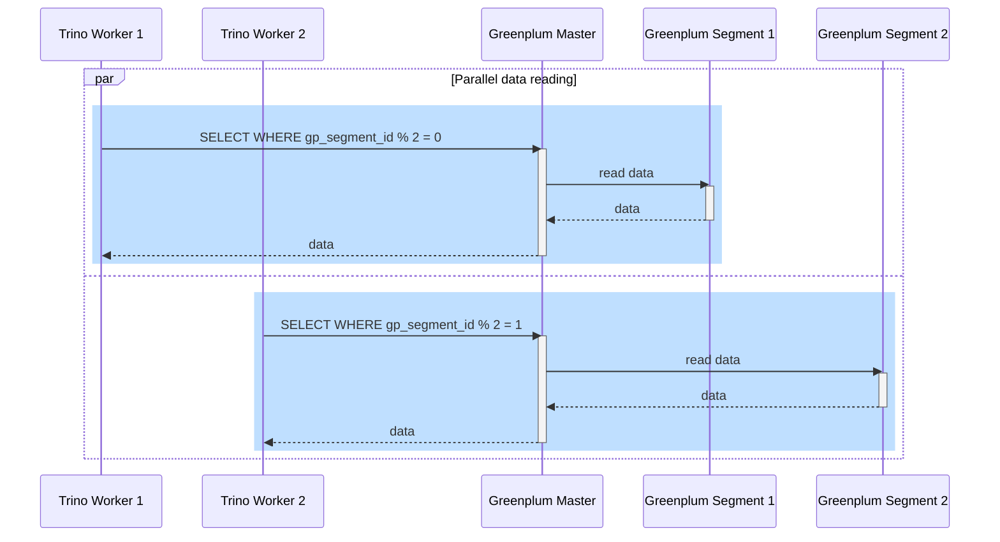
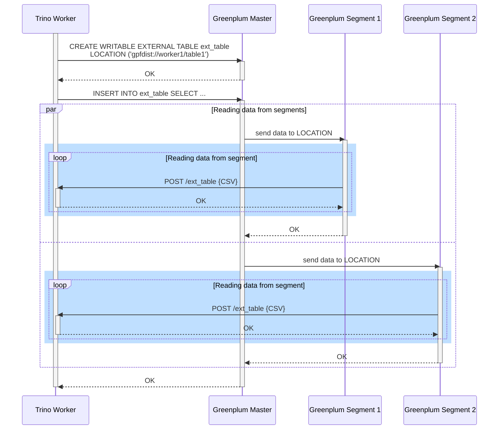

# Коннектор {{ GP }}/Cloudberry

[Коннектор](index.md#connector) {{ GP }}/Cloudberry, разработанный Яндексом на основе [коннектора {{ PG }}]({{ tr.docs }}/connector/postgresql.html), позволяет {{ mtr-name }} читать и записывать данные в кластер {{ GP }}/Cloudberry.

Коннектор поддерживает [параллельное чтение данных](#parallel-reading) сразу с нескольких сегментов {{ GP }} и [чтение данных напрямую с сегментов](#gpfdist-reading) по протоколу GPFDIST, что значительно увеличивает производительность запросов при чтении больших объемов данных. Оба способа чтения данных можно применять одновременно, чтобы наиболее эффективно использовать ресурсы кластера {{ TR }} и кластера {{ GP }}.

Коннектор {{ GP }}/Cloudberry доступен в {{ TR }} версии `476` и выше.

## Параллельное чтение данных {#parallel-reading}

При параллельном чтении из таблицы данные разделяются по значению метаколонки `gp_segment_id`.

Уровень параллелизма определяется количеством сегментов в кластере {{ GP }}. Максимальный уровень параллелизма ограничен [настройкой коннектора](#settings) `greenplum.max-read-parallelism` и соответствующим свойством сессии `max_read_parallelism`.

Схематично параллельное чтение представлено на диаграмме:



При использовании параллельного чтения коннектор выполняет только частичную фильтрацию строк при выталкивании оператора `LIMIT` ([limit pushdown]({{ tr.docs }}/optimizer/pushdown.html#limit-pushdown)). Это не влияет на корректность результатов запроса.

## Чтение данных по протоколу GPFDIST {#gpfdist-reading}

Коннектор позволяет читать данные напрямую с сегментов {{ GP }} через серверы [GPFDIST]({{ gp.docs.broadcom }}/7/greenplum-database/utility_guide-ref-gpfdist.html), созданные на воркерах {{ TR }}. Включение серверов GPFDIST контролируется [настройкой коннектора](#settings) `greenplum.gpfdist.server.enabled`.

В кластере {{ TR }} можно создать не больше восьми каталогов с включенными GPFDIST-серверами.

Чтение данных напрямую с сегментов {{ GP }} состоит из следующих этапов:

1. Коннектор создает внешнюю таблицу с указанием адреса воркера {{ TR }}, читающего данные:

    ```sql
    CREATE WRITABLE EXTERNAL TEMPORARY TABLE <имя_внешней_таблицы>
           ...
           LOCATION('gpfdist://<адрес_воркера_{{ TR }}>');
    ```

1. Коннектор выполняет запрос:

    ```sql
    INSERT INTO <имя_внешней_таблицы>
    SELECT ... FROM <имя_таблицы_в_{{ GP }}>;
    ```

1. Сегменты {{ GP }} отправляют данные воркеру {{ TR }} на указанный адрес.

Схематично чтение данных с сегментов представлено на диаграмме:



Использование протокола GPFDIST для чтения данных вносит следующие ограничения в работу коннектора:

* Не поддерживается чтение многомерных массивов.
* Не поддерживается чтение массивов строковых типов.
* Не поддерживается режим обработки массивов [AS_JSON]({{ tr.docs }}/connector/postgresql.html#array-type-handling).
* При одновременном выталкивании операторов `LIMIT` и `ORDER BY` ([Top-N pushdown]({{ tr.docs }}/optimizer/pushdown.html#top-n-pushdown)) коннектор выполняет только частичную сортировку данных. Это не влияет на корректность результатов запроса.

## Настройки коннектора {#settings}

Базовые настройки коннектора и соответствующие им свойства сессии совпадают с [коннектором {{ PG }}]({{ tr.docs }}/connector/postgresql.html) соответствующей версии. Кроме этого доступны следующие настройки:

| Настройка                                  | Описание                                                                                                                                                                                                                                                                                                                                                                                                            | Значение<br/>по умолчанию     |
|--------------------------------------------|---------------------------------------------------------------------------------------------------------------------------------------------------------------------------------------------------------------------------------------------------------------------------------------------------------------------------------------------------------------------------------------------------------------------|-------------------------------|
| `greenplum.gpfdist.server.enabled`         | Включает GPFDIST-серверы на воркерах {{ TR }}                                                                                                                                                                                                                                                                                                                                                                       | `false`                       |
| `greenplum.gpfdist.max-processing-threads` | Максимальный размер пула потоков, производящих асинхронную обработку GPFDIST-запросов                                                                                                                                                                                                                                                                                                                               | `32`                          |
| `greenplum.gpfdist.max-query-threads`      | Максимальный размер пула потоков, создающих внешние таблицы {{ GP }} и инициирующих запись данных во внешнюю таблицу                                                                                                                                                                                                                                                                                                | `32`                          |
| `greenplum.gpfdist.read.enabled`           | Включает чтение данных напрямую с сегментов {{ GP }} по протоколу GPFDIST                                                                                                                                                                                                                                                                                                                                           | `false`                       |
| `greenplum.gpfdist.read.buffer-size`       | <p>Размер буфера для чтения данных по протоколу GPFDIST в формате [data size]({{ tr.docs }}/admin/properties.html#data-size). В случае переполнения буфера коннектор приостанавливает прием данных от сегментов {{ GP }}.</p><p>Соответствует свойству сессии `gpfdist_read_buffer_size`</p>                                                                                                                        | `32MB`                        |
| `greenplum.gpfdist.retry-timeout`          | <p>Максимальное время, которое сегмент {{ GP }} будет ожидать ответа на GPFDIST-запрос, в формате [duration]({{ tr.docs }}/admin/properties.html#duration).</p><p>При значении, отличающемся от `null`, настройка переопределяет параметр {{ GP }} [gpfdist_retry_timeout]({{ gp.docs.broadcom }}/7/greenplum-database/ref_guide-config_params-guc-list.html#gpfdist_retry_timeout) (по умолчанию — 300 секунд)</p> | `null`                        |
| `greenplum.max-read-parallelism`           | <p>Максимальный уровень параллелизма при чтении данных из {{ GP }}.</p><p>Соответствует свойству сессии `max_read_parallelism`</p>                                                                                                                                                                                                                                                                                  | `1` (отсутствие параллелизма) |
| `greenplum.segment-fetch-required`         | <p>Определяет поведение коннектора в случае, если ему не удается получить информацию о количестве сегментов {{ GP }}:</p><p><ul><li>При значении `true` запрос к {{ TR }} завершится ошибкой.</li><li>При значении `false` уровень параллелизма будет равен значению свойства сессии `max_read_parallelism`.</li></ul></p><p>Соответствует свойству сессии `segment_fetch_required`</p>                             | `true`                        |

#### См. также {#see-also}

* [{#T}](../operations/catalog-create.md)