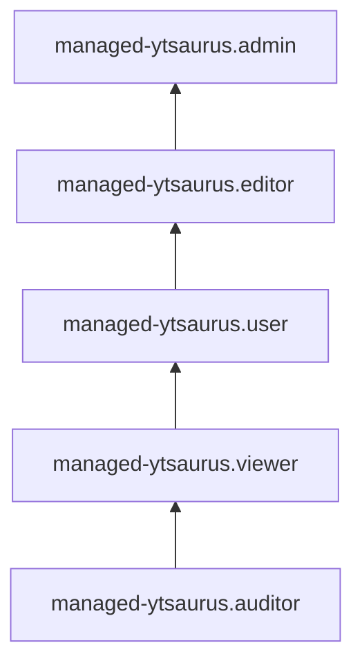

# Управление доступом в {{ myt-name }}

В этом разделе вы узнаете:

* [на какие ресурсы можно назначить роль](#resources);
* [какие роли действуют в сервисе](#roles-list);
* [какие роли необходимы](#required-roles) для того или иного действия.

Для использования сервиса необходимо аутентифицироваться в консоли управления с [аккаунтом на Яндексе](../../iam/concepts/users/accounts.md#passport), [федеративным](../../iam/concepts/users/accounts.md#saml-federation) или [локальным](../../iam/concepts/users/accounts.md#local) аккаунтом.

## Об управлении доступом {#about-access-control}

Все операции в {{ yandex-cloud }} проверяются в сервисе [{{ iam-full-name }}](../../iam/index.md). Если у субъекта нет необходимых разрешений, сервис вернет ошибку.

Чтобы выдать разрешения к ресурсу, [назначьте роли](../../iam/operations/roles/grant.md) на этот ресурс субъекту, который будет выполнять операции. Роли можно назначить [аккаунту на Яндексе](../../iam/concepts/users/accounts.md#passport), [сервисному аккаунту](../../iam/concepts/users/service-accounts.md), [локальному пользователю](../../iam/concepts/users/accounts.md#local), [федеративному пользователю](../../iam/concepts/federations.md), [группе пользователей](../../organization/operations/manage-groups.md), [системной группе](../../iam/concepts/access-control/system-group.md) или [публичной группе](../../iam/concepts/access-control/public-group.md). Подробнее читайте в разделе [{#T}](../../iam/concepts/access-control/index.md).

Назначать роли на ресурс могут пользователи, у которых на этот ресурс есть роль `managed-ytsaurus.admin` или одна из следующих ролей:

* `admin`;
* `resource-manager.admin`;
* `organization-manager.admin`;
* `resource-manager.clouds.owner`;
* `organization-manager.organizations.owner`.

## На какие ресурсы можно назначить роль {#resources}

Роль можно назначить на [организацию](../../organization/concepts/organization.md), [облако](../../resource-manager/concepts/resources-hierarchy.md#cloud) и [каталог](../../resource-manager/concepts/resources-hierarchy.md#folder). Роли, назначенные на организацию, облако или каталог, действуют и на вложенные ресурсы.

Чтобы разрешить доступ к ресурсам сервиса {{ myt-name }} (кластеры, учетные записи), назначьте пользователю нужные роли на каталог, облако или организацию, в которых содержатся эти ресурсы.

## Какие роли действуют в сервисе {#roles-list}

Ниже перечислены все роли, которые учитываются при проверке прав доступа в сервисе.

### Сервисные роли {#service-roles}

#### managed-ytsaurus.auditor {#managed-ytsaurus-auditor}

Роль `managed-ytsaurus.auditor` позволяет просматривать информацию о кластерах {{ ytsaurus-name }}, а также данные о [квотах](../concepts/limits.md#quotas) и операциях с ресурсами сервиса {{ myt-name }}.

#### managed-ytsaurus.viewer {#managed-ytsaurus-viewer}

Роль `managed-ytsaurus.viewer` позволяет просматривать информацию о кластерах {{ ytsaurus-name }}, [квотах](../concepts/limits.md#quotas) и операциях с ресурсами сервиса {{ myt-name }}.

Включает разрешения, предоставляемые ролью `managed-ytsaurus.auditor`.

#### managed-ytsaurus.user {#managed-ytsaurus-user}

Роль `managed-ytsaurus.user` позволяет выполнять базовые операции с кластерами {{ ytsaurus-name }}.

Пользователи с этой ролью могут:
* использовать веб-интерфейс {{ ytsaurus-name }};
* просматривать информацию о кластерах {{ ytsaurus-name }};
* просматривать информацию о [квотах](../concepts/limits.md#quotas) сервиса {{ myt-name }};
* просматривать информацию об операциях с ресурсами сервиса {{ myt-name }}.

Включает разрешения, предоставляемые ролью `managed-ytsaurus.viewer`.

#### managed-ytsaurus.editor {#managed-ytsaurus-editor}

Роль `managed-ytsaurus.editor` позволяет управлять кластерами {{ ytsaurus-name }}, а также получать информацию о квотах и операциях с ресурсами сервиса.

Пользователи с этой ролью могут:
* просматривать информацию о кластерах {{ ytsaurus-name }}, а также создавать, изменять, удалять, запускать и останавливать их;
* просматривать информацию о [квотах](../concepts/limits.md#quotas) сервиса {{ myt-name }};
* просматривать информацию об операциях с ресурсами сервиса {{ myt-name }};
* использовать веб-интерфейс {{ ytsaurus-name }}.

Включает разрешения, предоставляемые ролью `managed-ytsaurus.user`.

Для создания кластеров {{ ytsaurus-name }} дополнительно необходима роль `vpc.user`.

#### managed-ytsaurus.admin {#managed-ytsaurus-admin}

Роль `managed-ytsaurus.admin` позволяет управлять кластерами {{ ytsaurus-name }}, а также получать информацию о квотах и операциях с ресурсами сервиса {{ myt-name }}.

Пользователи с этой ролью могут:
* просматривать информацию о кластерах {{ ytsaurus-name }}, а также создавать, изменять, запускать, останавливать и удалять их;
* просматривать информацию о [квотах](../concepts/limits.md#quotas) сервиса {{ myt-name }};
* просматривать информацию об операциях с ресурсами сервиса {{ myt-name }};
* использовать веб-интерфейс {{ ytsaurus-name }}.

Включает разрешения, предоставляемые ролью `managed-ytsaurus.editor`.

Для создания кластеров {{ ytsaurus-name }} дополнительно необходима роль `vpc.user`.

### Примитивные роли {#primitive-roles}

Примитивные роли позволяют пользователям совершать действия во [всех сервисах](../../overview/concepts/services.md) {{ yandex-cloud }}.

#### {{ roles-auditor }} {#auditor}

Роль `auditor` предоставляет разрешения на чтение конфигурации и метаданных любых ресурсов Yandex Cloud без возможности доступа к данным.

Например, пользователи с этой ролью могут:
* просматривать информацию о [ресурсе]({{ link-docs }}/resource-manager/concepts/resources-hierarchy);
* просматривать метаданные ресурса;
* просматривать список операций с ресурсом.

Роль `auditor` — наиболее безопасная роль, исключающая доступ к данным [сервисов]({{ link-docs }}/overview/concepts/services). Роль подходит для пользователей, которым необходим минимальный уровень доступа к ресурсам Yandex Cloud.

#### {{ roles-viewer }} {#viewer}

Роль `viewer` предоставляет разрешения на чтение информации о любых [ресурсах]({{ link-docs }}/resource-manager/concepts/resources-hierarchy) Yandex Cloud.

Включает разрешения, предоставляемые ролью `auditor`.

В отличие от роли `auditor`, роль `viewer` предоставляет доступ к данным [сервисов]({{ link-docs }}/overview/concepts/services) в режиме чтения.

#### {{ roles-editor }} {#editor}

Роль `editor` предоставляет разрешения на управление любыми [ресурсами]({{ link-docs }}/resource-manager/concepts/resources-hierarchy) Yandex Cloud, кроме назначения ролей другим пользователям, передачи прав владения [организацией]({{ link-docs }}/organization/concepts/organization) и ее удаления, а также удаления [ключей шифрования]({{ link-docs }}/kms/concepts/) Key Management Service.

Например, пользователи с этой ролью могут создавать, изменять и удалять ресурсы.

Включает разрешения, предоставляемые ролью `viewer`.

#### {{ roles-admin }} {#admin}

Роль `admin` позволяет назначать любые роли, кроме `resource-manager.clouds.owner` и `organization-manager.organizations.owner`, а также предоставляет разрешения на управление любыми [ресурсами]({{ link-docs }}/resource-manager/concepts/resources-hierarchy) Yandex Cloud, кроме передачи прав владения [организацией]({{ link-docs }}/organization/concepts/organization) и ее удаления.

Прежде чем назначить роль `admin` на организацию, [облако]({{ link-docs }}/resource-manager/concepts/resources-hierarchy#cloud) или [платежный аккаунт]({{ link-docs }}/billing/concepts/billing-account), ознакомьтесь с информацией о защите [привилегированных аккаунтов]({{ link-docs }}/security/standard/all#privileged-users).

Включает разрешения, предоставляемые ролью `editor`.

Вместо примитивных ролей мы рекомендуем использовать роли сервисов. Такой подход позволит более гранулярно управлять доступом и обеспечить соблюдение [принципа минимальных привилегий](../../security/standard/all.md#min-privileges).

Подробнее о примитивных ролях см. в [справочнике ролей {{ yandex-cloud }}](../../iam/roles-reference.md#primitive-roles).

## Какие роли необходимы {#required-roles}

Чтобы пользоваться сервисом, необходима роль `managed-ytsaurus.editor` или выше на каталог, в котором создается кластер. Роль `managed-ytsaurus.viewer` позволит только просматривать список кластеров.

Чтобы создать кластер {{ myt-name }}, нужны роли [{{ roles-vpc-user }}](../../vpc/security/index.md#vpc-user) и [iam.serviceAccounts.user](../../iam/security/index.md#iam-serviceAccounts-user), а также роль `managed-ytsaurus.admin` или выше.

Вы всегда можете назначить роль, которая дает более широкие разрешения. Например, назначить `managed-ytsaurus.admin` вместо `managed-ytsaurus.editor`.

## Что дальше {#whats-next}

* [Как назначить роль](../../iam/operations/roles/grant.md).
* [Как отозвать роль](../../iam/operations/roles/revoke.md).
* [Подробнее об управлении доступом в {{ yandex-cloud }}](../../iam/concepts/access-control/index.md).
* [Подробнее о наследовании ролей](../../resource-manager/concepts/resources-hierarchy.md#access-rights-inheritance).