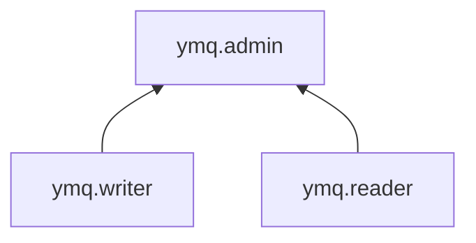

# Управление доступом в Message Queue

Пользователь Yandex Cloud может выполнять только те операции над ресурсами, которые разрешены назначенными ему [ролями](../../iam/concepts/access-control/roles.md). Пока у пользователя нет никаких ролей, почти все операции ему запрещены.

Чтобы разрешить доступ к ресурсам сервиса Yandex Message Queue, назначьте аккаунту на Яндексе, [сервисному аккаунту](../../iam/concepts/users/service-accounts.md), [федеративным](../../iam/concepts/users/accounts.md#saml-federation) или [локальным](../../iam/concepts/users/accounts.md#local) пользователям, [группе пользователей](../../organization/operations/manage-groups.md), [системной группе](../../iam/concepts/access-control/system-group.md) или [публичной группе](../../iam/concepts/access-control/public-group.md) нужные роли из приведенного ниже списка. На данный момент роль может быть назначена только на родительский ресурс (каталог или облако), роли которого наследуются вложенными ресурсами.

Подробнее о наследовании ролей читайте в разделе [Наследование прав доступа](../../resource-manager/concepts/resources-hierarchy.md#access-rights-inheritance) документации сервиса Resource Manager.

Назначать роли на ресурс могут пользователи, у которых на этот ресурс есть хотя бы одна из ролей:

* `admin`;
* `resource-manager.admin`;
* `organization-manager.admin`;
* `resource-manager.clouds.owner`;
* `organization-manager.organizations.owner`.

## Назначение ролей {#grant-roles}

Для управления очередями пользователь должен иметь соответствующие полномочия в облаке и каталогах, в которых будут выполняться операции.

Чтобы дать пользователю полномочия:

1. При необходимости [добавьте](../../organization/operations/add-account.md) нужного пользователя.
1. В [консоли управления](https://console.yandex.cloud) слева [выберите](../../resource-manager/operations/cloud/switch-cloud.md) облако.
1. Перейдите на вкладку **Права доступа**.
1. Нажмите кнопку **Настроить доступ**.
1. В открывшемся окне выберите раздел **Пользовательские аккаунты**.
1. Выберите пользователя из списка или воспользуйтесь поиском.
1. Нажмите кнопку  **Добавить роль** и выберите роль в облаке.
1. Нажмите кнопку **Сохранить**.

## Какие роли действуют в сервисе {#roles-list}

Ниже перечислены все роли, которые учитываются при проверке прав доступа в сервисе YMQ.

### Сервисные роли {#service-roles}

#### ymq.reader {#ymq-reader}

Роль `ymq.reader` дает право читать и удалять [сообщения](../concepts/message.md), устанавливать [таймауты видимости](../concepts/visibility-timeout.md) для сообщений, а также очищать [очередь](../concepts/queue.md) от сообщений. Позволяет получать список очередей и информацию о них.

#### ymq.writer {#ymq-writer}

Роль `ymq.writer` дает права на запись [сообщений](../concepts/message.md) в [очереди](../concepts/queue.md) и создание новых очередей. Позволяет получать список очередей и информацию о них.

#### ymq.admin {#ymq-admin}

Роль `ymq.admin` включает права ролей `ymq.reader` и `ymq.writer`, а также дает права изменять атрибуты [очередей](../concepts/queue.md) и удалять очереди. Позволяет получать список очередей и информацию о них.

### Примитивные роли {#primitive-roles}

Примитивные роли позволяют пользователям совершать действия во [всех сервисах](../../overview/concepts/services.md) Yandex Cloud.

#### auditor {#auditor}

Роль `auditor` предоставляет разрешения на чтение конфигурации и метаданных любых ресурсов Yandex Cloud без возможности доступа к данным.

Например, пользователи с этой ролью могут:
* просматривать информацию о [ресурсе](../../resource-manager/concepts/resources-hierarchy.md);
* просматривать метаданные ресурса;
* просматривать список операций с ресурсом.

Роль `auditor` — наиболее безопасная роль, исключающая доступ к данным [сервисов](../../overview/concepts/services.md). Роль подходит для пользователей, которым необходим минимальный уровень доступа к ресурсам Yandex Cloud.

#### viewer {#viewer}

Роль `viewer` предоставляет разрешения на чтение информации о любых [ресурсах](../../resource-manager/concepts/resources-hierarchy.md) Yandex Cloud.

Включает разрешения, предоставляемые ролью `auditor`.

В отличие от роли `auditor`, роль `viewer` предоставляет доступ к данным [сервисов](../../overview/concepts/services.md) в режиме чтения.

#### editor {#editor}

Роль `editor` предоставляет разрешения на управление любыми [ресурсами](../../resource-manager/concepts/resources-hierarchy.md) Yandex Cloud, кроме назначения ролей другим пользователям, передачи прав владения [организацией](../../organization/concepts/organization.md) и ее удаления, а также удаления [ключей шифрования](../../kms/concepts/index.md) Key Management Service.

Например, пользователи с этой ролью могут создавать, изменять и удалять ресурсы.

Включает разрешения, предоставляемые ролью `viewer`.

#### admin {#admin}

Роль `admin` позволяет назначать любые роли, кроме `resource-manager.clouds.owner` и `organization-manager.organizations.owner`, а также предоставляет разрешения на управление любыми [ресурсами](../../resource-manager/concepts/resources-hierarchy.md) Yandex Cloud, кроме передачи прав владения [организацией](../../organization/concepts/organization.md) и ее удаления.

Прежде чем назначить роль `admin` на организацию, [облако](../../resource-manager/concepts/resources-hierarchy.md#cloud) или [платежный аккаунт](../../billing/concepts/billing-account.md), ознакомьтесь с информацией о защите [привилегированных аккаунтов](../../security/standard/all.md#privileged-users).

Включает разрешения, предоставляемые ролью `editor`.

Вместо примитивных ролей мы рекомендуем использовать роли сервисов. Такой подход позволит более гранулярно управлять доступом и обеспечить соблюдение [принципа минимальных привилегий](../../security/standard/all.md#min-privileges).

Подробнее о примитивных ролях в [справочнике ролей Yandex Cloud](../../iam/roles-reference.md#primitive-roles).

## Полезные ссылки {#see-also}

[Структура ресурсов Yandex Cloud](../../resource-manager/concepts/resources-hierarchy.md)