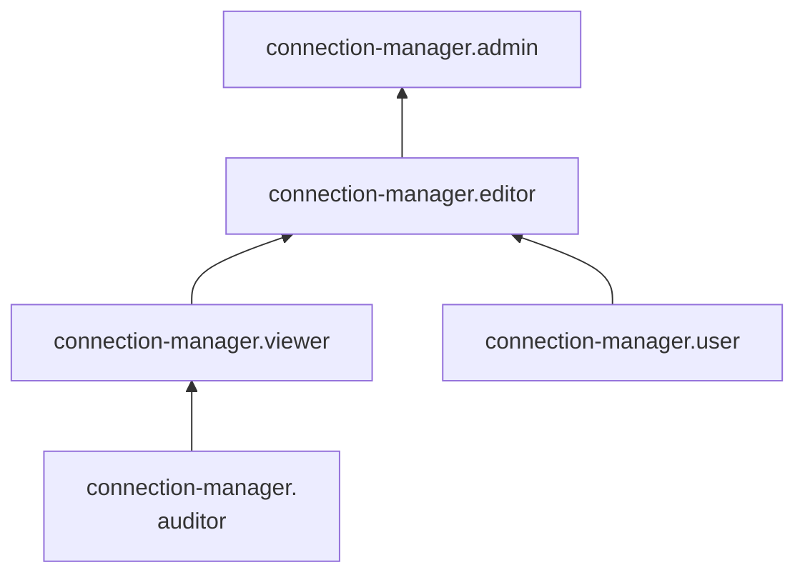

# Сервисные роли для управления подключениями с помощью Yandex Connection Manager

С помощью сервисных ролей Yandex Connection Manager вы сможете просматривать несекретные данные подключений и управлять подключениями. Просматривать секретные данные подключений, такие как пароли доступа к БД, можно в сервисе [Yandex Lockbox](../../lockbox/index.md). Для этого дополнительно необходима [роль](../../lockbox/security/index.md#lockbox-payloadViewer) `lockbox.payloadViewer`.

### connection-manager.auditor {#connection-manager-auditor}

Роль `connection-manager.auditor` позволяет просматривать несекретную информацию о [подключениях](../concepts/connection-manager.md) и назначенных [правах доступа](../../iam/concepts/access-control/index.md) к ним. Если роль выдана на облако, то она позволяет просматривать [квоты](../concepts/limits.md) сервиса Connection Manager.

### connection-manager.viewer {#connection-manager-viewer}

Роль `connection-manager.viewer` позволяет просматривать информацию о [подключениях](../concepts/connection-manager.md) и назначенных [правах доступа](../../iam/concepts/access-control/index.md) к ним, а также о [квотах](../concepts/limits.md) сервиса Connection Manager.

Включает разрешения, предоставляемые ролью `connection-manager.auditor`.

### connection-manager.editor {#connection-manager-editor}

Роль `connection-manager.editor` позволяет управлять подключениями, а также просматривать информацию о них.

Пользователи с этой ролью могут:
* создавать, использовать, изменять и удалять [подключения](../concepts/connection-manager.md);
* просматривать информацию о подключениях и назначенных [правах доступа](../../iam/concepts/access-control/index.md) к ним;
* просматривать информацию о [квотах](../concepts/limits.md) сервиса Connection Manager.

Включает разрешения, предоставляемые ролью `connection-manager.viewer`.

### connection-manager.admin {#connection-manager-admin}

Роль `connection-manager.admin` позволяет управлять подключениями и доступом к ним, а также просматривать информацию о подключениях.

Пользователи с этой ролью могут:
* создавать, использовать, изменять и удалять [подключения](../concepts/connection-manager.md), а также управлять доступом к ним;
* просматривать информацию о подключениях и назначенных [правах доступа](../../iam/concepts/access-control/index.md) к ним;
* просматривать информацию о [квотах](../concepts/limits.md) сервиса Connection Manager.

Включает разрешения, предоставляемые ролью `connection-manager.editor`.

### connection-manager.user {#connection-manager-user}

Роль `connection-manager.user` позволяет использовать [подключения](../concepts/connection-manager.md) в ресурсах других сервисов облака, интегрированных с Connection Manager, например: в Data Transfer, DataLens, WebSQL и др.

## Какие роли необходимы {#choosing-roles}

В таблице ниже перечислено, какие роли нужны для выполнения указанного действия. Вы всегда можете назначить роль, которая дает более широкие разрешения, нежели указанная. Например, назначить `editor` вместо `viewer`.

| Действие                                                      | Необходимые роли                     |
|---------------------------------------------------------------|--------------------------------------|
| Получить информацию о подключениях                            | `connection-manager.viewer`          |
| Получить список подключений                                   | `connection-manager.viewer`          | 
| Создать подключение                                           | `connection-manager.editor`          | 
| Изменить подключение                                          | `connection-manager.editor`          |
| Удалить подключение                                           | `connection-manager.editor`          |
| Установить права доступа к подключению                        | `connection-manager.admin`           |
| Изменить права доступа к подключению                          | `connection-manager.admin`           |