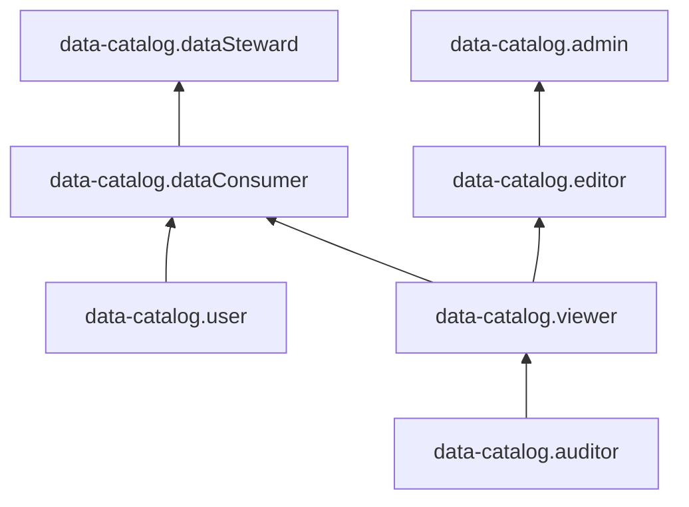

# Сервисные роли для работы с метаданными в {{ data-catalog-full-name }}



Эта функциональность находится на стадии [Preview](../../overview/concepts/launch-stages.md).



Вы можете просматривать информацию о каталогах метаданных и управлять их ресурсами с помощью сервисных ролей {{ data-catalog-full-name }} уровня:

* [сервиса](#service-level-roles)
* [каталогов](#catalogs-roles)
* [наборов метаданных](#assets-roles)
* [классификаций](#classifications-roles)
* [тегов классификаций](#tags-roles)
* [доменов](#domains-roles)
* [глоссариев](#glossaries-roles)
* [терминов глоссариев](#terms-roles)
* [загрузок](#ingestions-roles)
* [источников загрузок](#ingestions-roles)
* [связей метаданных](#lineages-roles)

## Сервисные роли верхнего уровня {#service-level-roles}

### {{ roles.data-catalog.auditor }} {#data-catalog-auditor}

Роль `data-catalog.auditor` позволяет просматривать информацию о ресурсах и квотах {{ data-catalog-name }}.

Пользователи с этой ролью могут:
* просматривать информацию о каталогах в {{ data-catalog-name }} и назначенных [правах доступа](../../iam/concepts/access-control/index.md) к ним;
* просматривать информацию о [доменах](../concepts/data-catalog.md#domains-and-subdomains) в {{ data-catalog-name }} и назначенных правах доступа к ним;
* просматривать информацию об [источниках и загрузках](../concepts/data-catalog.md#metadata-upload) в {{ data-catalog-name }};
* просматривать информацию о данных и связях данных в {{ data-catalog-name }};
* просматривать информацию о [глоссариях и терминах](../concepts/data-catalog.md#glossaries-and-terms) в {{ data-catalog-name }};
* просматривать информацию о [классификациях и тегах](../concepts/data-catalog.md#classifications-and-tags) в {{ data-catalog-name }};
* просматривать информацию о [квотах](../concepts/limits.md#data-catalog-quota) {{ data-catalog-name }}.

Включает разрешения, предоставляемые ролями `data-catalog.catalogs.auditor`, `data-catalog.domains.auditor`, `data-catalog.ingestionSources.auditor`, `data-catalog.ingestions.auditor`, `data-catalog.assets.auditor`, `data-catalog.lineages.auditor`, `data-catalog.glossaries.auditor`, `data-catalog.glossaryTerms.auditor`, `data-catalog.classifications.auditor` и `data-catalog.classificationTags.auditor`.

### {{ roles.data-catalog.viewer }} {#data-catalog-viewer}

Роль `data-catalog.viewer` позволяет просматривать информацию о ресурсах и квотах {{ data-catalog-name }}.

Пользователи с этой ролью могут:
* просматривать информацию о каталогах в {{ data-catalog-name }} и назначенных [правах доступа](../../iam/concepts/access-control/index.md) к ним;
* просматривать информацию о [доменах](../concepts/data-catalog.md#domains-and-subdomains) в {{ data-catalog-name }} и назначенных правах доступа к ним;
* просматривать информацию об [источниках и загрузках](../concepts/data-catalog.md#metadata-upload) в {{ data-catalog-name }};
* просматривать информацию о данных и связях данных в {{ data-catalog-name }};
* просматривать информацию о [глоссариях и терминах](../concepts/data-catalog.md#glossaries-and-terms) в {{ data-catalog-name }};
* просматривать информацию о [классификациях и тегах](../concepts/data-catalog.md#classifications-and-tags) в {{ data-catalog-name }};
* просматривать информацию о [квотах](../concepts/limits.md#data-catalog-quota) {{ data-catalog-name }}.

Включает разрешения, предоставляемые ролью `data-catalog.auditor`.

### {{ roles.data-catalog.editor }} {#data-catalog-editor}

Роль `data-catalog.editor` позволяет управлять ресурсами {{ data-catalog-name }}.

Пользователи с этой ролью могут:
* просматривать информацию о каталогах в {{ data-catalog-name }} и назначенных [правах доступа](../../iam/concepts/access-control/index.md) к ним, а также создавать, изменять и удалять такие каталоги;
* просматривать информацию о [доменах](../concepts/data-catalog.md#domains-and-subdomains) в {{ data-catalog-name }} и назначенных правах доступа к ним, а также создавать, использовать, изменять и удалять такие домены;
* просматривать информацию об [источниках](../concepts/data-catalog.md#metadata-upload) в {{ data-catalog-name }}, а также создавать, изменять и удалять их;
* просматривать информацию о [загрузках](../concepts/data-catalog.md#metadata-upload) в {{ data-catalog-name }}, а также создавать, изменять и удалять их;
* просматривать информацию о данных в {{ data-catalog-name }}, а также создавать, изменять и удалять такие данные;
* просматривать информацию о связях данных в {{ data-catalog-name }}, а также создавать, изменять и удалять такие связи;
* просматривать информацию о [глоссариях](../concepts/data-catalog.md#glossaries-and-terms) в {{ data-catalog-name }}, а также создавать, изменять и удалять их;
* просматривать информацию о [терминах](../concepts/data-catalog.md#glossaries-and-terms) в {{ data-catalog-name }}, а также создавать, использовать, изменять и удалять их;
* просматривать информацию о [классификациях](../concepts/data-catalog.md#classifications-and-tags) в {{ data-catalog-name }}, а также создавать, изменять и удалять их;
* просматривать информацию о [тегах](../concepts/data-catalog.md#classifications-and-tags) в {{ data-catalog-name }}, а также создавать, использовать, изменять и удалять их;
* просматривать информацию о [квотах](../concepts/limits.md#data-catalog-quota) {{ data-catalog-name }}.

Включает разрешения, предоставляемые ролями `data-catalog.catalogs.editor`, `data-catalog.domains.editor`, `data-catalog.ingestionSources.editor`, `data-catalog.ingestions.editor`, `data-catalog.assets.editor`, `data-catalog.lineages.editor`, `data-catalog.glossaries.editor`, `data-catalog.glossaryTerms.editor`, `data-catalog.classifications.editor` и `data-catalog.classificationTags.editor`.

### {{ roles.data-catalog.admin }} {#data-catalog-admin}

Роль `data-catalog.admin` позволяет управлять ресурсами {{ data-catalog-name }} и доступом к ним.

Пользователи с этой ролью могут:
* просматривать информацию о назначенных [правах доступа](../../iam/concepts/access-control/index.md) к каталогам в {{ data-catalog-name }} и изменять такие права доступа;
* просматривать информацию о каталогах в {{ data-catalog-name }}, а также создавать, изменять и удалять такие каталоги;
* просматривать информацию о назначенных правах доступа к доменам в {{ data-catalog-name }} и изменять такие права доступа;
* просматривать информацию о [доменах](../concepts/data-catalog.md#domains-and-subdomains) в {{ data-catalog-name }}, а также создавать, использовать, изменять и удалять такие домены;
* просматривать информацию об [источниках](../concepts/data-catalog.md#metadata-upload) в {{ data-catalog-name }}, а также создавать, изменять и удалять их;
* просматривать информацию о [загрузках](../concepts/data-catalog.md#metadata-upload) в {{ data-catalog-name }}, а также создавать, запускать, останавливать, изменять и удалять их;
* просматривать информацию о данных в {{ data-catalog-name }}, а также создавать, изменять и удалять такие данные;
* просматривать информацию о связях данных в {{ data-catalog-name }}, а также создавать, изменять и удалять такие связи;
* просматривать информацию о [глоссариях](../concepts/data-catalog.md#glossaries-and-terms) в {{ data-catalog-name }}, а также создавать, изменять и удалять их;
* просматривать информацию о [терминах](../concepts/data-catalog.md#glossaries-and-terms) в {{ data-catalog-name }}, а также создавать, использовать, изменять и удалять их;
* просматривать информацию о [классификациях](../concepts/data-catalog.md#classifications-and-tags) в {{ data-catalog-name }}, а также создавать, изменять и удалять их;
* просматривать информацию о [тегах](../concepts/data-catalog.md#classifications-and-tags) в {{ data-catalog-name }}, а также создавать, использовать, изменять и удалять их;
* просматривать информацию о [квотах](../concepts/limits.md#data-catalog-quota) {{ data-catalog-name }}.

Включает разрешения, предоставляемые ролями `data-catalog.catalogs.admin`, `data-catalog.domains.admin`, `data-catalog.ingestionSources.admin`, `data-catalog.ingestions.admin`, `data-catalog.assets.admin`, `data-catalog.lineages.admin`, `data-catalog.glossaries.admin`, `data-catalog.glossaryTerms.admin`, `data-catalog.classifications.admin` и `data-catalog.classificationTags.admin`.

### {{ roles.data-catalog.dataSteward }} {#data-catalog-dataSteward}

Роль `data-catalog.dataSteward` позволяет просматривать информацию о ресурсах {{ data-catalog-name }}, использовать и изменять такие ресурсы, а также управлять загрузками {{ data-catalog-name }}.

Пользователи с этой ролью могут:
* просматривать информацию о каталогах в {{ data-catalog-name }} и назначенных [правах доступа](../../iam/concepts/access-control/index.md) к ним;
* просматривать информацию о [доменах](../concepts/data-catalog.md#domains-and-subdomains) в {{ data-catalog-name }} и назначенных правах доступа к ним, а также использовать и изменять такие домены;
* просматривать информацию об [источниках](../concepts/data-catalog.md#metadata-upload) в {{ data-catalog-name }} и изменять их;
* просматривать информацию об [загрузках](../concepts/data-catalog.md#metadata-upload) в {{ data-catalog-name }}, а также запускать, останавливать и изменять их;
* просматривать информацию о данных и связях данных в {{ data-catalog-name }}, а также изменять такие данные и связи данных;
* просматривать информацию о [глоссариях](../concepts/data-catalog.md#glossaries-and-terms) в {{ data-catalog-name }} и изменять их;
* просматривать информацию о [терминах](../concepts/data-catalog.md#glossaries-and-terms) в {{ data-catalog-name }}, а также использовать и изменять их;
* просматривать информацию о [классификациях](../concepts/data-catalog.md#classifications-and-tags) в {{ data-catalog-name }} и изменять их;
* просматривать информацию о [тегах](../concepts/data-catalog.md#classifications-and-tags) в {{ data-catalog-name }}, а также использовать и изменять их;
* просматривать информацию о [квотах](../concepts/limits.md#data-catalog-quota) {{ data-catalog-name }}.

Включает разрешения, предоставляемые ролью `data-catalog.dataConsumer`.

### {{ roles.data-catalog.dataConsumer }} {#data-catalog-dataConsumer}

Роль `data-catalog.dataConsumer` позволяет просматривать информацию о ресурсах {{ data-catalog-name }}, а также использовать и изменять их.

Роль не позволяет изменять источники и управлять загрузками {{ data-catalog-name }}.

Пользователи с этой ролью могут:
* просматривать информацию о каталогах в {{ data-catalog-name }} и назначенных [правах доступа](../../iam/concepts/access-control/index.md) к ним;
* просматривать информацию о [доменах](../concepts/data-catalog.md#domains-and-subdomains) в {{ data-catalog-name }} и назначенных правах доступа к ним, а также использовать и изменять такие домены;
* просматривать информацию об [источниках и загрузках](../concepts/data-catalog.md#metadata-upload) в {{ data-catalog-name }};
* просматривать информацию о данных и связях данных в {{ data-catalog-name }}, а также изменять такие данные и связи данных;
* просматривать информацию о [глоссариях](../concepts/data-catalog.md#glossaries-and-terms) в {{ data-catalog-name }} и изменять их;
* просматривать информацию о [терминах](../concepts/data-catalog.md#glossaries-and-terms) в {{ data-catalog-name }}, а также использовать и изменять их;
* просматривать информацию о [классификациях](../concepts/data-catalog.md#classifications-and-tags) в {{ data-catalog-name }} и изменять их;
* просматривать информацию о [тегах](../concepts/data-catalog.md#classifications-and-tags) в {{ data-catalog-name }}, а также использовать и изменять их;
* просматривать информацию о [квотах](../concepts/limits.md#data-catalog-quota) {{ data-catalog-name }}.

Включает разрешения, предоставляемые ролями `data-catalog.viewer` и `data-catalog.user`.

### {{ roles.data-catalog.user }} {#data-catalog-user}

Роль `data-catalog.user` позволяет просматривать информацию о [доменах](../concepts/data-catalog.md#domains-and-subdomains), [тегах](../concepts/data-catalog.md#classifications-and-tags) и [терминах](../concepts/data-catalog.md#glossaries-and-terms) в {{ data-catalog-name }}, а также использовать такие домены, теги и термины.

Включает разрешения, предоставляемые ролями `data-catalog.domains.user`, `data-catalog.classificationTags.user` и `data-catalog.glossaryTerms.user`.

## Роли для управления доступом к каталогу {#catalogs-roles}

### {{ roles.data-catalog.catalogs.auditor }} {#data-catalog-catalogs-auditor}

Роль `data-catalog.catalogs.auditor` позволяет просматривать информацию о каталогах в {{ data-catalog-name }} и назначенных [правах доступа](../../iam/concepts/access-control/index.md) к ним, а также о [квотах](../concepts/limits.md#data-catalog-quota) {{ data-catalog-name }}.

### {{ roles.data-catalog.catalogs.viewer }} {#data-catalog-catalogs-viewer}

Роль `data-catalog.catalogs.viewer` позволяет просматривать информацию о каталогах в {{ data-catalog-name }} и назначенных [правах доступа](../../iam/concepts/access-control/index.md) к ним, а также о [квотах](../concepts/limits.md#data-catalog-quota) {{ data-catalog-name }}.

Включает разрешения, предоставляемые ролью `data-catalog.catalogs.auditor`.

### {{ roles.data-catalog.catalogs.editor }} {#data-catalog-catalogs-editor}

Роль `data-catalog.catalogs.editor` позволяет просматривать информацию о каталогах в {{ data-catalog-name }} и управлять ими.

Пользователи с этой ролью могут:
* просматривать информацию о каталогах в {{ data-catalog-name }}, а также создавать, изменять и удалять их;
* просматривать информацию о назначенных [правах доступа](../../iam/concepts/access-control/index.md) к каталогам в {{ data-catalog-name }};
* просматривать информацию о [квотах](../concepts/limits.md#data-catalog-quota) {{ data-catalog-name }}.

Включает разрешения, предоставляемые ролью `data-catalog.catalogs.viewer`.

### {{ roles.data-catalog.catalogs.admin }} {#data-catalog-catalogs-admin}

Роль `data-catalog.catalogs.admin` позволяет управлять каталогами в {{ data-catalog-name }} и доступом к ним.

Пользователи с этой ролью могут:
* просматривать информацию о назначенных [правах доступа](../../iam/concepts/access-control/index.md) к каталогам в {{ data-catalog-name }} и изменять такие права доступа;
* просматривать информацию о каталогах в {{ data-catalog-name }}, а также создавать, изменять и удалять такие каталоги;
* просматривать информацию о [квотах](../concepts/limits.md#data-catalog-quota) {{ data-catalog-name }}.

Включает разрешения, предоставляемые ролью `data-catalog.catalogs.editor`.

## Роли для управления доступом к наборам метаданных {#assets-roles}

### {{ roles.data-catalog.assets.auditor }} {#data-catalog-assets-auditor}

Роль `data-catalog.assets.auditor` позволяет просматривать информацию о данных в {{ data-catalog-name }}.

### {{ roles.data-catalog.assets.viewer }} {#data-catalog-assets-viewer}

Роль `data-catalog.catalogs.viewer` позволяет просматривать информацию о каталогах в {{ data-catalog-name }} и назначенных [правах доступа](../../iam/concepts/access-control/index.md) к ним, а также о [квотах](../concepts/limits.md#data-catalog-quota) {{ data-catalog-name }}.

Включает разрешения, предоставляемые ролью `data-catalog.catalogs.auditor`.

### {{ roles.data-catalog.assets.editor }} {#data-catalog-assets-editor}

Роль `data-catalog.assets.editor` позволяет просматривать информацию о данных в {{ data-catalog-name }}, а также создавать, изменять и удалять такие данные.

Включает разрешения, предоставляемые ролью `data-catalog.assets.viewer`.

### {{ roles.data-catalog.assets.admin }} {#data-catalog-assets-admin}

Роль `data-catalog.catalogs.admin` позволяет управлять каталогами в {{ data-catalog-name }} и доступом к ним.

Пользователи с этой ролью могут:
* просматривать информацию о назначенных [правах доступа](../../iam/concepts/access-control/index.md) к каталогам в {{ data-catalog-name }} и изменять такие права доступа;
* просматривать информацию о каталогах в {{ data-catalog-name }}, а также создавать, изменять и удалять такие каталоги;
* просматривать информацию о [квотах](../concepts/limits.md#data-catalog-quota) {{ data-catalog-name }}.

Включает разрешения, предоставляемые ролью `data-catalog.catalogs.editor`.

## Роли для управления доступом к классификациям {#classifications-roles}

### {{ roles.data-catalog.classifications.auditor }} {#data-catalog-classifications-auditor}

Роль `data-catalog.classifications.auditor` позволяет просматривать информацию о [классификациях](../concepts/data-catalog.md#classifications-and-tags) в {{ data-catalog-name }}.

### {{ roles.data-catalog.classifications.viewer }} {#data-catalog-classifications-viewer}

Роль `data-catalog.classifications.viewer` позволяет просматривать информацию о [классификациях](../concepts/data-catalog.md#classifications-and-tags) в {{ data-catalog-name }}.

Включает разрешения, предоставляемые ролью `data-catalog.classifications.auditor`.

### {{ roles.data-catalog.classifications.editor }} {#data-catalog-classifications-editor}

Роль `data-catalog.classifications.editor` позволяет просматривать информацию о [классификациях](../concepts/data-catalog.md#classifications-and-tags) в {{ data-catalog-name }}, а также создавать, изменять и удалять такие классификации.

Включает разрешения, предоставляемые ролью `data-catalog.classifications.viewer`.

### {{ roles.data-catalog.classifications.admin }} {#data-catalog-classifications-admin}

Роль `data-catalog.classifications.admin` позволяет просматривать информацию о [классификациях](../concepts/data-catalog.md#classifications-and-tags) в {{ data-catalog-name }}, а также создавать, изменять и удалять такие классификации.

Включает разрешения, предоставляемые ролью `data-catalog.classifications.editor`.

## Роли для управления доступом к тегам классификаций {#tags-roles}

### {{ roles.data-catalog.classificationTags.auditor }} {#data-catalog-classificationTags-auditor}

Роль `data-catalog.classificationTags.auditor` позволяет просматривать информацию о [тегах](../concepts/data-catalog.md#classifications-and-tags) в {{ data-catalog-name }}.

### {{ roles.data-catalog.classificationTags.viewer }} {#data-catalog-classificationTags-viewer}

Роль `data-catalog.classificationTags.viewer` позволяет просматривать информацию о [тегах](../concepts/data-catalog.md#classifications-and-tags) в {{ data-catalog-name }}.

Включает разрешения, предоставляемые ролью `data-catalog.classificationTags.auditor`.

### {{ roles.data-catalog.classificationTags.user }} {#data-catalog-classificationTags-user}

Роль `data-catalog.classificationTags.user` позволяет просматривать информацию о [тегах](../concepts/data-catalog.md#classifications-and-tags) в {{ data-catalog-name }} и использовать такие теги.

### {{ roles.data-catalog.classificationTags.editor }} {#data-catalog-classificationTags-editor}

Роль `data-catalog.classificationTags.editor` позволяет просматривать информацию о [тегах](../concepts/data-catalog.md#classifications-and-tags) в {{ data-catalog-name }}, а также создавать, использовать, изменять и удалять такие теги.

Включает разрешения, предоставляемые ролями `data-catalog.classificationTags.viewer` и `data-catalog.classificationTags.user`.

### {{ roles.data-catalog.classificationTags.admin }} {#data-catalog-classificationTags-admin}

Роль `data-catalog.classificationTags.admin` позволяет просматривать информацию о [тегах](../concepts/data-catalog.md#classifications-and-tags) в {{ data-catalog-name }}, а также создавать, использовать, изменять и удалять такие теги.

Включает разрешения, предоставляемые ролью `data-catalog.classificationTags.editor`.

## Роли для управления доступом к доменам {#domains-roles}

### {{ roles.data-catalog.domains.auditor }} {#data-catalog-domains-auditor}

Роль `data-catalog.domains.auditor` позволяет просматривать информацию о [доменах](../concepts/data-catalog.md#domains-and-subdomains) в {{ data-catalog-name }}, а также о назначенных [правах доступа](../../iam/concepts/access-control/index.md) к ним.

### {{ roles.data-catalog.domains.viewer }} {#data-catalog-domains-viewer}

Роль `data-catalog.domains.viewer` позволяет просматривать информацию о [доменах](../concepts/data-catalog.md#domains-and-subdomains) в {{ data-catalog-name }}, а также о назначенных [правах доступа](../../iam/concepts/access-control/index.md) к ним.

Включает разрешения, предоставляемые ролью `data-catalog.domains.auditor`.

### {{ roles.data-catalog.domains.user }} {#data-catalog-domains-user}

Роль `data-catalog.domains.user` позволяет просматривать информацию о [доменах](../concepts/data-catalog.md#domains-and-subdomains) в {{ data-catalog-name }} и использовать их.

### {{ roles.data-catalog.domains.editor }} {#data-catalog-domains-editor}

Роль `data-catalog.domains.editor` позволяет просматривать информацию о доменах в {{ data-catalog-name }} и управлять ими.

Пользователи с этой ролью могут:
* просматривать информацию о [доменах](../concepts/data-catalog.md#domains-and-subdomains) в {{ data-catalog-name }}, а также создавать, использовать, изменять и удалять такие домены;
* просматривать информацию о назначенных [правах доступа](../../iam/concepts/access-control/index.md) к доменам в {{ data-catalog-name }}.

Включает разрешения, предоставляемые ролями `data-catalog.domains.viewer` и `data-catalog.domains.user`.

### {{ roles.data-catalog.domains.admin }} {#data-catalog-domains-admin}

Роль `data-catalog.domains.admin` позволяет управлять доменами в {{ data-catalog-name }} и доступом к ним.

Пользователи с этой ролью могут:
* просматривать информацию о назначенных [правах доступа](../../iam/concepts/access-control/index.md) к доменам в {{ data-catalog-name }} и изменять такие права доступа;
* просматривать информацию о [доменах](../concepts/data-catalog.md#domains-and-subdomains) в {{ data-catalog-name }}, а также создавать, использовать, изменять и удалять такие домены.

Включает разрешения, предоставляемые ролью `data-catalog.domains.editor`.

## Роли для управления доступом к словарям {#glossaries-roles}

### {{ roles.data-catalog.glossaries.auditor }} {#data-catalog-glossaries-auditor}

Роль `data-catalog.glossaries.auditor` позволяет просматривать информацию о [глоссариях](../concepts/data-catalog.md#glossaries-and-terms) в {{ data-catalog-name }}.

### {{ roles.data-catalog.glossaries.viewer }} {#data-catalog-glossaries-viewer}

Роль `data-catalog.glossaries.viewer` позволяет просматривать информацию о [глоссариях](../concepts/data-catalog.md#glossaries-and-terms) в {{ data-catalog-name }}.

Включает разрешения, предоставляемые ролью `data-catalog.glossaries.auditor`.

### {{ roles.data-catalog.glossaries.editor }} {#data-catalog-glossaries-editor}

Роль `data-catalog.glossaries.editor` позволяет просматривать информацию о [глоссариях](../concepts/data-catalog.md#glossaries-and-terms) в {{ data-catalog-name }}, а также создавать, изменять и удалять их.

Включает разрешения, предоставляемые ролью `data-catalog.glossaries.viewer`.

### {{ roles.data-catalog.glossaries.admin }} {#data-catalog-glossaries-admin}

Роль `data-catalog.glossaries.admin` позволяет просматривать информацию о [глоссариях](../concepts/data-catalog.md#glossaries-and-terms) в {{ data-catalog-name }}, а также создавать, изменять и удалять их.

Включает разрешения, предоставляемые ролью `data-catalog.glossaries.editor`.

## Роли для управления доступом к терминам глоссариев {#terms-roles}

### {{ roles.data-catalog.glossaryTerms.auditor }} {#data-catalog-glossaryTerms-auditor}

Роль `data-catalog.glossaryTerms.auditor` позволяет просматривать информацию о [терминах](../concepts/data-catalog.md#glossaries-and-terms) в {{ data-catalog-name }}.

### {{ roles.data-catalog.glossaryTerms.viewer }} {#data-catalog-glossaryTerms-viewer}

Роль `data-catalog.glossaryTerms.viewer` позволяет просматривать информацию о [терминах](../concepts/data-catalog.md#glossaries-and-terms) в {{ data-catalog-name }}.

Включает разрешения, предоставляемые ролью `data-catalog.glossaryTerms.auditor`.

### {{ roles.data-catalog.glossaryTerms.user }} {#data-catalog-glossaryTerms-user}

Роль `data-catalog.glossaryTerms.user` позволяет просматривать информацию о [терминах](../concepts/data-catalog.md#glossaries-and-terms) в {{ data-catalog-name }} и использовать их.

### {{ roles.data-catalog.glossaryTerms.editor }} {#data-catalog-glossaryTerms-editor}

Роль `data-catalog.glossaryTerms.editor` позволяет просматривать информацию о [терминах](../concepts/data-catalog.md#glossaries-and-terms) в {{ data-catalog-name }}, а также создавать, использовать, изменять и удалять их.

Включает разрешения, предоставляемые ролями `data-catalog.glossaryTerms.viewer` и `data-catalog.glossaryTerms.user`.

### {{ roles.data-catalog.glossaryTerms.admin }} {#data-catalog-glossaryTerms-admin}

Роль `data-catalog.glossaryTerms.admin` позволяет просматривать информацию о [терминах](../concepts/data-catalog.md#glossaries-and-terms) в {{ data-catalog-name }}, а также создавать, использовать, изменять и удалять их.

Включает разрешения, предоставляемые ролью `data-catalog.glossaryTerms.editor`.

## Роли для управления доступом к загрузкам {#ingestions-roles}

### {{ roles.data-catalog.ingestions.auditor }} {#data-catalog-ingestions-auditor}

Роль `data-catalog.ingestions.auditor` позволяет просматривать информацию о [загрузках](../concepts/data-catalog.md#metadata-upload) в {{ data-catalog-name }}.

### {{ roles.data-catalog.ingestions.viewer }} {#data-catalog-ingestions-viewer}

Роль `data-catalog.ingestions.viewer` позволяет просматривать информацию о [загрузках](../concepts/data-catalog.md#metadata-upload) в {{ data-catalog-name }}.

Включает разрешения, предоставляемые ролью `data-catalog.ingestions.auditor`.

### {{ roles.data-catalog.ingestions.editor }} {#data-catalog-ingestions-editor}

Роль `data-catalog.ingestions.editor` позволяет просматривать информацию о [загрузках](../concepts/data-catalog.md#metadata-upload) в {{ data-catalog-name }}, а также создавать, изменять и удалять их.

Включает разрешения, предоставляемые ролью `data-catalog.ingestions.viewer`.

### {{ roles.data-catalog.ingestions.admin }} {#data-catalog-ingestions-admin}

Роль `data-catalog.ingestions.admin` позволяет просматривать информацию о [загрузках](../concepts/data-catalog.md#metadata-upload) в {{ data-catalog-name }}, а также создавать, запускать, останавливать, изменять и удалять их.

Включает разрешения, предоставляемые ролью `data-catalog.ingestions.editor`.

## Роли для управления доступом к источникам загрузок {#ingestion-sources-roles}

### {{ roles.data-catalog.ingestionSources.auditor }} {#data-catalog-ingestionSources-auditor}

Роль `data-catalog.ingestionSources.auditor` позволяет просматривать информацию об [источниках](../concepts/data-catalog.md#metadata-upload) в {{ data-catalog-name }}.

### {{ roles.data-catalog.ingestionSources.viewer }} {#data-catalog-ingestionSources-viewer}

Роль `data-catalog.ingestionSources.viewer` позволяет просматривать информацию об [источниках](../concepts/data-catalog.md#metadata-upload) в {{ data-catalog-name }}.

Включает разрешения, предоставляемые ролью `data-catalog.ingestionSources.auditor`.

### {{ roles.data-catalog.ingestionSources.editor }} {#data-catalog-ingestionSources-editor}

Роль `data-catalog.ingestionSources.editor` позволяет просматривать информацию об [источниках](../concepts/data-catalog.md#metadata-upload) в {{ data-catalog-name }}, а также создавать, изменять и удалять их.

Включает разрешения, предоставляемые ролью `data-catalog.ingestionSources.viewer`.

### {{ roles.data-catalog.ingestionSources.admin }} {#data-catalog-ingestionSources-admin}

Роль `data-catalog.ingestionSources.admin` позволяет просматривать информацию об [источниках](../concepts/data-catalog.md#metadata-upload) в {{ data-catalog-name }}, а также создавать, изменять и удалять их.

Включает разрешения, предоставляемые ролью `data-catalog.ingestionSources.editor`.

## Роли для управления доступом к связям метаданных {#lineages-roles}

### {{ roles.data-catalog.lineages.auditor }} {#data-catalog-lineages-auditor}

Роль `data-catalog.lineages.auditor` позволяет просматривать информацию о связях данных в {{ data-catalog-name }}.

### {{ roles.data-catalog.lineages.viewer }} {#data-catalog-lineages-viewer}

Роль `data-catalog.lineages.viewer` позволяет просматривать информацию о связях данных в {{ data-catalog-name }}.

Включает разрешения, предоставляемые ролью `data-catalog.lineages.auditor`.

### {{ roles.data-catalog.lineages.editor }} {#data-catalog-lineages-editor}

Роль `data-catalog.lineages.editor` позволяет просматривать информацию о связях данных в {{ data-catalog-name }}, а также создавать, изменять и удалять такие связи.

Включает разрешения, предоставляемые ролью `data-catalog.lineages.viewer`.

### {{ roles.data-catalog.lineages.admin }} {#data-catalog-lineages-admin}

Роль `data-catalog.lineages.admin` позволяет просматривать информацию о связях данных в {{ data-catalog-name }}, а также создавать, изменять и удалять такие связи.

Включает разрешения, предоставляемые ролью `data-catalog.lineages.editor`.

## Какие роли мне необходимы {#choosing-roles}

В таблице ниже перечислено, какие роли нужны для выполнения указанного действия. Вы всегда можете назначить роль, которая дает более широкие разрешения, нежели указанная. Например, назначить `editor` вместо `viewer`.

| Действие                                                       | Необходимые роли                                      |
|----------------------------------------------------------------|-------------------------------------------------------|
| Просматривать метаданные каталогов                             | `{{ roles.data-catalog.auditor }}`                    |
| Просматривать информацию о правах доступа к каталогам и квотах | `{{ roles.data-catalog.viewer }}`                     |
| Создавать каталоги                                             | `{{ roles.data-catalog.editor }}`                     |
| Редактировать каталоги                                         | `{{ roles.data-catalog.editor }}`                     |
| Удалять каталоги                                               | `{{ roles.data-catalog.editor }}`                     |
| Изменять права доступа к каталогам                             | `{{ roles.data-catalog.admin }}`                      |
| Просматривать и изменять домены, теги и термины                | `{{ roles.data-catalog.user }}`                       |
| Просматривать информацию о наборах данных                      | `{{ roles.data-catalog.assets.auditor }}`             |
| Работать с наборами данных: изменять, удалять, редактировать | `{{ roles.data-catalog.assets.editor }}` |
| Просматривать информацию о классификации                       | `{{ roles.data-catalog.classifications.auditor }}`    |
| Редактировать классификации                                    | `{{ roles.data-catalog.classifications.editor }}`     |
| Просматривать информацию о тегах                               | `{{ roles.data-catalog.classificationTags.auditor }}` |
| Редактировать теги                                             | `{{ roles.data-catalog.classificationTags.editor }}`  |
| Просматривать информацию о глоссариях                          | `{{ roles.data-catalog.glossaries.auditor }}`         |
| Редактировать глоссарии                                        | `{{ roles.data-catalog.glossaries.editor }}`          |
| Просматривать информацию о терминах                            | `{{ roles.data-catalog.glossaryTerms.auditor }}`      |
| Редактировать термины                                          | `{{ roles.data-catalog.glossaryTerms.editor }}`       |
| Просматривать настройки загрузок                               | `{{ roles.data-catalog.ingestions.auditor }}`         |
| Редактировать настройки загрузок                               | `{{ roles.data-catalog.ingestions.editor }}`          |
| Просматривать настройки источников загрузок                     | `{{ roles.data-catalog.ingestionSources.auditor }}`   |
| Редактировать настройки источников загрузок                     | `{{ roles.data-catalog.ingestionSources.editor }}`    |
| Просматривать информацию о связях данных                       | `{{ roles.data-catalog.lineages.auditor }}`           |
| Создавать, изменять и удалять связи между данными              | `{{ roles.data-catalog.lineages.editor }}`            |