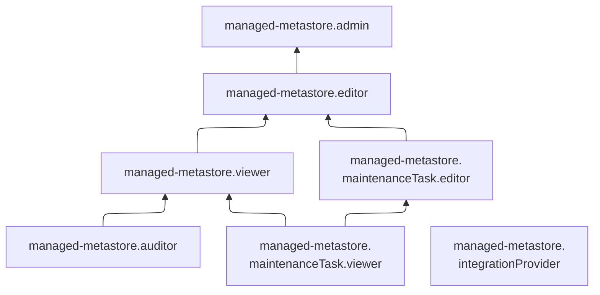

# Сервисные роли для работы с метаданными в кластере Apache Hive™ Metastore

С помощью сервисных ролей Apache Hive™ Metastore вы можете просматривать информацию о кластерах Apache Hive™ Metastore и управлять ими.

## managed-metastore.maintenanceTask.viewer {#managed-metastore-maintenanceTask-viewer}

Роль `managed-metastore.maintenanceTask.viewer` позволяет просматривать информацию о [кластерах Apache Hive™ Metastore](../concepts/metastore.md) и назначенных [правах доступа](../../iam/concepts/access-control/index.md) к ним, о заданиях на техническое обслуживание таких кластеров, а также о квотах сервисов управляемых баз данных Yandex Cloud.

## managed-metastore.maintenanceTask.editor {#managed-metastore-maintenanceTask-editor}

Роль `managed-metastore.maintenanceTask.editor` позволяет просматривать информацию о заданиях на техническое обслуживание [кластеров Apache Hive™ Metastore](../concepts/metastore.md) и изменять такие задания, просматривать информацию о кластерах Apache Hive™ Metastore и назначенных [правах доступа](../../iam/concepts/access-control/index.md) к ним, а также о квотах сервисов управляемых баз данных Yandex Cloud.

Включает разрешения, предоставляемые ролью `managed-metastore.maintenanceTask.viewer`.

## managed-metastore.auditor {#managed-metastore-auditor}

Роль `managed-metastore.auditor` позволяет просматривать информацию о [кластерах](../concepts/metastore.md) Apache Hive™ Metastore и квотах сервисов управляемых баз данных Yandex Cloud.

## managed-metastore.viewer {#managed-metastore-viewer}

Роль `managed-metastore.viewer` позволяет просматривать информацию о кластерах Apache Hive™ Metastore и логи их работы, а также информацию о квотах сервисов управляемых баз данных Yandex Cloud.

Пользователи с этой ролью могут:
* просматривать информацию о [кластерах](../concepts/metastore.md) Apache Hive™ Metastore;
* просматривать информацию о назначенных [правах доступа](../../iam/concepts/access-control/index.md) к кластерам Apache Hive™ Metastore;
* просматривать информацию о заданиях на техническое обслуживание кластеров Apache Hive™ Metastore;
* просматривать логи кластеров Apache Hive™ Metastore;
* просматривать информацию о квотах сервисов управляемых баз данных Yandex Cloud;
* просматривать информацию об [облаке](../../resource-manager/concepts/resources-hierarchy.md#cloud) и [каталоге](../../resource-manager/concepts/resources-hierarchy.md#folder).

Включает разрешения, предоставляемые ролями `managed-metastore.auditor` и `managed-metastore.maintenanceTask.viewer`.

## managed-metastore.editor {#managed-metastore-editor}

Роль `managed-metastore.editor` позволяет управлять кластерами Apache Hive™ Metastore, а также просматривать логи их работы и информацию о квотах сервисов управляемых баз данных Yandex Cloud.

Пользователи с этой ролью могут:
* просматривать информацию о [кластерах](../concepts/metastore.md) Apache Hive™ Metastore, а также создавать, изменять, запускать, останавливать и удалять такие кластеры;
* [экспортировать и импортировать](../operations/metastore/export-and-import.md) кластеры Apache Hive™ Metastore;
* просматривать логи кластеров Apache Hive™ Metastore;
* просматривать информацию о назначенных [правах доступа](../../iam/concepts/access-control/index.md) к кластерам Apache Hive™ Metastore;
* просматривать информацию о заданиях на техническое обслуживание кластеров Apache Hive™ Metastore и изменять такие задания;
* просматривать информацию о квотах сервисов управляемых баз данных Yandex Cloud;
* просматривать информацию об [облаке](../../resource-manager/concepts/resources-hierarchy.md#cloud) и [каталоге](../../resource-manager/concepts/resources-hierarchy.md#folder).

Включает разрешения, предоставляемые ролями `managed-metastore.viewer` и `managed-metastore.maintenanceTask.editor`.

Для создания кластеров дополнительно необходима [роль](../../vpc/security/index.md#vpc-user) `vpc.user`.

## managed-metastore.admin {#managed-metastore-admin}

Роль `managed-metastore.admin` позволяет управлять кластерами Apache Hive™ Metastore, а также просматривать логи их работы и информацию о квотах сервисов управляемых баз данных Yandex Cloud.

Пользователи с этой ролью могут:
* просматривать информацию о [кластерах](../concepts/metastore.md) Apache Hive™ Metastore, а также создавать, изменять, запускать, останавливать и удалять такие кластеры;
* [экспортировать и импортировать](../operations/metastore/export-and-import.md) кластеры Apache Hive™ Metastore;
* просматривать логи кластеров Apache Hive™ Metastore;
* просматривать информацию о квотах сервисов управляемых баз данных Yandex Cloud;
* просматривать информацию об [облаке](../../resource-manager/concepts/resources-hierarchy.md#cloud) и [каталоге](../../resource-manager/concepts/resources-hierarchy.md#folder).

Включает разрешения, предоставляемые ролью `managed-metastore.editor`.

Для создания кластеров дополнительно необходима [роль](../../vpc/security/index.md#vpc-user) `vpc.user`.

## managed-metastore.integrationProvider {#managed-metastore-integrationProvider}

Роль `managed-metastore.integrationProvider` позволяет кластеру Apache Hive™ Metastore взаимодействовать от имени сервисного аккаунта с пользовательскими ресурсами, необходимыми для работы кластера. Роль назначается сервисному аккаунту, привязанному к кластеру Apache Hive™ Metastore.

Пользователи с этой ролью могут:
* добавлять записи в [лог-группы](../../logging/concepts/log-group.md);
* просматривать информацию о лог-группах;
* просматривать информацию о приемниках логов;
* просматривать информацию о назначенных [правах доступа](../../iam/concepts/access-control/index.md) к ресурсам сервиса Cloud Logging;
* просматривать информацию о выгрузках логов;
* просматривать информацию о [метриках](../../monitoring/concepts/data-model.md#metric) Monitoring и их [метках](../../monitoring/concepts/data-model.md#label), а также загружать и выгружать метрики;
* просматривать список [дашбордов](../../monitoring/concepts/visualization/dashboard.md) и [виджетов](../../monitoring/concepts/visualization/widget.md) Monitoring и информацию о них, а также создавать, изменять и удалять дашборды и виджеты;
* просматривать историю [уведомлений](../../monitoring/concepts/alerting/notification-channel.md) Monitoring;
* просматривать информацию о [квотах](../../monitoring/concepts/limits.md#monitoring-quotas) сервиса Monitoring;
* просматривать информацию об [облаке](../../resource-manager/concepts/resources-hierarchy.md#cloud) и [каталоге](../../resource-manager/concepts/resources-hierarchy.md#folder).

Включает разрешения, предоставляемые ролями `logging.writer` и `monitoring.editor`.

_Apache® и [Apache Hive™](https://hive.apache.org/) являются зарегистрированными товарными знаками или товарными знаками Apache Software Foundation в США и/или других странах._