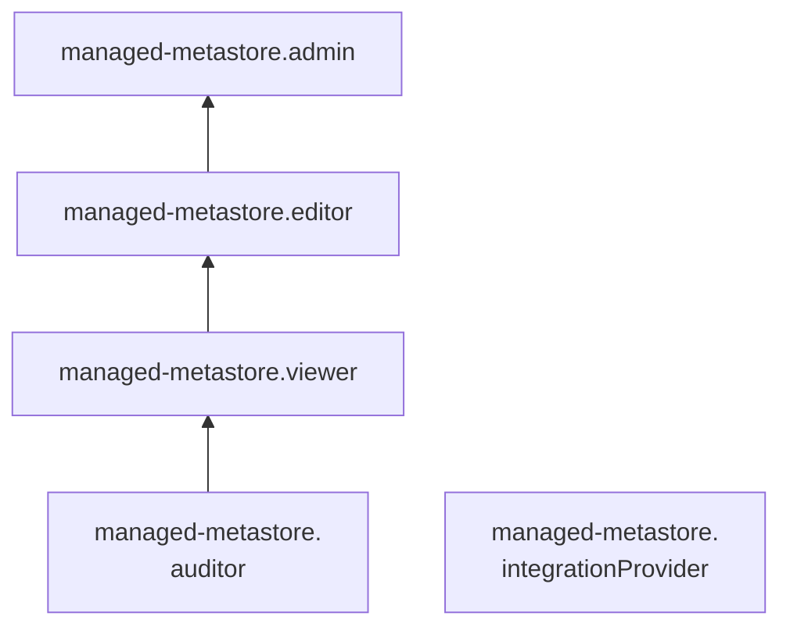

# Сервисные роли для работы с метаданными в кластере {{ metastore-full-name }}

С помощью сервисных ролей {{ metastore-name }} вы можете просматривать информацию о кластерах {{ metastore-name }} и управлять ими.

## {{ roles.metastore.auditor }} {#managed-metastore-auditor}

Роль `managed-metastore.auditor` позволяет просматривать информацию о [кластерах](../concepts/metastore.md) {{ metastore-name }} и квотах сервисов управляемых баз данных {{ yandex-cloud }}.

## {{ roles.metastore.viewer }} {#managed-metastore-viewer}

Роль `managed-metastore.viewer` позволяет просматривать информацию о кластерах {{ metastore-name }} и логи их работы, а также информацию о квотах сервисов управляемых баз данных {{ yandex-cloud }}.

Пользователи с этой ролью могут:
* просматривать информацию о [кластерах](../concepts/metastore.md) {{ metastore-name }};
* просматривать логи кластеров {{ metastore-name }};
* просматривать информацию о квотах сервисов управляемых баз данных {{ yandex-cloud }};
* просматривать информацию об [облаке](../../resource-manager/concepts/resources-hierarchy.md#cloud) и [каталоге](../../resource-manager/concepts/resources-hierarchy.md#folder).

Включает разрешения, предоставляемые ролью `managed-metastore.auditor`.

## {{ roles.metastore.editor }} {#managed-metastore-editor}

Роль `managed-metastore.editor` позволяет управлять кластерами {{ metastore-name }}, а также просматривать логи их работы и информацию о квотах сервисов управляемых баз данных {{ yandex-cloud }}.

Пользователи с этой ролью могут:
* просматривать информацию о [кластерах](../concepts/metastore.md) {{ metastore-name }}, а также создавать, изменять, запускать, останавливать и удалять такие кластеры;
* [экспортировать и импортировать](../operations/metastore/export-and-import.md) кластеры {{ metastore-name }};
* просматривать логи кластеров {{ metastore-name }};
* просматривать информацию о квотах сервисов управляемых баз данных {{ yandex-cloud }};
* просматривать информацию об [облаке](../../resource-manager/concepts/resources-hierarchy.md#cloud) и [каталоге](../../resource-manager/concepts/resources-hierarchy.md#folder).

Включает разрешения, предоставляемые ролью `managed-metastore.viewer`.

Для создания кластеров дополнительно необходима [роль](../../vpc/security/index.md#vpc-user) `vpc.user`.

## {{ roles.metastore.admin }} {#managed-metastore-admin}

Роль `managed-metastore.admin` позволяет управлять кластерами {{ metastore-name }}, а также просматривать логи их работы и информацию о квотах сервисов управляемых баз данных {{ yandex-cloud }}.

Пользователи с этой ролью могут:
* просматривать информацию о [кластерах](../concepts/metastore.md) {{ metastore-name }}, а также создавать, изменять, запускать, останавливать и удалять такие кластеры;
* [экспортировать и импортировать](../operations/metastore/export-and-import.md) кластеры {{ metastore-name }};
* просматривать логи кластеров {{ metastore-name }};
* просматривать информацию о квотах сервисов управляемых баз данных {{ yandex-cloud }};
* просматривать информацию об [облаке](../../resource-manager/concepts/resources-hierarchy.md#cloud) и [каталоге](../../resource-manager/concepts/resources-hierarchy.md#folder).

Включает разрешения, предоставляемые ролью `managed-metastore.editor`.

Для создания кластеров дополнительно необходима [роль](../../vpc/security/index.md#vpc-user) `vpc.user`.

## {{ roles.metastore.integrationProvider }} {#managed-metastore-integrationProvider}

Роль `managed-metastore.integrationProvider` позволяет кластеру {{ metastore-name }} взаимодействовать от имени сервисного аккаунта с пользовательскими ресурсами, необходимыми для работы кластера. Роль назначается сервисному аккаунту, привязанному к кластеру {{ metastore-name }}.

Пользователи с этой ролью могут:
* добавлять записи в [лог-группы](../../logging/concepts/log-group.md);
* просматривать информацию о лог-группах;
* просматривать информацию о приемниках логов;
* просматривать информацию о назначенных [правах доступа](../../iam/concepts/access-control/index.md) к ресурсам сервиса {{ cloud-logging-name }};
* просматривать информацию о выгрузках логов;
* просматривать информацию о [метриках](../../monitoring/concepts/data-model.md#metric) {{ monitoring-name }} и их [метках](../../monitoring/concepts/data-model.md#label), а также загружать и выгружать метрики;
* просматривать список [дашбордов](../../monitoring/concepts/visualization/dashboard.md) и [виджетов](../../monitoring/concepts/visualization/widget.md) {{ monitoring-name }} и информацию о них, а также создавать, изменять и удалять дашборды и виджеты;
* просматривать историю [уведомлений](../../monitoring/concepts/alerting/notification-channel.md) {{ monitoring-name }};
* просматривать информацию о [квотах](../../monitoring/concepts/limits.md#monitoring-quotas) сервиса {{ monitoring-name }};
* просматривать информацию об [облаке](../../resource-manager/concepts/resources-hierarchy.md#cloud) и [каталоге](../../resource-manager/concepts/resources-hierarchy.md#folder).

Включает разрешения, предоставляемые ролями `logging.writer` и `monitoring.editor`.

_Apache® и [Apache Hive™](https://hive.apache.org/) являются зарегистрированными товарными знаками или товарными знаками Apache Software Foundation в США и/или других странах._