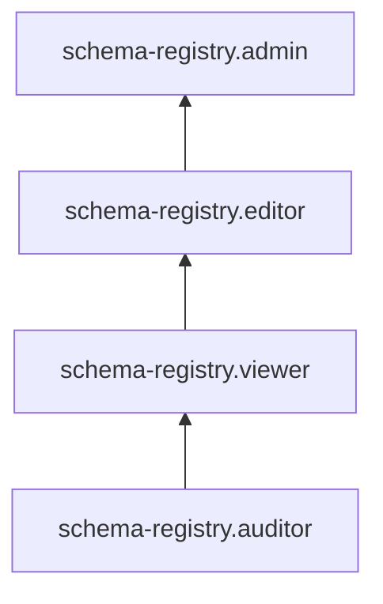

# Сервисные роли для управления схемами данных с помощью Schema Registry



Эта функциональность находится на стадии [Preview](../../overview/concepts/launch-stages.md).



С помощью сервисных ролей Schema Registry вы сможете просматривать пространства имен, субъекты и схемы в реестре схем, а также создавать, редактировать и удалять пространства имен и схемы.

### schema-registry.auditor {#schema-registry-auditor}

Роль `schema-registry.auditor` позволяет просматривать информацию о [пространствах имен](../concepts/schema-registry.md#namespace).

### schema-registry.viewer {#schema-registry-viewer}

Роль `schema-registry.viewer` позволяет просматривать информацию о [схемах](../concepts/schema-registry.md#schema) и [пространствах имен](../concepts/schema-registry.md#namespace), а также сравнивать версии схем.

Включает разрешения, предоставляемые ролью `schema-registry.auditor`.

### schema-registry.editor {#schema-registry-editor}

Роль `schema-registry.editor` позволяет управлять схемами и пространствами имен.

Пользователи с этой ролью могут:
* просматривать информацию о [схемах](../concepts/schema-registry.md#schema), создавать, изменять и удалять схемы, а также сравнивать версии схем;
* просматривать информацию о [пространствах имен](../concepts/schema-registry.md#namespace), а также создавать, изменять и удалять их.

Включает разрешения, предоставляемые ролью `schema-registry.viewer`.

### schema-registry.admin {#schema-registry-admin}

Роль `schema-registry.admin` позволяет управлять сервисом Schema Registry, а также схемами и пространствами имен.

Пользователи с этой ролью могут:
* просматривать информацию о [схемах](../concepts/schema-registry.md#schema), создавать, изменять и удалять схемы, а также сравнивать версии схем;
* просматривать информацию о [пространствах имен](../concepts/schema-registry.md#namespace), а также создавать, изменять и удалять их.

Включает разрешения, предоставляемые ролью `schema-registry.editor`.

## Какие роли мне необходимы {#choosing-roles}

В таблице ниже перечислено, какие роли нужны для выполнения указанного действия. Вы всегда можете назначить роль, которая дает более широкие разрешения, нежели указанная. Например, назначить `editor` вместо `viewer`.

| Действие                        | Необходимые роли          |
|---------------------------------|---------------------------|
| Просматривать пространства имен | `schema-registry.auditor` |
| Просматривать субъекты          | `schema-registry.viewer`  |
| Просматривать схемы             | `schema-registry.viewer`  |
| Сравнивать версии схем          | `schema-registry.viewer`  |
| Создавать пространства имен     | `schema-registry.editor`  |
| Создавать схемы                 | `schema-registry.editor`  |
| Редактировать пространства имен | `schema-registry.editor`  |
| Редактировать схемы             | `schema-registry.editor`  |
| Удалять пространства имен       | `schema-registry.editor`  |
| Удалять схемы                   | `schema-registry.editor`  |