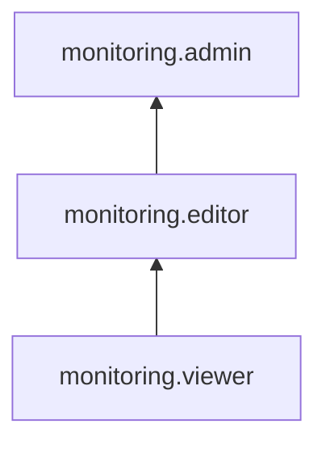

# Управление доступом в {{ monitoring-name }}

Пользователь {{ yandex-cloud }} может выполнять только те операции над ресурсами, которые разрешены назначенными ему [ролями](../../iam/concepts/access-control/roles.md). Пока у пользователя нет никаких ролей, почти все операции ему запрещены.

Чтобы разрешить доступ к ресурсам сервиса {{ monitoring-full-name }}, назначьте аккаунту на Яндексе, [сервисному аккаунту](../../iam/concepts/users/service-accounts.md), [федеративным](../../iam/concepts/users/accounts.md#saml-federation) или [локальным](../../iam/concepts/users/accounts.md#local) пользователям, [группе пользователей](../../organization/operations/manage-groups.md), [системной группе](../../iam/concepts/access-control/system-group.md) или [публичной группе](../../iam/concepts/access-control/public-group.md) нужные роли из приведенного ниже списка.

Подробнее о наследовании ролей читайте в разделе [{#T}](../../resource-manager/concepts/resources-hierarchy.md#access-rights-inheritance) документации сервиса {{ resmgr-full-name }}.

На данный момент роль может быть назначена только на родительский ресурс (каталог или облако), роли которого наследуются вложенными ресурсами.

Назначать роли на ресурс могут пользователи, у которых на этот ресурс есть хотя бы одна из ролей:

* `admin`;
* `resource-manager.admin`;
* `organization-manager.admin`;
* `resource-manager.clouds.owner`;
* `organization-manager.organizations.owner`.

## Назначение ролей {#grant-roles}

Чтобы назначить пользователю роль:

1. При необходимости [добавьте](../../organization/operations/add-account.md) нужного пользователя.
1. В [консоли управления]({{ link-console-main }}) слева [выберите](../../resource-manager/operations/cloud/switch-cloud.md) облако.
1. Перейдите на вкладку **{{ ui-key.yacloud.common.resource-acl.label_access-bindings }}**.
1. Нажмите кнопку **{{ ui-key.yacloud.common.resource-acl.button_configure-access }}**.
1. В открывшемся окне выберите раздел **{{ ui-key.yacloud_components.acl.label.user-accounts }}**.
1. Выберите пользователя из списка или воспользуйтесь поиском.
1. Нажмите кнопку  **{{ ui-key.yacloud_components.acl.button.add-role }}** и выберите роль в облаке.
1. Нажмите кнопку **{{ ui-key.yacloud.common.save }}**.

## Какие роли действуют в сервисе {#roles-list}

Ниже перечислены все роли, которые учитываются при проверке прав доступа в сервисе {{ monitoring-full-name }}.

### Сервисные роли {#service-roles}

#### monitoring.viewer {#monitoring-viewer}

Роль `monitoring.viewer` позволяет выгружать метрики, а также просматривать информацию о метриках, дашбордах и виджетах.

Пользователи с этой ролью могут:
* просматривать информацию о [метриках](../concepts/data-model.md#metric) и их [метках](../concepts/data-model.md#label), а также выгружать метрики;
* просматривать список [дашбордов](../concepts/visualization/dashboard.md) и [виджетов](../concepts/visualization/widget.md), а также информацию о них;
* просматривать историю [уведомлений](../concepts/alerting/notification-channel.md);
* просматривать информацию о [квотах](../concepts/limits.md#monitoring-quotas) сервиса Monitoring;
* просматривать информацию о [каталоге](../../resource-manager/concepts/resources-hierarchy.md#folder).

#### monitoring.editor {#monitoring-editor}

Роль `monitoring.editor` позволяет управлять дашбордами и виджетами, загружать и выгружать метрики, а также просматривать историю уведомлений и информацию о квотах сервиса.

Пользователи с этой ролью могут:
* просматривать информацию о [метриках](../concepts/data-model.md#metric) и их [метках](../concepts/data-model.md#label), а также загружать и выгружать метрики;
* просматривать список [дашбордов](../concepts/visualization/dashboard.md) и [виджетов](../concepts/visualization/widget.md) и информацию о них, а также создавать, изменять и удалять дашборды и виджеты;
* просматривать историю [уведомлений](../concepts/alerting/notification-channel.md);
* просматривать информацию о [квотах](../concepts/limits.md#monitoring-quotas) сервиса Monitoring;
* просматривать информацию о [каталоге](../../resource-manager/concepts/resources-hierarchy.md#folder).

Включает разрешения, предоставляемые ролью `monitoring.viewer`.

#### monitoring.admin {#monitoring-admin}

Роль `monitoring.admin` позволяет управлять дашбордами и виджетами, загружать и выгружать метрики, а также просматривать историю уведомлений, информацию о квотах сервиса и метаданные каталога.

Пользователи с этой ролью могут:
* просматривать информацию о [метриках](../concepts/data-model.md#metric) и их [метках](../concepts/data-model.md#label), а также загружать и выгружать метрики;
* просматривать список [дашбордов](../concepts/visualization/dashboard.md) и [виджетов](../concepts/visualization/widget.md) и информацию о них, а также создавать, изменять и удалять дашборды и виджеты;
* просматривать историю [уведомлений](../concepts/alerting/notification-channel.md);
* просматривать информацию о [квотах](../concepts/limits.md#monitoring-quotas) сервиса Monitoring;
* просматривать информацию о [каталоге](../../resource-manager/concepts/resources-hierarchy.md#folder).

Включает разрешения, предоставляемые ролью `monitoring.editor`.

### Примитивные роли {#primitive-roles}

Примитивные роли позволяют пользователям совершать действия во [всех сервисах](../../overview/concepts/services.md) {{ yandex-cloud }}.

#### {{ roles-auditor }} {#auditor}

Роль `auditor` предоставляет разрешения на чтение конфигурации и метаданных любых ресурсов Yandex Cloud без возможности доступа к данным.

Например, пользователи с этой ролью могут:
* просматривать информацию о [ресурсе]({{ link-docs }}/resource-manager/concepts/resources-hierarchy);
* просматривать метаданные ресурса;
* просматривать список операций с ресурсом.

Роль `auditor` — наиболее безопасная роль, исключающая доступ к данным [сервисов]({{ link-docs }}/overview/concepts/services). Роль подходит для пользователей, которым необходим минимальный уровень доступа к ресурсам Yandex Cloud.

#### {{ roles-viewer }} {#viewer}

Роль `viewer` предоставляет разрешения на чтение информации о любых [ресурсах]({{ link-docs }}/resource-manager/concepts/resources-hierarchy) Yandex Cloud.

Включает разрешения, предоставляемые ролью `auditor`.

В отличие от роли `auditor`, роль `viewer` предоставляет доступ к данным [сервисов]({{ link-docs }}/overview/concepts/services) в режиме чтения.

#### {{ roles-editor }} {#editor}

Роль `editor` предоставляет разрешения на управление любыми [ресурсами]({{ link-docs }}/resource-manager/concepts/resources-hierarchy) Yandex Cloud, кроме назначения ролей другим пользователям, передачи прав владения [организацией]({{ link-docs }}/organization/concepts/organization) и ее удаления, а также удаления [ключей шифрования]({{ link-docs }}/kms/concepts/) Key Management Service.

Например, пользователи с этой ролью могут создавать, изменять и удалять ресурсы.

Включает разрешения, предоставляемые ролью `viewer`.

#### {{ roles-admin }} {#admin}

Роль `admin` позволяет назначать любые роли, кроме `resource-manager.clouds.owner` и `organization-manager.organizations.owner`, а также предоставляет разрешения на управление любыми [ресурсами]({{ link-docs }}/resource-manager/concepts/resources-hierarchy) Yandex Cloud, кроме передачи прав владения [организацией]({{ link-docs }}/organization/concepts/organization) и ее удаления.

Прежде чем назначить роль `admin` на организацию, [облако]({{ link-docs }}/resource-manager/concepts/resources-hierarchy#cloud) или [платежный аккаунт]({{ link-docs }}/billing/concepts/billing-account), ознакомьтесь с информацией о защите [привилегированных аккаунтов]({{ link-docs }}/security/standard/all#privileged-users).

Включает разрешения, предоставляемые ролью `editor`.

Вместо примитивных ролей мы рекомендуем использовать роли сервисов. Такой подход позволит более гранулярно управлять доступом и обеспечить соблюдение [принципа минимальных привилегий](../../security/standard/all.md#min-privileges).

Подробнее о примитивных ролях см. в [справочнике ролей {{ yandex-cloud }}](../../iam/roles-reference.md#primitive-roles).