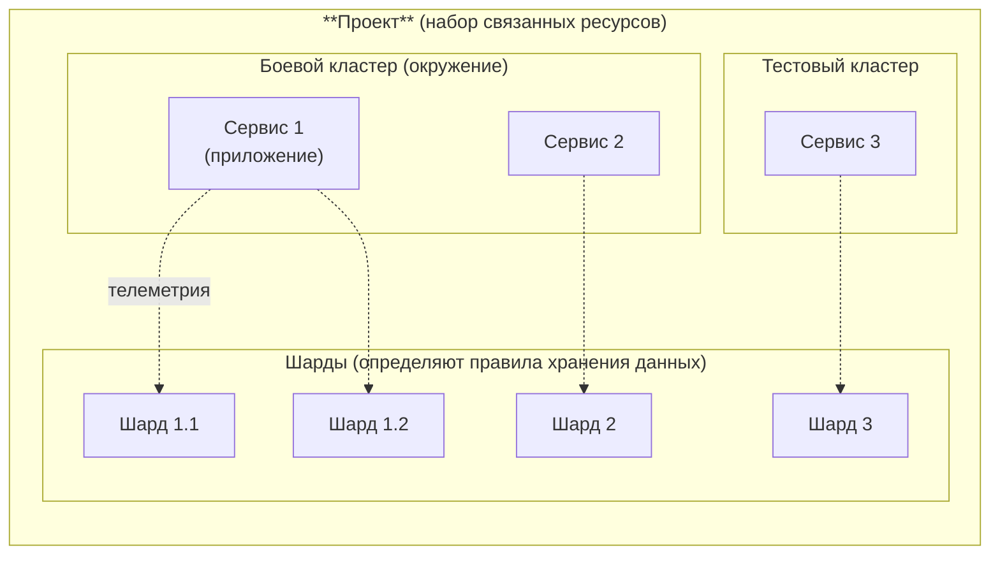

[Документация Yandex Cloud](../../index.md) > [Monium](../index.md) > Концепции > Конфигурация объектов

# Конфигурация объектов Monium

В сервисе Monium для логического разделения данных телеметрии используются несколько объектов конфигурации: проект, кластер, сервис и шард.

* _Проект_ — логическая сущность верхнего уровня. Проект позволяет объединить телеметрию связанных приложений, микросервисов и ограничить права доступа к данным для команд разработки. Например: интернет-магазин, биллинг, сервисы безопасности. Проект, соответствующий каталогу в Yandex Cloud, создается автоматически. Также можно создавать собственные проекты для логического разделения телеметрии внутри одного каталога.

* _Кластер_ — позволяет выделить окружение, независимые инсталляции, в которых работают сервисы. Например, боевой и тестовый кластеры, кластеры в различных регионах.

* _Сервис_ — отдельное клиентское приложение, которое генерирует данные телеметрии. Это может быть микросервис или компонент внутри микросервиса, например Nginx, Envoy, ВМ Compute Cloud.

* _Шард_ — контейнер для хранения данных конкретной пары «сервис и кластер» и настройки хранения данных, например [TTL](https://en.wikipedia.org/wiki/Time_to_live).

Объекты «проект», «кластер» и «сервис» определяют источник данных, а «шард» — правила хранения.

## Связь с моделью данных {#relation-to-data-model}

Объекты конфигурации соответствуют обязательным атрибутам телеметрии в [модели данных](data-model.md):

* `project` — проект.
* `cluster` — кластер.
* `service` — сервис.

Эти атрибуты участвуют в каждом запросе на [языке запросов](querying.md) и позволяют сузить область поиска. Чем точнее указаны проект, кластер и сервис, тем быстрее выполняется запрос.

#### См. также {#see-also}

* [Модель данных в Monium](data-model.md)
* [Язык запросов в Monium](querying.md)
* [Строка запроса в Monium](visualization/query-string.md)