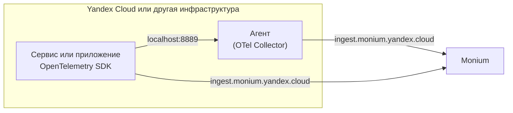

# О платформе Monium

Monium — платформа для наблюдения и анализа работы сервисов Yandex Cloud или вашей инфраструктуры и приложений.

Наблюдение и анализ систем строятся на сборе телеметрии, ее визуализации на дашбордах и настройке алертов для автоматического оповещения о проблемах и аномалиях. Использование единого инструмента помогает переходить от аномалии на графике к логам с ошибками и трейсам конкретных запросов и быстрее находить причины инцидентов.

## Виды телеметрии {#telemetry-types}

Monium поддерживает сбор телеметрии приложений и [ресурсов](../resource-manager/concepts/resources-hierarchy.md) Yandex Cloud:

* _Метрики_ — числовые показатели, измеряемые во времени (например, RPS, загрузка CPU). Используются для графиков и оповещений (алертов).

    [Метрики ресурсов](metrics-ref/index.md) Yandex Cloud передаются в Monium автоматически. Также многие сервисы предоставляют [сервисные дашборды](visualization/index.md#service-dashboards) с набором готовых виджетов, которые отображают состояние ваших облачных ресурсов.

* _Логи_ — структурированные записи о событиях в приложении или инфраструктуре (например, сообщения о запуске и ошибках). Используются для диагностики системы.

    Для сбора логов ресурсов Yandex Cloud потребуется включить логирование при создании или изменении ресурса.

* _Трейсы_ — связанная цепочка операций по конкретному запросу, которая показывает путь и время выполнения каждого шага. Используется для наблюдения за распределенными системами.

## Передача телеметрии {#send-telemetry}

Если для ресурсов Yandex Cloud передача телеметрии преднастроена, то поставку данных ваших приложений и сторонней инфраструктуры потребуется настроить вручную.

Формат поставки данных в Monium — [OpenTelemetry (OTLP)](https://opentelemetry.io/docs/).

Для передачи телеметрии можно использовать:

* Совместимые с OpenTelemetry агенты, например: [OTel Collector](collector/opentelemetry.md) (для всех видов телеметрии) — рекомендуется, [Fluent Bit](logs/write/fluent-bit.md) (для логов и метрик).
* Unified Agent — агент от Яндекса для сбора и отправки данных (пока работает только с метриками).
  
    
    
    Сейчас Unified Agent поддерживает только работу с метриками. Позднее будет добавлен формат OpenTelemetry для метрик, логов и трейсов.
    
    

* Отправку напрямую из приложения через OpenTelemetry SDK.

Для сбора метрик Prometheus поддерживается интеграция через [Yandex Managed Service for Prometheus®](operations/prometheus/index.md).

В дальнейшем планируется расширение платформы другими инструментами Observability.

## Распределение телеметрии {#save-telemetry}

В Monium для логического разделения данных телеметрии используются следующие понятия:

* _Проект_ — логическая сущность верхнего уровня. Проект позволяет объединить телеметрию связанных приложений, микросервисов и ограничить права доступа к данным для команд разработки. Например: интернет-магазин, биллинг, сервисы безопасности.

* _Кластер_ — позволяет выделить окружение, независимые инсталляции, в которых работают сервисы. Например, боевой и тестовый кластеры, кластеры в различных регионах.

* _Сервис_ — отдельное клиентское приложение, которое генерирует данные телеметрии. Это может быть микросервис или компонент внутри микросервиса, например Nginx, Envoy, ВМ Compute Cloud

* _Шард_ — контейнер для хранения данных конкретной пары «сервис и кластер» и настройки хранения данных, например [TTL](https://en.wikipedia.org/wiki/Time_to_live).

Объекты «проект», «кластер» и «сервис» определяют источник данных, а «шард» — правила хранения.

Описание других объектов и понятий Monium см. в разделе [Основные понятия](concepts/glossary.md).

## Обзор возможностей платформы {#features}

Платформа предоставляет полный цикл работы с телеметрией: от сбора данных до визуализации и оповещений.

### Поставка данных {#data-ingestion}

Платформа поддерживает гибкую настройку поставки телеметрии:

* Автоматический сбор метрик для ресурсов Yandex Cloud.
* Интеграция с приложениями через OpenTelemetry.
* Поддержка Prometheus через Yandex Managed Service for Prometheus®.

[Подробнее о передаче телеметрии](collector/index.md)

### Метрики {#metrics}

Метрики — числовые показатели производительности системы в реальном времени. Примеры использования метрик:

* Мониторинг загрузки CPU, памяти, сети.
* Анализ трендов и производительности.
* Выявление аномалий и узких мест.

[Подробнее о метриках](metrics/quickstart.md)

### Логи {#logs}

Структурированные записи событий и сообщений, которые помогают:

* Исследовать детали конкретных инцидентов.
* Анализировать ошибки и исключения.
* Проводить аудит действий пользователей и системы.

[Подробнее о логах](logs/quickstart.md)

### Трейсы {#traces}

Визуализация пути запросов в распределенных приложениях для решения задач:

* Поиск узких мест в цепочках микросервисов.
* Анализ задержек между компонентами.
* Понимание зависимостей в сложных архитектурах.
* Исследование запросов и ответов при мониторинге LLM-агентов.

[Подробнее о трейсах](traces/index.md)

### Алерты {#alerts}

Автоматические уведомления о критических событиях, для которых можно настроить:

* Правила срабатывания события, например, резкое изменение какой-либо метрики.
* Оповещения в мессенджеры, почту, телефонный звонок или выполнение облачной функции.

Алерты позволяют реагировать на проблемы до влияния на пользователей или минимизировать это влияние.

[Подробнее об алертах](operations/alert/create-alert.md)

### Визуализация {#dashboards}

Создавайте дашборды для мониторинга состояния системы:

* Объединяйте метрики, логи и трейсы на одном дашборде.
* Используйте готовые сервисные дашборды для ресурсов Yandex Cloud.
* Настраивайте графики, таблицы и другие виджеты.
* Применяйте drill-down для детального анализа проблем.

[Подробнее о дашбордах](visualization/index.md)

### Интеграция данных {#integration}

Связывайте разные типы телеметрии для комплексного анализа:

* Переходите от метрик к логам и трейсам через единый интерфейс.
* Используйте `trace_id` и `span_id` для связи логов с трейсами.
* Анализируйте инциденты, объединяя данные из разных источников.

[Модель данных](concepts/data-model.md)

### Концепции платформы {#concepts}

* [Основные понятия Monium](concepts/glossary.md)
* [Модель данных в Monium](concepts/data-model.md)
* [Язык запросов в Monium](concepts/querying.md)

#### См. также {#see-also}

* [Yandex Monium: платформа для мониторинга и управления состоянием IT-систем](https://yandex.cloud/ru/blog/yandex-monium)