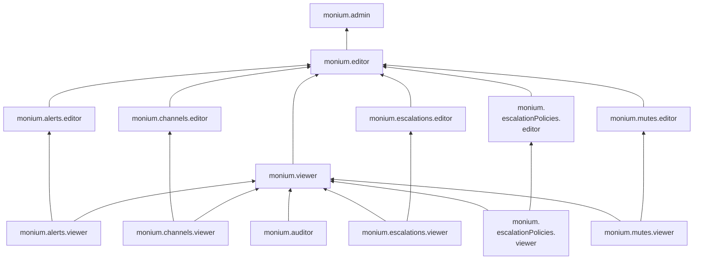
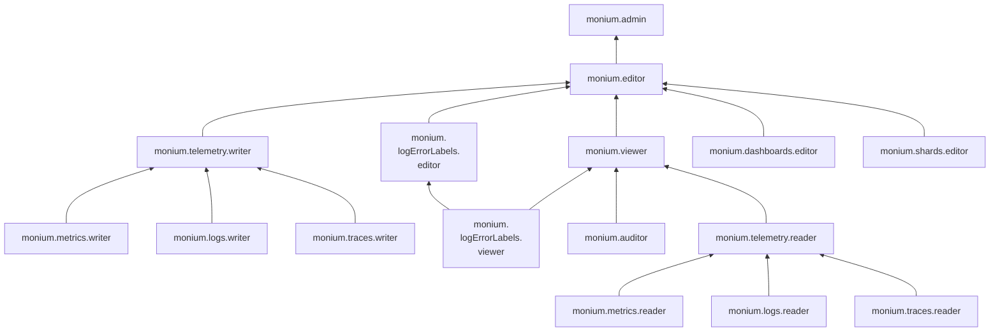
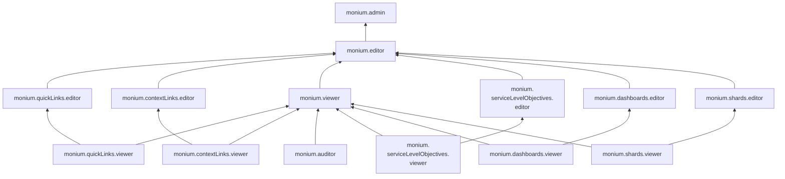

# Управление доступом в Monium

Пользователь Yandex Cloud может выполнять только те операции над ресурсами, которые разрешены назначенными ему [ролями](../../iam/concepts/access-control/roles.md). Пока у пользователя нет никаких ролей, почти все операции ему запрещены.

Чтобы разрешить доступ к ресурсам сервиса Monium Metrics, назначьте аккаунту на Яндексе, [сервисному аккаунту](../../iam/concepts/users/service-accounts.md), [федеративным](../../iam/concepts/users/accounts.md#saml-federation) или [локальным](../../iam/concepts/users/accounts.md#local) пользователям, [группе пользователей](../../organization/operations/manage-groups.md), [системной группе](../../iam/concepts/access-control/system-group.md) или [публичной группе](../../iam/concepts/access-control/public-group.md) нужные роли из приведенного ниже списка.

Подробнее о наследовании ролей читайте в разделе [Наследование прав доступа](../../resource-manager/concepts/resources-hierarchy.md#access-rights-inheritance) документации сервиса Yandex Resource Manager.

На данный момент роль может быть назначена только на родительский ресурс (каталог или облако), роли которого наследуются вложенными ресурсами.

Назначать роли на ресурс могут пользователи, у которых на этот ресурс есть хотя бы одна из ролей:

* `admin`;
* `resource-manager.admin`;
* `organization-manager.admin`;
* `resource-manager.clouds.owner`;
* `organization-manager.organizations.owner`.

## Какие роли действуют в сервисе {#roles-list}













Для управления правами доступа в Monium можно использовать как сервисные, так и примитивные роли.

### Сервисные роли {#service-roles}

#### monium.alerts.viewer {#monium-alerts-viewer}

Роль `monium.alerts.viewer` позволяет просматривать список [алертов](../concepts/alerting/alert.md), а также их настройки и историю срабатываний.

#### monium.alerts.editor {#monium-alerts-editor}

Роль `monium.alerts.editor` позволяет просматривать список [алертов](../concepts/alerting/alert.md), их настройки и историю срабатываний, а также создавать, изменять и удалять алерты.

Включает разрешения, предоставляемые ролью `monium.alerts.viewer`.

#### monium.channels.viewer {#monium-channels-viewer}

Роль `monium.channels.viewer` позволяет просматривать список и информацию о [каналах уведомлений](../concepts/alerting/notification-channel.md) для [алертов](../concepts/alerting/alert.md).

#### monium.channels.editor {#monium-channels-editor}

Роль `monium.channels.editor` позволяет просматривать список и информацию о [каналах уведомлений](../concepts/alerting/notification-channel.md) для [алертов](../concepts/alerting/alert.md), а также создавать, изменять и удалять каналы уведомлений.

Включает разрешения, предоставляемые ролью `monium.channels.viewer`.

#### monium.contextLinks.viewer {#monium-contextlinks-viewer}

Роль `monium.contextLinks.viewer` позволяет просматривать настроенные контекстные ссылки на [графиках](../concepts/visualization/widget.md#chart) дашбордов.

#### monium.contextLinks.editor {#monium-contextLinks-editor}

Роль `monium.contextLinks.editor` позволяет просматривать настроенные контекстные ссылки на [графиках](../concepts/visualization/widget.md#chart) дашбордов, а также создавать, изменять и удалять контекстные ссылки.

Включает разрешения, предоставляемые ролью `monium.contextLinks.viewer`.

#### monium.quickLinks.viewer {#monium-quickLinks-viewer}

Роль `monium.quickLinks.viewer` позволяет просматривать список настроенных [быстрых ссылок](../concepts/glossary.md#project-menu) и информацию о них в меню [проекта](../concepts/glossary.md#project).

#### monium.quickLinks.editor {#monium-quickLinks-editor}

Роль `monium.quickLinks.editor` позволяет просматривать список настроенных [быстрых ссылок](../concepts/glossary.md#project-menu) и информацию о них в меню [проекта](../concepts/glossary.md#project), а также создавать, изменять и удалять быстрые ссылки.

Включает разрешения, предоставляемые ролью `monium.quickLinks.viewer`.

#### monium.dashboards.viewer {#monium-dashboards-viewer}

Роль `monium.dashboards.viewer` позволяет просматривать [дашборды](../concepts/visualization/dashboard.md) и их [виджеты](../concepts/visualization/widget.md).

#### monium.dashboards.editor {#monium-dashboards-editor}

Роль `monium.dashboards.editor` позволяет просматривать [дашборды](../concepts/visualization/dashboard.md) и их [виджеты](../concepts/visualization/widget.md), а также создавать, изменять и удалять дашборды.

Включает разрешения, предоставляемые ролью `monium.dashboards.viewer`.

#### monium.escalations.viewer {#monium-escalations-viewer}

Роль `monium.escalations.viewer` позволяет просматривать информацию об уведомлениях и [эскалациях](../concepts/alerting/escalations.md) для [алертов](../concepts/alerting/alert.md).

#### monium.escalations.editor {#monium-escalations-editor}

Роль `monium.escalations.editor` позволяет просматривать информацию об уведомлениях и [эскалациях](../concepts/alerting/escalations.md) для [алертов](../concepts/alerting/alert.md), а также создавать, изменять и удалять эскалации.

Включает разрешения, предоставляемые ролью `monium.escalations.viewer`.

#### monium.escalationPolicies.viewer {#monium-escalationPolicies-viewer}

Роль `monium.escalationPolicies.viewer` позволяет просматривать список и настройки [политик эскалации](../concepts/alerting/escalations.md#intro) для [алертов](../concepts/alerting/alert.md).

#### monium.escalationPolicies.editor {#monium-escalationPolicies-editor}

Роль `monium.escalationPolicies.editor` позволяет просматривать список и настройки [политик эскалации](../concepts/alerting/escalations.md#intro) для [алертов](../concepts/alerting/alert.md), а также создавать, изменять и удалять политики эскалации.

Включает разрешения, предоставляемые ролью `monium.escalationPolicies.viewer`.

#### monium.logErrorLabels.viewer {#monium-logErrorLabels-viewer}

Роль `monium.logErrorLabels.viewer` позволяет просматривать [лейблы](../traces/operations/traces-explorer.md), привязанные к ошибкам в логах.

#### monium.logErrorLabels.editor {#monium-logErrorLabels-editor}

Роль `monium.logErrorLabels.editor` позволяет просматривать, а также добавлять новые, редактировать и удалять существующие [лейблы](../traces/operations/traces-explorer.md) к ошибкам в [логах](../logs/quickstart.md).

Включает разрешения, предоставляемые ролью `monium.logErrorLabels.viewer`.

#### monium.mutes.viewer {#monium-mutes-viewer}

Роль `monium.mutes.viewer` позволяет просматривать [мьюты](../alerts/mutes.md) — правила временного отключения [уведомлений](../concepts/alerting/notification-channel.md) для [алертов](../concepts/alerting/alert.md).

#### monium.mutes.editor {#monium-mutes-editor}

Роль `monium.mutes.editor` позволяет просматривать, а также создавать, изменять и удалять [мьюты](../alerts/mutes.md) — правила временного отключения [уведомлений](../concepts/alerting/notification-channel.md) для [алертов](../concepts/alerting/alert.md).

Включает разрешения, предоставляемые ролью `monium.mutes.viewer`.

#### monium.serviceLevelObjectives.viewer {#monium-serviceLevelObjectives-viewer}

Роль `monium.serviceLevelObjectives.viewer` позволяет просматривать настроенные [SLO](../slo/index.md) (Service Level Objectives).

#### monium.serviceLevelObjectives.editor {#monium-serviceLevelObjectives-editor}

Роль `monium.serviceLevelObjectives.editor` позволяет просматривать настроенные [SLO](../slo/index.md) (Service Level Objectives), а также создавать, изменять и удалять SLO.

Включает разрешения, предоставляемые ролью `monium.serviceLevelObjectives.viewer`.

#### monium.shards.viewer {#monium-shards-viewer}

Роль `monium.shards.viewer` позволяет просматривать информацию о [шардах](../concepts/glossary.md#shard), [кластерах](../concepts/glossary.md#cluster), [сервисах](../concepts/glossary.md#service) и их квотах.

#### monium.shards.editor {#monium-shards-editor}

Роль `monium.shards.editor` позволяет просматривать информацию о [шардах](../concepts/glossary.md#shard), [кластерах](../concepts/glossary.md#cluster), [сервисах](../concepts/glossary.md#service) и их квотах, а также создавать, изменять и удалять шарды.

Включает разрешения, предоставляемые ролью `monium.shards.viewer`.

#### monium.metrics.reader {#monium-metrics-reader}

Роль `monium.metrics.reader` позволяет читать [метрики](../metrics/quickstart.md), их значения и [метки](../../resource-manager/concepts/labels.md).

#### monium.metrics.writer {#monium-metrics-writer}

Роль `monium.metrics.writer` позволяет записывать [метрики](../metrics/quickstart.md).

#### monium.logs.reader {#monium-logs-reader}

Роль `monium.logs.reader` позволяет читать [логи](../logs/quickstart.md) и просматривать статистику ошибок по логам.

#### monium.logs.writer {#monium-logs-writer}

Роль `monium.logs.writer` позволяет записывать [логи](../logs/quickstart.md) на платформе Monium.

#### monium.traces.reader {#monium-traces-reader}

Роль `monium.traces.reader` позволяет просматривать данные [распределенных трассировок](../traces/index.md).

#### monium.traces.writer {#monium-traces-writer}

Роль `monium.traces.writer` позволяет записывать [распределенные трассировки](../traces/index.md).

#### monium.telemetry.reader {#monium-telemetry-reader}

Роль `monium.telemetry.reader` позволяет читать все виды телеметрии платформы Monium: [метрики](../metrics/quickstart.md), [логи](../logs/quickstart.md) и [распределенные трассировки](../traces/index.md).

Включает разрешения, предоставляемые ролями `monium.metrics.reader`, `monium.logs.reader` и `monium.traces.reader`.

#### monium.telemetry.writer {#monium-telemetry-writer}

Роль `monium.telemetry.writer` позволяет записывать все виды телеметрии на платформе Monium: [метрики](../metrics/quickstart.md), [логи](../logs/quickstart.md) и [распределенные трассировки](../traces/index.md).

Включает разрешения, предоставляемые ролями `monium.metrics.writer`, `monium.logs.writer` и `monium.traces.writer`.

#### monium.auditor {#monium-auditor}

Роль `monium.auditor` позволяет просматривать информацию о ресурсах платформы Monium без возможности чтения телеметрии.

Пользователи с этой ролью могут:
* просматривать информацию о [проектах](../concepts/glossary.md#project) и назначенных [правах доступа](../../iam/concepts/access-control/index.md) к ним;
* просматривать [дашборды](../concepts/visualization/dashboard.md) и их [виджеты](../concepts/visualization/widget.md);
* просматривать настроенные контекстные ссылки на [графиках](../concepts/visualization/widget.md#chart) дашбордов;
* просматривать список настроенных [быстрых ссылок](../concepts/glossary.md#project-menu) и информацию о них в меню проектов;
* просматривать информацию о [шардах](../concepts/glossary.md#shard), [кластерах](../concepts/glossary.md#cluster), [сервисах](../concepts/glossary.md#service) и их квотах;
* просматривать список [алертов](../concepts/alerting/alert.md), а также их настройки и историю срабатываний;
* просматривать настроенные [SLO](../slo/index.md) (Service Level Objectives);
* просматривать список и информацию о [каналах уведомлений](../concepts/alerting/notification-channel.md) для алертов;
* просматривать список и настройки [политик эскалации](../concepts/alerting/escalations.md#intro) для алертов;
* просматривать информацию об уведомлениях и [эскалациях](../concepts/alerting/escalations.md) для алертов;
* просматривать [мьюты](../alerts/mutes.md) — правила временного отключения [уведомлений](../concepts/alerting/notification-channel.md) для алертов;
* просматривать [лейблы](../traces/operations/traces-explorer.md), привязанные к ошибкам в логах;
* просматривать информацию о [правилах](../operations/prometheus/recording-rules.md) Yandex Managed Service for Prometheus®.

Включает разрешения, предоставляемые ролями `monium.dashboards.viewer`, `monium.shards.viewer`, `monium.contextLinks.viewer`, `monium.quickLinks.viewer`, `monium.alerts.viewer`, `monium.serviceLevelObjectives.viewer`, `monium.channels.viewer`, `monium.escalationPolicies.viewer`, `monium.escalations.viewer`, `monium.mutes.viewer` и `monium.logErrorLabels.viewer`.

#### monium.viewer {#monium-viewer}

Роль `monium.viewer` позволяет просматривать информацию о ресурсах платформы Monium с возможностью чтения всех видов телеметрии.

Пользователи с этой ролью могут:

* просматривать информацию о [проектах](../concepts/glossary.md#project) и назначенных [правах доступа](../../iam/concepts/access-control/index.md) к ним;
* читать все виды телеметрии платформы Monium: [метрики](../metrics/quickstart.md), [логи](../logs/quickstart.md) и [распределенные трассировки](../traces/index.md);
* просматривать [дашборды](../concepts/visualization/dashboard.md) и их [виджеты](../concepts/visualization/widget.md);
* просматривать настроенные контекстные ссылки на [графиках](../concepts/visualization/widget.md#chart) дашбордов;
* просматривать список настроенных [быстрых ссылок](../concepts/glossary.md#project-menu) и информацию о них в меню проектов;
* просматривать информацию о [шардах](../concepts/glossary.md#shard), [кластерах](../concepts/glossary.md#cluster), [сервисах](../concepts/glossary.md#service) и их квотах;
* просматривать список [алертов](../concepts/alerting/alert.md), а также их настройки и историю срабатываний;
* просматривать настроенные [SLO](../slo/index.md) (Service Level Objectives);
* просматривать список и информацию о [каналах уведомлений](../concepts/alerting/notification-channel.md) для алертов;
* просматривать список и настройки [политик эскалации](../concepts/alerting/escalations.md#intro) для алертов;
* просматривать информацию об уведомлениях и [эскалациях](../concepts/alerting/escalations.md) для алертов;
* просматривать [мьюты](../alerts/mutes.md) — правила временного отключения [уведомлений](../concepts/alerting/notification-channel.md) для алертов;
* просматривать [лейблы](../traces/operations/traces-explorer.md), привязанные к ошибкам в логах;
* просматривать информацию о [правилах](../operations/prometheus/recording-rules.md) Yandex Managed Service for Prometheus®;
* просматривать информацию о [каталоге](../../resource-manager/concepts/resources-hierarchy.md#folder).

Включает разрешения, предоставляемые ролями `monium.auditor` и `monium.telemetry.reader`.

#### monium.editor {#monium-editor}

Роль `monium.editor` позволяет управлять ресурсами платформы Monium, просматривать и записывать все виды телеметрии.

Пользователи с этой ролью могут:
* просматривать информацию о [проектах](../concepts/glossary.md#project) и назначенных [правах доступа](../../iam/concepts/access-control/index.md) к ним, а также настраивать проекты;
* читать и записывать все виды телеметрии платформы Monium: [метрики](../metrics/quickstart.md), [логи](../logs/quickstart.md) и [распределенные трассировки](../traces/index.md);
* просматривать [дашборды](../concepts/visualization/dashboard.md) и их [виджеты](../concepts/visualization/widget.md), а также создавать, изменять и удалять дашборды;
* просматривать настроенные контекстные ссылки на [графиках](../concepts/visualization/widget.md#chart) дашбордов, а также создавать, изменять и удалять контекстные ссылки;
* просматривать список настроенных [быстрых ссылок](../concepts/glossary.md#project-menu) и информацию о них в меню [проекта](../concepts/glossary.md#project), а также создавать, изменять и удалять быстрые ссылки;
* просматривать информацию о [шардах](../concepts/glossary.md#shard), [кластерах](../concepts/glossary.md#cluster), [сервисах](../concepts/glossary.md#service) и их квотах, а также создавать, изменять и удалять шарды;
* просматривать список [алертов](../concepts/alerting/alert.md), их настройки и историю срабатываний, а также создавать, изменять и удалять алерты;
* просматривать настроенные [SLO](../slo/index.md) (Service Level Objectives), а также создавать, изменять и удалять SLO;
* просматривать список и информацию о [каналах уведомлений](../concepts/alerting/notification-channel.md) для алертов, а также создавать, изменять и удалять каналы уведомлений;
* просматривать список и настройки [политик эскалации](../concepts/alerting/escalations.md#intro) для алертов, а также создавать, изменять и удалять политики эскалации;
* просматривать информацию об уведомлениях и [эскалациях](../concepts/alerting/escalations.md) для алертов, а также создавать, изменять и удалять эскалации;
* просматривать, а также создавать, изменять и удалять [мьюты](../alerts/mutes.md) — правила временного отключения [уведомлений](../concepts/alerting/notification-channel.md) для алертов;
* просматривать, а также добавлять новые, редактировать и удалять существующие [лейблы](../traces/operations/traces-explorer.md) к ошибкам в логах;
* просматривать информацию о [правилах](../operations/prometheus/recording-rules.md) Yandex Managed Service for Prometheus®, а также создавать, изменять и удалять такие правила;
* просматривать информацию о [каталоге](../../resource-manager/concepts/resources-hierarchy.md#folder).

Включает разрешения, предоставляемые ролями `monium.viewer`, `monium.telemetry.writer`, `monium.dashboards.editor`, `monium.shards.editor`, `monium.contextLinks.editor`, `monium.quickLinks.editor`, `monium.alerts.editor`, `monium.serviceLevelObjectives.editor`, `monium.channels.editor`, `monium.escalationPolicies.editor`, `monium.escalations.editor`, `monium.mutes.editor` и `monium.logErrorLabels.editor`.

#### monium.admin {#monium-admin}

Роль `monium.admin` позволяет управлять ресурсами платформы Monium, просматривать и записывать все виды телеметрии, а также управлять проектами и доступом к ним.

Пользователи с этой ролью могут:
* просматривать информацию о [проектах](../concepts/glossary.md#project), а также создавать, настраивать и удалять их;
* просматривать информацию о назначенных [правах доступа](../../iam/concepts/access-control/index.md) к проектам и изменять такие права доступа;
* читать и записывать все виды телеметрии платформы Monium: [метрики](../metrics/quickstart.md), [логи](../logs/quickstart.md) и [распределенные трассировки](../traces/index.md);
* просматривать [дашборды](../concepts/visualization/dashboard.md) и их [виджеты](../concepts/visualization/widget.md), а также создавать, изменять и удалять дашборды;
* просматривать настроенные контекстные ссылки на [графиках](../concepts/visualization/widget.md#chart) дашбордов, а также создавать, изменять и удалять контекстные ссылки;
* просматривать список настроенных [быстрых ссылок](../concepts/glossary.md#project-menu) и информацию о них в меню [проекта](../concepts/glossary.md#project), а также создавать, изменять и удалять быстрые ссылки;
* просматривать информацию о [шардах](../concepts/glossary.md#shard), [кластерах](../concepts/glossary.md#cluster), [сервисах](../concepts/glossary.md#service) и их квотах, а также создавать, изменять и удалять шарды;
* просматривать список [алертов](../concepts/alerting/alert.md), их настройки и историю срабатываний, а также создавать, изменять и удалять алерты;
* просматривать настроенные [SLO](../slo/index.md) (Service Level Objectives), а также создавать, изменять и удалять SLO;
* просматривать список и информацию о [каналах уведомлений](../concepts/alerting/notification-channel.md) для алертов, а также создавать, изменять и удалять каналы уведомлений;
* просматривать список и настройки [политик эскалации](../concepts/alerting/escalations.md#intro) для алертов, а также создавать, изменять и удалять политики эскалации;
* просматривать информацию об уведомлениях и [эскалациях](../concepts/alerting/escalations.md) для алертов, а также создавать, изменять и удалять эскалации;
* просматривать, а также создавать, изменять и удалять [мьюты](../alerts/mutes.md) — правила временного отключения [уведомлений](../concepts/alerting/notification-channel.md) для алертов;
* просматривать, а также добавлять новые, редактировать и удалять существующие [лейблы](../traces/operations/traces-explorer.md) к ошибкам в логах;
* просматривать информацию о [правилах](../operations/prometheus/recording-rules.md) Yandex Managed Service for Prometheus®, а также создавать, изменять и удалять такие правила;
* просматривать информацию о [каталоге](../../resource-manager/concepts/resources-hierarchy.md#folder).

Включает разрешения, предоставляемые ролью `monium.editor`.

### Примитивные роли {#primitive-roles}

Примитивные роли позволяют пользователям совершать действия во [всех сервисах](../../overview/concepts/services.md) Yandex Cloud.

#### auditor {#auditor}

Роль `auditor` предоставляет разрешения на чтение конфигурации и метаданных любых ресурсов Yandex Cloud без возможности доступа к данным.

Например, пользователи с этой ролью могут:
* просматривать информацию о [ресурсе](../../resource-manager/concepts/resources-hierarchy.md);
* просматривать метаданные ресурса;
* просматривать список операций с ресурсом.

Роль `auditor` — наиболее безопасная роль, исключающая доступ к данным [сервисов](../../overview/concepts/services.md). Роль подходит для пользователей, которым необходим минимальный уровень доступа к ресурсам Yandex Cloud.

#### viewer {#viewer}

Роль `viewer` предоставляет разрешения на чтение информации о любых [ресурсах](../../resource-manager/concepts/resources-hierarchy.md) Yandex Cloud.

Включает разрешения, предоставляемые ролью `auditor`.

В отличие от роли `auditor`, роль `viewer` предоставляет доступ к данным [сервисов](../../overview/concepts/services.md) в режиме чтения.

#### editor {#editor}

Роль `editor` предоставляет разрешения на управление любыми [ресурсами](../../resource-manager/concepts/resources-hierarchy.md) Yandex Cloud, кроме назначения ролей другим пользователям, передачи прав владения [организацией](../../organization/concepts/organization.md) и ее удаления, а также удаления [ключей шифрования](../../kms/concepts/index.md) Key Management Service.

Например, пользователи с этой ролью могут создавать, изменять и удалять ресурсы.

Включает разрешения, предоставляемые ролью `viewer`.

#### admin {#admin}

Роль `admin` позволяет назначать любые роли, кроме `resource-manager.clouds.owner` и `organization-manager.organizations.owner`, а также предоставляет разрешения на управление любыми [ресурсами](../../resource-manager/concepts/resources-hierarchy.md) Yandex Cloud, кроме передачи прав владения [организацией](../../organization/concepts/organization.md) и ее удаления.

Прежде чем назначить роль `admin` на организацию, [облако](../../resource-manager/concepts/resources-hierarchy.md#cloud) или [платежный аккаунт](../../billing/concepts/billing-account.md), ознакомьтесь с информацией о защите [привилегированных аккаунтов](../../security/standard/all.md#privileged-users).

Включает разрешения, предоставляемые ролью `editor`.

Вместо примитивных ролей мы рекомендуем использовать роли сервисов. Такой подход позволит более гранулярно управлять доступом и обеспечить соблюдение [принципа минимальных привилегий](../../security/standard/all.md#min-privileges).

Подробнее о примитивных ролях см. в [справочнике ролей Yandex Cloud](../../iam/roles-reference.md#primitive-roles).

## Назначение ролей {#grant-roles}

Чтобы назначить пользователю роль:

1. При необходимости [добавьте](../../organization/operations/add-account.md) нужного пользователя.
1. В [консоли управления](https://console.yandex.cloud) слева [выберите](../../resource-manager/operations/cloud/switch-cloud.md) облако.
1. Перейдите на вкладку **Права доступа**.
1. Нажмите кнопку **Настроить доступ**.
1. В открывшемся окне выберите раздел **Пользовательские аккаунты**.
1. Выберите пользователя из списка или воспользуйтесь поиском.
1. Нажмите кнопку  **Добавить роль** и выберите роль в облаке.
1. Нажмите кнопку **Сохранить**.