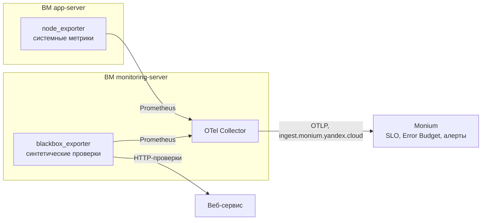

[Документация Yandex Cloud](../../index.md) > [Monium](../index.md) > Практические руководства > SLO-мониторинг веб-сервиса

# SLO-мониторинг веб-сервиса в Monium

SLO-мониторинг помогает оценивать надежность сервиса относительно целевого уровня, а не реагировать на отдельные сбои. В этом руководстве вы настроите SLO-мониторинг веб-сервиса в [Monium](https://monium.yandex.cloud). Веб-сервис может работать в Yandex Cloud, другом облаке или вашей инфраструктуре.

[SLO](index.md#basic-terms) (Service Level Objective) — целевой уровень надежности сервиса, например «99,9% запросов за 30 дней обработаны успешно». Вы задаете SLO исходя из требований к надежности сервиса. На основе SLO Monium рассчитывает [Error Budget](index.md#basic-terms) — допустимый объем ошибок за период. Команда отслеживает расход Error Budget и реагирует на снижение надежности заранее.

В руководстве используется мониторинг на основе [Prometheus](https://prometheus.io/)-экспортеров. Вы настроите синтетические проверки доступности и времени отклика, поставку метрик в Monium, два SLO и алерты по Error Budget. Руководство подойдет SRE-инженерам, DevOps-специалистам и разработчикам, которые отвечают за надежность веб-сервисов.

Для сбора и доставки метрик потребуются:

* [node_exporter](https://github.com/prometheus/node_exporter) — собирает системные метрики Linux. Они помогают диагностировать состояние сервера после SLO-алерта.
* [blackbox_exporter](https://github.com/prometheus/blackbox_exporter) — выполняет синтетические HTTP-, TCP- и ICMP-проверки. Метрики проверок используются для расчета [SLI](index.md#basic-terms) по доступности и времени отклика.
* [OpenTelemetry Collector](https://opentelemetry.io/docs/collector/) (OTel Collector) — собирает метрики с node_exporter и blackbox_exporter и отправляет их в Monium.

Схема руководства: node_exporter работает на сервере приложения `app-server`, а blackbox_exporter и OTel Collector — на отдельном сервере мониторинга `monitoring-server`. OTel Collector опрашивает оба экспортера по Prometheus и отправляет метрики в Monium. Такой подход не требует изменений в приложении и позволяет хранить сервисы в приватной сети.





В руководстве установка веб-сервиса не описана. Предполагается, что он уже развернут и доступен по сети. Утилита node_exporter устанавливается на сервере приложения, а blackbox_exporter и OTel Collector — на сервере мониторинга. Для простой схемы все компоненты можно установить вместе с веб-сервисом, тогда отдельный сервер мониторинга не потребуется.



## Порядок настройки {#setup-steps}

1. [Подготовьте облако к работе](#before-you-begin).
1. [Настройте сбор системных метрик в Linux](#node-exporter).
1. [Установите и настройте blackbox_exporter](#blackbox-setup).
1. [Настройте поставку метрик в Monium](#otel-setup).
1. [Настройте SLO на доступность сервиса](#slo-availability).
1. [Настройте алерты по Error Budget](#slo-alert).
1. [Настройте SLO на время отклика сервиса](#slo-latency).
1. [Используйте системные метрики для диагностики после алерта](#diagnostics).

Если созданные ресурсы вам больше не нужны, [удалите их](#clear-out).

## Подготовьте облако к работе {#before-you-begin}

Зарегистрируйтесь в Yandex Cloud и создайте [платежный аккаунт](../../billing/concepts/billing-account.md):
1. Перейдите в [консоль управления](https://console.yandex.cloud), затем войдите в Yandex Cloud или зарегистрируйтесь.
1. На странице **[Yandex Cloud Billing](https://center.yandex.cloud/billing/accounts)** убедитесь, что у вас подключен платежный аккаунт, и он находится в [статусе](../../billing/concepts/billing-account-statuses.md) `ACTIVE` или `TRIAL_ACTIVE`. Если платежного аккаунта нет, [создайте его](../../billing/quickstart/index.md) и [привяжите](../../billing/operations/pin-cloud.md) к нему облако.

Если у вас есть активный платежный аккаунт, вы можете создать или выбрать [каталог](../../resource-manager/concepts/resources-hierarchy.md#folder), в котором будет работать ваша инфраструктура, на [странице облака](https://console.yandex.cloud/cloud).

[Подробнее об облаках и каталогах](../../resource-manager/concepts/resources-hierarchy.md).

### Необходимые платные ресурсы {#paid-resources}

В стоимость поддержки инфраструктуры входят:

* плата за использование [Monium](../overview.md) ([тарифы Monium](../pricing.md));
* плата за постоянно запущенные [виртуальные машины](../../compute/concepts/vm.md), если веб-сервис или сервер мониторинга находятся в Yandex Cloud ([тарифы Yandex Compute Cloud](../../compute/pricing.md)).

### Подготовьте инфраструктуру {#deploy-infrastructure}

1. Подготовьте веб-сервис к SLO-мониторингу. Он может располагаться в любой инфраструктуре — в примерах подставьте его IP-адрес или доменное имя. В руководстве веб-сервис работает на ВМ `app-server` с Linux Ubuntu 20.04 и доступен по внутреннему IP-адресу `10.128.0.10`.
1. Создайте сервер мониторинга в [Compute Cloud](../../compute/operations/vm-create/create-linux-vm.md) или в другой инфраструктуре. В руководстве используется ВМ Compute Cloud с Linux Ubuntu 20.04 и с именем `monitoring-server`. На ней вы установите blackbox_exporter и OTel Collector — они проверяют веб-сервис и доставляют метрики в Monium.
1. Чтобы настроить доступ для отправки данных в Monium, создайте сервисный аккаунт и API-ключ. Это можно сделать интерфейсе [Monium](https://monium.yandex.cloud): слева выберите **Настройки** → **Настройки проекта** → **Настройка записи телеметрии** → **OpenTelemetry**.

   * Нажмите ссылку **Создайте сервисный аккаунт**. Выберите роль `monium.metrics.writer` или `monium.telemetry.writer`.
   * Нажмите ссылку **Создайте API-ключ**. Выберите область действия `yc.monium.metrics.write` или `yc.monium.telemetry.write`.

   Также сервисный аккаунт и API-ключ можно создать по инструкциям [Создание сервисного аккаунта](../../iam/operations/sa/create.md) и [Создать API-ключ](../../iam/operations/authentication/manage-api-keys.md#create-api-key).

1. При разворачивании веб-сервиса и сервера мониторинга в Yandex Cloud [создайте группу безопасности](../../vpc/operations/security-group-create.md) для сервера мониторинга и разрешите в ней:
   * исходящий TCP-трафик на порт `443` — для отправки метрик в Monium через [OTel Collector](../collector/opentelemetry.md);
   * исходящий трафик к эндпоинтам веб-сервиса — для проверок blackbox_exporter.


## Настройте сбор системных метрик в Linux {#node-exporter}

Для диагностики инцидентов нужны данные о состоянии сервера в момент срабатывания алерта. Установите на ВМ `app-server` [Prometheus node_exporter](https://github.com/prometheus/node_exporter) — он собирает метрики CPU, памяти и дисков. Затем настройте OTel Collector на их отправку в Monium.

### Установите Prometheus node_exporter {#install-node-exporter}

1. Создайте системного пользователя для node_exporter:

    ```bash
    sudo useradd --no-create-home --shell /bin/false node_exporter
    ```

1. Скачайте и распакуйте архив с node_exporter:

    ```bash
    wget https://github.com/prometheus/node_exporter/releases/download/v1.11.1/node_exporter-1.11.1.linux-amd64.tar.gz
    tar zxvf node_exporter-1.11.1.linux-amd64.tar.gz
    ```

1. Установите бинарный файл:

    ```bash
    sudo install -m 0755 ./node_exporter-1.11.1.linux-amd64/node_exporter /usr/local/bin/node_exporter
    sudo chown node_exporter:node_exporter /usr/local/bin/node_exporter
    ```

### Создайте systemd-сервис для node_exporter {#node-exporter-service}

1. Создайте файл `/etc/systemd/system/node_exporter.service`:

    ```ini
    [Unit]
    Description=Prometheus Node Exporter
    Wants=network-online.target
    After=network-online.target

    [Service]
    User=node_exporter
    Group=node_exporter
    Type=simple
    ExecStart=/usr/local/bin/node_exporter --web.listen-address=<приватный_IP-адрес_сервера>:9100
    Restart=on-failure

    [Install]
    WantedBy=multi-user.target
    ```

    Где `<приватный_IP-адрес_сервера>` — адрес сервера `app-server` в приватной сети. Если OTel Collector запущен на том же сервере, укажите `127.0.0.1`.
1. Запустите node_exporter:

    ```bash
    sudo systemctl daemon-reload
    sudo systemctl enable --now node_exporter
    ```

1. Убедитесь, что статус сервиса сменился на `active (running)`:

    ```bash
    sudo systemctl status node_exporter
    ```

    Результат:

    ```text
    ● node_exporter.service - Prometheus Node Exporter
         Loaded: loaded (/etc/systemd/system/node_exporter.service; enabled; preset: enabled)
         Active: active (running) <...>
    ```

1. Проверьте, что метрики доступны:

    ```bash
    curl http://<приватный_IP-адрес_сервера>:9100/metrics
    ```

Вместо node_exporter можно использовать Unified Agent на сервере приложения. Он собирает системные метрики и отправляет их напрямую в Monium, минуя OTel Collector. В этом случае конфигурация метрик будет храниться в разных местах. Подробнее в разделе [Поставка системных метрик Linux](../operations/unified-agent/linux_metrics.md).


## Установите и настройте blackbox_exporter {#blackbox-setup}

[Blackbox_exporter](https://github.com/prometheus/blackbox_exporter) на сервере мониторинга выполняет синтетические HTTP-, TCP- и ICMP-проверки и формирует метрики `probe_success` и `probe_duration_seconds`. Они понадобятся для SLO на доступность и время отклика.

### Установите blackbox_exporter {#install-blackbox}

1. Создайте системного пользователя:

    ```bash
    sudo useradd --no-create-home --shell /usr/sbin/nologin blackbox_exporter
    ```

1. Скачайте и распакуйте архив:

    ```bash
    wget -O /tmp/blackbox_exporter.tar.gz https://github.com/prometheus/blackbox_exporter/releases/download/v0.28.0/blackbox_exporter-0.28.0.linux-amd64.tar.gz
    tar -zxvf /tmp/blackbox_exporter.tar.gz
    sudo install -m 0755 ./blackbox_exporter-0.28.0.linux-amd64/blackbox_exporter /usr/local/bin/blackbox_exporter
    sudo chown blackbox_exporter:blackbox_exporter /usr/local/bin/blackbox_exporter
    ```

1. Создайте каталог для конфигурации:

    ```bash
    sudo mkdir -p /etc/blackbox_exporter
    ```

### Настройте конфигурацию blackbox_exporter {#blackbox-config}

1. Создайте файл `/etc/blackbox_exporter/blackbox.yml`:

    ```yaml
    modules:
      http_2xx:
        prober: http
        timeout: 5s
        http:
          method: GET
          valid_http_versions: ["HTTP/1.1", "HTTP/2.0"]
          preferred_ip_protocol: "ip4"
          follow_redirects: true
          fail_if_ssl: false
          fail_if_not_ssl: false
          tls_config:
            insecure_skip_verify: false

      http_2xx_tls:
        prober: http
        timeout: 5s
        http:
          method: GET
          follow_redirects: true
          fail_if_not_ssl: true
          preferred_ip_protocol: "ip4"

      tcp_connect:
        prober: tcp
        timeout: 3s

      icmp:
        prober: icmp
        timeout: 2s
    ```

    Где:

    * `http_2xx` — базовая проверка доступности HTTP-эндпоинта. Тип проверки — HTTP.
    * `http_2xx_tls` — проверка с обязательным TLS, параметр `fail_if_not_ssl: true`. Тип проверки — HTTP.
    * `tcp_connect` — проверка доступности TCP-порта. Тип проверки — TCP.
    * `icmp` — проверка сетевой достижимости хоста. Тип проверки — ICMP.

1. Установите права на конфигурационный файл:

    ```bash
    sudo chown -R blackbox_exporter:blackbox_exporter /etc/blackbox_exporter
    ```

### Создайте systemd-сервис для blackbox_exporter {#blackbox-service}

1. Создайте файл `/etc/systemd/system/blackbox_exporter.service`:

    ```ini
    [Unit]
    Description=Prometheus Blackbox Exporter
    Wants=network-online.target
    After=network-online.target

    [Service]
    User=blackbox_exporter
    Group=blackbox_exporter
    Type=simple
    ExecStart=/usr/local/bin/blackbox_exporter \
      --config.file=/etc/blackbox_exporter/blackbox.yml \
      --web.listen-address=127.0.0.1:9115
    Restart=on-failure

    [Install]
    WantedBy=multi-user.target
    ```

1. Запустите blackbox_exporter и добавьте его в автозагрузку:

    ```bash
    sudo systemctl daemon-reload
    sudo systemctl enable --now blackbox_exporter
    ```

1. Проверьте, что статус сервиса сменился на `active (running)`:

    ```bash
    sudo systemctl status blackbox_exporter
    ```

    Результат:

    ```text
    ● blackbox_exporter.service - Prometheus Blackbox Exporter
         Loaded: loaded (/etc/systemd/system/blackbox_exporter.service; enabled; preset: enabled)
         Active: active (running) <...>
    ```

### Проверьте работу blackbox_exporter {#check-blackbox}

Выполните тестовые проверки:

```bash
curl "http://127.0.0.1:9115/probe?target=http://10.128.0.10&module=http_2xx" | grep probe_success
curl "http://127.0.0.1:9115/probe?target=10.128.0.10:80&module=tcp_connect" | grep probe_success
curl "http://127.0.0.1:9115/probe?target=10.128.0.10&module=icmp" | grep probe_success
```

Где `10.128.0.10` — IP-адрес вашего веб-сервиса.

Результат:

```text
probe_success 1
```


## Настройте поставку метрик в Monium {#otel-setup}

OTel Collector отправляет в Monium метрики, собранные blackbox_exporter и node_exporter.

### Установите OTel Collector {#install-otel}

1. [Установите OTel Collector](https://opentelemetry.io/docs/collector/install/binary/linux/):

    ```bash
    sudo apt-get update
    sudo apt-get -y install wget
    wget https://github.com/open-telemetry/opentelemetry-collector-releases/releases/download/v0.156.0/otelcol_0.156.0_linux_amd64.deb
    sudo dpkg -i otelcol_0.156.0_linux_amd64.deb
    ```

1. Отредактируйте файл `/etc/otelcol/otelcol.conf`:

    ```conf
    MONIUM_PROJECT=folder__<идентификатор_каталога>
    MONIUM_API_KEY=<API-ключ>
    OTELCOL_OPTIONS=--config=/etc/otelcol/config.yaml
    ```

    Где:
    * `MONIUM_PROJECT` — имя проекта Monium, например `folder__b1gg5f45su0k6rjr39s1`.
    * `MONIUM_API_KEY` — API-ключ сервисного аккаунта с ролью `monium.telemetry.writer`.

### Настройте конфигурацию OTel Collector {#otel-config}

Создайте файл `/etc/otelcol/config.yaml`:

```yaml
receivers:
  prometheus:
    config:
      scrape_configs:
        - job_name: blackbox_http_10_128_0_10
          scrape_interval: 30s
          metrics_path: /probe
          params:
            module: [http_2xx]
          static_configs:
            - targets:
                - http://10.128.0.10
              labels:
                probe_type: http
                target_name: lemp_http
          relabel_configs:
            - source_labels: [__address__]
              target_label: __param_target
            - source_labels: [__param_target]
              target_label: instance
            - target_label: __address__
              replacement: 127.0.0.1:9115

        - job_name: blackbox_tcp_10_128_0_10_80
          scrape_interval: 30s
          metrics_path: /probe
          params:
            module: [tcp_connect]
          static_configs:
            - targets:
                - 10.128.0.10:80
              labels:
                probe_type: tcp
                target_name: lemp_tcp_80
          relabel_configs:
            - source_labels: [__address__]
              target_label: __param_target
            - source_labels: [__param_target]
              target_label: instance
            - target_label: __address__
              replacement: 127.0.0.1:9115

        - job_name: blackbox_icmp_10_128_0_10
          scrape_interval: 30s
          metrics_path: /probe
          params:
            module: [icmp]
          static_configs:
            - targets:
                - 10.128.0.10
              labels:
                probe_type: icmp
                target_name: lemp_icmp
          relabel_configs:
            - source_labels: [__address__]
              target_label: __param_target
            - source_labels: [__param_target]
              target_label: instance
            - target_label: __address__
              replacement: 127.0.0.1:9115

        - job_name: node_exporter_lemp
          scrape_interval: 30s
          static_configs:
            - targets:
                - 10.128.0.10:9100
              labels:
                exporter: node_exporter
                target_name: lemp_node
                host: lemp

processors:
  batch:

exporters:
  otlp/monium:
    endpoint: ingest.monium.yandex.cloud:443
    compression: zstd
    headers:
      Authorization: "Api-Key ${env:MONIUM_API_KEY}"
      x-monium-project: "${env:MONIUM_PROJECT}"
      x-monium-cluster: production
      x-monium-service: lemp

service:
  telemetry:
    logs:
      level: info

  pipelines:
    metrics:
      receivers: [prometheus]
      processors: [batch]
      exporters: [otlp/monium]
```

Где:

* `10.128.0.10` — IP-адрес вашего сервера приложения. Замените его на свой.
* `relabel_configs` — правила перезаписи меток, чтобы Prometheus опрашивал blackbox_exporter, а не саму цель напрямую.
* `x-monium-cluster` и `x-monium-service` — метки `cluster` и `service`, которые Monium присваивает всем метрикам из этого OTel Collector. По ним вы будете находить метрики и строить SLO. В примере используются значения `production` и `lemp` (веб-стек Linux, Nginx, MySQL, PHP) — замените их на свои.



Метка `probe_type` принимает значения `http`, `tcp` и `icmp`. По ней удобно фильтровать метрики в Monium и строить отдельные SLO для каждого типа проверки.



### Запустите OTel Collector {#start-otel}

1. Отредактируйте файл `/etc/systemd/system/multi-user.target.wants/otelcol.service`:

    ```ini
    [Unit]
    Description=OpenTelemetry Collector
    After=network.target

    [Service]
    EnvironmentFile=/etc/otelcol/otelcol.conf
    ExecStart=/usr/bin/otelcol $OTELCOL_OPTIONS
    ExecReload=/bin/kill -HUP $MAINPID
    KillMode=mixed
    Restart=on-failure
    Type=simple
    User=otel
    Group=otel

    [Install]
    WantedBy=multi-user.target
    ```

1. Запустите OTel Collector:

    ```bash
    sudo systemctl daemon-reload
    sudo systemctl enable --now otelcol
    sudo systemctl status otelcol
    ```

1. Убедитесь, что метрики поступают в Monium:

    * Откройте [Monium](https://monium.yandex.cloud).
    * В левом меню раскройте **Обзор** и выберите **Метрики**.
    * В поиске укажите `service = "lemp"` — значение метки `service` из заголовка `x-monium-service` в конфигурации OTel Collector. Если вы задали другое значение, укажите его.

    В списке появятся метрики `probe_success`, `probe_duration_seconds` и метрики node_exporter.



Учитывайте, что данные в Monium появляются не сразу, а с задержкой, поскольку Otel Collector начинает отправку данных через 60 секунд.




## Настройте SLO на доступность сервиса {#slo-availability}

blackbox_exporter возвращает бинарный результат проверки: `probe_success` равно `1` при успехе и `0` при неудаче. На основе этой метрики создайте SLO на доступность:

1. На главной странице [Monium](https://monium.yandex.cloud) слева раскройте раздел  **Алерты и SLO**.
1. Выберите  **SLO**.
1. Нажмите **Создать**.
1. Укажите параметры SLO:

    * **Название** — например, `SLO HTTP Availability 30d`.
    * **Окно вычисления** — `30d`.
    * **Задержка вычисления** — `2m`. Значение должно быть больше интервала сбора метрик: при `scrape_interval: 30s` значение `2m` достаточно.
    * **SLO** — `99.9%`.
    * **Метод расчета** — `Good Events / Total Events`.

1. В блоке **Good Events** укажите запрос:

    ```js
    series_sum(
        {project = "folder__<идентификатор_каталога>", cluster = "production", service = "lemp", probe_type = "http", name = "probe_success"}
      )
    ```

1. В блоке **Total Events** укажите запрос:

    ```js
    series_count(
        {project = "folder__<идентификатор_каталога>", cluster = "production", service = "lemp", probe_type = "http", name = "probe_success"}
      )
    ```

1. Нажмите **Создать**.

Error Budget рассчитывается автоматически сразу после создания SLO.


## Настройте алерты по Error Budget {#slo-alert}

Создайте алерты, чтобы отслеживать расход Error Budget:

* По остатку Error Budget — показывает, что надежность сервиса постепенно снижается.
* По скорости расхода Error Budget — показывает резкий рост ошибок.

### Создайте алерт по остатку Error Budget {#alert-budget-remaining}

1. На главной странице [Monium](https://monium.yandex.cloud) слева раскройте раздел  **Алерты и SLO**.
1. Выберите  **Алерты**.
1. Нажмите **Создать алерт** → **SLO**.
1. Укажите название и уровень алерта, например `Critical` — остаток Error Budget сигнализирует о постепенной деградации.
1. Выберите SLO, созданный на предыдущем шаге.
1. В поле **Метод расчета** выберите `Остаток Error Budget`.
1. Укажите условия срабатывания:

    * **Warning** — `50%`.
    * **Alarm** — `20%`.

1. Нажмите **Создать**.

### Создайте алерт по скорости расхода Error Budget {#alert-burn-rate}

1. На главной странице [Monium](https://monium.yandex.cloud) слева раскройте раздел  **Алерты и SLO**.
1. Выберите  **Алерты**.
1. Нажмите **Создать алерт** → **SLO**.
1. Укажите название и уровень алерта, например `Disaster` — высокая скорость расхода Error Budget сигнализирует о внезапном инциденте.
1. Выберите SLO, созданный на предыдущем шаге.
1. В поле **Метод расчета** выберите `Скорость расхода Error Budget`.
1. Укажите условия срабатывания:

    * **Warning** — `1%`.
    * **Alarm** — `2%`.
    * **Окно вычисления** — `1h`.

1. Нажмите **Создать**.


## Настройте SLO на время отклика сервиса {#slo-latency}

blackbox_exporter измеряет время синтетических проверок через метрику `probe_duration_seconds`. На ее основе создайте SLO: 99% HTTP-проверок должны завершаться быстрее чем за 300 мс.



Если нужен SLO формата «p95 < 300 мс», используйте метрики приложения, ingress-контроллера или балансировщика нагрузки. blackbox_exporter проверяет сервис снаружи и показывает деградации DNS, TLS, сети и балансировщиков.



Метрика `probe_duration_seconds` показывает суммарное время проверки, но не указывает, где именно теряется время. blackbox_exporter разбивает проверку на фазы:

| **Метрика**                            | **Что измеряет**               |
|----------------------------------------|--------------------------------|
| `probe_dns_lookup_time_seconds`        | Время разрешения DNS           |
| `probe_tcp_connect_duration_seconds`   | Время установки TCP-соединения |
| `probe_tls_handshake_duration_seconds` | Время TLS-рукопожатия          |
| `probe_http_duration_seconds`          | Время фаз HTTP-запроса         |
| `probe_duration_seconds`               | Суммарное время проверки       |

Для визуализации добавьте метрики по фазам в дашборд в виде stacked-графика. SLO и алерты стройте по суммарной метрике `probe_duration_seconds`. При деградации задержки графики покажут, в какой фазе появилась проблема: DNS, TLS или сетевой маршрут.

### Создайте SLO на время отклика {#create-slo-latency}

1. На главной странице [Monium](https://monium.yandex.cloud) слева раскройте раздел  **Алерты и SLO**.
1. Выберите  **SLO**.
1. Нажмите **Создать**.
1. Укажите параметры SLO:

    * **Название** — например, `SLO LATENCY HTTP 30d`.
    * **Окно вычисления** — `30d`.
    * **SLO** — `99%`.
    * **Метод расчета** — `Good Events / Total Events`.

1. В блоке **Good Events** укажите запрос:

    ```js
    series_sum(
      heaviside(
        ({project="folder__<идентификатор_каталога>", cluster="production", service="lemp", probe_type="http", name="probe_duration_seconds"} * -1) + 0.3
      )
    )
    ```

    Где:

    * `0.3` — порог задержки в секундах, 300 мс.
    * `heaviside()` — функция, которая отбирает пороговые проверки. Возвращает `1`, если задержка меньше 300 мс, и `0`, если больше.

    Проверки с задержкой ровно 300 мс учитываются как половина события, что на практике не влияет на расчет SLI.

1. В блоке **Total Events** укажите запрос:

    ```js
    series_sum(
      {project="folder__<идентификатор_каталога>", cluster="production", service="lemp", probe_type="http", name="probe_duration_seconds"} * 0 + 1
    )
    ```

1. Нажмите **Создать**.


## Используйте системные метрики для диагностики после алерта {#diagnostics}

Когда SLO-алерт сработал, нужно понять, что именно сломалось на сервере. Системные метрики node_exporter помогают быстро найти причину:

| **Категория**            | **Метрики**                                                                                                 | **На что смотреть**                         |
|----------------------|---------------------------------------------------------------------------------------------------------|------------------------------------------|
| **CPU**              | `node_cpu_seconds_total` в разрезе режимов `iowait`, `idle`, `steal`                                    | `steal` особенно важен на виртуализации  |
| **Память**           | `node_memory_MemAvailable_bytes`                                                                        | Доступная для использования память       |
| **Диск**             | `node_disk_read_time_seconds_total`, `node_disk_write_time_seconds_total`, `node_disk_io_time_weighted_seconds_total` | Задержки чтения/записи, очередь I/O |
| **Файловые системы** | `node_filesystem_free_bytes`, `node_filesystem_files_free`                                              | Свободное место и inodes                 |
| **Сеть**             | `node_network_receive_bytes_total`, `node_network_transmit_bytes_total`, `node_network_receive_drop_total` | Трафик и дропы по интерфейсам         |

Если SLO-алерт сработал по `probe_duration_seconds`, сначала проверьте сетевые фазы: `probe_dns_lookup_time_seconds` и `probe_tls_handshake_duration_seconds`. Затем перейдите к серверным метрикам: `node_disk_io_time_weighted_seconds_total` и `node_cpu_seconds_total{mode="iowait"}`.


## Удалите созданные ресурсы {#clear-out}

Чтобы перестать платить за созданные ресурсы:
1. [Удалите созданные алерты](../operations/alert/delete-alert.md) в Monium.
1. [Удалите виртуальные машины](../../compute/operations/vm-control/vm-delete.md) Compute Cloud.
1. [Удалите сервисный аккаунт](../../iam/operations/sa/delete.md) Identity and Access Management.
1. [Удалите группу безопасности](../../vpc/operations/security-group-delete.md) Virtual Private Cloud.

Если вы зарезервировали публичные статические IP-адреса, [удалите их](../../vpc/operations/address-delete.md).