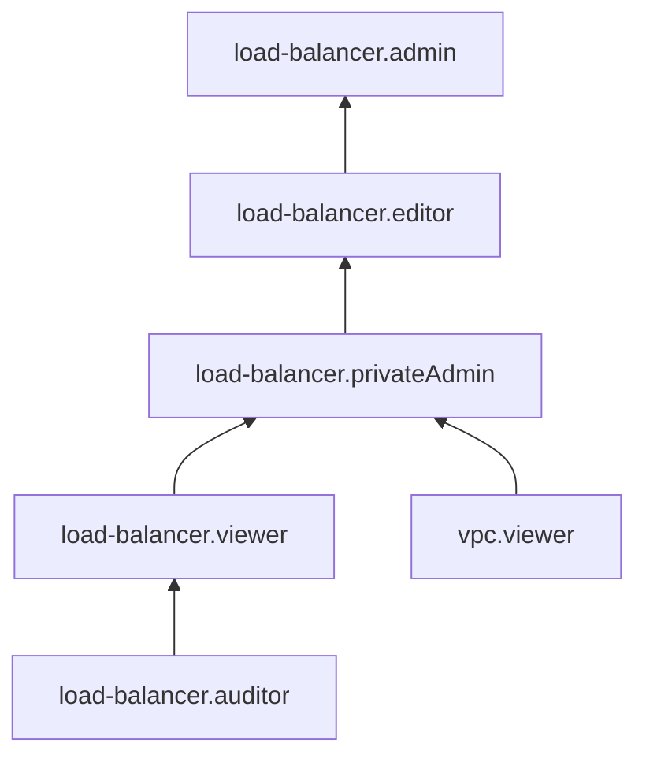

# Управление доступом в Network Load Balancer

В этом разделе вы узнаете:
* [на какие ресурсы можно назначить роль](#resources);
* [какие роли действуют в сервисе](#roles-list);
* [какие роли необходимы](#choosing-roles) для того или иного действия.

## Об управлении доступом {#about-access-control}

Все операции в Yandex Cloud проверяются в сервисе [Yandex Identity and Access Management](../../iam/index.md). Если у субъекта нет необходимых разрешений, сервис вернет ошибку.

Чтобы выдать разрешения к ресурсу, [назначьте роли](../../iam/operations/roles/grant.md) на этот ресурс субъекту, который будет выполнять операции. Роли можно назначить [аккаунту на Яндексе](../../iam/concepts/users/accounts.md#passport), [сервисному аккаунту](../../iam/concepts/users/service-accounts.md), [локальному пользователю](../../iam/concepts/users/accounts.md#local), [федеративному пользователю](../../iam/concepts/federations.md), [группе пользователей](../../organization/operations/manage-groups.md), [системной группе](../../iam/concepts/access-control/system-group.md) или [публичной группе](../../iam/concepts/access-control/public-group.md). Подробнее читайте в разделе [Как устроено управление доступом в Yandex Cloud](../../iam/concepts/access-control/index.md).

Назначать роли на ресурс могут пользователи, у которых на этот ресурс есть хотя бы одна из ролей:

* `admin`;
* `resource-manager.admin`;
* `organization-manager.admin`;
* `resource-manager.clouds.owner`;
* `organization-manager.organizations.owner`.

## На какие ресурсы можно назначить роль {#resources}

Роль можно назначить на [организацию](../../organization/concepts/organization.md), [облако](../../resource-manager/concepts/resources-hierarchy.md#cloud) и [каталог](../../resource-manager/concepts/resources-hierarchy.md#folder). Роли, назначенные на организацию, облако или каталог, действуют и на вложенные ресурсы.

## Какие роли действуют в сервисе {#roles-list}

На диаграмме показано, какие роли есть в сервисе и как они наследуют разрешения друг друга. Например, в `editor` входят все разрешения `viewer`. После диаграммы дано описание каждой роли.

### Сервисные роли {#service-roles}

#### load-balancer.auditor {#load-balancer-auditor}

Роль `load-balancer.auditor` позволяет просматривать список целевых групп и сетевых балансировщиков, а также информацию о них и о квотах сервиса.

Пользователи с этой ролью могут:
* просматривать список [целевых групп](../concepts/target-resources.md) и информацию о них;
* просматривать список [сетевых балансировщиков](../concepts/index.md) и информацию о них;
* просматривать список операций с ресурсами сервиса Network Load Balancer;
* просматривать информацию об [облаке](../../resource-manager/concepts/resources-hierarchy.md#cloud) и [каталоге](../../resource-manager/concepts/resources-hierarchy.md#folder);
* просматривать информацию о [квотах](../concepts/limits.md#load-balancer-quotas) сервиса Network Load Balancer.

#### load-balancer.viewer {#load-balancer-viewer}

Роль `load-balancer.viewer` позволяет просматривать список целевых групп и сетевых балансировщиков, информацию о них и список операций с ними, а также информацию о каталоге, облаке и квотах сервиса.

Пользователи с этой ролью могут:
* просматривать список [целевых групп](../concepts/target-resources.md) и информацию о них;
* просматривать список [сетевых балансировщиков](../concepts/index.md) и информацию о них;
* просматривать список операций с ресурсами сервиса Network Load Balancer;
* просматривать информацию об [облаке](../../resource-manager/concepts/resources-hierarchy.md#cloud) и [каталоге](../../resource-manager/concepts/resources-hierarchy.md#folder);
* просматривать информацию о [квотах](../concepts/limits.md#load-balancer-quotas) сервиса Network Load Balancer.

Включает разрешения, предоставляемые ролью `load-balancer.auditor`.

#### load-balancer.privateAdmin {#load-balancer-private-admin}

Роль `load-balancer.privateAdmin` позволяет управлять внутренними сетевыми балансировщиками нагрузки и целевыми группами, а также просматривать информацию о них и об облачных сетях, подсетях, таблицах маршрутизации, шлюзах, группах безопасности и IP-адресах.

Пользователи с этой ролью могут:
* просматривать список [сетевых балансировщиков](../concepts/index.md) и информацию о них, а также создавать внутренние сетевые балансировщики (в т.ч. с UDP-обработчиком), изменять, удалять, запускать и останавливать их;
* просматривать список [целевых групп](../concepts/target-resources.md) и информацию о них, а также создавать, изменять, удалять и использовать целевые группы;
* просматривать список [облачных сетей](../../vpc/concepts/network.md#network) и информацию о них;
* просматривать список [подсетей](../../vpc/concepts/network.md#subnet) и информацию о них, а также использовать подсети;
* просматривать список [адресов облачных ресурсов](../../vpc/concepts/address.md) и информацию о них;
* просматривать список [таблиц маршрутизации](../../vpc/concepts/routing.md#rt-vpc) и информацию о них;
* просматривать список [групп безопасности](../../vpc/concepts/security-groups.md) и информацию о них;
* просматривать информацию о [NAT-шлюзах](../../vpc/concepts/gateways.md);
* просматривать информацию об использованных IP-адресах в подсетях, а также создавать [внутренние адреса](../../vpc/concepts/address.md#internal-addresses);
* просматривать информацию об операциях с ресурсами сервисов Virtual Private Cloud и Compute Cloud;
* просматривать список операций с ресурсами сервиса Network Load Balancer;
* просматривать информацию об [облаке](../../resource-manager/concepts/resources-hierarchy.md#cloud) и [каталоге](../../resource-manager/concepts/resources-hierarchy.md#folder);
* просматривать информацию о квотах сервисов [Network Load Balancer](../concepts/limits.md#load-balancer-quotas) и [Virtual Private Cloud](../../vpc/concepts/limits.md#vpc-quotas).

Включает разрешения, предоставляемые ролями `load-balancer.viewer` и `vpc.viewer`.

#### load-balancer.editor {#load-balancer-editor}

Роль `load-balancer.editor` позволяет управлять внутренними и внешними сетевыми балансировщиками нагрузки и целевыми группами, а также просматривать информацию о них и об облачных сетях, подсетях, таблицах маршрутизации, шлюзах, группах безопасности и IP-адресах. Роль не позволяет создавать публичные IP-адреса.

Пользователи с этой ролью могут:
* просматривать список [сетевых балансировщиков](../concepts/index.md) и информацию о них;
* создавать внутренние и внешние сетевые балансировщики, а также сетевые балансировщики с UDP-обработчиками, изменять, удалять, запускать и останавливать их;
* просматривать список [целевых групп](../concepts/target-resources.md) и информацию о них, а также создавать, изменять, удалять и использовать целевые группы;
* просматривать список [облачных сетей](../../vpc/concepts/network.md#network) и информацию о них, а также настраивать внешний доступ к облачным сетям;
* просматривать список [подсетей](../../vpc/concepts/network.md#subnet) и информацию о них, а также использовать подсети;
* просматривать список [адресов облачных ресурсов](../../vpc/concepts/address.md) и информацию о них;
* просматривать список [таблиц маршрутизации](../../vpc/concepts/routing.md#rt-vpc) и информацию о них;
* просматривать список [групп безопасности](../../vpc/concepts/security-groups.md) и информацию о них;
* просматривать информацию о [NAT-шлюзах](../../vpc/concepts/gateways.md);
* просматривать информацию об использованных IP-адресах, а также создавать [внутренние](../../vpc/concepts/address.md#internal-addresses) адреса и использовать их;
* просматривать информацию об операциях с ресурсами сервисов Virtual Private Cloud и Compute Cloud;
* просматривать список операций с ресурсами сервиса Network Load Balancer;
* просматривать информацию об [облаке](../../resource-manager/concepts/resources-hierarchy.md#cloud) и [каталоге](../../resource-manager/concepts/resources-hierarchy.md#folder);
* просматривать информацию о квотах сервисов [Network Load Balancer](../concepts/limits.md#load-balancer-quotas) и [Virtual Private Cloud](../../vpc/concepts/limits.md#vpc-quotas).

Включает разрешения, предоставляемые ролью `load-balancer.privateAdmin`.

#### load-balancer.admin {#load-balancer-admin}

Роль `load-balancer.admin` позволяет управлять внутренними и внешними сетевыми балансировщиками нагрузки и целевыми группами, а также просматривать информацию о них и об облачных сетях, подсетях, таблицах маршрутизации, шлюзах, группах безопасности и IP-адресах.

Пользователи с этой ролью могут:
* просматривать список [сетевых балансировщиков](../concepts/index.md) и информацию о них;
* создавать внутренние и внешние сетевые балансировщики, а также сетевые балансировщики с UDP-обработчиками, изменять, удалять, запускать и останавливать их;
* просматривать список [целевых групп](../concepts/target-resources.md) и информацию о них, а также создавать, изменять, удалять и использовать целевые группы;
* просматривать список [облачных сетей](../../vpc/concepts/network.md#network) и информацию о них, а также настраивать внешний доступ к облачным сетям;
* просматривать список [подсетей](../../vpc/concepts/network.md#subnet) и информацию о них, а также использовать подсети;
* просматривать список [адресов облачных ресурсов](../../vpc/concepts/address.md) и информацию о них;
* просматривать список [таблиц маршрутизации](../../vpc/concepts/routing.md#rt-vpc) и информацию о них;
* просматривать список [групп безопасности](../../vpc/concepts/security-groups.md) и информацию о них;
* просматривать информацию о [NAT-шлюзах](../../vpc/concepts/gateways.md);
* просматривать информацию об использованных IP-адресах, а также создавать [внутренние](../../vpc/concepts/address.md#internal-addresses) и [публичные](../../vpc/concepts/address.md#public-addresses) адреса и использовать их;
* просматривать информацию об операциях с ресурсами сервисов Virtual Private Cloud и Compute Cloud;
* просматривать список операций с ресурсами сервиса Network Load Balancer;
* просматривать информацию об [облаке](../../resource-manager/concepts/resources-hierarchy.md#cloud) и [каталоге](../../resource-manager/concepts/resources-hierarchy.md#folder);
* просматривать информацию о квотах сервисов [Network Load Balancer](../concepts/limits.md#load-balancer-quotas) и [Virtual Private Cloud](../../vpc/concepts/limits.md#vpc-quotas).

Включает разрешения, предоставляемые ролью `load-balancer.editor`.

### Примитивные роли {#primitive-roles}

Примитивные роли позволяют пользователям совершать действия во [всех сервисах](../../overview/concepts/services.md) Yandex Cloud.

#### auditor {#auditor}

Роль `auditor` предоставляет разрешения на чтение конфигурации и метаданных любых ресурсов Yandex Cloud без возможности доступа к данным.

Например, пользователи с этой ролью могут:
* просматривать информацию о [ресурсе](../../resource-manager/concepts/resources-hierarchy.md);
* просматривать метаданные ресурса;
* просматривать список операций с ресурсом.

Роль `auditor` — наиболее безопасная роль, исключающая доступ к данным [сервисов](../../overview/concepts/services.md). Роль подходит для пользователей, которым необходим минимальный уровень доступа к ресурсам Yandex Cloud.

#### viewer {#viewer}

Роль `viewer` предоставляет разрешения на чтение информации о любых [ресурсах](../../resource-manager/concepts/resources-hierarchy.md) Yandex Cloud.

Включает разрешения, предоставляемые ролью `auditor`.

В отличие от роли `auditor`, роль `viewer` предоставляет доступ к данным [сервисов](../../overview/concepts/services.md) в режиме чтения.

#### editor {#editor}

Роль `editor` предоставляет разрешения на управление любыми [ресурсами](../../resource-manager/concepts/resources-hierarchy.md) Yandex Cloud, кроме назначения ролей другим пользователям, передачи прав владения [организацией](../../organization/concepts/organization.md) и ее удаления, а также удаления [ключей шифрования](../../kms/concepts/index.md) Key Management Service.

Например, пользователи с этой ролью могут создавать, изменять и удалять ресурсы.

Включает разрешения, предоставляемые ролью `viewer`.

#### admin {#admin}

Роль `admin` позволяет назначать любые роли, кроме `resource-manager.clouds.owner` и `organization-manager.organizations.owner`, а также предоставляет разрешения на управление любыми [ресурсами](../../resource-manager/concepts/resources-hierarchy.md) Yandex Cloud, кроме передачи прав владения [организацией](../../organization/concepts/organization.md) и ее удаления.

Прежде чем назначить роль `admin` на организацию, [облако](../../resource-manager/concepts/resources-hierarchy.md#cloud) или [платежный аккаунт](../../billing/concepts/billing-account.md), ознакомьтесь с информацией о защите [привилегированных аккаунтов](../../security/standard/all.md#privileged-users).

Включает разрешения, предоставляемые ролью `editor`.

Вместо примитивных ролей мы рекомендуем использовать роли сервисов. Такой подход позволит более гранулярно управлять доступом и обеспечить соблюдение [принципа минимальных привилегий](../../security/standard/all.md#min-privileges).

Подробнее о примитивных ролях см. в [справочнике ролей Yandex Cloud](../../iam/roles-reference.md#primitive-roles).

## Какие роли мне необходимы {#choosing-roles}

В таблице ниже перечислено, какие роли нужны для выполнения указанного действия. Вы всегда можете назначить роль, которая дает более широкие разрешения, нежели указанная. Например, назначить `editor` вместо `viewer`.

Для любых операций с сетевым балансировщиком, имеющим публичный IP-адрес, необходима роль `load-balancer.admin`. В сетях, где расположены целевые группы, допускается иметь вместо нее роль `vpc.publicAdmin`. Для операций над внутренним сетевым балансировщиком необходима роль `load-balancer.privateAdmin`, а для операций над его целевыми группами — `load-balancer.privateAdmin` или `compute.admin`.

Для операций над целевыми группами, расположенных в подсетях, где указанные административные роли отсутствуют, потребуется роль `vpc.user` на эти подсети.

Действие | Методы | Необходимые роли
----- | ----- | -----
**Просмотр информации** | |
Просмотр информации о любом ресурсе | `get`, `list`, `listOperations` | `viewer` на этот ресурс
**Управление сетевыми балансировщиками** | |
[Создание](../operations/load-balancer-create.md) и изменение балансировщиков в каталоге | `create` | `load-balancer.privateAdmin` / `load-balancer.admin` или `editor` на каталог и (в случае публичного балансировщика) сети, в которых расположены целевые группы
[Удаление балансировщиков](../operations/load-balancer-delete.md) | `update`, `delete` | `load-balancer.privateAdmin` / `load-balancer.admin` или `editor` на балансировщик
[Присоединение целевых групп](../operations/target-group-attach.md) | `attachTargetGroup`| `load-balancer.privateAdmin` / `load-balancer.admin` или `editor` на каталог и (в случае публичного балансировщика) сети, в которых расположены целевые группы
[Отсоединение целевых групп](../operations/target-group-detach.md) | `detachTargetGroup` | `load-balancer.privateAdmin` / `load-balancer.admin` или `editor` на балансировщик
[Получение состояний целевых групп](../operations/check-resource-health.md) | `getTargetStates` | `load-balancer.viewer` или `viewer` на балансировщик и на указанные целевые группы
[Добавление](../operations/listener-add.md), [удаление](../operations/listener-remove.md) обработчиков | `addListener`, `removeListener` | `load-balancer.privateAdmin` / `load-balancer.admin` или `editor` на балансировщик
[Остановка и запуск](../operations/load-balancer-start-and-stop.md) балансировщика | `stop`, `start` | `load-balancer.privateAdmin` / `load-balancer.admin` или `editor` на балансировщик
**Управление целевыми группами** | |
[Создание](../operations/target-group-create.md) и изменений целевых групп в каталоге | `create` | `load-balancer.privateAdmin` / `load-balancer.admin` или `editor` на каталог и на подсети, в которых расположены целевые группы
[Удаление целевых групп](../operations/target-group-delete.md) | `update`, `delete` | `load-balancer.privateAdmin` / `load-balancer.admin` или `editor` на целевую группу и балансировщик
Добавление ресурсов в целевой группе | `addTargets` | `load-balancer.privateAdmin` / `load-balancer.admin` или `editor` на целевую группу, балансировщик и на подсети, в которых расположены целевые группы
Удаление ресурсов в целевой группе | `removeTargets` | `load-balancer.privateAdmin` / `load-balancer.admin` или `editor` на целевую группу
**Управление доступом к ресурсам** | |
[Назначение роли](../../iam/operations/roles/grant.md), [отзыв роли](../../iam/operations/roles/revoke.md) и просмотр назначенных ролей на ресурс | `setAccessBindings`, `updateAccessBindings`, `listAccessBindings` | `admin` на этот ресурс

#### Что дальше {what-is-next}

* [Как назначить роль](../../iam/operations/roles/grant.md).
* [Как отозвать роль](../../iam/operations/roles/revoke.md).
* [Подробнее об управлении доступом в Yandex Cloud](../../iam/concepts/access-control/index.md).
* [Подробнее о наследовании ролей](../../resource-manager/concepts/resources-hierarchy.md#access-rights-inheritance).