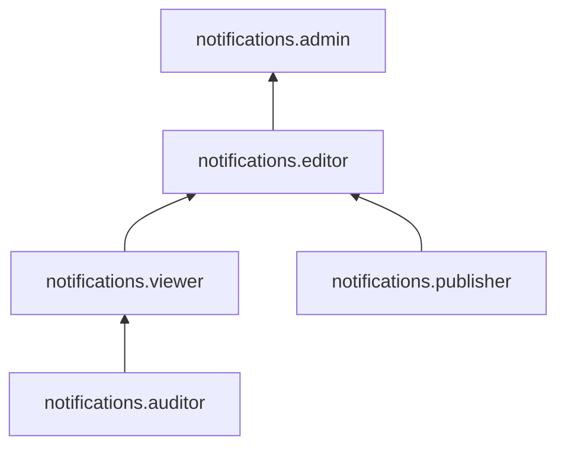

[Документация Yandex Cloud](../../index.md) > [Yandex Cloud Notification Service](../index.md) > Управление доступом

# Управление доступом в Yandex Cloud Notification Service

Пользователь Yandex Cloud может выполнять только те операции над ресурсами, которые разрешены назначенными ему [ролями](../../iam/concepts/access-control/roles.md). Пока у пользователя нет никаких ролей, почти все операции ему запрещены.

Чтобы разрешить доступ к ресурсам сервиса Yandex Cloud Notification Service, назначьте аккаунту на Яндексе, [сервисному аккаунту](../../iam/concepts/users/service-accounts.md), [федеративным](../../iam/concepts/users/accounts.md#saml-federation) или [локальным](../../iam/concepts/users/accounts.md#local) пользователям, [группе пользователей](../../organization/operations/manage-groups.md), [системной группе](../../iam/concepts/access-control/system-group.md) или [публичной группе](../../iam/concepts/access-control/public-group.md) нужные роли из приведенного ниже списка. На данный момент роль может быть назначена только на родительский ресурс (каталог или облако), роли которого наследуются вложенными ресурсами.

Подробнее о наследовании ролей читайте в разделе [Наследование прав доступа](../../resource-manager/concepts/resources-hierarchy.md#access-rights-inheritance) документации сервиса Resource Manager.

## Какие роли действуют в сервисе {#roles-list}

Для управления правами доступа в Cloud Notification Service можно использовать как сервисные, так и примитивные роли.

### Сервисные роли {#service-roles}

#### notifications.auditor {#notifications-auditor}

Роль `notifications.auditor` позволяет просматривать метаданные всех [каналов уведомлений](../concepts/index.md#channels), метаданные [топиков](../concepts/topics.md), а также информацию о [квотах](../concepts/limits.md) сервиса Cloud Notification Service.

#### notifications.viewer {#notifications-viewer}

Роль `notifications.viewer` позволяет просматривать информацию о топиках и каналах уведомлений, а также о квотах сервиса Cloud Notification Service.

Пользователи с этой ролью могут:
* просматривать информацию о [топиках](../concepts/topics.md) и подписках в них;
* просматривать информацию о каналах [мобильных Push-уведомлений](../concepts/push.md) и их [эндпоинтах](../concepts/push.md#mobile-endpoints);
* просматривать информацию о каналах [Push-уведомлений в браузере](../concepts/browser.md) и их [эндпоинтах](../concepts/browser.md#create-endpoint);
* просматривать информацию о каналах [SMS-уведомлений](../concepts/sms.md), [шаблонах](../concepts/sms.md#templates) SMS и [тестовых](../concepts/sms.md#sandbox) телефонных номерах;
* просматривать информацию о [квотах](../concepts/limits.md) сервиса Cloud Notification Service.

Включает разрешения, предоставляемые ролью `notifications.auditor`.

#### notifications.publisher {#notifications-publisher}

Роль `notifications.publisher` позволяет отправлять уведомления во все [каналы](../concepts/index.md#channels) и [топики](../concepts/topics.md).

#### notifications.editor {#notifications-editor}

Роль `notifications.editor` позволяет управлять всеми каналами уведомлений и топиками, а также отправлять уведомления во все каналы и топики.

Пользователи с этой ролью могут:
* просматривать информацию о [топиках](../concepts/topics.md), создавать, изменять и удалять их;
* просматривать информацию о подписках в топиках, а также создавать и удалять их;
* просматривать информацию о каналах [мобильных Push-уведомлений](../concepts/push.md) и их [эндпоинтах](../concepts/push.md#mobile-endpoints), а также создавать, изменять и удалять каналы мобильных Push-уведомлений и их эндпоинты;
* просматривать информацию о каналах [Push-уведомлений в браузере](../concepts/browser.md) и их [эндпоинтах](../concepts/browser.md#create-endpoint), а также создавать, изменять и удалять каналы Push-уведомлений в браузере и их эндпоинты;
* просматривать информацию о каналах [SMS-уведомлений](../concepts/sms.md), а также создавать, изменять и удалять их;
* просматривать информацию о [шаблонах](../concepts/sms.md#templates) SMS и [тестовых](../concepts/sms.md#sandbox) телефонных номерах, а также изменять их;
* отправлять уведомления во все топики и каналы;
* просматривать информацию о [квотах](../concepts/limits.md) сервиса Cloud Notification Service.

Включает разрешения, предоставляемые ролями `notifications.viewer` и `notifications.publisher`.

#### notifications.admin {#notifications-admin}

Роль `notifications.admin` позволяет управлять всеми каналами уведомлений и топиками, а также отправлять уведомления во все каналы и топики.

Пользователи с этой ролью могут:
* просматривать информацию о [топиках](../concepts/topics.md), создавать, изменять и удалять их;
* просматривать информацию о подписках в топиках, а также создавать и удалять их;
* просматривать информацию о каналах [мобильных Push-уведомлений](../concepts/push.md) и их [эндпоинтах](../concepts/push.md#mobile-endpoints), а также создавать, изменять и удалять каналы мобильных Push-уведомлений и их эндпоинты;
* просматривать информацию о каналах [Push-уведомлений в браузере](../concepts/browser.md) и их [эндпоинтах](../concepts/browser.md#create-endpoint), а также создавать, изменять и удалять каналы Push-уведомлений в браузере и их эндпоинты;
* просматривать информацию о каналах [SMS-уведомлений](../concepts/sms.md), а также создавать, изменять и удалять их;
* просматривать информацию о [шаблонах](../concepts/sms.md#templates) SMS и [тестовых](../concepts/sms.md#sandbox) телефонных номерах, а также изменять их;
* отправлять уведомления во все топики и каналы;
* просматривать информацию о [квотах](../concepts/limits.md) сервиса Cloud Notification Service.

Включает разрешения, предоставляемые ролью `notifications.editor`.

### Примитивные роли {#primitive-roles}

Примитивные роли позволяют пользователям совершать действия во [всех сервисах](../../overview/concepts/services.md) Yandex Cloud.

#### auditor {#auditor}

Роль `auditor` предоставляет разрешения на чтение конфигурации и метаданных любых ресурсов Yandex Cloud без возможности доступа к данным.

Например, пользователи с этой ролью могут:
* просматривать информацию о [ресурсе](../../resource-manager/concepts/resources-hierarchy.md);
* просматривать метаданные ресурса;
* просматривать список операций с ресурсом.

Роль `auditor` — наиболее безопасная роль, исключающая доступ к данным [сервисов](../../overview/concepts/services.md). Роль подходит для пользователей, которым необходим минимальный уровень доступа к ресурсам Yandex Cloud.

#### viewer {#viewer}

Роль `viewer` предоставляет разрешения на чтение информации о любых [ресурсах](../../resource-manager/concepts/resources-hierarchy.md) Yandex Cloud.

Включает разрешения, предоставляемые ролью `auditor`.

В отличие от роли `auditor`, роль `viewer` предоставляет доступ к данным [сервисов](../../overview/concepts/services.md) в режиме чтения.

#### editor {#editor}

Роль `editor` предоставляет разрешения на управление любыми [ресурсами](../../resource-manager/concepts/resources-hierarchy.md) Yandex Cloud, кроме назначения ролей другим пользователям, передачи прав владения [организацией](../../organization/concepts/organization.md) и ее удаления, а также удаления [ключей шифрования](../../kms/concepts/index.md) Key Management Service.

Например, пользователи с этой ролью могут создавать, изменять и удалять ресурсы.

Включает разрешения, предоставляемые ролью `viewer`.

#### admin {#admin}

Роль `admin` позволяет назначать любые роли, кроме `resource-manager.clouds.owner` и `organization-manager.organizations.owner`, а также предоставляет разрешения на управление любыми [ресурсами](../../resource-manager/concepts/resources-hierarchy.md) Yandex Cloud, кроме передачи прав владения [организацией](../../organization/concepts/organization.md) и ее удаления.

Прежде чем назначить роль `admin` на организацию, [облако](../../resource-manager/concepts/resources-hierarchy.md#cloud) или [платежный аккаунт](../../billing/concepts/billing-account.md), ознакомьтесь с информацией о защите [привилегированных аккаунтов](../../security/standard/all.md#privileged-users).

Включает разрешения, предоставляемые ролью `editor`.

Вместо примитивных ролей мы рекомендуем использовать роли сервисов. Такой подход позволит более гранулярно управлять доступом и обеспечить соблюдение [принципа минимальных привилегий](../../security/standard/all.md#min-privileges).

Подробнее о примитивных ролях в [справочнике ролей Yandex Cloud](../../iam/roles-reference.md#primitive-roles).

#### Полезные ссылки {#see-also}

[Структура ресурсов Yandex Cloud](../../resource-manager/concepts/resources-hierarchy.md)