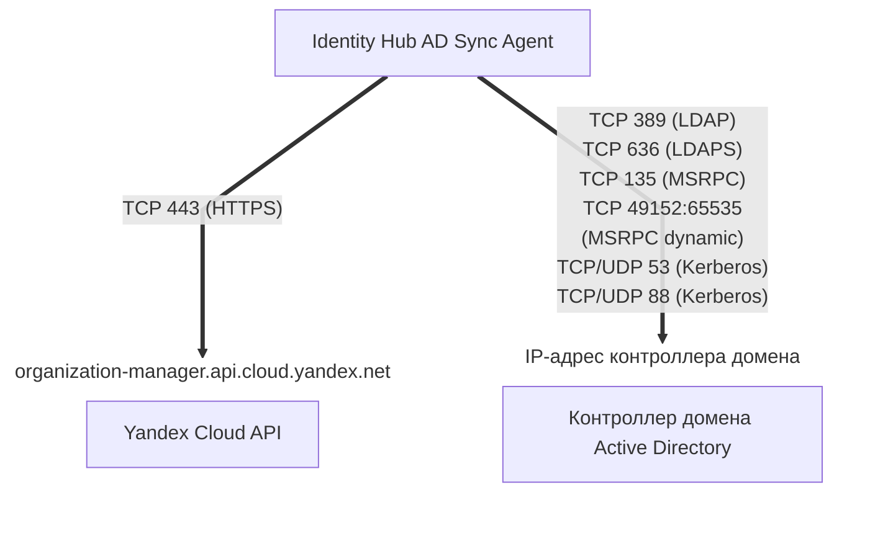

[Документация Yandex Cloud](../../../index.md) > [Yandex Identity Hub](../../index.md) > Концепции > Синхронизация с внешними службами каталогов > Обзор

# Синхронизация пользователей и групп с Microsoft Active Directory

Если для управления пользователями ваша компания использует [Microsoft Active Directory](https://docs.microsoft.com/ru-ru/windows-server/identity/ad-ds/active-directory-domain-services) и вы хотите организовать для ваших пользователей доступ к Yandex Cloud, вам не нужно вручную создавать для них учетные записи в Yandex Cloud. Вместо этого вы можете [синхронизировать](../../operations/sync-ad.md) с Yandex Identity Hub пользователей и группы, созданные в вашем каталоге Active Directory.



В настоящее время пользователей из Active Directory можно синхронизировать только с [локальными пользователями](../../../iam/concepts/users/accounts.md#local) Yandex Cloud в пределах [пулов пользователей](../user-pools.md).



Синхронизация пользователей и групп выполняется [агентом](sync-agent.md) синхронизации Identity Hub AD Sync Agent, который может быть запущен на любом сервере под управлением ОС [Linux](https://ru.wikipedia.org/wiki/Linux) или [Windows](https://ru.wikipedia.org/wiki/Windows).

Схема синхронизации:

На сервере, где [запущен](../../operations/sync-ad.md) агент синхронизации, должны быть открыты следующие сетевые порты для входящего и исходящего трафика:

* Для обращения к API Yandex Cloud:

    * `443 (TCP)` — для [HTTPS](https://ru.wikipedia.org/wiki/HTTPS);

* Для обращения к контроллеру домена Active Directory:

    * `389 (TCP)` — для [LDAP](https://learn.microsoft.com/en-us/windows/win32/api/_ldap/);
    * `636 (TCP)` — для [LDAPS](https://learn.microsoft.com/en-us/troubleshoot/windows-server/active-directory/enable-ldap-over-ssl-3rd-certification-authority);
    * `135 (TCP)` — для [MSRPC](https://learn.microsoft.com/en-us/windows/win32/rpc/rpc-start-page);
    * `49152:65535 (TCP)` — диапазон портов для MSRPC dynamic;
    * `53 (TCP/UDP)` и `88 (TCP/UDP)` — для [Kerberos](https://ru.wikipedia.org/wiki/Kerberos).

## Объекты синхронизации {#sync-objects}

Агент Identity Hub AD Sync Agent синхронизирует с каталогом Active Directory следующие объекты:

* **Пользователи**.
* **Атрибуты пользователей**.

    Таблица сопоставления атрибутов пользователей:

    Имя атрибута  в [конфигурации агента](sync-agent.md#agent-config) | Имя атрибута в Active Directory  (по умолчанию) | Имя атрибута  в Yandex Identity Hub
    --- | --- | ---
    `FullName` | `displayName` | `full_name`
    `GivenName` | `givenName` | `given_name`
    `FamilyName` | `sn` | `family_name`
    `Email` | `mail` | `email`
    `PhoneNumber` | `telephoneNumber` | `phone_number`
    `Username` | `userPrincipalName` | `username`
    `EmployeeId` | `employeeID` | `employee_id`
    `Department` | `department` | `department`
    `JobTitle` | `title` | `job_title`
    `CompanyName` | `company` | `company_name`
    н/д | `ObjectGUID` | `external_id`

    В параметре `user_attribute_mapping` [конфигурации агента](sync-agent.md#agent-config) вы можете настроить сопоставление имен атрибутов пользователя, отличных от заданных по умолчанию для Active Directory, или отключить синхронизацию отдельных атрибутов.
* **Группы пользователей**.
* **Атрибуты групп пользователей**.

    Таблица сопоставления атрибутов групп пользователей:

    Имя атрибута  в [конфигурации агента](sync-agent.md#agent-config) | Имя атрибута в Active Directory  (по умолчанию) | Имя атрибута  в Yandex Identity Hub
    --- | --- | ---
    `Name` | `name` | `name`
    `Description` | `description` | `description`
    н/д | `ObjectGUID` | `external_id`

    В параметре `group_attribute_mapping` [конфигурации агента](sync-agent.md#agent-config) вы можете настроить сопоставление имен атрибутов групп пользователей, отличных от заданных по умолчанию для Active Directory, или отключить синхронизацию отдельных атрибутов.
* **Членства пользователей в группах**.
* **[Хеши](https://ru.wikipedia.org/wiki/Хеш-функция) паролей пользователей**.

    Пароли пользователей хранятся в Active Directory не в открытом виде, а в виде хешей. Yandex Cloud, получив из каталога Active Directory хеш пароля пользователя, формирует на его основе собственный хеш с использованием современного и устойчивого к взлому алгоритма [Argon2](https://ru.wikipedia.org/wiki/Argon2).

    

    Yandex Cloud не хранит в своих базах данных пароли пользователей в открытом виде.

    

### Обратная запись паролей в Active Directory {#password-writeback}



Функциональность обратной записи паролей находится на стадии [Preview](../../../overview/concepts/launch-stages.md). Чтобы получить к ней доступ, обратитесь в [техническую поддержку](https://center.yandex.cloud/support) или к вашему аккаунт-менеджеру.



Агент синхронизации позволяет выполнять _обратную запись паролей_ пользователей (password writeback) в Active Directory. Обратная запись паролей обеспечивает обновление пароля пользователя в Active Directory, если пароль этого пользователя был изменен на стороне Yandex Identity Hub в следующих случаях:

* пользователь, для которого настроена синхронизация с Active Directory, [изменил свой пароль](../../operations/manage-account.md#edit-password) в Yandex Identity Hub;
* администратор организации [сбросил пароль](../../operations/user-pools/reset-user-password.md#reset) пользователя, для которого настроена синхронизация с Active Directory;
* пользователь, для которого настроена синхронизация с Active Directory, установил новый пароль в Yandex Identity Hub после того, как пароль этого пользователя был сброшен администратором.

Обратная запись паролей выполняется в следующем порядке:

1. Пользователь или администратор выполняют запрос на изменение пароля пользователя в Yandex Identity Hub.
1. Агент синхронизации предпринимает попытку обновить пароль этого пользователя в Active Directory.

    Попытка смены пароля в Active Directory может завершиться неудачей, например, если новый пароль не соответствует требованиям, заданным в политиках безопасности Active Directory.
1. Если попытка изменить пароль в Active Directory завершилась успехом, пароль пользователя изменяется также и на стороне Yandex Identity Hub.
1. Если попытка изменить пароль в Active Directory завершилась неудачей, пароль пользователя на стороне Yandex Identity Hub также остается неизменным.

Для работы обратной записи паролей аккаунту Active Directory, от имени которого агент выполняет синхронизацию, дополнительно нужны разрешения `Change Password`, `Reset Password` и `Write pwdLastSet`. Назначьте их на весь домен или на те Organization Units (OU), которые попадают под выбранные в конфигурации агента фильтры `sync_settings.filter`.

## Настройка синхронизации {#sync-setup}

Чтобы реализовать синхронизацию пользователей и групп Yandex Identity Hub с Active Directory, необходимо выполнить предварительные настройки, как на стороне вашего [контроллера домена](https://ru.wikipedia.org/wiki/Контроллер_домена) с развернутыми службами Active Directory, так и на стороне Yandex Cloud.

Если для [аутентификации](sync-agent.md#agent-ad-auth) на стороне Active Directory вы планируете использовать протокол [Kerberos](https://ru.wikipedia.org/wiki/Kerberos), самостоятельно установите на сервер компоненты, необходимые для работы этого протокола, и создайте файл `keytab` с ключами шифрования.

### Настройка на стороне контроллера домена Active Directory {#dc-setup}

Для корректной работы [агента](sync-agent.md) синхронизации на стороне Active Directory выполните следующие действия:

1. Создайте аккаунт пользователя домена или [аккаунт gMSA](*gmsa_account), от имени которого агент будет выполнять синхронизацию.
1. Выдайте этому аккаунту следующие разрешения на домен, указанный в конфигурации агента в секции `sync_settings.filter`:

    * `Replicating Directory Changes`;
    * `Replicating Directory Changes All`.

    Если вы используете обратную запись паролей, дополнительно выдайте аккаунту следующие разрешения на Organization Units (OU), указанные в конфигурации агента в секции `sync_settings.filter`, или на весь домен:

    * `Change Password`;
    * `Reset Password`;
    * `Write pwdLastSet`.
1. На контроллере домена откройте сетевые порты для входящего трафика, поступающего с IP-адреса сервера, на котором установлен агент Identity Hub AD Sync Agent:

    * `389 (TCP)` — для [LDAP](https://learn.microsoft.com/en-us/windows/win32/api/_ldap/);
    * `636 (TCP)` — для [LDAPS](https://learn.microsoft.com/en-us/troubleshoot/windows-server/active-directory/enable-ldap-over-ssl-3rd-certification-authority);
    * `135 (TCP)` — для [MSRPC](https://learn.microsoft.com/en-us/windows/win32/rpc/rpc-start-page);
    * `49152:65535 (TCP)` — диапазон портов для MSRPC dynamic;
    * `53 (TCP/UDP)` и `88 (TCP/UDP)` — для [Kerberos](https://ru.wikipedia.org/wiki/Kerberos).

1. (Опционально) Если вы планируете настраивать аутентификацию с использованием протокола [Kerberos](https://ru.wikipedia.org/wiki/Kerberos), настройте [SPN](https://learn.microsoft.com/en-us/windows/win32/ad/service-principal-names).

### Настройка на стороне Yandex Cloud {#yc-setup}

Для корректной работы [агента](sync-agent.md) синхронизации на стороне Yandex Cloud выполните следующие действия:

* [Создайте](../../../iam/operations/sa/create.md) сервисный аккаунт, от имени которого синхронизация будет выполняться на стороне Yandex Identity Hub.
* [Назначьте](../../../iam/operations/sa/assign-role-for-sa.md#binding-role-organization) сервисному аккаунту следующие [роли](../../../iam/concepts/access-control/roles.md) на [организацию](../organization.md), в которой находится нужный пул пользователей:

    * [`organization-manager.userpools.syncAgent`](../../security/index.md#organization-manager-userpools-syncAgent);
    * [`organization-manager.groups.viewer`](../../security/index.md#organization-manager-groups-viewer);
    * [`organization-manager.groups.externalCreator`](../../security/index.md#organization-manager-groups-externalCreator);
    * [`organization-manager.groups.externalConverter`](../../security/index.md#organization-manager-groups-externalConverter).
    
    Если вы планируете выгружать логи работы агента синхронизации в [лог-группу](../../../logging/concepts/log-group.md) Yandex Cloud Logging, дополнительно назначьте сервисному аккаунту [роль](../../../logging/security/index.md#logging-writer) `logging.writer` на соответствующую лог-группу или [каталог](../../../resource-manager/concepts/resources-hierarchy.md#folder), в котором она расположена.

* (Опционально) [Создайте](../../../iam/operations/authentication/manage-authorized-keys.md#create-authorized-key) и сохраните [авторизованный ключ](../../../iam/concepts/authorization/key.md) сервисного аккаунта.

    
    
    Авторизованный ключ не нужен, если агент синхронизации устанавливается на [виртуальную машину](../../../compute/concepts/vm.md) Yandex Compute Cloud, к которой подключен сервисный аккаунт с необходимыми правами доступа.
    
    

#### Полезные ссылки {#see-also}

* [Агент синхронизации Identity Hub AD Sync Agent](sync-agent.md)
* [Синхронизировать пользователей и группы с Microsoft Active Directory](../../operations/sync-ad.md)

[*gmsa_account]: gMSA (group Managed Service Account) — это тип учетных записей в Microsoft Active Directory, паролями для которых автоматически управляет контроллер домена, что упрощает запуск и работу одной и той же службы (SPN) на разных серверах. Подробнее читайте в [документации Microsoft](https://learn.microsoft.com/ru-ru/windows-server/identity/ad-ds/manage/group-managed-service-accounts/group-managed-service-accounts/group-managed-service-accounts-overview).