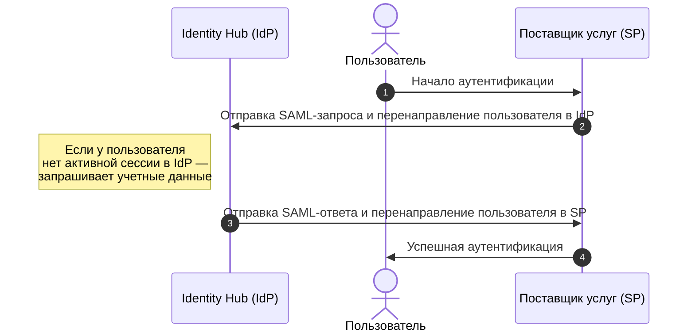
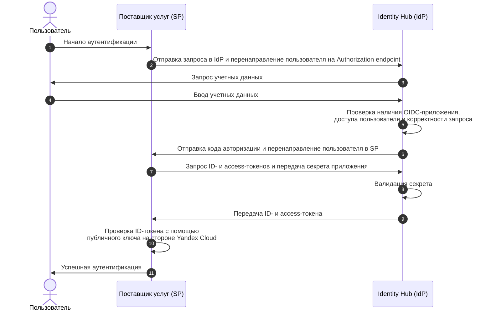

# Приложения в Yandex Identity Hub

Пользователи вашей [организации](organization.md) могут аутентифицироваться во внешних приложениях с помощью [технологии единого входа](../../glossary/sso.md) (SSO). Для этого Yandex Identity Hub позволяет создавать _приложения_ — [ресурсы](../../overview/roles-and-resources.md#resources) Yandex Cloud, которые содержат настройки интеграции Yandex Identity Hub как _поставщика удостоверений_ (Identity Provider, IdP) с одной стороны и стороннего _поставщика услуг_ (Service Provider, SP) — с другой.

Yandex Identity Hub поддерживает стандарты технологии единого входа [SAML](https://ru.wikipedia.org/wiki/SAML) и [OpenID Connect](https://ru.wikipedia.org/wiki/OpenID#OpenID_Connect) (OIDC).

В качестве поставщика услуг могут выступать различные сервисы, поддерживающие технологию единого входа, которые могут работать как по модели [SaaS](https://ru.wikipedia.org/wiki/Программное_обеспечение_как_услуга), так и по модели [on-premise](https://en.wikipedia.org/wiki/On-premises_software). Например: [Яндекс 360](https://360.yandex.ru/), [GitHub](https://github.com/), [GitLab](https://about.gitlab.com/), [Jenkins](https://www.jenkins.io/), [Jira](https://www.atlassian.com/software/jira) и множество других.

## SAML-приложения {#saml}

В Yandex Identity Hub вы можете [создавать](../operations/applications/saml-create.md) SAML-приложения, которые позволяют настроить единый вход по стандарту SAML на стороне Yandex Identity Hub, а также предоставляют необходимые значения для настройки интеграции на стороне поставщика услуг.

Доступ к внешнему приложению разрешен только тем пользователям организации Yandex Cloud, которые явно [добавлены](../operations/applications/saml-create.md#users-and-groups) в соответствующее SAML-приложение или входят в [группы пользователей](groups.md), явно добавленные в это SAML-приложение.

Управлять SAML-приложениями может пользователь, которому назначена [роль](../security/index.md#organization-manager-samlApplications-admin) `organization-manager.samlApplications.admin` или выше.

### Схема взаимодействия сторон по стандарту SAML {#saml-scheme}

В базовом представлении аутентификация пользователя с использованием механизма единого входа по стандарту SAML происходит по следующей схеме:

1. На странице аутентификации внешнего приложения (поставщика услуг) пользователь Yandex Cloud выбирает аутентификацию с помощью единого входа.
1. Поставщик услуг направляет SAML-запрос в Yandex Identity Hub (поставщик удостоверений) и перенаправляет пользователя на URL входа Yandex Identity Hub. Если включена опция проверки подписи SAML-запросов от поставщика услуг, то аутентификация не начнется, пока подписи в запросе нет или она невалидна.
1. Пользователь аутентифицируется в Yandex Identity Hub, используя свои учетные данные.
1. Если в Yandex Identity Hub существует SAML-приложение, соответствующее данному внешнему приложению, аутентифицировавшийся пользователь [добавлен](../operations/applications/saml-create.md#users-and-groups) в это SAML-приложение, а полученный SAML-запрос корректен, то Yandex Identity Hub направляет поставщику услуг подписанный (и зашифрованный, если активирована соответствующая опция) SAML-ответ, содержащий атрибуты пользователя.
1. Поставщик услуг проверяет корректность SAML-ответа и его подписи и в случае успеха предоставляет пользователю доступ к внешнему приложению.
1. При выходе пользователя из внешнего приложения поставщик услуг направляет SAML-запрос в Yandex Identity Hub и перенаправляет пользователя на URL выхода Yandex Identity Hub.

Обмен данными между сторонами по стандарту SAML происходит в формате [XML](https://ru.wikipedia.org/wiki/XML).

### Настройка на стороне поставщика удостоверений (Yandex Identity Hub) {#saml-idp-setup}

Для корректной работы интеграции на стороне Yandex Identity Hub необходимо [настроить](../operations/applications/saml-create.md#setup-idp) ряд параметров интеграции в SAML-приложении. Получите необходимые значения этих параметров у вашего поставщика услуг:

* `SP EntityID` — уникальный идентификатор поставщика услуг (Service Provider).

    Значение должно совпадать на стороне поставщика услуг и на стороне Yandex Identity Hub.
* `ACS URL` — URL-адрес, на который Yandex Identity Hub будет отправлять SAML-ответ.

    ACS URL должен соответствовать схеме `https`. Использовать протокол без шифрования допускается только в целях тестирования на локальном хосте (значения `http://127.0.0.1` и `http://localhost`).

    Если ваш поставщик услуг вместо ACS URL использует ACS-индексы, в дополнение к ACS URL вы можете задать полученное на стороне поставщика услуг значение индекса.

    Вы можете указать одновременно несколько URL/индексов ACS.

    
    
    Если в настройках поля **ACS URL** для одного из URL-адресов вы указали индекс, то индексы также должны быть указаны и для всех остальных URL-адресов.
    
    

* `Режим подписи` — элементы SAML-ответа, которые будут подписываться электронной подписью:

    * `Assertions` — будут подписываться только передаваемые атрибуты. Значение по умолчанию.
    * `Response` — будет подписываться весь SAML-ответ целиком.
    * `Assertions and Response` — будут подписываться как целиком весь SAML-ответ, так и (отдельно) передаваемые атрибуты.
    
    
    
    Режим подписи, заданный для SAML-приложения на стороне Yandex Identity Hub, должен соответствовать режиму подписи, заданному на стороне поставщика услуг.
    
    

* `Принимать только подписанные запросы` — позволяет проверять подпись SAML-запросов от поставщика услуг и не начинать аутентификацию, если подписи в запросе нет или она невалидна.

  Для работы функциональности требуется загрузить сертификат с открытым ключом, полученный у поставщика услуг, который будет использоваться для проверки подписи.

* `Шифровать assertion в ответе` — позволяет включить шифрование SAML-ответов, чтобы добавить дополнительный слой защиты данных. По умолчанию SAML-ответы только подписываются.

  Для работы функциональности требуется загрузить сертификат с открытым ключом, полученный у поставщика услуг, который будет использоваться для шифрования.

#### Атрибуты пользователя и групп {#saml-attributes}

Новое SAML-приложение по умолчанию создается с определенным набором относящихся к пользователю _атрибутов_, которые будут передаваться из Yandex Identity Hub поставщику услуг. Этот набор включает в себя:

Имя атрибута | Значение атрибута | Передаваемое значение
--- | --- | ---
`NameID` | `SubjectClaims.preferred_username` | идентификатор пользователя
`givenname` | `SubjectClaims.given_name` | полное имя пользователя
`fullname` | `SubjectClaims.name` | имя пользователя
`surname` | `SubjectClaims.family_name` | фамилия пользователя
`emailaddress` | `SubjectClaims.email` | адрес электронной почты пользователя

После создания SAML-приложения вы можете [добавлять, изменять и удалять](../operations/applications/saml-create.md#setup-attributes) следующие атрибуты пользователя:

* `SubjectClaims.sub` — [идентификатор](../operations/users-get.md) пользователя. Значение поля соответствует значению, отображаемому в поле **Идентификатор** в списке пользователей организации в интерфейсе Yandex Identity Hub в Cloud Center. Например: `aje0fapf84ofj57q1r0b`.
* `SubjectClaims.preferred_username` — уникальный логин пользователя. Значение поля соответствует значению, отображаемому в поле **Имя пользователя** в списке пользователей организации в интерфейсе Yandex Identity Hub в Cloud Center. Например: `ivanov@example-federation.ru`.
* `SubjectClaims.name` — полное имя пользователя. Значение поля соответствует значению, отображаемому в поле **Пользователь** в списке пользователей организации в интерфейсе Yandex Identity Hub в Cloud Center. Например: `Иванов Иван`.
* `SubjectClaims.given_name` — имя. Значение поля соответствует значению, отображаемому в поле **Имя** в разделе **Персональная информация** на странице с информацией о пользователе в интерфейсе Yandex Identity Hub в Cloud Center. Например: `Иван`.
* `SubjectClaims.family_name` — фамилия. Значение поля соответствует значению, отображаемому в поле **Фамилия** в разделе **Персональная информация** на странице с информацией о пользователе в интерфейсе Yandex Identity Hub в Cloud Center. Например: `Иванов`.
* `SubjectClaims.email` — адрес электронной почты. Значение поля соответствует значению, отображаемому в поле **Электронная почта** на странице с информацией о пользователе в интерфейсе Yandex Identity Hub в Cloud Center. Например: `ivanov@example-company.ru`.
* `SubjectClaims.phone_number` — номер телефона. Значение поля соответствует значению, отображаемому в поле **Номер телефона** в разделе **Персональная информация** на странице с информацией о пользователе в интерфейсе Yandex Identity Hub в Cloud Center. Например: `+74951234567`.
* `SubjectClaims.company_name` — название компании. Значение поля соответствует значению, отображаемому в поле **Название компании** в разделе **Персональная информация** на странице с информацией о пользователе в интерфейсе Yandex Identity Hub в Cloud Center. Например: `ООО «Праздник»`.
* `SubjectClaims.department` — название подразделения. Значение поля соответствует значению, отображаемому в поле **Подразделение** в разделе **Персональная информация** на странице с информацией о пользователе в интерфейсе Yandex Identity Hub в Cloud Center. Например: `Отдел АСУ`.
* `SubjectClaims.job_title` — название должности. Значение поля соответствует значению, отображаемому в поле **Должность** в разделе **Персональная информация** на странице с информацией о пользователе в интерфейсе Yandex Identity Hub в Cloud Center. Например: `Разработчик`.
* `SubjectClaims.employee_id` — цифровой код пользователя из кадровой системы компании. Значение поля соответствует значению, отображаемому в поле **Табельный номер** в разделе **Персональная информация** на странице с информацией о пользователе в интерфейсе Yandex Identity Hub в Cloud Center. Например: `08012`.



Любое из этих значений атрибутов вы можете добавлять более одного раза под разными именами.



Для атрибута `NameID`, в котором передается идентификатор пользователя, можно изменить формат и значение. Список доступных значений в поле **Значение** зависит от выбранного формата. При изменении формата значение атрибута изменяется автоматически на значение по умолчанию для этого формата.

Возможные форматы и значения атрибута:

* `urn:oasis:names:tc:SAML:1.1:nameid-format:emailAddress` — идентификатор пользователя передается в формате адреса электронной почты. Доступные значения:
    * `SubjectClaims.preferred_username` — значение по умолчанию при переключении на этот формат.

        Уникальность и неизменяемость передаваемого идентификатора не гарантируется: в одной организации могут быть два пользователя с одинаковым идентификатором `preferred_username`. Например: [федеративный](../../iam/concepts/users/accounts.md#saml-federation) пользователь и [локальный](../../iam/concepts/users/accounts.md#local) пользователь могут иметь одинаковое значение этого атрибута.

        Если идентификатор `preferred_username` федеративного пользователя задан не в формате адреса электронной почты, к передаваемому идентификатору будет автоматически добавлен суффикс `@<идентификатор_федерации_удостоверений>`, чтобы привести его к такому формату.
    * `SubjectClaims.email` — адрес электронной почты пользователя.

* `urn:oasis:names:tc:SAML:2.0:nameid-format:persistent` — идентификатор пользователя передается в формате [идентификатора](../operations/users-get.md) пользователя [организации](organization.md). При этом передаваемое значение гарантированно уникальное и неизменяемое. Доступные значения:
    * `SubjectClaims.sub` — значение по умолчанию при переключении на этот формат.
    * `SubjectClaims.external_id` — внешний идентификатор пользователя.
    * `SubjectClaims.employee_id` — табельный номер сотрудника.
* `urn:oasis:names:tc:SAML:2.0:nameid-format:transient` — идентификатор пользователя передается в значении идентификатора текущей [сессии](sessions.md) пользователя. Значение этого идентификатора изменяется в зависимости от используемой сессии и не может применяться для однозначной идентификации пользователя.

    Формат `urn:oasis:names:tc:SAML:2.0:nameid-format:transient` нельзя задать в настройках атрибута `NameID` явно: идентификатор пользователя в этом формате передается в SAML-ответе только в том случае, если этот формат был явно запрошен в SAML-запросе.



Если SAML-запрос со стороны поставщика услуг содержит явное указание формата, в котором ожидается значение идентификатора пользователя `NameID`, то в SAML-ответе значение будет отправлено в том формате, который указан в SAML-запросе. При этом значение формата, заданное в настройках Yandex Identity Hub, будет проигнорировано.



В дополнение к указанным выше атрибутам пользователя в SAML-ответе может быть передан атрибут групп, значением которого является список [групп](groups.md), в которые входит пользователь. Для этого атрибута вы можете задать произвольное имя и одно из значений:

* `Все группы` — в SAML-ответе в значение данного поля будут включены все [группы](groups.md), в которые входит пользователь.

    Максимальное количество передаваемых в этом поле групп — 1&nbsp;000. Если количество групп, в которые входит пользователь, превышает это число, на сторону поставщика услуг будет передана только первая тысяча групп. 
* `Только назначенные группы` — в SAML-ответе в значение данного поля из всех групп, в которые входит пользователь, будут включены только те группы, которые явно заданы на вкладке **Пользователи и группы** SAML-приложения.



Если на стороне Yandex Identity Hub для атрибута пользователя не задано значение, в SAML-ответе такой атрибут будет отсутствовать.



### Настройка на стороне поставщика услуг (внешнее приложение) {#saml-sp-setup}

Для корректной работы интеграции на стороне поставщика услуг также необходимо настроить ряд параметров интеграции. В зависимости от возможностей вашего поставщика услуг вы можете [выполнить эти настройки](../operations/applications/saml-create.md#setup-sp) как вручную, так и автоматически, загрузив XML-файл с метаданными или указав URL с метаданными.

Ссылка на скачивание XML-файла с метаданными и URL с метаданными доступны на странице с информацией о SAML-приложении в [интерфейсе Cloud Center](https://center.yandex.cloud/organization/apps). Там же доступны значения параметров интеграции для настройки вручную:

* `Issuer / IdP EntityID` — уникальный идентификатор, используемый для приложения. Значение должно совпадать на стороне поставщика услуг и на стороне Yandex Identity Hub.
* `Login URL` — адрес, на который поставщик услуг будет отправлять запросы для аутентификации пользователя.
* `Logout URL` — адрес, на который поставщик услуг будет отправлять SAML-запрос при выходе пользователя из системы.

Кроме того, на стороне поставщика услуг должны быть настроены и корректно обрабатываться атрибуты пользователя, настроенные на стороне Yandex Identity Hub.

#### Сертификат ключа проверки электронной подписи {#saml-certificate}

В дополнение к настройке указанных выше параметров в конфигурацию поставщика услуг необходимо также добавить сертификат, с помощью которого поставщик услуг сможет верифицировать электронную подпись, которой Yandex Identity Hub подписывает SAML-ответы.

Сертификат ключа проверки электронной подписи для SAML-приложения автоматически выпускается при создании приложения сроком на пять лет.

При автоматической настройке с помощью файла или URL с метаданными устанавливать сертификат вручную не требуется: метаданные уже содержат нужный сертификат, и он устанавливается автоматически.

В любой момент вы можете [выпускать](../operations/applications/saml-update.md#update-cert) новые сертификаты ключа проверки электронной подписи для SAML-приложения и активировать их.



В SAML-приложении активным может быть только один сертификат: при активации нового сертификата текущий сертификат становится неактивным. После активации нового сертификата не забудьте [загрузить](../operations/applications/saml-create.md#setup-sp) его в настройки интеграции приложения на стороне поставщика услуг.



Дополнительно на стороне поставщика услуг необходимо указать, какие данные в SAML-ответах поставщика удостоверений будут подписываться:
* только передаваемые атрибуты пользователя;
* весь SAML-ответ целиком;
* целиком весь SAML-ответ и (отдельно) передаваемые атрибуты.

Заданный режим подписи на стороне поставщика услуг должен соответствовать режиму подписи, заданному на стороне Yandex Identity Hub.

## OIDC-приложения {#oidc}

В Yandex Identity Hub вы можете [создавать](../operations/applications/oidc-create.md) OIDC-приложения, которые позволяют настроить единый вход по стандарту OpenID Connect (OIDC) на стороне Yandex Identity Hub, а также предоставляют необходимые значения для настройки интеграции на стороне поставщика услуг.

Доступ к внешнему приложению разрешен только тем пользователям организации Yandex Cloud, которые явно [добавлены](../operations/applications/oidc-create.md#users-and-groups) в соответствующее OIDC-приложение или входят в [группы пользователей](groups.md), явно добавленные в это OIDC-приложение.

Управлять OIDC-приложениями может пользователь, которому назначена [роль](../security/index.md#organization-manager-oauthApplications-admin) `organization-manager.oauthApplications.admin` или выше.

Необходимым компонентом OIDC-приложения является OAuth-клиент, который создается в указанном пользователем [каталоге](../../resource-manager/concepts/resources-hierarchy.md#folder) и неразрывно связан с OIDC-приложением. OAuth-клиент создается и удаляется автоматически соответственно при создании и удалении OIDC-приложения.

### Схема взаимодействия сторон по стандарту OIDC {#oidc-scheme}

В базовом представлении аутентификация пользователя с использованием механизма единого входа по стандарту OpenID Connect происходит по следующей схеме:

1. На странице аутентификации внешнего приложения (поставщика услуг) пользователь Yandex Cloud выбирает аутентификацию с помощью единого входа.
1. Поставщик услуг направляет запрос аутентификации в Yandex Identity Hub (поставщик удостоверений) и перенаправляет пользователя на URL входа Yandex Identity Hub, указанный в поле `Authorization endpoint`.
1. Пользователь аутентифицируется в Yandex Identity Hub, используя свои учетные данные.
1. Если в Yandex Identity Hub существует OIDC-приложение, соответствующее данному внешнему приложению, аутентифицировавшийся пользователь добавлен в это OIDC-приложение, а полученный запрос аутентификации корректен, то Yandex Identity Hub направляет поставщику услуг код авторизации и перенаправляет пользователя обратно во внешнее приложение.
1. По адресу, заданному в поле `Token endpoint`, поставщик услуг запрашивает в Yandex Identity Hub [ID-токен](../../iam/concepts/authorization/id-token.md) и токен доступа. В запросе указывается [секрет приложения](#oidc-secret), по которому Yandex Identity Hub проверяет подлинность запроса.
1. Если переданный поставщиком услуг секрет действителен, Yandex Identity Hub направляет поставщику услуг ID-токен и токен доступа.
1. Поставщик услуг проверяет переданный ID-токен с помощью публичного ключа, [получив](https://auth.yandex.cloud/oauth/jwks/keys) его в Yandex Cloud по идентификатору, указанному в поле `kid` заголовка ID-токена. В случае успеха поставщик услуг предоставляет пользователю доступ к внешнему приложению.

Обмен данными между сторонами по стандарту OIDC происходит в формате [JSON](https://ru.wikipedia.org/wiki/JSON).

### Секрет OIDC-приложения {#oidc-secret}

_Секрет приложения_ генерируется пользователем на стороне OIDC-приложения в Yandex Identity Hub и представляет собой случайную строку определенной длины, начинающуюся с префикса `yccs__`.

Секрет приложения должен быть указан в настройках интеграции на стороне поставщика услуг и будет использоваться для проверки подлинности поступающих от поставщика услуг запросов.

Срок жизни секрета OIDC-приложения не ограничен. При этом вы в любой момент можете [сгенерировать](../operations/applications/oidc-update.md#update-secret) в приложении любое количество новых секретов, а также удалить их.



После удаления секрета в OIDC-приложении не забудьте указать новый секрет в настройках интеграции на стороне поставщика услуг.



Секреты OIDC-приложений не сохраняются на стороне Yandex Cloud и отображаются пользователю только в момент создания. После обновления или закрытия страницы браузера, на которой был сгенерирован секрет, содержимое секрета становится недоступно.

### Настройка на стороне поставщика удостоверений (Yandex Identity Hub) {#oidc-idp-setup}

Для корректной работы интеграции на стороне Yandex Identity Hub в OIDC-приложении необходимо [указать](../operations/applications/oidc-create.md#setup-idp) адрес (адреса) [Redirect URI](#oidc-redirect-uri), выбрать [набор атрибутов](#oidc-user-attributes) пользователя, которые будут передаваться поставщику услуг, а также сгенерировать [секрет приложения](#oidc-secret). Прежде чем настраивать OIDC-приложение на стороне Yandex Identity Hub, получите адрес (адреса) Redirect URI у вашего поставщика услуг.

#### Redirect URI {#oidc-redirect-uri}

_Redirect URI_ — адрес на стороне внешнего приложения, куда пользователь будет перенаправляться в результате успешного прохождения аутентификации в Yandex Identity Hub.

Redirect URI должен соответствовать схеме `https`. Использовать протокол без шифрования допускается только в целях тестирования на локальном хосте (значения `http://127.0.0.1` и `http://localhost`).

В OIDC-приложении вы можете задать одновременно несколько адресов Redirect URI.

#### Атрибуты пользователя {#oidc-attributes}

В настройках OIDC-приложения вы можете задать состав атрибутов пользователя, которые определяются выбранными в поле **Scopes** значениями и будут передаваться поставщику услуг в ID-токене:

* `openid (идентификатор пользователя)` — идентификатор пользователя. Обязательный параметр.
* `email (адрес электронной почты)` — адрес электронной почты пользователя.
* `profile (полное имя, имя, фамилия, аватар и др.)` — дополнительная информация о пользователе.
* `groups (группы пользователя в организации)` — [группы пользователей](groups.md) организации, участником которых является аутентифицирующийся пользователь. Возможные значения:

    * `Все группы` — поставщику услуг будут переданы все группы, в которые входит пользователь.

        Максимальное количество передаваемых групп — 1&nbsp;000. Если количество групп, в которые входит пользователь, превышает это число, на сторону поставщика услуг будет передана только первая тысяча групп. 
    * `Только назначенные группы` — из всех групп, в которые входит пользователь, поставщику услуг будут переданы только те группы, которые явно заданы на вкладке **Пользователи и группы** OIDC-приложения.

В новом OIDC-приложении по умолчанию выбраны все атрибуты, за исключением `groups`.

### Настройка на стороне поставщика услуг (внешнее приложение) {#oidc-sp-setup}

Для корректной работы интеграции на стороне поставщика услуг также необходимо настроить ряд параметров интеграции. В зависимости от возможностей вашего поставщика услуг вы можете [выполнить эти настройки](../operations/applications/oidc-create.md#setup-sp) как вручную, так и автоматически, указав URL с конфигурацией.

URL с конфигурацией предоставляет поставщику услуг значения всех необходимых для настройки интеграции параметров и доступен в поле **OpenID Configuration** в блоке **Конфигурация поставщика услуг (SP)** на странице с информацией об OIDC-приложении в [интерфейсе Cloud Center](https://center.yandex.cloud/organization/apps). На этой же странице доступны значения параметров интеграции для настройки вручную:

* `ClientID` — уникальный идентификатор приложения.
* `Authorization endpoint` — адрес в Yandex Cloud, на который поставщик услуг будет перенаправлять пользователя для прохождения аутентификации.
* `Token endpoint` — адрес, на который от внешнего приложения поступает запрос на получение ID-токена и токена доступа.
* `Userinfo endpoint` — адрес, по которому внешнее приложение может получить атрибуты пользователя.

В дополнение к указанным выше настройкам на стороне поставщика услуг также необходимо указать [секрет приложения](#oidc-secret).

#### См. также {#see-also}

* [Создать SAML-приложение в Yandex Identity Hub](../operations/applications/saml-create.md)
* [Изменить SAML-приложение в Yandex Identity Hub](../operations/applications/saml-update.md)
* [Деактивировать и удалить SAML-приложение в Yandex Identity Hub](../operations/applications/saml-deactivate-remove.md)
* [Создать OIDC-приложение в Yandex Identity Hub](../operations/applications/oidc-create.md)
* [Изменить OIDC-приложение в Yandex Identity Hub](../operations/applications/oidc-update.md)
* [Деактивировать и удалить OIDC-приложение в Yandex Identity Hub](../operations/applications/oidc-deactivate-remove.md)
* [Чеклист безопасности аутентификации и авторизации](../../security/domains/iam-checklist.md)