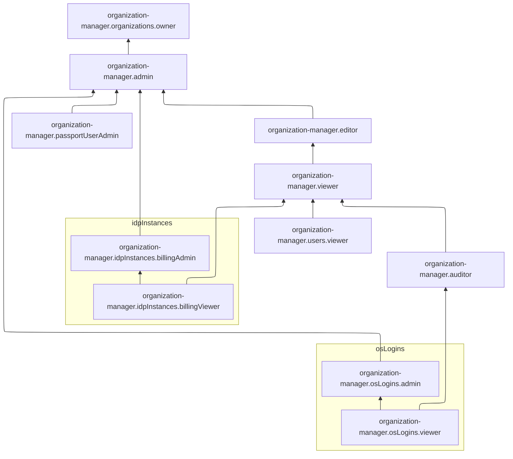
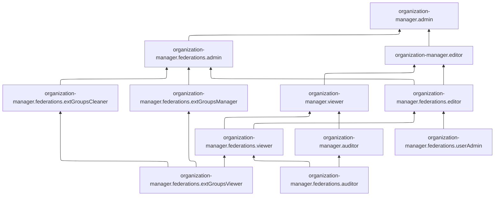
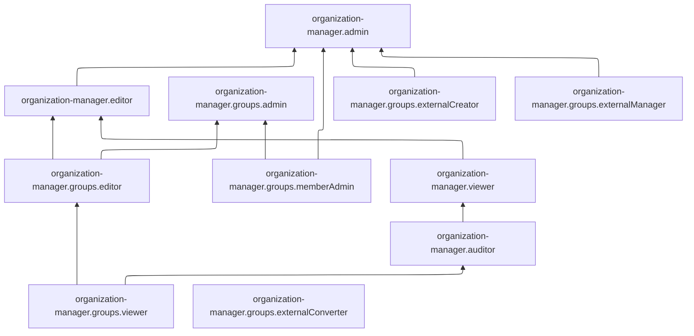
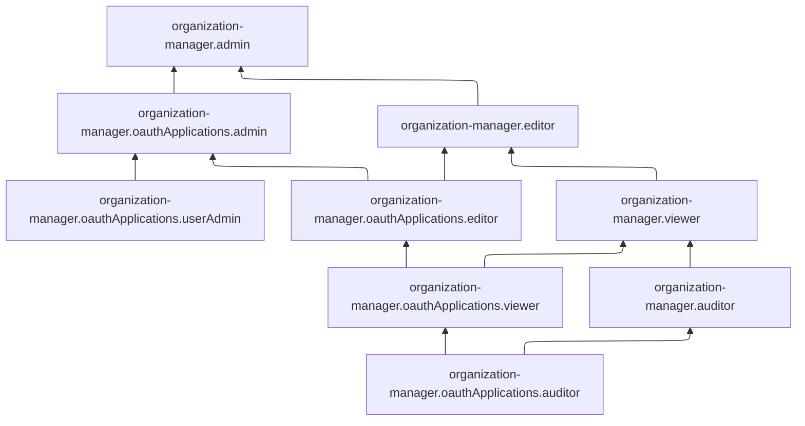
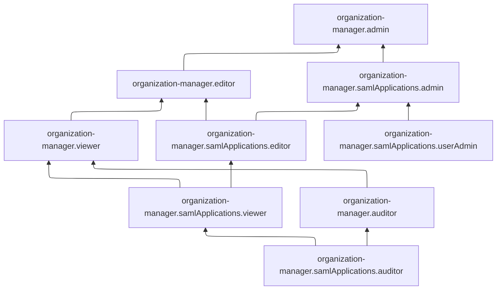
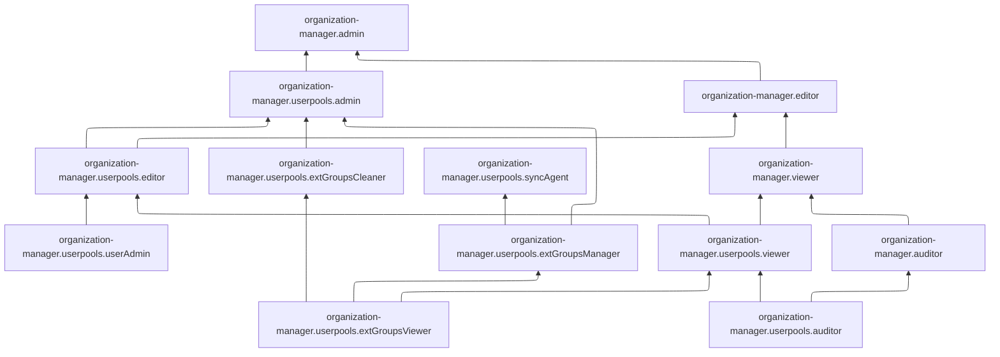

# Управление доступом в Yandex Identity Hub

Управление доступом в Yandex Cloud построено на политике [Role Based Access Control](https://en.wikipedia.org/wiki/Role-based_access_control) (RBAC). Чтобы предоставить пользователю определенные права или доступ к ресурсу, нужно назначить ему соответствующие роли.

Каждая роль состоит из набора разрешений, описывающих допустимые операции с ресурсом. Пользователь может назначить роли только с теми разрешениями, которые имеются у него самого. Например, чтобы назначить роль [владельца организации](#organization-manager-organizations-owner), пользователь должен сам обладать этой ролью, а роли администратора для этого недостаточно.

Если у ресурса есть дочерние ресурсы, то все разрешения от родительского ресурса будут унаследованы дочерними ресурсами. Например, если вы назначите пользователю роль администратора организации, в которой находится облако, то все разрешения этой роли будут действовать для облака и всех вложенных ресурсов этого облака.

Подробнее об управлении доступом в Yandex Cloud читайте в документации Yandex Identity and Access Management в разделе [Как устроено управление доступом в Yandex Cloud](../../iam/concepts/access-control/index.md).



Даже если [операция](../../api-design-guide/concepts/about-async.md) с ресурсами [сервисов](../../overview/concepts/services.md) Yandex Cloud разрешена [ролью](../../iam/concepts/access-control/roles.md), ее выполнение может быть заблокировано, если на [организацию](../concepts/organization.md) назначена [политика авторизации](../../iam/concepts/access-control/access-policies.md), запрещающая эту операцию.



## На какие ресурсы можно назначить роль {#resources}

Роль можно назначить на [организацию](../concepts/organization.md), [облако](../../resource-manager/concepts/resources-hierarchy.md#cloud) и [каталог](../../resource-manager/concepts/resources-hierarchy.md#folder). Роли, назначенные на организацию, облако или каталог, действуют и на вложенные ресурсы.

Вы также можете назначать роли на отдельные ресурсы сервиса:



- Интерфейс Cloud Center {#cloud-center}

  Через [интерфейс Cloud Center](https://center.yandex.cloud/organization) вы можете назначить роли на следующие ресурсы:

  * [Организация](../operations/security.md)
  * [Пул пользователей](../concepts/user-pools.md)
  * [Группа пользователей](../operations/access-manage-group.md)

- CLI {#cli}

  Через [Yandex Cloud CLI](../../cli/cli-ref/organization-manager/cli-ref/index.md) вы можете назначить роли на следующие ресурсы:

  * [Организация](../operations/security.md)
  * [Пул пользователей](../concepts/user-pools.md)
  * [Группа пользователей](../operations/access-manage-group.md)
  * [SAML-приложение](../concepts/applications.md#saml)
  * [OIDC-приложение](../concepts/applications.md#oidc)

- Terraform {#tf}

  Через [Terraform](../../terraform/index.md) вы можете назначить роли на следующие ресурсы:

  * [Организация](../operations/security.md)
  * [Группа пользователей](../operations/access-manage-group.md)

- API {#api}

  Через [API Yandex Cloud](../api-ref/authentication.md) вы можете назначить роли на следующие ресурсы:

  * [Организация](../operations/security.md)
  * [Пул пользователей](../concepts/user-pools.md)
  * [Группа пользователей](../operations/access-manage-group.md)
  * [SAML-приложение](../concepts/applications.md#saml)
  * [OIDC-приложение](../concepts/applications.md#oidc)



## Какие роли действуют в сервисе {#roles-list}

На первой схеме показаны общие роли сервиса Yandex Identity Hub и несколько небольших групп ролей для управления отдельными функциями.

С помощью сервисных ролей [организаций](#organization-manager-auditor) вы можете управлять доступом к настройками организации, федерациями удостоверений, пулами пользователей, SAML-приложениями, OIDC-приложениями, пользователями и их группами, а также правами доступа пользователей к организации и ресурсам в ней.

С помощью сервисных ролей [OS Login](#organization-manager-osLogins-viewer) вы можете управлять SSH-ключами, профилями OS Login пользователей и сервисных аккаунтов и настройками режимов работы на уровне организации.

С помощью сервисных ролей для управления использованием сервиса [Yandex Identity Hub](#organization-manager-idpInstances-billingViewer) вы можете управлять доступом к данным пользователей о подписке на платные возможности и статистике использования квот сервиса.



Ниже приведены схемы с ролями, сгруппированными по функциональности. Каждая схема содержит роли определенной группы и общие роли сервиса.



С помощью сервисных ролей [федераций удостоверений](#organization-manager-federations-extGroupsViewer) вы можете управлять доступом пользователей к федерациям и их настройкам, а также к группам пользователей, привязанных к федерациям из внешних источников.







С помощью сервисных ролей [групп пользователей](#organization-manager-groups-viewer) вы можете управлять доступом к группам и их настройкам, а также к действиям над пользователями и сервисными аккаунтами, входящими в группы.







С помощью сервисных ролей [OIDC-приложений](#organization-manager-oauthApplications-auditor) вы можете управлять доступом к OIDC-приложениям, их настройкам и действиям со списком добавленных в приложения пользователей.







С помощью сервисных ролей [SAML-приложений](#organization-manager-samlApplications-auditor) вы можете управлять доступом к SAML-приложениям и их настройкам, а также к просмотру добавленных в них пользователей.







С помощью сервисных ролей [пулов пользователей](#organization-manager-userpools-extGroupsViewer) вы можете управлять доступом к пулам и их настройкам, действиям с входящими в них локальными пользователями, внешними группами и синхронизацией пользователей.





### Сервисные роли {#service-roles}

#### organization-manager.auditor {#organization-manager-auditor}

Роль `organization-manager.auditor` позволяет просматривать информацию об организации и ее настройках, о входящих в организацию федерациях удостоверений, пулах пользователей, SAML-приложениях и OIDC-приложениях, а также о пользователях и группах пользователей организации.



* просматривать информацию об [организации](../concepts/organization.md) Yandex Identity Hub и ее настройках;
* просматривать информацию о назначенных [правах доступа](../../iam/concepts/access-control/index.md) к организации;
* просматривать [политики авторизации](../../iam/concepts/access-control/access-policies.md), назначенные на организацию;
* просматривать настройки [брендирования](../concepts/branding.md) организации;
* просматривать список [пользователей](../../overview/roles-and-resources.md#users) организации и сведения в профилях пользователей (кроме номера телефона), дату последней аутентификации, а также дату последней верификации федеративных и локальных аккаунтов с помощью [двухфакторной аутентификации](../concepts/mfa.md);
* просматривать информацию о правах доступа, назначенных [субъектам](../../iam/concepts/access-control/index.md#subject) в организации Yandex Identity Hub;
* просматривать информацию о [федерациях удостоверений](../concepts/add-federation.md) в организации;
* просматривать информацию о [сертификатах](../concepts/add-federation.md#build-trust) федераций удостоверений;
* просматривать списки [сопоставлений](../concepts/add-federation.md#group-mapping) групп [федеративных пользователей](../../iam/concepts/users/accounts.md#saml-federation) и информацию о таких сопоставлениях;
* просматривать информацию об атрибутах [федеративных](../../iam/concepts/users/accounts.md#saml-federation) пользователей;
* просматривать информацию о [пулах пользователей](../concepts/user-pools.md) и назначенных правах доступа к ним;
* просматривать информацию об атрибутах [локальных](../../iam/concepts/users/accounts.md#local) пользователей, входящих в пулы пользователей;
* просматривать информацию о [доменах](../concepts/domains.md), привязанных к пулам пользователей;
* просматривать информацию о SAML-приложениях и OIDC-приложениях, а также о назначенных правах доступа к ним;
* просматривать список пользователей, добавленных в SAML-приложения и OIDC-приложения;
* получать сертификаты SAML-приложений;
* просматривать список пользователей организации, [подписанных](../operations/subscribe-user-for-notifications.md) на получение технических уведомлений о событиях в организации;
* просматривать информацию о [политиках MFA](../concepts/mfa.md#mfa-policies);
* просматривать информацию о настройках [OS Login](../concepts/os-login.md) организации;
* просматривать список [профилей](../concepts/os-login.md#os-login-profiles) OS Login пользователей и сервисных аккаунтов;
* просматривать список SSH-ключей пользователей организации, а также информацию об SSH-ключах;
* просматривать информацию о [группах пользователей](../concepts/groups.md) и о назначенных правах доступа к таким группам;
* просматривать список групп, в которые входит тот или иной пользователь, а также список пользователей, которые входят в ту или иную группу;
* просматривать информацию о [refresh-токенах](../../iam/concepts/authorization/refresh-token.md) пользователей организации, а также о настройках refresh-токенов в организации;
* просматривать информацию о квотах сервиса Yandex Identity Hub;
* просматривать информацию о действующем [тарифном плане](../../support/pricing.md#effective-plans) технической поддержки;
* просматривать список [обращений](../../support/overview.md) в техническую поддержку и информацию о них, а также создавать такие обращения, оставлять в них комментарии и вложения и закрывать их.



Включает разрешения, предоставляемые ролями `iam.userAccounts.refreshTokenViewer`, `organization-manager.federations.auditor`, `organization-manager.osLogins.viewer`, `organization-manager.userpools.auditor`, `organization-manager.samlApplications.auditor`, `organization-manager.oauthApplications.auditor` и `organization-manager.groups.viewer`.

#### organization-manager.viewer {#organization-manager-viewer}

Роль `organization-manager.viewer` позволяет просматривать информацию об организации и ее настройках, о входящих в организацию федерациях удостоверений, пулах пользователей, SAML-приложениях и OIDC-приложениях, а также о пользователях и группах пользователей организации.



* просматривать информацию об [организации](../concepts/organization.md) Yandex Identity Hub и ее настройках;
* просматривать информацию о назначенных [правах доступа](../../iam/concepts/access-control/index.md) к организации;
* просматривать [политики авторизации](../../iam/concepts/access-control/access-policies.md), назначенные на организацию;
* просматривать настройки [брендирования](../concepts/branding.md) организации;
* просматривать список [пользователей](../../overview/roles-and-resources.md#users) организации, информацию о них (включая номер телефона), дату последней аутентификации, а также дату последней верификации федеративных и локальных аккаунтов с помощью [двухфакторной аутентификации](../concepts/mfa.md);
* просматривать информацию о правах доступа, назначенных [субъектам](../../iam/concepts/access-control/index.md#subject) в организации Yandex Identity Hub;
* просматривать информацию о [федерациях удостоверений](../concepts/add-federation.md) в организации;
* просматривать информацию о [сертификатах](../concepts/add-federation.md#build-trust) федераций удостоверений;
* просматривать списки [сопоставлений](../concepts/add-federation.md#group-mapping) групп [федеративных пользователей](../../iam/concepts/users/accounts.md#saml-federation) и информацию о таких сопоставлениях;
* просматривать информацию об атрибутах [федеративных](../../iam/concepts/users/accounts.md#saml-federation) пользователей;
* просматривать информацию о [пулах пользователей](../concepts/user-pools.md) и назначенных правах доступа к ним;
* просматривать информацию об атрибутах [локальных](../../iam/concepts/users/accounts.md#local) пользователей, входящих в пулы пользователей;
* просматривать события аудита пользователя;
* просматривать информацию о [доменах](../concepts/domains.md), привязанных к пулам пользователей;
* просматривать информацию о SAML-приложениях и OIDC-приложениях, а также о назначенных правах доступа к ним;
* просматривать список пользователей, добавленных в SAML-приложения и OIDC-приложения;
* получать сертификаты SAML-приложений;
* просматривать список пользователей организации, [подписанных](../operations/subscribe-user-for-notifications.md) на получение технических уведомлений о событиях в организации;
* просматривать информацию о [политиках MFA](../concepts/mfa.md#mfa-policies);
* просматривать информацию о настройках [OS Login](../concepts/os-login.md) организации;
* просматривать список [профилей](../concepts/os-login.md#os-login-profiles) OS Login пользователей и сервисных аккаунтов;
* просматривать список SSH-ключей пользователей организации, а также информацию об SSH-ключах;
* просматривать информацию о [группах пользователей](../concepts/groups.md) и о назначенных правах доступа к таким группам;
* просматривать список групп, в которые входит тот или иной пользователь, а также список пользователей, которые входят в ту или иную группу;
* просматривать список и информацию о группах пользователей Yandex Identity Hub, привязанных к федерациям удостоверений и пулам пользователей в процессе синхронизации с пользовательскими группами в каталоге Active Directory или другом внешнем источнике;
* просматривать информацию о подписке на платные возможности сервиса Yandex Identity Hub;
* просматривать информацию о статистике использования квот по подписке на платные возможности сервиса Yandex Identity Hub;
* просматривать список пользователей, которые в текущем [отчетном периоде](../../billing/concepts/reporting-period.md) используют квоту для аутентификации в Yandex Identity Hub;
* просматривать информацию о [refresh-токенах](../../iam/concepts/authorization/refresh-token.md) пользователей организации, а также о настройках refresh-токенов в организации;
* просматривать [сессии](../concepts/sessions.md) федеративных и локальных пользователей;
* просматривать информацию о квотах сервиса Yandex Identity Hub;
* просматривать информацию о действующем [тарифном плане](../../support/pricing.md#effective-plans) технической поддержки;
* просматривать список [обращений](../../support/overview.md) в техническую поддержку и информацию о них, а также создавать такие обращения, оставлять в них комментарии и вложения и закрывать их.



Включает разрешения, предоставляемые ролями `organization-manager.auditor`, `organization-manager.federations.viewer`, `organization-manager.users.viewer`, `organization-manager.samlApplications.viewer`, `organization-manager.oauthApplications.viewer`, `organization-manager.userpools.viewer` и `organization-manager.idpInstances.billingViewer`.

#### organization-manager.editor {#organization-manager-editor}

Роль `organization-manager.editor` позволяет управлять настройками организации, федерациями удостоверений, пулами пользователей, SAML-приложениями, OIDC-приложениями, а также пользователями и их группами.



* просматривать и изменять информацию об [организации](../concepts/organization.md) Yandex Identity Hub;
* просматривать и изменять настройки организации;
* просматривать информацию о назначенных [правах доступа](../../iam/concepts/access-control/index.md) к организации;
* просматривать [политики авторизации](../../iam/concepts/access-control/access-policies.md), назначенные на организацию;
* просматривать и изменять настройки [брендирования](../concepts/branding.md) организации;
* просматривать список [пользователей](../../overview/roles-and-resources.md#users) организации, информацию о них (включая номер телефона), дату последней аутентификации, а также дату последней верификации федеративных и локальных аккаунтов с помощью [двухфакторной аутентификации](../concepts/mfa.md);
* просматривать информацию о правах доступа, назначенных [субъектам](../../iam/concepts/access-control/index.md#subject) в организации Yandex Identity Hub;
* просматривать информацию о [федерациях удостоверений](../concepts/add-federation.md) в организации, а также создавать, изменять и удалять федерации удостоверений;
* добавлять и удалять федеративных пользователей;
* просматривать информацию о [сертификатах](../concepts/add-federation.md#build-trust) федераций удостоверений, а также добавлять, изменять и удалять такие сертификаты;
* настраивать [сопоставление](../concepts/add-federation.md#group-mapping) групп [федеративных пользователей](../../iam/concepts/users/accounts.md#saml-federation);
* просматривать списки сопоставлений групп федеративных пользователей и информацию о таких сопоставлениях, а также создавать, изменять и удалять такие списки сопоставлений;
* просматривать информацию об атрибутах [федеративных](../../iam/concepts/users/accounts.md#saml-federation) пользователей, а также создавать и удалять такие атрибуты;
* просматривать информацию о [пулах пользователей](../concepts/user-pools.md) и назначенных правах доступа к ним;
* создавать, изменять и удалять пулы пользователей;
* просматривать информацию о [доменах](../concepts/domains.md), привязанных к пулам пользователей, а также добавлять, подтверждать и удалять домены;
* создавать, удалять, активировать и деактивировать [локальных](../../iam/concepts/users/accounts.md#local) пользователей, входящих в пулы пользователей;
* просматривать информацию об атрибутах локальных пользователей;
* просматривать события аудита пользователя;
* изменять данные пользователей: имя пользователя, пароль, домен, адрес электронной почты, а также ФИО и телефон;
* просматривать информацию о SAML-приложениях и OIDC-приложениях, а также о назначенных правах доступа к ним;
* создавать, деактивировать, активировать, изменять и удалять SAML-приложения и OIDC-приложения;
* просматривать список пользователей, добавленных в SAML-приложения и OIDC-приложения;
* получать сертификаты SAML-приложений, а также создавать, изменять и удалять такие сертификаты;
* просматривать список пользователей организации, [подписанных](../operations/subscribe-user-for-notifications.md) на получение технических уведомлений о событиях в организации, и изменять этот список;
* просматривать информацию о [политиках MFA](../concepts/mfa.md#mfa-policies), а также создавать, изменять, активировать, деактивировать и удалять такие политики;
* удалять [факторы MFA](../concepts/mfa.md#mfa-factors) федеративных и [локальных](../../iam/concepts/users/accounts.md#local) аккаунтов пользователей;
* сбрасывать дату верификации федеративных и локальных аккаунтов пользователей;
* просматривать информацию о настройках [OS Login](../concepts/os-login.md) организации;
* просматривать список [профилей](../concepts/os-login.md#os-login-profiles) OS Login пользователей и сервисных аккаунтов;
* просматривать список SSH-ключей пользователей организации, а также информацию об SSH-ключах;
* просматривать информацию о [группах пользователей](../concepts/groups.md), а также создавать, изменять и удалять группы пользователей;
* просматривать информацию о назначенных правах доступа к группам пользователей;
* просматривать список групп, в которые входит тот или иной пользователь, а также список пользователей, которые входят в ту или иную группу;
* просматривать список и информацию о группах пользователей Yandex Identity Hub, привязанных к федерациям удостоверений и пулам пользователей в процессе синхронизации с пользовательскими группами в каталоге Active Directory или другом внешнем источнике;
* просматривать информацию о подписке на платные возможности сервиса Yandex Identity Hub;
* просматривать информацию о статистике использования квот по подписке на платные возможности сервиса Yandex Identity Hub;
* просматривать список пользователей, которые в текущем [отчетном периоде](../../billing/concepts/reporting-period.md) используют квоту для аутентификации в Yandex Identity Hub;
* просматривать и изменять настройки [refresh-токенов](../../iam/concepts/authorization/refresh-token.md) в организации;
* просматривать информацию о refresh-токенах пользователей организации и отзывать такие refresh-токены;
* просматривать и завершать [сессии](../concepts/sessions.md) федеративных и локальных пользователей;
* просматривать информацию о квотах сервиса Yandex Identity Hub;
* просматривать информацию о действующем [тарифном плане](../../support/pricing.md#effective-plans) технической поддержки;
* просматривать список [обращений](../../support/overview.md) в техническую поддержку и информацию о них, а также создавать такие обращения, оставлять в них комментарии и вложения и закрывать их.



Включает разрешения, предоставляемые ролями `organization-manager.viewer`, `organization-manager.federations.editor`, `organization-manager.userpools.editor`, `organization-manager.samlApplications.editor`, `organization-manager.oauthApplications.editor` и `organization-manager.groups.editor`.

Для настройки сопоставления групп пользователей роль должна быть назначена на те группы в Yandex Identity Hub, которые вы будете сопоставлять.

#### organization-manager.admin {#organization-manager-admin}

Роль `organization-manager.admin` позволяет управлять настройками организации, федерациями удостоверений, пулами пользователей, SAML-приложениями, OIDC-приложениями, пользователями и их группами, а также правами доступа пользователей к организации и ресурсам в ней.



* привязывать [платежный аккаунт](../../billing/concepts/billing-account.md) к [организации Yandex Identity Hub](../concepts/organization.md);
* просматривать и изменять информацию об организации Yandex Identity Hub;
* просматривать и изменять настройки организации;
* просматривать информацию о назначенных [правах доступа](../../iam/concepts/access-control/index.md) к организации и изменять такие права доступа;
* просматривать [политики авторизации](../../iam/concepts/access-control/access-policies.md), назначенные на организацию, а также назначать и отзывать такие политики;
* просматривать и изменять настройки [брендирования](../concepts/branding.md) организации;
* просматривать список [пользователей](../../overview/roles-and-resources.md#users) организации, информацию о них (включая номер телефона), дату последней аутентификации, а также дату последней верификации федеративных и локальных аккаунтов с помощью [двухфакторной аутентификации](../concepts/mfa.md);
* просматривать информацию о правах доступа, назначенных [субъектам](../../iam/concepts/access-control/index.md#subject) в организации Yandex Identity Hub;
* исключать пользователей из организации;
* просматривать информацию об отправленных пользователям приглашениях в организацию, а также [отправлять](../operations/add-account.md#send-invitation) и удалять такие приглашения;
* просматривать информацию о [федерациях удостоверений](../concepts/add-federation.md) в организации, а также создавать, изменять и удалять федерации удостоверений;
* добавлять и удалять федеративных пользователей;
* просматривать информацию о [сертификатах](../concepts/add-federation.md#build-trust) федераций удостоверений, а также добавлять, изменять и удалять такие сертификаты;
* настраивать [сопоставление](../concepts/add-federation.md#group-mapping) групп [федеративных пользователей](../../iam/concepts/users/accounts.md#saml-federation);
* просматривать списки сопоставлений групп федеративных пользователей и информацию о таких сопоставлениях, а также создавать, изменять и удалять такие списки сопоставлений;
* просматривать информацию об атрибутах [федеративных](../../iam/concepts/users/accounts.md#saml-federation) пользователей, а также создавать и удалять такие атрибуты;
* просматривать информацию о [пулах пользователей](../concepts/user-pools.md), а также создавать, изменять и удалять их;
* просматривать информацию о назначенных правах доступа к пулам пользователей и изменять такие права доступа;
* просматривать информацию о [доменах](../concepts/domains.md), привязанных к пулам пользователей, а также добавлять, подтверждать и удалять домены;
* создавать, удалять, активировать и деактивировать [локальных](../../iam/concepts/users/accounts.md#local) пользователей, входящих в пулы пользователей;
* просматривать информацию об атрибутах локальных пользователей;
* просматривать события аудита пользователя;
* изменять данные пользователей: имя пользователя, пароль, домен, адрес электронной почты, а также ФИО и телефон;
* просматривать информацию о SAML-приложениях и OIDC-приложениях, а также создавать, деактивировать, активировать, изменять и удалять их;
* просматривать информацию о назначенных правах доступа к SAML-приложениям и OIDC-приложениям, а также изменять такие права доступа;
* просматривать и изменять список пользователей, добавленных в SAML-приложения и OIDC-приложения;
* получать сертификаты SAML-приложений, а также создавать, изменять и удалять такие сертификаты;
* просматривать список пользователей организации, [подписанных](../operations/subscribe-user-for-notifications.md) на получение технических уведомлений о событиях в организации, и изменять этот список;
* просматривать информацию о [политиках MFA](../concepts/mfa.md#mfa-policies), а также создавать, изменять, активировать, деактивировать и удалять такие политики;
* удалять [факторы MFA](../concepts/mfa.md#mfa-factors) федеративных и [локальных](../../iam/concepts/users/accounts.md#local) аккаунтов пользователей;
* сбрасывать дату верификации федеративных и локальных аккаунтов пользователей;
* просматривать информацию о настройках [OS Login](../concepts/os-login.md) организации и изменять такие настройки;
* просматривать список [профилей](../concepts/os-login.md#os-login-profiles) OS Login пользователей и [сервисных аккаунтов](../../iam/concepts/users/service-accounts.md), а также создавать, изменять и удалять профили OS Login;
* просматривать список SSH-ключей пользователей организации и информацию об SSH-ключах, а также создавать, изменять и удалять SSH-ключи пользователей;
* просматривать информацию о [группах пользователей](../concepts/groups.md), а также создавать, изменять и удалять группы пользователей;
* добавлять пользователей и сервисные аккаунты в группы пользователей и удалять их из групп;
* просматривать информацию о назначенных правах доступа к группам пользователей и изменять такие права доступа;
* просматривать список групп, в которые входит тот или иной пользователь, а также список пользователей, которые входят в ту или иную группу;
* просматривать список и информацию о группах пользователей Yandex Identity Hub, привязанных к федерациям удостоверений и пулам пользователей в процессе синхронизации с пользовательскими группами в каталоге Active Directory или другом внешнем источнике;
* просматривать состав участников групп пользователей Yandex Identity Hub, связанных с пользовательскими группами в каталоге Active Directory или другом внешнем источнике, а также управлять составом участников таких групп;
* привязывать группы пользователей к федерациям удостоверений и пулам пользователей в процессе синхронизации с пользовательскими группами в каталоге Active Directory или другом внешнем источнике, а также отвязывать их;
* изменять и удалять группы пользователей Yandex Identity Hub, связанные с пользовательскими группами в каталоге Active Directory или другом внешнем источнике;
* привязывать сервис Yandex Identity Hub к платежному аккаунту;
* просматривать информацию о подписке на платные возможности сервиса Yandex Identity Hub;
* просматривать информацию о статистике использования квот по подписке на платные возможности сервиса Yandex Identity Hub, а также изменять эти квоты;
* просматривать список пользователей, которые в текущем [отчетном периоде](../../billing/concepts/reporting-period.md) используют квоту для аутентификации в Yandex Identity Hub;
* просматривать и изменять настройки [refresh-токенов](../../iam/concepts/authorization/refresh-token.md) в организации;
* просматривать информацию о refresh-токенах пользователей организации и отзывать такие refresh-токены;
* просматривать и завершать [сессии](../concepts/sessions.md) федеративных и локальных пользователей;
* просматривать информацию о квотах сервиса Yandex Identity Hub;
* просматривать информацию о действующем [тарифном плане](../../support/pricing.md#effective-plans) технической поддержки;
* просматривать список [обращений](../../support/overview.md) в техническую поддержку и информацию о них, а также создавать такие обращения, оставлять в них комментарии и вложения и закрывать их;
* просматривать, создавать, изменять и удалять репозитории SourceCraft;
* читать файлы из репозитория SourceCraft;
* просматривать, создавать, изменять и удалять предложения изменений в репозиториях SourceCraft;
* выполнять слияние правок из предложения изменений в репозиториях SourceCraft;
* вносить изменения в обычные и защищенные ветки репозитория SourceCraft;
* просматривать, создавать и изменять публичные и приватные задачи (issues) в репозиториях SourceCraft;
* изменять тип доступа к задачам в репозиториях SourceCraft;
* оставлять реакции к задачам в репозиториях SourceCraft;
* просматривать, создавать, изменять, удалять и отмечать выполненными комментарии к предложениям изменений, публичным и приватным задачам в репозиториях SourceCraft;
* просматривать, создавать, изменять и удалять метки в репозиториях SourceCraft;
* управлять доступом к репозиторию SourceCraft;
* просматривать, получать, создавать, изменять и удалять секреты в репозиториях SourceCraft.



Включает разрешения, предоставляемые ролями `organization-manager.editor`, `organization-manager.federations.admin`, `organization-manager.osLogins.admin`, `organization-manager.userpools.admin`, `organization-manager.samlApplications.admin`, `organization-manager.oauthApplications.admin`, `organization-manager.groups.memberAdmin`, `organization-manager.groups.externalCreator`, `organization-manager.groups.externalManager`, `organization-manager.idpInstances.billingAdmin` и `src.repositories.admin`.

Для настройки сопоставления групп пользователей роль должна быть назначена на те группы в Yandex Identity Hub, которые вы будете сопоставлять.

#### organization-manager.organizations.owner {#organization-manager-organizations-owner}

Роль `organization-manager.organizations.owner` позволяет совершать любые действия с любыми [ресурсами в организации](../concepts/organization.md) и с [платежными аккаунтами](../../billing/concepts/billing-account.md), в том числе создавать платежные аккаунты и привязывать их к [облакам](../../resource-manager/concepts/resources-hierarchy.md#cloud). Роль также позволяет назначать дополнительных владельцев организации.

Прежде чем назначить эту роль, ознакомьтесь с информацией о защите [привилегированных аккаунтов](../../security/standard/all.md#privileged-users).

#### organization-manager.federations.extGroupsViewer {#organization-manager-federations-extGroupsViewer}

Роль `organization-manager.federations.extGroupsViewer` позволяет просматривать список и информацию о [группах пользователей](../concepts/groups.md) Yandex Identity Hub, привязанных к [федерациям удостоверений](../concepts/add-federation.md) в процессе синхронизации с группами пользователей в каталоге Active Directory или другом внешнем источнике.

#### organization-manager.federations.extGroupsManager {#organization-manager-federations-extGroupsManager}

Роль `organization-manager.federations.extGroupsManager` позволяет просматривать список и информацию о [группах пользователей](../concepts/groups.md) Yandex Identity Hub, привязанных к [федерациям удостоверений](../concepts/add-federation.md) в процессе синхронизации с группами пользователей в каталоге Active Directory или другом внешнем источнике, а также привязывать такие группы к федерациям удостоверений.

Включает разрешения, предоставляемые ролью `organization-manager.federations.extGroupsViewer`.

#### organization-manager.federations.extGroupsCleaner {#organization-manager-federations-extGroupsCleaner}

Роль `organization-manager.federations.extGroupsCleaner` позволяет просматривать список и информацию о [группах пользователей](../concepts/groups.md) Yandex Identity Hub, привязанных к [федерациям удостоверений](../concepts/add-federation.md) в процессе синхронизации с группами пользователей в каталоге Active Directory или другом внешнем источнике, а также отвязывать такие группы от федераций удостоверений.

Включает разрешения, предоставляемые ролью `organization-manager.federations.extGroupsViewer`.

#### organization-manager.federations.auditor {#organization-manager-federations-auditor}

Роль `organization-manager.federations.auditor` позволяет просматривать информацию об организации и ее настройках, о федерациях удостоверений и пользователях организации.

Пользователи с этой ролью могут:
* просматривать информацию об [организации](../concepts/organization.md) Yandex Identity Hub и ее настройках;
* просматривать информацию о [федерациях удостоверений](../concepts/add-federation.md);
* просматривать информацию о [сертификатах](../concepts/add-federation.md#build-trust);
* просматривать списки [сопоставлений](../concepts/add-federation.md#group-mapping) групп пользователей и информацию о таких сопоставлениях;
* просматривать список [пользователей](../../overview/roles-and-resources.md#users) организации и сведения в профилях пользователей (кроме номера телефона), дату последней аутентификации, а также дату последней верификации федеративных и локальных аккаунтов с помощью [двухфакторной аутентификации](../concepts/mfa.md);
* просматривать список [групп](../concepts/groups.md), в которые входят пользователи;
* просматривать [атрибуты](../operations/setup-federation.md#claims-mapping) федеративных и локальных пользователей.

#### organization-manager.federations.viewer {#organization-manager-federations-viewer}

Роль `organization-manager.federations.viewer` позволяет просматривать информацию об организации и ее настройках, о федерациях удостоверений и пользователях организации.

Пользователи с этой ролью могут:
* просматривать информацию об [организации](../concepts/organization.md) Yandex Identity Hub и ее настройках;
* просматривать информацию о [федерациях удостоверений](../concepts/add-federation.md);
* просматривать информацию о [сертификатах](../concepts/add-federation.md#build-trust);
* просматривать списки [сопоставлений](../concepts/add-federation.md#group-mapping) групп пользователей и информацию о таких сопоставлениях;
* просматривать список [пользователей](../../overview/roles-and-resources.md#users) организации, информацию о них (включая номер телефона), дату их последней аутентификации, а также дату последней верификации федеративных и локальных аккаунтов с помощью [двухфакторной аутентификации](../concepts/mfa.md);
* просматривать список [групп](../concepts/groups.md), в которые входят пользователи;
* просматривать список и информацию о группах пользователей Yandex Identity Hub, привязанных к федерациям удостоверений в процессе синхронизации с пользовательскими группами в каталоге Active Directory или другом внешнем источнике;
* просматривать [атрибуты](../operations/setup-federation.md#claims-mapping) федеративных и локальных пользователей.

Включает разрешения, предоставляемые ролями `organization-manager.federations.auditor` и `organization-manager.federations.extGroupsViewer`.

#### organization-manager.federations.editor {#organization-manager-federations-editor}

Роль `organization-manager.federations.editor` позволяет управлять федерациями удостоверений, федеративными пользователями и сертификатами, а также просматривать информацию об организации, ее настройках и пользователях.

Пользователи с этой ролью могут:
* просматривать информацию об [организации](../concepts/organization.md) Yandex Identity Hub и ее настройках;
* просматривать информацию о [федерациях удостоверений](../concepts/add-federation.md), а также создавать, изменять и удалять такие федерации;
* просматривать информацию о [сертификатах](../concepts/add-federation.md#build-trust), а также создавать, изменять и удалять их;
* добавлять и удалять [федеративных пользователей](../../iam/concepts/users/accounts.md#saml-federation);
* отзывать [refresh-токены](../../iam/concepts/authorization/refresh-token.md) федеративных пользователей;
* удалять [факторы MFA](../concepts/mfa.md#mfa-factors) федеративных и [локальных](../../iam/concepts/users/accounts.md#local) аккаунтов пользователей;
* сбрасывать дату верификации федеративных и локальных аккаунтов пользователей;
* настраивать [сопоставление](../concepts/add-federation.md#group-mapping) групп [федеративных пользователей](../../iam/concepts/users/accounts.md#saml-federation);
* просматривать списки сопоставлений групп федеративных пользователей и информацию о таких сопоставлениях, а также создавать, изменять и удалять такие списки сопоставлений;
* просматривать список [пользователей](../../overview/roles-and-resources.md#users) организации, информацию о них (включая номер телефона), дату их последней аутентификации, а также дату последней верификации федеративных и локальных аккаунтов с помощью [двухфакторной аутентификации](../concepts/mfa.md);
* просматривать список [групп](../concepts/groups.md), в которые входят пользователи;
* просматривать список и информацию о группах пользователей Yandex Identity Hub, привязанных к федерациям удостоверений в процессе синхронизации с пользовательскими группами в каталоге Active Directory или другом внешнем источнике;
* просматривать [атрибуты](../operations/setup-federation.md#claims-mapping) федеративных и локальных пользователей;
* просматривать и завершать [сессии](../concepts/sessions.md) федеративных и локальных пользователей.

Включает разрешения, предоставляемые ролями `organization-manager.federations.viewer` и `organization-manager.federations.userAdmin`.

Для настройки сопоставления групп пользователей роль должна быть назначена на те группы в Yandex Identity Hub, которые вы будете сопоставлять.

#### organization-manager.federations.userAdmin {#organization-manager-federations-userAdmin}

Роль `organization-manager.federations.userAdmin` позволяет добавлять федеративных пользователей в организацию и удалять их, отзывать refresh-токены, управлять факторами MFA пользовательских аккаунтов, а также просматривать список пользователей организации и данные их профилей.

Пользователи с этой ролью могут:
* добавлять и удалять [федеративных пользователей](../../iam/concepts/users/accounts.md#saml-federation);
* отзывать [refresh-токены](../../iam/concepts/authorization/refresh-token.md) федеративных пользователей;
* удалять [факторы MFA](../concepts/mfa.md#mfa-factors) федеративных и [локальных](../../iam/concepts/users/accounts.md#local) аккаунтов пользователей;
* сбрасывать дату верификации федеративных и локальных аккаунтов пользователей;
* просматривать список [пользователей](../../overview/roles-and-resources.md#users) организации, сведения в профилях пользователей (включая номер телефона), дату их последней аутентификации, а также дату последней верификации федеративных и локальных аккаунтов с помощью [двухфакторной аутентификации](../concepts/mfa.md);
* просматривать список [групп](../concepts/groups.md), в которые входят пользователи;
* просматривать [атрибуты](../operations/setup-federation.md#claims-mapping) федеративных и локальных пользователей;
* просматривать и завершать [сессии](../concepts/sessions.md) федеративных и локальных пользователей.

Включает разрешения, предоставляемые ролью `iam.userAccounts.refreshTokenRevoker`.

#### organization-manager.federations.admin {#organization-manager-federations-admin}

Роль `organization-manager.federations.admin` позволяет управлять федерациями удостоверений, федеративными пользователями и сертификатами, а также просматривать информацию об организации, ее настройках и пользователях.

Пользователи с этой ролью могут:
* просматривать информацию об [организации](../concepts/organization.md) Yandex Identity Hub и ее настройках;
* просматривать информацию о [федерациях удостоверений](../concepts/add-federation.md), а также создавать, изменять и удалять такие федерации;
* просматривать информацию о [сертификатах](../concepts/add-federation.md#build-trust), а также создавать, изменять и удалять их;
* добавлять и удалять [федеративных пользователей](../../iam/concepts/users/accounts.md#saml-federation);
* отзывать [refresh-токены](../../iam/concepts/authorization/refresh-token.md) федеративных пользователей;
* удалять [факторы MFA](../concepts/mfa.md#mfa-factors) федеративных и [локальных](../../iam/concepts/users/accounts.md#local) аккаунтов пользователей;
* сбрасывать дату верификации федеративных и локальных аккаунтов пользователей;
* настраивать [сопоставление](../concepts/add-federation.md#group-mapping) групп [федеративных пользователей](../../iam/concepts/users/accounts.md#saml-federation);
* просматривать списки сопоставлений групп федеративных пользователей и информацию о таких сопоставлениях, а также создавать, изменять и удалять такие списки сопоставлений;
* просматривать список [пользователей](../../overview/roles-and-resources.md#users) организации, информацию о них (включая номер телефона), дату их последней аутентификации, а также дату последней верификации федеративных и локальных аккаунтов с помощью [двухфакторной аутентификации](../concepts/mfa.md);
* просматривать список [групп](../concepts/groups.md), в которые входят пользователи;
* просматривать список и информацию о группах пользователей Yandex Identity Hub, привязанных к федерациям удостоверений в процессе синхронизации с пользовательскими группами в каталоге Active Directory или другом внешнем источнике;
* привязывать группы пользователей к федерациям удостоверений в процессе синхронизации с пользовательскими группами в каталоге Active Directory или другом внешнем источнике, а также отвязывать их;
* просматривать [атрибуты](../operations/setup-federation.md#claims-mapping) федеративных и локальных пользователей;
* просматривать и завершать [сессии](../concepts/sessions.md) федеративных и локальных пользователей.

Включает разрешения, предоставляемые ролями `organization-manager.federations.editor`, `organization-manager.federations.extGroupsManager` и `organization-manager.federations.extGroupsCleaner`.

Для настройки сопоставления групп пользователей роль должна быть назначена на те группы в Yandex Identity Hub, которые вы будете сопоставлять.

#### organization-manager.osLogins.viewer {#organization-manager-osLogins-viewer}

Роль `organization-manager.osLogins.viewer` позволяет просматривать информацию о настройках OS Login [организации](../concepts/organization.md) и список [профилей OS Login](../concepts/os-login.md#os-login-profiles) пользователей и [сервисных аккаунтов](../../iam/concepts/users/service-accounts.md), а также просматривать список SSH-ключей [пользователей](../../overview/roles-and-resources.md#users) и информацию об SSH-ключах.

#### organization-manager.osLogins.admin {#organization-manager-osLogins-admin}

Роль `organization-manager.osLogins.admin` позволяет управлять настройками OS Login организации, а также профилями OS Login и SSH-ключами пользователей.

Пользователи с этой ролью могут:
* просматривать информацию о настройках [OS Login](../concepts/os-login.md) организации и изменять такие настройки;
* просматривать список [профилей](../concepts/os-login.md#os-login-profiles) OS Login пользователей [организации](../concepts/organization.md) и [сервисных аккаунтов](../../iam/concepts/users/service-accounts.md), а также создавать, изменять и удалять профили OS Login;
* просматривать список SSH-ключей пользователей организации и информацию об SSH-ключах, а также создавать, изменять и удалять SSH-ключи пользователей.

Включает разрешения, предоставляемые ролью `organization-manager.osLogins.viewer`.

#### organization-manager.groups.externalCreator {#organization-manager-groups-externalCreator}

Роль `organization-manager.groups.externalCreator` позволяет создавать [группы пользователей](../concepts/groups.md) Yandex Identity Hub при выполнении синхронизации с группами пользователей в каталоге Active Directory или другом внешнем источнике.

#### organization-manager.groups.externalConverter {#organization-manager-groups-externalConverter}

Роль `organization-manager.groups.externalConverter` позволяет добавлять в [группы пользователей](../concepts/groups.md) Yandex Identity Hub атрибут с идентификатором внешней группы при выполнении синхронизации с группами пользователей в каталоге Active Directory или другом внешнем источнике.

#### organization-manager.groups.externalManager {#organization-manager-groups-externalManager}

Роль `organization-manager.groups.externalManager` позволяет управлять группами пользователей Yandex Identity Hub, связанными с группами пользователей в каталоге Active Directory или другом внешнем источнике.

Пользователи с этой ролью могут:
* связывать [группы пользователей](../concepts/groups.md) Yandex Identity Hub с пользовательскими группами в каталоге Active Directory или другом внешнем источнике;
* изменять и удалять группы пользователей Yandex Identity Hub, связанные с пользовательскими группами в каталоге Active Directory или другом внешнем источнике;
* просматривать состав участников групп пользователей Yandex Identity Hub, связанных с пользовательскими группами в каталоге Active Directory или другом внешнем источнике, а также управлять составом участников таких групп;
* просматривать информацию о назначенных [правах доступа](../../iam/concepts/access-control/index.md) к группам пользователей в Yandex Identity Hub.

#### organization-manager.groups.viewer {#organization-manager-groups-viewer}

Роль `organization-manager.groups.viewer` позволяет просматривать информацию о [группах пользователей](../concepts/groups.md) и о назначенных [правах доступа](../../iam/concepts/access-control/index.md) к ним, а также просматривать список [пользователей](../../overview/roles-and-resources.md#users) и [сервисных аккаунтов](../../iam/concepts/users/service-accounts.md), входящих в группу.

#### organization-manager.groups.editor {#organization-manager-groups-editor}

Роль `organization-manager.groups.editor` позволяет управлять группами пользователей.

Роль назначается на организацию или группу пользователей.

Пользователи с этой ролью могут:
* просматривать информацию о [группах пользователей](../concepts/groups.md), а также создавать, изменять и удалять такие группы;
* просматривать список [пользователей](../../overview/roles-and-resources.md#users) и [сервисных аккаунтов](../../iam/concepts/users/service-accounts.md), входящих в группы пользователей;
* просматривать информацию о назначенных [правах доступа](../../iam/concepts/access-control/index.md) к группам пользователей.

Включает разрешения, предоставляемые ролью `organization-manager.groups.viewer`.

#### organization-manager.groups.memberAdmin {#organization-manager-groups-memberAdmin}

Роль `organization-manager.groups.memberAdmin` позволяет просматривать информацию о [группах пользователей](../concepts/groups.md), а также просматривать и изменять списки [пользователей](../../overview/roles-and-resources.md#users) и [сервисных аккаунтов](../../iam/concepts/users/service-accounts.md), входящих в группы.

#### organization-manager.groups.admin {#organization-manager-groups-admin}

Роль `organization-manager.groups.admin` позволяет управлять группами пользователей и их участниками, а также доступом к ним.

Роль назначается на организацию или группу пользователей.

Пользователи с этой ролью могут:
* просматривать информацию о [группах пользователей](../concepts/groups.md), а также создавать, изменять и удалять такие группы;
* просматривать информацию о назначенных [правах доступа](../../iam/concepts/access-control/index.md) к группам пользователей и изменять такие права доступа;
* просматривать список [пользователей](../../overview/roles-and-resources.md#users) и [сервисных аккаунтов](../../iam/concepts/users/service-accounts.md), входящих в группы пользователей;
* добавлять пользователей и сервисные аккаунты в группы пользователей и удалять их из таких групп.

Включает разрешения, предоставляемые ролями `organization-manager.groups.editor` и `organization-manager.groups.memberAdmin`.

#### organization-manager.users.viewer {#organization-manager-users-viewer}

Роль `organization-manager.users.viewer` позволяет просматривать список [пользователей](../../overview/roles-and-resources.md#users) организации, информацию о них (включая номер телефона), дату их последней аутентификации, [атрибуты](../operations/setup-federation.md#claims-mapping) и дату последней верификации [федеративных](../../iam/concepts/users/accounts.md#saml-federation) и [локальных](../../iam/concepts/users/accounts.md#local) аккаунтов с помощью [двухфакторной аутентификации](../concepts/mfa.md), а также списки [групп](../concepts/groups.md), в которые входят пользователи.

#### organization-manager.passportUserAdmin {#organization-manager-passportUserAdmin}

Роль `organization-manager.passportUserAdmin` позволяет просматривать информацию о пользователях организации, а также приглашать в организацию и исключать из нее пользователей с аккаунтами на Яндексе.

Пользователи с этой ролью могут:
* [приглашать](../operations/add-account.md#send-invitation), в том числе [повторно](../operations/add-account.md#resend-invitation), в организацию новых [пользователей](../concepts/membership.md) с аккаунтами на Яндексе, а также просматривать и [удалять](../operations/add-account.md#delete-invitation) отправленные приглашения;
* [удалять](../operations/edit-account.md) аккаунты пользователей из [организации](../concepts/organization.md);
* просматривать список пользователей организации и сведения в профилях пользователей (кроме номера телефона), дату последней аутентификации, а также дату последней верификации федеративных и локальных аккаунтов с помощью [двухфакторной аутентификации](../concepts/mfa.md);
* просматривать [атрибуты](../operations/setup-federation.md#claims-mapping) [федеративных](../../iam/concepts/users/accounts.md#saml-federation) и [локальных](../../iam/concepts/users/accounts.md#local) пользователей организации.

#### organization-manager.oauthApplications.auditor {#organization-manager-oauthApplications-auditor}

Роль `organization-manager.oauthApplications.auditor` позволяет просматривать информацию об OIDC-приложениях и назначенных [правах доступа](../../iam/concepts/access-control/index.md) к ним, а также просматривать список [пользователей](../../overview/roles-and-resources.md#users), добавленных в OIDC-приложения.

#### organization-manager.oauthApplications.viewer {#organization-manager-oauthApplications-viewer}

Роль `organization-manager.oauthApplications.viewer` позволяет просматривать информацию об OIDC-приложениях и назначенных [правах доступа](../../iam/concepts/access-control/index.md) к ним, а также просматривать список [пользователей](../../overview/roles-and-resources.md#users), добавленных в OIDC-приложения.

Включает разрешения, предоставляемые ролью `organization-manager.oauthApplications.auditor`.

#### organization-manager.oauthApplications.editor {#organization-manager-oauthApplications-editor}

Роль `organization-manager.oauthApplications.editor` позволяет управлять OIDC-приложениями и просматривать добавленных в них пользователей.

Пользователи с этой ролью могут:
* просматривать информацию об OIDC-приложениях и назначенных [правах доступа](../../iam/concepts/access-control/index.md) к ним;
* создавать, деактивировать, активировать, изменять и удалять OIDC-приложения;
* просматривать список [пользователей](../../overview/roles-and-resources.md#users), добавленных в OIDC-приложения.

Включает разрешения, предоставляемые ролью `organization-manager.oauthApplications.viewer`.

#### organization-manager.oauthApplications.userAdmin {#organization-manager-oauthApplications-userAdmin}

Роль `organization-manager.oauthApplications.userAdmin` позволяет просматривать и изменять список [пользователей](../../overview/roles-and-resources.md#users), добавленных в OIDC-приложение.

#### organization-manager.oauthApplications.admin {#organization-manager-oauthApplications-admin}

Роль `organization-manager.oauthApplications.admin` позволяет управлять OIDC-приложениями и доступом к ним, а также пользователями, добавленными в OIDC-приложения.

Пользователи с этой ролью могут:
* просматривать информацию об OIDC-приложениях, а также создавать, деактивировать, активировать, изменять и удалять их;
* просматривать информацию о назначенных [правах доступа](../../iam/concepts/access-control/index.md) к OIDC-приложениям и изменять такие права доступа;
* просматривать и изменять список [пользователей](../../overview/roles-and-resources.md#users), добавленных в OIDC-приложения.

Включает разрешения, предоставляемые ролями `organization-manager.oauthApplications.editor` и `organization-manager.oauthApplications.userAdmin`.

#### organization-manager.samlApplications.auditor {#organization-manager-samlApplications-auditor}

Роль `organization-manager.samlApplications.auditor` позволяет просматривать информацию о SAML-приложениях и назначенных [правах доступа](../../iam/concepts/access-control/index.md) к ним, просматривать список [пользователей](../../overview/roles-and-resources.md#users), добавленных в SAML-приложения, а также получать сертификаты SAML-приложений.

#### organization-manager.samlApplications.viewer {#organization-manager-samlApplications-viewer}

Роль `organization-manager.samlApplications.viewer` позволяет просматривать информацию о SAML-приложениях и назначенных [правах доступа](../../iam/concepts/access-control/index.md) к ним, просматривать список [пользователей](../../overview/roles-and-resources.md#users), добавленных в SAML-приложения, а также получать сертификаты SAML-приложений.

Включает разрешения, предоставляемые ролью `organization-manager.samlApplications.auditor`.

#### organization-manager.samlApplications.editor {#organization-manager-samlApplications-editor}

Роль `organization-manager.samlApplications.editor` позволяет управлять SAML-приложениями и просматривать добавленных в них пользователей.

Пользователи с этой ролью могут:
* просматривать информацию о SAML-приложениях и назначенных [правах доступа](../../iam/concepts/access-control/index.md) к ним;
* создавать, деактивировать, активировать, изменять и удалять SAML-приложения;
* получать сертификаты SAML-приложений, а также создавать, изменять и удалять такие сертификаты;
* просматривать список [пользователей](../../overview/roles-and-resources.md#users), добавленных в SAML-приложения;
* просматривать список пользователей, добавленных в OIDC-приложения.

Включает разрешения, предоставляемые ролью `organization-manager.samlApplications.viewer`.

#### organization-manager.samlApplications.userAdmin {#organization-manager-samlApplications-userAdmin}

Роль `organization-manager.samlApplications.userAdmin` позволяет просматривать и изменять список [пользователей](../../overview/roles-and-resources.md#users), добавленных в SAML-приложение.

#### organization-manager.samlApplications.admin {#organization-manager-samlApplications-admin}

Роль `organization-manager.samlApplications.admin` позволяет управлять SAML-приложениями и доступом к ним, а также пользователями, добавленными в SAML-приложения.

Пользователи с этой ролью могут:
* просматривать информацию о SAML-приложениях, а также создавать, деактивировать, активировать, изменять и удалять их;
* просматривать информацию о назначенных [правах доступа](../../iam/concepts/access-control/index.md) к SAML-приложениям и изменять такие права доступа;
* получать сертификаты SAML-приложений, а также создавать, изменять и удалять такие сертификаты;
* просматривать и изменять список [пользователей](../../overview/roles-and-resources.md#users), добавленных в SAML-приложения;
* просматривать список пользователей, добавленных в OIDC-приложения.

Включает разрешения, предоставляемые ролями `organization-manager.samlApplications.editor` и `organization-manager.samlApplications.userAdmin`.

#### organization-manager.userpools.extGroupsViewer {#organization-manager-userpools-extGroupsViewer}

Роль `organization-manager.userpools.extGroupsViewer` позволяет просматривать список и информацию о [группах пользователей](../concepts/groups.md) Yandex Identity Hub, привязанных к [пулам пользователей](../concepts/user-pools.md) в процессе синхронизации с группами пользователей в каталоге Active Directory или другом внешнем источнике.

#### organization-manager.userpools.extGroupsManager {#organization-manager-userpools-extGroupsManager}

Роль `organization-manager.userpools.extGroupsManager` позволяет просматривать список и информацию о [группах пользователей](../concepts/groups.md) Yandex Identity Hub, привязанных к [пулам пользователей](../concepts/user-pools.md) в процессе синхронизации с группами пользователей в каталоге Active Directory или другом внешнем источнике, а также привязывать такие группы к пулам пользователей.

Включает разрешения, предоставляемые ролью `organization-manager.userpools.extGroupsViewer`.

#### organization-manager.userpools.extGroupsCleaner {#organization-manager-userpools-extGroupsCleaner}

Роль `organization-manager.userpools.extGroupsCleaner` позволяет просматривать список и информацию о [группах пользователей](../concepts/groups.md) Yandex Identity Hub, привязанных к [пулам пользователей](../concepts/user-pools.md) в процессе синхронизации с группами пользователей в каталоге Active Directory или другом внешнем источнике, а также отвязывать такие группы от пулов пользователей.

Включает разрешения, предоставляемые ролью `organization-manager.userpools.extGroupsViewer`.

#### organization-manager.userpools.syncAgent {#organization-manager-userpools-syncAgent}

Роль `organization-manager.userpools.syncAgent` позволяет выполнять синхронизацию пользователей и групп Yandex Identity Hub с пользователями и группами в каталоге Active Directory или другом внешнем источнике.

Пользователи с этой ролью могут:
* просматривать информацию о сессиях синхронизации агента Identity Hub AD Sync Agent с сервисом Yandex Identity Hub, а также создавать и изменять такие сессии;
* просматривать информацию о [пулах пользователей](../concepts/user-pools.md) и о настройках синхронизации в пулах пользователей;
* просматривать список и информацию о [группах пользователей](../concepts/groups.md) Yandex Identity Hub, привязанных к пулам пользователей в процессе синхронизации с пользовательскими группами в каталоге Active Directory или другом внешнем источнике;
* привязывать группы пользователей к пулам пользователей в процессе синхронизации с пользовательскими группами в каталоге Active Directory или другом внешнем источнике;
* просматривать информацию о пользователях Yandex Identity Hub, создавать, изменять, активировать, деактивировать, удалять пользователей, а также изменять пароли и другие данные пользователей Yandex Identity Hub.

Включает разрешения, предоставляемые ролью `organization-manager.userpools.extGroupsManager`.

#### organization-manager.userpools.auditor {#organization-manager-userpools-auditor}

Роль `organization-manager.userpools.auditor` позволяет просматривать информацию о пулах пользователей и пользователях организации.

Пользователи с этой ролью могут:
* просматривать информацию о [пулах пользователей](../concepts/user-pools.md) и назначенных [правах доступа](../../iam/concepts/access-control/index.md) к ним;
* просматривать информацию о [доменах](../concepts/domains.md), привязанных к пулам пользователей;
* просматривать список [пользователей](../../overview/roles-and-resources.md#users) организации и сведения в профилях пользователей (кроме номера телефона), дату последней аутентификации, а также дату последней верификации федеративных и локальных аккаунтов с помощью [двухфакторной аутентификации](../concepts/mfa.md);
* просматривать список [групп](../concepts/groups.md), в которые входят пользователи;
* просматривать атрибуты федеративных и локальных пользователей.

#### organization-manager.userpools.viewer {#organization-manager-userpools-viewer}

Роль `organization-manager.userpools.viewer` позволяет просматривать информацию о пулах пользователей, а также список пользователей организации и информацию о них.

Пользователи с этой ролью могут:
* просматривать информацию о [пулах пользователей](../concepts/user-pools.md) и назначенных [правах доступа](../../iam/concepts/access-control/index.md) к ним;
* просматривать информацию о [доменах](../concepts/domains.md), привязанных к пулам пользователей;
* просматривать список [пользователей](../../overview/roles-and-resources.md#users) организации, информацию о них (включая номер телефона), дату последней аутентификации, а также дату последней верификации федеративных и локальных аккаунтов с помощью [двухфакторной аутентификации](../concepts/mfa.md);
* просматривать события аудита пользователя;
* просматривать список [групп](../concepts/groups.md), в которые входят пользователи;
* просматривать список и информацию о группах пользователей Yandex Identity Hub, привязанных к пулам пользователей в процессе синхронизации с пользовательскими группами в каталоге Active Directory или другом внешнем источнике;
* просматривать атрибуты федеративных и локальных пользователей.

Включает разрешения, предоставляемые ролями `organization-manager.userpools.auditor` и `organization-manager.userpools.extGroupsViewer`.

#### organization-manager.userpools.editor {#organization-manager-userpools-editor}

Роль `organization-manager.userpools.editor` позволяет управлять пулами пользователей и входящими в них пользователями.

Пользователи с этой ролью могут:
* просматривать информацию о [пулах пользователей](../concepts/user-pools.md) и назначенных [правах доступа](../../iam/concepts/access-control/index.md) к ним;
* создавать, изменять и удалять пулы пользователей;
* просматривать информацию о [доменах](../concepts/domains.md), привязанных к пулам пользователей, а также добавлять, подтверждать и удалять домены;
* просматривать список [пользователей](../../overview/roles-and-resources.md#users) организации, информацию о них (включая номер телефона), дату последней аутентификации, а также дату последней верификации федеративных и локальных аккаунтов с помощью [двухфакторной аутентификации](../concepts/mfa.md);
* создавать, удалять, активировать и деактивировать локальных пользователей, входящих в пулы пользователей;
* изменять данные пользователей: имя пользователя, пароль, домен, адрес электронной почты, а также ФИО и телефон;
* удалять [факторы MFA](../concepts/mfa.md#mfa-factors) [федеративных](../../iam/concepts/users/accounts.md#saml-federation) и [локальных](../../iam/concepts/users/accounts.md#local) аккаунтов пользователей;
* сбрасывать дату верификации федеративных и локальных аккаунтов пользователей;
* отзывать [refresh-токены](../../iam/concepts/authorization/refresh-token.md) пользователей;
* просматривать события аудита пользователя;
* просматривать список [групп](../concepts/groups.md), в которые входят пользователи;
* просматривать список и информацию о группах пользователей Yandex Identity Hub, привязанных к пулам пользователей в процессе синхронизации с пользовательскими группами в каталоге Active Directory или другом внешнем источнике;
* просматривать атрибуты федеративных и локальных пользователей;
* просматривать и завершать [сессии](../concepts/sessions.md) федеративных и локальных пользователей.

Включает разрешения, предоставляемые ролями `organization-manager.userpools.userAdmin` и `organization-manager.userpools.viewer`.

#### organization-manager.userpools.userAdmin {#organization-manager-userpools-userAdmin}

Роль `organization-manager.userpools.userAdmin` позволяет управлять локальными пользователями организации, входящими в пулы пользователей.

Пользователи с этой ролью могут:
* просматривать список [пользователей](../../overview/roles-and-resources.md#users) организации, информацию о них (включая номер телефона), дату последней аутентификации, а также дату последней верификации федеративных и локальных аккаунтов с помощью [двухфакторной аутентификации](../concepts/mfa.md);
* создавать, удалять, активировать и деактивировать локальных пользователей, входящих в [пулы пользователей](../concepts/user-pools.md);
* изменять данные пользователей: имя пользователя, пароль, домен, адрес электронной почты, а также ФИО и телефон;
* удалять [факторы MFA](../concepts/mfa.md#mfa-factors) [федеративных](../../iam/concepts/users/accounts.md#saml-federation) и [локальных](../../iam/concepts/users/accounts.md#local) аккаунтов пользователей;
* сбрасывать дату верификации федеративных и локальных аккаунтов пользователей;
* отзывать [refresh-токены](../../iam/concepts/authorization/refresh-token.md) пользователей;
* просматривать список [групп](../concepts/groups.md), в которые входят пользователи;
* просматривать атрибуты федеративных и локальных пользователей;
* просматривать и завершать [сессии](../concepts/sessions.md) федеративных и локальных пользователей.

Включает разрешения, предоставляемые ролью `iam.userAccounts.refreshTokenRevoker`.

#### organization-manager.userpools.admin {#organization-manager-userpools-admin}

Роль `organization-manager.userpools.admin` позволяет управлять пулами пользователей и доступом к ним, а также управлять входящими в них пользователями.

Пользователи с этой ролью могут:
* просматривать информацию о [пулах пользователей](../concepts/user-pools.md), а также создавать, изменять и удалять пулы пользователей;
* просматривать информацию о назначенных [правах доступа](../../iam/concepts/access-control/index.md) к пулам пользователей и изменять такие права доступа;
* просматривать информацию о [доменах](../concepts/domains.md), привязанных к пулам пользователей, а также добавлять, подтверждать и удалять домены;
* просматривать список [пользователей](../../overview/roles-and-resources.md#users) организации, информацию о них (включая номер телефона), дату последней аутентификации, а также дату последней верификации федеративных и локальных аккаунтов с помощью [двухфакторной аутентификации](../concepts/mfa.md);
* создавать, удалять, активировать и деактивировать локальных пользователей, входящих в пулы пользователей;
* изменять данные пользователей: имя пользователя, пароль, домен, адрес электронной почты, а также ФИО и телефон;
* удалять [факторы MFA](../concepts/mfa.md#mfa-factors) [федеративных](../../iam/concepts/users/accounts.md#saml-federation) и [локальных](../../iam/concepts/users/accounts.md#local) аккаунтов пользователей;
* сбрасывать дату верификации федеративных и локальных аккаунтов пользователей;
* отзывать [refresh-токены](../../iam/concepts/authorization/refresh-token.md) пользователей;
* просматривать события аудита пользователя;
* просматривать список [групп](../concepts/groups.md), в которые входят пользователи;
* просматривать список и информацию о группах пользователей Yandex Identity Hub, привязанных к пулам пользователей в процессе синхронизации с пользовательскими группами в каталоге Active Directory или другом внешнем источнике;
* привязывать группы пользователей к пулам пользователей в процессе синхронизации с пользовательскими группами в каталоге Active Directory или другом внешнем источнике, а также отвязывать их;
* просматривать атрибуты федеративных и локальных пользователей;
* просматривать и завершать [сессии](../concepts/sessions.md) федеративных и локальных пользователей.

Включает разрешения, предоставляемые ролями `organization-manager.userpools.editor`, `organization-manager.userpools.extGroupsManager` и `organization-manager.userpools.extGroupsCleaner`.

#### organization-manager.idpInstances.billingViewer {#organization-manager-idpInstances-billingViewer}

Роль `organization-manager.idpInstances.billingViewer` позволяет просматривать список пользователей, которые в текущем [отчетном периоде](../../billing/concepts/reporting-period.md) используют квоту для аутентификации в Yandex Identity Hub, а также информацию о подписке на платные возможности сервиса Yandex Identity Hub и статистике использования квот по этой подписке.

#### organization-manager.idpInstances.billingAdmin {#organization-manager-idpInstances-billingAdmin}

Роль `organization-manager.idpInstances.billingAdmin` позволяет управлять подпиской на платные возможности сервиса Yandex Identity Hub.

Пользователи с этой ролью могут:
* привязывать сервис Yandex Identity Hub к [платежному аккаунту](../../billing/concepts/billing-account.md);
* просматривать информацию о подписке на платные возможности сервиса Yandex Identity Hub;
* просматривать информацию о статистике использования квот по подписке на платные возможности сервиса Yandex Identity Hub, а также изменять эти квоты;
* просматривать список пользователей, которые в текущем [отчетном периоде](../../billing/concepts/reporting-period.md) используют квоту для аутентификации в Yandex Identity Hub.

Включает разрешения, предоставляемые ролью `organization-manager.idpInstances.billingViewer`.

### Примитивные роли {#primitive-roles}

Примитивные роли позволяют пользователям совершать действия во [всех сервисах](../../overview/concepts/services.md) Yandex Cloud.

#### auditor {#auditor}

Роль `auditor` предоставляет разрешения на чтение конфигурации и метаданных любых ресурсов Yandex Cloud без возможности доступа к данным.

Например, пользователи с этой ролью могут:
* просматривать информацию о [ресурсе](../../resource-manager/concepts/resources-hierarchy.md);
* просматривать метаданные ресурса;
* просматривать список операций с ресурсом.

Роль `auditor` — наиболее безопасная роль, исключающая доступ к данным [сервисов](../../overview/concepts/services.md). Роль подходит для пользователей, которым необходим минимальный уровень доступа к ресурсам Yandex Cloud.

#### viewer {#viewer}

Роль `viewer` предоставляет разрешения на чтение информации о любых [ресурсах](../../resource-manager/concepts/resources-hierarchy.md) Yandex Cloud.

Включает разрешения, предоставляемые ролью `auditor`.

В отличие от роли `auditor`, роль `viewer` предоставляет доступ к данным [сервисов](../../overview/concepts/services.md) в режиме чтения.

#### editor {#editor}

Роль `editor` предоставляет разрешения на управление любыми [ресурсами](../../resource-manager/concepts/resources-hierarchy.md) Yandex Cloud, кроме назначения ролей другим пользователям, передачи прав владения [организацией](../concepts/organization.md) и ее удаления, а также удаления [ключей шифрования](../../kms/concepts/index.md) Key Management Service.

Например, пользователи с этой ролью могут создавать, изменять и удалять ресурсы.

Включает разрешения, предоставляемые ролью `viewer`.

#### admin {#admin}

Роль `admin` позволяет назначать любые роли, кроме `resource-manager.clouds.owner` и `organization-manager.organizations.owner`, а также предоставляет разрешения на управление любыми [ресурсами](../../resource-manager/concepts/resources-hierarchy.md) Yandex Cloud, кроме передачи прав владения [организацией](../concepts/organization.md) и ее удаления.

Прежде чем назначить роль `admin` на организацию, [облако](../../resource-manager/concepts/resources-hierarchy.md#cloud) или [платежный аккаунт](../../billing/concepts/billing-account.md), ознакомьтесь с информацией о защите [привилегированных аккаунтов](../../security/standard/all.md#privileged-users).

Включает разрешения, предоставляемые ролью `editor`.

Вместо примитивных ролей мы рекомендуем использовать роли сервисов. Такой подход позволит более гранулярно управлять доступом и обеспечить соблюдение [принципа минимальных привилегий](../../security/standard/all.md#min-privileges).

Подробнее о примитивных ролях в [справочнике ролей Yandex Cloud](../../iam/roles-reference.md#primitive-roles).

### Назначить пользователя администратором организации {#add-admin}

Чтобы дать пользователю права на управление организацией, [назначьте](#add-role) ему роль `organization-manager.admin`.

### Назначить роль пользователю {#add-role}

Назначать роли в Yandex Identity Hub могут администраторы и владельцы организации. Вы можете назначать пользователям не только роли для управления организацией, но и роли для доступа к ресурсам облаков, подключенных к вашей организации.

О том, какие роли доступны в Yandex Cloud и какие разрешения в них входят, читайте в документации Yandex Identity and Access Management в [справочнике ролей Yandex Cloud](../../iam/roles-reference.md).



- Интерфейс Cloud Center {#cloud-center}

  1. Войдите в сервис [Yandex Identity Hub](https://center.yandex.cloud/organization) с учетной записью администратора или владельца организации.
  
  1. На панели слева выберите  **Права доступа**.
  
  1. Если у нужного пользователя уже есть хотя бы одна роль, в строке с этим пользователем нажмите значок  и выберите **Назначить роли**.
  
      Если нужного пользователя нет в списке, в правом верхнем углу страницы нажмите кнопку **Назначить роли**. В открывшемся окне выберите пользователя из списка или воспользуйтесь строкой поиска.
  
  1. Нажмите кнопку  **Добавить роль** и выберите [роль](../../iam/concepts/access-control/roles.md), которую хотите назначить пользователю. Вы можете назначить несколько ролей.
  
      Описание доступных ролей можно найти в документации Yandex Identity and Access Management в [справочнике ролей Yandex Cloud](../../iam/roles-reference.md).
  
  1. Нажмите кнопку **Сохранить**.

- CLI {#cli}

  1. Выберите роль, которую хотите назначить. Описание ролей можно найти в документации Yandex Identity and Access Management в [справочнике ролей Yandex Cloud](../../iam/roles-reference.md).

  1. [Получите идентификатор пользователя](../operations/users-get.md).

  1. Назначьте роль с помощью команды:

      ```bash
      yc <имя_сервиса> <ресурс> add-access-binding <имя_или_идентификатор_ресурса> \
          --role <идентификатор_роли> \
          --subject <тип_субъекта>:<идентификатор_субъекта>
      ```

      * `<имя_сервиса>` — имя сервиса, на чей ресурс назначается роль, например `organization-manager`.
      * `<ресурс>` — категория ресурса. Для организации всегда имеет значение `organization`.
      * `<имя_или_идентификатор_ресурса>` — имя или идентификатор ресурса. Для организации в качестве имени используйте [техническое название](../operations/org-profile.md).
      * `--role` — идентификатор роли, например `organization-manager.admin`.
      * `--subject` — тип и идентификатор [субъекта](../../iam/concepts/access-control/index.md#subject), которому назначается роль.

      Например, назначьте роль администратора для организации с идентификатором `bpf3crucp1v2********`:

      ```bash
      yc organization-manager organization add-access-binding bpf3crucp1v2******** \
          --role organization-manager.admin \
          --subject userAccount:aje6o61dvog2********
      ```

- Terraform {#tf}

  Если у вас еще нет Terraform, [установите его и настройте провайдер Yandex Cloud](../../tutorials/infrastructure-management/terraform-quickstart.md#install-terraform).
  
  
  Чтобы управлять инфраструктурой с помощью Terraform от имени сервисного аккаунта или пользовательских аккаунтов: аккаунта на Яндексе, федеративного аккаунта и локального пользователя, [аутентифицируйтесь](../../terraform/authentication.md) соответствующим способом.

  1. Опишите в конфигурационном файле параметры назначаемых ролей:

     * `organization_id` — [идентификатор](../operations/organization-get-id.md) организации.
     * `role` — роль, которую хотите назначить. Описание ролей можно найти в документации Yandex Identity and Access Management в [справочнике ролей Yandex Cloud](../../iam/roles-reference.md). Для каждой роли можно использовать только один `yandex_organization manager_organization_iam_binding`.
     * `members` — массив идентификаторов пользователей, которым будет назначена роль:
       * `userAccount:{user_id}` — идентификатор аккаунта пользователя на Яндексе.
       * `serviceAccount:{service_account_id}` — идентификатор сервисного аккаунта.
       * `federatedUser:{federated_user_id}` — идентификатор федеративного пользователя.

     Пример структуры конфигурационного файла:

     ```
     resource "yandex_organizationmanager_organization_iam_binding" "editor" {
       organization_id = "<идентификатор_организации>"
       role = "editor"
       members = [
        "federatedUser:<идентификатор_пользователя>",
       ]
     }
     ```

     Подробнее о ресурсах, которые вы можете создать с помощью Terraform, читайте в [документации провайдера](../../terraform/index.md).

  1. Проверьте корректность конфигурационных файлов.
    
     1. В командной строке перейдите в папку, где вы создали конфигурационный файл.
     1. Выполните проверку с помощью команды:
 
       ```
       terraform plan
       ```

      Если конфигурация описана верно, в терминале отобразится список назначенных ролей. Если в конфигурации есть ошибки, Terraform на них укажет. 
 
  1. Назначьте роли.
  
     Если в конфигурации нет ошибок, выполните команду:

       ```
       terraform apply
       ```
     После этого в указанной организации будут назначены роли.

- API {#api}

  Воспользуйтесь методом `updateAccessBindings` для соответствующего ресурса.

  1. Выберите роль, которую хотите назначить. Описание ролей можно найти в документации Yandex Identity and Access Management в [справочнике ролей Yandex Cloud](../../iam/roles-reference.md).

  1. [Получите идентификатор пользователя](../operations/users-get.md).

  1. Сформируйте тело запроса, например, в файле `body.json`. В свойстве `action` укажите `ADD`, а в свойстве `subject` — тип `userAccount` и идентификатор пользователя:

      Пример файла `body.json`:

      ```json
      {
        "accessBindingDeltas": [{
          "action": "ADD",
          "accessBinding": {
            "roleId": "organization-manager.admin",
            "subject": {
              "id": "gfei8n54hmfh********",
              "type": "userAccount"
            }
          }
        }]
      }
      ```

  1. Назначьте роль. Например, для организации с идентификатором `bpf3crucp1v2********`:

      ```bash
      export ORGANIZATION_ID=bpf3crucp1v2********
      export IAM_TOKEN=CggaAT********
      curl \
        --request POST \
        --header "Content-Type: application/json" \
        --header "Authorization: Bearer ${IAM_TOKEN}" \
        --data '@body.json' \
        "https://organization-manager.api.cloud.yandex.net/organization-manager/v1/organizations/${ORGANIZATION_ID}:updateAccessBindings"
      ```

     Вы можете ознакомиться с подробной инструкцией назначения роли для соответствующего ресурса в документации Yandex Identity and Access Management и Yandex Resource Manager:
     * [Настройка прав доступа к сервисному аккаунту](../../iam/operations/sa/set-access-bindings.md)
     * [Настройка прав доступа к облаку](../../resource-manager/operations/cloud/set-access-bindings.md)
     * [Настройка прав доступа к каталогу](../../resource-manager/operations/folder/set-access-bindings.md)



Аналогичным образом можно [назначить роль](../../iam/operations/sa/assign-role-for-sa.md#binding-role-organization) на организацию сервисному аккаунту.

### Отозвать роль у пользователя {#revoke}

Если вы хотите запретить пользователю доступ к ресурсу, отзовите у него соответствующие роли на этот ресурс и на ресурсы, от которых наследуются права доступа. Подробнее об управлении доступом в Yandex Cloud читайте в документации [Yandex Identity and Access Management](../../iam/concepts/access-control/index.md).

Отозвать роль может пользователь с ролью администратора `organization-manager.admin` или владельца `organization-manager.organizations.owner` организации. О том, как назначить пользователю роль, читайте в разделе [Роли](#add-role).



- Интерфейс Cloud Center {#cloud-center}

  1.  Войдите в сервис [Yandex Identity Hub](https://center.yandex.cloud/organization) с учетной записью администратора или владельца организации.
  
  1. На панели слева выберите  **Права доступа**.
  
  1. Найдите в списке нужного пользователя. При необходимости воспользуйтесь строкой поиска или фильтром.
  
  1. В строке с нужным пользователем нажмите значок  и выберите **Назначить роли**. В открывшемся окне:
    
      1. Нажмите значок  рядом с ролью, чтобы удалить ее.
  
      1. Нажмите кнопку **Сохранить**.

- CLI {#cli}

  Чтобы отозвать роль у субъекта, удалите права доступа для соответствующего ресурса:

  1. Посмотрите, кому и какие роли назначены на ресурс:

      ```bash
      yc <имя_сервиса> <ресурс> list-access-bindings <имя_или_идентификатор_ресурса>
      ```

      * `<имя_сервиса>` — имя сервиса, которому принадлежит ресурс, например `organization-manager`.
      * `<ресурс>` — категория ресурса. Для организации всегда имеет значение `organization`.
      * `<имя_или_идентификатор_ресурса>` — имя или идентификатор ресурса. Для организации в качестве имени используйте [техническое название](../operations/org-profile.md).

      Например, посмотрите, кому и какие роли назначены в организации с идентификатором `bpf3crucp1v2********`:

      ```bash
      yc organization-manager organization list-access-bindings bpf3crucp1v2********
      ```

      Результат:

      ```bash
      +------------------------------------------+--------------+----------------------+
      |                 ROLE ID                  | SUBJECT TYPE |      SUBJECT ID      |
      +------------------------------------------+--------------+----------------------+
      | organization-manager.organizations.owner | userAccount  | aje3r40rsemj******** |
      | organization-manager.admin               | userAccount  | aje6o61dvog2******** |
      +------------------------------------------+--------------+----------------------+
      ```

  1. Чтобы удалить права доступа, выполните команду:

      ```bash
      yc <имя_сервиса> <ресурс> remove-access-binding <имя_или_идентификатор_ресурса> \
          --role <идентификатор_роли> \
          --subject <тип_субъекта>:<идентификатор_субъекта>
      ```

      * `--role` — идентификатор роли, которую надо отозвать, например `organization-manager.admin`.
      * `--subject` — тип и идентификатор [субъекта](../../iam/concepts/access-control/index.md#subject), у которого отзывается роль.

      Например, чтобы отозвать роль у пользователя с идентификатором `aje6o61dvog2********`:

      ```bash
      yc organization-manager organization remove-access-binding bpf3crucp1v2******** \
          --role organization-manager.admin \
          --subject userAccount:aje6o61dvog2********
      ```

- API {#api}

  Чтобы отозвать роль у субъекта, удалите права доступа для соответствующего ресурса:

  1. Посмотрите, кому и какие роли назначены на ресурс с помощью метода `listAccessBindings`. Например, чтобы посмотреть роли в организации с идентификатором `bpf3crucp1v2********`:

      ```bash
      export ORGANIZATION_ID=bpf3crucp1v2********
      export IAM_TOKEN=CggaAT********
      curl \
        --header "Authorization: Bearer ${IAM_TOKEN}" \
        "https://organization-manager.api.cloud.yandex.net/organization-manager/v1/organizations/${ORGANIZATION_ID}:listAccessBindings"
      ```

      Результат:

      ```bash
      {
      "accessBindings": [
      {
        "subject": {
        "id": "aje6o61dvog2********",
        "type": "userAccount"
        },
        "roleId": "organization-manager.admin"
      }
      ]
      }
      ```

  1. Сформируйте тело запроса, например в файле `body.json`. В теле запроса укажите, какие права доступа необходимо удалить. Например, отзовите у пользователя `aje6o61dvog2********` роль `organization-manager.admin`:

      Пример файла `body.json`:

      ```json
      {
        "accessBindingDeltas": [{
          "action": "REMOVE",
          "accessBinding": {
            "roleId": "organization-manager.admin",
            "subject": {
              "id": "aje6o61dvog2********",
              "type": "userAccount"
            }
          }
        }]
      }
      ```

  1. Отзовите роль, удалив указанные права доступа:

      ```bash
      export ORGANIZATION_ID=bpf3crucp1v2********
      export IAM_TOKEN=CggaAT********
      curl \
        --request POST \
        --header "Content-Type: application/json" \
        --header "Authorization: Bearer ${IAM_TOKEN}" \
        --data '@body.json' \
        "https://organization-manager.api.cloud.yandex.net/organization-manager/v1/organizations/${ORGANIZATION_ID}:updateAccessBindings"
      ```



### Назначить роль группе пользователей {#access-group-users}

Назначьте [группе пользователей](../operations/manage-groups.md) роль, чтобы предоставить доступ к какому-либо ресурсу. Воспользуйтесь инструкцией [Настроить доступ к управлению группой](../operations/access-manage-group.md), чтобы дать [субъекту](../../iam/concepts/access-control/index.md#subject) права на доступ к группе.

В сервисе Yandex Identity Hub группе можно назначить роль на организацию, облако, каталог, другую группу или сервисный аккаунт.

#### Назначить роль на облако или каталог {#access-binding-cloud}



- Консоль управления {#console}

  1. Войдите в [консоль управления](https://console.yandex.cloud) с учетной записью администратора или владельца облака.

  1. В левой части экрана нажмите на строку с именем [облака](../../resource-manager/concepts/resources-hierarchy.md#cloud) или [каталога](../../resource-manager/concepts/resources-hierarchy.md#folder), на который вы хотите назначить роль группе пользователей.

  1. В верхней части экрана перейдите на вкладку **Права доступа** и нажмите кнопку **Настроить доступ**. В открывшемся окне:

      1. Перейдите на вкладку **Группы** и выберите [группу](../concepts/groups.md) или воспользуйтесь поиском по названию группы.

          Вы также можете назначить роль одной из [системных](../../iam/concepts/access-control/system-group.md) групп:

          * `All users in organization X` — в группу входят все пользователи организации `X`.
          * `All users in federation N` — в группу входят все пользователи федерации `N`.

      1. Нажмите кнопку  **Добавить роль** и выберите [роль](../../iam/concepts/access-control/roles.md), которую хотите назначить группе на облако или каталог, который вы выбрали ранее. Вы можете назначить несколько ролей.

      1. Нажмите **Сохранить**.

- CLI {#cli}

  Если у вас еще нет интерфейса командной строки Yandex Cloud (CLI), [установите и инициализируйте его](../../cli/quickstart.md#install).

  1. Выберите [роль](../../iam/concepts/access-control/roles.md) из [справочника ролей Yandex Cloud](../../iam/roles-reference.md).
  1. Назначьте роль с помощью команды:

     ```bash
     yc <имя_сервиса> <ресурс> add-access-binding <имя_или_идентификатор_ресурса> \
       --role <идентификатор_роли> \
       --subject group:<идентификатор_группы>
     ```

     Где:
     
     * `--role` — идентификатор роли, например, `resource-manager.clouds.owner`.
     * `--subject group` — идентификатор [группы](../concepts/groups.md), которой назначается роль.

         Для того чтобы назначить роль одной из [системных групп](../../iam/concepts/access-control/system-group.md), вместо параметра `--subject` используйте параметр `--organization-users <идентификатор_организации>` или `--federation-users <идентификатор_федерации>`, передав в нем соответственно идентификатор [организации](../quickstart.md) или [федерации удостоверений](../concepts/add-federation.md), всем пользователям, которым вы хотите назначить роль.
         
         Вы также можете назначить роль системной группе с помощью параметра `--subject`. Для этого передайте в нем идентификатор [субъекта](../../iam/concepts/access-control/index.md#subject), соответствующий выбранной системной группе.

     Например, назначьте роль `resource-manager.viewer` на [облако](../../resource-manager/concepts/resources-hierarchy.md#folder) `mycloud`:

     ```bash
     yc resource-manager cloud add-access-binding mycloud \
       --role resource-manager.viewer \
       --subject group:aje6o61dvog2********
     ```

- Terraform {#tf}

  Если у вас еще нет Terraform, [установите его и настройте провайдер Yandex Cloud](../../tutorials/infrastructure-management/terraform-quickstart.md#install-terraform).
  
  
  Чтобы управлять инфраструктурой с помощью Terraform от имени сервисного аккаунта или пользовательских аккаунтов: аккаунта на Яндексе, федеративного аккаунта и локального пользователя, [аутентифицируйтесь](../../terraform/authentication.md) соответствующим способом.

  1. Добавьте в конфигурационный файл параметры ресурса, укажите нужную [роль](../../iam/concepts/access-control/roles.md) и [группу](../concepts/groups.md):

     ```hcl
     resource "yandex_resourcemanager_cloud_iam_member" "admin" {
       cloud_id    = "<идентификатор_облака>"
       role        = "<идентификатор_роли>"
       member      = "group:<идентификатор_группы>"
     }
     ```

     Где:
     
     * `cloud_id` — [идентификатор облака](../../resource-manager/operations/cloud/get-id.md). Вы также можете назначить роль внутри отдельного [каталога](../../resource-manager/concepts/resources-hierarchy.md#folder). Для этого вместо `cloud_id` укажите `folder_id` и нужный идентификатор каталога в параметрах ресурса.
     * `role` — назначаемая роль. Обязательный параметр.
     * `member` — группа, которой назначается роль. Указывается в виде `group:<идентификатор_группы>`. Обязательный параметр.

         Для того чтобы назначить роль одной из [системных групп](../../iam/concepts/access-control/system-group.md), в параметре `member` укажите:

         * `system:group:organization:<идентификатор_организации>:users` — чтобы назначить роль системной группе `All users in organization X`;
         * `system:group:federation:<идентификатор_федерации>:users` — чтобы назначить роль системной группе `All users in federation N`.

     Подробнее о параметрах ресурса `yandex_resourcemanager_cloud_iam_member` читайте в [документации провайдера](../../terraform/resources/iam_service_account_iam_member.md).
  1. Создайте ресурсы:

     1. В терминале перейдите в директорию с конфигурационным файлом.
     1. Проверьте корректность конфигурации с помощью команды:
     
        ```bash
        terraform validate
        ```
     
        Если конфигурация является корректной, появится сообщение:
     
        ```bash
        Success! The configuration is valid.
        ```
     
     1. Выполните команду:
     
        ```bash
        terraform plan
        ```
     
        В терминале будет выведен список ресурсов с параметрами. На этом этапе изменения не будут внесены. Если в конфигурации есть ошибки, Terraform на них укажет.
     1. Примените изменения конфигурации:
     
        ```bash
        terraform apply
        ```
     
     1. Подтвердите изменения: введите в терминале слово `yes` и нажмите **Enter**.

     После этого в указанном каталоге будут созданы все требуемые ресурсы. Проверить создание ресурса можно в [консоли управления](https://console.yandex.cloud) или с помощью команды [CLI](../../cli/index.md):

     ```bash
     terraform plan
     ```

     Если конфигурация описана верно, в терминале отобразится список создаваемых ресурсов и их параметров. Если в конфигурации есть ошибки, Terraform на них укажет.
  1. Разверните облачные ресурсы.
     1. Если в конфигурации нет ошибок, выполните команду:

        ```bash
        terraform apply
        ```

     1. Подтвердите создание ресурсов: введите в терминал слово `yes` и нажмите **Enter**.

     После этого в указанном каталоге будут созданы все требуемые ресурсы. Проверить создание ресурса можно в [консоли управления](https://console.yandex.cloud) или с помощью команды CLI:

     ```bash
     yc resource-manager folder list-access-bindings <имя_или_идентификатор_папки>
     ```

- API {#api}

  Воспользуйтесь методом REST API `updateAccessBindings` для соответствующего ресурса.
  1. Выберите [роль](../../iam/concepts/access-control/roles.md) из [справочника ролей Yandex Cloud](../../iam/roles-reference.md).
  1. Сформируйте тело запроса, например в файле `body.json`. В свойстве `action` укажите `ADD`, а в свойстве `subject` - тип `group` и идентификатор группы:

     **body.json:**

     ```json
     {
       "accessBindingDeltas": [{
         "action": "ADD",
         "accessBinding": {
           "roleId": "editor",
           "subject": {
             "id": "<идентификатор_группы>",
             "type": "group"
           }
         }
       }]
     }
     ```

  1. Назначьте роль сервисному аккаунту. Например, на каталог с идентификатором `b1gvmob95yys********`:
     
     ```bash
     export FOLDER_ID=b1gvmob95yys********
     export IAM_TOKEN=CggaAT********
     curl \
       --request POST \
       --header "Content-Type: application/json" \
       --header "Authorization: Bearer ${IAM_TOKEN}" \
       --data '@body.json' \
       "https://resource-manager.api.cloud.yandex.net/resource-manager/v1/folders/${FOLDER_ID}:updateAccessBindings"
     ```

  Вы можете ознакомиться с подробной инструкцией назначения роли для соответствующего ресурса:
  * [Настройка прав доступа к сервисному аккаунту](../../iam/operations/sa/set-access-bindings.md).
  * [Настройка прав доступа к облаку](../../resource-manager/operations/cloud/set-access-bindings.md).
  * [Настройка прав доступа к каталогу](../../resource-manager/operations/folder/set-access-bindings.md).



#### Назначить роль на организацию {#access-binding-organization}



- Интерфейс Cloud Center {#cloud-center}

  1. Войдите в сервис [Yandex Identity Hub](https://center.yandex.cloud/organization) с учетной записью администратора или владельца организации.

  1. На панели слева выберите  **Права доступа**.

  1. Справа сверху нажмите кнопку **Назначить роли**.

  1. Перейдите на вкладку **Группы** и выберите [группу](../concepts/groups.md) или воспользуйтесь поиском по названию группы.

     Вы также можете назначить роль одной из [системных](../../iam/concepts/access-control/system-group.md) групп:

     * `All users in organization X` — в группу входят все пользователи организации `X`.
     * `All users in federation N` — в группу входят все пользователи федерации `N`.

  1. Нажмите кнопку  **Добавить роль** и выберите [роль](../../iam/concepts/access-control/roles.md), которую хотите назначить группе на организацию. Вы можете назначить несколько ролей.

  1. Нажмите кнопку **Сохранить**.

- CLI {#cli}

  Если у вас еще нет интерфейса командной строки Yandex Cloud (CLI), [установите и инициализируйте его](../../cli/quickstart.md#install).

  1. Назначьте [роль](../../iam/concepts/access-control/roles.md) для [группы](../concepts/groups.md):

     ```bash
     yc organization-manager organization add-access-binding \
       --subject group:<идентификатор_группы> \
       --role <идентификатор_роли> \
       --organization-users <идентификатор_организации> \
       --federation-users <идентификатор_федерации>
     ```

     Для того чтобы назначить роль одной из [системных групп](../../iam/concepts/access-control/system-group.md), вместо параметра `--subject` используйте параметр `--organization-users <идентификатор_организации>` или `--federation-users <идентификатор_федерации>`. Передайте в нем соответственно идентификатор [организации](../quickstart.md) или [федерации удостоверений](../concepts/add-federation.md), всем пользователям которых вы хотите назначить роль.
         
     Вы также можете назначить роль системной группе с помощью параметра `--subject`. Для этого передайте в нем идентификатор [субъекта](../../iam/concepts/access-control/index.md#subject), соответствующий выбранной системной группе.

  1. Проверьте, что запрошенные права были выданы:

     ```bash
     yc organization-manager organization list-access-bindings <идентификатор_организации>
     ```

     Ответ содержит список всех ролей, выданных пользователям и группам в организации:

     ```text
     +------------------------------------------+--------------+----------------------+
     |                 ROLE ID                  | SUBJECT TYPE |      SUBJECT ID      |
     +------------------------------------------+--------------+----------------------+
     | organization-manager.admin               | userAccount  | ajev1p2345lj******** |
     | organization-manager.organizations.owner | userAccount  | ajev1p2345lj******** |
     | editor                                   | group        | ajev1p2345lj******** |
     | viewer                                   | group        | ajev1p2345lj******** |
     +------------------------------------------+--------------+----------------------+
     ```

- Terraform {#tf}

  Если у вас еще нет Terraform, [установите его и настройте провайдер Yandex Cloud](../../tutorials/infrastructure-management/terraform-quickstart.md#install-terraform).
  
  
  Чтобы управлять инфраструктурой с помощью Terraform от имени сервисного аккаунта или пользовательских аккаунтов: аккаунта на Яндексе, федеративного аккаунта и локального пользователя, [аутентифицируйтесь](../../terraform/authentication.md) соответствующим способом.

  1. Добавьте в конфигурационный файл параметры ресурса, укажите нужную [роль](../../iam/concepts/access-control/roles.md) и [группу](../concepts/groups.md):

     ```hcl
     resource "yandex_organizationmanager_organization_iam_member" "users-editors" {
       organization_id = "<идентификатор_организации>"
       role            = "<идентификатор_роли>"
       member          = "group:<идентификатор_группы>"
     }
     ```

     Где:
     
     * `organization_id` — [идентификатор организации](../operations/organization-get-id.md). Обязательный параметр.
     * `role` — назначаемая роль. Обязательный параметр.
     * `member` — группа, которой назначается роль. Указывается в виде `group:<идентификатор_группы>`. Обязательный параметр.

         Для того чтобы назначить роль одной из [системных групп](../../iam/concepts/access-control/system-group.md), в параметре `member` укажите:

         * `system:group:organization:<идентификатор_организации>:users` — чтобы назначить роль системной группе `All users in organization X`;
         * `system:group:federation:<идентификатор_федерации>:users` — чтобы назначить роль системной группе `All users in federation N`.

     Подробнее о параметрах ресурса `yandex_organizationmanager_organization_iam_member` читайте в [документации провайдера](../../terraform/resources/organizationmanager_organization_iam_member.md).
  1. Создайте ресурсы:

     1. В терминале перейдите в директорию с конфигурационным файлом.
     1. Проверьте корректность конфигурации с помощью команды:
     
        ```bash
        terraform validate
        ```
     
        Если конфигурация является корректной, появится сообщение:
     
        ```bash
        Success! The configuration is valid.
        ```
     
     1. Выполните команду:
     
        ```bash
        terraform plan
        ```
     
        В терминале будет выведен список ресурсов с параметрами. На этом этапе изменения не будут внесены. Если в конфигурации есть ошибки, Terraform на них укажет.
     1. Примените изменения конфигурации:
     
        ```bash
        terraform apply
        ```
     
     1. Подтвердите изменения: введите в терминале слово `yes` и нажмите **Enter**.

     После этого в указанном [каталоге](../../resource-manager/concepts/resources-hierarchy.md#folder) будут созданы все требуемые ресурсы. Проверить создание ресурсов можно в [интерфейсе Cloud Center](https://center.yandex.cloud/organization) или с помощью команды [CLI](../../cli/index.md):

     ```bash
     yc resource-manager folder list-access-bindings <имя_или_идентификатор_папки>
     ```




## Какие роли назначены в организации {#list-access-bingings}

Вы можете посмотреть все [роли](index.md), назначенные субъектам в организации:



- Интерфейс Cloud Center {#cloud-center}

  1. Войдите в сервис [Yandex Identity Hub](https://center.yandex.cloud/organization) с учетной записью администратора или владельца организации.

  1. На панели слева выберите  **Права доступа**.

  1. На странице **Права доступа** отобразится информация о пользователях и ролях, которые им назначены.

     Если у вас несколько организаций, вы можете [переключиться](../operations/manage-organizations.md#switch-to-another-org) на нужную. Для этого в левом верхнем углу экрана рядом с названием текущей организации нажмите значок  и выберите нужную организацию.

- CLI {#cli}

  Если у вас еще нет интерфейса командной строки Yandex Cloud (CLI), [установите и инициализируйте его](../../cli/quickstart.md#install).

  По умолчанию используется каталог, указанный при [создании](../../cli/operations/profile/profile-create.md) профиля CLI. Чтобы изменить каталог по умолчанию, используйте команду `yc config set folder-id <идентификатор_каталога>`. Также для любой команды вы можете указать другой каталог с помощью параметров `--folder-name` или `--folder-id`. Если вы обращаетесь к ресурсу по имени, поиск будет выполнен в каталоге по умолчанию. Если вы обращаетесь к ресурсу по идентификатору, поиск будет выполнен глобально — во всех каталогах с учетом прав доступа.

  1. Получите список доступных организаций:
     
     ```bash
     yc organization-manager organization list
     ```
     
     Результат:
     
     ```text
     +----------------------+-----------------------------+-------------------------+--------+
     |          ID          |            NAME             |          TITLE          | LABELS |
     +----------------------+-----------------------------+-------------------------+--------+
     | bpf1smsil5q0******** | org1-technical-name         | Organization One        |        |
     | bpf2c65rqcl8******** | org2-technical-name         | Organization Two        |        |
     | bpfaidqca8vd******** | org3-technical-name         | Organization Three      |        |
     +----------------------+-----------------------------+-------------------------+--------+
     ```
     
     Из колонки `ID` скопируйте идентификатор нужной организации.

  1. Посмотрите описание команды CLI для получения списка ролей, назначенных в организации:

     ```bash
     yc organization-manager organization list-access-bindings --help
     ```

  1. Получите перечень ролей, назначенных в организации, указав ее имя или идентификатор:

     ```bash
     yc organization-manager organization list-access-bindings <идентификатор_организации>
     ```

     Результат:

     ```text
     +------------------------------------------+----------------+----------------------+
     |                 ROLE ID                  |  SUBJECT TYPE  |      SUBJECT ID      |
     +------------------------------------------+----------------+----------------------+
     | auditor                                  | serviceAccount | ajefbjkmgjt1******** |
     | admin                                    | userAccount    | asefbskmgjt1******** |
     | organization-manager.organizations.owner | userAccount    | ajcfabjkmgjt******** |
     +------------------------------------------+----------------+----------------------+
     ```

- API {#api}

  Воспользуйтесь методом REST API [ListAccessBindings](../api-ref/Organization/listAccessBindings.md) для ресурса [Organization](../api-ref/Organization/index.md) или вызовом gRPC API [OrganizationService/ListAccessBindings](../api-ref/grpc/Organization/listAccessBindings.md).

