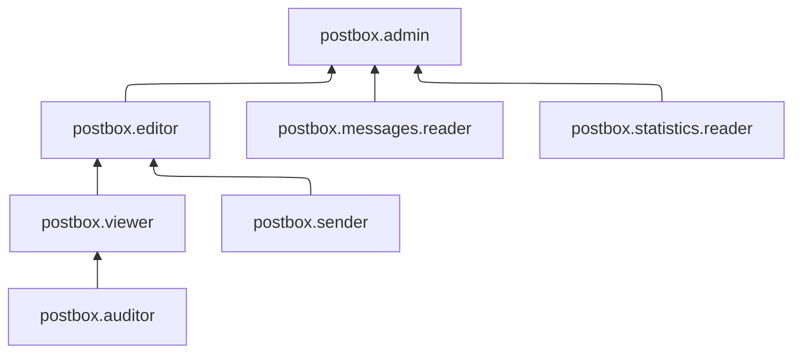

# Управление доступом в {{ postbox-full-name }}

Пользователь {{ yandex-cloud }} может выполнять только те операции над ресурсами, которые разрешены назначенными ему [ролями](../../iam/concepts/access-control/roles.md). Пока у пользователя нет никаких ролей, почти все операции ему запрещены.

Чтобы разрешить доступ к ресурсам сервиса {{ postbox-name }}, назначьте аккаунту на Яндексе, [сервисному аккаунту](../../iam/concepts/users/service-accounts.md), [федеративным](../../iam/concepts/users/accounts.md#saml-federation) или [локальным](../../iam/concepts/users/accounts.md#local) пользователям, [группе пользователей](../../organization/operations/manage-groups.md), [системной группе](../../iam/concepts/access-control/system-group.md) или [публичной группе](../../iam/concepts/access-control/public-group.md) нужные роли из приведенного ниже списка. На данный момент роль может быть назначена только на родительский ресурс (каталог или облако), роли которого наследуются вложенными ресурсами.

Подробнее о наследовании ролей читайте в разделе [Наследование прав доступа](../../resource-manager/concepts/resources-hierarchy.md#access-rights-inheritance) документации сервиса {{ resmgr-name }}.

## Какие роли действуют в сервисе {#roles-list}

Для управления правами доступа в {{ postbox-name }} можно использовать как сервисные, так и примитивные роли.

### Сервисные роли {#service-roles}

#### postbox.sender {#postbox-sender}

Роль `postbox.sender` позволяет отправлять письма из Yandex Cloud Postbox.

#### postbox.auditor {#postbox-auditor}

Роль `postbox.auditor` позволяет просматривать информацию об адресах Yandex Cloud Postbox.

Пользователи с этой ролью могут:
* просматривать информацию об [адресах](../concepts/glossary.md#adress) и их [конфигурациях](../concepts/glossary.md#configuration);
* получать списки адресов и их конфигураций.

#### postbox.viewer {#postbox-viewer}

Роль `postbox.viewer` позволяет просматривать информацию об адресах Yandex Cloud Postbox.

Пользователи с этой ролью могут:
* просматривать информацию об [адресах](../concepts/glossary.md#adress) и их [конфигурациях](../concepts/glossary.md#configuration);
* получать списки адресов и их конфигураций.

Включает разрешения, предоставляемые ролью `postbox.auditor`.

#### postbox.editor {#postbox-editor}

Роль `postbox.editor` позволяет управлять адресами Yandex Cloud Postbox и отправлять письма.

Пользователи с этой ролью могут:
* создавать, изменять и удалять [адреса](../concepts/glossary.md#adress) и их [конфигурации](../concepts/glossary.md#configuration);
* просматривать информацию об адресах и их конфигурациях;
* получать список адресов и их конфигураций;
* отправлять письма.

Включает разрешения, предоставляемые ролью `postbox.viewer`.

#### postbox.messages.reader {#postbox-messages-reader}

Роль `postbox.messages.reader` позволяет просматривать в разделе **{{ ui-key.yacloud.postbox.label_messages }}** [консоли управления]({{ link-console-main }}) информацию об отправленных письмах, включая сведения об отправителе, получателях, теме, дате отправки, а также о [метриках](../concepts/statistics.md#metrics) доставки и вовлеченности, жалобах и отписках.

#### postbox.statistics.reader {#postbox-statistics-reader}

Роль `postbox.statistics.reader` позволяет просматривать [статистику](../concepts/statistics.md) по отправленным письмам в разделе **{{ ui-key.yacloud.postbox.label_statistics }}** [консоли управления]({{ link-console-main }}).

#### postbox.admin {#postbox-admin}

Роль `postbox.admin` позволяет управлять адресами Yandex Cloud Postbox, отправлять письма, а также просматривать информацию об отправленных письмах и статистику по ним.

Пользователи с этой ролью могут:
* создавать, изменять и удалять [адреса](../concepts/glossary.md#adress) и их [конфигурации](../concepts/glossary.md#configuration);
* просматривать информацию об адресах и их конфигурациях;
* получать список адресов и их конфигураций;
* отправлять письма;
* просматривать [статистику](../concepts/statistics.md) по отправленным письмам в разделе **{{ ui-key.yacloud.postbox.label_statistics }}** [консоли управления]({{ link-console-main }});
* просматривать в разделе **{{ ui-key.yacloud.postbox.label_messages }}** консоли управления информацию об отправленных письмах, включая сведения об отправителе, получателях, теме, дате отправки, а также о [метриках](../concepts/statistics.md#metrics) доставки и вовлеченности, жалобах и отписках.

Включает разрешения, предоставляемые ролями `postbox.editor`, `postbox.messages.reader` и `postbox.statistics.reader`.

### Примитивные роли {#primitive-roles}

Примитивные роли позволяют пользователям совершать действия во [всех сервисах](../../overview/concepts/services.md) {{ yandex-cloud }}.

#### {{ roles-auditor }} {#auditor}

Роль `auditor` предоставляет разрешения на чтение конфигурации и метаданных любых ресурсов Yandex Cloud без возможности доступа к данным.

Например, пользователи с этой ролью могут:
* просматривать информацию о [ресурсе]({{ link-docs }}/resource-manager/concepts/resources-hierarchy);
* просматривать метаданные ресурса;
* просматривать список операций с ресурсом.

Роль `auditor` — наиболее безопасная роль, исключающая доступ к данным [сервисов]({{ link-docs }}/overview/concepts/services). Роль подходит для пользователей, которым необходим минимальный уровень доступа к ресурсам Yandex Cloud.

#### {{ roles-viewer }} {#viewer}

Роль `viewer` предоставляет разрешения на чтение информации о любых [ресурсах]({{ link-docs }}/resource-manager/concepts/resources-hierarchy) Yandex Cloud.

Включает разрешения, предоставляемые ролью `auditor`.

В отличие от роли `auditor`, роль `viewer` предоставляет доступ к данным [сервисов]({{ link-docs }}/overview/concepts/services) в режиме чтения.

#### {{ roles-editor }} {#editor}

Роль `editor` предоставляет разрешения на управление любыми [ресурсами]({{ link-docs }}/resource-manager/concepts/resources-hierarchy) Yandex Cloud, кроме назначения ролей другим пользователям, передачи прав владения [организацией]({{ link-docs }}/organization/concepts/organization) и ее удаления, а также удаления [ключей шифрования]({{ link-docs }}/kms/concepts/) Key Management Service.

Например, пользователи с этой ролью могут создавать, изменять и удалять ресурсы.

Включает разрешения, предоставляемые ролью `viewer`.

#### {{ roles-admin }} {#admin}

Роль `admin` позволяет назначать любые роли, кроме `resource-manager.clouds.owner` и `organization-manager.organizations.owner`, а также предоставляет разрешения на управление любыми [ресурсами]({{ link-docs }}/resource-manager/concepts/resources-hierarchy) Yandex Cloud, кроме передачи прав владения [организацией]({{ link-docs }}/organization/concepts/organization) и ее удаления.

Прежде чем назначить роль `admin` на организацию, [облако]({{ link-docs }}/resource-manager/concepts/resources-hierarchy#cloud) или [платежный аккаунт]({{ link-docs }}/billing/concepts/billing-account), ознакомьтесь с информацией о защите [привилегированных аккаунтов]({{ link-docs }}/security/standard/all#privileged-users).

Включает разрешения, предоставляемые ролью `editor`.

Вместо примитивных ролей мы рекомендуем использовать роли сервисов. Такой подход позволит более гранулярно управлять доступом и обеспечить соблюдение [принципа минимальных привилегий](../../security/standard/all.md#min-privileges).

Подробнее о примитивных ролях см. в [справочнике ролей {{ yandex-cloud }}](../../iam/roles-reference.md#primitive-roles).

## См. также {#see-also}

[Структура ресурсов {{ yandex-cloud }}](../../resource-manager/concepts/resources-hierarchy.md)