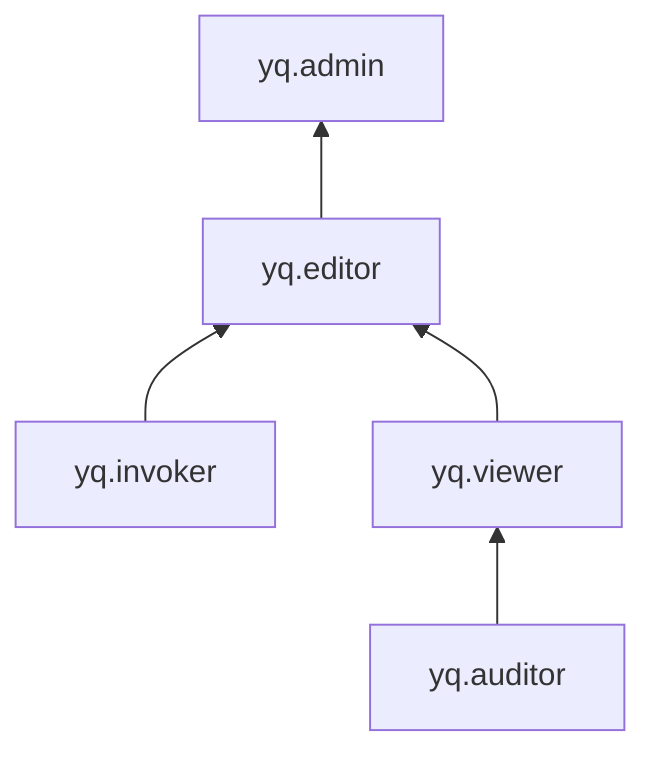

# Управление доступом в Query

Для управления правами доступа в Query используются [роли](../../iam/concepts/access-control/roles.md).

Пользователь Yandex Cloud может выполнять только те операции над ресурсами, которые разрешены назначенными ему [ролями](../../iam/concepts/access-control/roles.md). Пока у пользователя нет никаких ролей, почти все операции ему запрещены.

Чтобы разрешить доступ к ресурсам сервиса Yandex Query, назначьте аккаунту на Яндексе, [сервисному аккаунту](../../iam/concepts/users/service-accounts.md), [федеративным](../../iam/concepts/users/accounts.md#saml-federation) или [локальным](../../iam/concepts/users/accounts.md#local) пользователям, [группе пользователей](../../organization/operations/manage-groups.md), [системной группе](../../iam/concepts/access-control/system-group.md) или [публичной группе](../../iam/concepts/access-control/public-group.md) нужные роли из приведенного ниже списка. На данный момент роль может быть назначена только на родительский ресурс (каталог или облако), роли которого наследуются вложенными ресурсами.

Подробнее о наследовании ролей читайте в разделе [Наследование прав доступа](../../resource-manager/concepts/resources-hierarchy.md#access-rights-inheritance) документации сервиса Yandex Resource Manager.

Назначать роли на ресурс могут пользователи, у которых на этот ресурс есть роль `yq.admin` или одна из следующих ролей:

* `admin`;
* `resource-manager.admin`;
* `organization-manager.admin`;
* `resource-manager.clouds.owner`;
* `organization-manager.organizations.owner`.

## Назначение ролей {#grant-roles}

Чтобы назначить пользователю роль:

1. При необходимости [добавьте](../../organization/operations/add-account.md) нужного пользователя.
1. В [консоли управления](https://console.yandex.cloud) слева [выберите](../../resource-manager/operations/cloud/switch-cloud.md) облако.
1. Перейдите на вкладку **Права доступа**.
1. Нажмите кнопку **Настроить доступ**.
1. В открывшемся окне выберите раздел **Пользовательские аккаунты**.
1. Выберите пользователя из списка или воспользуйтесь поиском.
1. Нажмите кнопку  **Добавить роль** и выберите роль в облаке.
1. Нажмите кнопку **Сохранить**.

## Какие роли действуют в сервисе {#roles-list}

Управлять доступом к объектам Query можно как с помощью сервисных, так и с помощью примитивных ролей. На диаграмме показано, какие роли есть в сервисе и как они наследуют разрешения друг друга. Например, в `editor` входят все разрешения `viewer`. После диаграммы дано описание каждой роли.

Ниже перечислены все роли, которые учитываются при проверке прав доступа в сервисе Query.

### Сервисные роли {#service-roles}

#### yq.auditor {#query-auditor}

Роль `yq.auditor` позволяет просматривать метаданные сервиса, в том числе информацию о [каталоге](../../resource-manager/concepts/resources-hierarchy.md#folder), [соединениях](../concepts/glossary.md#connection), [привязках](../concepts/glossary.md#binding), [запросах](../concepts/glossary.md#query) и [запусках](../concepts/glossary.md#jobs).

#### yq.viewer {#query-viewer}

Роль `yq.auditor` позволяет просматривать метаданные сервиса, в том числе информацию о [каталоге](../../resource-manager/concepts/resources-hierarchy.md#folder), [соединениях](../concepts/glossary.md#connection), [привязках](../concepts/glossary.md#binding), [запросах](../concepts/glossary.md#query) и [запусках](../concepts/glossary.md#jobs), включая текст запросов и их результаты.

Включает разрешения, предоставляемые ролью `yq.auditor`.

#### yq.editor {#query-editor}

Пользователь с ролью `yq.editor` может управлять соединениями и запросами, созданными им. 

Пользователи с этой ролью могут:
* просматривать информацию о [запросах](../concepts/glossary.md#query), созданных этими пользователями, и [запусках](../concepts/glossary.md#jobs) таких запросов, в том числе просматривать текст запросов и их результаты;
* создавать запросы, а также запускать и отменять выполнение запросов, созданных этими пользователями;
* просматривать информацию о [соединениях](../concepts/glossary.md#connection), а также создавать, использовать, изменять и удалять их;
* просматривать информацию о [привязках](../concepts/glossary.md#binding), а также создавать, использовать, изменять и удалять их;
* просматривать информацию о [каталоге](../../resource-manager/concepts/resources-hierarchy.md#folder).

Включает разрешения, предоставляемые ролями `yq.viewer` и `yq.invoker`.

#### yq.admin {#query-admin}

Роль `yq.admin` позволяет управлять любыми ресурсами Yandex Query, в том числе помеченными как приватные.

Пользователи с этой ролью могут:
* просматривать информацию о [запросах](../concepts/glossary.md#query) и [запусках](../concepts/glossary.md#jobs) запросов, в том числе просматривать текст запросов и их результаты;
* создавать запросы, а также запускать их и отменять запуски;
* просматривать информацию о [соединениях](../concepts/glossary.md#connection), а также создавать, использовать, изменять и удалять их;
* просматривать информацию о [привязках](../concepts/glossary.md#binding), а также создавать, использовать, изменять и удалять их;
* просматривать информацию о [каталоге](../../resource-manager/concepts/resources-hierarchy.md#folder).

Включает разрешения, предоставляемые ролью `yq.editor`.

#### yq.invoker {#query-invoker}

Роль `yq.invoker` позволяет создавать и запускать [запросы](../concepts/glossary.md#query), использовать [соединения](../concepts/glossary.md#connection) и [привязки](../concepts/glossary.md#binding), а также просматривать информацию о [каталоге](../../resource-manager/concepts/resources-hierarchy.md#folder) и запросах, включая их текст и результаты.

Роль предназначена для автоматизации выполнения запросов сервисными аккаунтами. Например, для запуска запросов по событию или по расписанию.

### Примитивные роли {#primitive-roles}

#### viewer

Пользователь с ролью `viewer` может просматривать информацию о ресурсах, например, о запусках запроса.

#### editor

Пользователь с ролью `editor` может управлять любыми ресурсами, например, создать или удалить запрос. Роль `editor` включает в себя все разрешения роли `viewer`.

#### admin

Пользователь с ролью `admin` может управлять правами доступа к ресурсам, например, разрешить другим пользователям создавать запросы. Роль `admin` включает в себя все разрешения роли `editor`.