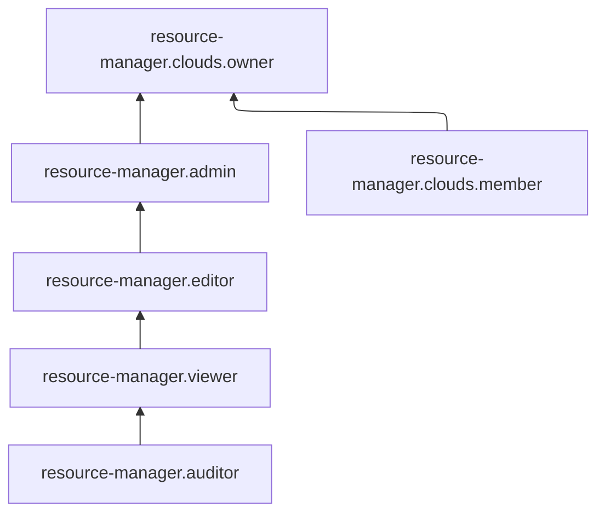

# Управление доступом в Resource Manager

В этом разделе вы узнаете:
* [на какие ресурсы можно назначить роль](#resources);
* [какие роли действуют в сервисе](#roles-list);
* [какие роли необходимы](#required-roles) для того или иного действия.

## Об управлении доступом {#about-access-control}

Все операции в Yandex Cloud проверяются в сервисе [Yandex Identity and Access Management](../../iam/index.md). Если у субъекта нет необходимых разрешений, сервис вернет ошибку.

Чтобы выдать разрешения к ресурсу, [назначьте роли](../../iam/operations/roles/grant.md) на этот ресурс субъекту, который будет выполнять операции. Роли можно назначить [аккаунту на Яндексе](../../iam/concepts/users/accounts.md#passport), [сервисному аккаунту](../../iam/concepts/users/service-accounts.md), [локальному пользователю](../../iam/concepts/users/accounts.md#local), [федеративному пользователю](../../iam/concepts/federations.md), [группе пользователей](../../organization/operations/manage-groups.md), [системной группе](../../iam/concepts/access-control/system-group.md) или [публичной группе](../../iam/concepts/access-control/public-group.md). Подробнее читайте в разделе [Как устроено управление доступом в Yandex Cloud](../../iam/concepts/access-control/index.md).

Назначать роли на ресурс могут пользователи, у которых на этот ресурс есть хотя бы одна из ролей:

* `admin`;
* `resource-manager.admin`;
* `organization-manager.admin`;
* `resource-manager.clouds.owner`;
* `organization-manager.organizations.owner`.

## На какие ресурсы можно назначить роль {#resources}

Роль можно назначить на [организацию](../../organization/concepts/organization.md), [облако](../concepts/resources-hierarchy.md#cloud) и [каталог](../concepts/resources-hierarchy.md#folder). Роли, назначенные на организацию, облако или каталог, действуют и на вложенные ресурсы.



Даже если [операция](../../api-design-guide/concepts/about-async.md) с ресурсами [сервисов](../../overview/concepts/services.md) Yandex Cloud разрешена [ролью](../../iam/concepts/access-control/roles.md), ее выполнение может быть заблокировано, если для [организации](../../organization/concepts/organization.md), [облака](../concepts/resources-hierarchy.md#cloud) или [каталога](../concepts/resources-hierarchy.md#folder) создана [политика авторизации](../../iam/concepts/access-control/access-policies.md), запрещающая эту операцию.



## Какие роли действуют в сервисе {#roles-list}

На диаграмме показано, какие роли есть в сервисе и как они наследуют разрешения друг друга. Например, в `editor` входят все разрешения `viewer`. После диаграммы дано описание каждой роли.

### Сервисные роли {#service-roles}

#### resource-manager.auditor {#resource-manager-auditor}

Роль `resource-manager.auditor` позволяет просматривать метаинформацию облаков и каталогов, а также информацию о назначенных правах доступа к облакам и каталогам.

Пользователи с этой ролью могут:
* просматривать информацию об [облаках](../concepts/resources-hierarchy.md#cloud) и их настройках, а также о назначенных [правах доступа](../../iam/concepts/access-control/index.md) к облакам;
* просматривать информацию о [каталогах](../concepts/resources-hierarchy.md#folder) и их настройках, а также о назначенных правах доступа к каталогам;
* просматривать [политики авторизации](../../iam/concepts/access-control/access-policies.md), назначенные на облака и каталоги;
* просматривать информацию о [квотах](../concepts/limits.md#resmgr-quotas) сервиса Resource Manager.

#### resource-manager.viewer {#resource-manager-viewer}

Роль `resource-manager.viewer` позволяет просматривать информацию об облаках и каталогах, а также о назначенных правах доступа к облакам и каталогам.

Пользователи с этой ролью могут:
* просматривать информацию об [облаках](../concepts/resources-hierarchy.md#cloud) и их настройках, а также о назначенных [правах доступа](../../iam/concepts/access-control/index.md) к облакам;
* просматривать информацию о [каталогах](../concepts/resources-hierarchy.md#folder) и их настройках, а также о назначенных правах доступа к каталогам;
* просматривать [политики авторизации](../../iam/concepts/access-control/access-policies.md), назначенные на облака и каталоги;
* просматривать информацию о [квотах](../concepts/limits.md#resmgr-quotas) сервиса Resource Manager.

Включает разрешения, предоставляемые ролью `resource-manager.auditor`.

#### resource-manager.editor {#resource-manager-editor}

Роль `resource-manager.editor` позволяет управлять облаками и каталогами, а также просматривать информацию о назначенных правах доступа к облакам и каталогам.

Пользователи с этой ролью могут:
* просматривать информацию об [облаках](../concepts/resources-hierarchy.md#cloud), их настройках и назначенных [правах доступа](../../iam/concepts/access-control/index.md) к облакам, а также создавать, изменять и удалять облака;
* просматривать информацию о [каталогах](../concepts/resources-hierarchy.md#folder), их настройках и назначенных правах доступа к каталогам, а также создавать, изменять и удалять каталоги;
* просматривать [политики авторизации](../../iam/concepts/access-control/access-policies.md), назначенные на облака и каталоги;
* просматривать информацию о [квотах](../concepts/limits.md#resmgr-quotas) сервиса Resource Manager.

Включает разрешения, предоставляемые ролью `resource-manager.viewer`.

#### resource-manager.admin {#resource-manager-admin}

Роль `resource-manager.admin` позволяет управлять облаками и каталогами, а также доступом к ним.

Пользователи с этой ролью могут:
* просматривать информацию о назначенных [правах доступа](../../iam/concepts/access-control/index.md) к [облакам](../concepts/resources-hierarchy.md#cloud) и изменять такие права доступа;
* просматривать информацию об облаках и их настройках, а также создавать, изменять и удалять облака;
* просматривать информацию о назначенных правах доступа к [каталогам](../concepts/resources-hierarchy.md#folder) и изменять такие права доступа;
* просматривать [политики авторизации](../../iam/concepts/access-control/access-policies.md), назначенные на облака и каталоги, а также назначать такие политики на облака и каталоги и отзывать их;
* просматривать информацию о каталогах и их настройках, а также создавать, изменять и удалять каталоги;
* просматривать информацию о [квотах](../concepts/limits.md#resmgr-quotas) сервиса Resource Manager.

Включает разрешения, предоставляемые ролью `resource-manager.editor`.

#### resource-manager.clouds.member {#resource-manager-clouds-member}

Роль `resource-manager.clouds.member` позволяет просматривать информацию об облаке и обращаться в техническую поддержку Yandex Cloud.

Можно назначить только на облако.

Пользователи с этой ролью могут:
* просматривать список [обращений](../../support/overview.md#response-time) в техническую поддержку и информацию о них, а также создавать и закрывать такие обращения, оставлять в них комментарии и прикреплять файлы;
* просматривать информацию об [облаках](../concepts/resources-hierarchy.md#cloud) и их настройках.

#### resource-manager.clouds.owner {#resource-manager-clouds-owner}

Роль `resource-manager.clouds.owner` позволяет совершать любые действия в [облаке](../concepts/resources-hierarchy.md#cloud) и дочерних [ресурсах](../concepts/resources-hierarchy.md).

Роль также позволяет управлять привязкой облака к [платежному аккаунту](../../billing/concepts/billing-account.md), для этого у пользователя должны быть права на этот платежный аккаунт. Подробнее об управлении доступом к платежному аккаунту см. в [документации Yandex Cloud Billing](../../billing/security/index.md#billing-account).

По умолчанию пользователи с этой ролью получают [уведомления](../concepts/notify.md) о событиях в облаке и его каталогах.

Роль можно назначить только на облако. Пользователю, создающему облако, автоматически назначается данная роль на это облако.

Включает разрешения, предоставляемые ролями `admin` и `resource-manager.clouds.member`.

### Примитивные роли {#primitive-roles}

Примитивные роли позволяют пользователям совершать действия во [всех сервисах](../../overview/concepts/services.md) Yandex Cloud.

#### auditor {#auditor}

Роль `auditor` предоставляет разрешения на чтение конфигурации и метаданных любых ресурсов Yandex Cloud без возможности доступа к данным.

Например, пользователи с этой ролью могут:
* просматривать информацию о [ресурсе](../concepts/resources-hierarchy.md);
* просматривать метаданные ресурса;
* просматривать список операций с ресурсом.

Роль `auditor` — наиболее безопасная роль, исключающая доступ к данным [сервисов](../../overview/concepts/services.md). Роль подходит для пользователей, которым необходим минимальный уровень доступа к ресурсам Yandex Cloud.

#### viewer {#viewer}

Роль `viewer` предоставляет разрешения на чтение информации о любых [ресурсах](../concepts/resources-hierarchy.md) Yandex Cloud.

Включает разрешения, предоставляемые ролью `auditor`.

В отличие от роли `auditor`, роль `viewer` предоставляет доступ к данным [сервисов](../../overview/concepts/services.md) в режиме чтения.

#### editor {#editor}

Роль `editor` предоставляет разрешения на управление любыми [ресурсами](../concepts/resources-hierarchy.md) Yandex Cloud, кроме назначения ролей другим пользователям, передачи прав владения [организацией](../../organization/concepts/organization.md) и ее удаления, а также удаления [ключей шифрования](../../kms/concepts/index.md) Key Management Service.

Например, пользователи с этой ролью могут создавать, изменять и удалять ресурсы.

Включает разрешения, предоставляемые ролью `viewer`.

#### admin {#admin}

Роль `admin` позволяет назначать любые роли, кроме `resource-manager.clouds.owner` и `organization-manager.organizations.owner`, а также предоставляет разрешения на управление любыми [ресурсами](../concepts/resources-hierarchy.md) Yandex Cloud, кроме передачи прав владения [организацией](../../organization/concepts/organization.md) и ее удаления.

Прежде чем назначить роль `admin` на организацию, [облако](../concepts/resources-hierarchy.md#cloud) или [платежный аккаунт](../../billing/concepts/billing-account.md), ознакомьтесь с информацией о защите [привилегированных аккаунтов](../../security/standard/all.md#privileged-users).

Включает разрешения, предоставляемые ролью `editor`.

Вместо примитивных ролей мы рекомендуем использовать роли сервисов. Такой подход позволит более гранулярно управлять доступом и обеспечить соблюдение [принципа минимальных привилегий](../../security/standard/all.md#min-privileges).

Подробнее о примитивных ролях в [справочнике ролей Yandex Cloud](../../iam/roles-reference.md#primitive-roles).

## Какие роли мне необходимы {#required-roles}

В таблице ниже перечислено, какие роли нужны для выполнения указанного действия. Вы всегда можете назначить роль, которая дает более широкие разрешения, нежели указанная. Например, назначить `editor` вместо `viewer`.

Действие | Методы | Необходимые роли
----- | ----- | -----
**Просмотр информации** | |
Просмотр информации о любом ресурсе | `get`, `list` | `viewer` на этот ресурс
Просмотр информации о каталоге или облаке | `get`, `list` | `resource-manager.viewer` на каталог или облако
Просмотр метаинформации о каталоге или облаке | `get`, `list` | `resource-manager.auditor` на каталог или облако
**Управление ресурсами** | |
[Создание облака](../operations/cloud/create.md) | | Для создания первого облака роли не требуются, только аутентификация (так как пользователю автоматически назначается роль `resource-manager.clouds.owner` в созданной организации). В дальнейшем требуется роль `resource-manager.editor` или `editor` на организацию
[Изменение облака](../operations/cloud/update.md) | `update` | `editor` или `resource-manager.editor` на облако
[Удаление облака](../operations/cloud/delete.md) | `delete` | `resource-manager.clouds.owner` на облако
[Создание каталога в облаке](../operations/folder/create.md) | `create` | `editor` или `resource-manager.editor` на облако
[Изменение каталога](../operations/folder/update.md) | `update` | `editor` или `resource-manager.editor` на каталог
[Удаление каталога](../operations/folder/delete.md) | `delete` | `editor` или `resource-manager.editor` на каталог
**Управление доступом к ресурсам** | |
Приглашение нового пользователя в организазцию | | `organization-manager.admin` |
[Сделать нового пользователя владельцем облака](../operations/cloud/set-access-bindings.md) | `setAccessBindings`, `updateAccessBindings` | `resource-manager.clouds.owner` на это облако
Просмотр назначенных ролей на ресурс | `listAccessBindings` | `viewer` на этот ресурс
Просмотр назначенных ролей на каталог или облако | `listAccessBindings` | `resource-manager.viewer` на каталог или облако
[Назначение роли](../../iam/operations/roles/grant.md), [отзыв роли](../../iam/operations/roles/revoke.md) на каталог или облако | `setAccessBindings`, `updateAccessBindings` | `admin` или `resource-manager.admin` на каталог или облако

#### Что дальше {#what-is-next}

* [Как назначить роль](../../iam/operations/roles/grant.md).
* [Как отозвать роль](../../iam/operations/roles/revoke.md).
* [Подробнее об управлении доступом в Yandex Cloud](../../iam/concepts/access-control/index.md).
* [Подробнее о наследовании ролей](../concepts/resources-hierarchy.md#access-rights-inheritance).