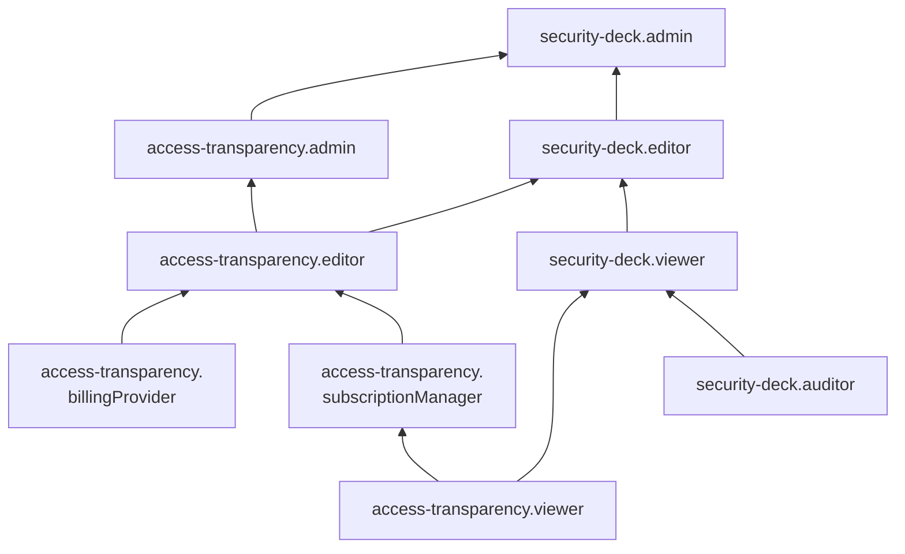

# Роли для анализа данных {{ atr-name }}

С помощью сервисных ролей {{ atr-name }} вы сможете настраивать модуль, а также просматривать аналитическую информацию о действиях, производимых инженерами {{ yandex-cloud }} с ресурсами организации в ходе технического обслуживания, работы с [обращениями](../../support/overview.md) или решения задач безопасности.

#### access-transparency.viewer {#access-transparency-viewer}

Роль `access-transparency.viewer` позволяет просматривать список событий доступа к ресурсам организации со стороны сотрудников {{ yandex-cloud }}, а также выражать согласие или несогласие с результатами подготовленного нейросетью анализа таких событий.

#### access-transparency.editor {#access-transparency-editor}

Роль `access-transparency.editor` позволяет выбирать платежный аккаунт в модуле {{ atr-name }}, управлять подписками организации на события доступа к ресурсам организации со стороны сотрудников {{ yandex-cloud }}, просматривать список таких событий, а также выражать согласие или несогласие с результатами подготовленного нейросетью анализа таких событий.

Включает разрешения, предоставляемые ролями `access-transparency.billingProvider` и `access-transparency.subscriptionManager`.

#### access-transparency.admin {#access-transparency-admin}

Роль `access-transparency.admin` позволяет выбирать платежный аккаунт в модуле {{ atr-name }}, управлять подписками организации на события доступа к ресурсам организации со стороны сотрудников {{ yandex-cloud }}, просматривать список таких событий, а также выражать согласие или несогласие с результатами подготовленного нейросетью анализа таких событий.

Включает разрешения, предоставляемые ролью `access-transparency.editor`.

#### access-transparency.billingProvider {#access-transparency-billingProvider}

Роль `access-transparency.billingProvider` позволяет выбирать платежный аккаунт в модуле {{ atr-name }}.

#### access-transparency.subscriptionManager {#access-transparency-subscriptionManager}

Роль `access-transparency.subscriptionManager` позволяет управлять подписками организации на события доступа к ресурсам организации со стороны сотрудников {{ yandex-cloud }}, просматривать список таких событий, а также выражать согласие или несогласие с результатами подготовленного нейросетью анализа таких событий.

Включает разрешения, предоставляемые ролью `access-transparency.viewer`.