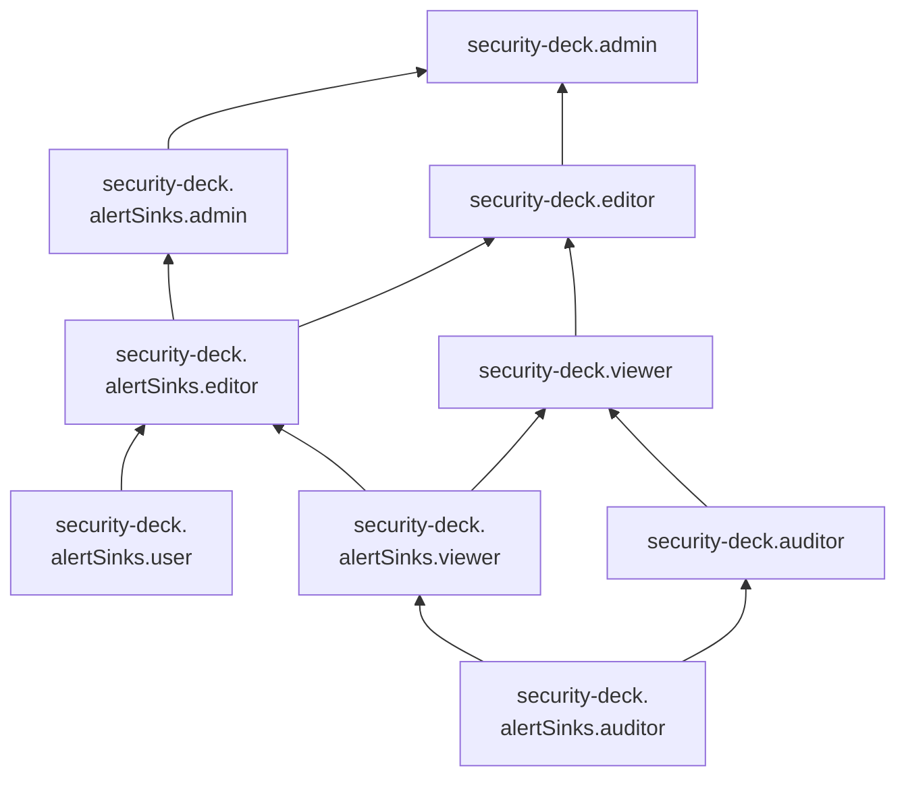

# Сервисные роли для модуля {{ alerts-name }}

С помощью сервисных ролей модуля [{{ alerts-name }}](../concepts/alerts.md) вы можете управлять ресурсами модуля и доступом к ним.

#### security-deck.alertSinks.user {#security-deck-alertSinks-user}

Роль `security-deck.alertSinks.user` позволяет просматривать информацию о [приемниках алертов](../concepts/workspace.md#alert-sinks) и использовать их.

#### security-deck.alertSinks.auditor {#security-deck-alertSinks-auditor}

Роль `security-deck.alertSinks.auditor` позволяет просматривать информацию о [приемниках алертов](../concepts/workspace.md#alert-sinks) и назначенных [правах доступа](../../iam/concepts/access-control/index.md) к ним.

#### security-deck.alertSinks.viewer {#security-deck-alertSinks-viewer}

Роль `security-deck.alertSinks.viewer` позволяет просматривать информацию об алертах и приемниках алертов, а также о назначенных правах доступа к ним.

Пользователи с этой ролью могут:
* просматривать информацию о [приемниках алертов](../concepts/workspace.md#alert-sinks) и назначенных [правах доступа](../../iam/concepts/access-control/index.md) к ним;
* просматривать информацию об [алертах](../concepts/alerts.md) и назначенных правах доступа к ним;
* просматривать дополнительную информацию об алертах и их источниках, а также перечень затронутых ресурсов и рекомендации по устранению проблем.

Включает разрешения, предоставляемые ролью `security-deck.alertSinks.auditor`.

#### security-deck.alertSinks.editor {#security-deck-alertSinks-editor}

Роль `security-deck.alertSinks.editor` позволяет управлять приемниками алертов, алертами и комментариями в них.

Пользователи с этой ролью могут:
* просматривать информацию о [приемниках алертов](../concepts/workspace.md#alert-sinks) и назначенных [правах доступа](../../iam/concepts/access-control/index.md) к ним;
* создавать, использовать, изменять и удалять приемники алертов;
* просматривать информацию об [алертах](../concepts/alerts.md) и назначенных правах доступа к ним;
* просматривать дополнительную информацию об алертах и их источниках, а также перечень затронутых ресурсов и рекомендации по устранению проблем;
* создавать, изменять и удалять алерты;
* просматривать список комментариев к алертам, а также создавать, изменять и удалять комментарии.

Включает разрешения, предоставляемые ролями `security-deck.alertSinks.viewer` и `security-deck.alertSinks.user`.

#### security-deck.alertSinks.admin {#security-deck-alertSinks-admin}

Роль `security-deck.alertSinks.admin` позволяет управлять приемниками алертов и алертами, а также доступом к ним.

Пользователи с этой ролью могут:
* просматривать информацию о [приемниках алертов](../concepts/workspace.md#alert-sinks), а также создавать, использовать, изменять и удалять их;
* просматривать информацию о назначенных [правах доступа](../../iam/concepts/access-control/index.md) к приемникам алертов и изменять такие права доступа;
* просматривать информацию об [алертах](../concepts/alerts.md), а также создавать, изменять и удалять их;
* просматривать информацию о назначенных правах доступа к алертам и изменять такие права доступа;
* просматривать дополнительную информацию об алертах и их источниках, а также перечень затронутых ресурсов и рекомендации по устранению проблем;
* просматривать список комментариев к алертам, а также создавать, изменять и удалять комментарии.

Включает разрешения, предоставляемые ролью `security-deck.alertSinks.editor`.