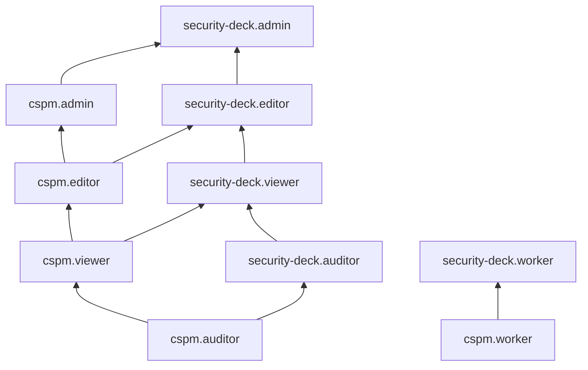

# Сервисные роли для модуля Контроль конфигурации (CSPM)

С помощью сервисных ролей модуля [Контроль конфигурации (CSPM)](../concepts/cspm.md) вы можете управлять доступом пользователей к ресурсам модуля CSPM и их настройкам, а также к данным, содержащимся в результатах проверок конфигурации на соответствие [стандартам безопасности](../concepts/cspm.md#standards).

#### cspm.worker {#cspm-worker}

Роль `cspm.worker` позволяет просматривать информацию об [организации](../../organization/concepts/organization.md), просматривать список [облаков](../../resource-manager/concepts/resources-hierarchy.md#cloud) и [каталогов](../../resource-manager/concepts/resources-hierarchy.md#folder), а также информацию о них в составе контролируемых ресурсов [окружения](../concepts/workspace.md) Security Deck.

Роль выдается [сервисному аккаунту](../../iam/concepts/users/service-accounts.md), от имени которого будет выполняться проверка на соответствие [стандартам безопасности](../concepts/cspm.md#standards), заданным в настройках [модуля CSPM](../concepts/cspm.md), и назначается на организацию, облако или каталог.

#### cspm.auditor {#cspm-auditor}

Роль `cspm.auditor` позволяет просматривать информацию о заданиях проверок инфраструктуры на соответствие [стандартам безопасности](../concepts/cspm.md#standards), заданным в настройках [модуля CSPM](../concepts/cspm.md).

#### cspm.viewer {#cspm-viewer}

Роль `cspm.viewer` позволяет просматривать информацию о заданиях проверок инфраструктуры на соответствие [стандартам безопасности](../concepts/cspm.md#standards), заданным в настройках [модуля CSPM](../concepts/cspm.md), о результатах таких проверок, а также о заданных [исключениях](../concepts/cspm.md#exceptions) из правил проверок.

Включает разрешения, предоставляемые ролью `cspm.auditor`.

#### cspm.editor {#cspm-editor}

Роль `cspm.editor` позволяет управлять заданиями проверок инфраструктуры на соответствие стандартам безопасности модуля CSPM и исключениями из правил проверок.

Пользователи с этой ролью могут:
* просматривать информацию о заданиях проверок инфраструктуры на соответствие [стандартам безопасности](../concepts/cspm.md#standards), заданным в настройках [модуля CSPM](../concepts/cspm.md);
* просматривать результаты проверок безопасности модуля CSPM;
* создавать, приостанавливать, возобновлять, изменять и удалять задания проверок модуля CSPM;
* просматривать заданные [исключения](../concepts/cspm.md#exceptions) из правил проверок модуля CSPM, а также создавать и удалять такие исключения.

Включает разрешения, предоставляемые ролью `cspm.viewer`.

#### cspm.admin {#cspm-admin}

Роль `cspm.admin` позволяет управлять заданиями проверок инфраструктуры на соответствие стандартам безопасности модуля CSPM и исключениями из правил проверок.

Пользователи с этой ролью могут:
* просматривать информацию о заданиях проверок инфраструктуры на соответствие [стандартам безопасности](../concepts/cspm.md#standards), заданным в настройках [модуля CSPM](../concepts/cspm.md);
* просматривать результаты проверок безопасности модуля CSPM;
* создавать, приостанавливать, возобновлять, изменять и удалять задания проверок модуля CSPM;
* просматривать заданные [исключения](../concepts/cspm.md#exceptions) из правил проверок модуля CSPM, а также создавать и удалять такие исключения.

Включает разрешения, предоставляемые ролью `cspm.editor`.