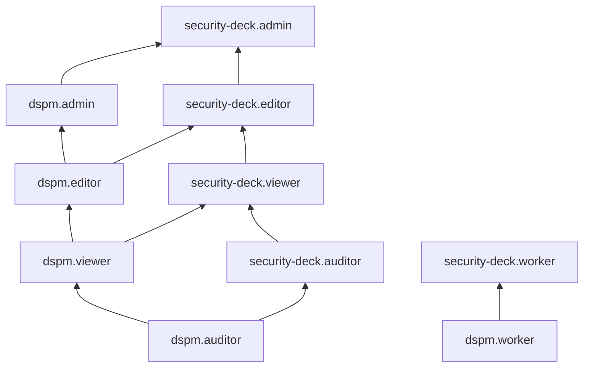

[Документация Yandex Cloud](../../index.md) > [Yandex Security Deck](../index.md) > [Управление доступом](index.md) > Роли DSPM

# Сервисные роли для контроля данных (DSPM)

С помощью сервисных ролей [модуля контроля данных](../concepts/dspm.md) (DSPM) вы можете управлять доступом пользователей к ресурсам модуля контроля данных и их настройкам, а также к данным, содержащимся в результатах сканирования источников на наличие чувствительной информации.

#### dspm.worker {#dspm-worker}

Роль `dspm.worker` позволяет просматривать информацию об [организации](../../organization/concepts/organization.md), просматривать список [облаков](../../resource-manager/concepts/resources-hierarchy.md#cloud), [каталогов](../../resource-manager/concepts/resources-hierarchy.md#folder) и [бакетов](../../storage/concepts/bucket.md) в заданной пользователем [области сканирования](../concepts/dspm.md#data-source) и информацию о них, а также просматривать данные в сканируемых бакетах.

Роль выдается [сервисному аккаунту](../../iam/concepts/users/service-accounts.md), от имени которого будет выполняться [сканирование](../concepts/dspm.md#scanning), и назначается на организацию, облако, каталог или бакет.

Роль не позволяет просматривать данные в [зашифрованных бакетах](../../storage/concepts/encryption.md). Для сканирования зашифрованного бакета дополнительно назначьте сервисному аккаунту [роль](../../kms/security/index.md#kms-keys-encrypter) `kms.keys.decrypter` на соответствующий [ключ шифрования](../../kms/concepts/key.md), либо на каталог, облако или организацию, в которой находится этот ключ.



Роль не может гарантировать доступа к бакету, если к бакету применена [политика доступа](../../storage/security/policy.md) Yandex Object Storage.



#### dspm.inspector {#dspm-inspector}

Роль `dspm.inspector` позволяет создавать источники данных DSPM с использованием заданных ресурсов Yandex Cloud. Чтобы создать источник данных в DSPM, эту роль необходимо назначить пользователю на соответствующий облачный ресурс.

Роль `dspm.inspector` устарела и больше не используется.

#### dspm.auditor {#dspm-auditor}

Роль `dspm.auditor` позволяет просматривать информацию о ресурсах сервиса DSPM, а также о заданиях сканирования и количестве найденных угроз безопасности. Роль не позволяет просматривать замаскированные и необработанные данные.

Пользователи с этой ролью могут:
* просматривать информацию о профилях DSPM;
* просматривать информацию об [источниках данных](../concepts/dspm.md#data-source) DSPM;
* просматривать информацию о заданиях [сканирования](../concepts/dspm.md#scanning) на угрозы безопасности.

#### dspm.viewer {#dspm-viewer}

Роль `dspm.viewer` позволяет просматривать информацию о ресурсах сервиса DSPM, а также о заданиях сканирования и количестве найденных угроз безопасности. Роль не позволяет просматривать замаскированные и необработанные данные.

Пользователи с этой ролью могут:
* просматривать информацию о профилях DSPM;
* просматривать информацию об [источниках данных](../concepts/dspm.md#data-source) DSPM;
* просматривать информацию о заданиях [сканирования](../concepts/dspm.md#scanning) на угрозы безопасности.

Включает разрешения, предоставляемые ролью `dspm.auditor`.

#### dspm.editor {#dspm-editor}

Роль `dspm.editor` позволяет использовать профили DSPM, управлять источниками данных и сканированием на угрозы безопасности. Роль не позволяет просматривать замаскированные и необработанные данные.

Пользователи с этой ролью могут:
* просматривать информацию о профилях DSPM и использовать их;
* просматривать информацию об [источниках данных](../concepts/dspm.md#data-source) DSPM, а также создавать, изменять, использовать и удалять их;
* просматривать информацию о заданиях [сканирования](../concepts/dspm.md#scanning) на угрозы безопасности, а также создавать, запускать, изменять и удалять такие задания.

Включает разрешения, предоставляемые ролью `dspm.viewer`.

#### dspm.admin {#dspm-admin}

Роль `dspm.admin` позволяет использовать профили DSPM, управлять источниками данных и сканированием на угрозы безопасности, в том числе просматривать замаскированные и необработанные данные в результатах сканирования.

Пользователи с этой ролью могут:
* просматривать информацию о профилях DSPM и использовать их;
* просматривать информацию об [источниках данных](../concepts/dspm.md#data-source) DSPM, а также создавать, изменять, использовать и удалять их;
* использовать ресурсы Yandex Cloud в источниках данных DSPM;
* просматривать информацию о [категориях данных](../concepts/dspm.md#data-categories) DSPM;
* просматривать информацию о заданиях [сканирования](../concepts/dspm.md#scanning) на угрозы безопасности, а также создавать, изменять и удалять такие задания;
* запускать задания сканирования и просматривать их результаты и информацию об обнаруженных угрозах, в том числе просматривать замаскированные и необработанные данные в результатах сканирования.

Включает разрешения, предоставляемые ролью `dspm.editor`.