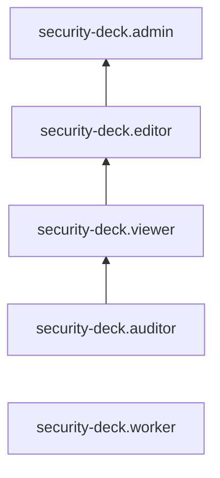

# Общие роли {{ sd-full-name }}

Пользователь {{ yandex-cloud }} может выполнять только те операции над ресурсами, которые разрешены назначенными ему [ролями](../../iam/concepts/access-control/roles.md). Пока у пользователя нет никаких ролей, почти все операции ему запрещены.

Чтобы разрешить доступ к ресурсам сервиса {{ sd-name }}, назначьте аккаунту на Яндексе, [сервисному аккаунту](../../iam/concepts/users/service-accounts.md), [федеративным](../../iam/concepts/users/accounts.md#saml-federation) или [локальным](../../iam/concepts/users/accounts.md#local) пользователям, [группе пользователей](../../organization/operations/manage-groups.md) или [системной группе](../../iam/concepts/access-control/system-group.md) нужные роли из приведенного ниже списка. На данный момент роль может быть назначена только на родительский ресурс (каталог или облако), роли которого наследуются вложенными ресурсами.

Подробнее о наследовании ролей читайте в разделе [Наследование прав доступа](../../resource-manager/concepts/resources-hierarchy.md#access-rights-inheritance) документации сервиса {{ resmgr-name }}.

## Какие роли действуют в сервисе {#roles-list}

Для управления правами доступа в {{ sd-name }} можно использовать как сервисные, так и примитивные роли.

### Сервисные роли {#service-roles}

#### security-deck.worker {#security-deck-worker}

Роль `security-deck.worker` позволяет просматривать информацию об области сканирования модуля {{ dspm-name }} и контролируемых ресурсах модулей {{ kspm-name }} и {{ cspm-name }} в {{ sd-name }}.

Пользователи с этой ролью могут:

* просматривать информацию об [организации](../../organization/concepts/organization.md), просматривать список [облаков](../../resource-manager/concepts/resources-hierarchy.md#cloud), [каталогов](../../resource-manager/concepts/resources-hierarchy.md#folder) и [бакетов](../../storage/concepts/bucket.md) в заданной пользователем модуля {{ dspm-name }} [области сканирования](../concepts/dspm.md#data-source) и информацию о них, а также просматривать данные в сканируемых бакетах;
* просматривать список облаков и каталогов и информацию о них в составе контролируемых ресурсов [окружения](../concepts/workspace.md) {{ sd-name }} для [модуля {{ kspm-name }}](../concepts/kspm.md);
* просматривать список кластеров {{ k8s }}, информацию о них и их настройках в составе контролируемых ресурсов окружения {{ sd-name }} для модуля {{ kspm-name }};
* просматривать информацию об организации, просматривать список облаков и каталогов и информацию о них в составе контролируемых ресурсов окружения {{ sd-name }} для [модуля {{ cspm-name }}](../concepts/cspm.md).

Роль выдается [сервисному аккаунту](../../iam/concepts/users/service-accounts.md), от имени которого будет выполняться [сканирование](../concepts/dspm.md#scanning) {{ dspm-name }}, проверка {{ kspm-name }} или {{ cspm-name }}. Роль назначается на организацию, облако, каталог или (при использовании [модуля {{ dspm-name }}](../concepts/dspm.md)) бакет.

Роль не позволяет просматривать данные в [зашифрованных бакетах](../../storage/concepts/encryption.md). Для сканирования зашифрованного бакета дополнительно назначьте сервисному аккаунту [роль](../../kms/security/index.md#kms-keys-encrypter) `kms.keys.decrypter` на соответствующий [ключ шифрования](../../kms/concepts/key.md), либо на каталог, облако или организацию, в которой находится этот ключ.

Включает разрешения, предоставляемые ролями `dspm.worker`, `kspm.worker` и `cspm.worker`.



Роль не может гарантировать доступа к бакету, если к бакету применена [политика доступа](../../storage/security/policy.md) {{ objstorage-full-name }}.



#### security-deck.auditor {#security-deck-auditor}

Роль `security-deck.auditor` позволяет просматривать информацию о ресурсах модулей {{ dspm-name }}, {{ cspm-name }} и {{ kspm-name }}, а также об алертах и приемниках алертов, о заданиях сканирования и количестве найденных угроз безопасности. Роль не позволяет просматривать замаскированные и необработанные данные.

Пользователи с этой ролью могут:
* просматривать информацию о профилях {{ dspm-name }};
* просматривать информацию об [источниках данных](../concepts/dspm.md#data-source) {{ dspm-name }};
* просматривать информацию о заданиях [сканирования](../concepts/dspm.md#scanning) на угрозы безопасности в модуле {{ dspm-name }};
* просматривать информацию о типах и [категориях](../concepts/dspm.md#data-categories) данных;
* просматривать результаты сканирования {{ dspm-name }} и информацию об обнаруженных угрозах безопасности;
* просматривать информацию об [окружениях](../concepts/workspace.md) {{ sd-name }} и контролируемых в них ресурсах, а также о назначенных [правах доступа](../../iam/concepts/access-control/index.md) к ним;
* просматривать информацию о [коннекторах](../concepts/workspace.md#connectors);
* просматривать информацию о заданиях проверок инфраструктуры на соответствие [стандартам безопасности](../concepts/cspm.md#standards), заданным в настройках [модуля CSPM](../concepts/cspm.md);
* просматривать информацию о настройках [модуля {{ kspm-name }}](../concepts/kspm.md) и операциях в модуле, а также список исключений из правил;
* просматривать информацию о [приемниках алертов](../concepts/workspace.md#alert-sinks) и назначенных правах доступа к ним.

Включает разрешения, предоставляемые ролями `dspm.auditor`, `cspm.auditor`, `kspm.auditor` и `security-deck.alertSinks.auditor`.

#### security-deck.viewer {#security-deck-viewer}

Роль `security-deck.viewer` позволяет просматривать информацию о событиях доступа к ресурсам организации со стороны сотрудников {{ yandex-cloud }}, информацию о ресурсах модулей {{ dspm-name }}, {{ cspm-name }} и {{ kspm-name }}, а также об алертах и приемниках алертов, о заданиях сканирования и количестве найденных угроз безопасности. Роль не позволяет просматривать замаскированные и необработанные данные.



* просматривать список событий доступа к ресурсам организации со стороны сотрудников {{ yandex-cloud }};
* выражать согласие или несогласие с результатами подготовленного нейросетью анализа событий доступа к ресурсам организации со стороны сотрудников {{ yandex-cloud }};
* просматривать информацию о профилях {{ dspm-name }};
* просматривать информацию об [источниках данных](../concepts/dspm.md#data-source) {{ dspm-name }};
* просматривать информацию о заданиях [сканирования](../concepts/dspm.md#scanning) на угрозы безопасности в модуле {{ dspm-name }};
* просматривать информацию о типах и [категориях](../concepts/dspm.md#data-categories) данных;
* просматривать результаты сканирования {{ dspm-name }} и информацию об обнаруженных угрозах безопасности;
* просматривать информацию об [окружениях](../concepts/workspace.md) {{ sd-name }} и контролируемых в них ресурсах, а также о назначенных [правах доступа](../../iam/concepts/access-control/index.md) к ним;
* просматривать информацию о [коннекторах](../concepts/workspace.md#connectors);
* просматривать информацию о заданиях проверок инфраструктуры на соответствие [стандартам безопасности](../concepts/cspm.md#standards), заданным в настройках [модуля {{ cspm-name }}](../concepts/cspm.md), о результатах таких проверок, а также о заданных [исключениях](../concepts/cspm.md#exceptions) из правил проверок;
* просматривать информацию о настройках [модуля {{ kspm-name }}](../concepts/kspm.md), [кластерах](../../managed-kubernetes/concepts/index.md#kubernetes-cluster) {{ managed-k8s-name }}, подключенных к {{ kspm-name }}, исключениях из правил, исключениях из области контроля, пользователях {{ kspm-name }} и операциях в модуле;
* просматривать информацию о [приемниках алертов](../concepts/workspace.md#alert-sinks) и назначенных правах доступа к ним;
* просматривать информацию об [алертах](../concepts/alerts.md) и назначенных правах доступа к ним;
* просматривать дополнительную информацию об алертах и их источниках, а также перечень затронутых ресурсов и рекомендации по устранению проблем.



Включает разрешения, предоставляемые ролями `access-transparency.viewer`, `dspm.viewer`, `cspm.viewer`, `kspm.viewer` и `security-deck.alertSinks.viewer`.

#### security-deck.editor {#security-deck-editor}

Роль `security-deck.editor` позволяет управлять подписками на события доступа к ресурсам организации со стороны сотрудников {{ yandex-cloud }}, управлять окружениями, алертами и приемниками алертов, а также ресурсами модулей {{ dspm-name }}, {{ cspm-name }} и {{ kspm-name }}. Роль не позволяет просматривать замаскированные и необработанные данные.



* выбирать [платежный аккаунт](../../billing/concepts/billing-account.md) в модуле {{ atr-name }};
* просматривать информацию о подписках на события доступа к ресурсам организации со стороны сотрудников {{ yandex-cloud }}, а также создавать, удалять и отменять удаление таких подписок;
* просматривать список событий доступа к ресурсам организации со стороны сотрудников {{ yandex-cloud }};
* выражать согласие или несогласие с результатами подготовленного нейросетью анализа событий доступа к ресурсам организации со стороны сотрудников {{ yandex-cloud }};
* просматривать информацию о профилях {{ dspm-name }} и использовать их;
* просматривать информацию об [источниках данных](../concepts/dspm.md#data-source) {{ dspm-name }}, а также создавать, изменять, использовать и удалять их;
* просматривать информацию о заданиях [сканирования](../concepts/dspm.md#scanning) {{ dspm-name }} на угрозы безопасности, а также создавать, изменять и удалять такие задания;
* запускать задания сканирования {{ dspm-name }} и просматривать их результаты и информацию об обнаруженных угрозах;
* просматривать информацию о типах и [категориях](../concepts/dspm.md#data-categories) данных {{ dspm-name }};
* просматривать метаданные [бакетов](../../storage/concepts/bucket.md);
* просматривать информацию об [окружениях](../concepts/workspace.md) {{ sd-name }} и контролируемых в них ресурсах, а также о назначенных [правах доступа](../../iam/concepts/access-control/index.md) к ним;
* создавать, изменять и удалять окружения {{ sd-name }};
* просматривать информацию о [коннекторах](../concepts/workspace.md#connectors), а также создавать, использовать, изменять и удалять их;
* просматривать информацию о заданиях проверок инфраструктуры на соответствие [стандартам безопасности](../concepts/cspm.md#standards), заданным в настройках [модуля {{ cspm-name }}](../concepts/cspm.md);
* просматривать результаты проверок безопасности модуля {{ cspm-name }};
* создавать, приостанавливать, возобновлять, изменять и удалять задания проверок модуля {{ cspm-name }};
* просматривать заданные [исключения](../concepts/cspm.md#exceptions) из правил проверок модуля {{ cspm-name }}, а также создавать и удалять такие исключения;
* задействовать, настраивать и отключать [модуль {{ kspm-name }}](../concepts/kspm.md), создавать, изменять и удалять исключения из правил, а также исключения из области контроля;
* просматривать информацию о [кластерах](../../managed-kubernetes/concepts/index.md#kubernetes-cluster) {{ managed-k8s-name }}, подключенных к {{ kspm-name }}, пользователях {{ kspm-name }} и операциях в модуле;
* просматривать информацию о [приемниках алертов](../concepts/workspace.md#alert-sinks) и назначенных правах доступа к ним;
* создавать, использовать, изменять и удалять приемники алертов;
* просматривать информацию об [алертах](../concepts/alerts.md) и назначенных правах доступа к ним;
* просматривать дополнительную информацию об алертах и их источниках, а также перечень затронутых ресурсов и рекомендации по устранению проблем;
* создавать, изменять и удалять алерты;
* просматривать список комментариев к алертам, а также создавать, изменять и удалять комментарии.



Включает разрешения, предоставляемые ролями `access-transparency.editor`, `dspm.editor`, `cspm.editor`, `kspm.editor` и `security-deck.alertSinks.editor`.

#### security-deck.admin {#security-deck-admin}

Роль `security-deck.admin` позволяет управлять подписками на события доступа к ресурсам организации со стороны сотрудников {{ yandex-cloud }}, управлять окружениями, алертами и приемниками алертов, а также ресурсами модулей {{ dspm-name }}, {{ cspm-name }} и {{ kspm-name }}. Роль позволяет просматривать замаскированные и необработанные данные в результатах сканирования.



* выбирать [платежный аккаунт](../../billing/concepts/billing-account.md) в модуле {{ atr-name }};
* просматривать информацию о подписках на события доступа к ресурсам организации со стороны сотрудников {{ yandex-cloud }}, а также создавать, удалять и отменять удаление таких подписок;
* просматривать список событий доступа к ресурсам организации со стороны сотрудников {{ yandex-cloud }};
* выражать согласие или несогласие с результатами подготовленного нейросетью анализа событий доступа к ресурсам организации со стороны сотрудников {{ yandex-cloud }};
* просматривать информацию о профилях {{ dspm-name }} и использовать их;
* просматривать информацию об [источниках данных](../concepts/dspm.md#data-source) {{ dspm-name }}, а также создавать, изменять, использовать и удалять их;
* использовать ресурсы {{ yandex-cloud }} в источниках данных {{ dspm-name }};
* просматривать информацию о типах и [категориях](../concepts/dspm.md#data-categories) данных {{ dspm-name }};
* просматривать информацию о заданиях [сканирования](../concepts/dspm.md#scanning) {{ dspm-name }} на угрозы безопасности, а также создавать, изменять и удалять такие задания;
* запускать задания сканирования {{ dspm-name }} и просматривать их результаты и информацию об обнаруженных угрозах, в том числе просматривать замаскированные и необработанные данные в результатах сканирования;
* просматривать метаданные [бакетов](../../storage/concepts/bucket.md);
* просматривать информацию об [окружениях](../concepts/workspace.md) {{ sd-name }} и контролируемых в них ресурсах, а также создавать, изменять и удалять окружения {{ sd-name }};
* просматривать информацию о назначенных [правах доступа](../../iam/concepts/access-control/index.md) к окружениям {{ sd-name }} и изменять такие права доступа;
* просматривать информацию о [коннекторах](../concepts/workspace.md#connectors), а также создавать, использовать, изменять и удалять их;
* просматривать информацию о заданиях проверок инфраструктуры на соответствие [стандартам безопасности](../concepts/cspm.md#standards), заданным в настройках [модуля {{ cspm-name }}](../concepts/cspm.md);
* просматривать результаты проверок безопасности модуля {{ cspm-name }};
* создавать, приостанавливать, возобновлять, изменять и удалять задания проверок модуля {{ cspm-name }};
* просматривать заданные [исключения](../concepts/cspm.md#exceptions) из правил проверок модуля {{ cspm-name }}, а также создавать и удалять такие исключения;
* задействовать, настраивать и отключать [модуль {{ kspm-name }}](../concepts/kspm.md), создавать, изменять и удалять исключения из правил, а также исключения из области контроля;
* просматривать информацию о [кластерах](../../managed-kubernetes/concepts/index.md#kubernetes-cluster) {{ managed-k8s-name }}, подключенных к {{ kspm-name }}, пользователях {{ kspm-name }} и операциях в модуле;
* просматривать информацию о [приемниках алертов](../concepts/workspace.md#alert-sinks), а также создавать, использовать, изменять и удалять их;
* просматривать информацию о назначенных правах доступа к приемникам алертов и изменять такие права доступа;
* просматривать информацию об [алертах](../concepts/alerts.md), а также создавать, изменять и удалять их;
* просматривать информацию о назначенных правах доступа к алертам и изменять такие права доступа;
* просматривать дополнительную информацию об алертах и их источниках, а также перечень затронутых ресурсов и рекомендации по устранению проблем;
* просматривать список комментариев к алертам, а также создавать, изменять и удалять комментарии.



Включает разрешения, предоставляемые ролями `access-transparency.admin`, `dspm.admin`, `cspm.admin`, `kspm.admin` и `security-deck.alertSinks.admin`.

Кроме того, {{ yandex-cloud }} поддерживает свой список ролей для каждого модуля, включенного в состав {{ sd-name }}. Подробнее читайте в соответствующих разделах:

* [Роли для контроля данных ({{ dspm-full-name }})](dspm-roles.md).
* [Роли для контроля безопасности с использованием модуля {{ kspm-name }}](kspm-roles.md).
* [Роли для диагностики доступов ({{ ciem-full-name }})](ciem-roles.md).
* [Роли для контроля безопасности с использованием модуля {{ cspm-name }}](cspm-roles.md).
* [Роли для анализа данных {{ atr-name }}](access-transparency-roles.md).
* [Роли для управления алертами и приемниками алертов](alerts-roles.md).

### Примитивные роли {#primitive-roles}

Примитивные роли позволяют пользователям совершать действия во [всех сервисах](../../overview/concepts/services.md) {{ yandex-cloud }}.

#### {{ roles-auditor }} {#auditor}

Роль `auditor` предоставляет разрешения на чтение конфигурации и метаданных любых ресурсов Yandex Cloud без возможности доступа к данным.

Например, пользователи с этой ролью могут:
* просматривать информацию о [ресурсе]({{ link-docs }}/resource-manager/concepts/resources-hierarchy);
* просматривать метаданные ресурса;
* просматривать список операций с ресурсом.

Роль `auditor` — наиболее безопасная роль, исключающая доступ к данным [сервисов]({{ link-docs }}/overview/concepts/services). Роль подходит для пользователей, которым необходим минимальный уровень доступа к ресурсам Yandex Cloud.

#### {{ roles-viewer }} {#viewer}

Роль `viewer` предоставляет разрешения на чтение информации о любых [ресурсах]({{ link-docs }}/resource-manager/concepts/resources-hierarchy) Yandex Cloud.

Включает разрешения, предоставляемые ролью `auditor`.

В отличие от роли `auditor`, роль `viewer` предоставляет доступ к данным [сервисов]({{ link-docs }}/overview/concepts/services) в режиме чтения.

#### {{ roles-editor }} {#editor}

Роль `editor` предоставляет разрешения на управление любыми [ресурсами]({{ link-docs }}/resource-manager/concepts/resources-hierarchy) Yandex Cloud, кроме назначения ролей другим пользователям, передачи прав владения [организацией]({{ link-docs }}/organization/concepts/organization) и ее удаления, а также удаления [ключей шифрования]({{ link-docs }}/kms/concepts/) Key Management Service.

Например, пользователи с этой ролью могут создавать, изменять и удалять ресурсы.

Включает разрешения, предоставляемые ролью `viewer`.

#### {{ roles-admin }} {#admin}

Роль `admin` позволяет назначать любые роли, кроме `resource-manager.clouds.owner` и `organization-manager.organizations.owner`, а также предоставляет разрешения на управление любыми [ресурсами]({{ link-docs }}/resource-manager/concepts/resources-hierarchy) Yandex Cloud, кроме передачи прав владения [организацией]({{ link-docs }}/organization/concepts/organization) и ее удаления.

Прежде чем назначить роль `admin` на организацию, [облако]({{ link-docs }}/resource-manager/concepts/resources-hierarchy#cloud) или [платежный аккаунт]({{ link-docs }}/billing/concepts/billing-account), ознакомьтесь с информацией о защите [привилегированных аккаунтов]({{ link-docs }}/security/standard/all#privileged-users).

Включает разрешения, предоставляемые ролью `editor`.

Вместо примитивных ролей мы рекомендуем использовать роли сервисов. Такой подход позволит более гранулярно управлять доступом и обеспечить соблюдение [принципа минимальных привилегий](../../security/standard/all.md#min-privileges).

Подробнее о примитивных ролях см. в [справочнике ролей {{ yandex-cloud }}](../../iam/roles-reference.md#primitive-roles).

## См. также {#see-also}

[Структура ресурсов {{ yandex-cloud }}](../../resource-manager/concepts/resources-hierarchy.md)