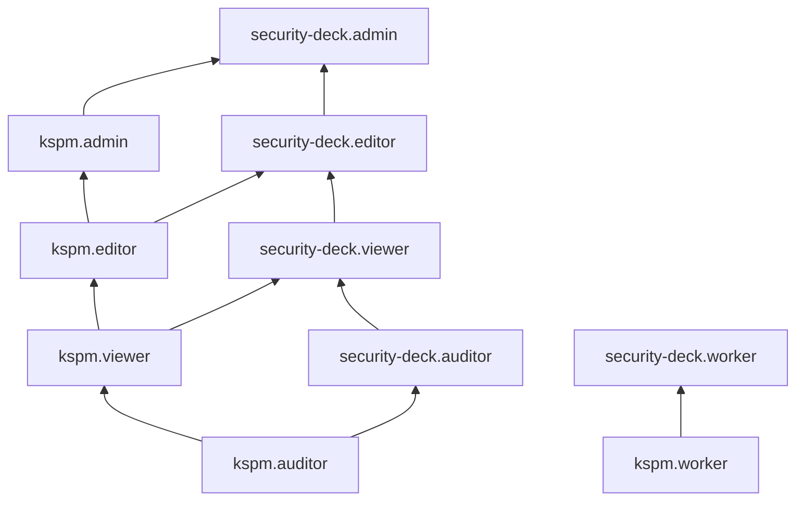

[Документация Yandex Cloud](../../index.md) > [Yandex Security Deck](../index.md) > [Управление доступом](index.md) > Роли KSPM

# Сервисные роли для модуля Контроль Kubernetes® (KSPM)

С помощью сервисных ролей [модуля Контроль Kubernetes®](../concepts/kspm.md) (KSPM) вы можете управлять доступом пользователей к ресурсам модуля и их настройкам, а также к данным, содержащимся в результатах контроля и алертам.

#### kspm.worker {#kspm-worker}

Роль `kspm.worker` позволяет просматривать информацию о [кластерах](../../managed-kubernetes/concepts/index.md#kubernetes-cluster) Managed Service for Kubernetes и устанавливать в них компоненты [модуля KSPM](../concepts/kspm.md).

Роль выдается [сервисному аккаунту](../../iam/concepts/users/service-accounts.md), от имени которого будут выполняться проверки кластера, и назначается на организацию, облако или каталог. Этот сервисный аккаунт указывается при [создании](../operations/workspaces/create.md) окружения.

#### kspm.auditor {#kspm-auditor}

Роль `kspm.auditor` позволяет просматривать информацию о настройках [модуля KSPM](../concepts/kspm.md), операциях в модуле и списке исключений из правил.

#### kspm.viewer {#kspm-viewer}

Роль `kspm.viewer` позволяет просматривать информацию о настройках [модуля KSPM](../concepts/kspm.md), [кластерах](../../managed-kubernetes/concepts/index.md#kubernetes-cluster) Managed Service for Kubernetes, подключенных к KSPM, исключениях из правил, исключениях из области контроля, пользователях KSPM и операциях в модуле.

Включает разрешения, предоставляемые ролью `kspm.auditor`.

#### kspm.editor {#kspm-editor}

Роль `kspm.editor` позволяет задействовать, настраивать и отключать [модуль KSPM](../concepts/kspm.md), создавать, изменять и удалять исключения из правил, а также исключения из области контроля, просматривать информацию о [кластерах](../../managed-kubernetes/concepts/index.md#kubernetes-cluster) Managed Service for Kubernetes, подключенных к KSPM, пользователях KSPM и операциях в модуле.

Включает разрешения, предоставляемые ролью `kspm.viewer`.

#### kspm.admin {#kspm-admin}

Роль `kspm.admin` позволяет задействовать, настраивать и отключать [модуль KSPM](../concepts/kspm.md), создавать, изменять и удалять исключения из правил, а также исключения из области контроля, просматривать информацию о [кластерах](../../managed-kubernetes/concepts/index.md#kubernetes-cluster) Managed Service for Kubernetes, подключенных к KSPM, пользователях KSPM и операциях в модуле.

Включает разрешения, предоставляемые ролью `kspm.editor`.