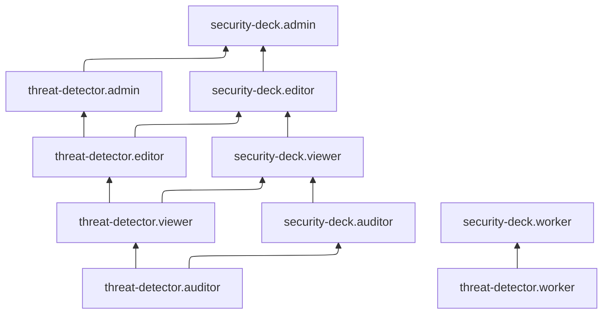

[Документация Yandex Cloud](../../index.md) > [Yandex Security Deck](../index.md) > [Управление доступом](index.md) > Роли TD

# Сервисные роли для модуля Обнаружение угроз (TD)

С помощью сервисных ролей [модуля Обнаружение угроз](../concepts/threat-detector.md) (TD) вы можете управлять доступом пользователей к ресурсам модуля и их настройкам, а также к данным о выявленных угрозах.

#### threat-detector.worker {#threat-detector-worker}

Роль `threat-detector.worker` позволяет просматривать логи, регистрируемые в инфраструктуре клиента, с помощью сервиса [Yandex Audit Trails](../../audit-trails/index.md).

Роль выдается [сервисному аккаунту](../../iam/concepts/users/service-accounts.md), от имени которого будет выполняться контроль безопасности с использованием модуля Обнаружение угроз, и назначается на организацию, облако или каталог. Этот сервисный аккаунт указывается при [создании](../operations/workspaces/create.md) окружения.

#### threat-detector.auditor {#threat-detector-auditor}

Роль `threat-detector.auditor` позволяет просматривать информацию о правилах контроля безопасности [модуля Обнаружение угроз](../concepts/threat-detector.md) и назначенных [правах доступа](../../iam/concepts/access-control/index.md) к нему.

#### threat-detector.viewer {#threat-detector-viewer}

Роль `threat-detector.viewer` позволяет просматривать информацию о правилах контроля безопасности [модуля Обнаружение угроз](../concepts/threat-detector.md) и назначенных [правах доступа](../../iam/concepts/access-control/index.md) к нему.

Включает разрешения, предоставляемые ролью `threat-detector.auditor`.

#### threat-detector.editor {#threat-detector-editor}

Роль `threat-detector.editor` позволяет просматривать информацию о назначенных [правах доступа](../../iam/concepts/access-control/index.md) к [модулю Обнаружение угроз](../concepts/threat-detector.md) и правилах контроля безопасности этого модуля, а также создавать исключения из правил контроля безопасности.

Включает разрешения, предоставляемые ролью `threat-detector.viewer`.

#### threat-detector.admin {#threat-detector-admin}

Роль `threat-detector.admin` позволяет просматривать информацию о правилах контроля безопасности [модуля Обнаружение угроз](../concepts/threat-detector.md), создавать исключения из правил контроля безопасности, а также просматривать информацию о назначенных [правах доступа](../../iam/concepts/access-control/index.md) к модулю Обнаружение угроз и изменять их.

Включает разрешения, предоставляемые ролью `threat-detector.editor`.