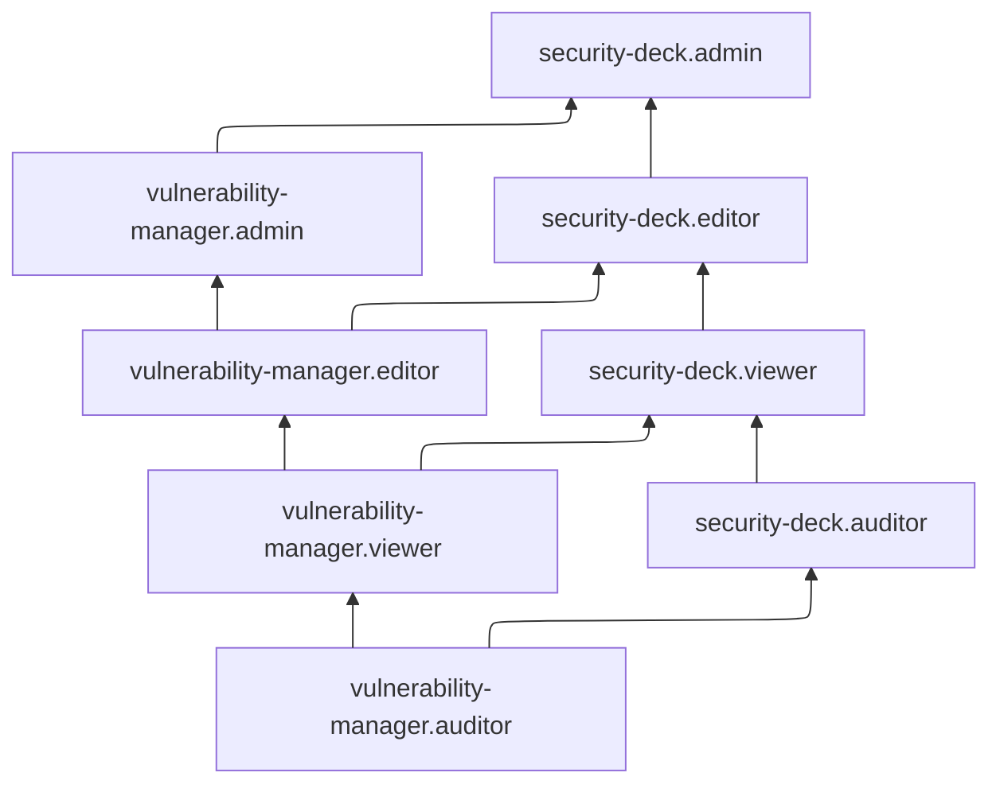

[Документация Yandex Cloud](../../index.md) > [Yandex Security Deck](../index.md) > [Управление доступом](index.md) > Роли VM

# Сервисные роли для модуля Управление уязвимостями (VM)

С помощью сервисных ролей [модуля Управление уязвимостями](../concepts/vulnerability-management.md) (VM) вы можете управлять доступом пользователей к ресурсам модуля и их настройкам, а также к результатам сканирований на уязвимости.

#### vulnerability-manager.auditor {#vulnerability-manager-auditor}

Роль `vulnerability-manager.auditor` позволяет просматривать результаты сканирования [модуля Управление уязвимостями](../concepts/vulnerability-management.md).

#### vulnerability-manager.viewer {#vulnerability-manager-viewer}

Роль `vulnerability-manager.viewer` позволяет просматривать информацию о заданиях сканирования [модуля Управление уязвимостями](../concepts/vulnerability-management.md) и результаты сканирования в рамках этих заданий.

Включает разрешения, предоставляемые ролью `vulnerability-manager.auditor`.

#### vulnerability-manager.editor {#vulnerability-manager-editor}

Роль `vulnerability-manager.editor` позволяет просматривать информацию о заданиях сканирования [модуля Управление уязвимостями](../concepts/vulnerability-management.md), запускать и изменять такие задания, а также просматривать результаты их выполнения.

Включает разрешения, предоставляемые ролью `vulnerability-manager.viewer`.

#### vulnerability-manager.admin {#vulnerability-manager-admin}

Роль `vulnerability-manager.admin` позволяет просматривать информацию о заданиях сканирования [модуля Управление уязвимостями](../concepts/vulnerability-management.md), запускать и изменять такие задания, а также просматривать результаты их выполнения.

Включает разрешения, предоставляемые ролью `vulnerability-manager.editor`.