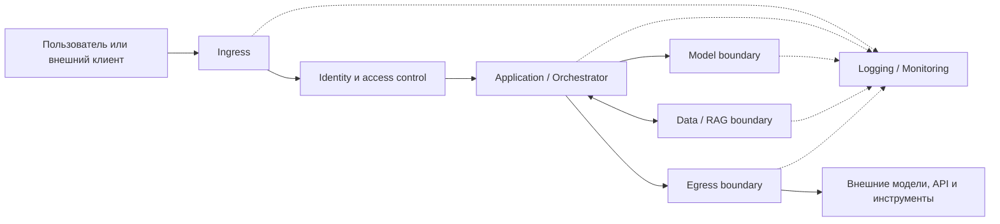

[Документация Yandex Cloud](../../index.md) > [Безопасность в Yandex Cloud](../index.md) > Стандарт безопасности для внедрения и эксплуатации ИИ-систем в Yandex Cloud, версия 1.0.0 > Все разделы на одной странице

# Стандарт безопасности для внедрения и эксплуатации ИИ-систем в Yandex Cloud, версия 1.0.0

<!-- Заголовки полной версии задаются здесь; текстовые блоки общие с отдельными страницами. При изменении структуры разделов обновите оба оглавления. -->

## Введение {#intro}

### Назначение и область применения {#scope}

Стандарт устанавливает требования и рекомендации по безопасности для систем искусственного интеллекта, развернутых полностью или частично в Yandex Cloud. Он предназначен для архитекторов, специалистов по информационной безопасности, разработчиков, ML- и DevSecOps-инженеров, владельцев сервисов, SOC и специалистов по соответствию требованиям.

Стандарт применяется к следующим сценариям:

* вызов моделей и API [Yandex AI Studio](https://aistudio.yandex.ru/docs/ru/);
* RAG на базе [AI Search](https://aistudio.yandex.ru/docs/ru/ai-studio/concepts/search/) или выбранного организацией хранилища;
* агенты, MCP Gateway, MCP-серверы и другие инструменты;
* обучение, эксперименты и развертывание моделей в [Yandex DataSphere](../../datasphere/index.md);
* работа ИИ-компонентов в [Yandex Managed Service for Kubernetes](../../managed-kubernetes/index.md), [Yandex Serverless Containers](../../serverless-containers/index.md), [Yandex Cloud Functions](../../functions/index.md) и [Yandex Compute Cloud](../../compute/index.md);
* использование самостоятельно размещенных моделей;
* вызов внешних модельных API из Yandex Cloud;
* обработка данных, модельных артефактов, системных инструкций, секретов и журналов на всех стадиях жизненного цикла.

Настоящий стандарт дополняет [стандарт по защите облачной инфраструктуры Yandex Cloud](../standard/all.md). Общие требования к облачным учетным записям, сети, виртуальной среде, шифрованию и журналам аудита сохраняют силу. Настоящий документ определяет дополнительные обязанности, возникающие из-за модельного вызова, недоверенного контекста, RAG, автономных действий, модельных артефактов и специфической телеметрии ИИ-приложения.

Стандарт можно рассматривать как основу для разработки внутренних политик организации. Не все требования могут быть применимы к конкретной системе; также могут потребоваться дополнительные меры, не включенные в документ.

### Разделение ответственности {#responsibility}

Граница ответственности зависит от используемого сервиса и способа его потребления. Общий принцип описан в [модели разделения ответственности Yandex Cloud](../respons.md).

Yandex Cloud отвечает за управляемую часть сервиса в пределах опубликованной документации. Организация, эксплуатирующая ИИ-систему, отвечает за:

* выбор облаков, каталогов, сервисов и режимов их использования;
* учетные записи, сервисные аккаунты, ключи, роли и область привязок;
* публичные точки входа, сетевые маршруты и связи с внешними системами;
* допустимость, минимизацию, классификацию и сроки хранения данных;
* прикладную проверку ввода, контекста и вывода модели;
* авторизацию документов до передачи в RAG-контекст;
* полномочия агента и его инструментов;
* прикладные журналы, корреляцию событий и реагирование;
* выпуск, замену и вывод из эксплуатации данных, индексов, моделей и конфигураций.

Наличие функции в облачном сервисе не означает, что требование выполнено. Владелец системы должен показать, что функция включена или отключена для нужного ресурса, охватывает фактический поток данных и проверена в используемых сценариях.

### Как применять стандарт {#how-to-apply}

До проверки требований нужно иметь описание фактической или планируемой архитектуры. В ней должны быть указаны:

* компоненты, среды и границы доверия;
* входные точки и вызываемые модельные API;
* облака, каталоги и идентификаторы ресурсов;
* пользователи, сервисные аккаунты, API-ключи и внешние субъекты;
* хранилища данных, RAG-индексы и места хранения модельных артефактов;
* пути входящего, исходящего и межкомпонентного трафика;
* инструменты агента, их бэкенды и целевые ресурсы;
* места обработки персональных и иных регулируемых данных;
* источники аудитных, прикладных и эксплуатационных журналов;
* внешние поставщики и получатели данных.

Слова «должен», «должна» и «должны» обозначают обязательное требование. Слово «рекомендуется» обозначает меру, выбор которой зависит от риска и архитектуры. Слово «может» обозначает допустимый способ реализации, но не единственный.

Условие применимости записывается обычным текстом внутри требования. Если условие отсутствует в архитектуре, проверяющий фиксирует, какой компонент, поток или тип данных отсутствует. Отсутствие свидетельства выполнения не является доказательством неприменимости.

### Исключения {#exceptions}

Исключение допускается только для конкретного требования, ресурса и срока. Владелец системы должен зафиксировать причину, затронутые активы, оценку риска, компенсирующие меры, ответственного, дату окончания и условия досрочного пересмотра. Исключение утверждает уполномоченная организацией сторона. После окончания срока требование проверяется заново.

Функция на стадии Preview или доступная по запросу может использоваться как мера только после подтверждения доступности для организации. Если она недоступна, владелец выбирает другой способ достижения требуемого состояния либо оформляет исключение; недоступность конкретного продукта не отменяет само требование.

### Идентификаторы {#identifiers}

Независимые проверяемые требования имеют стабильные идентификаторы `AI-*`. Идентификатор служит для ссылок и записей проверки и не кодирует критичность. Один идентификатор всегда обозначает одно требуемое состояние.

### Свидетельства {#evidence}

Свидетельство должно относиться к точному ресурсу, версии, субъекту и времени проверки. В записи указываются интерфейс или команда, ожидаемый и наблюдаемый результат и ссылка на минимальный артефакт: конфигурационный экспорт, привязки, событие, прикладная трассировка либо результат безопасного теста. Проектное описание без сопоставления с фактической конфигурацией не подтверждает выполнение.

Свидетельство не должно раскрывать значение секрета, избыточные персональные данные, полный диалог или закрытый документ. Если сервис не публикует нужное событие или настройку, это фиксируется как слепая зона и при необходимости закрывается прикладным журналом или ручным тестом; отсутствие телеметрии не превращается в успешный результат.

## Безопасная архитектура и разработка ИИ-приложений {#secure-architecture}

ИИ-приложение образует сквозной путь: вход пользователя или системы, прикладная логика, API, RAG-источники, агентные инструменты, внешние получатели и телеметрия. В `AI-SDLC1` фиксируется, где устанавливаются личность и полномочия субъекта, где данные становятся недоверенными, где модельный вывод превращается в действие и где запрос покидает границу контролируемой зоны.

Приложение должно быть разделено как минимум на следующие логические контуры:



| Контур | Назначение | Минимальный результат обеспечения безопасности |
|---|---|---|
| **Ingress** | Прием пользовательских и внешних запросов | Недоверенный ввод валидируется, ограничивается по размеру и частоте, а также отделяется от внутренних компонентов приложения |
| **Identity** | Аутентификация и авторизация пользователей, сервисов и агентов | Все субъекты имеют проверяемую идентичность; доступ предоставляется по принципу минимально необходимых привилегий |
| **Application** | Оркестрация бизнес-логики, сборка промпта, RAG-контекста и вызовов инструментов | Пользовательский ввод, системные инструкции, найденное содержимое и результаты инструментов обрабатываются как отдельные недоверенные источники |
| **Model** | Взаимодействие с LLM или иной AI-моделью | В модель передаются только минимально необходимые данные; секреты, учетные данные и неконтролируемые системные инструкции не включаются в промпт |
| **Data/RAG** | Загрузка, хранение, индексация и извлечение данных | RAG-контент имеет происхождение, классификацию и метаданные доступа; поиск возвращает только данные, разрешенные конкретному субъекту |
| **Egress** | Обращение к внешним LLM, API, плагинам и инструментам | Исходящие соединения разрешаются только к утвержденным получателям; передача данных контролируется, минимизируется и регистрируется |
| **Logging/Monitoring** | Аудит, обнаружение атак и расследование инцидентов | События позволяют восстановить цепочку запроса, решений приложения, обращений к данным, вызовов модели и инструментов без записи избыточных секретов или ПДн |

Приведенная схема является логической моделью для анализа, а не обязательной физической топологией: один компонент может реализовывать несколько контуров, а один контур — состоять из нескольких сервисов. Для каждого контура должны быть определены владелец, допустимые потоки данных, механизмы доступа, события аудита и процедуры реагирования. В архитектуре конкретной ИИ-системы может отсутствовать какая-либо ветвь (например, нет внешних вызовов или агентных инструментов).

### Архитектура и изменения {#architecture-changes}

#### Архитектура и риски зафиксированы до выпуска {#architecture-risks-fixed-before-release}

{#ai-sdlc1-id}

Идентификатор требования: `AI-SDLC1`

{#ai-sdlc1-requirement}

**Требование**

До первого продуктивного выпуска и после существенного изменения владелец системы должен описать компоненты, границы доверия, данные, субъекты, модельные вызовы, инструменты, внешние связи и возможные последствия ошибочного или враждебного поведения. Описание должно связывать каждый существенный риск с конкретной границей, мерой и способом проверки.

Для каждой связи указываются исходный субъект и ресурс, целевой ресурс или API, класс данных, протокол, способ аутентификации, сетевой путь, источник события и владелец.

Отдельно отмечаются точки контроля: `pre_model` — до вызова модели, `retrieval` — при извлечении данных, `pre_action` — до действия инструмента, `post_model` — после ответа модели, `pre_egress` — до выхода запроса из контролируемой зоны.

{#ai-sdlc1-implementation}

**Реализация**

Существенным считается изменение, которое добавляет модель или поставщика, новый тип данных, RAG-источник, инструмент, внешний получатель, публичный эндпоинт, новую роль или иной способ выполнения кода. Организация определяет порядок рассмотрения таких изменений и ответственных за допуск. Требование применяется к каждой продуктивной системе и каждому существенному изменению; результат `N/A` для системы в целом не допускается. До начала работ утверждаются условия повторного пересмотра описания и согласующая сторона.

{#ai-sdlc1-manual-check}

**Ручная проверка**

1. Сопоставьте описание архитектуры с развернутыми ресурсами, маршрутами и учетными записями.
1. Выберите по одному разрешенному и запрещенному потоку для каждой границы.

Требование выполнено, если в описании нет неучтенных продуктивных компонентов и для каждой границы определены владелец и проверяемая мера. Неучтенный компонент или поток означает невыполнение: он добавляется в описание и применимые требования либо выводится из продуктивной среды, после чего проверка по разрешенному и запрещенному потокам повторяется.

{#ai-sdlc1-artifacts}

**Артефакт**

* Описание архитектуры.
* Диаграмма потоков данных.
* Сопоставление с фактическими ресурсами.
* Результаты тестов.
* Документ согласования.

### Вход, контекст и вывод {#input-context-output}

#### Недоверенный ввод проверяется до использования моделью {#untrusted-input-validated-before-model-use}

{#ai-app-waf1-id}

Идентификатор требования: `AI-APP-WAF1`

{#ai-app-waf1-requirement}

**Требование**

Приложение должно проверять тип, размер, кодировку, структуру, обязательные поля и допустимость пользовательского и машинного ввода до включения данных в модельный запрос или выполнения иного действия. Для каждого поля и типа объекта должны быть заданы разрешенные значения либо явное правило отклонения. Текст, файл, URL, результат поиска и ответ внешнего сервиса остаются недоверенными независимо от того, прошли ли они сетевой периметр.

{#ai-app-waf1-implementation}

**Реализация**

Для публичного HTTP(S)-входа [Yandex API Gateway](../../api-gateway/index.md) и [Yandex Smart Web Security](../../smartwebsecurity/index.md) могут ограничивать запросы на уровне HTTP, WAF-правил, роботной активности и частоты. Это не заменяет прикладную проверку смысла промпта.

Связь API Gateway с профилем Smart Web Security задается документированным [расширением OpenAPI](../../api-gateway/concepts/extensions/sws.md); возможности профилей описаны в статье [Профили безопасности](../../smartwebsecurity/concepts/profiles.md).

Для дополнительной модерации запросов и ответов можно использовать Guardrails, но эта функция находится на стадии Preview и не заменяет авторизацию, проверку схемы или обработку персональных данных. Подробнее в [описании Guardrails](https://aistudio.yandex.ru/docs/ru/ai-studio/concepts/security/guardrails.html).

Для Serverless Containers, Cloud Functions и Kubernetes без Smart Web Security тот же валидатор размещается в промежуточном слое Ingress или приложения; группы безопасности и сетевая политика не анализируют промпт и тело запроса. Результат `N/A` допустим только для ветви Smart Web Security при отсутствии HTTP(S)-входа и не отменяет прикладную проверку входных данных. Семантическая модерация содержимого относится к `AI-CONTENT1`.

Для маршрута с профилем Smart Web Security сохраняются сведения о подключении профиля и журнал доступа.

{#ai-app-waf1-check}

**Проверка**

1. Отправьте корректный запрос, запрос с отсутствующим или лишним полем, нарушенной схемой, превышением лимита и содержимым, которое должно быть отклонено утвержденным правилом.
1. Проверьте, что каждый отказ происходит до модельного вызова или иного опасного действия, имеет определенный код или причину, а журнал не содержит секретов и избыточного исходного содержимого.

Корректный запрос должен получить идентификатор корреляции. Каждый отказ дополнительно подтверждается отсутствием последующего события вызова модели или инструмента в журнале или трассировке.

{#ai-app-waf1-artifacts}

**Артефакт**

* Записи отказов.
* Конфигурация и хеш спецификации OpenAPI.
* Идентификатор профиля Smart Web Security.
* Тестовые запросы и их результат.
* Подтверждение отсутствия последующего вызова.

#### Правила модерации имеют определенные категории и отказоустойчивое поведение {#moderation-rules-defined-categories-failover}

{#ai-content1-id}

Идентификатор требования: `AI-CONTENT1`

{#ai-content1-applicability}

**Применимость**

Требование применяется, если утвержденная продуктовая, корпоративная, договорная или правовая политика запрещает отдельные категории содержимого либо архитектура заявляет модерацию как меру защиты. Результат `N/A` допустим для конкретного маршрута только тогда, когда утвержденная политика содержимого не требует модерации этого маршрута.

{#ai-content1-requirement}

**Требование**

Владелец должен зафиксировать проверяемую версию правил: категории входного и выходного содержимого, охватываемые интерфейсы, действие для каждой категории и поведение при ошибке или недоступности модератора. Действием может быть блокирование, ограничение ответа, направление на ручное рассмотрение или иная утвержденная реакция. Неопределенная ошибка модератора не должна незаметно превращаться в разрешение там, где политика требует блокирования.

{#ai-content1-implementation}

**Реализация**

Guardrails в AI Studio можно использовать только в пределах опубликованной функции Preview. Правило, словарь или классификатор и их версия являются объектами конфигурации; изменение выполняет субъект с документированной ролью `ai.guardrails.editor`.

При блокировании ответ имеет статус `incomplete` и причину `content_filter`, однако эти признаки не заменяют прикладную обработку ошибки. Guardrails не определяет правовую допустимость данных и не заменяет схему, IAM, защиту персональных данных, документную авторизацию или проверку действия агента. Подробнее в [описании Guardrails](https://aistudio.yandex.ru/docs/ru/ai-studio/concepts/security/guardrails.html).

К экземпляру модели привязывается один Guardrail; пользовательский Guardrail заменяет системный, что изменяет действующее покрытие категорий. Управление выполняется через консоль управления (`AI Studio → Management → Security → Guardrails`); программные интерфейсы управления не документированы, поэтому выгруженная версионируемая конфигурация и ручные свидетельства обязательны. Guardrails не является WAF.

{#ai-content1-check}

**Проверка**

1. Для каждой утвержденной категории выполните разрешенный и запрещенный тест на каждом охватываемом пути; запрос и ответ проверяются отдельно, при этом блокировка запроса подтверждается отсутствием вызова модели, а блокировка ответа — неотображением результата.
1. Отдельно смоделируйте ошибку или недоступность модератора.
1. Зафиксируйте версию правила, наблюдаемое действие (статус `incomplete` с причиной `content_filter`), событие управления [Yandex Audit Trails](../../audit-trails/index.md) о настройке Guardrail и прикладную запись; отдельное событие срабатывания Guardrails в Audit Trails не документировано и при необходимости фиксируется как слепая зона.

Обход через неохваченный интерфейс либо разрешение при требуемом отказе означает невыполнение. При ложном пропуске измените категорию, порог или словарь, дождитесь применения и повторите зафиксированный набор тестов.

{#ai-content1-artifacts}

**Артефакт**

* Версия и выгруженная конфигурация правила.
* Идентификаторы экземпляра модели и Guardrail.
* Тест блокирования.
* Событие управления или прикладная запись.

#### Вывод модели проверяется до рендеринга и исполнения {#model-output-validated-before-render-exec}

{#ai-content2-id}

Идентификатор требования: `AI-CONTENT2`

{#ai-content2-requirement}

**Требование**

Приложение должно считать вывод модели недоверенными данными. До отображения как активного содержимого, формирования запроса, записи в хранилище или выполнения команды оно должно проверить формат, схему, допустимые значения, целевой объект и полномочия вызывающего субъекта.

Если модель формирует SQL, shell-команду, URL, имя файла, шаблон, API-вызов или аргументы инструмента, приложение должно использовать отдельный детерминированный валидатор и список разрешенных операций. Успешная генерация текста моделью не является авторизацией действия.

Ответ разбирается в типизированный объект: неизвестные и отсутствующие поля отклоняются, а значения экранируются по правилам целевого контекста — HTML, SQL, shell или имени файла.

Для системы, выводящей только инертный текст, ветви, связанные с исполнением, могут не применяться, но безопасное отображение остается обязательным. Проверка вывода реализуется приложением: нативный механизм проверки схемы вывода в Yandex Cloud не подтвержден.

{#ai-content2-check}

**Проверка**

Подайте синтетический ответ с лишним или привилегированным полем, запрещенным объектом, управляющей последовательностью, HTML- или скрипт-разметкой, некорректным JSON, фрагментом SQL- или shell-команды и неизвестным действием. Требование выполнено, если приложение отклоняет каждый такой ответ до исполнения и фиксирует причину без записи чувствительных данных. Ни один из тестов не должен привести к вызову целевой системы, что подтверждается отсутствием соответствующего события в журнале или трассировке.

{#ai-content2-artifacts}

**Артефакт**

* Тестовые ответы модели.
* Записи отклонения.
* Код валидатора.
* Хеш схемы и версия политики.
* Подтверждение отсутствия вызова целевой системы.

#### Системные инструкции и политики изменяются только доверенным путем {#system-prompts-policies-changed-trusted-path}

{#ai-core5-id}

Идентификатор требования: `AI-CORE5`

{#ai-core5-requirement}

**Требование**

Системные инструкции, шаблоны промптов, политики инструментов, правила маршрутизации, конфигурация безопасности и иные доверенные настройки должны храниться отдельно от пользовательского содержимого, иметь владельца, идентификатор объекта и версию и изменяться только через утвержденный путь. Если такая конфигурация существует, результат `N/A` не допускается.

Для объекта фиксируются субъекты чтения и записи, история изменений и активная версия. Запись о развертывании связывает хеш артефакта инструкций с версией модели или приложения.

Приложение не должно подменять их данными из RAG, ответа инструмента или сообщения другого агента. Среда исполнения принимает доверенный набор только из утвержденного пути выпуска.

Секреты не должны включаться в системный промпт. Если конфигурация хранится в Yandex Object Storage или другом облачном ресурсе, к ней применяются документированные для этого ресурса средства контроля доступа, шифрования и версионирования; [версионирование Object Storage](../../storage/operations/buckets/versioning.md) может использоваться как часть истории изменений, но не заменяет процедуру допуска. Нативный реестр промптов и политик в Yandex Cloud не заявляется: облачные средства обеспечивают защищенное хранение и развертывание, а доверенное управление инструкциями реализует процесс выпуска приложения.

{#ai-core5-manual-check}

**Ручная проверка**

1. Сопоставьте активную версию конфигурации с утвержденной версией и субъектами, которые могут ее читать и изменять.
1. Затем попытайтесь изменить цель или политику через пользовательский ввод и RAG-документ.

Изменение не должно попасть в доверенную конфигурацию. Если изменение попало в действующую конфигурацию, остановите выпуск или действие агента, верните последний утвержденный набор, смените раскрытые секреты при их наличии и повторите исходный отрицательный тест.

{#ai-core5-artifacts}

**Артефакт**

* Активная версия конфигурации.
* История изменений.
* Результат теста подмены.
* Хеш артефакта инструкций.
* Событие развертывания.
* Журнал действующей версии.

#### Внешний и найденный контекст не получает доверия автоматически {#external-retrieved-context-no-implicit-trust}

{#ai-app-inject1-id}

Идентификатор требования: `AI-APP-INJECT1`

{#ai-app-inject1-requirement}

**Требование**

RAG-фрагменты, веб-страницы, файлы, письма, результаты инструментов и иные внешние данные должны передаваться модели как нагрузка, а не как доверенные системные инструкции. Для каждого фрагмента сохраняются доступный идентификатор источника и результат примененной политики.

Приложение должно отделять данные от управляющих инструкций, отказобезопасно обрабатывать ошибку извлечения или проверки и ограничивать последствия, если внешний контекст пытается изменить цель, раскрыть секрет или инициировать действие.

Маркировка назначается при загрузке: неизменяемые идентификаторы источника и документа, владелец, уровень доверия или класс данных и версия. Внешнее содержимое не может выбирать инструмент, действие или получателя.

AI Search выполняет загрузку, разбиение, векторизацию и поиск документов. Приложение должно отделять найденные данные от управляющих инструкций и ограничивать их влияние. Возможности сервиса описаны в [документации AI Search](https://aistudio.yandex.ru/docs/ru/ai-studio/concepts/search/index.html).

{#ai-app-inject1-check}

**Проверка**

Поместите в тестовый источник документ с известным идентификатором и инструкцией изменить системную политику или вызвать инструмент.

Требование выполнено, если инструкция рассматривается как данные, не меняет полномочия и не приводит к действию без отдельной проверки, а трассировка связывает результат с источником и решением политики. Система может процитировать или пересказать такое содержимое, однако события инструмента или целевой системы при этом должны отсутствовать.

При провале поместите документ или версию индекса в карантин, отключите затронутый источник поиска, исправьте политику или парсер, перестройте индекс и повторите тест.

{#ai-app-inject1-artifacts}

**Артефакт**

* Тестовый документ с инструкцией.
* Трассировка решения политики.
* Идентификаторы результатов поиска.
* Запись о карантине или переиндексации.

### Внешние связи и публичный периметр {#external-connections}

#### Вызовы внешнего модельного API проходят через управляемую границу {#external-model-api-calls-managed-boundary}

{#ai-net3-id}

Идентификатор требования: `AI-NET3`

{#ai-net3-requirement}

**Требование**

Если ИИ-система вызывает модельный API вне Yandex Cloud, владелец должен определить разрешенные эндпоинты, типы передаваемых данных, сервисный аккаунт или иную рабочую идентичность, место хранения секрета, маршрут, таймауты и журналирование. Приложение должно исключать неутвержденного получателя и не передавать данные, для которых отсутствует разрешение. Перечень получателей и передаваемых категорий пересматривается после смены поставщика, модели, региона обработки, контракта, схемы данных или сетевого пути.

Ключ провайдера хранится в специализированном хранилище по `AI-SECRET1`, однако его область действия, срок и отзыв проверяются в системе провайдера. Политика IAM не создает частный сетевой путь к внешнему поставщику; такой путь заявляется только при наличии его официальной документации.

Таблица маршрутизации Yandex Virtual Private Cloud и NAT-шлюз определяют сетевой путь, но сами по себе не фильтруют доменное имя, получателя или содержимое запроса. Документированные свойства маршрутов и следующего узла приведены в [описании маршрутизации VPC](../../vpc/concepts/routing.md). Если требуется ограничение по получателю, организация должна реализовать его на подходящем прокси, межсетевом экране или в приложении и проверить фактический TLS-эндпоинт.

{#ai-net3-check}

**Проверка**

1. Выполните разрешенный вызов и вызов на неразрешенный тестовый эндпоинт.
1. Проверьте маршрут, DNS/TLS-назначение, отсутствие секрета в журнале и связь записи приложения с внешним запросом.

Допустимость передаваемых данных проверяется отдельно по разделу [Соответствие требованиям и обработка персональных и регулируемых данных](compliance-pii.md). Запрещенный вызов должен отсутствовать в журнале провайдера; раскрытые при проверке учетные данные заменяются и не восстанавливаются.

{#ai-net3-artifacts}

**Артефакт**

* Конфигурация прокси и межсетевого экрана.
* Запись разрешенного и запрещенного вызова.
* Идентификатор секрета.
* Корреляционный журнал вызова.

#### Публичный HTTP(S)-периметр имеет явную схему защиты {#public-http-perimeter-explicit-protection}

{#ai-net7-id}

Идентификатор требования: `AI-NET7`

{#ai-net7-requirement}

**Требование**

Для каждого публичного эндпоинта владелец должен зафиксировать домен, маршрут, способ аутентификации, ограничение частоты, максимальный размер запроса, политику журналирования и связь с внутренним бэкендом. Прямой доступ к бэкенду не должен обходить проверки, заявленные для публичного пути.

{#ai-net7-implementation}

**Реализация**

API Gateway поддерживает авторизацию через документированные расширения, включая [JWT authorizer](../../api-gateway/concepts/extensions/jwt-authorizer.md), и интеграцию с Smart Web Security. Не следует назначать API Gateway несуществующую универсальную роль вызова: способ авторизации определяется OpenAPI-спецификацией и интеграцией с бэкендом. Smart Web Security журналирует события в пределах своей [документированной модели логов](../../smartwebsecurity/concepts/logging.md); выборка разрешенных запросов не является полным прикладным журналом.

Ограничение частоты Smart Web Security защищает применимый HTTP-маршрут, но не стоимость токенов модели и не семантику содержимого. Для закрытой внутренней системы без публичного маршрута результат `N/A` допустим; партнерский эндпоинт остается применимым.

{#ai-net7-check}

**Проверка**

1. Сопоставьте опубликованную OpenAPI-спецификацию, домен и бэкенд.
1. Проверьте запрос без учетных данных, с неверными данными, с превышением лимита и прямой запрос к бэкенду.

Доступ должен соответствовать заявленной схеме, а обход периметра — отсутствовать. Журналы шлюза или Smart Web Security и целевой системы сопоставляются по единому идентификатору корреляции; тест выполняется из публичного и из закрытого источника. Безопасным аварийным состоянием считается запрет и отключенный публичный доступ.

{#ai-net7-artifacts}

**Артефакт**

* OpenAPI-спецификация.
* Запросы без учетных данных.
* Тест обхода бэкенда.
* Идентификаторы спецификации и профиля Smart Web Security.
* Привязки.
* Результаты HTTP-тестов.

## Данные, обучение, модели и выпуски {#data-training-models}

Требования этого раздела применяются к тем объектам жизненного цикла, которые фактически существуют. Для управляемого инференса без собственного обучения не применяются требования к обучающей среде и загружаемым весам, но сохраняются требования к входным данным, RAG-корпусу, конфигурации приложения и версии используемой модели. Для RAG без обучения модельным выпуском считается согласованная комбинация модели, индекса, системных инструкций и прикладной конфигурации.

### Прием и подготовка данных {#data-intake}

#### Каждый набор данных имеет владельца, происхождение и разрешенное назначение {#dataset-has-owner-origin-allowed-purpose}

{#ai-data1-id}

Идентификатор требования: `AI-DATA1`

{#ai-data1-requirement}

**Требование**

До загрузки или использования владелец системы должен зарегистрировать набор данных или RAG-корпус: источник, владельца, стадию жизненного цикла, категорию чувствительности, назначение, версию, преобразования, ограничения использования, допустимых получателей и связь с системой, моделью, индексом или выпуском. Для стороннего источника дополнительно фиксируются условия получения и приемки. Синтетические данные отмечаются отдельно по `AI-DATA7`.

Запись создается до загрузки набора, и при его изменении оформляется новая версия. Если система использует только управляемый модельный API и не ведет собственных наборов, все равно фиксируются разрешенные категории данных и набор для оценки.

{#ai-data1-implementation}

**Реализация**

Yandex Cloud предоставляет хранилища и средства контроля доступа, но не формирует за организацию реестр происхождения и разрешенного использования. DataSphere разграничивает доступ к сообществам и проектам; опубликованная [модель доступа DataSphere](../../datasphere/security/index.md) не заменяет запись о происхождении конкретного набора. Запись связывается с точной версией объекта в фактическом хранилище: [версией объекта Object Storage](../../storage/concepts/versioning.md), идентификатором Vector Store или индекса, расположением в [Yandex Managed Service for OpenSearch](../../managed-opensearch/index.md) или [Yandex Managed Service for YDB](../../ydb/index.md) либо набором [DataSphere](../../datasphere/index.md).

{#ai-data1-manual-check}

**Ручная проверка**

1. Выберите по одному внутреннему, стороннему и синтетическому набору, если они используются.
1. Проследите от записи в реестре до фактического объекта и версии.
1. Дополнительно выберите образцы объектов из развернутого корпуса и проследите каждый до его записи; объект без записи отклоняется при загрузке или выпуске, помещается в карантин и получает владельца, источник и классификацию либо удаляется по правилам хранения.

Неучтенный или неразрешенный источник не должен попадать в обучение, оценку или индекс.

{#ai-data1-artifacts}

**Артефакт**

* Запись реестра.
* Прослеживание до объекта и версии.
* Версия карточки.
* Версия или хеш объекта.
* Согласующий.

#### Загрузчик RAG ограничен утвержденным источником и назначением {#rag-loader-restricted-approved-source-destination}

{#ai-rag-ingest1-id}

Идентификатор требования: `AI-RAG-INGEST1`

{#ai-rag-ingest1-applicability}

**Применимость**

Требование применяется, если система создает или обновляет RAG-корпус либо поисковый индекс.

{#ai-rag-ingest1-requirement}

**Требование**

Рабочая идентичность загрузчика должна читать только утвержденные источники и писать только в назначенную промежуточную область и целевой индекс. Она не должна иметь право изменять иной продуктивный корпус только потому, что он находится в том же облаке или каталоге.

Источник, версия, результат приемной проверки, субъект загрузки и решение о публикации связываются с операцией обновления. Идентичности загрузки и поиска разделяются.

До записи загрузчик проверяет карточку источника, тип, размер, хеш и обязательные метаданные арендатора и доступа; неутвержденный пакет помещается в карантин.

{#ai-rag-ingest1-implementation}

**Реализация**

Для [AI Search](https://aistudio.yandex.ru/docs/ru/ai-studio/concepts/search/) фиксируются исходный объект, файл, Vector Store и роли управления.

Для Managed Service for OpenSearch, YDB или другого хранилища используются собственные роли, сетевые границы и объекты конфигурации выбранного сервиса.

Архитектура может разделять чтение источника, запись в промежуточную область и публикацию между несколькими идентичностями.

В AI Search индекс создается документированным потоком (`AI Studio → AI Search → поисковые индексы`); Terraform управляет инфраструктурой, но не допуском корпуса.

{#ai-rag-ingest1-check}

**Проверка**

1. Выполните чтение утвержденного источника, запись в назначенную промежуточную область и публикацию тестовой версии.
1. Затем проверьте отказ чтения неутвержденного источника и записи в посторонний индекс или область.
1. Отдельно проверяются отказ для измененного хеша и неверного арендатора — до индексирования.

Свидетельство должно связывать опубликованную версию с источником, проверкой и субъектом изменения. При провале загрузчик приостанавливается, пакет помещается в карантин, затронутый сегмент индекса удаляется или перестраивается, скомпрометированная идентичность заменяется, после чего тест повторяется.

{#ai-rag-ingest1-artifacts}

**Артефакт**

* Успешная загрузка утвержденного объекта.
* Отказ для неутвержденного источника.
* Версия загрузчика.
* События принятия и отклонения.
* Запись о переиндексации.

#### Стадии данных разделены {#data-stages-separated}

{#ai-data3-id}

Идентификатор требования: `AI-DATA3`

{#ai-data3-requirement}

**Требование**

Исходные, очищенные, размеченные, обучающие, оценочные и опубликованные данные должны быть различимы по объектам или версиям, правам записи и правилам продвижения. Переход между стадиями выполняется только после предусмотренной для него проверки и решения.

Изменение уже утвержденного объекта требует новой версии и повторного допуска; рабочая среда не должна изменять продуктивный корпус напрямую. Сеть и IAM по умолчанию не должны давать запись назад или между параллельными стадиями.

Если один неизменяемый вход используется напрямую без производных стадий, результат `N/A` допустим только для отсутствующих ветвей.

Для Object Storage можно использовать отдельные бакеты или префиксы, политики доступа и [версионирование](../../storage/operations/buckets/versioning.md).

Для сетевых хранилищ, доступных по сети, применяются [группы безопасности VPC](../../vpc/concepts/security-groups.md) там, где сервис их поддерживает. Конкретная схема должна соответствовать выбранному сервису, а не переноситься с одного хранилища на другое.

В AI Search загрузка файла и создание индекса рассматриваются как разные объекты жизненного цикла.

{#ai-data3-check}

**Проверка**

Проверьте путь одной записи от исходного объекта до опубликованной версии, субъекты с правом записи на каждой стадии и невозможность записи из продуктивной среды исполнения в исходный или оценочный набор. Производные результаты, созданные во время нарушения, признаются недействительными, а конвейер повторяется после сужения доступа.

{#ai-data3-artifacts}

**Артефакт**

* Политики доступа к бакетам/префиксам.
* Тест записи из рабочей среды.
* Схема стадий.
* Версии входа и выхода.
* Журнал перехода.

#### Данные классифицированы и минимизированы до передачи в ИИ-контур {#data-classified-minimized-before-ai}

{#ai-data4-id}

Идентификатор требования: `AI-DATA4`

{#ai-data4-requirement}

**Требование**

Владелец данных должен определить для каждого поля или типа объекта категорию чувствительности, разрешенных получателей и допустимое действие: сохранить, удалить, обобщить, маскировать либо токенизировать. Поля, записи, вложения и секреты, которые не нужны для заявленного сценария, удаляются до передачи.

Если применяется обратимое преобразование, должны быть определены место выполнения, допустимая обратимость и субъекты с доступом к ключу или таблице соответствия.

Карта полей составляется по назначениям: промпт, контекст RAG, данные инструмента, внешний вызов и событие журнала; удаление или преобразование выполняется до пересечения границы, а не после получения провайдером или моделью.

{#ai-data4-implementation}

**Реализация**

[Модуль контроля данных Data Security Posture Management](../../security-deck/concepts/dspm.md) (DSPM) может использоваться для поиска определенных категорий данных в поддерживаемых источниках. Он не преобразует исходные данные и не определяет правовое основание обработки.

Область источников, сервисный аккаунт с ролью `dspm.worker` и дополнительные права для KMS-зашифрованного бакета описаны в [инструкции по созданию сканирования DSPM](../../security-deck/operations/dspm/create-scan.md). Находка DSPM или NER не считается преобразованием: назначение найденного кандидата подтверждает человек или логика приложения.

{#ai-data4-check}

**Проверка**

1. Возьмите выборку из фактического входного набора после преобразований и сопоставьте ее с утвержденной схемой.
1. Попытайтесь загрузить запрещенные поля или объект.

Отчет обнаружения без исправления источника не подтверждает минимизацию. Дополнительное чувствительное поле должно блокироваться или редактироваться до вызова и отсутствовать в журналах. При провале затронутый поток останавливается, кешированные, индексированные и записанные в журналы копии удаляются по правилам хранения и правовым требованиям, после чего тест повторяется.

{#ai-data4-artifacts}

**Артефакт**

* Схема полей.
* Выборка после преобразования.
* Отказ загрузки запрещенных полей.
* Карта полей по назначениям.
* Запись об удалении копий.

#### Качество данных и независимость оценки проверяются до выпуска {#data-quality-independent-assessment-before-release}

{#ai-data5-id}

Идентификатор требования: `AI-DATA5`

{#ai-data5-requirement}

**Требование**

Организация должна определить входные версии, метрики, пороги и известные ограничения проверки качества, полноты и допустимого смещения для конкретного сценария. Обучающие и оценочные выборки должны разделяться так, чтобы утечка между ними не делала результат проверки недостоверным. Для RAG проверяются качество разбиения, актуальность, полнота метаданных и воспроизводимость поиска. Проверки охватывают полноту, дубликаты, схему, распределение, источники и пересечение обучающей и оценочной выборок.

Если используются синтетические данные, их доля, способ получения и влияние на оценку должны быть видны в отчете. Универсальный облачный порог качества не устанавливается: критерии утверждает владелец продукта совместно с ответственным за риск.

Результат утверждает проверяющий, независимый от производителя данных; отчет связывается с точной версией набора, модели или индекса. При отсутствии управляемого набора данных результат `N/A` допустим только тогда, когда выбор модели или API все равно проходит независимую оценку.

{#ai-data5-manual-check}

**Ручная проверка**

1. Повторите утвержденную оценку на зафиксированной версии данных и конфигурации.
1. Проверьте отсутствие пересечения идентификаторов или иных признаков утечки, а также сохраненный отчет с исходной версией, критериями и результатом.

Пакет с дубликатом, нарушенной схемой, запрещенными данными или пересечением обучающей и оценочной выборок должен блокировать выпуск: он помещается в карантин, источник или преобразование исправляется, формируется новый отчет и тест повторяется.

{#ai-data5-artifacts}

**Артефакт**

* Сохраненный отчет с версией, критериями и результатом.
* Версия кода проверок и тестов.
* Хеши набора.
* Независимый проверяющий.

#### Изменения данных и RAG-корпуса контролируются {#data-and-rag-corpus-changes-controlled}

{#ai-data6-id}

Идентификатор требования: `AI-DATA6`

{#ai-data6-requirement}

**Требование**

Исходные, промежуточные и опубликованные версии должны иметь проверяемые идентификаторы или контрольные суммы. Для процесса фиксируются владелец, автор изменения, версия кода или конфигурации, выполненные проверки, решение о публикации и способ восстановления предыдущей безопасной версии. Загрузка, очистка, разбиение, построение индекса и публикация выполняются доверенной идентичностью через воспроизводимый процесс. Непроверенный объект не должен становиться доступным продуктивной системе.

Приемная проверка должна соответствовать риску источника и выявлять неподдерживаемый формат, нарушение структуры, неожиданное исполняемое содержимое и запрещенные организацией категории до публикации. Модерация модельного трафика не считается проверкой всего набора данных.

{#ai-data6-implementation}

**Реализация**

В Object Storage для истории объектов можно включить [версионирование](../../storage/operations/buckets/versioning.md), а для требуемой неизменяемости — [Object Lock](../../storage/concepts/object-lock.md) с учетом его правил и сроков.

В AI Search загрузка файлов и создание Vector Store являются частью документированного [процесса индексирования](https://aistudio.yandex.ru/docs/ru/ai-studio/concepts/search/index.html); авторизацию документов и допуск содержимого приложение реализует отдельно.

Манифест связывает логический выпуск с точными идентификаторами и хешами объектов, файлов и индексов; каждое изменение создает новую версию и новое согласование, единственная копия не перезаписывается. Object Lock включается только после утверждения срока хранения: защищенные версии могут стать неудаляемыми. Для хранилищ без версионирования сохраняются неизменяемая копия выпуска и запись об изменении.

{#ai-data6-check}

**Проверка**

1. Проследите одну опубликованную версию от исходного объекта до индекса или набора.
1. Затем попробуйте опубликовать измененный объект в обход проверки.
1. Отдельно подтвердите на синтетическом объекте появление новой версии, доступ к предыдущей версии и восстановление из нее.

Требование выполнено, если обход отклоняется, а активная версия и инициатор изменения устанавливаются по сохраненным данным.

{#ai-data6-artifacts}

**Артефакт**

* Связь версии с источником.
* Тест обхода проверки.
* Манифест выпуска с хешами.
* Событие изменения.
* Тест восстановления.

#### Синтетические данные учитываются отдельно {#synthetic-data-accounted-separately}

{#ai-data7-id}

Идентификатор требования: `AI-DATA7`

{#ai-data7-applicability}

**Применимость**

Требование применяется, если синтетические данные используются для обучения, дообучения или оценки.

{#ai-data7-requirement}

**Требование**

Для синтетической части набора должны быть зарегистрированы модель или метод генерации, версия и параметры генератора, назначение, исходные данные, доля синтетических записей и известные ограничения. Синтетические записи проходят те же стадии допуска и проверки качества, что и остальные данные; их происхождение не должно смешиваться с наблюдаемыми данными.

Каждая синтетическая запись или пакет получает метку `synthetic=true`; необработанные сгенерированные данные не включаются в обучение или оценку без явного согласования. Итоговый пакет получает отдельный идентификатор и хеш набора.

{#ai-data7-implementation}

**Реализация**

При генерации через AI Studio или DataSphere запись содержит доступные идентификаторы модели, API, проекта или задания. Yandex Cloud не формирует за организацию универсальный реестр синтетических данных.

{#ai-data7-check}

**Проверка**

1. Проследите версию синтетической выборки до генератора, исходных данных и параметров.
1. Проверьте, что отчет показывает ее долю и отдельно оценивает необходимые свойства относительно несинтетической контрольной выборки.

Сгенерированный тестовый пример без метки должен отклоняться при загрузке.

{#ai-data7-artifacts}

**Артефакт**

* Запись о синтетической части.
* Отчет с долей и контрольной выборкой.
* Версия генератора.
* Результат теста на отклонение немеченых данных.

### Обучение и модельные артефакты {#training-artifacts}

#### Разработка, обучение и продуктивное выполнение разделены {#dev-training-prod-execution-separated}

{#ai-train1-id}

Идентификатор требования: `AI-TRAIN1`

{#ai-train1-requirement}

**Требование**

Если организация обучает, дообучает или экспериментально запускает модели, такие задачи должны быть отделены от продуктивного контура по проекту, пространству имен, сервисному аккаунту, правам, хранилищам и сетевым путям в соответствии с выбранной средой. Эксперимент не должен получать продуктивные секреты и право изменять продуктивные данные только потому, что выполняется в том же облаке.

Для каждого задания секрет передается только его рабочей идентичности с минимальными правами и не хранится в ноутбуке, датасете, образе или журнале. Исходящий доступ ограничивается утвержденными источниками, получателями и назначением. Открытый доступ в интернет допускается только как ограниченное исключение с владельцем, сроком и компенсирующей мерой.

Способ доставки секрета и сетевой контроль выбираются по фактической среде и проверяются по разделам [IAM, сеть, шифрование, секреты и аудит](iam-network-crypto-secrets-audit.md) и [Профили реализации в Yandex Cloud](profiles.md).

{#ai-train1-implementation}

**Реализация**

В DataSphere права назначаются на сообщества и проекты согласно [документации доступа](../../datasphere/security/index.md).

В [Managed Service for Kubernetes](../../managed-kubernetes/index.md) дополнительно разделяются IAM-доступ к кластеру и Kubernetes RBAC; рекомендации по пространствам имен, сетевой политике и защите метаданных приведены в [руководстве по безопасности Kubernetes](../domains/kubernetes.md).

Для системы, использующей только управляемый модельный API без обучения, результат `N/A` применим к этому требованию целиком.

Для DataSphere фиксируются сервисный аккаунт, сеть и группы безопасности проекта и свидетельства заданий; события плоскости управления не доказывают происхождение данных внутри ноутбука или задания.

Для Kubernetes используется отдельное пространство имен или кластер с Workload Identity, RBAC и сетевой политикой.

Для [Compute Cloud](../../compute/index.md) задаются отдельный сервисный аккаунт, группы безопасности, диск с шифрованием и путь доставки секрета.

Идентичность разработки не изменяет указатель продуктивного артефакта; выпуск копирует точный утвержденный артефакт.

{#ai-train1-check}

**Проверка**

1. Сопоставьте пользователей и сервисные аккаунты экспериментального и продуктивного контуров.
1. Из экспериментальной среды и постороннего задания попытайтесь прочитать продуктивный или чужой тестовый секрет, изменить продуктивный объект и обратиться к запрещенному эндпоинту.
1. Отдельно проверьте, что субъект разработки или обучения не может развернуть или перезаписать продуктивную версию.

Разрешенное задание должно получить только назначенный секрет и источник; запрещенные действия должны быть отклонены, а журналы не должны содержать значение секрета. Допустимое отклонение оформляется как исключение по разделу [Исключения](intro.md#exceptions). Артефакты, созданные внутри недоверенной границы, признаются недействительными и пересобираются после изоляции.

{#ai-train1-artifacts}

**Артефакт**

* Сопоставление контуров.
* Тест чтения чужого секрета и записи в продуктив.
* Хеши входных и выходных объектов задачи.

#### Модельный комплект имеет проверяемое происхождение {#model-artifact-verifiable-provenance}

{#ai-model1-id}

Идентификатор требования: `AI-MODEL1`

{#ai-model1-requirement}

**Требование**

Для самостоятельно размещенной или сторонней модели владелец должен зарегистрировать источник, версию, контрольную сумму, лицензионные и эксплуатационные ограничения, формат весов, токенизатор, конфигурацию, код загрузки, зависимые программные компоненты, связанные версии данных, статус допуска и результаты проверок.

Для управляемого API вместо недоступных весов фиксируются поставщик, API, идентификатор или версия модели и доступные параметры, влияющие на поведение.

Запись должна однозначно указывать комплект, который прошел проверку и используется в выпуске. Утвержденные артефакты копируются в контролируемое хранилище; загрузка в продуктивной среде напрямую по изменяемому внешнему URL не допускается — продуктивная среда загружает только точный дайджест.

Object Storage может хранить файлы комплекта, [Yandex Container Registry](../../container-registry/index.md) — Docker-образы, а DataSphere — документированные типы ресурсов, включая модели, Docker-образы и файловые хранилища. Организация должна связать фактические объекты и версии в отдельной записи происхождения независимо от места хранения. Границы ресурсов описаны в документации [Container Registry](../../container-registry/index.md) и [DataSphere](../../datasphere/concepts/resources.md).

{#ai-model1-manual-check}

**Ручная проверка**

1. Определите модельный комплект работающего экземпляра и сравните его с записью допуска.
1. Повторно вычислите дайджест развернутых файлов и образов и сверьте его с записью; измененный артефакт или неизвестный источник блокирует допуск и помещается в карантин.

Несовпадение веса, конфигурации, загрузчика или зависимости требует нового рассмотрения.

{#ai-model1-artifacts}

**Артефакт**

* Запись происхождения.
* Сопоставление с работающим экземпляром.
* Карточка модели.
* Хеши и версии объектов в хранилище.

#### Формат и загрузчик модели не допускают произвольного выполнения {#model-format-loader-no-arbitrary-exec}

{#ai-model2-id}

Идентификатор требования: `AI-MODEL2`

{#ai-model2-requirement}

**Требование**

Перед первым использованием стороннего модельного комплекта организация должна оценить свойства формата, сопутствующего кода, пользовательского загрузчика и зависимостей, исключить ненужное выполнение кода, проверить контрольную сумму и провести первый запуск в изолированной среде без продуктивных секретов и записи в продуктивные хранилища. Конкретный формат выбирается по риску; название расширения само по себе не доказывает безопасность.

В правилах допуска перечисляются разрешенные форматы и точные версии загрузчиков для фактически используемого фреймворка; исполняемая десериализация недоверенного артефакта не применяется, если доступен совместимый безопасный формат.

{#ai-model2-implementation}

**Реализация**

Сканер Container Registry анализирует уязвимости Docker-образа, а не поведение модели, содержимое весов или отравление данных. Его область описана в [документации сканера](../../container-registry/concepts/vulnerability-scanner.md).

{#ai-model2-check}

**Проверка**

Повторите загрузку зафиксированного комплекта в изолированной среде и наблюдайте файловые, сетевые и процессные действия. Неожиданное выполнение кода, изменение внешнего состояния или несовпадение контрольной суммы блокирует допуск. Первичная проверка завершается ожидаемым результатом smoke-теста, после чего одноразовая среда проверки уничтожается.

{#ai-model2-artifacts}

**Артефакт**

* Результат изолированного запуска.
* Наблюдение за действиями.
* Версии формата и загрузчика.
* Конфигурация изолированной среды.
* Решение о допуске.

### Выпуск, откат и отзыв {#release-rollback}

#### В продуктивную среду допускается точная проверенная версия {#exact-verified-version-admitted-to-prod}

{#ai-rel1-id}

Идентификатор требования: `AI-REL1`

{#ai-rel1-requirement}

**Требование**

Решение о выпуске должно связывать точные версии данных или индекса, модельный комплект, системные инструкции, конфигурацию приложения, образ, результаты проверок, действующие исключения и утверждающих. Сборка и публикация выполняются доверенным процессом; результат выпуска должен совпадать с утвержденным комплектом, а ручная подмена одного компонента после проверки не допускается.

Развертывание использует манифест выпуска, а не тег или имя по умолчанию: для бессерверных сред — точная ревизия или версия, для Kubernetes — дайджест образа и конфигурация, для AI Studio — идентификаторы экземпляра модели, Guardrail и индекса.

{#ai-rel1-implementation}

**Реализация**

Для контейнерного выпуска результат [сканирования образа](../../container-registry/operations/scanning-docker-image.md) может быть частью решения, но порог допуска и срок исправления уязвимостей определяет организация. Сканирование образа не заменяет проверку модельного комплекта и данных.

{#ai-rel1-check}

**Проверка**

По продуктивной ревизии восстановите все перечисленные версии и решение о допуске. Требование выполнено, если набор однозначен, воспроизводим и совпадает с проверенным. Тег `latest` или неподтвержденное расхождение фактической ревизии с манифестом означает невыполнение.

{#ai-rel1-artifacts}

**Артефакт**

* Решение о выпуске.
* Сопоставление с продуктивной ревизией.
* Хеш манифеста выпуска.
* Событие развертывания.

#### Замена, откат и отзыв версии управляются явно {#version-managed-explicitly}

{#ai-rel2-id}

Идентификатор требования: `AI-REL2`

{#ai-rel2-requirement}

**Требование**

Для модели, индекса и связанной конфигурации должны быть определены совместимость, порядок поэтапной замены, критерии отката, предыдущий безопасный совместимый комплект и способ отзыва небезопасной версии. Откат не должен возвращать известную уязвимость, запрещенные данные или отозванный секрет. Отзыв охватывает все продуктивные эндпоинты, псевдонимы, прямые ссылки и обходные пути, через которые версия могла быть выбрана.

{#ai-rel2-implementation}

**Реализация**

Средства конкретного сервиса используются только в их документированной области: ревизии и события развертывания и отката Serverless Containers из [справочника Audit Trails](../../serverless-containers/at-ref.md), [версии объектов Object Storage](../../storage/operations/buckets/versioning.md) или собственная схема версий приложения. Наличие истории объектов не гарантирует работоспособный откат всей ИИ-системы.

Цель отката фиксируется по среде: для бессерверных сред — предыдущая проверенная ревизия или версия; для Kubernetes — предыдущий образ и конфигурация; для Compute Cloud — план восстановления образа, диска и конфигурации; для RAG — предыдущий манифест корпуса или индекса либо процедура перестроения; для AI Studio — предыдущая конфигурация экземпляра, Guardrail и индекса.

До выпуска проверяется обратная совместимость данных и индекса. Ссылка на «предыдущую версию» без идентификатора и проверенной совместимости планом отката не считается.

{#ai-rel2-check}

**Проверка**

На тестовой среде выполните замену и откат связанного комплекта.

1. Проверьте, что активная версия наблюдаема, журнал связывает инициатора и изменение, а отозванная версия не может быть выбрана обычным путем.
1. Репетиция отката включает переключение на предыдущую цель, функциональные проверки и проверки безопасности; возврат к новой версии выполняется только после согласования.

Откат, раскрывающий данные более нового состояния, не засчитывается.

{#ai-rel2-artifacts}

**Артефакт**

* Тест замены и отката.
* Журнал инициатора.
* Недоступность отозванной версии.
* Идентификаторы целей отката.
* Согласование возврата.

## IAM, сеть, шифрование, секреты и аудит {#iam-network-crypto-secrets-audit}

В этом разделе субъектом может быть человек, сервисный аккаунт, агент, MCP-клиент или бэкенд инструмента. Модель доступа из `AI-IAM-LEASTPRIV1` связывает субъект, операцию, ресурс, роль или иную политику и уровень назначения. Права на облачный ресурс не заменяют прикладную авторизацию пользователя внутри ИИ-системы.

### Права и доступ {#rights-access}

#### Межкомпонентные соединения ограничены фактической топологией {#intercomponent-connections-limited-by-topology}

{#ai-net2-id}

Идентификатор требования: `AI-NET2`

{#ai-net2-requirement}

**Требование**

Владелец системы должен определить разрешенные входящие, исходящие и межкомпонентные соединения между приложением, модельным API, RAG-хранилищем, агентом, инструментом и журналами. Для связи фиксируются назначение, владелец, источник, получатель и способ прикладной аутентификации. Там, где сервис поддерживает VPC и группы безопасности, правила должны разрешать только необходимые направления, протоколы, порты и источники.

{#ai-net2-implementation}

**Реализация**

[Группы безопасности VPC](../../vpc/concepts/security-groups.md) отслеживают состояние соединений. Они не выполняют документную авторизацию и не проверяют смысл модельного запроса.

Для бессерверных и управляемых сервисов необходимо отдельно проверить опубликованный способ сетевого подключения. Подключение сети [Serverless Containers](../../serverless-containers/index.md) и [Cloud Functions](../../functions/index.md) управляет исходящим доступом к пользовательской VPC, но не является закрытым входом к экземпляру. Управляемому API AI Studio не приписываются пользовательские подсети или частные эндпоинты, которых нет в документации. [Yandex Identity and Access Management](../../iam/index.md) не заменяет внутренний RBAC Kubernetes или OpenSearch уровня данных.

{#ai-net2-check}

**Проверка**

1. Сопоставьте правила с диаграммой потоков и выполните разрешенное и запрещенное соединение для каждой границы.
1. Особое внимание уделите правилам широкого доступа, общим сервисным аккаунтам и пути в обход шлюза.
1. Проверяйте фактическое соединение, маршрут и отказ приложения, а не только конфигурацию групп безопасности; при исправлении широкое правило не заменяется правилом `0.0.0.0/0`.

{#ai-net2-artifacts}

**Артефакт**

* Диаграмма потоков.
* Правила групп безопасности.
* Разрешенное и запрещенное соединение.
* Результаты соединений из разрешенного и запрещенного источников.

#### Рабочие идентичности имеют минимальные эффективные права {#workload-identities-minimal-effective-rights}

{#ai-iam-leastpriv1-id}

Идентификатор требования: `AI-IAM-LEASTPRIV1`

{#ai-iam-leastpriv1-requirement}

**Требование**

Продуктивный компонент должен выполняться от отдельной рабочей идентичности, а не постоянно от персональной учетной записи разработчика. Для каждого субъекта владелец должен связать требуемую операцию с минимальной документированной ролью и наиболее узкой поддерживаемой областью назначения. Агент или модельный вывод не являются основанием авторизации: решение принимает IAM или бэкенд, располагающий проверенной идентичностью пользователя.

{#ai-iam-leastpriv1-implementation}

**Реализация**

При проверке учитываются прямые, групповые и унаследованные привязки. Принципы ресурсной и ролевой модели описаны в [документации IAM](../../iam/concepts/access-control/index.md).

Если организация использует [политики авторизации IAM](../../iam/concepts/access-control/access-policies.md), эта функция Preview доступна по запросу и дополняет роли явными запретами.

Модуль диагностики доступов CIEM (Cloud Infrastructure Entitlement Management) в составе [Yandex Security Deck](../../security-deck/index.md) целиком находится на стадии Preview и используется только после подтверждения доступности. Он показывает назначенные доступы, включая прямые и полученные через группы, но не определяет за организацию, какое право является избыточным.

Для просмотра требуется `organization-manager.viewer` на организацию или более широкая документированная роль. Подробнее в описании [CIEM](../../security-deck/concepts/ciem.md) и инструкции [Просмотреть список доступов субъекта](../../security-deck/operations/ciem/view-permissions.md). [Отзыв доступа](../../security-deck/operations/ciem/revoke-permissions.md) имеет дополнительные ограничения по ролям и типам групп и не считается доступным только потому, что доступен просмотр.

Сервисный аккаунт среды исполнения отделяется от идентичности развертывания и от администратора. Фактический минимум прав подтверждается контролируемым тестом, а не только сопоставлением с примерами документации.

{#ai-iam-leastpriv1-check}

**Проверка**

1. Для каждого продуктивного субъекта выгрузите эффективные прямые и унаследованные права на облаке, каталогах и целевых ресурсах.
1. Сопоставьте каждую роль с операцией.
1. Для Kubernetes дополнительно проверьте `RoleBinding` и `ClusterRoleBinding`.
1. Для ключевой рабочей идентичности выполните разрешенную операцию и соседнюю запрещенную операцию создания, удаления или чтения другого ресурса: последняя должна завершиться отказом.

Неиспользуемая, широкая или необоснованная роль должна быть удалена либо оформлена как исключение.

{#ai-iam-leastpriv1-artifacts}

**Артефакт**

* Эффективные прямые и унаследованные права.
* Сопоставление роли с операцией.
* Матрица `субъект → операция → ресурс → роль или область действия → уровень привязки`.
* Маскированные области действия ключей.

#### Вызов AI Studio использует документированный способ аутентификации {#ai-studio-call-uses-documented-auth}

{#ai-iam4-id}

Идентификатор требования: `AI-IAM4`

{#ai-iam4-requirement}

**Требование**

Клиент AI Studio должен использовать IAM-токен или API-ключ сервисного аккаунта и роль, соответствующую выбранному API. Для генерации текста документирована роль `ai.languageModels.user`; для Responses API — `ai.assistants.editor` вместе с `ai.languageModels.user`; для Realtime API — `ai.models.user`. Эти роли нельзя переносить на другой API без проверки его документации. Заголовки и минимальные роли приведены в [описании аутентификации AI Studio](https://aistudio.yandex.ru/docs/ru/ai-studio/api-ref/authentication.html).

API-ключ должен иметь явно выбранные области действия и ограниченный срок либо утвержденный период пересмотра. Конкретную область следует выбирать по документации вызываемого API и текущему списку, а не закреплять одну область для всех моделей. Управление ключами и поведение областей действия описаны в [документации IAM](../../iam/operations/authentication/manage-api-keys.md).

Если API поддерживает IAM-токен, короткоживущий токен предпочтителен.

Для поиска Vector Store требуется область `yc.ai.foundationModels.execute`; ее нельзя заменять областью `yc.ai.languageModels.execute` или иной похожей.

{#ai-iam4-implementation}

**Реализация**

Области действия конкретного API-ключа проверяются через консоль управления или API с выводом метаданных ключа. Документированный способ просмотра областей уточняется в актуальной версии [CLI-справочника IAM](../../iam/operations/authentication/manage-api-keys.md) или интерфейса управления.

{#ai-iam4-check}

**Проверка**

```bash
yc iam api-key list --service-account-name <имя_сервисного_аккаунта>
```

1. Сопоставьте метаданные каждого ключа с владельцем, вызываемым API, выбранными областями и сроком.
1. Просмотрите актуальные области через консоль управления или API, при необходимости — командой `yc iam api-key get`.

Не выводите значение секрета в отчет проверки. Разрешенный вызов должен пройти, а вызов семейства API вне выбранных областей и вызов с просроченным или отозванным ключом должны завершиться отказом.

{#ai-iam4-artifacts}

**Артефакт**

* Метаданные ключа без значения.
* Сопоставление с владельцем и API.
* Привязки сервисного аккаунта.
* Жизненный цикл ключа в Audit Trails.
* Результаты разрешенного и запрещенного вызовов.

#### Эффективные права пересматриваются по расписанию и после изменений {#effective-rights-reviewed-on-schedule-and-change}

{#ai-iam5-id}

Идентификатор требования: `AI-IAM5`

{#ai-iam5-requirement}

**Требование**

Для продуктивных идентичностей владелец доступа должен установить периодичность пересмотра в политике организации и проводить внеплановый пересмотр после существенного изменения архитектуры, обязанностей, состава групп, внешних интеграций или способа делегирования.

В область пересмотра входят прямые назначения, членство в группах и унаследованные права; проверка только списка прямых привязок неполна. В охват включаются привязки уровня организации, облака, каталога и ресурса, области действия API-ключей и внутренний RBAC выбранного хранилища или среды исполнения, например Kubernetes или Managed Service for OpenSearch.

Результат должен содержать дату, охваченных субъектов и ресурсы, проверяющего, решение по каждому избыточному или неподтвержденному праву и действующие исключения. Пересмотр должен выявлять примитивные или чрезмерно широкие роли, назначения выше необходимой ресурсной области и возможности, которые субъект фактически не использует для утвержденной операции. CIEM можно использовать для просмотра назначенных доступов в пределах его документации; решение о необходимости права остается политикой организации.

Недоступность CIEM является условием ветви, а не результатом `N/A` для контроля: в этом случае сохраняются выгрузки IAM и раскрытое членство в группах как ручные свидетельства.

{#ai-iam5-check}

**Проверка**

1. Выберите рабочую идентичность, пользователя с групповым доступом и субъект с унаследованной ролью.
1. Сопоставьте текущее эффективное состояние с последней датированной записью пересмотра и с изменениями после нее.

Просроченный пересмотр, неохваченная ветвь наследования или право без решения означает невыполнение. Неиспользуемое, бесхозное или общее право и чрезмерно широкая роль являются находками; удаление права подтверждается повторным отрицательным тестом.

{#ai-iam5-artifacts}

**Артефакт**

* Датированная запись пересмотра.
* Решения по избыточным правам.
* Происхождение прав.
* Срок исключения.
* Повторный отрицательный тест.

#### Учетные записи привилегированных пользователей используют MFA {#privileged-users-use-mfa}

{#ai-iam-mfa1-id}

Идентификатор требования: `AI-IAM-MFA1`

{#ai-iam-mfa1-applicability}

**Применимость**

Требование применяется к пользователям, которые имеют административные права на ресурсы ИИ-системы в Yandex Cloud напрямую или через группу. В охват входят роли, позволяющие управлять доступом, секретами, AI Studio, DataSphere, средой исполнения, сетями, хранилищами, журналами и другими ресурсами, используемыми ИИ-системой.

{#ai-iam-mfa1-requirement}

**Требование**

Для каждого привилегированного пользователя должна быть включена многофакторная аутентификация (MFA). MFA должна действовать до назначения привилегированной роли и сохраняться в течение всего срока действия доступа.

Для локальных и федеративных пользователей Yandex Identity Hub MFA настраивается в Yandex Identity Hub. Для пользователей внешней федерации должно быть подтверждено, что MFA включена и применяется поставщиком идентичности к пользователю или группе, которым назначены роли в Yandex Cloud.

Сервисные аккаунты, API-ключи, статические ключи и другие технические учетные данные не заменяют MFA для человека, который управляет доступом или ресурсами ИИ-системы.

{#ai-iam-mfa1-implementation}

**Реализация**

Владелец доступа определяет привилегированные роли и группы, используемые в ИИ-системе, и сопоставляет их с пользователями. Проверяются назначения ролей на уровне организации, облака, каталога и ресурса, включая прямые назначения и назначения группам.

Минимально проверяются широкие роли `admin` и `editor`, а также административные роли IAM, Yandex Identity Hub, Lockbox, Audit Trails, AI Studio, DataSphere, Managed Service for Kubernetes, Serverless, Compute Cloud, VPC, Object Storage, Container Registry, YDB и OpenSearch — если соответствующие сервисы входят в архитектуру ИИ-системы.

Исключение допускается только для конкретного пользователя, роли и ресурса, должно иметь обоснование и срок действия. Исключение для группы или федерации целиком не допускается.

{#ai-iam-mfa1-check}

**Проверка**

1. Получите список привязок ролей на уровне организации, облаков, каталогов и критичных ресурсов ИИ-системы.
1. Раскройте группы до отдельных пользователей и определите пользователей с привилегированными ролями.
1. Для каждого такого пользователя проверьте состояние MFA в Yandex Identity Hub или в используемом внешнем поставщике идентичности.

Требование выполнено, если у каждого привилегированного пользователя включена MFA либо имеется действующее документированное исключение.

После исправления несоответствия повторно подтвердите включение MFA или отзыв привилегированной роли.

{#ai-iam-mfa1-artifacts}

**Артефакт**

* Перечень привилегированных ролей и групп.
* Выгрузка привязок ролей.
* Список пользователей, получающих права через группы.
* Подтверждение MFA в Yandex Identity Hub или внешнем поставщике идентичности (IdP).
* Реестр исключений с пользователем, ролью, ресурсом, основанием и сроком.
* Повторная выгрузка после исправления.

#### Обходные административные каналы среды исполнения отключены по умолчанию {#runtime-administrative-bypass-channels-disabled}

{#ai-infra-console1-id}

Идентификатор требования: `AI-INFRA-CONSOLE1`

{#ai-infra-console1-applicability}

**Применимость**

Требование применяется к виртуальным машинам Yandex Compute Cloud, используемым в среде исполнения, загрузки, администрирования, RAG-хранилище, агентном бэкенде, MCP-инструментах, телеметрии или иных компонентах ИИ-системы.

{#ai-infra-console1-requirement}

**Требование**

Доступ к серийной консоли (`serial console`) для ВМ ИИ-системы должен быть отключен. Серийная консоль не должна использоваться как штатный способ администрирования продуктивных ВМ.

Штатный административный доступ должен выполняться через утвержденный способ, например OS Login по SSH. Доступ должен быть персонализированным, ограниченным ролями IAM и журналируемым.

Включение серийной консоли допускается только для устранения аварии или выполнения согласованных технических работ. Для каждого включения должны быть указаны ВМ, причина, ответственный, срок действия и согласование. После завершения работ серийная консоль должна быть отключена.

{#ai-infra-console1-implementation}

**Реализация**

Для каждой ВМ из состава ИИ-системы фиксируются:

* состояние опции доступа к серийной консоли;
* утвержденный способ административного доступа;
* пользователи или группы, имеющие права OS Login;
* источник журналов административных действий.

Для ВМ с Linux рекомендуется использовать OS Login с ролями `compute.osLogin` или `compute.osAdminLogin` вместо постоянных SSH-ключей на ВМ. Если OS Login технически не используется, должен быть документирован другой утвержденный способ персонализированного и журналируемого доступа.

Настройка OS Login, SSH-доступа, сервисного аккаунта ВМ и доступа к метаданным проверяется отдельно от настройки серийной консоли. Наличие минимальных ролей IAM не означает, что серийная консоль отключена.

{#ai-infra-console1-check}

**Проверка**

1. Проверьте для каждой ВМ из состава ИИ-системы, что доступ к серийной консоли выключен в настройках ВМ.
1. Если серийная консоль включена, проверьте наличие действующего исключения с указанием ВМ, причины, владельца, согласования и срока.
1. После завершения аварийных работ подтвердите отключение серийной консоли повторной проверкой конфигурации ВМ.

ВМ с включенной серийной консолью без действующего исключения считается несоответствием.

{#ai-infra-console1-artifacts}

**Артефакт**

* Выгрузка или скриншот конфигурации ВМ с состоянием доступа к серийной консоли.
* Перечень ВМ ИИ-системы.
* Утвержденный способ административного доступа.
* Перечень ролей OS Login или иной механизм доступа.
* Заявка на временное включение серийной консоли при наличии.
* Подтверждение ее отключения после завершения работ.

### Хранилища и криптографическая защита {#storage-crypto}

#### Хранилища моделей и данных не имеют неучтенного публичного доступа {#model-data-stores-no-unaccounted-public-access}

{#ai-net5-id}

Идентификатор требования: `AI-NET5`

{#ai-net5-requirement}

**Требование**

Для каждого бакета, базы, индекса, диска и реестра владелец должен зафиксировать точный идентификатор, операции чтения и изменения, субъектов, сетевой путь, режим шифрования или ссылку на `AI-CRYPT1` и необходимость публичного доступа. По умолчанию модельные артефакты, обучающие данные, RAG-документы и журналы не должны быть общедоступными. Исключение для публикации должно описывать точный объект и назначение.

{#ai-net5-implementation}

**Реализация**

Для Object Storage необходимо проверить IAM, ACL и политику доступа в соответствии с [моделью доступа сервиса](../../storage/security/index.md).

Для [Managed Service for OpenSearch](../../managed-opensearch/index.md) и [YDB](../../ydb/index.md) роли на ресурс Yandex Cloud не следует считать авторизацией приложения; такая авторизация проектируется отдельно.

Для Vector Store проверяются роли AI Studio, область действия API-ключа и авторизация приложения; документированный способ отключения публичного сетевого пути [AI Search](https://aistudio.yandex.ru/docs/ru/ai-studio/concepts/search/) не заявляется, и несуществующий частный эндпоинт сервису не присваивается.

{#ai-net5-check}

**Проверка**

1. Проверьте эффективные привязки, ACL, политики и сетевую доступность каждого хранилища.
1. Выполните чтение от разрешенного и неразрешенного тестового субъекта.

Отрицательный результат должен относиться к фактическому пути приложения, а не только к консоли управления. В набор входят чтение без аутентификации и чтение субъектом другого арендатора; при обнаружении широкого доступа раскрытые учетные данные заменяются.

{#ai-net5-artifacts}

**Артефакт**

* Эффективные привязки.
* ACL.
* Тест чтения от разрешенного и неразрешенного субъекта.
* Конфигурация публичного доступа и сети.

#### Шифрование выбирается по возможностям конкретного сервиса {#encryption-chosen-by-service-capabilities}

{#ai-crypt1-id}

Идентификатор требования: `AI-CRYPT1`

{#ai-crypt1-requirement}

**Требование**

Данные, модельные артефакты, индексы, диски и резервные копии должны использовать документированный для выбранного сервиса режим шифрования при хранении и защищенный протокол при передаче. Если организация требует собственный ключ Yandex Key Management Service, она должна подтвердить, что конкретный ресурс поддерживает такой режим, и проверить права на ключ, жизненный цикл и последствия блокирования или удаления.

{#ai-crypt1-implementation}

**Реализация**

Object Storage поддерживает документированные режимы [серверного шифрования](../../storage/concepts/encryption.md).

Для дисков, образов и снимков Compute Cloud KMS-шифрование выбирается при создании и имеет отдельные ограничения, описанные в [документации Compute Cloud](../../compute/concepts/encryption.md).

Эти свойства нельзя автоматически переносить на AI Search, OpenSearch, YDB или внешний сервис. Рекомендуется вести матрицу `актив → точный ресурс → поддерживаемый режим или ключ KMS → требуемый субъект и роль → проверка чтения`: для Object Storage — режим серверного шифрования и при необходимости пользовательский ключ KMS, для Compute Cloud — ключ диска, образа или снимка и право `kms.keys.user`, для Managed Service for OpenSearch — пользовательский ключ при документированных предусловиях; [Yandex Lockbox](../../lockbox/index.md) использует KMS внутри сервиса.

Для AI Search и Vector Store управление пользовательским ключом KMS не документировано и не заявляется. Шифрование не заменяет авторизацию и анонимизацию.

{#ai-crypt1-check}

**Проверка**

1. Для каждого хранилища зафиксируйте режим шифрования, ключ при его использовании, субъекты с правом использования ключа.
1. Выполните чтение разрешенного объекта штатной средой исполнения и отказ чтения для субъекта без нужного права на ключ или объект.

Тест с отключенным ключом выполняется только на изолированном непродуктивном ресурсе; последний пригодный ключ не отключается и не удаляется, а изменение ключей выполняется по плану восстановления.

{#ai-crypt1-artifacts}

**Артефакт**

* Конфигурация шифрования.
* Разрешенное чтение и отказ без права.
* Идентификатор и привязки ключа.
* Репетиция восстановления.

### Секреты {#secrets}

#### Секрет имеет владельца и управляемый жизненный цикл {#secret-has-owner-managed-lifecycle}

{#ai-secret1-id}

Идентификатор требования: `AI-SECRET1`

{#ai-secret1-requirement}

**Требование**

API-ключи, токены внешних провайдеров, пароли и иные секреты должны храниться в специализированном хранилище и иметь владельца, идентификатор секрета и версии, назначение, разрешенных потребителей, точную роль и область доступа, способ доставки, срок или период пересмотра, порядок замены и отзыва. Значения не должны храниться в исходном коде, истории сборки, образе, датасете, системном промпте, открытой переменной конфигурации, журнале или свидетельстве проверки.

{#ai-secret1-implementation}

**Реализация**

Для поддерживаемых сред рекомендуется доставлять секрет из Lockbox рабочему сервисному аккаунту с ролью `lockbox.payloadViewer` на конкретный секрет. Для KMS-зашифрованного секрета дополнительно требуется документированное право на ключ. Способ зависит от среды:

* [Cloud Functions](../../functions/operations/function/lockbox-secret-transmit.md) получает ссылку на секрет в конфигурации функции; интеграция находится на стадии Preview;
* [Serverless Containers](../../lockbox/operations/serverless/containers.md) использует интеграцию на стадии Preview;
* [Managed Service for Kubernetes](../../managed-kubernetes/tutorials/kubernetes-lockbox-secrets.md) использует External Secrets Operator;
* в [Compute Cloud](../../compute/operations/vm-create/create-with-lockbox-secret.md) приложение получает секрет через API по идентификатору, а значение нельзя помещать в незашифрованный `user-data`.

Для DataSphere задание читает секрет через API с токеном сервисного агента по документированной инструкции; для Kubernetes вместо External Secrets Operator допустим путь с Workload Identity и обращением приложения по API. Lockbox не требуется безусловно, если политика выбрала иное утвержденное специализированное хранилище; при этом документируется точный путь доставки.

Для каждого секрета выбирается одна ветвь доставки: внедрение значения, чтение через API или материализация Kubernetes `Secret`.

{#ai-secret1-check}

**Проверка**

1. Сопоставьте каждый секрет и его активную версию с потребителями, способом доставки и правами.
1. Просмотрите код, историю сборки, образ, параметры развертывания, конфигурацию IaC, переменные ресурса, данные и выборку журналов на наличие значения или синтетического маркера секрета.
1. Отзовите тестовую версию и убедитесь, что доступ прекращается с учетом документированного кеширования среды; затем проверьте замену без раскрытия значения.

{#ai-secret1-artifacts}

**Артефакт**

* Сопоставление секрета с потребителем.
* Тест отзыва и замены.
* Привязки IAM и KMS.
* Событие получения значения в Audit Trails.
* Запись о ротации.

### Аудит и содержимое журналов {#audit-logs}

#### Для каждой существенной операции указан источник события {#material-operation-has-event-source}

{#ai-audit1-id}

Идентификатор требования: `AI-AUDIT1`

{#ai-audit1-requirement}

**Требование**

Владелец системы должен перечислить существенные операции с моделями, ключами, секретами, хранилищами, индексами, MCP Gateway и средой исполнения и указать источник события для каждой операции. Для RAG отдельно сопоставляются создание, загрузка, обновление, удаление и поиск; для Lockbox — управление секретом и получение значения. Audit Trails используется только для событий, опубликованных конкретным сервисом. Операции, которых нет в каталоге облачных событий, должны фиксироваться приложением или самим хранилищем.

Сопоставление ведется в форме карты: `операция → сервис → уровень события (управление, данные, приложение) → точное событие → область и фильтр источника → назначение → поле корреляции`. Формулировка «все операции» не допускается; приложение отдельно добавляет события модельного запроса, поиска, инструмента и эффекта в целевой системе.

{#ai-audit1-implementation}

**Реализация**

При настройке трейла необходимо проверить область ресурсов, выбранные сервисы, события уровня управления и уровня данных, фильтры и назначение. Один трейл имеет одно назначение; подробности приведены в [описании trail](../../audit-trails/concepts/trail.md) и [каталоге событий](../../audit-trails/concepts/events.md). Предустановленный набор не следует считать полным — фактическую конфигурацию проверяют по [инструкции Audit Trails](../../audit-trails/quickstart.md).

Для доступа к значениям и управления секретами используются только события, перечисленные в [справочнике Audit Trails для Lockbox](../../lockbox/at-ref.md). Для AI Search и MCP используются только опубликованные [события AI Studio](https://aistudio.yandex.ru/docs/ru/ai-studio/at-ref.html); отсутствие документированного события поиска закрывается прикладной трассировкой. Наличие трейла без нужной области сервиса и фильтра не подтверждает аудит операции.

{#ai-audit1-check}

**Проверка**

1. Для каждой существенной операции выполните безопасное тестовое действие и найдите соответствующую запись.
1. Зафиксируйте ресурс, субъект, время, тип события и идентификатор корреляции, если он доступен.
1. Если облачное событие не документировано, покажите прикладную запись и ее доставку.
1. Отдельно выполните тест полноты: намеренно пропущенный сервис или фильтр события должен выявлять неполное покрытие, а не давать результат «выполнено».

Событие должно появиться в назначении за ожидаемое время доставки.

{#ai-audit1-artifacts}

**Артефакт**

* Конфигурация трейла.
* Безопасное тестовое действие и найденная запись.
* Карта событий.
* Спецификация трейла.
* Тест отсутствующего события.

#### Журналы не собирают чувствительное содержимое без цели {#logs-no-sensitive-content-without-purpose}

{#ai-audit2-id}

Идентификатор требования: `AI-AUDIT2`

{#ai-audit2-requirement}

**Требование**

Схема журналирования должна удалять или преобразовывать секреты, персональные данные, полные промпты, ответы, документы и историю диалога до отправки записи в Yandex Cloud Logging или другое назначение. Хранение такого содержимого допускается только при зафиксированной цели, правовом основании, сроке, круге доступа и способе удаления.

Минимальная прикладная запись содержит идентификаторы запроса, субъекта и ресурса, версию модели и конфигурации, результат политики, вызванный инструмент и технический исход. Журналирование есть у каждой системы; результат `N/A` для этого требования не допускается.

Cloud Logging принимает прикладные записи. Официальная документация не устанавливает универсальное удаление секретов или персональных данных из произвольного содержимого приложения, поэтому схема и редактирование записи остаются частью приложения. Права чтения и записи должны соответствовать [модели доступа Cloud Logging](../../logging/security/index.md), а срок хранения — утвержденной политике и фактической [настройке срока хранения](../../logging/operations/retention-period.md).

{#ai-audit2-check}

**Проверка**

1. Просмотрите выборку успешных, ошибочных и запрещенных запросов.
1. Проверьте отсутствие API-ключей, значений Lockbox и неутвержденного содержимого.
1. Для разрешенного хранения диалогов подтвердите цель, срок, доступ, удаление и связь с правовым решением раздела [Соответствие требованиям и обработка персональных и регулируемых данных](compliance-pii.md).
1. Дополнительно отправьте синтетические маркеры секрета и персональных данных: события должны сохранять корреляцию, но не значения маркеров.
1. Проверьте также привязки читателей журналов.

{#ai-audit2-artifacts}

**Артефакт**

* Схема журналирования.
* Выборка записей.
* Подтверждение цели хранения.
* Тестовые события с синтетическими маркерами.
* Привязки читателей журналов.

## Среда исполнения, RAG-хранилища и вывод из эксплуатации {#runtime-rag-decom}

Среда исполнения определяет, какие процессы делят узлы и сеть, где хранится состояние, как приложение получает секрет и какие журналы создаются автоматически. Managed Service for Kubernetes, Serverless Containers, Cloud Functions, Compute Cloud, DataSphere и управляемые API имеют разные модели. Требование считается выполненным только для фактически используемой среды.

Владелец указывает применимую ветку:

* для управляемого [API AI Studio](https://aistudio.yandex.ru/docs/ru/ai-studio/concepts/api) не заявляется контроль ОС или узла; проверяются вызывающее приложение, его идентичность, вход/выход, данные и внешнее состояние;
* для [DataSphere](../../datasphere/index.md) границами служат сообщество, проект, задание или узел, его сервисные идентичности, сеть и внешние ресурсы;
* для [Managed Service for Kubernetes](../../managed-kubernetes/index.md) отдельно проверяются Identity and Access Management, Kubernetes RBAC, пространства имен, поды, узлы и сеть;
* для [Serverless Containers](../../serverless-containers/index.md) и [Cloud Functions](../../functions/index.md) учитываются соответственно ревизия или версия, рабочий сервисный аккаунт, повторное использование экземпляра и внешнее состояние;
* для [Compute Cloud](../../compute/index.md) организация отвечает за ВМ, ОС, процесс, модельный загрузчик и агент телеметрии;
* для внешнего модельного API применяется профиль локальной среды исполнения вместе с отдельной границей исходящего трафика, внешними учетными данными и получателем.

Точные роли, объекты конфигурации и способы проверки приведены в разделе [Профили реализации в Yandex Cloud](profiles.md).

### Изоляция среды исполнения {#runtime-isolation}

#### Независимые нагрузки и арендаторы изолированы {#independent-workloads-tenants-isolated}

{#ai-infra6-id}

Идентификатор требования: `AI-INFRA6`

{#ai-infra6-requirement}

**Требование**

Если одна среда обслуживает несколько систем, арендаторов или классов данных, владелец должен разделить их идентичности, сетевые пути, состояние и права на вычислительные ресурсы. Нагрузка одного арендатора не должна читать память, файлы, секреты, логи или временные объекты другого.

{#ai-infra6-implementation}

**Реализация**

В Managed Service for Kubernetes используются отдельные пространства имен и ресурсы типа `ServiceAccount`, Kubernetes RBAC, сетевая политика и ограничения подов. IAM-доступ к кластеру и Kubernetes RBAC являются разными слоями; рекомендации приведены в [руководстве по безопасности Kubernetes](../domains/kubernetes.md) и [документации управления доступом](../../managed-kubernetes/security/index.md).

Если выделяются GPU-пулы, отдельно фиксируются группы узлов, права запуска и изменения размещения, квоты и ресурсные лимиты нагрузки. Универсальная изоляция GPU не заявляется: ее фактические свойства подтверждаются свидетельствами для выбранной среды выполнения.

Serverless Containers и Cloud Functions изолируют управляемую среду в пределах опубликованной модели, но код приложения по-прежнему отвечает за разделение данных арендаторов и состояние между запросами.

В Compute Cloud организация отвечает также за ОС, процессную изоляцию и доступ к метаданным ВМ.

Даже при одном арендаторе разделяются среды разработки, тестирования и продуктивной эксплуатации. Фактическая единица изоляции фиксируется явно: кластер, группа узлов или пространство имен, проект DataSphere, ресурс Function или Container, ВМ, каталог, сеть либо ресурс управляемого сервиса вместе с прикладным правилом для арендатора.

{#ai-infra6-check}

**Проверка**

1. Создайте два тестовых субъекта или арендатора и попытайтесь обратиться к файлу, секрету, кешу и эндпоинту другого.
1. Для Kubernetes дополнительно проверьте IAM, `RoleBinding`/`ClusterRoleBinding`, сетевую политику и размещение нагрузки.
1. Для бессерверной среды проверьте ключи разделения арендаторов в каждом внешнем хранилище.

В тесты входят идентичность другого арендатора, чужое пространство имен, чужой ключ хранилища и прямой эндпоинт; при провале смешанный кеш или индекс сбрасывается.

{#ai-infra6-artifacts}

**Артефакт**

* Тест доступа к чужому файлу, секрету, кешу, эндпоинту.
* Топология и карта ресурсов и арендаторов.

#### Состояние между независимыми задачами не сохраняется по умолчанию {#no-state-preserved-between-independent-tasks}

{#ai-infra-isol2-id}

Идентификатор требования: `AI-INFRA-ISOL2`

{#ai-infra-isol2-applicability}

**Применимость**

Требование применяется, если одна среда последовательно или параллельно обслуживает независимые задания, сессии, пользователей или арендаторов, независимо от того, выполняется ли сгенерированный код.

{#ai-infra-isol2-requirement}

**Требование**

Временные файлы, кеш, память сессии и иное рабочее состояние должны создаваться для конкретной задачи или области доступа и очищаться после завершения. Долгоживущее состояние допускается только в названном внешнем хранилище с прикладной авторизацией, сроком и правилами очистки. Повторное использование процесса или экземпляра управляемым сервисом не должно приводить к повторному использованию данных другой задачи.

Инвентаризация состояния охватывает память, временные файлы, кеш, хранилище сессий и тома выбранной среды; для каждого указываются область действия, срок жизни и порядок очистки. Диалоговое приложение может сохранять явно ограниченное состояние сессии аутентифицированного субъекта; несвязанное состояние не наследуется.

Serverless Containers и Cloud Functions предоставляют управляемый жизненный цикл экземпляров, но приложение не должно считать завершение отдельного запроса гарантированным уничтожением экземпляра. Для Kubernetes и Compute Cloud граница процесса, подов, ВМ или отдельного рабочего каталога определяется архитектурой. Завершение бессерверной ревизии или перезапуск подов сами по себе не доказывают очистку состояния приложения; состояния задания и ноутбука DataSphere различаются.

{#ai-infra-isol2-check}

**Проверка**

1. В первой тестовой сессии создайте синтетический маркер во временном состоянии, завершите задачу и начните независимую сессию.
1. Если состояние сохраняется намеренно, покажите его владельца, авторизацию и срок очистки.

Маркер не должен быть доступен через приложение, файловый путь, кеш или диагностический интерфейс. Маркер проверяется также через ключ кеша; прежняя реализация возвращается только после успешного повторного теста с маркером.

{#ai-infra-isol2-artifacts}

**Артефакт**

* Синтетический маркер.
* Недоступность после завершения задачи.
* Карта состояния со сроками жизни.
* Событие очистки.

#### Исполнение кода, команд и динамических запросов ограничено {#code-commands-dynamic-queries-restricted}

{#ai-infra-isol3-id}

Идентификатор требования: `AI-INFRA-ISOL3`

{#ai-infra-isol3-requirement}

**Требование**

Если модель или агент может сформировать код, команду, SQL или иной исполняемый запрос, выполнение должно происходить в отдельной среде с минимальной идентичностью, явным перечнем доступных процессов и хранилищ, ограниченными CPU, памятью и временем, контролируемой файловой системой и сетью. Для разрешенных выходов указываются точные адресаты и операции; неизвестный выход запрещается.

Состояние привязывается к конкретной задаче или арендатору, а по таймауту или нарушению границы процесс принудительно завершается и временные данные очищаются. Продуктивные секреты и административные права не передаются только ради удобства исполнения.

При отсутствии таких путей исполнения результат `N/A` допустим только вместе с инвентаризацией точек исполнения. Для SQL применяются параметризованные запросы и политика запросов.

{#ai-infra-isol3-implementation}

**Реализация**

Для Kubernetes ограничения реализуются настройками безопасности пода и контейнера, RBAC, сетевой политикой и ресурсными лимитами в пределах [руководства по безопасности Kubernetes](../domains/kubernetes.md).

Для Serverless Containers и Cloud Functions необходимо учитывать лимиты и свойства конкретной ревизии или версии из профиля [Среда исполнения в Serverless Containers или Cloud Functions](profiles.md#profile-serverless). Изоляция среды исполнения не заменяет проверку модельного вывода по `AI-CONTENT2`.

В Kubernetes нагрузка запускается не от root, с запретом повышения привилегий и пространств имен хоста, с ограничением томов и исходящего трафика; универсального переключателя изоляции исполняемого ИИ-кода в Yandex Cloud нет.

{#ai-infra-isol3-manual-check}

**Ручная проверка**

1. Выполните разрешенную операцию с разрешенным временным объектом.
1. Затем запустите синтетическую команду, пытающуюся создать дочерний процесс вне перечня, прочитать чужой файл, записать в постоянное хранилище, обратиться к запрещенному адресу или к сервису метаданных, превысить ресурсный лимит и пережить таймаут.

Ни одна попытка не должна выйти за утвержденные границы среды; после проверки подтвердите завершение процесса и очистку тестовых данных.

{#ai-infra-isol3-artifacts}

**Артефакт**

* Разрешенная операция.
* Тесты выхода за границы.
* Завершение процесса.
* Список разрешенных операций.
* Подтверждение отсутствия побочных эффектов.

### Авторизация RAG {#rag-authorization}

#### Право на документ проверяется до передачи фрагмента модели {#document-access-checked-before-rag-retrieval}

{#ai-rag-acl2-id}

Идентификатор требования: `AI-RAG-ACL2`

{#ai-rag-acl2-requirement}

**Требование**

Если RAG содержит документы разных областей доступа, приложение должно сформировать поисковый запрос на основании проверенной идентичности и прав пользователя и применить документную авторизацию до помещения найденного фрагмента в контекст модели. Проверка только после генерации ответа не выполняет требование: модель уже получила закрытое содержимое.

Область доступа пользователя и арендатора должна сохраняться и в агентном пути. Идентификатор арендатора и фильтр не принимаются из запроса без привязки к проверенным атрибутам на стороне сервера.

После поиска идентификаторы возвращенных документов повторно проверяются до сборки контекста. Журналируются версия политики и идентификаторы возвращенных документов, но не закрытое содержимое.

Для Managed Service for OpenSearch облачные роли управляют ресурсом сервиса, но сами по себе не реализуют документную авторизацию конечного пользователя. Если архитектура использует внутренние роли или фильтры OpenSearch, их поддерживаемая семантика и отрицательные тесты фиксируются отдельно. Возможности ролей Yandex Cloud описаны в [документации Managed Service for OpenSearch](../../managed-opensearch/security/index.md).

Для YDB роли на базу также не являются готовой построчной авторизацией; аутентификация клиента описана в [документации YDB](../../ydb/api-ref/authentication.md).

Для другого хранилища владелец должен документировать его собственную модель доступа.

{#ai-rag-acl2-implementation}

**Реализация**

AI Search хранит метаданные Vector Store и поддерживает фильтрацию по атрибутам файлов в поисковом API, однако это не является готовой документной авторизацией.

Если требуемая область доступа не может быть надежно выражена и защищена фильтром, используются раздельные Vector Store либо прикладная авторизация до включения фрагмента в контекст. Фильтр становится частью контроля только когда приложение формирует его из подтвержденных прав и отклоняет подмену. Подробнее в статьях о [Vector Store](https://aistudio.yandex.ru/docs/ru/ai-studio/concepts/search/vectorstore.html) и [параметрах поиска](https://aistudio.yandex.ru/docs/ru/ai-studio/api/Vector-stores/searchVectorStore.html).

{#ai-rag-acl2-check}

**Проверка**

1. Создайте документы как минимум двух областей доступа.
1. Выполните разрешенный поиск от каждого субъекта к собственным документам и попытку получить чужой документ или строку.
1. Проверьте не только выдачу, но и фактический контекст модельного запроса.

Требование выполнено, если авторизация применена до вызова модели, а закрытый документ или строка отсутствуют и в поисковой выдаче, и в фактическом контексте запроса неуполномоченного субъекта. Подмена арендатора или фильтра метаданных должна отклоняться. Свидетельством служит манифест фактического контекста модельного запроса, подтверждающий отсутствие закрытого содержимого.

{#ai-rag-acl2-artifacts}

**Артефакт**

* Разрешенный поиск.
* Попытка получить чужой документ.
* Контекст модели.
* Версия политики.
* Манифест фактического контекста запроса.

### Вывод из эксплуатации {#decommissioning}

#### Компонент выводится из эксплуатации полностью {#component-decommissioned-fully}

{#ai-decom1-id}

Идентификатор требования: `AI-DECOM1`

{#ai-decom1-requirement}

**Требование**

Перед выводом модели, индекса, агента или приложения владелец должен зафиксировать версионируемый инвентарь всех активных и резервных объектов: данные, модели, индексы, журналы, ключи, секреты, идентичности, привязки ролей, эндпоинты, маршруты, диски, резервные копии и внешние интеграции.

Для каждого объекта выбирается удаление, передача, сохранение на утвержденный срок или режим запрета на удаление данных по правовым основаниям. Готовность процедуры требуется для каждого продуктивного компонента; результат `N/A` допустим для свидетельств фактического выполнения, но не для проверки готовности.

{#ai-decom1-implementation}

**Реализация**

Сначала прекращаются новые вызовы и доступ компонента: отзываются его ключи и привязки, закрывается выделенный эндпоинт или удаляется только маршрут выводимого компонента из общего шлюза. Общая идентичность или Gateway не удаляются целиком, если они обслуживают другие системы; для них удаляются относящиеся к компоненту возможности и права. [CIEM](../../security-deck/concepts/ciem.md) целиком находится на стадии Preview: при подтвержденной доступности его можно использовать для сверки назначений и [отзыва доступа](../../security-deck/operations/ciem/revoke-permissions.md) в пределах опубликованных ролей и ограничений по группам.

Затем удаляются активные объекты и настраивается завершение жизненного цикла резервных копий и версий. Немедленное удаление может быть невозможно из-за [Object Lock](../../storage/concepts/object-lock.md), утвержденных сроков хранения, резервных копий или особенностей KMS. Правовой запрет на удаление имеет приоритет.

Перед разрушающими операциями конфигурация экспортируется, поскольку откат удаления может быть невозможен.

{#ai-decom1-check}

**Проверка**

1. Попытайтесь вызвать компонент прежним способом, использовать отозванный ключ и прочитать активный объект.
1. Сопоставьте итог с инвентарем и событиями изменения.

Акт завершения должен содержать версию инвентаря, свидетельство по каждому объекту, нерешенные зависимости, владельца сохраненных данных, дату следующего действия и утверждающего. Система исключается из реестра активных только после закрытия обязательных пунктов; отложенное удаление остается учтенным обязательством. После выполнения инвентаризация повторяется и не должна находить неучтенных объектов; сохраненная запись доступна только указанному владельцу.

{#ai-decom1-artifacts}

**Артефакт**

* Версия инвентаря.
* Акт завершения.
* Тест вызова прежним способом.
* Инвентаризация до и после.
* Результат поиска остаточных объектов.

## Мониторинг и реагирование на инциденты {#monitoring-incident-response}

Наблюдаемость ИИ-системы состоит из трех слоев: облачные события управления и отдельных операций, эксплуатационные метрики среды исполнения и прикладная трассировка модельного или агентного запроса. Их связь и сигналы для расследования проверяются по `AI-MON-ANOMALY2` и `AI-MON-TRACE1`.

### Сигналы и оповещения {#signals-alerts}

#### Нетипичное использование API и ресурсов обнаруживается {#atypical-api-resource-usage-detected}

{#ai-mon-anomaly2-id}

Идентификатор требования: `AI-MON-ANOMALY2`

{#ai-mon-anomaly2-requirement}

**Требование**

Организация должна определить наблюдаемые признаки злоупотребления для своего сценария: всплеск вызовов модели или инструментов, необычный расход, повторяющиеся отказы политик, изменение объема исходящего трафика, исчерпание ресурсов, нетипичную активность GPU или резкое изменение ошибок и задержки. Для каждого сигнала задаются источник, окно наблюдения, ответственный канал и ожидаемое действие.

Для агентного слоя дополнительно наблюдаются решения по извлечению данных и инструментам, сессии MCP и длительность работы инструментов.

Для каждого правила фиксируются точная метрика или событие, метки ресурса, запрос и порог, назначение и владелец.

{#ai-mon-anomaly2-implementation}

**Реализация**

Yandex Monitoring позволяет строить запросы и алерты по доступным метрикам; [алерт](../../monitoring/concepts/alerting/alert.md) оценивает условие и отправляет уведомление, но сам по себе не останавливает нагрузку. [Бюджеты Yandex Cloud Billing](../../billing/operations/budgets.md) могут дополнять контроль расходов, но не показывают число и характер модельных вызовов.

Yandex Cloud Detection and Response находится на стадии Preview; доступ к разделу в Security Deck предоставляется после одобрения запроса. Сервис может использоваться как дополнительный источник, если доступ получен, для облака развернут отдельный коллектор и нужный сигнал действительно поступает по документированному TLS-пути. Условия и архитектура описаны в [документации YCDR](../../ycdr/concepts/index.md).

Семейство сервисных ролей `ycdr.admin` — единственное документированное для YCDR; оно не назначается шире необходимого.

{#ai-mon-anomaly2-check}

**Проверка**

Для каждого правила сформируйте безопасный тестовый сигнал и подтвердите срабатывание алерта, доставку в нужный канал и регистрацию действия ответственного. Значения порогов и периодичность утверждает организация; стандарт не задает универсальных чисел. Оповещение должно прийти владельцу с идентификаторами ресурса и корреляции. Отдельная отрицательная проверка подтверждает, что отсутствующий или отключенный маршрут оповещения обнаруживается.

{#ai-mon-anomaly2-artifacts}

**Артефакт**

* Конфигурация алерта.
* Тест доставки.
* Регистрация действия ответственного.
* Идентификаторы дашборда и оповещения.
* Временная шкала события.
* Тикет реагирования.

### Сквозная прикладная трассировка {#end-to-end-trace}

#### Модельный и агентный запрос прослеживается без избыточного содержимого {#model-agent-request-traced-no-excess-content}

{#ai-mon-trace1-id}

Идентификатор требования: `AI-MON-TRACE1`

{#ai-mon-trace1-requirement}

**Требование**

Приложение должно присваивать запросу идентификатор корреляции (correlation ID). Общая запись содержит время, проверенную идентичность или обезличенный идентификатор субъекта, рабочую идентичность вызывающего компонента, целевой ресурс или эндпоинт, версию модели и конфигурации, идентификаторы RAG-источников, результат входной и выходной политики, технический исход, код ошибки и длительность.

Для агента дополнительно записываются шаг, выбранный инструмент, проверка полномочий, запрос подтверждения человека и результат бэкенда.

Идентификаторы платформенных запросов сопоставляются с прикладным идентификатором в карточке корреляции и не считаются тождественными ему.

Полные промпты, ответы, диалоги и скрытые рассуждения модели не являются обязательным минимумом и не должны собираться только ради соответствия. Если облачный сервис не публикует нужное событие уровня данных, приложение обязано сформировать запись само. Cloud Functions и Serverless Containers передают журналы запросов и stdout/stderr в Cloud Logging в пределах документированной модели: [логи Cloud Functions](../../functions/concepts/logs.md), [логи Serverless Containers](../../serverless-containers/concepts/logs.md).

{#ai-mon-trace1-check}

**Проверка**

Выполните запрос, включающий RAG и вызов тестового инструмента, и восстановите путь от входа до результата. В трассировке должны быть видны решения политики и технические исходы, но отсутствовать секреты и неутвержденные данные. Отдельный отрицательный тест: пропавший или неверно сопоставленный идентификатор делает проверку покрытия невыполненной.

{#ai-mon-trace1-artifacts}

**Артефакт**

* Сквозная трассировка от входа до результата.
* Отсутствие секретов.
* Сопоставление идентификаторов платформы и приложения.

#### Каждая итерация агентного цикла связана с задачей и действием {#agent-loop-iteration-linked-to-task-action}

{#ai-mon-trace2-id}

Идентификатор требования: `AI-MON-TRACE2`

{#ai-mon-trace2-applicability}

**Применимость**

Требование применяется, если система выполняет многошаговый агентный цикл.

{#ai-mon-trace2-requirement}

**Требование**

Для каждой итерации сохраняются идентификаторы задачи и сессии, номер шага, выбранный инструмент, параметры, переданные после редактирования, проверка полномочий, результат или код ошибки и решение продолжить, остановить либо запросить подтверждение. Если оркестратор сам создает план или подцель, записываются их идентификатор и версия; стандарт не требует сохранять скрытые рассуждения модели.

При использовании MCP элементы Responses `mcp_call`, `mcp_approval_request` и `mcp_approval_response` связываются с событиями Audit Trails `mcp_hub.StartMcpSession`, `mcp_hub.ListMcpTools` и `mcp_hub.InvokeMcpTool` и с отдельным событием целевой системы; ни одна из этих записей сама по себе не доказывает побочный эффект в целевой системе, а отдельное событие подтверждения в справочнике Audit Trails не опубликовано.

При наличии доступных метрик можно дополнительно записывать время и расход ресурсов шага. Запись должна быть связана с `AI-MON-TRACE1`, но не содержать секреты, полные регулируемые данные или неутвержденное содержимое.

{#ai-mon-trace2-check}

**Проверка**

1. Выполните сценарий из нескольких шагов с одним успешным и одним отклоненным вызовом инструмента.
1. Восстановите порядок действий, активную версию плана при ее наличии, решение авторизации, ошибку и условие остановки по единому идентификатору задачи.

Отсутствие итерации или подтверждения эффекта в целевой системе означает невыполнение.

{#ai-mon-trace2-artifacts}

**Артефакт**

* Трассировка многошагового сценария с успешным и отклоненным вызовом.
* Версия конечного автомата задачи.
* Запись подтверждения.
* Событие целевой системы.

### Сохранность материалов расследования {#forensic-preservation}

#### Архив содержимого диалога имеет утвержденный объем и контролируемый доступ {#dialog-archive-approved-scope-controlled-access}

{#ai-forensic2-id}

Идентификатор требования: `AI-FORENSIC2`

{#ai-forensic2-applicability}

**Применимость**

Требование применяется, если полное или частичное содержимое диалога сохраняется для расследования, качества, поддержки или иной утвержденной цели. Если сохраняются только минимальные криминалистические события без содержимого, для ветви необработанного содержимого результат `N/A` допустим со ссылкой на решение.

{#ai-forensic2-requirement}

**Требование**

Решение о хранении должно определить состав сообщений и изменений контекста, цель, правовое основание, срок, место хранения, владельца и круг читателей. Архив отделяется от обычных прикладных журналов, шифруется средствами выбранного хранилища и не используется как обязательный источник там, где достаточно метаданных из `AI-MON-TRACE1`.

Чтение и экспорт архива должны фиксироваться сервисом или приложением в пределах доступной телеметрии.

По умолчанию архив содержит идентификаторы, версии и решения, а не содержимое; глобальный сбор диалогов на случай возможного будущего инцидента не включается. Архив изолируется по делу, а читатели продуктивных журналов и расследователи разделяются.

{#ai-forensic2-check}

**Проверка**

1. Сопоставьте одну сохраненную сессию с утвержденным составом и сроком.
1. Выполните разрешенное и запрещенное чтение, проверьте событие чтения или прикладную запись и удаление тестовой сессии по окончании срока.

Если платформа не публикует событие чтения, эта слепая зона и компенсирующая запись должны быть указаны явно. Расследователь другого дела не должен получить доступ к объекту проверяемого дела.

{#ai-forensic2-artifacts}

**Артефакт**

* Сохраненная сессия.
* Тест разрешенного и запрещенного чтения.
* Область дела.
* Результат удаления или запрета на удаление.

#### Материалы расследования защищены от незаметного изменения {#forensic-materials-protected-from-tampering}

{#ai-forensic3-id}

Идентификатор требования: `AI-FORENSIC3`

{#ai-forensic3-requirement}

**Требование**

Журналы и выгрузки, используемые для расследования, должны храниться отдельно от рабочих администраторов исследуемой системы. Права записи, чтения и удаления разделяются; время, источник и целостность записи должны проверяться. Срок хранения устанавливается утвержденной политикой и правовыми требованиями.

{#ai-forensic3-implementation}

**Реализация**

Для защищенного назначения Audit Trails можно использовать рекомендации [по журналам аудита](../standard/audit-logs.md).

В Object Storage версионирование и [Object Lock](../../storage/concepts/object-lock.md) могут поддерживать неизменяемость при корректной настройке, но бессрочное удержание и срок хранения требуют отдельного управления.

Идентичности записи и чтения разделяются; манифест хешей и выгрузка ссылаются на точную версию объекта. Object Lock включается только после согласования хранения: защищенные им данные могут стать неудаляемыми.

{#ai-forensic3-check}

**Проверка**

Выберите сохраненный инцидент, проверьте цепочку от исходной записи до архива, эффективные права и возможность обнаружить изменение. Рабочий администратор приложения не должен единолично изменять или удалять единственную копию. Разрешенная попытка изменить или удалить защищенный синтетический объект должна вести себя согласно режиму блокировки; восстановленная версия сверяется по хешу.

{#ai-forensic3-artifacts}

**Артефакт**

* Права на журналы.
* Тест изменения единственной копии.
* Конфигурация бакета, политик, ACL, версионирования, блокировки и шифрования.
* Версия и хеш объекта.

### Порядок реагирования {#response-procedure}

Для выполнения `AI-MON-ANOMALY2` и `AI-FORENSIC3` используется следующий порядок:

1. Установить затронутые модели, данные, идентичности, инструменты и получателей.
1. Ограничить последствия — остановить опасный маршрут или инструмент, отозвать ключ, сузить привязку либо перевести конечную точку в безопасный режим.
1. Сохранить минимально необходимые материалы расследования.
1. Устранить причину в данных, политике, конфигурации, коде или доступах.
1. Повторить исходную и связанную негативную проверку.
1. Вернуть сервис только после документированного решения.

Действия должны учитывать риск потери данных и возможность отката. Изоляция инцидента не должна без проверки уничтожать единственные материалы расследования.

## Агенты, инструменты, MCP и агентный RAG {#agents-tools-mcp}

Сквозной путь агента выглядит так: `пользователь → приложение → модель или агент → MCP Gateway → инструмент или бэкенд → целевой ресурс`. Проверенная идентичность, ограничения полномочий и корреляция на этом пути обеспечиваются требованиями `AI-AGENT-GOAL1`, `AI-IAM-LEASTPRIV3`, `AI-MCP1` и `AI-MON-TRACE1`. Текст от модели не заменяет решение авторизации ни на одном шаге.

### Возможности и автономность {#capabilities-autonomy}

#### Возможности агента и внешние последствия перечислены {#agent-capabilities-external-effects-enumerated}

{#ai-agent1-id}

Идентификатор требования: `AI-AGENT1`

{#ai-agent1-requirement}

**Требование**

До продуктивного использования владелец должен перечислить доступные агенту инструменты, данные, получателей и действия, а также максимальные последствия каждого действия. Классификация должна отражать фактические возможности: чтение, изменение, публикацию, финансовое действие, запуск кода, управление доступом или воздействие на внешний объект.

Реестр составляется по фактической конфигурации агента, оркестратора и MCP Gateway, а не по проектным описаниям, и учитывает прямой обход к целевой системе и инструменты внешнего провайдера. Неописанная в реестре возможность отклоняется до целевой системы; версия реестра связывается с выпуском.

Ответ модели не ограничивает фактические полномочия. Они определяются доступным эндпоинтом, идентичностью бэкенда и правами на целевой ресурс.

{#ai-agent1-manual-check}

**Ручная проверка**

1. Сопоставьте реестр возможностей с конфигурацией агента, MCP Gateway, бэкенда и целевыми правами.
1. Для каждой зарегистрированной возможности выполните один безопасный разрешенный тест; действие с более сильным эффектом, чем описано, отклоняется до вызова целевой системы.

Неучтенный инструмент или более широкое фактическое действие блокирует выпуск.

{#ai-agent1-artifacts}

**Артефакт**

* Реестр возможностей.
* Сопоставление с конфигурацией.
* Версия реестра.
* Тестовые события.

#### Автономное выполнение имеет лимиты и условия остановки {#autonomous-execution-limits-stop-conditions}

{#ai-agent2-id}

Идентификатор требования: `AI-AGENT2`

{#ai-agent2-requirement}

**Требование**

Организация должна назначить владельца сценария и задать допустимое число шагов, время, стоимость, параллельность, повторные попытки и условия остановки. Для каждого лимита указываются точка принудительного контроля и безопасное состояние при ошибке счетчика или недоступности зависимого сервиса.

Агент должен прекращать цикл при повторяющейся ошибке, отсутствии прогресса, нарушении политики, превышении лимита или отзыве задания.

Счетчики применяет оркестратор вне модели; документированные лимиты инструментов MCP не используются как ограничение безопасности. Должно существовать серверное состояние остановки, после установки которого новые действия в целевой системе запрещены.

{#ai-agent2-implementation}

**Реализация**

Значения зависят от риска и стоимости сценария и утверждаются владельцем. [Алерты Monitoring](../../monitoring/concepts/alerting/alert.md) и [бюджеты Yandex Cloud Billing](../../billing/operations/budgets.md) могут обнаружить часть последствий, но уведомление не заменяет лимит и остановку внутри оркестратора или среды исполнения.

{#ai-agent2-check}

**Проверка**

Создайте тест с циклическим ответом инструмента, повторяющейся ошибкой и исчерпанием одного из лимитов. Агент должен завершить выполнение в заданной границе, не продолжая внешние действия. Остановка должна завершаться записью причины; последующие вызовы целевой системы после остановки должны отсутствовать в журнале или трассировке.

{#ai-agent2-artifacts}

**Артефакт**

* Тест циклического ответа, повторяющейся ошибки, исчерпания лимита.
* Версия политики и конфигурация счетчиков.
* Итоговая причина остановки.

#### Цель и полномочия агента поступают только из доверенных источников {#agent-goal-authority-from-trusted-sources}

{#ai-agent-goal1-id}

Идентификатор требования: `AI-AGENT-GOAL1`

{#ai-agent-goal1-requirement}

**Требование**

Цель задания, системная политика и разрешенный набор действий должны поступать из доверенной конфигурации или проверенного решения приложения. Сообщение пользователя, RAG-фрагмент, ответ инструмента или другого агента не должны расширять полномочия, менять владельца данных или отключать ограничение. Цель формируется как типизированный объект из аутентифицированного серверного источника; сохраняются инициатор, версия цели и политики и разрешенные возможности.

Приложение должно разделять факты, предложения и управляющие инструкции. Изменение доверенной цели журналируется как изменение конфигурации, а не как обычное продолжение диалога. Любое изменение цели проходит новую авторизацию и подтверждение и создает новую версию.

{#ai-agent-goal1-check}

**Проверка**

Передайте через пользователя, RAG и инструмент три синтетические инструкции расширить цель или отключить контроль. Агент может использовать данные как контекст, но не должен получить новое полномочие. Новое действие в целевой системе должно отсутствовать. При провале сессия останавливается, затронутое делегирование отзывается, исправляется разбор или метки доверия, и тест повторяется.

{#ai-agent-goal1-artifacts}

**Артефакт**

* Тест расширения цели через пользователя, RAG, инструмент.
* Версия цели и делегирование.
* Подтверждение отсутствия вызова целевой системы.

### Идентичность инструмента и подтверждение человека {#tool-identity-hitl}

#### Каждый инструмент использует отдельную учетную запись с минимальными правами {#each-tool-has-separate-minimal-identity}

{#ai-iam-leastpriv3-id}

Идентификатор требования: `AI-IAM-LEASTPRIV3`

{#ai-iam-leastpriv3-requirement}

**Требование**

Инструмент, способный обратиться к целевому ресурсу, должен использовать отдельную учетную запись с минимальными правами на конкретные операции. Один общий административный сервисный аккаунт для несвязанных инструментов не допускается.

Бэкенд должен проверять пользователя или подтвержденный контекст делегирования; имя пользователя, переданное моделью в аргументе, не является доказательством.

Для каждого инструмента фиксируются: вызывающий субъект, сервисный аккаунт среды исполнения, ресурс и действие целевой системы, точная роль и уровень привязки, секрет и сетевой путь.

Если техническая архитектура не поддерживает передачу пользовательского контекста, бэкенд должен применить заранее заданную сервисную политику и сузить ресурсную область до минимальной. Такое ограничение явно отражается в описании возможности агента. Повторное использование сервисного аккаунта допустимо только в одной утвержденной границе с одинаковыми владельцем, данными и действиями; роли вызова и управления шлюзом не заменяют доступ к целевой системе.

{#ai-iam-leastpriv3-check}

**Проверка**

1. Для каждого инструмента сопоставьте бэкенд, сервисный аккаунт, роли и целевые ресурсы.
1. Попытайтесь вызвать чужую операцию или подменить идентификатор пользователя.

Разрешение должно определяться бэкендом и IAM, а не текстом модели. Та же идентичность не должна вызывать несвязанную целевую систему, управлять IAM или читать посторонний секрет.

{#ai-iam-leastpriv3-artifacts}

**Артефакт**

* Сопоставление бэкенда, сервисного аккаунта, ролей.
* Тест подмены.
* Матрица по инструментам.
* Идентификаторы секретов.

#### Полномочия сессии определяются доверенной делегацией {#session-authority-defined-by-trusted-delegation}

{#ai-iam-compromise1-id}

Идентификатор требования: `AI-IAM-COMPROMISE1`

{#ai-iam-compromise1-applicability}

**Применимость**

Требование применяется, если агент действует от имени пользователя, арендатора или иной сессии с различающимися правами.

{#ai-iam-compromise1-requirement}

**Требование**

Доверенный компонент до вызова инструмента должен проверить аутентифицированного пользователя, сессию и арендатора и передать бэкенду ограниченный контекст делегирования. Бэкенд заново проверяет точные ресурс и действие; агент не может расширить их аргументом инструмента или собственным решением.

Отзыв пользовательской сессии, права или делегирования должен прекращать последующие действия, а постоянная рабочая идентичность агента не должна сохранять более широкое право.

Краткоживущие IAM- и ID-токены используются только для документированной аудитории; для каждой идентичности фиксируются аудитория и срок действия токена, область привязки и способ аварийного отзыва. Совместимость OIDC-поставщика подтверждается его документацией.

Если сквозная делегация технически отсутствует, сервисная политика должна ограничивать доступ заранее определенными ресурсами и операциями, а это ограничение фиксируется как свойство архитектуры. Данные и состояние разных сессий разделяются по `AI-INFRA6` и `AI-INFRA-ISOL2`.

{#ai-iam-compromise1-check}

**Проверка**

1. Выполните разрешенное действие в своей сессии, затем попробуйте подменить пользователя, арендатора, ресурс и действие.
1. Отзовите тестовую сессию или право и повторите вызов.

Бэкенд должен отклонить подмену и действие после отзыва, а трассировка — показать проверенный контекст без хранения секрета делегирования. В набор тестов входят измененные аудитория или арендатор и просроченный токен.

{#ai-iam-compromise1-artifacts}

**Артефакт**

* Тест подмены пользователя, арендатора, отзыва сессии.
* Запись делегирования.
* Метаданные токена без секрета.
* Событие отзыва.

#### Действия с существенными последствиями подтверждает человек {#material-consequence-actions-confirmed-by-human}

{#ai-agent-hitl1-id}

Идентификатор требования: `AI-AGENT-HITL1`

{#ai-agent-hitl1-requirement}

**Требование**

Организация должна определить действия, для которых требуется подтверждение уполномоченного человека: например, необратимое удаление, изменение доступа, публикация, платеж или отправка чувствительных данных. Перед подтверждением интерфейс должен показать цель, объект, существенные параметры и последствия. Изменение параметров после подтверждения делает подтверждение недействительным.

Подтверждение одноразовое и связано с точными действием, ресурсом и хешем параметров, запрашивающим субъектом и сессией, сроком действия и сводкой риска; подтверждающий по возможности не имеет учетных данных исполнения. Повторное использование, истечение срока и самоподтверждение отклоняются.

{#ai-agent-hitl1-implementation}

**Реализация**

Подтверждение не заменяет IAM и прикладную авторизацию. Для низкорисковых или полностью обратимых действий организация может выбрать автоматическое выполнение и зафиксировать это решение.

{#ai-agent-hitl1-check}

**Проверка**

Инициируйте тестовое действие с существенными последствиями, измените один параметр после подтверждения и повторите запрос. Действие без актуального подтверждения должно быть отклонено, а субъект и версия параметров — отражены в трассировке.

{#ai-agent-hitl1-artifacts}

**Артефакт**

* Тест действия без подтверждения.
* Изменение параметра после подтверждения.
* Идентификатор и хеш подтверждения.
* Событие целевой системы.

### MCP Gateway и целевой сервис {#mcp-gateway-target}

#### Доступ к MCP Gateway и целевому сервису разделен {#mcp-gateway-target-service-access-separated}

{#ai-mcp1-id}

Идентификатор требования: `AI-MCP1`

{#ai-mcp1-requirement}

**Требование**

Владелец должен отдельно определить вызывающую идентичность, право вызова Gateway, право редактирования его конфигурации, право управлять привязками, сервисный аккаунт Gateway и право целевого сервиса на ресурс. Семантика ролей описана в [модели доступа AI Studio](https://aistudio.yandex.ru/docs/ru/ai-studio/security/index.html): для вызова применяется `serverless.mcpGateways.invoker`, для изменения Gateway — `serverless.mcpGateways.editor`, для управления привязками — `serverless.mcpGateways.admin`. CLI-справочник используется как источник синтаксиса команд, а не как единственное нормативное описание ролей.

{#ai-mcp1-implementation}

**Реализация**

Для каждого инструмента фиксируются канал и URL бэкенда, метод аутентификации, разрешенные заголовки, версия входной JSON-схемы и правило обработки неизвестных полей. Ограничение размера параметров и подтверждение действия являются настройкой приложения или оркестратора, а не документированным полем конфигурации MCP Gateway. Элементы Responses `mcp_approval_request` и `mcp_approval_response` служат свидетельствами только для документированного пути.

Роль `serverless.mcpGateways.anonymousInvoker` используется в документированных сценариях доступа к внешним MCP-серверам и серверам из шаблона; ее название не является доказательством публичного или неаутентифицированного доступа.

Публичность Gateway задается отдельно: публичный MCP-сервер допускает неаутентифицированный доступ агентов, а для обращения другого агента к закрытому MCP-серверу требуется IAM-токен сервисного аккаунта либо API-ключ с областью `yc.serverless.mcpGateways.invoke`. Эти ветви описаны в [обзоре MCP Hub](https://aistudio.yandex.ru/docs/ru/ai-studio/concepts/mcp-hub/index.html) и [инструкции по API-ключу](https://aistudio.yandex.ru/docs/ru/ai-studio/operations/get-api-key.html).

Публичность Gateway, доступ клиента, сервисный аккаунт Gateway и достижимость целевого сервиса проверяются раздельно. Право на Gateway не доказывает авторизацию операции целевым сервисом.

Доступ к MCP Hub API выполняется только с IAM-токеном согласно [документации аутентификации AI Studio](https://aistudio.yandex.ru/docs/ru/ai-studio/api-ref/authentication.html).

Параметры HTTP-инструмента и привязка сервисного аккаунта описаны в [инструкции создания MCP Gateway](https://aistudio.yandex.ru/docs/ru/ai-studio/operations/mcp-servers/create-brand-new-api.html). Официального ресурса Terraform для шлюза нет; частный эндпоинт VPC не отключает путь через публичный адрес.

Операция `--tools-file` заменяет весь список инструментов. Нативная ссылка Lockbox для произвольных учетных данных пользовательской целевой системы без документации не предполагается.

{#ai-mcp1-check}

**Проверка**

```bash
yc serverless mcp-gateway list
yc serverless mcp-gateway get <gateway-id>
yc serverless mcp-gateway list-access-bindings <gateway-id>
yc serverless mcp-gateway list-operations <gateway-id>
```

1. Проверьте конфигурацию, сеть, сервисный аккаунт, привязки, схему и параметры аутентификации.
1. Затем выполните разрешенный вызов, вызов без нужной роли, запрос с превышением размера или неизвестным полем и прямой вызов целевого сервиса в обход Gateway.

Обход не должен предоставлять больше прав. Для прикладной трассировки можно использовать документированные события AI Studio, включая вызовы MCP, но они не подтверждают полноту авторизации целевого сервиса; подробнее в [каталоге событий AI Studio](https://aistudio.yandex.ru/docs/ru/ai-studio/at-ref.html).

{#ai-mcp1-artifacts}

**Артефакт**

* Конфигурация Gateway.
* Разрешенный и запрещенный вызов.
* Обход бэкенда.
* Результат get и привязки шлюза.
* Полная спецификация инструментов.
* Состояние публичного доступа.
* Область действия ключа API.

### Межагентные сообщения и агентный RAG {#interagent-rag}

#### Сообщение другого агента проверяется как недоверенное {#other-agent-message-checked-as-untrusted}

{#ai-app-inject2-id}

Идентификатор требования: `AI-APP-INJECT2`

{#ai-app-inject2-requirement}

**Требование**

Межагентное сообщение должно иметь проверяемого отправителя, идентификатор и версию схемы, идентификатор задачи, срок актуальности, метку уровня доверия и защиту от повторной обработки. Получатель должен отклонять неизвестную версию схемы и не должен принимать из сообщения новые полномочия или доверенную системную инструкцию.

Циклы и повторная доставка ограничиваются правилами `AI-AGENT2`. Отправитель связывается с разрешенными типами сообщений; сообщение не может передать действующую системную инструкцию, идентичность, подтверждение или расширенную цель.

Если сообщение содержит RAG-ссылку или найденный фрагмент, право пользователя на документ должно быть проверено до передачи модели по `AI-RAG-ACL2`. Доверие к агенту-отправителю не переносит автоматически права на данные.

{#ai-app-inject2-check}

**Проверка**

Отправьте сообщения с неверной схемой, истекшим сроком, повторным идентификатором и подмененным отправителем: каждое из них должно быть отклонено. Недоверенная инструкция расширить полномочия может остаться данными, но не должна менять доверенную цель или фактические права. Отказ не должен создавать эффекта в инструменте или целевой системе; при провале канал другого агента изолируется, а учетные данные отправителя отзываются.

{#ai-app-inject2-artifacts}

**Артефакт**

* Тесты с неверной схемой, истекшим сроком, повтором, подменой отправителя.
* Идентичность и привязка отправителя.
* Версии схемы и политики.

## Цепочка поставок {#supply-chain}

Программные зависимости, контейнерные образы, модельные артефакты, датасеты, промпты, агентные конфигурации и внешние сервисы проверяются раздельно по `AI-SUPPLY1`–`AI-SUPPLY6` и `AI-DATA-CHECK1`. Проверка одной категории не подтверждает безопасность другой.

### Сторонние датасеты {#third-party-datasets}

#### Происхождение и целостность стороннего датасета проверены {#third-party-dataset-provenance-integrity-verified}

{#ai-supply1-id}

Идентификатор требования: `AI-SUPPLY1`

{#ai-supply1-applicability}

**Применимость**

Требование применяется к датасету или RAG-корпусу, полученному от внешнего автора, поставщика или публичного источника.

{#ai-supply1-requirement}

**Требование**

До использования должны быть зарегистрированы источник, автор или поставщик, дата получения, версия, условия использования и контрольная сумма принятого объекта. Если автор публикует подпись или контрольную сумму через независимый доверенный канал, она проверяется до распаковки и преобразования. Если независимое подтверждение недоступно, это не подменяется собственной контрольной суммой: риск источника и решение о допуске фиксируются отдельно.

Карточка поставщика дополнительно содержит контакт и точную версию принятого внутреннего объекта; скачивание и импорт выполняются изолированной идентичностью по пути подготовки. Продуктивная система использует только принятую внутреннюю копию, а не внешний изменяемый URL.

{#ai-supply1-implementation}

**Реализация**

Полученный объект сначала помещается в область приемки, недоступную продуктивному обучению и поиску. После проверки его неизменяемый идентификатор связывается с записью `AI-DATA1`.

{#ai-supply1-check}

**Проверка**

Повторно получите или выберите сохраненный исходный объект, вычислите контрольную сумму и сопоставьте ее с записью приемки и, если доступно, публикацией автора. Измененный объект либо объект без требуемого решения не должен пройти в следующую стадию. Несовпадение контрольной суммы переводит партию в карантин; при провале изолируются и производные объекты — индекс или модель.

{#ai-supply1-artifacts}

**Артефакт**

* Запись приемки.
* Повторное получение и сопоставление суммы.
* Исходный и внутренний хеши.
* Тест карантина.

#### Содержимое стороннего датасета проходит приемную проверку {#third-party-dataset-content-intake-check}

{#ai-data-check1-id}

Идентификатор требования: `AI-DATA-CHECK1`

{#ai-data-check1-applicability}

**Применимость**

Требование применяется к внешнему, пользовательскому или иному недоверенному набору до обучения, дообучения, оценки или публикации в RAG.

{#ai-data-check1-requirement}

**Требование**

Для конкретного типа данных владелец должен определить автоматические и ручные проверки: ожидаемый объем и число объектов, форматы и типы полей, обязательные метаданные, категории чувствительных данных, структурные аномалии, дубликаты и выбросы, согласованность источника, управляющие и скрытые символы, неожиданные исполняемые объекты и признаки внедренных инструкций. Результат проверки связывается с точным идентификатором или контрольной суммой входной версии и версиями примененных валидаторов.

Для мультимодального набора дополнительно проверяется скрытое содержимое, если выбранный анализатор способен его выявлять; отсутствие такой возможности указывается как слепая зона, а не как успешная проверка.

{#ai-data-check1-implementation}

**Реализация**

Объект с ошибкой парсинга, неизвестным типом, запрещенным полем или превышением утвержденного порога не публикуется автоматически. Он отклоняется либо помещается в карантин с причиной, владельцем и решением ручного рассмотрения. Порог статистической аномалии и объем ручной выборки утверждаются политикой конкретного сценария. [DSPM](../../security-deck/concepts/dspm.md) может сканировать поддерживаемое хранилище, но не преобразует данные и не доказывает их отсутствие; Guardrails не сканирует корпус вне потока запросов.

{#ai-data-check1-check}

**Проверка**

1. Подайте допустимый набор и синтетический набор с неверным объемом, отсутствующими метаданными, несовместимым типом, чувствительным полем, управляющим или скрытым символом и поврежденным объектом.
1. Проверьте связь отчета с точной входной версией, автоматическое решение, запись причины, карантин и ручное решение там, где оно предусмотрено.

Ни один отклоненный объект не должен появиться в опубликованной версии. Отсутствие отклоненного объекта подтверждается и в индексе; при провале производные индексы перестраиваются.

{#ai-data-check1-artifacts}

**Артефакт**

* Тестовый набор с ошибками.
* Связь отчета с входной версией.
* Версии валидаторов.
* Подтверждение отсутствия объекта в индексе.

### Сторонние модели {#third-party-models}

#### Формат, загрузчик и поведение сторонней модели проверены до допуска {#third-party-model-format-loader-behavior-checked}

{#ai-supply2-id}

Идентификатор требования: `AI-SUPPLY2`

{#ai-supply2-applicability}

**Применимость**

Требование применяется к модели, весам, токенизатору или коду загрузки, полученным вне утвержденного внутреннего конвейера.

{#ai-supply2-requirement}

**Требование**

Модельный комплект должен быть связан с проверяемым источником и контрольными суммами. До доступа к продуктивной сети, секретам и данным проверяются формат сериализации, сопутствующий код, пользовательский загрузчик и зависимости; первый запуск выполняется в изолированной среде по `AI-MODEL2`. Формат, не требующий исполнения произвольного кода при загрузке, предпочтителен, но одно название формата не является свидетельством безопасности.

{#ai-supply2-implementation}

**Реализация**

Статическая проверка файла и динамический запуск отвечают на разные вопросы. Объем поведенческих тестов, тестовые входы и критерий допуска определяет владелец риска; стандарт не приписывает облачному сканеру способность анализировать веса или скрытое поведение.

{#ai-supply2-check}

**Проверка**

Сопоставьте комплект с источником и контрольными суммами, повторите загрузку в изолированной среде и наблюдайте файловые, процессные и сетевые действия. Несовпадение, неожиданное исполнение либо попытка внешней записи блокируют допуск до отдельного решения. После проверки среда первичной загрузки удаляется.

{#ai-supply2-artifacts}

**Артефакт**

* Комплект с источником.
* Наблюдение за действиями при загрузке.
* Конфигурация среды первичной проверки.

#### Сторонняя модель проходит формальную процедуру приемки {#third-party-model-formal-acceptance-procedure}

{#ai-supply3-id}

Идентификатор требования: `AI-SUPPLY3`

{#ai-supply3-applicability}

**Применимость**

Требование применяется до первого продуктивного использования стороннего модельного комплекта и после его существенного изменения.

{#ai-supply3-requirement}

**Требование**

Процедура должна включать заявку с назначением, проверку источника и условий использования, проверку целостности, анализ формата и загрузчика, изолированный запуск, результаты утвержденных поведенческих тестов, решение о допуске и регистрацию точной версии. Запрашивающий не должен единолично утвердить свой комплект, если политика организации требует независимого рассмотрения. Подтверждение привязывается к точному хешу пакета приемки; контроль развертывания принимает только утвержденный пакет.

{#ai-supply3-implementation}

**Реализация**

Запись приемки связывается с `AI-MODEL1`, а продуктивный выпуск — с `AI-REL1`. Повторное использование другой версии по старому решению не допускается.

{#ai-supply3-manual-check}

**Ручная проверка**

1. Выберите работающую стороннюю модель и восстановите заявку, проверенный комплект, результаты, решение и запись реестра.
1. Подмените тестовую контрольную сумму или версию: старое решение не должно разрешать новый комплект.

Отсутствующий или просроченный пакет приемки также отклоняется.

{#ai-supply3-artifacts}

**Артефакт**

* Запись приемки.
* Тест подмены контрольной суммы.
* Пакет приемки и его хеш.
* Подтверждение или исключение.

### Уязвимости программных компонентов {#dependency-vulns}

#### Уязвимости зависимостей и контейнерных образов управляются {#dependency-container-image-vulns-managed}

{#ai-supply4-id}

Идентификатор требования: `AI-SUPPLY4`

{#ai-supply4-requirement}

**Требование**

Организация должна вести перечень программных зависимостей и образов, получать сведения об уязвимостях, определять срок исправления с учетом риска и не выпускать компонент, нарушающий утвержденный критерий. Исключение должно указывать конкретную версию и компенсирующую меру. Сканирование охватывает зависимости приложения и загрузчика модели; находки связываются с манифестом выпуска. При отсутствии контейнера результат `N/A` допустим для ветви образа, но ветвь зависимостей остается применимой.

{#ai-supply4-implementation}

**Реализация**

[Container Registry](../../container-registry/index.md) может сканировать Docker-образы вручную, при загрузке или по расписанию; область и результаты описаны в [документации сканера](../../container-registry/concepts/vulnerability-scanner.md) и [инструкции по сканированию](../../container-registry/operations/scanning-docker-image.md). Сканер не анализирует модельные веса, поведение модели, RAG-корпус или внешний сервис.

{#ai-supply4-check}

**Проверка**

1. Сопоставьте дайджест продуктивного образа и версии зависимостей с актуальными результатами.
1. Проверьте обработку тестовой находки и невозможность выпуска версии, которая нарушает утвержденный критерий.

Откат к ранее принятому дайджесту выполняется только после проверки его уязвимостей.

{#ai-supply4-artifacts}

**Артефакт**

* Дайджест образа.
* Актуальные результаты сканирования.
* Тест выпуска.
* Отчет о зависимостях.
* Событие повторного развертывания.

### Воспроизводимый состав выпуска {#reproducible-release}

#### Для выпуска известен состав программных и ИИ-компонентов {#release-software-ai-components-known}

{#ai-supply5-id}

Идентификатор требования: `AI-SUPPLY5`

{#ai-supply5-requirement}

**Требование**

Для каждого выпуска должен быть сохранен воспроизводимый перечень программных зависимостей, образов, модели, адаптеров и токенизатора, конфигурации, промптов, примененных Guardrails и экземпляра модели, инструментов и MCP, внешнего провайдера и источников данных или индекса.

Для программной части рекомендуется формировать SBOM в стандартном машиночитаемом формате. Для модели и данных может потребоваться отдельный манифест, поскольку программный SBOM не описывает их смысл и происхождение.

Если конвейер формирует SBOM, подпись или аттестацию, на них дается ссылка, но они не называются нативным контролем Yandex Cloud.

{#ai-supply5-implementation}

**Реализация**

Документированные функции [Container Registry](../../container-registry/index.md) включают хранение и распространение Docker-образов и сканирование уязвимостей. Эти результаты сами по себе не являются полным SBOM или аттестацией выпуска. Организация выбирает отдельный инструмент формирования и проверки и связывает результат с дайджестом выпуска.

{#ai-supply5-check}

**Проверка**

Восстановите состав работающей версии из сохраненного манифеста и сравните контрольные суммы с фактическими объектами. Неописанный компонент или плавающая версия означает, что выпуск невоспроизводим. Проверка должна обнаружить намеренно пропущенный или измененный компонент.

{#ai-supply5-artifacts}

**Артефакт**

* Сохраненный манифест.
* Сравнение с фактическими объектами.
* Хеш манифеста.
* Карточки компонентов.

### Изменение риска поставщика {#supplier-risk-change}

#### Изменение компонента или внешнего сервиса вызывает повторную оценку {#component-external-service-change-triggers-reassessment}

{#ai-supply6-id}

Идентификатор требования: `AI-SUPPLY6`

{#ai-supply6-requirement}

**Требование**

Владелец должен определить официальные каналы и публичные источники уведомлений поставщика о безопасности и обрабатывать сведения о компрометации, критической уязвимости, отзыве, изменении условий или недоступности модели, данных, библиотеки, образа или внешнего API. Процедура должна позволять определить затронутые выпуски, ограничить использование, заменить компонент и повторить связанные проверки.

{#ai-supply6-implementation}

**Реализация**

Для внешнего сервиса учитываются изменение API, модели, региона обработки, условий хранения и телеметрии. Yandex Cloud не управляет правами и жизненным циклом внешнего поставщика, если отдельная интеграция прямо не документирована. [Security Deck](../../security-deck/index.md) и [YCDR](../../ycdr/index.md) используются только для сигнала, который фактически поступает в настроенный контур, и не заменяют мониторинг поставщика.

{#ai-supply6-manual-check}

**Ручная проверка**

Возьмите тестовое уведомление об отзыве версии и проследите поиск затронутых систем, решение об ограничении, замену и повторную проверку. Реестр должен позволять сделать это по точной версии, а не только по названию продукта. Имитация изменения версии, уведомления или эндпоинта должна создавать повторную оценку и предотвращать незаметное расхождение продуктивной среды; работа с неизвестной версией не продолжается незаметно.

{#ai-supply6-artifacts}

**Артефакт**

* Тестовое уведомление.
* Поиск систем.
* Решение об ограничении.
* Затронутые манифесты выпусков.
* Тикет.

## Профили реализации в Yandex Cloud {#profiles}

Профиль связывает требования с конкретным путем запроса и объектами Yandex Cloud. Профили не вводят новых требований — они показывают ресурсы, настройки и свидетельства для требований разделов:

* [Безопасная архитектура и разработка ИИ-приложений](secure-architecture.md)
* [Данные, обучение, модели и выпуски](data-training-models.md)
* [IAM, сеть, шифрование, секреты и аудит](iam-network-crypto-secrets-audit.md)
* [Среда исполнения, RAG-хранилища и вывод из эксплуатации](runtime-rag-decom.md)
* [Мониторинг и реагирование на инциденты](monitoring-incident-response.md)
* [Агенты, инструменты, MCP и агентный RAG](agents-tools-mcp.md)
* [Цепочка поставок](supply-chain.md)
* [Соответствие требованиям и обработка персональных и регулируемых данных](compliance-pii.md)

В одной системе могут одновременно применяться несколько профилей: например, приложение в [Managed Service for Kubernetes](../../managed-kubernetes/index.md) вызывает [AI Studio](https://aistudio.yandex.ru/docs/ru/), использует [AI Search](https://aistudio.yandex.ru/docs/ru/ai-studio/concepts/search/) и обращается к инструментам через MCP Gateway. Проверяющий объединяет профили по фактической архитектуре, не перенося свойства одного сервиса на другой.

Следующая таблица связывает каждое требование с применимыми профилями Yandex Cloud и указывает, что именно проверять и каким артефактом подтверждать результат. Для требований, не привязанных к конкретному сервису, указан общий принцип проверки; отсутствие профиля не отменяет само требование.

Номера профилей в таблице являются примерами реализации, а не ограничением применимости. Применимость требования определяется условием архитектуры: контроли регулируемых данных действуют в любом профиле с потоком таких данных, проверки образов — во всех контейнерных средах исполнения, защита публичного периметра — в любом профиле с публичным HTTP(S)-входом.

#||
|| **Идентификатор требования** | **Применимые профили** | **Что проверить** | **Артефакт** ||
|| `AI-SDLC1` | Все профили | Описание архитектуры, границы доверия, связь рисков с мерами | Описание архитектуры, диаграмма потоков данных, сопоставление с фактическими ресурсами, разница версий инвентаря, записи тестов, документ согласования ||
|| `AI-APP-WAF1` | Любой профиль с публичным HTTP(S)-входом, например:
* [Управляемый инференс через AI Studio](profiles.md#profile-ai-studio)
* [Среда исполнения в Serverless Containers или Cloud Functions](profiles.md#profile-serverless)
* [Среда исполнения на Compute Cloud с самостоятельно размещенной моделью](profiles.md#profile-compute)
| Прикладная валидация ввода до вызова модели; API Gateway + Smart Web Security при публичном входе | Записи отказов, конфигурация и хеш спецификации OpenAPI, идентификатор профиля Smart Web Security, тестовые запросы и их результат, подтверждение отсутствия последующего вызова ||
|| `AI-CONTENT1` | [Управляемый инференс через AI Studio](profiles.md#profile-ai-studio) | Guardrails как объект конфигурации, роль `ai.guardrails.editor`, статус `incomplete`/`content_filter` | Версия и выгруженная конфигурация правила, идентификаторы экземпляра модели и Guardrail, тест блокирования, событие управления или прикладная запись ||
|| `AI-CONTENT2` |
* [Управляемый инференс через AI Studio](profiles.md#profile-ai-studio)
* [Агент с MCP Gateway и инструментами](profiles.md#profile-mcp-agent)
* [Среда исполнения в Managed Service for Kubernetes](profiles.md#profile-k8s)
* [Среда исполнения в Serverless Containers или Cloud Functions](profiles.md#profile-serverless)
* [Среда исполнения на Compute Cloud с самостоятельно размещенной моделью](profiles.md#profile-compute)
| Детерминированный валидатор вывода, отклонение запрещенного действия | Тестовые ответы модели, записи отклонения, код валидатора, хеш схемы и версия политики, подтверждение отсутствия вызова целевой системы ||
|| `AI-CORE5` |
* [Управляемый инференс через AI Studio](profiles.md#profile-ai-studio)
* [RAG через AI Search](profiles.md#profile-ai-search)
* [Среда исполнения на Compute Cloud с самостоятельно размещенной моделью](profiles.md#profile-compute)
| Отдельное хранение системных инструкций, версии, субъекты чтения/записи | Активная версия конфигурации, история изменений, результат теста подмены, хеш артефакта инструкций, событие развертывания, журнал действующей версии ||
|| `AI-APP-INJECT1` |
* [Управляемый инференс через AI Studio](profiles.md#profile-ai-studio)
* [RAG через AI Search](profiles.md#profile-ai-search)
* [Агент с MCP Gateway и инструментами](profiles.md#profile-mcp-agent)
| Отделение данных от инструкций, отказобезопасность, связь с источником | Тестовый документ с инструкцией, трассировка решения политики, идентификаторы результатов поиска, запись о карантине или переиндексации ||
|| `AI-NET3` | [Вызов внешнего модельного API из Yandex Cloud](profiles.md#profile-external-api) | Утвержденные эндпоинты, рабочая идентичность, маршрут, таймауты, журнал | Конфигурация прокси и межсетевого экрана, запись разрешенного и запрещенного вызова, идентификатор секрета, корреляционный журнал вызова ||
|| `AI-NET7` | Любой профиль с публичным HTTP(S)-входом, например:
* [Управляемый инференс через AI Studio](profiles.md#profile-ai-studio)
* [Среда исполнения в Serverless Containers или Cloud Functions](profiles.md#profile-serverless)
* [Среда исполнения на Compute Cloud с самостоятельно размещенной моделью](profiles.md#profile-compute)
| Домен, маршрут, аутентификация, лимиты, связь с бэкендом | OpenAPI-спецификация, запросы без учетных данных, тест обхода бэкенда, идентификаторы спецификации и профиля Smart Web Security, привязки, результаты HTTP-тестов ||
|| `AI-DATA1` |
* [RAG через AI Search](profiles.md#profile-ai-search)
* [RAG через собственное хранилище](profiles.md#profile-own-storage)
* [Обучение и эксперименты в DataSphere](profiles.md#profile-ml-platform)
| Реестр источника, владельца, назначения, связи с моделью или индексом | Запись реестра, прослеживание до объекта и версии, версия карточки, версия или хеш объекта, согласующий ||
|| `AI-RAG-INGEST1` |
* [RAG через AI Search](profiles.md#profile-ai-search)
* [RAG через собственное хранилище](profiles.md#profile-own-storage)
| Разграничение загрузчика, промежуточная область, целевой индекс | Успешная загрузка утвержденного объекта, отказ для неутвержденного источника, версия загрузчика, события принятия и отклонения, запись о переиндексации ||
|| `AI-DATA3` |
* [RAG через AI Search](profiles.md#profile-ai-search)
* [RAG через собственное хранилище](profiles.md#profile-own-storage)
* [Обучение и эксперименты в DataSphere](profiles.md#profile-ml-platform)
* [Среда исполнения на Compute Cloud с самостоятельно размещенной моделью](profiles.md#profile-compute)
| Разделение стадий, права записи, правила продвижения | Политики доступа к бакетам/префиксам, тест записи из рабочей среды, схема стадий, версии входа и выхода, журнал перехода ||
|| `AI-DATA4` |
* [RAG через AI Search](profiles.md#profile-ai-search)
* [Обучение и эксперименты в DataSphere](profiles.md#profile-ml-platform)
* [Вызов внешнего модельного API из Yandex Cloud](profiles.md#profile-external-api)
| Классификация, минимизация, обратимость, ключи или таблица соответствия | Схема полей, выборка после преобразования, отказ загрузки запрещенных полей, карта полей по назначениям, запись об удалении копий ||
|| `AI-DATA5` |
* [RAG через AI Search](profiles.md#profile-ai-search)
* [Обучение и эксперименты в DataSphere](profiles.md#profile-ml-platform)
| Входные версии, метрики, пороги, разделение выборок | Сохраненный отчет с версией, критериями и результатом, версия кода проверок и тестов, хеши набора, независимый проверяющий ||
|| `AI-DATA6` |
* [RAG через AI Search](profiles.md#profile-ai-search)
* [RAG через собственное хранилище](profiles.md#profile-own-storage)
* [Обучение и эксперименты в DataSphere](profiles.md#profile-ml-platform)
| Контрольные суммы, доверенная идентичность, процедура допуска | Связь версии с источником, тест обхода проверки, манифест выпуска с хешами, событие изменения, тест восстановления ||
|| `AI-DATA7` | [Обучение и эксперименты в DataSphere](profiles.md#profile-ml-platform) | Регистрация генератора, доля, отдельная оценка | Запись о синтетической части, отчет с долей и контрольной выборкой, версия генератора, результат теста на отклонение немеченых данных ||
|| `AI-TRAIN1` |
* [Обучение и эксперименты в DataSphere](profiles.md#profile-ml-platform)
* [Среда исполнения в Managed Service for Kubernetes](profiles.md#profile-k8s)
* [Среда исполнения на Compute Cloud с самостоятельно размещенной моделью](profiles.md#profile-compute)
| Разделение проектов, идентичностей, хранилищ, сетевых путей | Сопоставление контуров, тест чтения чужого секрета и записи в продуктив, хеши входных и выходных объектов задачи ||
|| `AI-MODEL1` |
* [Управляемый инференс через AI Studio](profiles.md#profile-ai-studio)
* [Обучение и эксперименты в DataSphere](profiles.md#profile-ml-platform)
* [Среда исполнения на Compute Cloud с самостоятельно размещенной моделью](profiles.md#profile-compute)
| Источник, версия, контрольная сумма, статус допуска | Запись происхождения, сопоставление с работающим экземпляром, карточка модели, хеши и версии объектов в хранилище ||
|| `AI-MODEL2` |
* [Обучение и эксперименты в DataSphere](profiles.md#profile-ml-platform)
* [Среда исполнения на Compute Cloud с самостоятельно размещенной моделью](profiles.md#profile-compute)
| Формат, загрузчик, изолированный запуск, контрольная сумма | Результат изолированного запуска, наблюдение за действиями, версии формата и загрузчика, конфигурация изолированной среды, решение о допуске ||
|| `AI-REL1` | Все профили | Точные версии данных, модели, инструкций, конфигурации, образа | Решение о выпуске, сопоставление с продуктивной ревизией, хеш манифеста выпуска, событие развертывания ||
|| `AI-REL2` | Все профили | Совместимость, порядок замены, критерии отката, способ отзыва | Тест замены и отката, журнал инициатора, недоступность отозванной версии, идентификаторы целей отката, согласование возврата ||
|| `AI-NET2` | Все профили | Разрешенные входящие, исходящие, межкомпонентные соединения | Диаграмма потоков, правила групп безопасности, разрешенное и запрещенное соединение, результаты соединений из разрешенного и запрещенного источников ||
|| `AI-IAM-MFA1` | Все профили | Усиленная аутентификация привилегированных пользователей | Перечень привилегированных ролей и групп, выгрузка эффективных прав, подтверждение состояния MFA или федеративной политики, срок исключения ||
|| `AI-INFRA-CONSOLE1` | [Среда исполнения на Compute Cloud с самостоятельно размещенной моделью](profiles.md#profile-compute) и любые профили с ВМ-компонентами | Отключение серийной консоли по умолчанию, аварийное включение только по исключению | Конфигурация ВМ или политики серийной консоли, отказ доступа, заявка и срок аварийного включения при наличии, события включения и отключения, журналы ОС или компенсирующий журнал ||
|| `AI-IAM-LEASTPRIV1` | Все профили | Отдельная рабочая идентичность, минимальная роль, область назначения | Эффективные прямые и унаследованные права, сопоставление роли с операцией, матрица `субъект → операция → ресурс → роль или область действия → уровень привязки`, маскированные области действия ключей ||
|| `AI-IAM4` |
* [Управляемый инференс через AI Studio](profiles.md#profile-ai-studio)
* [Агент с MCP Gateway и инструментами](profiles.md#profile-mcp-agent)
| IAM-токен или API-ключ, роль, области действия, срок или пересмотр | Метаданные ключа без значения, сопоставление с владельцем и API, привязки сервисного аккаунта, жизненный цикл ключа в Audit Trails, результаты разрешенного и запрещенного вызовов ||
|| `AI-IAM5` | Все профили | Периодичность пересмотра, охват прямых, групповых, унаследованных прав | Датированная запись пересмотра, решения по избыточным правам, происхождение прав, срок исключения, повторный отрицательный тест ||
|| `AI-NET5` |
* [RAG через AI Search](profiles.md#profile-ai-search)
* [RAG через собственное хранилище](profiles.md#profile-own-storage)
* [Среда исполнения на Compute Cloud с самостоятельно размещенной моделью](profiles.md#profile-compute)
| Публичность хранилищ, точные идентификаторы, субъекты, сетевой путь | Эффективные привязки, ACL, тест чтения от разрешенного и неразрешенного субъекта, конфигурация публичного доступа и сети ||
|| `AI-CRYPT1` |
* [RAG через AI Search](profiles.md#profile-ai-search)
* [RAG через собственное хранилище](profiles.md#profile-own-storage)
* [Среда исполнения на Compute Cloud с самостоятельно размещенной моделью](profiles.md#profile-compute)
| Режим шифрования, ключ, права на ключ, тест чтения штатной средой | Конфигурация шифрования, разрешенное чтение и отказ без права, идентификатор и привязки ключа, репетиция восстановления ||
|| `AI-SECRET1` | Все профили | Владелец, идентификатор, версия, потребители, доставка, срок, замена и отзыв | Сопоставление секрета с потребителем, тест отзыва и замены, привязки IAM и KMS, событие получения значения в Audit Trails, запись о ротации ||
|| `AI-AUDIT1` | Все профили | Перечень операций, источник события, область трейла, фильтры | Конфигурация трейла, безопасное тестовое действие и найденная запись, карта событий, спецификация трейла, тест отсутствующего события ||
|| `AI-AUDIT2` | Все профили | Удаление или преобразование секретов и ПДн до записи | Схема журналирования, выборка записей, подтверждение цели хранения, тестовые события с синтетическими маркерами, привязки читателей журналов ||
|| `AI-INFRA6` |
* [Среда исполнения в Managed Service for Kubernetes](profiles.md#profile-k8s)
* [Среда исполнения в Serverless Containers или Cloud Functions](profiles.md#profile-serverless)
* [Среда исполнения на Compute Cloud с самостоятельно размещенной моделью](profiles.md#profile-compute)
| Разделение идентичностей, сетевых путей, состояния, прав | Тест доступа к чужому файлу, секрету, кешу, эндпоинту, топология и карта ресурсов и арендаторов ||
|| `AI-INFRA-ISOL2` |
* [Среда исполнения в Managed Service for Kubernetes](profiles.md#profile-k8s)
* [Среда исполнения в Serverless Containers или Cloud Functions](profiles.md#profile-serverless)
* [Среда исполнения на Compute Cloud с самостоятельно размещенной моделью](profiles.md#profile-compute)
| Создание и очистка временного состояния, граница процесса или экземпляра | Синтетический маркер, недоступность после завершения задачи, карта состояния со сроками жизни, событие очистки ||
|| `AI-INFRA-ISOL3` |
* [Среда исполнения в Managed Service for Kubernetes](profiles.md#profile-k8s)
* [Среда исполнения в Serverless Containers или Cloud Functions](profiles.md#profile-serverless)
* [Среда исполнения на Compute Cloud с самостоятельно размещенной моделью](profiles.md#profile-compute)
| Отдельная среда, минимальная идентичность, лимиты, контроль сети | Разрешенная операция, тесты выхода за границы, завершение процесса, список разрешенных операций, подтверждение отсутствия побочных эффектов ||
|| `AI-RAG-ACL2` |
* [RAG через AI Search](profiles.md#profile-ai-search)
* [RAG через собственное хранилище](profiles.md#profile-own-storage)
| Документная авторизация до передачи фрагмента модели | Разрешенный поиск, попытка получить чужой документ, контекст модели, версия политики, манифест фактического контекста запроса ||
|| `AI-DECOM1` | Все профили | Полный инвентарь активных и резервных объектов, способ вывода | Версия инвентаря, акт завершения, тест вызова прежним способом, инвентаризация до и после, результат поиска остаточных объектов ||
|| `AI-MON-ANOMALY2` | Все профили | Сигналы, источник, окно, канал, действие | Конфигурация алерта, тест доставки, регистрация действия ответственного, идентификаторы дашборда и оповещения, временная шкала события, тикет реагирования ||
|| `AI-MON-TRACE1` | Все профили | Идентификатор корреляции, идентичность, версия модели, решение политики, инструмент | Сквозная трассировка от входа до результата, отсутствие секретов, сопоставление идентификаторов платформы и приложения ||
|| `AI-MON-TRACE2` | [Агент с MCP Gateway и инструментами](profiles.md#profile-mcp-agent) | Идентификаторы задачи и сессии, шаг, инструмент, результат | Трассировка многошагового сценария с успешным и отклоненным вызовом, версия конечного автомата задачи, запись подтверждения, событие целевой системы ||
|| `AI-FORENSIC2` | Все профили | Состав, цель, срок, место, владелец, круг читателей | Сохраненная сессия, тест разрешенного и запрещенного чтения, область дела, результат удаления или запрета на удаление ||
|| `AI-FORENSIC3` | Все профили | Отделение от рабочих администраторов, разделение прав, целостность | Права на журналы, тест изменения единственной копии, конфигурация бакета, политик, ACL, версионирования, блокировки и шифрования, версия и хеш объекта ||
|| `AI-AGENT1` | [Агент с MCP Gateway и инструментами](profiles.md#profile-mcp-agent) | Перечень инструментов, данных, получателей, максимальные последствия | Реестр возможностей, сопоставление с конфигурацией, версия реестра, тестовые события ||
|| `AI-AGENT2` | [Агент с MCP Gateway и инструментами](profiles.md#profile-mcp-agent) | Лимиты, точка контроля, безопасное состояние, условия остановки | Тест циклического ответа, повторяющейся ошибки, исчерпания лимита, версия политики и конфигурация счетчиков, итоговая причина остановки ||
|| `AI-AGENT-GOAL1` | [Агент с MCP Gateway и инструментами](profiles.md#profile-mcp-agent) | Доверенный источник цели, разделение фактов, предложений, инструкций | Тест расширения цели через пользователя, RAG, инструмент, версия цели и делегирование, подтверждение отсутствия вызова целевой системы ||
|| `AI-IAM-LEASTPRIV3` | [Агент с MCP Gateway и инструментами](profiles.md#profile-mcp-agent) | Отдельная идентичность инструмента, минимальные права, проверка бэкендом | Сопоставление бэкенда, сервисного аккаунта, ролей, тест подмены, матрица по инструментам, идентификаторы секретов ||
|| `AI-IAM-COMPROMISE1` | [Агент с MCP Gateway и инструментами](profiles.md#profile-mcp-agent) | Проверка пользователя, сессии, арендатора, контекст делегирования | Тест подмены пользователя, арендатора, отзыва сессии, запись делегирования, метаданные токена без секрета, событие отзыва ||
|| `AI-AGENT-HITL1` | [Агент с MCP Gateway и инструментами](profiles.md#profile-mcp-agent) | Действия с существенными последствиями, показ цели и параметров | Тест действия без подтверждения, изменение параметра после подтверждения, идентификатор и хеш подтверждения, событие целевой системы ||
|| `AI-MCP1` | [Агент с MCP Gateway и инструментами](profiles.md#profile-mcp-agent) | Вызов, управление, привязки, сервисный аккаунт, целевой сервис | Конфигурация Gateway, разрешенный и запрещенный вызов, обход бэкенда, результат get и привязки шлюза, полная спецификация инструментов, состояние публичного доступа, область действия ключа API ||
|| `AI-APP-INJECT2` | [Агент с MCP Gateway и инструментами](profiles.md#profile-mcp-agent) | Проверяемый отправитель, версия схемы, срок, защита от повтора | Тесты с неверной схемой, истекшим сроком, повтором, подменой отправителя, идентичность и привязка отправителя, версии схемы и политики ||
|| `AI-SUPPLY1` |
* [Обучение и эксперименты в DataSphere](profiles.md#profile-ml-platform)
* [Среда исполнения на Compute Cloud с самостоятельно размещенной моделью](profiles.md#profile-compute)
| Источник, автор, дата, версия, условия, контрольная сумма | Запись приемки, повторное получение и сопоставление суммы, исходный и внутренний хеши, тест карантина ||
|| `AI-DATA-CHECK1` |
* [RAG через AI Search](profiles.md#profile-ai-search)
* [RAG через собственное хранилище](profiles.md#profile-own-storage)
* [Обучение и эксперименты в DataSphere](profiles.md#profile-ml-platform)
| Автоматические и ручные проверки, карантин, ручное решение | Тестовый набор с ошибками, связь отчета с входной версией, версии валидаторов, подтверждение отсутствия объекта в индексе ||
|| `AI-SUPPLY2` |
* [Обучение и эксперименты в DataSphere](profiles.md#profile-ml-platform)
* [Среда исполнения на Compute Cloud с самостоятельно размещенной моделью](profiles.md#profile-compute)
| Источник, контрольные суммы, формат, загрузчик, изолированный запуск | Комплект с источником, наблюдение за действиями при загрузке, конфигурация среды первичной проверки ||
|| `AI-SUPPLY3` |
* [Обучение и эксперименты в DataSphere](profiles.md#profile-ml-platform)
* [Среда исполнения на Compute Cloud с самостоятельно размещенной моделью](profiles.md#profile-compute)
| Заявка, проверка источника, целостность, поведенческие тесты, решение | Запись приемки, тест подмены контрольной суммы, пакет приемки и его хеш, подтверждение или исключение ||
|| `AI-SUPPLY4` | Все контейнерные среды исполнения:
* [Среда исполнения в Managed Service for Kubernetes](profiles.md#profile-k8s)
* [Среда исполнения в Serverless Containers или Cloud Functions](profiles.md#profile-serverless)
* [Среда исполнения на Compute Cloud с самостоятельно размещенной моделью](profiles.md#profile-compute)
| Перечень зависимостей, сведения об уязвимостях, срок исправления | Дайджест образа, актуальные результаты сканирования, тест выпуска, отчет о зависимостях, событие повторного развертывания ||
|| `AI-SUPPLY5` | Все контейнерные среды исполнения:
* [Среда исполнения в Managed Service for Kubernetes](profiles.md#profile-k8s)
* [Среда исполнения в Serverless Containers или Cloud Functions](profiles.md#profile-serverless)
* [Среда исполнения на Compute Cloud с самостоятельно размещенной моделью](profiles.md#profile-compute)
| SBOM или манифест, состав, контрольные суммы | Сохраненный манифест, сравнение с фактическими объектами, хеш манифеста, карточки компонентов ||
|| `AI-SUPPLY6` | Все профили | Каналы уведомлений, процедура определения затронутых выпусков | Тестовое уведомление, поиск систем, решение об ограничении, затронутые манифесты выпусков, тикет ||
|| `AI-COMPLY1` | Все профили | Утвержденное решение, охват всех типов данных и получателей | Правовое решение и решение о соответствии требованиям, реестр сценариев, диаграмма потоков данных, идентификаторы потоков, пример трассировки ||
|| `AI-COMPLY2` | Все профили | Карта жизненного цикла, компоненты, регионы, копии, получатели | Карта потоков, реестр компонентов, инвентаризация ресурсов, тест неучтенной копии, выгрузки ресурсов, запись о миграции или удалении ||
|| `AI-COMPLY3` | [Вызов внешнего модельного API из Yandex Cloud](profiles.md#profile-external-api) | Получатель, юрисдикция, эндпоинт, объем, условия, срок | Реестр получателей, конфигурация gateway, тест запрещенной передачи, идентификатор секрета, свидетельства провайдера, тест перенаправления ||
|| `AI-COMPLY4` | [Вызов внешнего модельного API из Yandex Cloud](profiles.md#profile-external-api) | Решение уполномоченных представителей, сопоставление с ресурсами и маршрутами | Правовая оценка и оценка соответствия требованиям, реестр потоков, архитектурная схема, идентификаторы решений, отказ неизвестного ребра ||
|| `AI-COMPLY-PII1` | Любой профиль с потоком регулируемых данных, например:
* [Управляемый инференс через AI Studio](profiles.md#profile-ai-studio)
* [Вызов внешнего модельного API из Yandex Cloud](profiles.md#profile-external-api)
| Обнаружение и преобразование до границы, обратимость, безопасное поведение | Политики преобразования, тест границы доверия, права на обратное преобразование, тип и версия преобразования, тесты остаточных полей и недоступности ||
|| `AI-COMPLY-PII4` | Любой профиль с потоком регулируемых данных, например:
* [Управляемый инференс через AI Studio](profiles.md#profile-ai-studio)
* [Обучение и эксперименты в DataSphere](profiles.md#profile-ml-platform)
* [Вызов внешнего модельного API из Yandex Cloud](profiles.md#profile-external-api)
| Средства обнаружения, версионирование, тестовые наборы, мониторинг | Конфигурация DSPM/DLP, версии правил, результаты оценки качества, правила управления набором, версии детектора ||
|| `AI-COMPLY-PII3` | Любой профиль с защитным преобразованием регулируемых данных, например:
* [Управляемый инференс через AI Studio](profiles.md#profile-ai-studio)
* [Обучение и эксперименты в DataSphere](profiles.md#profile-ml-platform)
* [Вызов внешнего модельного API из Yandex Cloud](profiles.md#profile-external-api)
| Минимальные привилегии, разделение обязанностей, журналирование без ПДн | IAM-политики, журналы преобразования, тесты отказоустойчивости, схема события, тесты недоступности и обхода ||
|#

### Управляемый инференс через AI Studio {#profile-ai-studio}

{#profile-ai-studio-applicability}

**Применимость и статус**

Профиль применяется к управляемому [API AI Studio](https://aistudio.yandex.ru/docs/ru/ai-studio/concepts/api). В архитектуре называется конкретная возможность: генерация текста, Responses, Realtime или другая документированная API-операция. Guardrails и политика авторизации IAM учитываются только при фактическом использовании; обе функции документированы как на стадии Preview и требуют отдельной проверки доступности.

{#profile-ai-studio-flow}

**Поток и границы доверия**

`пользователь → приложение или среда исполнения → AI Studio API → модель → приложение`. Ввод и ответ пересекают прикладную границу проверки; файлы, инструменты Responses и Guardrails образуют отдельные ветви.

{#profile-ai-studio-authentication}

**Рабочая идентичность и аутентификация**

Среда исполнения использует отдельный сервисный аккаунт и документированный для выбранного API IAM-токен либо API-ключ. Для управления MCP Hub поддерживается IAM-токен, а не API-ключ. Способы и заголовки приведены в [документации аутентификации](https://aistudio.yandex.ru/docs/ru/ai-studio/api-ref/authentication.html).

{#profile-ai-studio-roles}

**Роли и область назначения**

Для генерации текста проверяется `ai.languageModels.user`; для Responses — `ai.assistants.editor` вместе с `ai.languageModels.user`; для Realtime — `ai.models.user`. Назначения проверяются на поддерживаемом уровне организации, облака или каталога. Роль одного API не переносится на другой; семантика ролей берется из [модели доступа AI Studio](https://aistudio.yandex.ru/docs/ru/ai-studio/security/index.html).

{#profile-ai-studio-network}

**Сеть**

Фиксируются фактический управляемый эндпоинт и исходный путь среды исполнения. Если для Responses используется [политика авторизации IAM](../../iam/concepts/access-control/access-policies.md), проверяются шаблон `aistudio.responses.restrictNetworkAccess`, `allowed_src_ips`, `allowed_vpc_network_ids` и разрешенный и запрещенный источники. Политика ограничивает уже выданное право и не создает приватный эндпоинт.

{#profile-ai-studio-secrets}

**Секреты и учетные данные**

Для API-ключа фиксируются идентификатор, сервисный аккаунт-владелец, области действия, срок или дата пересмотра и путь доставки из профиля среды исполнения. Значение ключа не включается в конфигурационное свидетельство. Для IAM-токена фиксируется рабочая идентичность и способ получения.

{#profile-ai-studio-configuration}

**Объекты конфигурации**

Идентификатор каталога, модель и API-возможность, сервисный аккаунт, привязки, идентификатор и области API-ключа, версия прикладной конфигурации; при использовании — идентификатор и версия Guardrails и политика авторизации IAM.

{#profile-ai-studio-telemetry}

**Телеметрия и слепые зоны**

Используются только опубликованные [события Audit Trails для AI Studio](https://aistudio.yandex.ru/docs/ru/ai-studio/at-ref.html). Они не гарантируют наличие полного промпта, ответа и сквозной прикладной корреляции; недостающую трассировку создает приложение. Экспорт и анализ настраиваются по [официальной инструкции](https://aistudio.yandex.ru/docs/ru/ai-studio/operations/security/analyze-logs.html).

{#profile-ai-studio-checks}

**Положительная и отрицательная проверки**

1. Выполните разрешенный вызов. Проверьте отказ без роли, отказ с отозванным или неподходящим ключом и корреляцию с прикладной записью.
1. Для политики авторизации IAM проверьте разрешенный и запрещенный сетевой источник.
1. Для Guardrails проверьте разрешенную категорию, блокирование и ошибку модератора.

{#profile-ai-studio-inputs}

**Что необходимо для реализации профиля**

* Архитектура: API, модель, среда исполнения и ветви данных.
* Политика: IAM-токен или API-ключ, срок ключа, сетевые ограничения, правила и состав журналов.
* Правовое решение: допустимые категории данных, цель, получатели и срок хранения.

### RAG через AI Search {#profile-ai-search}

{#profile-ai-search-applicability}

**Применимость и статус**

Профиль применяется, если RAG использует файлы и Vector Store AI Studio. Web Search фиксируется отдельной внешней ветвью; свойства AI Search не переносятся на произвольное векторное хранилище.

{#profile-ai-search-flow}

**Поток и границы доверия**

`утвержденный источник → загрузчик → файл → Vector Store → поиск приложения → разрешенные фрагменты → контекст модели`. Граница допуска находится до публикации файла, а граница документной авторизации — до передачи фрагмента модели.

{#profile-ai-search-authentication}

**Рабочая идентичность и аутентификация**

Идентичности загрузки и поиска разделяются, если совмещение не обосновано. Каждая использует IAM-токен или API-ключ в соответствии с конкретным API и профилем среды исполнения.

{#profile-ai-search-roles}

**Роли и область назначения**

`ai.assistants.editor` управляет файлами и Vector Store; `ai.assistants.viewer` позволяет читать их и выполнять поиск. Для последующей генерации текста используется `ai.languageModels.user`; для Responses — `ai.assistants.editor` вместе с `ai.languageModels.user`. Пример одной операции и ее область API-ключа не считаются универсальной комбинацией; актуальная семантика берется из [модели доступа AI Studio](https://aistudio.yandex.ru/docs/ru/ai-studio/security/).

{#profile-ai-search-network}

**Сеть**

Используется управляемый эндпоинт AI Studio; наличие VPC у загрузчика не создает отдельную сетевую границу Vector Store. Для Web Search фиксируются разрешенные домены и внешняя граница. Недокументированный приватный эндпоинт не заявляется.

{#profile-ai-search-secrets}

**Секреты и учетные данные**

Учетные данные загрузчика и поисковой среды доставляются по профилям их среды исполнения. В карточке корпуса хранятся идентификатор и области ключа, но не значение. Секрет источника данных отделяется от учетных данных поиска.

{#profile-ai-search-configuration}

**Объекты конфигурации**

Источник и версия, идентификаторы файлов и Vector Store, параметры разбиения и токенизации, атрибуты файлов, идентичности загрузки и поиска, состояние жизненного цикла и связь с выпуском. Возможности и метаданные описаны в [Vector Store](https://aistudio.yandex.ru/docs/ru/ai-studio/concepts/search/vectorstore.html).

{#profile-ai-search-telemetry}

**Телеметрия и слепые зоны**

[Каталог событий AI Studio](https://aistudio.yandex.ru/docs/ru/ai-studio/at-ref.html) публикует `searchindex.CreateSearchIndex`, `searchindex.UploadFilesToSearchIndex`, `searchindex.DeleteFilesFromSearchIndex` и `searchindex.DeleteSearchIndex`. Отдельное событие изменения индекса и событие каждого поискового запроса в этом перечне не заявлены; права конечного пользователя и трассировку поиска с идентификаторами источников и решением авторизации записывает приложение.

{#profile-ai-search-checks}

**Положительная и отрицательная проверки**

1. Загрузите разрешенный объект. Проверьте отклонение неразрешенного источника и записи в чужой Vector Store.
1. Выполните поиск от двух субъектов, подмените атрибут фильтра и подтвердите отсутствие закрытого фрагмента в модельном контексте.
1. Удалите тестовый файл и проверьте прекращение выдачи.

{#profile-ai-search-inputs}

**Что необходимо для реализации профиля**

* Архитектура: корпус, идентичности загрузки и поиска и модель документного доступа.
* Политика: правила приемки, разбиения, переиндексации и срока жизни.
* Правовое решение: допустимость источников, категорий данных и Web Search. Авторизация через фильтр применяется только после подтверждения ее точной прикладной семантики; иначе используются раздельные Vector Store или авторизация до поиска.

### RAG через собственное хранилище {#profile-own-storage}

Свойства Managed Service for OpenSearch и YDB различаются, поэтому они образуют два профиля. Для другого продукта владелец составляет отдельный профиль по тем же десяти полям; универсальная строка «иное хранилище» не является свидетельством.

#### Managed Service for OpenSearch {#profile-mos}

{#profile-mos-applicability}

**Применимость и статус**

Профиль применяется, если Managed Service for OpenSearch является поисковым хранилищем RAG.

{#profile-mos-flow}

**Поток и границы доверия**

`источник → среда загрузки → кластер и индекс`; отдельно `среда поиска → OpenSearch-эндпоинт → результат → модель`. Прикладная документная авторизация находится перед выдачей фрагмента.

{#profile-mos-authentication}

**Рабочая идентичность и аутентификация**

Identity and Access Management управляет ресурсом сервиса, а подключение к контуру данных использует внутреннего пользователя OpenSearch и его пароль. IAM-привязка сама по себе не аутентифицирует поисковый запрос. Пользователь, пароль и внутренние сопоставления ролей проверяются отдельно по [инструкции управления пользователями](../../managed-opensearch/operations/cluster-users.md).

{#profile-mos-roles}

**Роли и область назначения**

`managed-opensearch.user` используется для работы с кластером; `managed-opensearch.auditor` и `managed-opensearch.viewer` — для чтения доступной конфигурации; `managed-opensearch.editor` — для изменения ресурса; `managed-opensearch.admin` дополнительно управляет доступом.

Если при создании или восстановлении кластера выбран пользовательский KMS-ключ, выполняющему эту операцию субъекту дополнительно назначается `kms.keys.user` или более высокая роль на конкретный ключ согласно [документации хранилища](../../managed-opensearch/concepts/storage.md). Точная операция сверяется с [моделью доступа](../../managed-opensearch/security/index.md).

Эти роли не заменяют внутренние права индекса и авторизацию конечного пользователя.

{#profile-mos-network}

**Сеть**

Фиксируются VPC, подсети, группы хостов, группы безопасности, FQDN и признак публичного доступа. Подключение выполняется по TLS в соответствии с [инструкцией сервиса](../../managed-opensearch/operations/connect/index.md); широкое правило `0.0.0.0/0` из примера не является нормативным разрешением.

{#profile-mos-secrets}

**Секреты и учетные данные**

Пароль внутреннего пользователя хранится в Lockbox или другом утвержденном хранилище и доставляется по профилю среды исполнения. В свидетельстве указываются идентификатор секрета и версии, пользователь и потребитель, но не значение.

{#profile-mos-configuration}

**Объекты конфигурации**

Идентификатор кластера, группы хостов и роли узлов, сеть и группы безопасности, признак публичного доступа, FQDN, внутренние пользователи и сопоставления ролей, индексы, псевдонимы и правила фильтрации, а также KMS-ключ при выбранном и документированном [режиме шифрования хранилища](../../managed-opensearch/concepts/storage.md).

{#profile-mos-telemetry}

**Телеметрия и слепые зоны**

Используются только события из [справочника Audit Trails для OpenSearch](../../managed-opensearch/at-ref.md). Они могут показывать операции и ошибки привилегий, но не доказывают корректность прикладного ACL и полноту контекста конечного пользователя.

{#profile-mos-checks}

**Положительная и отрицательная проверки**

1. Выполните разрешенный поиск и поиск чужого документа.
1. Выполните прямой запрос в обход приложения, вход неверным внутренним пользователем и соединение из запрещенной сети.
1. Свяжите прикладной идентификатор запроса с доступным событием сервиса.

{#profile-mos-inputs}

**Что необходимо для реализации профиля**

* Архитектура: индексы, среды загрузки и поиска и место документного ACL.
* Политика: публичность, внутренние роли, KMS и сроки журналов.
* Правовое решение: категории документов и допустимые получатели.

#### YDB {#profile-ydb}

{#profile-ydb-applicability}

**Применимость и статус**

Профиль применяется, если YDB является хранилищем документов, метаданных или поисковых результатов RAG.

{#profile-ydb-flow}

**Поток и границы доверия**

`среда исполнения → эндпоинт и путь базы данных → таблицы и индексы → строки → контекст модели`. Авторизация пользователя на документ или строку остается прикладной границей.

{#profile-ydb-authentication}

**Рабочая идентичность и аутентификация**

Клиент YDB SDK или CLI использует IAM-токен либо документированный поставщик учетных данных, который получает IAM-токены из авторизованного ключа доступа или сервиса метаданных среды исполнения. Выбор библиотеки и поставщика фиксируется по [инструкции подключения YDB](../../ydb/operations/connection.md).

Для прямого обращения к API управления передается только IAM-токен в схеме Bearer согласно [справочнику аутентификации API](../../ydb/api-ref/authentication.md); авторизованный ключ доступа не заявляется как прямые учетные данные Bearer.

{#profile-ydb-roles}

**Роли и область назначения**

`ydb.auditor` используется для подключения и метаданных в пределах документации; `ydb.viewer` — для чтения; `ydb.editor` — для чтения, записи и изменения схемы; `ydb.admin` — для управления доступом. Роли назначаются на конкретную базу, когда это поддерживает требуемую операцию. Они не являются готовым списком управления доступом на уровне строк или документов. Подробнее в описании [модели доступа YDB](../../ydb/security/index.md).

{#profile-ydb-network}

**Сеть**

Фиксируются бессерверный или выделенный режим, эндпоинт, путь базы данных и фактический сетевой путь. Для выделенной базы [официальная инструкция подключения](../../ydb/operations/connection.md) требует входящий и исходящий TCP-трафик на порт `2135`; источник и назначение правила ограничиваются фактической средой приложения, а не примером `0.0.0.0/0`. Для бессерверной базы используются выданные сервисом эндпоинт `grpcs` и путь; схема группы безопасности выделенной базы на нее не переносится.

{#profile-ydb-secrets}

**Секреты и учетные данные**

При IAM-токене из сервиса метаданных долгоживущий секрет отсутствует, что отмечается как `N/A` с указанием рабочей идентичности. Файл авторизованного ключа доступа для SDK или CLI хранится и доставляется по `AI-SECRET1`; получаемый через него IAM-токен не подменяет учет ключа.

{#profile-ydb-configuration}

**Объекты конфигурации**

Идентификатор и режим базы, эндпоинт и путь базы данных, IAM-привязки, таблицы, индексы, схема, способ аутентификации, группы безопасности для выделенной базы данных, прикладная схема арендатора и списки управления доступом на уровне документов.

{#profile-ydb-telemetry}

**Телеметрия и слепые зоны**

[Справочник Audit Trails YDB](../../ydb/at-ref.md) описывает события уровня управления. Он не является журналом чтения и изменения каждой строки; эти операции и решение прикладного ACL записывает приложение или утвержденный слой запросов.

{#profile-ydb-checks}

**Положительная и отрицательная проверки**

1. Выполните разрешенное чтение и запрос чужого арендатора или строки.
1. Выполните прямой запрос в обход API поиска и вызов с отозванными учетными данными.
1. Отдельно покажите событие управления и прикладную трассировку запроса уровня данных.

{#profile-ydb-inputs}

**Что необходимо для реализации профиля**

* Архитектура: режим базы, схема, индексы и ACL.
* Политика: способ аутентификации, правила запросов и срок журналов.
* Правовое решение: категории данных. Настройка KMS не заявляется без официального подтверждения для выбранной конфигурации YDB.

### Агент с MCP Gateway и инструментами {#profile-mcp-agent}

{#profile-mcp-agent-applicability}

**Применимость и статус**

Профиль применяется, если агент вызывает MCP Gateway или управляется через MCP Hub. Публичность Gateway, доступ к внешнему или шаблонному MCP-серверу и подтверждение действия являются независимыми свойствами.

{#profile-mcp-agent-flow}

**Поток и границы доверия**

`пользователь → приложение → агент → MCP Gateway → HTTP-бэкенд инструмента → целевой ресурс`. Отдельно проверяются вход Gateway, сервисный аккаунт Gateway, авторизация бэкенда и права на целевой ресурс.

{#profile-mcp-agent-authentication}

**Рабочая идентичность и аутентификация**

Разделяются вызывающая и управляющая идентичности, сервисный аккаунт Gateway и учетные данные бэкенда. Для управления MCP Hub используется IAM-токен. Вызывающая среда получает IAM-токен своего сервисного аккаунта; API-ключ с областью `yc.serverless.mcpGateways.invoke` используется только в документированном сценарии вызова и доставляется по профилю этой среды.

{#profile-mcp-agent-roles}

**Роли и область назначения**

`serverless.mcpGateways.invoker` разрешает вызов, `serverless.mcpGateways.editor` — изменение Gateway, `serverless.mcpGateways.admin` — управление привязками.

Дополнительная `serverless.mcpGateways.anonymousInvoker` назначается для документированных внешних MCP-серверов и серверов из шаблона; это назначение не заменяет и не доказывает настройку публичности Gateway.

Субъекту, создающему Gateway, назначаются `serverless.mcpGateways.editor` и `iam.serviceAccounts.user` на каталог согласно [инструкции создания](https://aistudio.yandex.ru/docs/ru/ai-studio/operations/mcp-servers/create-brand-new-api.html); второе право разрешает привязку сервисного аккаунта и не является рабочей ролью Gateway.

Семантика остальных ролей берется из [модели доступа AI Studio](https://aistudio.yandex.ru/docs/ru/ai-studio/security/) и [обзора MCP Hub](https://aistudio.yandex.ru/docs/ru/ai-studio/concepts/mcp-hub/index.html), а не выводится из названий.

{#profile-mcp-agent-network}

**Сеть**

Фиксируются `public`, IAM-привязки, облачные сети VPC при использовании и достижимость бэкенда. `public=true` означает неаутентифицированный доступ агентов; роль `serverless.mcpGateways.anonymousInvoker` относится к документированной ветви внешних и шаблонных серверов и не является эквивалентом этого флага. Ни одна из ветвей не доказывает авторизацию целевого сервиса.

{#profile-mcp-agent-secrets}

**Секреты и учетные данные**

При `useServiceAccount` Gateway использует привязанный сервисный аккаунт, поэтому долгоживущий секрет бэкенда отмечается как `N/A`; права аккаунта на целевой ресурс проверяются отдельно.

Если бэкенд требует bearer-токен или учетные данные в пользовательском заголовке, до допуска должен быть назван поддерживаемый механизм хранения, передачи в Gateway и ротации. Текущая ссылка на создание Gateway не подтверждает нативную ссылку на Lockbox, поэтому необоснованное размещение значения в конфигурации не считается допустимым путем.

Разрешенные для пересылки заголовки задаются явным списком; значения секретов не включаются в схему инструмента или свидетельство.

{#profile-mcp-agent-configuration}

**Объекты конфигурации**

Gateway, каталог и идентификаторы сервисных аккаунтов, `public`, облачная сеть, лог-группа и уровень, список инструментов, URL и метод, версия `inputJsonSchema`, тело, заголовки, параметры запроса и режим авторизации и пересылки заголовков. Поддерживаемые поля сверяются с [инструкцией создания Gateway](https://aistudio.yandex.ru/docs/ru/ai-studio/operations/mcp-servers/create-brand-new-api.html).

Ограничение размера параметров и подтверждение действия человеком реализуются приложением или оркестратором агента по `AI-AGENT-HITL1` и не являются документированными полями конфигурации MCP Gateway.

{#profile-mcp-agent-telemetry}

**Телеметрия и слепые зоны**

Cloud Logging включается конфигурацией Gateway. [События AI Studio](https://aistudio.yandex.ru/docs/ru/ai-studio/at-ref.html), включая `mcp_hub.InvokeMcpTool`, не доказывают полноту авторизации бэкенда, эффект на целевом ресурсе и содержимое ответа. Эти части связывает прикладная трассировка и журнал целевого сервиса.

{#profile-mcp-agent-checks}

**Положительная и отрицательная проверки**

Синтаксис диагностических команд берется из [CLI-справочника MCP Gateway](../../cli/cli-ref/serverless/cli-ref/mcp-gateway/index.md).

1. Выполните `list`, `get`, `list-access-bindings`, `list-operations`.
1. Проверьте вызов private Gateway с IAM-токеном или API-ключом и отказ без `invoker`.
1. Проверьте доступ к выбранному внешнему или шаблонному серверу с требуемой дополнительной ролью и отказ без нее.
1. Для `public=true` проверьте неаутентифицированный вызов и его запрет после отключения публичности.
1. Дополнительно проверьте управляющую операцию из рабочей среды, превышение размера или схемы, прямой обход бэкенда, подтверждаемое действие и остановку цикла.

{#profile-mcp-agent-inputs}

**Что необходимо для реализации профиля**

* Архитектура: инструменты, бэкенды, целевые ресурсы и схема делегирования.
* Политика: public/anonymous, approval, заголовки, размеры и лимиты цикла.
* Правовое решение: внешние бэкенды и передаваемые категории данных.

### Обучение и эксперименты в DataSphere {#profile-ml-platform}

{#profile-ml-platform-applicability}

**Применимость и статус**

Профиль применяется к ноутбукам, заданиям, узлам и опубликованным ресурсам DataSphere. Управляемая среда не заменяет учет происхождения данных, приемку модели и решение о выпуске.

{#profile-ml-platform-flow}

**Поток и границы доверия**

`пользователь или CI → сообщество и проект → ноутбук/задание/узел → хранилища и внешние сервисы → модельный артефакт → выпуск`. Членство в проекте, рабочая идентичность задания и доступ к внешнему ресурсу являются разными границами.

{#profile-ml-platform-authentication}

**Рабочая идентичность и аутентификация**

Разделяются пользователь проекта, связанный сервисный аккаунт проекта и сервисный агент сообщества. Для запуска заданий от сервисного аккаунта он добавляется в проект; его права на внешние ресурсы назначаются отдельно.

В документированной ветви задания с сервисным агентом его токен сохраняется в файл, путь к которому задание получает через `SA_TOKEN_FILENAME`. Официальная инструкция не определяет права этого файла или изоляцию процессов: владелец задания отдельно задает доступ к пути средствами выбранного образа и не переносит токен в параметры задания, журналы или свидетельство.

{#profile-ml-platform-roles}

**Роли и область назначения**

Для проекта используются `datasphere.community-projects.viewer`, `datasphere.community-projects.developer`, `datasphere.community-projects.editor` и `datasphere.community-projects.admin` в зависимости от требуемой операции. Для сообщества отдельно используются `datasphere.communities.viewer`, `datasphere.communities.developer`, `datasphere.communities.editor` и `datasphere.communities.admin`.

Для задания от сервисного аккаунта проверяется `datasphere.community-projects.developer` на проект; широкая роль на облако не заменяет доступ к проекту.

Если сервисный агент задания читает Lockbox, ему назначается `lockbox.payloadViewer` на конкретный секрет, а для секрета с пользовательским KMS-ключом — `kms.keys.encrypterDecrypter` на этот ключ согласно [модели доступа Lockbox](../../lockbox/security/index.md).

Актуальные операции и наследование DataSphere сверяются с [моделью доступа сервиса](../../datasphere/security/index.md).

{#profile-ml-platform-network}

**Сеть**

Фиксируется подсеть по умолчанию либо пользовательская подсеть, VPC, группы безопасности и исходящий путь. Проект в служебной подсети имеет документированный интернет-доступ; пользовательская подсеть без настроенного NAT его не получает.

Для пользовательской подсети сервисному аккаунту проекта требуется `vpc.user`; если интернет-доступ сохраняется через NAT-шлюз, дополнительно требуется `vpc.gateways.user` согласно [настройкам проекта](../../datasphere/operations/projects/update.md). Роли назначаются на фактически выбранную сеть или gateway, а не на все облако.

Для notebook и заданий прямой вход в подсеть не заявляется. Если публикуется узел или алиас, фиксируются эндпоинт и public/private; [документация DataSphere](../../datasphere/operations/deploy/alias-api.md) указывает, что публичный алиас доступен всем аутентифицированным пользователям Yandex Cloud, а private требует описанных проектных прав. При отсутствии узла или алиаса эта входная ветвь отмечается как `N/A`.

{#profile-ml-platform-secrets}

**Секреты и учетные данные**

Для [секрета проекта](../../datasphere/concepts/secrets.md) указываются ID, владелец и область предоставления, но не значение.

Для задания, обращающегося к Lockbox, фиксируются сервисный агент, конкретный секрет, привязки `lockbox.payloadViewer` и применимого KMS-права, а также имя переменной `SA_TOKEN_FILENAME` по [официальной инструкции](../../datasphere/operations/projects/jobs-with-ssa.md). Выбранный образ и спецификация задания должны отдельно ограничивать потребителей пути; значение токена и содержимое секрета в свидетельство не включаются.

{#profile-ml-platform-configuration}

**Объекты конфигурации**

Идентификаторы сообществ и проектов, участники и роли, сервисный аккаунт проекта и сервисный агент сообщества, облачные сети, подсети, группы безопасности, NAT-шлюзы, `SA_TOKEN_FILENAME` без значения токена и выбранное ограничение доступа к пути, лимиты, идентификатор и спецификация задания, срок данных задания, секреты, датасеты, файлы, артефакты, узел и алиас.

{#profile-ml-platform-telemetry}

**Телеметрия и слепые зоны**

[Audit Trails DataSphere](../../datasphere/at-ref.md) покрывает опубликованные операции уровня управления. Метрики узлов и алиасов показывают эксплуатационное состояние, но не исполнение ячейки, содержимое данных, журнал промпта или полную цепочку происхождения; их закрывают журналы процесса и карточка происхождения.

{#profile-ml-platform-checks}

**Положительная и отрицательная проверки**

1. Выполните запуск от имени разрешенного и постороннего пользователя или сервисного аккаунта. Проверьте доступ задания к разрешенному и запрещенному ресурсу.
1. Для ветви сервисного агента проверьте успешный API-вызов с токеном из `SA_TOKEN_FILENAME`, отказ после отзыва роли и отсутствие значения токена в параметрах и журналах.
1. Проверьте исходящий путь пользовательской подсети, видимость секрета, срок данных задания и событие управления, не выводя токен или значение секрета.
1. Проследите набор и модельный комплект до выпуска.

{#profile-ml-platform-inputs}

**Что необходимо для реализации профиля**

* Архитектура: проекты, типы нагрузок, сеть, источники и получатели.
* Политика: роли, лимиты, TTL, совместный доступ и выход в интернет.
* Правовое решение: обучающие данные и права использования. Если понадобится недокументированная телеметрия операций с данными, ее нельзя заявлять до появления официального источника; до этого она остается прикладной слепой зоной.

### Среда исполнения в Managed Service for Kubernetes {#profile-k8s}

{#profile-k8s-applicability}

**Применимость и статус**

Профиль применяется, если ИИ-компонент выполняется в Managed Service for Kubernetes.

{#profile-k8s-flow}

**Поток и границы доверия**

`вход → сервис → под → AI/RAG/MCP-зависимости`; отдельно рассматриваются Kubernetes API, узлы и рабочие нагрузки. [Identity and Access Management](../../iam/index.md) управляет ресурсами Yandex Cloud, Kubernetes RBAC — объектами Kubernetes API, прикладная авторизация — данными пользователя.

{#profile-k8s-authentication}

**Рабочая идентичность и аутентификация**

Разделяются:

* сервисный аккаунт кластера;
* сервисный аккаунт групп узлов;
* ресурс типа `ServiceAccount` нагрузки в Kubernetes и связанный с ним сервисный аккаунт IAM;
* пользователь Kubernetes API.

Если нагрузка не обращается к [Yandex Cloud API](../../api-design-guide/index.md), облачные учетные данные для нее отмечаются как `N/A`.

Для прямого доступа нагрузки к API без авторизованного ключа может применяться документированная [федерация сервисных аккаунтов](../../iam/concepts/workload-identity.md): OIDC-токен ресурса `ServiceAccount` в Kubernetes обменивается на IAM-токен связанного сервисного аккаунта IAM. Для External Secrets Operator остается отдельный путь с заданным ключом.

Использование нагрузкой токена сервисного аккаунта узла через сервис метаданных является общей идентичностью узла и допускается только после явного ограничения прав и обоснования; иначе доступ пода к метаданным блокируется.

{#profile-k8s-roles}

**Роли и область назначения**

* Субъекту, создающему кластер и группу узлов, назначаются `k8s.editor` или выше и `iam.serviceAccounts.user` на выбранные сервисные аккаунты; для создания с публичным доступом ему дополнительно требуется `vpc.publicAdmin`.
* Сервисный аккаунт кластера получает минимум `k8s.clusters.agent`; для публичного доступа он также получает `vpc.publicAdmin`, а при VPC из другого каталога — `vpc.privateAdmin`, `vpc.user` и `vpc.bridgeAdmin` на каталог этой сети.
* Сервисный аккаунт группы узлов получает `container-registry.images.puller` на выбранный Container Registry либо `cloud-registry.artifacts.puller` на выбранный Cloud Registry; для иного реестра эти роли не назначаются автоматически.
* Для пользовательского доступа к облачному API и Kubernetes API отдельно используются `k8s.viewer`, `k8s.editor`, `k8s.cluster-api.viewer`, `k8s.cluster-api.editor`, `k8s.cluster-api.admin` и `k8s.cluster-api.cluster-admin` в зависимости от требуемой операции. Внутри кластера применяются `Role`/`RoleBinding` в области пространства имен; `ClusterRoleBinding` обосновывается отдельно.

Границы субъектов и ролей сверяются с [моделью доступа Kubernetes](../../managed-kubernetes/security/index.md).

{#profile-k8s-network}

**Сеть**

Фиксируются CIDR кластера, узлов и подов, публичность master-эндпоинта, группы безопасности, ingress-контроллер, сервис и сетевая политика.

Для рабочих пространств применяется запрет по умолчанию с разрешением нужных направлений. Доступ пода к `169.254.169.254` блокируется, если токен метаданных узла не нужен.

Если для обращения к Yandex Cloud API используется федерация сервисных аккаунтов, узлам обеспечивается исходящий путь через публичный IP, NAT-шлюз либо NAT-инстанс и разрешенные исходящие правила группы безопасности согласно [инструкции интеграции](../../tutorials/security/wlif-managed-k8s-integration.md); это условие не требует назначения публичного IP-адреса каждому узлу, если выбран NAT.

{#profile-k8s-secrets}

**Секреты и учетные данные**

В федерации сервисных аккаунтов авторизованный ключ отсутствует: фиксируются сервисный аккаунт IAM, федерация, привязка в федерации сервисных аккаунтов и точный субъект `system:serviceaccount:<пространство_имен>:<имя_ServiceAccount>`.

Отдельная документированная интеграция [External Secrets Operator](../../managed-kubernetes/operations/applications/external-secrets-operator.md) использует авторизованный ключ сервисного аккаунта в Kubernetes `Secret` и `lockbox.payloadViewer` на конкретный секрет. Этот путь с ключом не считается бесключевой Workload Identity: ключ, `SecretStore`, `ExternalSecret`, целевой `Secret`, ротация и потребитель учитываются по `AI-SECRET1`.

{#profile-k8s-configuration}

**Объекты конфигурации**

Идентификатор кластера и групп узлов, сервисные аккаунты, пространства имен, ресурсы типа `ServiceAccount` в Kubernetes, развертывания, задания, `Role`/`ClusterRole` и bindings, сетевые политики, объекты `Ingress` и `Service`, группы безопасности, контекст безопасности пода, лимиты ресурсов, `SecretStore`/`ExternalSecret`/`Secret` и дайджест образа.

Для федерации сервисных аккаунтов дополнительно фиксируются: включение функции у кластера и группы узлов, URL эмитента и JWKS URL, идентификаторы федерации сервисных аккаунтов и привязки в ней, идентификатор сервисного аккаунта IAM, аннотация `yandex.cloud/federated-yc-service-account-id` и внешний субъект — ресурс `ServiceAccount` в Kubernetes.

Для аудита фиксируются `master-logging.enabled`, `audit-enabled`, `log-group-id` либо `folder-id` и роль `logging.writer` сервисного аккаунта для ресурсов.

{#profile-k8s-telemetry}

**Телеметрия и слепые зоны**

Аудит Kubernetes API доставляется в Cloud Logging только при включенных `master-logging.enabled` и `audit-enabled` и настроенном назначении `log-group-id` либо `folder-id`; параметры приведены в [инструкции изменения кластера](../../managed-kubernetes/operations/kubernetes-cluster/kubernetes-cluster-update.md). Состав записей ограничен опубликованной [политикой аудита](../../managed-kubernetes/concepts/audit-policy.md).

Журналы узла, подов и приложения и прикладная трассировка агента являются отдельными источниками; аудит уровня управления не доказывает их полноту.

{#profile-k8s-checks}

**Положительная и отрицательная проверки**

1. Проверьте IAM и RBAC отдельно и выполните разрешенное и запрещенное действие API.
1. Для федерации сервисных аккаунтов проверьте обмен токена разрешенного ресурса `ServiceAccount` в Kubernetes, отказ для другого пространства имен или ресурса `ServiceAccount` и отказ при удаленном исходящем маршруте или правиле к Yandex Cloud API.
1. Проверьте запрос между пространствами имен, сетевую политику с запретом по умолчанию и эндпоинт метаданных.
1. Проверьте получение и отзыв тестового секрета без вывода значения и дайджест образа.
1. Проверьте событие аудита и корреляцию с журналом пода или приложения.

{#profile-k8s-inputs}

**Что необходимо для реализации профиля**

* Архитектура: топология, входной путь, рабочие идентичности и зависимости.
* Политика: RBAC, исходящий трафик, настройки защиты пода, лимиты и срок хранения.
* Правовое решение: хранимые и обучающие данные.

### Среда исполнения в Serverless Containers или Cloud Functions {#profile-serverless}

Serverless Containers и Cloud Functions проверяются раздельно: ревизия контейнера и версия функции, роли управления, триггеры и журналы не взаимозаменяемы.

#### Serverless Containers {#profile-serverless-containers}

{#profile-serverless-containers-applicability}

**Применимость и статус**

Профиль применяется, если среда исполнения — Serverless Containers.

{#profile-serverless-containers-flow}

**Поток и границы доверия**

`HTTPS/триггер/API Gateway → публичный API сервиса → активная ревизия → целевые ресурсы`. Управляемый экземпляр не принимает произвольное входящее соединение напрямую.

{#profile-serverless-containers-authentication}

**Рабочая идентичность и аутентификация**

Для непубличного контейнера вызывающая среда получает IAM-токен своей рабочей идентичности и имеет `serverless-containers.containerInvoker`. Публичная ветвь существует только при привязке этой роли к системной группе `system:allUsers`; тогда запрос не содержит заголовок авторизации. Привязка и отсутствие учетных данных проверяются по [инструкции публичного контейнера](../../serverless-containers/operations/container-public.md).

Сервисный аккаунт ревизии обращается к целевым ресурсам и получает краткоживущий IAM-токен через сервис метаданных GCE по [официальной инструкции](../../serverless-containers/operations/sa.md). Эти субъекты и их права разделяются.

{#profile-serverless-containers-roles}

**Роли и область назначения**

Для вызова используется `serverless-containers.containerInvoker`; управление контейнером выполняет `serverless-containers.editor`, а управление его правами доступа — `serverless-containers.admin` только в зависимости от требуемой операции.

Субъект, создающий ревизию с сервисным аккаунтом, отдельно имеет `iam.serviceAccounts.user` на этот аккаунт.

Сервисный аккаунт ревизии получает точные роли на целевые ресурсы и, если образ находится в непубличном Container Registry, `container-registry.images.puller` на выбранный реестр или репозиторий. Семантика и уровни назначения сверяются с [моделью доступа Containers](../../serverless-containers/security/index.md).

{#profile-serverless-containers-network}

**Сеть**

Даже при подключении пользовательской сети контейнер вызывается через публичный API сервиса. Фиксируются режим входного доступа, облачная сеть, подсеть и исходящий путь; пользовательская сеть открывает доступ к ее ресурсам, а сеть по умолчанию использует документированный NAT. Подробнее в описании [сетевой модели](../../serverless-containers/concepts/networking.md).

{#profile-serverless-containers-secrets}

**Секреты и учетные данные**

Интеграция [Container + Lockbox](../../serverless-containers/operations/lockbox-secret-transmit.md) находится на стадии Preview. Сервисный аккаунт получает `lockbox.payloadViewer` на конкретный секрет и `kms.keys.encrypterDecrypter` на ключ, если секрет зашифрован пользовательским KMS-ключом. Ссылка входит в новую ревизию; значение может кешироваться до пяти минут после отзыва.

{#profile-serverless-containers-configuration}

**Объекты конфигурации**

Идентификаторы контейнеров и ревизий, активная ревизия, дайджест образа, сервисный аккаунт, режим доступа, CPU, память, параллельная обработка запросов, таймаут, переменные окружения и ссылки на секреты, облачная сеть, лог-группа и права доступа.

{#profile-serverless-containers-telemetry}

**Телеметрия и слепые зоны**

Cloud Logging получает журнал запросов и stdout/stderr по [модели логов](../../serverless-containers/concepts/logs.md); запросы связываются через `X-Request-Id`. [Audit Trails](../../serverless-containers/at-ref.md) показывает опубликованные операции управления, но не каждый invoke и не прикладное решение.

{#profile-serverless-containers-checks}

**Положительная и отрицательная проверки**

1. Выполните вызов с ролью и без нее.
1. Проверьте активную и предыдущую ревизии и операцию с целевым ресурсом от минимальной роли.
1. Проверьте получение и отзыв тестового секрета с учетом кеша.
1. Проверьте журнал запросов и откат.

{#profile-serverless-containers-inputs}

**Что необходимо для реализации профиля**

* Архитектура: триггер, входной режим, сеть и целевые ресурсы.
* Политика: публичность, масштабирование, таймаут, редактирование содержимого журналов и срок хранения.
* Правовое решение: содержимое запросов и журналы.

#### Cloud Functions {#profile-sf}

{#profile-sf-applicability}

**Применимость и статус**

Профиль применяется, если среда исполнения — Cloud Functions.

{#profile-sf-flow}

**Поток и границы доверия**

`HTTPS/триггер/API Gateway → публичный API сервиса → версия или тег → целевые ресурсы`. Триггер, Gateway и прямой вызывающий субъект рассматриваются отдельно.

{#profile-sf-authentication}

**Рабочая идентичность и аутентификация**

Для непубличной функции вызывающая среда получает IAM-токен своей рабочей идентичности и имеет `functions.functionInvoker`. Публичная ветвь существует только при привязке этой роли к системной группе `system:allUsers`; тогда запрос не содержит заголовок авторизации. Привязка и отсутствие учетных данных проверяются по [инструкции публичной функции](../../functions/operations/function/function-public.md).

Сервисный аккаунт версии получает доступ к целевым ресурсам, а его краткоживущий IAM-токен доступен через контекст обработчика или сервис метаданных GCE по [официальной инструкции](../../functions/operations/function-sa.md). Сервисные аккаунты триггера и API Gateway проверяются отдельно и также должны иметь право вызова непубличной функции.

{#profile-sf-roles}

**Роли и область назначения**

`functions.functionInvoker` разрешает вызов; `functions.editor` управляет функциями, версиями и связанными объектами; `functions.admin` дополнительно управляет доступом.

Субъекту, который привязывает сервисный аккаунт к версии, триггеру или API Gateway, назначается `iam.serviceAccounts.user` на этот аккаунт; это право используется при развертывании и не определяет права функции во время выполнения. Точная операция и область сверяются с [моделью доступа Cloud Functions](../../functions/security/index.md).

{#profile-sf-network}

**Сеть**

Функция вызывается через публичный API сервиса; произвольное входящее соединение к экземпляру не поддерживается. Фиксируются API Gateway, триггер, пользовательская сеть или сеть по умолчанию и фактический исходящий путь согласно [сетевой модели Cloud Functions](../../functions/concepts/networking.md).

{#profile-sf-secrets}

**Секреты и учетные данные**

Интеграция [Cloud Functions и Lockbox](../../functions/operations/function/lockbox-secret-transmit.md) находится на стадии Preview. Ссылка на секрет создает новую версию, а значение может кешироваться до пяти минут после отзыва. Проверяются `lockbox.payloadViewer` на секрет, `kms.keys.encrypterDecrypter` на пользовательский KMS-ключ при его использовании и точная версия секрета.

{#profile-sf-configuration}

**Объекты конфигурации**

Идентификатор, версия и тег функции, среда исполнения, точка входа, хеш кода, память, таймаут, облачная сеть, сервисный аккаунт, ссылки на секреты, лог-группа, масштабирование, триггер и API Gateway.

{#profile-sf-telemetry}

**Телеметрия и слепые зоны**

[Логи Cloud Functions](../../functions/concepts/logs.md) содержат идентификатор запроса и stdout/stderr. [Аудитные логи Cloud Functions](../../functions/at-ref.md) относятся к опубликованным операциям управления и не являются data-plane журналом каждого вызова.

{#profile-sf-checks}

**Положительная и отрицательная проверки**

1. Выполните разрешенный и запрещенный вызов.
1. Проверьте идентичность триггера, переключение версии и тега и отказ целевого ресурса.
1. Проверьте получение и отзыв тестового секрета.
1. Проверьте корреляцию идентификатора запроса и откат версии.

{#profile-sf-inputs}

**Что необходимо для реализации профиля**

* Архитектура: триггер, Gateway, версия и целевые ресурсы.
* Политика: доступ, масштабирование, таймаут, редактирование содержимого журналов и срок хранения.
* Правовое решение: содержимое вызова и журналов.

### Среда исполнения на Compute Cloud с самостоятельно размещенной моделью {#profile-compute}

{#profile-compute-applicability}

**Применимость и статус**

Профиль применяется, если модель или среда исполнения ИИ размещены на ВМ или группе ВМ. Организация отвечает за образ, ОС, обновления, процесс, модельный загрузчик и прикладные журналы.

{#profile-compute-flow}

**Поток и границы доверия**

`вход/балансировщик нагрузки/API Gateway → ВМ и процесс → модель → диск/Object Storage/внешние сервисы`. Отдельно рассматриваются облачная конфигурация ВМ, ОС, процесс и модельный комплект.

{#profile-compute-authentication}

**Рабочая идентичность и аутентификация**

К ВМ привязывается сервисный аккаунт; приложение получает краткоживущий IAM-токен через сервис метаданных.

Субъект, создающий или изменяющий ВМ, отдельно имеет `iam.serviceAccounts.user` на выбранный сервисный аккаунт согласно [инструкции привязки](../../compute/operations/vm-control/vm-connect-sa.md). Это право развертывания не является рабочей ролью приложения.

Облачная идентичность ВМ и пользователи ОС не смешиваются. Способ получения токена описан в [инструкции аутентификации внутри ВМ](../../compute/operations/vm-connect/auth-inside-vm.md).

{#profile-compute-roles}

**Роли и область назначения**

* **Управление ВМ.** `compute.operator` разрешает запуск, остановку и перезапуск, но не создание или изменение ВМ; для управления используется `compute.editor` по задаче. Развертывающей идентичности отдельно назначается `iam.serviceAccounts.user` на привязанный сервисный аккаунт. Для публичного IP-адреса проверяется требуемое право VPC, включая `vpc.publicAdmin` там, где оно необходимо.
* **KMS и Lockbox.** Если используется пользовательский KMS-ключ, субъектам, которые создают зашифрованный диск или ВМ, подключают такой диск либо запускают или перезапускают ВМ, назначается `kms.keys.user` на конкретный ключ согласно [документации шифрования Compute Cloud](../../compute/concepts/encryption.md); `kms.admin` не требуется как базовая роль. При получении значения из Lockbox сервисному аккаунту ВМ назначается `lockbox.payloadViewer` на конкретный секрет, а для секрета с пользовательским KMS-ключом — `kms.keys.encrypterDecrypter` на этот ключ. Сервисный аккаунт ВМ не получает иных ролей, кроме необходимых целевым хранилищам и API.
* **OS Login.** Пользователю или сервисному аккаунту назначается `compute.osLogin` либо `compute.osAdminLogin` и `resource-manager.auditor` или выше на каталог ВМ; `compute.operator` добавляется только при подключении через `yc compute ssh`. Роли и способ подключения сверяются с [инструкцией OS Login](../../compute/operations/vm-connect/os-login.md).
* **SSH-ключи в метаданных.** Если организация оставляет ветвь SSH-ключей в метаданных экземпляра, она фиксирует субъектов, ключи, процедуру отзыва и обоснование политики, не выдавая эту ветвь за OS Login.

Общая модель облачных ролей приведена в [документации Compute Cloud](../../compute/security/index.md).

{#profile-compute-network}

**Сеть**

Фиксируются VPC, подсеть, группы безопасности, публичный IP, маршруты, NAT, балансировщики нагрузки и исходящий путь.

Сервис метаданных находится на `169.254.169.254`. Получение токена через Amazon EC2 IMDSv1 отключается параметром `aws-v1-http-token=DISABLED` согласно требованию IAM 16 [базового стандарта безопасности Yandex Cloud](../standard/all.md). Если приложению нужен IAM-токен сервисного аккаунта ВМ, используются метаданные GCE с `gce-http-endpoint=enabled`, `gce-http-token=enabled` и обязательным заголовком `Metadata-Flavor: Google`; если не нужен, эти две возможности отключаются. Подробнее в [описании метаданных ВМ](../../compute/concepts/vm-metadata.md).

{#profile-compute-secrets}

**Секреты и учетные данные**

В документированном [пути ВМ + Lockbox](../../compute/operations/vm-create/create-with-lockbox-secret.md) `user-data` содержит только идентификатор секрета, IAM-токен берется из сервиса метаданных, а значение запрашивается через API сервисным аккаунтом ВМ с `lockbox.payloadViewer` на конкретный секрет. Для секрета с пользовательским KMS-ключом дополнительно проверяется `kms.keys.encrypterDecrypter` на ключ по [модели доступа Lockbox](../../lockbox/security/index.md).

Значение секрета не помещается в метаданные или образ.

{#profile-compute-configuration}

**Объекты конфигурации**

Идентификаторы ВМ, диска, образа диска и снимка диска, ключ KMS, сервисный аккаунт, флаги метаданных, группы безопасности и публичные IP-адреса, маршруты, балансировщики нагрузки, cloud-init, ОС, среда исполнения, диспетчер процессов и идентификатор и хеш модельного комплекта.

Для административного доступа фиксируются режимы OS Login организации, значение `serial_port_settings.ssh_authorization` (`OS_LOGIN` или `INSTANCE_METADATA`) и, для существующей ВМ с вручную установленным агентом, `enable-oslogin`; значения и режимы сверяются с [настройкой OS Login организации](../../organization/operations/os-login-access.md) и [инструкцией для существующей ВМ](../../compute/operations/vm-connect/enable-os-login.md).

KMS-шифрование диска, образа или снимка выбирается при создании по [документации Compute Cloud](../../compute/concepts/encryption.md).

{#profile-compute-telemetry}

**Телеметрия и слепые зоны**

[Audit Trails Compute Cloud](../../compute/at-ref.md) покрывает опубликованные облачные операции, но не ОС и модельный процесс. Метрики Monitoring требуют доступной сервисной метрики, Yandex Unified Agent или прикладной инструментации; журналы ОС и приложения доставляются отдельно.

{#profile-compute-checks}

**Положительная и отрицательная проверки**

1. Проверьте IAM, группы безопасности, маршруты, публичные IP-адреса, `aws-v1-http-token=DISABLED`, выбранные флаги метаданных GCE и шифрование. Запрос токена без `Metadata-Flavor: Google` должен завершиться отказом.
1. Для OS Login проверьте разрешенный вход с `compute.osLogin` или `compute.osAdminLogin`, отказ после отзыва роли и отсутствие лишнего `compute.operator` при подключении не через CLI.
1. Для ветви `INSTANCE_METADATA` проверьте точный состав SSH-ключей и отзыв тестового ключа.
1. Выполните разрешенный и запрещенный сетевой/IAM-запрос.
1. Получите и отзовите тестовый секрет. Проверьте отсутствие значения в образе и `user-data`.
1. Сопоставьте событие управления, лог ОС или приложения и идентификатор корреляции.
1. Проверьте восстановление или откат.

{#profile-compute-inputs}

**Что необходимо для реализации профиля**

* Архитектура: входной путь, GPU/CPU, среда исполнения, процессная изоляция и хранилища.
* Политика: настройки защиты и обновления ОС, метаданные, KMS, резервные копии и срок хранения.
* Правовое решение: данные, модель и лицензия.

### Вызов внешнего модельного API из Yandex Cloud {#profile-external-api}

{#profile-external-api-applicability}

**Применимость и статус**

Профиль применяется, если запрос покидает Yandex Cloud и направляется поставщику модели или AI API. IAM не управляет учетной записью поставщика.

{#profile-external-api-flow}

**Поток и границы доверия**

`среда исполнения в Yandex Cloud → NAT/прокси/межсетевой экран → DNS/TLS эндпоинт поставщика → внешний API → ответ`. Граница передачи данных находится до исходящего запроса, а ответ снова считается недоверенным.

{#profile-external-api-authentication}

**Рабочая идентичность и аутентификация**

Сервисный аккаунт Yandex Cloud получает внешние учетные данные из утвержденного хранилища. Учетная запись поставщика, ее роли и отзыв проверяются в системе поставщика по утвержденным договорным и техническим материалам, а не в IAM.

{#profile-external-api-roles}

**Роли и область назначения**

Для среды исполнения указываются только роли Yandex Cloud на Lockbox, журнал, прокси и другие используемые ресурсы Yandex Cloud. Полномочия внешнего ключа документируются отдельно по операциям и модели поставщика.

{#profile-external-api-network}

**Сеть**

Фиксируются маршрут VPC, NAT, прокси или межсетевой экран, DNS и проверяемая конечная точка TLS. [Маршрутизация VPC](../../vpc/concepts/routing.md) подтверждает следующий узел, но не список разрешенных FQDN или содержимого. Ограничение получателя реализуется фактическим прокси, межсетевым экраном или прикладным средством и проверяется отрицательным запросом.

{#profile-external-api-secrets}

**Секреты и учетные данные**

API-ключ, mTLS-ключ или иные учетные данные хранятся в Lockbox либо другом утвержденном специализированном хранилище. При использовании Lockbox применяется документированный путь доставки выбранной среды исполнения из ее профиля. Фиксируются владелец, идентификатор и версия секрета, срок, ротация и отзыв без значения.

{#profile-external-api-configuration}

**Объекты конфигурации**

Поставщик и эндпоинт модели, DNS/TLS, маршрут через прокси или межсетевой экран, схема передаваемых полей, ссылка на учетные данные, таймаут, повторы, механизм прерывания запросов (circuit breaker), квота, идентификатор корреляции, заявленные регион обработки, срок хранения и субподрядчики.

{#profile-external-api-telemetry}

**Телеметрия и слепые зоны**

Журналы приложения и прокси вместе с Monitoring покрывают наблюдаемый клиентский путь. Audit Trails показывает только связанные операции Yandex Cloud, например доступ к секрету или изменение маршрута, но не обработку запроса внутри поставщика.

{#profile-external-api-checks}

**Положительная и отрицательная проверки**

1. Выполните разрешенный запрос на синтетических данных.
1. Выполните запрос на неутвержденное имя хоста и вызов с отозванными учетными данными. Проверьте отказ DNS/TLS.
1. Проверьте поведение при повторных ошибках или превышении лимита и при отправке лишнего поля.
1. Свяжите записи приложения и прокси, не приписывая внешний отзыв IAM.

{#profile-external-api-inputs}

**Что необходимо для реализации профиля**

* Архитектура: поставщик, эндпоинт, среда исполнения, маршрут и резервный путь.
* Политика: список разрешенных получателей, таймауты, повторы, квоты и журналируемые поля.
* Правовое решение: правовое основание, персональные данные, срок и место хранения, трансграничная передача и субподрядчики.

### Границы общих средств защиты {#shared-tools-boundaries}

| Средство | Проверяемое состояние | За пределами средства |
|---|---|---|
| [Smart Web Security](../../smartwebsecurity/index.md) | Документированные HTTP(S)-, WAF-, bot-правила и ограничение частоты | Семантическая проверка промпта и документная авторизация |
| [Guardrails](https://aistudio.yandex.ru/docs/ru/ai-studio/concepts/security/guardrails.html) | Модерация поддерживаемого входа и выхода; функция на стадии Preview | Схема ответа, IAM, маскирование или правовое основание |
| [Audit Trails](../../audit-trails/index.md) | Опубликованные события выбранных сервисов и операций | Полная прикладная трассировка и недокументированные события уровня данных |
| [Cloud Logging](../../logging/index.md) | Прием и хранение отправленных записей с настроенным доступом и сроком | Универсальное удаление секретов и персональных данных из содержимого приложения |
| [Monitoring](../../monitoring/index.md) | Метрика, условие алерта и уведомление | Автоматическая остановка опасной нагрузки |
| [Сканер уязвимостей Container Registry](../../container-registry/concepts/vulnerability-scanner.md) | Уязвимости Docker-образа в пределах сканера | Поведение модели, веса, датасет, полный SBOM и происхождение выпуска |
| [DSPM](../../security-deck/concepts/dspm.md) | Обнаружение поддерживаемых категорий в подключенных источниках | Преобразование исходных данных и правовой вывод |
| [CIEM](../../security-deck/concepts/ciem.md) | Просмотр прямых, групповых и унаследованных назначений и отзыв доступа в пределах опубликованных ограничений; весь CIEM находится на стадии Preview | Решение, какое право избыточно по политике организации, и гарантированная доступность Preview-функции |
| [YCDR](../../ycdr/index.md) | Сигналы сервиса Preview после одобрения доступа, установки отдельного коллектора для облака и настройки источников; для работы с расследованиями требуется `ycdr.admin` | Гарантированная доступность и полнота телеметрии |

Сервисному аккаунту сканирования DSPM назначается `dspm.worker` и, для бакета с пользовательским KMS-ключом, `kms.keys.decrypter` согласно [инструкции сканирования](../../security-deck/operations/dspm/create-scan.md). Если доступ к бакету регулирует политика доступа, отдельно проверяются разрешение опубликованных IP-адресов Security Deck и успешное сканирование.

Для просмотра прав в CIEM требуется `organization-manager.viewer` на организацию или более широкая документированная роль; отзыв проверяется отдельно по [документированным ролям и ограничениям](../../security-deck/security/ciem-roles.md).

Свидетельство YCDR включает одобрение доступа, конфигурацию отдельного коллектора для каждого облака, успешную передачу тестового события по TLS и привязку `ycdr.admin`; подробнее в [обзоре YCDR](../../ycdr/concepts/index.md) и описании [модели доступа](../../ycdr/security/index.md).

Условия CIEM и YCDR не переносятся на весь Security Deck или его [Alerts](../../security-deck/concepts/alerts.md).

## Соответствие требованиям и обработка персональных и регулируемых данных {#compliance-pii}

Раздел устанавливает технические требования к реализации **утвержденного** правового решения и решения о соответствии требованиям для AI-сценария; он не определяет правовое основание обработки, допустимых получателей, сроки хранения или правовую квалификацию трансграничной передачи.

Возможности Yandex Cloud, включая выбор региона, шифрование, [DSPM](../../security-deck/concepts/dspm.md), [IAM](../../iam/index.md) и журналы аудита, являются техническими мерами и не заменяют оценку конкретной обработки уполномоченными представителями организации, отвечающими за правовые вопросы или соответствие требованиям.

Под регулируемыми данными далее понимаются ПДн, коммерческая тайна, банковская тайна, платежные данные и иные категории, для которых применимое право, договор либо внутренняя политика устанавливают особый режим обработки.

### Правовое решение и размещение {#legal-placement}

#### Утвержденная допустимость обработки {#approved-processing-admissibility}

{#ai-comply1-id}

Идентификатор требования: `AI-COMPLY1`

{#ai-comply1-risk}

**Риск**

Запуск AI-сценария без установленных правовых, организационных и технических условий обработки ПДн или иных регулируемых данных может привести к нарушению законодательства, договорных обязательств и внутренних политик.

{#ai-comply1-requirement}

**Требование**

До передачи регулируемых данных в модель, RAG-базу, векторный индекс, журнал, резервную копию, внешний API или иной компонент уполномоченная сторона организации должна определить, документировать и утвердить:

* цель, правовое основание и допустимые операции обработки;
* категории субъектов, категории данных и минимально необходимый состав полей;
* роли организации, Yandex Cloud, внешних поставщиков, операторов и иных получателей;
* допустимые места обработки и хранения, требования локализации и трансграничной передачи;
* условия поручения обработки, применимые договорные обязательства и использование субподрядчиков;
* сроки хранения, удаления, уничтожения, архивирования и резервного копирования;
* требования к защите, журналированию, реагированию на инциденты и реализации прав субъектов данных;
* особенности данных, используемых для обучения, дообучения, оценки, эксплуатации модели или наполнения RAG-базы.

Решение связывается с версионированной карточкой обработки, в которой указаны цель, классы данных, источник, операции, точные ресурсы и регион Yandex Cloud, модель и поставщик, получатели, хранение, технические меры и орган, принявший решение; карточка связывается с потоками данных из `AI-SDLC1`. Для продуктивного сценария обработки результат `N/A` не допускается.

{#ai-comply1-implementation}

**Реализация**

Когда клиент размещает ПДн в Yandex Cloud и выступает оператором, он поручает провайдеру обработку таких ПДн в рамках применимой договорной модели; сведения о мерах и подтверждениях Yandex Cloud приведены в [документации о соответствии требованиям](../conform.md), но она не заменяет оценку конкретной системы клиента. Запись правового решения находится вне конфигурации сервисов Yandex Cloud; конфигурация подтверждает фактическую реализацию, но не устанавливает правовое основание.

{#ai-comply1-recommendation}

**Рекомендация**

Проводить оценку конфиденциальности и соответствия требованиям до подключения модели, внешнего API, RAG-контура, обучения или дообучения модели, а также до существенного изменения состава данных, получателя, региона, эндпоинта или архитектуры.

{#ai-comply1-manual-check}

**Ручная проверка**

1. Сопоставьте утвержденное решение с фактическими полями, субъектами, моделями, журналами, индексами и получателями.
1. Проверьте, что каждый тип регулируемых данных, каждый сценарий и каждый получатель явно охвачены решением.
1. Не допускайте обработки неописанного типа данных или передачи неописанному получателю до пересмотра и утверждения решения.
1. Выберите фактическое поле ресурса, журнала или запроса и проследите его до утвержденной карточки обработки; просроченное решение означает невыполнение.

{#ai-comply1-artifacts}

**Артефакт**

* Утвержденное правовое решение и решение о соответствии требованиям.
* Реестр AI-сценариев.
* Диаграмма потоков данных.
* Описание архитектуры.
* Перечень обработчиков и получателей.
* Договорные ссылки.
* Записи о пересмотре решения.
* Идентификаторы потоков и ресурсов.
* Пример трассировки без реальных персональных данных.

#### Ограничения размещения реализованы в архитектуре {#placement-restrictions-enforced-in-architecture}

{#ai-comply2-id}

Идентификатор требования: `AI-COMPLY2`

{#ai-comply2-risk}

**Риск**

Размещение ПДн или иных регулируемых данных в компонентах, не соответствующих требованиям к локализации, региону, защите либо срокам хранения, создает риск неправомерной обработки и неучтенных копий данных.

{#ai-comply2-requirement}

**Требование**

Организация должна определить и поддерживать актуальную карту жизненного цикла регулируемых данных для AI-сценария: получение, передача, хранение, резервное копирование, кеширование, журналирование, индексация, векторизация, инференс, обучение, дообучение, техническая поддержка и удаление.

Для каждого компонента, который способен обрабатывать регулируемые данные, должны быть определены:

* допустимость использования и категория данных;
* облако, каталог, регион, зона доступности или внешнее местоположение;
* владелец ресурса и владелец данных;
* срок и способ хранения, удаления, уничтожения и контроля резервных копий;
* применяемые меры защиты;
* входящие и исходящие потоки данных, включая внешние конечные точки.

Инвентаризация охватывает каждую копию данных, включая экспорт; разрешенные сервисы и регионы применяются превентивно в политике создания ресурсов и выпуска.

{#ai-comply2-implementation}

**Реализация**

Регион Yandex Cloud — это географическая область, объединяющая зоны доступности; он имеет собственную инфраструктуру и набор сервисов. Выбор региона сам по себе не подтверждает выполнение юридических требований и не описывает передачу данных во внешние системы. Место обработки не выводится только из каталога ресурса; для обработки у внешнего поставщика нужны его документированные сведения.

{#ai-comply2-recommendation}

**Рекомендация**

Включать в реестр компонентов как минимум [Object Storage](../../storage/index.md), [Yandex Managed Service for PostgreSQL](../../managed-postgresql/index.md) или иные БД, диски виртуальных машин, очереди, кеши, [Cloud Logging](../../logging/index.md), [Audit Trails](../../audit-trails/index.md), RAG-индексы, векторные БД, средства наблюдаемости, рабочие станции администраторов и внешние AI API.

{#ai-comply2-check}

**Проверка**

1. Проследите за синтетическим регулируемым объектом от точки получения до всех копий и получателей.
1. Сопоставьте регион и фактическое местоположение каждого облачного ресурса с утвержденным решением.
1. Проверьте резервные копии, журналы, индексы, кеши и рабочие данные на наличие неучтенных копий.
1. Любая неучтенная копия, внешний маршрут или смена региона должны блокировать ввод изменения в эксплуатацию до обновления решения.
1. В отрицательном тесте развертывание или экспорт в запрещенную ветвь блокируется.

{#ai-comply2-artifacts}

**Артефакт**

* Карта потоков данных.
* Реестр компонентов.
* Инвентаризация ресурсов Yandex Cloud.
* Конфигурация регионов и каталогов.
* Политики хранения.
* Доказательства удаления.
* Результаты архитектурного ревью.
* Выгрузки ресурсов.
* Запись о миграции или удалении.

### Внешние получатели и трансграничные потоки {#external-recipients}

#### Передача внешнему получателю разрешена и ограничена {#external-recipient-transfer-allowed-limited}

{#ai-comply3-id}

Идентификатор требования: `AI-COMPLY3`

{#ai-comply3-risk}

**Риск**

Передача ПДн или иной конфиденциальной информации во внешнюю модель, API, SaaS-инструмент или иному поставщику без оценки допустимости может нарушить правовые требования, договорные обязательства и политики организации.

{#ai-comply3-requirement}

**Требование**

Для каждого внешнего получателя организация должна до начала передачи документировать:

* получателя, его юрисдикцию и допустимые субподрядные организации;
* цель, категории, состав и предельно допустимый объем передаваемых данных;
* разрешенные эндпоинты, доменные имена, IP-адреса и рабочую идентичность отправителя;
* регион обработки, хранения и резервного копирования, если он определен поставщиком;
* условия поручения обработки, трансграничной передачи, хранения, удаления и прекращения обработки;
* срок действия решения и обстоятельства, требующие его повторного рассмотрения.

Приложение или централизованный AI Gateway должны передавать только утвержденные данные на проверенный эндпоинт. Изменение получателя, эндпоинта, региона обработки, состава полей, условий поставщика или субподрядчика требует повторной оценки.

{#ai-comply3-implementation}

**Реализация**

[Таблицы маршрутизации VPC](../../vpc/concepts/routing.md) позволяют направлять трафик подсети через заданный `next hop`, но сами по себе не подтверждают допустимость передачи, фильтрацию по содержимому либо контроль получателя на прикладном уровне.

{#ai-comply3-recommendation}

**Рекомендация**

Использовать централизованный слой интеграции с AI-сервисами для аутентификации рабочей нагрузки, управления списком разрешенных получателей, минимизации полей, преобразования PII, регистрации метаданных запросов и блокирования неразрешенных направлений. Не записывать полное содержимое регулируемых запросов и ответов в технические журналы без отдельного обоснования и мер защиты.

{#ai-comply3-check}

**Проверка**

1. Сопоставьте утвержденный реестр внешних получателей с конфигурацией приложений, DNS, TLS-соединений, VPC-маршрутов и исходящих сетевых трассировок.
1. Выполните тест разрешенной передачи на утвержденный эндпоинт.
1. Выполните попытку отправить запрещенное поле либо направить запрос на неутвержденный эндпоинт.
1. Запрещенная передача должна быть остановлена до выхода данных из доверенного контура.
1. Попытка перенаправления на неутвержденный адрес блокируется; запрещенный вызов отсутствует в журнале исходящего трафика и в трассировке провайдера.

{#ai-comply3-artifacts}

**Артефакт**

* Оценка передачи данных.
* Реестр получателей и эндпоинтов.
* Договорные документы или ссылки на них.
* Конфигурация AI Gateway.
* Сетевые политики.
* Журналы блокировок и результаты тестирования.
* Идентификатор секрета.
* Свидетельства провайдера.

#### Трансграничный поток разрешен отдельным решением {#cross-border-flow-allowed-by-separate-decision}

{#ai-comply4-id}

Идентификатор требования: `AI-COMPLY4`

{#ai-comply4-applicability}

**Применимость**

Требование применяется, если данные, резервная копия, журнал, запрос к модели, результат модели либо иной компонент потока могут пересечь границу, определенную применимым правом или внутренней политикой размещения.

{#ai-comply4-risk}

**Риск**

Трансграничная передача без выполнения применимых процедур, уведомлений, договорных и организационных требований может повлечь нарушение законодательства и меры со стороны регулятора.

{#ai-comply4-requirement}

**Требование**

До запуска трансграничного потока уполномоченные представители организации, отвечающие за правовые вопросы или соответствие требованиям, должны определить и утвердить:

* наличие трансграничной передачи в конкретном сценарии;
* страны, получателей, субподрядчиков и конечные точки;
* категории, состав, цель и правовое основание передачи;
* применимые запреты, ограничения, согласования, уведомления и договорные условия;
* требования к защите, срокам хранения, удалению и реализации прав субъектов;
* срок действия решения и события, требующие его повторного пересмотра.

Техническая команда должна следовать решению уполномоченных представителей и сопоставить его с ресурсами, маршрутами и эндпоинтом из `AI-COMPLY2` и `AI-COMPLY3`. Наличие TLS, выбор региона или договор, не рассмотренный уполномоченными представителями, не являются самостоятельным подтверждением правовой допустимости.

Для каждого потока указываются отправитель и получатель, поля и класс данных, места источника и назначения, транспорт, хранение и дальнейшая передача и идентификатор решения. При создании ресурсов и на исходящем трафике применяются списки разрешенных получателей и мест с запретом по умолчанию; неизвестный или измененный эндпоинт, регион или получатель блокируется.

Внутренний поток через границу сам по себе не является правовым выводом о трансграничной передаче.

{#ai-comply4-check}

**Проверка**

1. Выберите один внешний поток и сопоставьте страну, получателя, категории данных, эндпоинт, субподрядчиков и срок с действующим решением.
1. Проверьте, что изменение региона поставщика, назначения, субподрядчика или состава данных блокирует поток до повторного решения, если прежнее решение этого не охватывает.
1. Убедитесь, что сведения о трансграничном потоке согласованы с архитектурной картой и реестром получателей.
1. При неизвестном месте обработки или последующем получателе поток останавливается до получения авторитетных сведений; предположения не делаются.

{#ai-comply4-artifacts}

**Артефакт**

* Правовая оценка и оценка соответствия требованиям.
* Подтверждения необходимых процедур.
* Реестр трансграничных потоков.
* Архитектурная схема.
* Конфигурация эндпоинта и журнал изменений.
* Реестр потоков с идентификаторами решений.
* Отказ неизвестного ребра.

### Обезличивание, псевдонимизация и маскирование ПДн {#deidentification-masking}

Преобразование регулируемых данных снижает объем идентифицирующей информации, передаваемой модели или внешнему компоненту, до минимально необходимого для сценария. Метод выбирают с учетом необходимости сохранить структуру, связи между записями, возможность восстановления значения и риска повторной идентификации.

Ниже приведен технический глоссарий используемых в стандарте терминов. Он не является юридическим определением и не заменяет оценку уполномоченных представителей.

* **Маскирование** — скрытие либо замена части значения, например `+7 *** ***-12-34` или `[USER_NAME]`; формат или часть значения могут сохраниться.
* **Псевдонимизация** — замена значения псевдонимом или кодом; обратное преобразование возможно при доступе к ключу, таблице соответствия или сервису детокенизации.
* **Токенизация** — контролируемая замена значения токеном, обычно когда приложению требуется восстановить значение после обработки моделью.
* **Хеширование** — получение производного значения; его устойчивость зависит от энтропии исходных данных, соли, секрета и риска перебора.
* **Агрегация** — замена детальных данных групповыми или статистическими значениями.
* **Анонимизация** — преобразование, при котором не предусмотрен штатный путь восстановления личности из передаваемого набора; достаточность оценивают для конкретного набора и риска сопоставления.

#### Защитное преобразование выполняется до границы доверия {#protective-transform-before-trust-boundary}

{#ai-comply-pii1-id}

Идентификатор требования: `AI-COMPLY-PII1`

{#ai-comply-pii1-risk}

**Риск**

Передача в LLM или внешний AI-сервис ПДн, которые не нужны для выполнения задачи, увеличивает риск утечки и нарушения требований к обработке данных.

{#ai-comply-pii1-requirement}

**Требование**

Если утвержденное решение требует преобразования, организация должна выполнять обнаружение и преобразование PII до передачи данных в ту часть модельного, облачного или внешнего контура, которая не вправе видеть исходные значения.

Для каждого сценария должны быть определены:

* поля и категории данных, подлежащие обнаружению и преобразованию;
* алгоритм, точка выполнения и версия политики;
* допустимость обратимости;
* ключи, таблицы соответствия и порядок детокенизации;
* субъекты с правом на обратное преобразование;
* безопасное поведение при ошибке либо недоступности преобразователя.

Если восстановление не требуется, применяются необратимые или практически необратимые для сценария методы. Если восстановление необходимо, допускаются псевдонимизация или токенизация при условии, что восстановление выполняется в контролируемом контуре организации.

Если модели требуются только статистические свойства, применяются агрегация или иное снижение детализации. Хеширование допускается только после оценки риска перебора, сопоставления и повторной идентификации.

Преобразователь размещается перед первой запрещенной границей; сначала выполняется минимизация, затем выбранное преобразование, а валидатор отклоняет остаточные запрещенные поля.

{#ai-comply-pii1-implementation}

**Реализация**

Для хранения секретов можно использовать [Lockbox](../../lockbox/index.md), а для управления ключами шифрования — [KMS](../../kms/operations/index.md); выбор и интеграция средств должны соответствовать утвержденной архитектуре. KMS и Lockbox защищают ключи и таблицы соответствия, но шифрование само по себе не является анонимизацией; KMS, DSPM и Guardrails сами по себе не являются преобразованием.

{#ai-comply-pii1-recommendation}

**Рекомендация**

Применять семантически понятные токены, например `[USER_NAME]`, `[PHONE]` и `[ORDER_ID]`, если они сохраняют смысл запроса и не раскрывают исходное значение.

{#ai-comply-pii1-check}

**Проверка**

1. На синтетической записи проследите исходное поле, результат преобразования, модельный запрос и журналы.
1. Подтвердите, что исходное значение не пересекает установленную границу доверия.
1. Проверьте, что обратное преобразование доступно только утвержденному субъекту и фиксируется без записи исходного значения в журнал.
1. Подайте ввод с остаточным запрещенным полем и смоделируйте недоступность преобразователя: последующий вызов за границу не должен состояться.
1. Подтвердите отсутствие исходных значений за границей по журналам и трассировке.

{#ai-comply-pii1-artifacts}

**Артефакт**

* Политики преобразования.
* Конфигурация gateway или приложения.
* Реестр токенов и ключей без раскрытия значений.
* Результаты тестов.
* Модель разграничения доступа.
* Тип и версия преобразования.
* Подтверждение отсутствия данных за границей.

#### Средства обнаружения ПДн соответствуют данным и риску {#pii-detection-tools-match-data-and-risk}

{#ai-comply-pii4-id}

Идентификатор требования: `AI-COMPLY-PII4`

{#ai-comply-pii4-risk}

**Риск**

Неподходящие средства обнаружения ПДн могут пропускать чувствительные данные при передаче запросов в LLM или сохранять их в индексах, журналах и иных хранилищах.

{#ai-comply-pii4-requirement}

**Требование**

Организация должна использовать средства обнаружения, соответствующие составу данных и уровню риска: правила, регулярные выражения, словари, NER-модели, классификаторы, DLP/DSPM-инструменты, AI Gateway или специализированные сервисы токенизации.

Средства обнаружения должны поддерживать:

* контроль ложноположительных и ложноотрицательных срабатываний;
* версионирование правил и управляемое изменение конфигурации;
* тестовые наборы, включающие многоязычный, структурированный и вложенный ввод;
* мониторинг ошибок, обходов и неизвестных типов полей;
* периодическую оценку качества на репрезентативных синтетических или разрешенных тестовых данных.

Пропуски и ложные срабатывания оцениваются отдельно по классу данных, языку, формату и пути; допустимый результат утверждают владельцы политики и правового решения, универсальный порог не задается. Критический пропуск переводит поток в безопасный отказ или карантин. Если детектор не заявлен, это требование допускает `N/A`, но требования `AI-COMPLY-PII1` и `AI-COMPLY-PII3` остаются применимыми.

{#ai-comply-pii4-implementation}

**Реализация**

Модуль DSPM в Security Deck предназначен для обнаружения чувствительной информации в поддерживаемых источниках; его результаты следует использовать для выявления и контроля данных, но не считать заменой преобразования данных в запросе к модели.

{#ai-comply-pii4-recommendation}

**Рекомендация**

Включать в тестовые наборы нестандартные формулировки, транслитерацию, вложения, JSON, CSV, документы, OCR-текст, промпт-инъекцию и намеренно поврежденный ввод.

{#ai-comply-pii4-check}

**Проверка**

1. Выполните набор тестов на синтетических данных для всех поддерживаемых категорий ПДн.
1. Зафиксируйте точность и полноту или иной утвержденный показатель качества для сценария.
1. Проверьте, что изменение правила, классификатора или модели проходит процедуру согласованного изменения.
1. Подтвердите, что неизвестный или нераспознанный тип поля не приводит к неконтролируемой передаче исходного значения.
1. Известные положительные и отрицательные примеры запускаются при каждом существенном изменении детектора.

{#ai-comply-pii4-artifacts}

**Артефакт**

* Конфигурации DSPM, DLP, gateway или классификаторов.
* Версии правил.
* Тестовые наборы.
* Результаты оценки качества.
* Заявки и журналы изменений.
* Правила управления тестовым набором.
* Версии детектора.

#### Преобразование контролируется и не обходится при ошибке {#transform-controlled-not-bypassed-on-error}

{#ai-comply-pii3-id}

Идентификатор требования: `AI-COMPLY-PII3`

{#ai-comply-pii3-applicability}

**Применимость**

Требование применяется, если для сценария реализуются программное маскирование, токенизация, псевдонимизация, детокенизация или иное защитное преобразование.

{#ai-comply-pii3-risk}

**Риск**

Несанкционированная деанонимизация, подмена правил, компрометация ключей или аварийный обход преобразования могут привести к раскрытию регулируемых данных.

{#ai-comply-pii3-requirement}

**Требование**

Доступ к изменению алгоритмов и правил, чтению свидетельств проверки, использованию ключей и таблиц соответствия, а также к обратному преобразованию должен предоставляться по принципу минимально необходимых привилегий и разделения обязанностей.

Событие о маскировании, токенизации, псевдонимизации, детокенизации или ином защитном преобразовании формирует приложение или компонент преобразования. Cloud Logging только принимает это событие. Audit Trails фиксирует опубликованные облачные операции, но не подтверждает выполнение каждой прикладной операции преобразования. Для каждой операции преобразования и обратного преобразования должны фиксироваться:

* время и технический идентификатор запроса;
* компонент, сервисная учетная запись или пользователь;
* идентификатор и версия примененного правила;
* тип операции и технический результат;
* признак ошибки, отказа или явно разрешенного исключения.

Исходные ПДн, ключи и таблицы соответствия не должны включаться в журналы без отдельного обоснования, утверждения и защитных мер.

Ошибка парсера, неизвестное поле, поврежденный ввод или недоступность преобразователя не должны приводить к отправке исходных данных модели внешнему получателю или в технический журнал; допустимое аварийное поведение утверждается вместе с политикой обработки. Последующий вызов модели, RAG, инструмента или журнала должен получать только типизированный успешный результат преобразователя; обход, таймаут, исключение или неверный результат блокируют вызов.

Права на чтение журналов в Cloud Logging и Audit Trails также должны быть ограничены.

{#ai-comply-pii3-recommendation}

**Рекомендация**

Экспортировать необходимые аудитные события в Yandex SIEM, задавать срок хранения свидетельств, защищать их от несанкционированного изменения и регулярно проверять доступ к ним. Документация Yandex Cloud также рекомендует анализировать Cloud Logging и Audit Trails при расследовании компрометации секретов.

{#ai-comply-pii3-check}

**Проверка**

1. На синтетических данных выполните успешное преобразование, ввод с неизвестным полем, поврежденный объект и недоступность преобразователя.
1. Проверьте отказ до пересечения границы доверия во всех сценариях ошибки.
1. Проверьте попытку обхода через альтернативный API, очередь, журнал или административный интерфейс.
1. Проверьте отказ в обратном преобразовании неуполномоченному субъекту.
1. Подтвердите наличие в свидетельствах времени, компонента, версии правила, типа операции и признака ошибки или обхода без исходных значений, ключей и таблиц соответствия.
1. Проверьте, что субъект, изменяющий правило, не получает права одновременно выполнять детокенизацию и изменять либо читать свидетельства без отдельного утвержденного исключения.

{#ai-comply-pii3-artifacts}

**Артефакт**

* IAM-политики и ролевые модели.
* Конфигурация Audit Trails и Cloud Logging.
* Журналы преобразования.
* Журналы отказов.
* Результаты тестов отказоустойчивости.
* Правила хранения и доступа к свидетельствам.
* Схема события.
* Тесты недоступности и обхода.

## Проверка и тестирование безопасности {#security-testing}

Метод проверки должен давать воспроизводимый ответ на три вопроса: применимо ли требование, какое состояние наблюдалось и какое свидетельство это подтверждает. Проверяющий не предполагает наличия ресурса, роли, события или функции по названию архитектурного компонента — он устанавливает фактический объект и сверяет его с актуальной официальной документацией.

### Подготовка области проверки {#test-preparation}

До начала проверки владелец предоставляет описание архитектуры из раздела [Введение](intro.md) с точными идентификаторами ресурсов, моделей, версий и субъектов. Отдельно прикладываются действующие исключения и разрешение на активные тесты, если они входят в область проверки.

Проверяющий сопоставляет эти сведения с фактической конфигурацией и выбирает применимые требования. Например, требования к модельному загрузчику не применяются к управляемому инференсу без собственных весов; требования к документной авторизации применяются, если RAG содержит документы с различающимися правами; требования к MCP применяются только при наличии соответствующего пути.

Результат «не применимо» допустим, когда зафиксировано отсутствие условия, а не когда отсутствует журнал или доступ проверяющего. Если архитектура неизвестна, сначала восстанавливается архитектура, а не закрывается требование.

### Порядок проверки одного требования {#single-requirement-check}

Проверяющий выполняет следующие действия:

1. Читает нормативный результат и условие применимости.
1. Выбирает точный ресурс, версию, субъект и путь данных.
1. Выбирает официально документированный интерфейс проверки: консоль управления, CLI, API или журнал; прикладной тест связывает с конкретным требованием и конфигурацией.
1. Проверяет конфигурацию и эффективные права в режиме чтения.
1. Выполняет разрешенный сценарий.
1. Если это безопасно, выполняет запрещенный или граничный сценарий.
1. Сопоставляет облачное событие с прикладной трассировкой и документированными пробелами в телеметрии.
1. Сохраняет минимальное свидетельство и вывод.

Результат проверки требования фиксируется одним из статусов: «выполнено», «не выполнено», «не применимо» или «не проверено».

Статус «выполнено» допустим, только если наблюдаемое состояние совпадает с требуемым во всех применимых ветвях и нет необъясненного пути обхода, либо действует оформленное исключение по разделу [Исключения](intro.md#exceptions). Проверка части применимых ветвей не дает положительного вывода.

Требование не выполнено, если запрещенный субъект, поток или действие успешны, требуемая настройка отсутствует либо свидетельство относится не к тому ресурсу или версии.

Если хотя бы одна применимая ветвь осталась непроверенной, результат — «не проверено» с указанием непроверенной ветви и причины. Статус «не проверено» не засчитывается как выполнение и требует последующей проверки либо оформления исключения.

### Проверка конфигурации и IAM {#config-iam-check}

Конфигурационная проверка должна показывать фактические значения, а не только проектное описание. Для каждого профиля раздела [Профили реализации в Yandex Cloud](profiles.md) проверяются его десять полей, в том числе:

* активная версия, ревизия, дайджест образа, модельный комплект или индекс;
* публичность и конечные точки;
* VPC, подсети, группы безопасности, маршруты и сетевая политика, где они применимы;
* рабочий сервисный аккаунт;
* прямые и унаследованные привязки IAM;
* области API-ключа и срок или дата пересмотра;
* роли Kubernetes RBAC и внутренние права хранилища;
* ссылки на секреты без получения их значений;
* область трейла, фильтры сервисов, назначение журнала и срок хранения;
* правило алерта, канал уведомления и тест доставки.

Для каждой роли определяют субъекта, необходимую операцию, ресурс и минимальную поддерживаемую область назначения. Простое совпадение названия роли с названием сервиса недостаточно. Для внешнего поставщика права проверяются в его утвержденной системе; они не подменяются IAM.

Проверочные команды не должны изменять привязки, создавать ключи, развертывать ревизии или выводить секреты. Команда вроде `set-access-bindings`, которая заменяет весь набор привязок, не используется для диагностики.

### Проверка журналов и телеметрии {#logs-telemetry-check}

Для существенной операции проверяющий сначала ищет ее в официальном справочнике событий конкретного сервиса. Затем устанавливает, включена ли нужная область и фильтр у фактического трейла. Если события нет или оно не содержит требуемого контекста, используется прикладная или сервисная телеметрия.

Минимальная запись результата содержит:

* идентификатор требования;
* дату и исполнителя проверки;
* точный ресурс и версию;
* проверенного субъекта;
* интерфейс или команду проверки;
* ожидаемый и наблюдаемый результат;
* ссылку на минимальное свидетельство;
* вывод с одним из статусов «выполнено», «не выполнено», «не применимо» или «не проверено» и, при необходимости, связанное исключение.

Для активного теста дополнительно фиксируются тестовые данные, разрешенная область, способ отката и подтверждение очистки. Секреты, полные персональные данные, необработанные диалоги и иное лишнее содержимое не включаются в отчет.

### Безопасные негативные и прикладные тесты {#negative-app-tests}

Негативный тест проверяет именно заявленную границу. Набор выбирается из применимых требований и профиля, а не считается универсальной программой. В частности:

* вызов API без роли, с неподходящей областью ключа или от другого субъекта;
* разрешенная и запрещенная категория модерации и ошибка модератора по `AI-CONTENT1`;
* чтение загрузчиком утвержденного и постороннего источника, запись в промежуточную область и чужой индекс по `AI-RAG-INGEST1`;
* сопоставление прямых, групповых и унаследованных прав с датой и событием внепланового пересмотра по `AI-IAM5`;
* обращение к целевому сервису в обход API Gateway или MCP Gateway;
* сетевое соединение из запрещенного пространства имен или среды исполнения;
* RAG-поиск документа другой области доступа;
* прием набора с неверным объемом, метаданными, типом, чувствительным полем и его перевод в карантин или ручное рассмотрение по `AI-DATA-CHECK1`;
* модельный вывод с запрещенной командой или объектом;
* попытка через RAG-фрагмент или результат инструмента изменить цель агента;
* подмена пользователя, арендатора, ресурса или отозванной сессии в агентном делегировании по `AI-IAM-COMPROMISE1`;
* повтор межагентного сообщения, неизвестная версия схемы или бесконечный цикл;
* успешное и ошибочное защитное преобразование, попытка обхода и разделение обязанностей по `AI-COMPLY-PII3`;
* передача лишнего поля внешнему получателю;
* чтение отозванного секрета с учетом документированного кеша;
* закрытие старого эндпоинта, ключа и прямого пути после вывода из эксплуатации без удаления общих ресурсов.

Тест выполняется на синтетических данных и обратимых действиях. Без отдельного письменного разрешения нельзя удалять продуктивный ресурс или ключ, читать данные другого реального арендатора, публиковать внешнее действие, создавать нагрузочный или финансовый всплеск и проверять отказ аварией общего сервиса.

Если безопасный негативный тест в продуктивной среде невозможен, его проводят в эквивалентной среде и отдельно проверяют совпадение конфигурации. Отсутствие разрешения на активный тест не превращается в успешный результат: фиксируется, какая часть остается непроверенной.

### Активное тестирование (red teaming) {#red-teaming}

Активное исследование поведения модели или агента проводится только в письменно разрешенной области. Разрешение указывает системы и конечные точки, время, ответственных, допустимую нагрузку, тестовые данные, запрет воздействия на других арендаторов, условия остановки и порядок восстановления. Продуктивные секреты и реальные персональные данные не используются, если это отдельно не разрешено и не требуется для утвержденной цели.

Набор сценариев выводится из фактических возможностей системы, границ доверия и требований настоящего стандарта, а не из недокументированной для проекта универсальной таксономии. Для текстового помощника это могут быть попытки извлечь закрытый документ или обойти проверку вывода; для агента — расширить цель, вызвать запрещенный инструмент, повторить действие или обойти подтверждение; для самостоятельно размещенной модели — дополнительно проверить загрузчик и границу исполнения.

Организация определяет периодичность, глубину и критерии остановки исходя из риска, значимых изменений и предыдущих результатов. Настоящий стандарт не устанавливает универсальную частоту, шкалу критичности, порог выпуска или единый критерий обхода ограничений модели.

Результат теста должен связывать входное условие, версию системы, наблюдаемое действие, затронутую границу и требование стандарта. Сам по себе необычный ответ модели не является нарушением, пока не показано, какое требуемое состояние или ограничение нарушено.

### Исправление, исключение и повторная проверка {#fix-exception-recheck}

Для невыполненного требования владелец определяет причину, затронутые ресурсы, исправление, ответственного и срок. Изменение проверяется сначала на исходном сценарии, затем на соседних разрешенных и запрещенных сценариях. Исправление в одном сервисе не считается достаточным, если путь обхода остается в другом.

Если исправление временно невозможно, применяется единый процесс исключения из раздела [Введение](intro.md). Исключение не меняет текст требования и не скрывает непроверенную ветвь.

Итоговый пакет проверки должен содержать:

* актуальное описание архитектуры;
* перечень применимых требований и обоснования неприменимости;
* результаты и ссылки на свидетельства;
* перечень невыполненных требований и план исправления;
* перечень непроверенных требований и ветвей с причинами и планом их проверки;
* действующие исключения;
* границы облачной и прикладной телеметрии;
* дату, область и участников итогового рассмотрения.

После изменения модели, данных, RAG-источника, инструмента, внешнего получателя, роли, публичной конечной точки или среды исполнения владелец повторяет затронутые проверки. Полная повторная проверка требуется, когда нельзя надежно ограничить область влияния изменения.

## Метрики внедрения и контроля стандарта {#metrics}

> **Статус раздела — справочный.** Метрики приведены как основа для построения системы показателей и не являются обязательными требованиями настоящего стандарта. До нормативного применения для каждой метрики должны быть определены формула расчета, период измерения, единица измерения, связанные требования `AI-*` и трактовка результата.

Метрики раздела нужны для контроля внедрения требований, но сами по себе не доказывают безопасность системы. Набор, периодичность и целевые значения определяет организация с учетом риска и архитектуры.

Если значение метрики не может быть вычислено из-за отсутствия условия применимости в архитектуре (например, отсутствуют агентные сценарии), для нее указывается `N/A`. Если знаменатель ниже организационного порога, метрика считается `N/A` с объяснением.

Отсутствие реестра, сквозной трассировки, алертов или иного источника данных, необходимого для вычисления применимой метрики, не является `N/A`: оно фиксируется как отсутствие контроля или данных и подлежит устранению.

### Охват и соответствие стандарту {#metrics-coverage}

| № | Метрика | Применимость | Владелец | Источник данных | Артефакт проверки | Правило N/A / нулевого знаменателя |
|---|---|---|---|---|---|---|
| 1 | **Доля охваченных ИИ-систем** | Организация эксплуатирует ИИ-системы | Владелец ИБ / архитектор | Реестр ИИ-систем, акты описания архитектуры | Запись в реестре с идентификатором системы, датой, утверждающим | Если продуктивных систем нет — `N/A` |
| 2 | **Уровень выполнения требований** | Организация проводит проверку соответствия | Владелец ИБ / проверяющий | Система учета несоответствий, планы исправления | Акт проверки с перечнем требований и выводом | Если требования не определены — `N/A` |
| 3 | **Среднее время закрытия несоответствия (MTTR Compliance)** | Выявлены невыполненные требования или исключения | Владелец ИБ / менеджер риска | Система учета несоответствий, даты открытия/закрытия | Журнал несоответствий с датами, решениями, ответственными | Если нет выявленных несоответствий — `N/A` (знаменатель 0) |
| 4 | **Количество и «возраст» исключений** | Действуют утвержденные исключения | Владелец ИБ / риск-менеджер | Реестр исключений по разделу [Исключения](intro.md#exceptions) | Акт исключения со сроком, причиной, компенсирующей мерой | Если исключений нет — 0 с отметкой; `N/A` при отсутствии реестра |
| 5 | **Охват правовой оценкой** | Система обрабатывает регулируемые данные | Ответственные за правовые вопросы / соответствие требованиям | Реестр решений о соответствии требованиям, список систем с ПДн | Утвержденное правовое решение и решение о соответствии требованиям, диаграмма потоков данных | Если регулируемые данные не обрабатываются — `N/A` |

### Управление идентификацией, доступом и секретами {#metrics-iam-secrets}

| № | Метрика | Применимость | Владелец | Источник данных | Артефакт проверки | Правило N/A / нулевого знаменателя |
|---|---|---|---|---|---|---|
| 6 | **Индекс избыточных привилегий (IAM Hygiene)** | Система использует рабочие идентичности | Владелец ИБ / IAM | Экспорт эффективных привязок IAM, CIEM (при подтвержденной доступности) | Сравнительная таблица: субъект, роль, операция, решение | Если нет рабочих идентичностей — `N/A` |
| 7 | **Доля бесключевого доступа (Workload Identity)** | Среда исполнения получает облачные учетные данные | DevSecOps / платформа | Конфигурация сред исполнения, наличие авторизованного ключа | Запись конфигурации: среда, способ получения учетных данных, `N/A` для сред без доступа к облаку | Если все среды используют долгоживущие ключи по утвержденному исключению — `N/A` с обоснованием |
| 8 | **Своевременность ротации секретов** | Используются долгоживущие секреты (API-ключи, токены внешних провайдеров, пароли) | Владелец ИБ / секрет-менеджер | Реестр секретов, даты ротации | Запись: идентификатор секрета, дата ротации, утвержденный срок, решение | Краткоживущие IAM-токены не включаются в ротацию; если нет долгоживущих секретов — `N/A` |
| 9 | **Доля секретов в утвержденном хранилище** | Система использует секреты | Владелец ИБ / секрет-менеджер | Реестр секретов, конфигурация доставки | Запись: идентификатор секрета, способ хранения, доставка | Если нет секретов — `N/A`; утвержденное хранилище определяется организацией (не обязательно Lockbox) |

### Защита данных и конвейеров {#metrics-data-pipelines}

| № | Метрика | Применимость | Владелец | Источник данных | Артефакт проверки | Правило N/A / нулевого знаменателя |
|---|---|---|---|---|---|---|
| 10 | **Качество обнаружения ПДн (Detector Quality)** | Система использует защитное преобразование регулируемых данных | Владелец данных / ML-инженер | Результаты синтетических тестов детектора | Протокол теста: версия правил, точность и полнота или иной утвержденный показатель, дата, тестовый набор | Метрика оценивает детектор, а не само маскирование; если преобразование не применяется — `N/A` |
| 11 | **Доля проверенных загрузок данных** | Система создает или обновляет RAG-корпус, обучает или дообучает модели | Владелец данных / ML-ops | Журнал запуска приемной проверки, карантин, решения | Запись: идентификатор загрузки, факт запуска проверки, дата, инициатор, решение | Знаменатель — все применимые загрузки за период, включая загрузки без запущенной проверки; если применимых загрузок за период нет — `N/A` |
| 12 | **Уровень изоляции данных обучения** | Организация обучает или экспериментирует с моделями | Владелец ML-платформы | Журналы DataSphere, реестры проектов, инциденты ИБ | Запись инцидента с описанием обнаружения продуктивных данных в экспериментальной среде | Если нет экспериментальных сред — `N/A` |
| 13 | **Доля проверенных сторонних моделей** | Используются сторонние модельные комплекты | Владелец ИИ-продукта | Реестр моделей, записи приемки | Запись приемки: версия, контрольная сумма, решение, дата | Если нет сторонних моделей — `N/A` |

### Безопасность моделей, агентов и RAG {#metrics-models-agents-rag}

| № | Метрика | Применимость | Владелец | Источник данных | Артефакт проверки | Правило N/A / нулевого знаменателя |
|---|---|---|---|---|---|---|
| 14 | **Частота срабатывания модерации (Guardrails Activation Rate)** | Используются правила модерации (`AI-CONTENT1`) | Владелец продукта / контент-менеджер | События модерации, прикладные журналы | Запись: категория, действие, дата, сессия | Если модерация не заявлена как мера защиты — `N/A` |
| 15 | **Доля остановленных агентных циклов** | Система выполняет агентные сценарии | Владелец агента / оркестратор | Журналы агента, метрики оркестратора | Запись: причина остановки, номер шага, лимит | Если нет агентных сценариев — `N/A` |
| 16 | **Надежность авторизации RAG (RAG ACL Effectiveness)** | RAG содержит документы с различающимися правами | Владелец RAG / разработчик | Результаты автоматизированных тестов документной авторизации | Протокол: разрешенный и запрещенный субъект, результат до вызова модели | Если RAG без разграничения доступа — `N/A` |
| 17 | **Доля подтвержденных (HITL) действий** | Система определяет действия с существенными последствиями | Владелец агента / ИБ | Журналы подтверждений, трассировка агента | Запись: действие, субъект подтверждения, версия параметров | Если нет действий, требующих HITL — `N/A` |

### Управление уязвимостями и цепочка поставок {#metrics-vulns-supply-chain}

| № | Метрика | Применимость | Владелец | Источник данных | Артефакт проверки | Правило N/A / нулевого знаменателя |
|---|---|---|---|---|---|---|
| 18 | **Среднее время устранения критических уязвимостей (MTTR Critical Vulns)** | Используются программные образы или зависимости | DevSecOps / владелец приложения | Сканер уязвимостей, трекер задач, история релизов | Запись: идентификатор уязвимости, дата обнаружения, дата исправления, релиз | Если нет критических уязвимостей за период — `N/A` (знаменатель 0) |
| 19 | **Доля компонентов с актуальным SBOM** | Организация обязывает формировать SBOM для релизов | Владелец ИБ / DevSecOps | Реестр релизов, манифесты SBOM | Сохраненный SBOM, связь с дайджестом релиза | SBOM учитывается только там, где он обязателен по политике; если не обязателен — `N/A` |
| 20 | **Скорость реагирования на инциденты поставщиков** | Используются внешние компоненты (модели, данные, библиотеки) | Владелец ИБ / цепочка поставок | Реестр уведомлений поставщиков, трекер задач | Запись: уведомление, дата получения, дата оценки влияния, дата ограничительных мер | Если нет внешних компонентов — `N/A` |

### Мониторинг, инциденты и наблюдаемость {#metrics-monitoring-incidents}

| № | Метрика | Применимость | Владелец | Источник данных | Артефакт проверки | Правило N/A / нулевого знаменателя |
|---|---|---|---|---|---|---|
| 21 | **Полнота прикладной трассировки (Trace Completeness)** | Система обрабатывает запросы, требующие сквозной трассировки | Владелец мониторинга / DevOps | Журналы приложения, корреляционные записи | Выборка записей с идентификатором корреляции, политиками, инструментами | Если сквозная трассировка не заявлена — `N/A` |
| 22 | **Среднее время обнаружения аномалии (MTTD AI)** | Для системы настроены алерты или подключен YCDR с подтвержденной доступностью | SOC / владелец мониторинга | События алертов, журналы Monitoring, YCDR (при доступности и настроенном коллекторе) | Запись: время начала аномалии, время срабатывания алерта, канал доставки | YCDR учитывается только для систем, где он доступен и получает события; если алерты не настроены — `N/A` |
| 23 | **Среднее время реагирования на ИИ-инцидент (MTTR AI)** | Зарегистрирован ИИ-инцидент, требующий реагирования | SOC / менеджер инцидентов | Трекер инцидентов, журналы действий | Запись: время алерта, время первого шага изоляции, действие | Если инцидентов за период нет — `N/A` (знаменатель 0) |
| 24 | **Доля инцидентов с сохраненными материалами расследования** | Зарегистрированы инциденты, требующие расследования | SOC / владелец ИБ | Реестр инцидентов, архивы материалов расследования | Акт инцидента с перечнем материалов, сроком, владельцем | Если инцидентов за период нет — `N/A` (знаменатель 0) |

## Безопасность систем искусственного интеллекта для финтех-организаций {#fintech}

Приложение содержит справочную матрицу соответствия требований настоящего Стандарта внешним рекомендациям по обеспечению информационной безопасности систем искусственного интеллекта.

### Источник внешних рекомендаций {#fintech-source}

Методические рекомендации Банка России по обеспечению информационной безопасности при разработке и применении искусственного интеллекта на финансовом рынке №3-МР от 16.06.2026.

### Статус приложения {#fintech-status}

Приложение является справочным и не вводит самостоятельных нормативных требований. Действия в графе «Действия пользователя» являются рекомендуемыми мерами закрытия дефицита; их обязательность возникает только после утверждения во внутреннем нормативном документе организации. Матрица соответствия не заменяет требования настоящего Стандарта.

Приложение применяется при проектировании, разработке, внедрении и эксплуатации ИИ-решений, включая:

* приложения с использованием внешних и внутренних AI API;
* RAG-системы, базы знаний, векторные хранилища и процессы приема данных;
* ИИ-агентов, MCP-серверы, MCP Gateway и подключаемые инструменты;
* ML-модели, датасеты, процессы обучения, тестирования, дообучения и развертывания;
* облачную инфраструктуру, используемую для ИИ-решения.

### Статусы соответствия {#compliance-statuses}

| Статус | Значение |
|---|---|
| **Учтено** | Требование полностью покрыто обязательными положениями Стандарта; достаточно выполнить связанные требования `AI-*` и сохранить их свидетельства. |
| **Частично** | В Стандарте предусмотрены связанные меры, но для полного соответствия внешней рекомендации их недостаточно; дополнительные действия из строки являются рекомендуемой компенсирующей мерой, которую организация утверждает своим внутренним документом. |
| **Не учтено** | В Стандарте отсутствует равнозначное требование; указанная мера рекомендуется к реализации через документацию проекта, внутренний нормативный документ или план мероприятий до ввода решения в эксплуатацию. |
| **Неприменимо** | Требование не относится к конкретному ИИ-решению; решение о неприменимости рекомендуется документировать владельцем ИИ-решения и согласовывать с функцией ИБ. |

### Распределение ответственности {#responsibility-distribution}

В матрице используются следующие роли:

| Роль | Ответственность |
|---|---|
| **Пользователь** | Организация, использующая сервисы Yandex Cloud и эксплуатирующая ИИ-решение; отвечает за архитектуру решения, настройки сервисов, данные, доступы, процессы и выполнение требований настоящего Стандарта. |
| **Yandex Cloud** | Поставщик облачной инфраструктуры и управляемых сервисов; отвечает за безопасность облачной платформы в пределах модели разделения ответственности и условий предоставления соответствующего сервиса. |
| **Совместная ответственность** | Требование выполняется Yandex Cloud на уровне платформы, а пользователь — через корректную настройку сервиса, ограничение доступа, включение журналирования, применение криптографических ключей и иные предусмотренные сервисом меры. |

> Если в графе «Действия пользователя» указано, что требование выполняет Yandex Cloud, это относится только к защите платформенной части соответствующего управляемого сервиса. Пользователь сохраняет ответственность за конфигурацию сервиса, учетные записи, права доступа, данные, интеграции, прикладной код и соблюдение требований к своему ИИ-решению.

### Матрица соответствия {#compliance-matrix}

#### Управление ИИ-рисками {#matrix-ai-risks}

| Внешнее требование | Статус | Отражение в Стандарте / дефицит | Связанные требования AI-* | Действия пользователя | Ответственность |
|---|---|---|---|---|---|
| Учитывать ИБ-риски ИИ при выборе сценария, технологии, архитектуры и мер защиты | Частично | Стандарт устанавливает технические меры для AI API, RAG, MCP, данных и облачной инфраструктуры, но единый процесс оценки допустимости сценариев и ИБ-рисков ИИ-решения требует формализации | `AI-SDLC1` | До начала разработки зарегистрировать сценарий в реестре ИИ-решений; провести оценку ИБ-рисков, критичности процесса, допустимого уровня автоматизации и необходимости human-in-the-loop; утвердить результаты владельцем бизнеса и ИБ | Пользователь |
| Оценивать последствия для прав субъектов, операций, убытков, репутации, цепочки поставок и устойчивости организации | Не учтено | В Стандарте предусмотрены контроли конфиденциальности и соответствия требованиям, но нет формализованной оценки последствий по указанным категориям | `AI-SDLC1`, `AI-COMPLY1` | Выполнить и задокументировать оценку последствий до ввода ИИ-решения в эксплуатацию; определить недопустимые сценарии, ограничения на автоматизацию и условия эскалации человеку | Пользователь |
| Применять human-in-the-loop для высокорисковых автоматических операций | Частично | Стандарт предусматривает подтверждение отдельных действий через MCP Gateway, но не устанавливает общее правило ручной валидации результатов ИИ в критичных процессах | `AI-AGENT-HITL1` | Определить перечень критичных операций; запретить автономное выполнение таких операций; обеспечить возможность проверки, отклонения и изменения результата человеком; фиксировать решение и ответственного в журнале | Пользователь |
| Разрабатывать модель угроз ИИ-системы | Частично | Стандарт описывает границы контуров Ingress, Identity, Application, Model, Data/RAG, Egress и Logging/Monitoring, однако обязанность разработки модели угроз и ее актуализации должна быть закреплена явно | `AI-SDLC1` | Разработать модель угроз для каждого ИИ-решения; включить активы, интерфейсы, внешнего и внутреннего нарушителя, ИИ-специфичные угрозы, сценарии атак и связанные контроли; пересматривать модель угроз при существенных изменениях | Пользователь |
| Обеспечивать пропорциональность мер уровню риска и последствиям | Не учтено | В Стандарте перечислены меры защиты, но правило выбора и обоснования достаточности мер в зависимости от риска не определено | `AI-SDLC1` | Для каждого ИИ-решения установить уровень риска; выбрать минимальный набор обязательных контролей в зависимости от уровня риска; документировать обоснование исключений и компенсирующих мер | Пользователь |

#### Данные и приватность {#matrix-data-privacy}

| Внешнее требование | Статус | Отражение в Стандарте / дефицит | Связанные требования AI-* | Действия пользователя | Ответственность |
|---|---|---|---|---|---|
| Контролировать происхождение, качество, структуру, формат, согласованность и метки обучающих и тестовых данных | Частично | Стандарт предусматривает контролируемый прием данных в RAG, DSPM, классификацию и защиту данных; контрольные точки качества для обучающих и тестовых наборов данных ML раскрыты недостаточно явно | `AI-DATA1`, `AI-DATA5`, `AI-DATA-CHECK1` | Вести паспорт каждого датасета; фиксировать источник, владельца, правовое основание обработки, версию, формат, классификацию, качество и результаты проверок; не использовать датасеты, не прошедшие утвержденные проверки | Пользователь |
| Очищать аномалии в обучающих и тестовых данных и повторно проверять данные после очистки | Частично | Имеются контроли входных данных и RAG-источников, но отдельный обязательный процесс для обучающих и тестовых наборов данных отсутствует | `AI-DATA-CHECK1`, `AI-DATA3` | Утвердить процедуру выявления, очистки и повторной проверки аномалий; сохранять результаты проверок и решение о пригодности датасета к использованию | Пользователь |
| Шифровать данные при передаче и вне контролируемой зоны | Учтено | Стандарт предусматривает TLS, VPC, KMS и иные механизмы защиты данных в облачном контуре | `AI-CRYPT1`, `AI-NET2` | Использовать TLS для всех внешних и внутренних соединений; использовать сетевую сегментацию и частную конечную точку там, где она официально документирована для выбранного сервиса; включить шифрование и управление ключами для поддерживаемых сервисов | Совместная ответственность: Yandex Cloud обеспечивает платформенные механизмы защиты сервиса; пользователь обязан корректно включить и настроить доступные механизмы |
| Обеспечивать целостность и аутентичность наборов данных | Частично | Object Lock, контроль доступа, аудит и журналирование снижают риск несанкционированной модификации, но обязательная проверка целостности каждого датасета не определена | `AI-DATA6` | Применять контрольные суммы, цифровые подписи либо иной утвержденный механизм контроля целостности; ограничить изменение датасетов; проверять целостность перед обучением, тестированием и загрузкой в RAG | Пользователь |
| Обеспечивать версионирование и трассировку изменений датасетов | Частично | Стандарт предусматривает инвентаризацию и элементы цепочки происхождения, но не устанавливает полное воспроизводимое версионирование | `AI-DATA6`, `AI-REL1` | Вести версии датасетов и журнал изменений; обеспечить связь «источник — версия датасета — версия модели — результаты тестирования — версия развертывания» | Пользователь |
| Обезличивать ПДн и маскировать информацию ограниченного доступа | Учтено | Стандарт предусматривает обнаружение и защитное преобразование ПДн до границы доверия, контроль преобразования и аудит; DSPM только обнаруживает данные, а KMS и Lockbox защищают ключи и таблицы соответствия, но сами по себе не выполняют маскирование | `AI-COMPLY-PII1`, `AI-COMPLY-PII3`, `AI-COMPLY-PII4`, `AI-DATA4` | Классифицировать данные до передачи в ИИ-систему; удалить, обезличить или замаскировать ПДн и иную чувствительную информацию, если их обработка не требуется и не разрешена; контролировать RAG-источники и промпты | Пользователь |
| Гарантированно уничтожать данные по завершении обработки или срока хранения | Частично | Стандарт регулирует жизненный цикл данных и облачных ресурсов, но прямое требование безопасного уничтожения данных требует уточнения | `AI-DECOM1` | Установить сроки хранения; реализовать удаление данных, резервных копий, индексов и временных артефактов; вести подтверждения выполнения удаления | Совместная ответственность: Yandex Cloud выполняет удаление данных на уровне платформы в соответствии с характеристиками сервиса; пользователь обязан инициировать удаление ресурсов и данных, установить сроки хранения и проверить отсутствие прикладных копий |
| Передавать внешнему поставщику только очищенные, синтетические, обезличенные или специально подготовленные данные | Частично | Стандарт содержит маскирование персональных данных и ограничения передачи, но не устанавливает явного правила для внешнего обучения или внешних AI API | `AI-COMPLY3`, `AI-DATA4`, `AI-NET3` | До передачи данных внешнему поставщику провести оценку допустимости; по умолчанию использовать синтетические, обезличенные или очищенные данные; запретить передачу секретов, ПДн и иной чувствительной информации без документированного основания и согласования | Пользователь |

#### Модель, разработка и поставка {#matrix-model-supply}

| Внешнее требование | Статус | Отражение в Стандарте / дефицит | Связанные требования AI-* | Действия пользователя | Ответственность |
|---|---|---|---|---|---|
| Анализировать уязвимости модели, кода и компонентов на всем жизненном цикле | Частично | Стандарт предусматривает SBOM, Container Registry и меры защиты цепочки поставок, но периодичность и минимальный охват проверок требуют явного закрепления | `AI-SUPPLY4`, `AI-SUPPLY5` | Включить SAST, DAST, SCA и проверку уязвимостей образов в CI/CD; вести SBOM; определить источники сведений об уязвимостях, сроки устранения и критерии блокировки релиза | Пользователь |
| Проверять криптографическую целостность и подлинность модели, кода и контейнеров | Частично | Используются дайджест, реестр и KMS, но прямое требование подтверждать доверенную версию перед применением отсутствует | `AI-MODEL1`, `AI-SUPPLY2`, `AI-SUPPLY3` | Подписывать или иным образом подтверждать доверенные версии артефактов; разрешать развертывание только из доверенного реестра; проверять дайджест, подпись или иной идентификатор целостности перед развертыванием | Совместная ответственность: Yandex Cloud предоставляет механизмы реестра, IAM, KMS и журналирования; пользователь обязан организовать доверенную цепочку сборки и проверки |
| Отслеживать изменения кода, модели и документации | Частично | В Стандарте предусмотрены развертывания и откаты, Audit Trails и инвентаризация, но полная воспроизводимая трассировка изменений должна быть усилена | `AI-REL1`, `AI-CORE5`, `AI-AUDIT1` | Вести неизменяемый журнал изменений кода, конфигураций, промптов, датасетов и документации модели; связать изменение с автором, согласованием, тестами и версией развертывания | Пользователь |
| Применять безопасный жизненный цикл разработки ИИ | Частично | Стандарт опирается на ML-DevSecOps, но полный безопасный SDLC для ИИ-модели должен быть формализован | `AI-SDLC1`, `AI-REL1`, `AI-REL2` | Внедрить AI-SDLC: требования, оценка рисков, модель угроз, подготовка данных, разработка, тестирование, согласование, развертывание, мониторинг, переобучение, вывод из эксплуатации | Пользователь |
| Защищать от подмены модели | Частично | Реестр, дайджест, аудит и контролируемое развертывание уменьшают риск, но отдельный контроль подмены модели не выделен | `AI-MODEL1`, `AI-REL2` | Разрешать использование только утвержденных версий модели; ограничить права на публикацию и развертывание; проверять происхождение и идентификатор модели перед запуском; обеспечить откат на предыдущую доверенную версию | Пользователь |
| Применять цифровые метки моделей, данных или выходов, когда это требуется риском или регулированием | Не учтено | Явное требование о «водяных знаках» или аналогичных цифровых метках отсутствует | — | Оценить необходимость цифровых меток для защиты авторства, трассировки происхождения и выявления подмены; при необходимости выбрать технологию, определить область применения и порядок проверки | Пользователь |

#### Тестирование и устойчивость {#matrix-testing-resilience}

| Внешнее требование | Статус | Отражение в Стандарте / дефицит | Связанные требования AI-* | Действия пользователя | Ответственность |
|---|---|---|---|---|---|
| Тестировать модель на отравление после обучения | Не учтено | Контроли приема данных в RAG и защиты данных предусмотрены, но тест на отравление после обучения отсутствует | `AI-DATA-CHECK1` | Включить тестирование на отравление в программу приемки и периодической проверки модели; определить сценарии, критерии приемки и порядок реагирования при выявлении признаков отравления | Пользователь |
| Разделять обучающие и тестовые наборы, их хранение и доступ | Частично | IAM, VPC, ACL, KMS и секреты создают основу для сегрегации, однако независимость тестового набора от обучающего набора должна быть закреплена | `AI-DATA3`, `AI-DATA5`, `AI-TRAIN1` | Использовать отдельные наборы, учетные записи или хранилища для обучающих и тестовых данных; запретить несанкционированное изменение тестового набора; предоставлять доступ по принципу минимальных привилегий | Пользователь |
| Проверять устойчивость к состязательным атакам | Не учтено | Стандарт рассматривает промпт-инъекцию и фильтрацию входа, но не устанавливает методы устойчивости ML-модели к состязательным атакам | — | Для применимых моделей проводить состязательное тестирование; при необходимости применять состязательное обучение, защитную дистилляцию, ансамблевые методы или иные меры; фиксировать результаты и ограничения модели | Пользователь |
| Проводить тестирование модели на проникновение по сценариям, специфичным для ИИ | Частично | В Стандарте есть защита API, WAF, Guardrails, RAG и MCP, но регулярный тест самой модели не формализован | `AI-APP-WAF1`, `AI-APP-INJECT1`, `AI-CONTENT2` | Проводить приемочное и периодическое тестирование, включающее обход ограничений, промпт-инъекцию, косвенную промпт-инъекцию через RAG, фаззинг, извлечение, инверсию, отравление, DoS и истощение ресурсов; устранять выявленные критичные недостатки до промышленной эксплуатации | Пользователь |
| Контролировать дрейф данных и модели, а также деградацию модели | Частично | В Стандарте предусмотрены журналирование и мониторинг, но ИИ-специфичные SLI/SLO, пороги и процесс управляемого переобучения должны быть определены | `AI-MON-ANOMALY2`, `AI-DATA5` | Определить метрики качества, безопасности и дрейфа данных и выходных данных; установить пороги, владельцев и порядок реагирования; переобучать и повторно валидировать модель только на проверенных данных | Пользователь |

#### Эксплуатация и мониторинг {#matrix-ops-monitoring}

| Внешнее требование | Статус | Отражение в Стандарте / дефицит | Связанные требования AI-* | Действия пользователя | Ответственность |
|---|---|---|---|---|---|
| Контролировать и очищать аномалии во входных и выходных данных | Учтено | Стандарт предусматривает Guardrails, контент-фильтрацию, защиту от инъекций, проверки API и меры защиты RAG-контура | `AI-CONTENT1`, `AI-CONTENT2`, `AI-APP-WAF1` | Настроить и включить применимые Guardrails, фильтры контента и проверки входа/выхода; определить правила блокировки, маскирования, эскалации и регистрации срабатываний | Совместная ответственность: Yandex Cloud предоставляет поддерживаемые сервисные механизмы; пользователь обязан включить их, настроить политики и обработку срабатываний |
| Защищаться от прямых и непрямых промпт-инъекций | Учтено | Стандарт содержит требования AI-APP-INJECT1, контентные ограничения, Guardrails, контролируемые RAG-источники и защиту API/MCP | `AI-APP-INJECT1`, `AI-APP-INJECT2` | Реализовать фильтрацию и валидацию входных данных; ограничить инструменты и полномочия агентов; использовать список разрешенных RAG-источников; проводить тесты на прямую и косвенную промпт-инъекцию | Пользователь |
| Регистрировать события работы модели, пользователей и запросов | Учтено | Стандарт предусматривает Cloud Logging, Audit Trails и журналирование операций AI Studio, API, MCP Gateway, Kubernetes и связанных сервисов; платформенные журналы не образуют полной сквозной трассировки — прикладная трассировка модельного запроса реализуется отдельно | `AI-AUDIT1`, `AI-MON-TRACE1` | Включить журналирование для используемых сервисов; реализовать прикладную сквозную трассировку запроса; передавать журналы в Yandex SIEM при наличии требования; обеспечить хранение журналов в соответствии с политикой хранения и защиту от несанкционированного изменения | Совместная ответственность: Yandex Cloud обеспечивает сервисные журналы в объеме возможностей сервиса; пользователь обязан включить журналирование, настроить экспорт, хранение и мониторинг |
| Ограничивать число, частоту, размер и параметры запросов | Частично | WAF, API Gateway и Smart Web Security поддерживают ограничение частоты, но лимиты для токенов, сложности и потребления ресурсов ИИ должны быть определены отдельно | `AI-NET7`, `AI-APP-WAF1`, `AI-AGENT2` | Установить квоты и лимиты, максимальный размер запроса, лимиты токенов, таймауты и бюджет ресурсов; применять ограничения на уровне API Gateway, WAF, приложения и модели | Совместная ответственность: Yandex Cloud предоставляет механизмы ограничения трафика для поддерживаемых сервисов; пользователь обязан задать значения лимитов и контролировать их достаточность |
| Контролировать штатную работу, качество и поведение модели | Частично | Наблюдаемость и журналы предусмотрены, но набор ИИ-специфичных SLI/SLO и пороги деградации не определены | `AI-MON-ANOMALY2` | Установить SLI/SLO для доступности, задержек, ошибок, качества, безопасности, стоимости, дрейфа данных и выходных данных; настроить уведомления, эскалацию и регулярный анализ отклонений | Пользователь |
| Предотвращать отказ в обслуживании и истощение ресурсов | Частично | API Gateway, WAF и сетевые ограничения покрывают базовый DoS-контур, но специализированные меры против исчерпания ресурсов необходимо детализировать | `AI-NET7`, `AI-AGENT2` | Настроить квоты и лимиты, лимиты токенов, ограничения параллельной обработки запросов, таймауты и защиту от аномально дорогих запросов; тестировать сценарии исчерпания ресурсов до ввода в эксплуатацию | Совместная ответственность |
| Иметь план восстановления и аварийной остановки ИИ | Частично | Стандарт предусматривает откат и управляемую инфраструктуру, но механизм аварийной остановки ИИ-системы, роли и сценарии восстановления должны быть закреплены | `AI-REL2`, `AI-AGENT2` | Разработать план реагирования на ИИ-инциденты; определить критерии срабатывания механизма аварийной остановки ИИ-системы, роли, порядок изоляции модели или RAG-источника, отката, сохранения артефактов, уведомления и восстановления | Пользователь |

#### Управление поставщиками и Open Source Software (OSS) {#matrix-suppliers-oss}

| Внешнее требование | Статус | Отражение в Стандарте / дефицит | Связанные требования AI-* | Действия пользователя | Ответственность |
|---|---|---|---|---|---|
| Утвердить внутреннюю политику ИБ при разработке и применении ИИ | Частично | Стандарт содержит технические и организационные нормы, но не заменяет внутреннюю политику организации | `AI-SDLC1` | Утвердить политику ИБ ИИ с областью действия, ролями, классификацией сценариев, порядком исключений, контролем исполнения и ответственностью за нарушения | Пользователь |
| Назначить руководителя, ответственного за ИБ ИИ | Не учтено | Технические роли и IAM описаны, но владелец политики ИБ ИИ не определен | — | Назначить ответственное должностное лицо; закрепить полномочия по утверждению политики, контролю рисков, эскалации существенных инцидентов и отчетности руководству | Пользователь |
| Проводить аудит исполнения политики и информировать руководство о нарушениях | Частично | Audit Trails, Cloud Logging и Yandex SIEM поддерживают сбор доказательств, но аудит и отчетность должны быть определены процессно | `AI-AUDIT1` | Установить периодичность внутреннего аудита; формировать отчеты о соответствии, исключениях, инцидентах и рисках; направлять результаты руководству в установленном порядке | Пользователь |
| Обучать работников безопасной разработке и применению ИИ | Не учтено | Отдельное требование к обучению разработчиков, MLOps, ИБ, владельцев продукта и пользователей отсутствует | — | Внедрить программу обучения по угрозам ИИ, работе с чувствительными данными, промпт-инъекциями, RAG, MCP, безопасной разработке и процедурам реагирования | Пользователь |
| Предоставлять минимально необходимые права доступа | Учтено | Стандарт подробно описывает IAM, RBAC, сервисные аккаунты, роли AI Studio, Kubernetes RBAC и CIEM | `AI-IAM-LEASTPRIV1`, `AI-IAM5` | Использовать отдельные сервисные аккаунты; выдавать права по принципу минимальных привилегий; проводить регулярный пересмотр доступов; запрещать совместное использование учетных записей | Совместная ответственность: Yandex Cloud предоставляет IAM и сервисные роли; пользователь назначает права, организует пересмотр и отключает неактуальные доступы |
| Устанавливать правила безопасного использования публичных ИИ-сервисов | Частично | Для внешних AI API и SaaS предусмотрены список разрешенных получателей, TLS и аспекты соответствия требованиям, но единая пользовательская политика должна быть утверждена отдельно; закрытый сетевой путь к внешнему поставщику заявляется только при наличии его официальной документации | `AI-NET3`, `AI-COMPLY3`, `AI-COMPLY4` | Утвердить перечень разрешенных публичных ИИ-сервисов; определить классы данных, которые запрещено передавать; установить порядок согласования исключений и контроля использования | Пользователь |
| Учитывать риски моделей с открытым исходным кодом, компонентов, агентов, плагинов и инструментов | Частично | SBOM, Container Registry и контроли цепочек поставок предусмотрены, но реестр OSS-компонентов и оценка их рисков должны быть формализованы | `AI-SUPPLY1`, `AI-SUPPLY4`, `AI-SUPPLY5` | Вести реестр OSS-моделей, библиотек, агентов, плагинов, MCP-серверов и инструментов; поддерживать SBOM; проводить оценку лицензий, происхождения, уязвимостей и уровня доверия до использования | Пользователь |
| Оценивать доверие к поставщику, его данным, модели и компонентам | Частично | Технические меры для облачной среды подробно описаны, но собственная методика оценки поставщика отсутствует | `AI-SUPPLY6` | До заключения договора и периодически далее оценивать поставщика: модель угроз, практики безопасного жизненного цикла разработки, аудит, лицензии, SBOM, раскрытие уязвимостей, результаты тестирования на проникновение, SLA и условия обработки данных | Пользователь |
| Получать отчеты поставщика об ИБ-аудитах, лицензиях, уязвимостях и тестированиях на проникновение | Не учтено | Контрактное и процессное требование отсутствует | `AI-SUPPLY6` | Включить в договор или процедуру закупок обязательство поставщика предоставлять предусмотренные доказательства безопасности и уведомления об изменениях, уязвимостях и инцидентах | Пользователь |
| Закреплять договорную ответственность поставщика за ИБ и уведомление об инцидентах | Не учтено | Стандарт не заменяет договорные условия и не содержит обязательства включать их в договор | `AI-SUPPLY6` | Включить в договор требования к ИБ, сроки уведомления об уязвимостях и инцидентах, порядок взаимодействия при расследовании, требования к возврату или удалению данных и ответственность сторон | Пользователь |