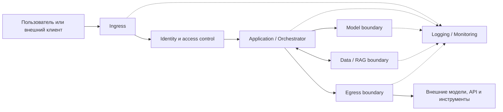

[Документация Yandex Cloud](../../index.md) > [Безопасность в Yandex Cloud](../index.md) > Стандарт безопасности для внедрения и эксплуатации ИИ-систем в Yandex Cloud, версия 1.0.0 > Безопасная архитектура и разработка ИИ-приложений

# Безопасная архитектура и разработка ИИ-приложений

{#secure-architecture}

ИИ-приложение образует сквозной путь: вход пользователя или системы, прикладная логика, API, RAG-источники, агентные инструменты, внешние получатели и телеметрия. В `AI-SDLC1` фиксируется, где устанавливаются личность и полномочия субъекта, где данные становятся недоверенными, где модельный вывод превращается в действие и где запрос покидает границу контролируемой зоны.

Приложение должно быть разделено как минимум на следующие логические контуры:

| Контур | Назначение | Минимальный результат обеспечения безопасности |
|---|---|---|
| **Ingress** | Прием пользовательских и внешних запросов | Недоверенный ввод валидируется, ограничивается по размеру и частоте, а также отделяется от внутренних компонентов приложения |
| **Identity** | Аутентификация и авторизация пользователей, сервисов и агентов | Все субъекты имеют проверяемую идентичность; доступ предоставляется по принципу минимально необходимых привилегий |
| **Application** | Оркестрация бизнес-логики, сборка промпта, RAG-контекста и вызовов инструментов | Пользовательский ввод, системные инструкции, найденное содержимое и результаты инструментов обрабатываются как отдельные недоверенные источники |
| **Model** | Взаимодействие с LLM или иной AI-моделью | В модель передаются только минимально необходимые данные; секреты, учетные данные и неконтролируемые системные инструкции не включаются в промпт |
| **Data/RAG** | Загрузка, хранение, индексация и извлечение данных | RAG-контент имеет происхождение, классификацию и метаданные доступа; поиск возвращает только данные, разрешенные конкретному субъекту |
| **Egress** | Обращение к внешним LLM, API, плагинам и инструментам | Исходящие соединения разрешаются только к утвержденным получателям; передача данных контролируется, минимизируется и регистрируется |
| **Logging/Monitoring** | Аудит, обнаружение атак и расследование инцидентов | События позволяют восстановить цепочку запроса, решений приложения, обращений к данным, вызовов модели и инструментов без записи избыточных секретов или ПДн |

Приведенная схема является логической моделью для анализа, а не обязательной физической топологией: один компонент может реализовывать несколько контуров, а один контур — состоять из нескольких сервисов. Для каждого контура должны быть определены владелец, допустимые потоки данных, механизмы доступа, события аудита и процедуры реагирования. В архитектуре конкретной ИИ-системы может отсутствовать какая-либо ветвь (например, нет внешних вызовов или агентных инструментов).

## Архитектура и изменения {#architecture-changes}

### Архитектура и риски зафиксированы до выпуска {#architecture-risks-fixed-before-release}

{#ai-sdlc1-id}

Идентификатор требования: `AI-SDLC1`

{#ai-sdlc1-requirement}

**Требование**

До первого продуктивного выпуска и после существенного изменения владелец системы должен описать компоненты, границы доверия, данные, субъекты, модельные вызовы, инструменты, внешние связи и возможные последствия ошибочного или враждебного поведения. Описание должно связывать каждый существенный риск с конкретной границей, мерой и способом проверки.

Для каждой связи указываются исходный субъект и ресурс, целевой ресурс или API, класс данных, протокол, способ аутентификации, сетевой путь, источник события и владелец.

Отдельно отмечаются точки контроля: `pre_model` — до вызова модели, `retrieval` — при извлечении данных, `pre_action` — до действия инструмента, `post_model` — после ответа модели, `pre_egress` — до выхода запроса из контролируемой зоны.

{#ai-sdlc1-implementation}

**Реализация**

Существенным считается изменение, которое добавляет модель или поставщика, новый тип данных, RAG-источник, инструмент, внешний получатель, публичный эндпоинт, новую роль или иной способ выполнения кода. Организация определяет порядок рассмотрения таких изменений и ответственных за допуск. Требование применяется к каждой продуктивной системе и каждому существенному изменению; результат `N/A` для системы в целом не допускается. До начала работ утверждаются условия повторного пересмотра описания и согласующая сторона.

{#ai-sdlc1-manual-check}

**Ручная проверка**

1. Сопоставьте описание архитектуры с развернутыми ресурсами, маршрутами и учетными записями.
1. Выберите по одному разрешенному и запрещенному потоку для каждой границы.

Требование выполнено, если в описании нет неучтенных продуктивных компонентов и для каждой границы определены владелец и проверяемая мера. Неучтенный компонент или поток означает невыполнение: он добавляется в описание и применимые требования либо выводится из продуктивной среды, после чего проверка по разрешенному и запрещенному потокам повторяется.

{#ai-sdlc1-artifacts}

**Артефакт**

* Описание архитектуры.
* Диаграмма потоков данных.
* Сопоставление с фактическими ресурсами.
* Результаты тестов.
* Документ согласования.

## Вход, контекст и вывод {#input-context-output}

### Недоверенный ввод проверяется до использования моделью {#untrusted-input-validated-before-model-use}

{#ai-app-waf1-id}

Идентификатор требования: `AI-APP-WAF1`

{#ai-app-waf1-requirement}

**Требование**

Приложение должно проверять тип, размер, кодировку, структуру, обязательные поля и допустимость пользовательского и машинного ввода до включения данных в модельный запрос или выполнения иного действия. Для каждого поля и типа объекта должны быть заданы разрешенные значения либо явное правило отклонения. Текст, файл, URL, результат поиска и ответ внешнего сервиса остаются недоверенными независимо от того, прошли ли они сетевой периметр.

{#ai-app-waf1-implementation}

**Реализация**

Для публичного HTTP(S)-входа [Yandex API Gateway](../../api-gateway/index.md) и [Yandex Smart Web Security](../../smartwebsecurity/index.md) могут ограничивать запросы на уровне HTTP, WAF-правил, роботной активности и частоты. Это не заменяет прикладную проверку смысла промпта.

Связь API Gateway с профилем Smart Web Security задается документированным [расширением OpenAPI](../../api-gateway/concepts/extensions/sws.md); возможности профилей описаны в статье [Профили безопасности](../../smartwebsecurity/concepts/profiles.md).

Для дополнительной модерации запросов и ответов можно использовать Guardrails, но эта функция находится на стадии Preview и не заменяет авторизацию, проверку схемы или обработку персональных данных. Подробнее в [описании Guardrails](https://aistudio.yandex.ru/docs/ru/ai-studio/concepts/security/guardrails.html).

Для Serverless Containers, Cloud Functions и Kubernetes без Smart Web Security тот же валидатор размещается в промежуточном слое Ingress или приложения; группы безопасности и сетевая политика не анализируют промпт и тело запроса. Результат `N/A` допустим только для ветви Smart Web Security при отсутствии HTTP(S)-входа и не отменяет прикладную проверку входных данных. Семантическая модерация содержимого относится к `AI-CONTENT1`.

Для маршрута с профилем Smart Web Security сохраняются сведения о подключении профиля и журнал доступа.

{#ai-app-waf1-check}

**Проверка**

1. Отправьте корректный запрос, запрос с отсутствующим или лишним полем, нарушенной схемой, превышением лимита и содержимым, которое должно быть отклонено утвержденным правилом.
1. Проверьте, что каждый отказ происходит до модельного вызова или иного опасного действия, имеет определенный код или причину, а журнал не содержит секретов и избыточного исходного содержимого.

Корректный запрос должен получить идентификатор корреляции. Каждый отказ дополнительно подтверждается отсутствием последующего события вызова модели или инструмента в журнале или трассировке.

{#ai-app-waf1-artifacts}

**Артефакт**

* Записи отказов.
* Конфигурация и хеш спецификации OpenAPI.
* Идентификатор профиля Smart Web Security.
* Тестовые запросы и их результат.
* Подтверждение отсутствия последующего вызова.

### Правила модерации имеют определенные категории и отказоустойчивое поведение {#moderation-rules-defined-categories-failover}

{#ai-content1-id}

Идентификатор требования: `AI-CONTENT1`

{#ai-content1-applicability}

**Применимость**

Требование применяется, если утвержденная продуктовая, корпоративная, договорная или правовая политика запрещает отдельные категории содержимого либо архитектура заявляет модерацию как меру защиты. Результат `N/A` допустим для конкретного маршрута только тогда, когда утвержденная политика содержимого не требует модерации этого маршрута.

{#ai-content1-requirement}

**Требование**

Владелец должен зафиксировать проверяемую версию правил: категории входного и выходного содержимого, охватываемые интерфейсы, действие для каждой категории и поведение при ошибке или недоступности модератора. Действием может быть блокирование, ограничение ответа, направление на ручное рассмотрение или иная утвержденная реакция. Неопределенная ошибка модератора не должна незаметно превращаться в разрешение там, где политика требует блокирования.

{#ai-content1-implementation}

**Реализация**

Guardrails в AI Studio можно использовать только в пределах опубликованной функции Preview. Правило, словарь или классификатор и их версия являются объектами конфигурации; изменение выполняет субъект с документированной ролью `ai.guardrails.editor`.

При блокировании ответ имеет статус `incomplete` и причину `content_filter`, однако эти признаки не заменяют прикладную обработку ошибки. Guardrails не определяет правовую допустимость данных и не заменяет схему, IAM, защиту персональных данных, документную авторизацию или проверку действия агента. Подробнее в [описании Guardrails](https://aistudio.yandex.ru/docs/ru/ai-studio/concepts/security/guardrails.html).

К экземпляру модели привязывается один Guardrail; пользовательский Guardrail заменяет системный, что изменяет действующее покрытие категорий. Управление выполняется через консоль управления (`AI Studio → Management → Security → Guardrails`); программные интерфейсы управления не документированы, поэтому выгруженная версионируемая конфигурация и ручные свидетельства обязательны. Guardrails не является WAF.

{#ai-content1-check}

**Проверка**

1. Для каждой утвержденной категории выполните разрешенный и запрещенный тест на каждом охватываемом пути; запрос и ответ проверяются отдельно, при этом блокировка запроса подтверждается отсутствием вызова модели, а блокировка ответа — неотображением результата.
1. Отдельно смоделируйте ошибку или недоступность модератора.
1. Зафиксируйте версию правила, наблюдаемое действие (статус `incomplete` с причиной `content_filter`), событие управления [Yandex Audit Trails](../../audit-trails/index.md) о настройке Guardrail и прикладную запись; отдельное событие срабатывания Guardrails в Audit Trails не документировано и при необходимости фиксируется как слепая зона.

Обход через неохваченный интерфейс либо разрешение при требуемом отказе означает невыполнение. При ложном пропуске измените категорию, порог или словарь, дождитесь применения и повторите зафиксированный набор тестов.

{#ai-content1-artifacts}

**Артефакт**

* Версия и выгруженная конфигурация правила.
* Идентификаторы экземпляра модели и Guardrail.
* Тест блокирования.
* Событие управления или прикладная запись.

### Вывод модели проверяется до рендеринга и исполнения {#model-output-validated-before-render-exec}

{#ai-content2-id}

Идентификатор требования: `AI-CONTENT2`

{#ai-content2-requirement}

**Требование**

Приложение должно считать вывод модели недоверенными данными. До отображения как активного содержимого, формирования запроса, записи в хранилище или выполнения команды оно должно проверить формат, схему, допустимые значения, целевой объект и полномочия вызывающего субъекта.

Если модель формирует SQL, shell-команду, URL, имя файла, шаблон, API-вызов или аргументы инструмента, приложение должно использовать отдельный детерминированный валидатор и список разрешенных операций. Успешная генерация текста моделью не является авторизацией действия.

Ответ разбирается в типизированный объект: неизвестные и отсутствующие поля отклоняются, а значения экранируются по правилам целевого контекста — HTML, SQL, shell или имени файла.

Для системы, выводящей только инертный текст, ветви, связанные с исполнением, могут не применяться, но безопасное отображение остается обязательным. Проверка вывода реализуется приложением: нативный механизм проверки схемы вывода в Yandex Cloud не подтвержден.

{#ai-content2-check}

**Проверка**

Подайте синтетический ответ с лишним или привилегированным полем, запрещенным объектом, управляющей последовательностью, HTML- или скрипт-разметкой, некорректным JSON, фрагментом SQL- или shell-команды и неизвестным действием. Требование выполнено, если приложение отклоняет каждый такой ответ до исполнения и фиксирует причину без записи чувствительных данных. Ни один из тестов не должен привести к вызову целевой системы, что подтверждается отсутствием соответствующего события в журнале или трассировке.

{#ai-content2-artifacts}

**Артефакт**

* Тестовые ответы модели.
* Записи отклонения.
* Код валидатора.
* Хеш схемы и версия политики.
* Подтверждение отсутствия вызова целевой системы.

### Системные инструкции и политики изменяются только доверенным путем {#system-prompts-policies-changed-trusted-path}

{#ai-core5-id}

Идентификатор требования: `AI-CORE5`

{#ai-core5-requirement}

**Требование**

Системные инструкции, шаблоны промптов, политики инструментов, правила маршрутизации, конфигурация безопасности и иные доверенные настройки должны храниться отдельно от пользовательского содержимого, иметь владельца, идентификатор объекта и версию и изменяться только через утвержденный путь. Если такая конфигурация существует, результат `N/A` не допускается.

Для объекта фиксируются субъекты чтения и записи, история изменений и активная версия. Запись о развертывании связывает хеш артефакта инструкций с версией модели или приложения.

Приложение не должно подменять их данными из RAG, ответа инструмента или сообщения другого агента. Среда исполнения принимает доверенный набор только из утвержденного пути выпуска.

Секреты не должны включаться в системный промпт. Если конфигурация хранится в Yandex Object Storage или другом облачном ресурсе, к ней применяются документированные для этого ресурса средства контроля доступа, шифрования и версионирования; [версионирование Object Storage](../../storage/operations/buckets/versioning.md) может использоваться как часть истории изменений, но не заменяет процедуру допуска. Нативный реестр промптов и политик в Yandex Cloud не заявляется: облачные средства обеспечивают защищенное хранение и развертывание, а доверенное управление инструкциями реализует процесс выпуска приложения.

{#ai-core5-manual-check}

**Ручная проверка**

1. Сопоставьте активную версию конфигурации с утвержденной версией и субъектами, которые могут ее читать и изменять.
1. Затем попытайтесь изменить цель или политику через пользовательский ввод и RAG-документ.

Изменение не должно попасть в доверенную конфигурацию. Если изменение попало в действующую конфигурацию, остановите выпуск или действие агента, верните последний утвержденный набор, смените раскрытые секреты при их наличии и повторите исходный отрицательный тест.

{#ai-core5-artifacts}

**Артефакт**

* Активная версия конфигурации.
* История изменений.
* Результат теста подмены.
* Хеш артефакта инструкций.
* Событие развертывания.
* Журнал действующей версии.

### Внешний и найденный контекст не получает доверия автоматически {#external-retrieved-context-no-implicit-trust}

{#ai-app-inject1-id}

Идентификатор требования: `AI-APP-INJECT1`

{#ai-app-inject1-requirement}

**Требование**

RAG-фрагменты, веб-страницы, файлы, письма, результаты инструментов и иные внешние данные должны передаваться модели как нагрузка, а не как доверенные системные инструкции. Для каждого фрагмента сохраняются доступный идентификатор источника и результат примененной политики.

Приложение должно отделять данные от управляющих инструкций, отказобезопасно обрабатывать ошибку извлечения или проверки и ограничивать последствия, если внешний контекст пытается изменить цель, раскрыть секрет или инициировать действие.

Маркировка назначается при загрузке: неизменяемые идентификаторы источника и документа, владелец, уровень доверия или класс данных и версия. Внешнее содержимое не может выбирать инструмент, действие или получателя.

AI Search выполняет загрузку, разбиение, векторизацию и поиск документов. Приложение должно отделять найденные данные от управляющих инструкций и ограничивать их влияние. Возможности сервиса описаны в [документации AI Search](https://aistudio.yandex.ru/docs/ru/ai-studio/concepts/search/index.html).

{#ai-app-inject1-check}

**Проверка**

Поместите в тестовый источник документ с известным идентификатором и инструкцией изменить системную политику или вызвать инструмент.

Требование выполнено, если инструкция рассматривается как данные, не меняет полномочия и не приводит к действию без отдельной проверки, а трассировка связывает результат с источником и решением политики. Система может процитировать или пересказать такое содержимое, однако события инструмента или целевой системы при этом должны отсутствовать.

При провале поместите документ или версию индекса в карантин, отключите затронутый источник поиска, исправьте политику или парсер, перестройте индекс и повторите тест.

{#ai-app-inject1-artifacts}

**Артефакт**

* Тестовый документ с инструкцией.
* Трассировка решения политики.
* Идентификаторы результатов поиска.
* Запись о карантине или переиндексации.

## Внешние связи и публичный периметр {#external-connections}

### Вызовы внешнего модельного API проходят через управляемую границу {#external-model-api-calls-managed-boundary}

{#ai-net3-id}

Идентификатор требования: `AI-NET3`

{#ai-net3-requirement}

**Требование**

Если ИИ-система вызывает модельный API вне Yandex Cloud, владелец должен определить разрешенные эндпоинты, типы передаваемых данных, сервисный аккаунт или иную рабочую идентичность, место хранения секрета, маршрут, таймауты и журналирование. Приложение должно исключать неутвержденного получателя и не передавать данные, для которых отсутствует разрешение. Перечень получателей и передаваемых категорий пересматривается после смены поставщика, модели, региона обработки, контракта, схемы данных или сетевого пути.

Ключ провайдера хранится в специализированном хранилище по `AI-SECRET1`, однако его область действия, срок и отзыв проверяются в системе провайдера. Политика IAM не создает частный сетевой путь к внешнему поставщику; такой путь заявляется только при наличии его официальной документации.

Таблица маршрутизации Yandex Virtual Private Cloud и NAT-шлюз определяют сетевой путь, но сами по себе не фильтруют доменное имя, получателя или содержимое запроса. Документированные свойства маршрутов и следующего узла приведены в [описании маршрутизации VPC](../../vpc/concepts/routing.md). Если требуется ограничение по получателю, организация должна реализовать его на подходящем прокси, межсетевом экране или в приложении и проверить фактический TLS-эндпоинт.

{#ai-net3-check}

**Проверка**

1. Выполните разрешенный вызов и вызов на неразрешенный тестовый эндпоинт.
1. Проверьте маршрут, DNS/TLS-назначение, отсутствие секрета в журнале и связь записи приложения с внешним запросом.

Допустимость передаваемых данных проверяется отдельно по разделу [Соответствие требованиям и обработка персональных и регулируемых данных](compliance-pii.md). Запрещенный вызов должен отсутствовать в журнале провайдера; раскрытые при проверке учетные данные заменяются и не восстанавливаются.

{#ai-net3-artifacts}

**Артефакт**

* Конфигурация прокси и межсетевого экрана.
* Запись разрешенного и запрещенного вызова.
* Идентификатор секрета.
* Корреляционный журнал вызова.

### Публичный HTTP(S)-периметр имеет явную схему защиты {#public-http-perimeter-explicit-protection}

{#ai-net7-id}

Идентификатор требования: `AI-NET7`

{#ai-net7-requirement}

**Требование**

Для каждого публичного эндпоинта владелец должен зафиксировать домен, маршрут, способ аутентификации, ограничение частоты, максимальный размер запроса, политику журналирования и связь с внутренним бэкендом. Прямой доступ к бэкенду не должен обходить проверки, заявленные для публичного пути.

{#ai-net7-implementation}

**Реализация**

API Gateway поддерживает авторизацию через документированные расширения, включая [JWT authorizer](../../api-gateway/concepts/extensions/jwt-authorizer.md), и интеграцию с Smart Web Security. Не следует назначать API Gateway несуществующую универсальную роль вызова: способ авторизации определяется OpenAPI-спецификацией и интеграцией с бэкендом. Smart Web Security журналирует события в пределах своей [документированной модели логов](../../smartwebsecurity/concepts/logging.md); выборка разрешенных запросов не является полным прикладным журналом.

Ограничение частоты Smart Web Security защищает применимый HTTP-маршрут, но не стоимость токенов модели и не семантику содержимого. Для закрытой внутренней системы без публичного маршрута результат `N/A` допустим; партнерский эндпоинт остается применимым.

{#ai-net7-check}

**Проверка**

1. Сопоставьте опубликованную OpenAPI-спецификацию, домен и бэкенд.
1. Проверьте запрос без учетных данных, с неверными данными, с превышением лимита и прямой запрос к бэкенду.

Доступ должен соответствовать заявленной схеме, а обход периметра — отсутствовать. Журналы шлюза или Smart Web Security и целевой системы сопоставляются по единому идентификатору корреляции; тест выполняется из публичного и из закрытого источника. Безопасным аварийным состоянием считается запрет и отключенный публичный доступ.

{#ai-net7-artifacts}

**Артефакт**

* OpenAPI-спецификация.
* Запросы без учетных данных.
* Тест обхода бэкенда.
* Идентификаторы спецификации и профиля Smart Web Security.
* Привязки.
* Результаты HTTP-тестов.