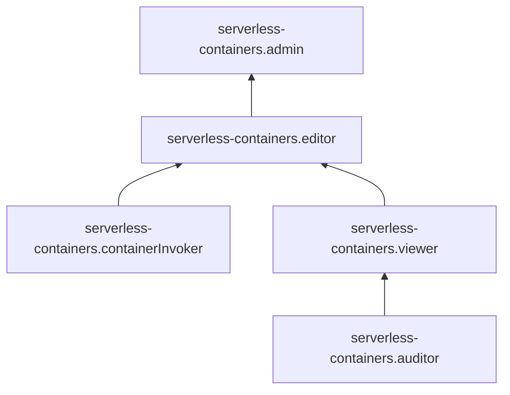

[Документация Yandex Cloud](../../index.md) > [Yandex Serverless Containers](../index.md) > Управление доступом

# Управление доступом в Serverless Containers

Для управления правами доступа в Serverless Containers используются [роли](../../iam/concepts/access-control/roles.md).

В этом разделе вы узнаете:

* [на какие ресурсы можно назначить роль](#resources);
* [какие роли действуют в сервисе](#roles-list).

## Об управлении доступом {#about-access-control}

Все операции в Yandex Cloud проверяются в сервисе [Yandex Identity and Access Management](../../iam/index.md). Если у субъекта нет необходимых разрешений, сервис вернет ошибку.

Чтобы выдать разрешения к ресурсу, [назначьте роли](../../iam/operations/roles/grant.md) на этот ресурс субъекту, который будет выполнять операции. Роли можно назначить [аккаунту на Яндексе](../../iam/concepts/users/accounts.md#passport), [сервисному аккаунту](../../iam/concepts/users/service-accounts.md), [локальному пользователю](../../iam/concepts/users/accounts.md#local), [федеративному пользователю](../../iam/concepts/federations.md), [группе пользователей](../../organization/operations/manage-groups.md), [системной группе](../../iam/concepts/access-control/system-group.md) или [публичной группе](../../iam/concepts/access-control/public-group.md). Подробнее читайте в разделе [Как устроено управление доступом в Yandex Cloud](../../iam/concepts/access-control/index.md).

Назначать роли на ресурс могут пользователи, у которых на этот ресурс есть роль `serverless-containers.admin` или одна из следующих ролей:

* `admin`;
* `resource-manager.admin`;
* `organization-manager.admin`;
* `resource-manager.clouds.owner`;
* `organization-manager.organizations.owner`.



Возможность вызывать контейнеры и управлять ими из определенных [облачных сетей](../../vpc/concepts/network.md#network) или с определенных IP-адресов, а также привязывать к контейнерам определенные облачные сети может быть ограничена [политиками авторизации](../../iam/concepts/access-control/access-policies.md) на уровне [каталога](../../resource-manager/concepts/resources-hierarchy.md#folder), [облака](../../resource-manager/concepts/resources-hierarchy.md#cloud) или [организации](../../organization/concepts/organization.md). 



## На какие ресурсы можно назначить роль {#resources}

Роль можно назначить на [организацию](../../organization/concepts/organization.md), [облако](../../resource-manager/concepts/resources-hierarchy.md#cloud) и [каталог](../../resource-manager/concepts/resources-hierarchy.md#folder). Роли, назначенные на организацию, облако или каталог, действуют и на вложенные ресурсы.

На [контейнер](../concepts/container.md) роль можно назначить через Yandex Cloud [CLI](../../cli/cli-ref/serverless/cli-ref/container/add-access-binding.md), [API](../api-ref/containers/authentication.md) или [Terraform](../../terraform/resources/serverless_container_iam_binding.md).

## Какие роли действуют в сервисе {#roles-list}

Ниже перечислены все роли, которые учитываются при проверке прав доступа в сервисе Serverless Containers.

### Сервисные роли {#service-roles}

#### serverless-containers.auditor {#serverless-containers-auditor}

Роль `serverless-containers.auditor` позволяет просматривать информацию о [контейнерах](../concepts/container.md), кроме информации о [переменных](../concepts/runtime.md#environment-variables) окружения [ревизии](../concepts/container.md#revision).

#### serverless-containers.viewer {#serverless-containers-viewer}

Роль `serverless-containers.viewer` позволяет просматривать информацию о контейнерах, а также об облаке и каталоге.

Пользователи с этой ролью могут:
* просматривать информацию о [контейнерах](../concepts/container.md), в том числе о [переменных](../concepts/runtime.md#environment-variables) окружения [ревизии](../concepts/container.md#revision);
* просматривать информацию о назначенных [правах доступа](../../iam/concepts/access-control/index.md) к контейнерам;
* просматривать информацию об [облаке](../../resource-manager/concepts/resources-hierarchy.md#cloud);
* просматривать информацию о [каталоге](../../resource-manager/concepts/resources-hierarchy.md#folder).

Включает разрешения, предоставляемые ролью `serverless-containers.auditor`.

#### serverless-containers.editor {#serverless-containers-editor}

Роль `serverless-containers.editor` позволяет управлять контейнерами и просматривать информацию о них, а также об облаке и каталоге.

Пользователи с этой ролью могут:
* создавать, вызывать, изменять и удалять [контейнеры](../concepts/container.md);
* просматривать информацию о контейнерах, в том числе о [переменных](../concepts/runtime.md#environment-variables) окружения [ревизии](../concepts/container.md#revision), а также о назначенных [правах доступа](../../iam/concepts/access-control/index.md) к контейнерам;
* просматривать информацию об [облаке](../../resource-manager/concepts/resources-hierarchy.md#cloud);
* просматривать информацию о [каталоге](../../resource-manager/concepts/resources-hierarchy.md#folder).

Включает разрешения, предоставляемые ролью `serverless-containers.viewer`.

#### serverless-containers.admin {#serverless-containers-admin}

Роль `serverless-containers.admin` позволяет управлять контейнерами и доступом к ним, а также просматривать информацию о контейнерах, облаке и каталоге.

Пользователи с этой ролью могут:
* создавать, вызывать, изменять и удалять [контейнеры](../concepts/container.md);
* просматривать информацию о назначенных [правах доступа](../../iam/concepts/access-control/index.md) к контейнерам и изменять права доступа;
* просматривать информацию о контейнерах, в том числе о [переменных](../concepts/runtime.md#environment-variables) окружения [ревизии](../concepts/container.md#revision);
* просматривать информацию об [облаке](../../resource-manager/concepts/resources-hierarchy.md#cloud);
* просматривать информацию о [каталоге](../../resource-manager/concepts/resources-hierarchy.md#folder).

Включает разрешения, предоставляемые ролью `serverless-containers.editor`.

#### serverless-containers.containerInvoker {#serverless-containers-containerinvoker}

Роль `serverless-containers.containerInvoker` позволяет вызывать [контейнеры](../concepts/container.md).

### Примитивные роли {#primitive-roles}

Примитивные роли позволяют пользователям совершать действия во [всех сервисах](../../overview/concepts/services.md) Yandex Cloud.

#### auditor {#auditor}

Роль `auditor` предоставляет разрешения на чтение конфигурации и метаданных любых ресурсов Yandex Cloud без возможности доступа к данным.

Например, пользователи с этой ролью могут:
* просматривать информацию о [ресурсе](../../resource-manager/concepts/resources-hierarchy.md);
* просматривать метаданные ресурса;
* просматривать список операций с ресурсом.

Роль `auditor` — наиболее безопасная роль, исключающая доступ к данным [сервисов](../../overview/concepts/services.md). Роль подходит для пользователей, которым необходим минимальный уровень доступа к ресурсам Yandex Cloud.

#### viewer {#viewer}

Роль `viewer` предоставляет разрешения на чтение информации о любых [ресурсах](../../resource-manager/concepts/resources-hierarchy.md) Yandex Cloud.

Включает разрешения, предоставляемые ролью `auditor`.

В отличие от роли `auditor`, роль `viewer` предоставляет доступ к данным [сервисов](../../overview/concepts/services.md) в режиме чтения.

#### editor {#editor}

Роль `editor` предоставляет разрешения на управление любыми [ресурсами](../../resource-manager/concepts/resources-hierarchy.md) Yandex Cloud, кроме назначения ролей другим пользователям, передачи прав владения [организацией](../../organization/concepts/organization.md) и ее удаления, а также удаления [ключей шифрования](../../kms/concepts/index.md) Key Management Service.

Например, пользователи с этой ролью могут создавать, изменять и удалять ресурсы.

Включает разрешения, предоставляемые ролью `viewer`.

#### admin {#admin}

Роль `admin` позволяет назначать любые роли, кроме `resource-manager.clouds.owner` и `organization-manager.organizations.owner`, а также предоставляет разрешения на управление любыми [ресурсами](../../resource-manager/concepts/resources-hierarchy.md) Yandex Cloud, кроме передачи прав владения [организацией](../../organization/concepts/organization.md) и ее удаления.

Прежде чем назначить роль `admin` на организацию, [облако](../../resource-manager/concepts/resources-hierarchy.md#cloud) или [платежный аккаунт](../../billing/concepts/billing-account.md), ознакомьтесь с информацией о защите [привилегированных аккаунтов](../../security/standard/all.md#privileged-users).

Включает разрешения, предоставляемые ролью `editor`.

Вместо примитивных ролей мы рекомендуем использовать роли сервисов. Такой подход позволит более гранулярно управлять доступом и обеспечить соблюдение [принципа минимальных привилегий](../../security/standard/all.md#min-privileges).

Подробнее о примитивных ролях в [справочнике ролей Yandex Cloud](../../iam/roles-reference.md#primitive-roles).