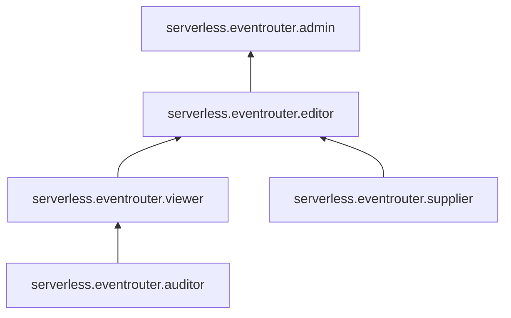

# Сервисные роли для {{ er-name }}

С помощью сервисных ролей [{{ er-name }}](../concepts/index.md#eventrouter) вы можете управлять доступом пользователей к ресурсам {{ er-name }} — [шинам](../concepts/eventrouter/bus.md), [коннекторам](../concepts/eventrouter/connector.md) и [правилам](../concepts/eventrouter/rule.md).

#### serverless.eventrouter.auditor {#serverless-eventrouter-auditor}

Роль `serverless.eventrouter.auditor` позволяет просматривать информацию о [шинах](../concepts/eventrouter/bus.md), [коннекторах](../concepts/eventrouter/connector.md) и [правилах](../concepts/eventrouter/rule.md), а также о назначенных [правах доступа](../../iam/concepts/access-control/index.md) к ним.

#### serverless.eventrouter.viewer {#serverless-eventrouter-viewer}

Роль `serverless.eventrouter.viewer` позволяет просматривать информацию о [шинах](../concepts/eventrouter/bus.md), [коннекторах](../concepts/eventrouter/connector.md) и [правилах](../concepts/eventrouter/rule.md), а также о назначенных [правах доступа](../../iam/concepts/access-control/index.md) к ним.

Включает разрешения, предоставляемые ролью `serverless.eventrouter.auditor`.

#### serverless.eventrouter.supplier {#serverless-eventrouter-supplier}

Роль `serverless.eventrouter.supplier` позволяет отправлять пользовательские события в шины, а также передавать события аудита.

Пользователи с этой ролью могут:
* отправлять пользовательские события в [шины](../concepts/eventrouter/bus.md) с помощью вызова gRPC API [EventService/Send](../eventrouter/api-ref/grpc/Event/send.md);
* отправлять пользовательские события в шины с помощью вызова gRPC API [EventService/Put](../eventrouter/api-ref/grpc/Event/put.md);
* передавать события аудита.

#### serverless.eventrouter.editor {#serverless-eventrouter-editor}

Роль `serverless.eventrouter.editor` позволяет управлять шинами, коннекторами и правилами, а также отправлять в шины пользовательские и аудитные события.

Пользователи с этой ролью могут:
* просматривать информацию о [шинах](../concepts/eventrouter/bus.md) и назначенных [правах доступа](../../iam/concepts/access-control/index.md) к ним, а также создавать, изменять и удалять шины;
* просматривать информацию о [коннекторах](../concepts/eventrouter/connector.md) и назначенных правах доступа к ним, а также создавать, изменять и удалять коннекторы;
* просматривать информацию о [правилах](../concepts/eventrouter/rule.md) и назначенных правах доступа к ним, а также создавать, изменять и удалять правила;
* отправлять пользовательские события в шины с помощью вызова gRPC API [EventService/Send](../eventrouter/api-ref/grpc/Event/send.md);
* отправлять пользовательские события в шины с помощью вызова gRPC API [EventService/Put](../eventrouter/api-ref/grpc/Event/put.md);
* передавать события аудита.

Включает разрешения, предоставляемые ролями `serverless.eventrouter.viewer` и `serverless.eventrouter.supplier`.

#### serverless.eventrouter.admin {#serverless-eventrouter-admin}

Роль `serverless.eventrouter.admin` позволяет управлять шинами, коннекторами, правилами и доступом к ним, а также отправлять в шины пользовательские и аудитные события.

Пользователи с этой ролью могут:
* просматривать информацию о [шинах](../concepts/eventrouter/bus.md), а также создавать, изменять и удалять их;
* просматривать информацию о назначенных [правах доступа](../../iam/concepts/access-control/index.md) к шинам, а также изменять такие права доступа;
* просматривать информацию о [коннекторах](../concepts/eventrouter/connector.md), а также создавать, изменять и удалять их;
* просматривать информацию о назначенных правах доступа к коннекторам, а также изменять такие права доступа;
* просматривать информацию о [правилах](../concepts/eventrouter/rule.md), а также создавать, изменять и удалять их;
* просматривать информацию о назначенных правах доступа к правилам, а также изменять такие права доступа;
* отправлять пользовательские события в шины с помощью вызова gRPC API [EventService/Send](../eventrouter/api-ref/grpc/Event/send.md);
* отправлять пользовательские события в шины с помощью вызова gRPC API [EventService/Put](../eventrouter/api-ref/grpc/Event/put.md);
* передавать события аудита;
* просматривать информацию о [квотах](../concepts/limits.md#eventrouter) EventRouter.

Включает разрешения, предоставляемые ролью `serverless.eventrouter.editor`.