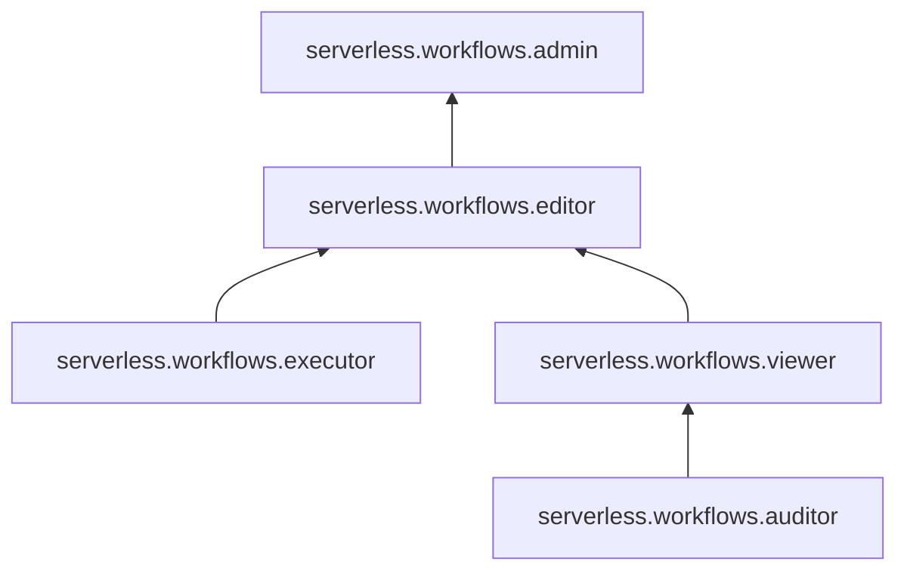

# Сервисные роли для {{ sw-name }}

С помощью сервисных ролей [{{ sw-name }}](../concepts/index.md#workflows) вы можете управлять доступом пользователей к [рабочим процессам](../concepts/workflows/workflow.md) {{ sw-name }}.



Возможность запускать рабочие процессы и управлять ими из определенных [облачных сетей](../../vpc/concepts/network.md#network) или с определенных IP-адресов, а также привязывать к рабочим процессам определенные облачные сети может быть ограничена [политиками авторизации](../../iam/concepts/access-control/access-policies.md) на уровне [каталога](../../resource-manager/concepts/resources-hierarchy.md#folder), [облака](../../resource-manager/concepts/resources-hierarchy.md#cloud) или [организации](../../organization/concepts/organization.md). 



#### serverless.workflows.auditor {#serverless-workflows-auditor}

Роль `serverless.workflows.auditor` позволяет просматривать информацию о [рабочих процессах](../concepts/workflows/workflow.md) и назначенных [правах доступа](../../iam/concepts/access-control/index.md) к ним, просматривать историю [запусков](../concepts/workflows/execution.md) рабочих процессов, а также информацию о [квотах](../concepts/limits.md#workflows) Yandex Workflows.

#### serverless.workflows.viewer {#serverless-workflows-viewer}

Роль `serverless.workflows.viewer` позволяет просматривать информацию о [рабочих процессах](../concepts/workflows/workflow.md) и назначенных [правах доступа](../../iam/concepts/access-control/index.md) к ним, просматривать историю [запусков](../concepts/workflows/execution.md) рабочих процессов, а также информацию о [квотах](../concepts/limits.md#workflows) Yandex Workflows.

Включает разрешения, предоставляемые ролью `serverless.workflows.auditor`.

#### serverless.workflows.executor {#serverless-workflows-executor}

Роль `serverless.workflows.executor` позволяет запускать, приостанавливать, возобновлять и останавливать [рабочие процессы](../concepts/workflows/workflow.md) Yandex Workflows.

#### serverless.workflows.editor {#serverless-workflows-editor}

Роль `serverless.workflows.editor` позволяет управлять рабочими процессами.

Пользователи с этой ролью могут:
* просматривать информацию о [рабочих процессах](../concepts/workflows/workflow.md) и назначенных [правах доступа](../../iam/concepts/access-control/index.md) к ним;
* создавать, изменять и удалять рабочие процессы;
* запускать, приостанавливать, возобновлять и останавливать рабочие процессы;
* просматривать историю [запусков](../concepts/workflows/execution.md) рабочих процессов;
* просматривать информацию о [квотах](../concepts/limits.md#workflows) Yandex Workflows.

Включает разрешения, предоставляемые ролями `serverless.workflows.viewer` и `serverless.workflows.executor`.

#### serverless.workflows.admin {#serverless-workflows-admin}

Роль `serverless.workflows.admin` позволяет управлять рабочими процессами.

Пользователи с этой ролью могут:
* просматривать информацию о [рабочих процессах](../concepts/workflows/workflow.md), а также создавать, изменять и удалять их;
* просматривать информацию о назначенных [правах доступа](../../iam/concepts/access-control/index.md) к рабочим процессам, а также изменять такие права доступа;
* запускать, приостанавливать, возобновлять и останавливать рабочие процессы;
* просматривать историю [запусков](../concepts/workflows/execution.md) рабочих процессов;
* просматривать информацию о [квотах](../concepts/limits.md#workflows) Yandex Workflows.

Включает разрешения, предоставляемые ролью `serverless.workflows.editor`.