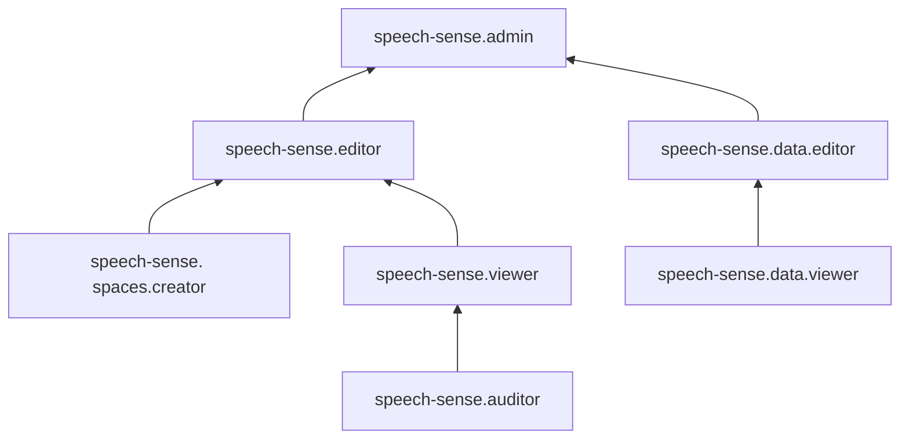

# Управление доступом в SpeechSense

Доступ к сервису Yandex SpeechSense регулируется путем назначения [ролей](../../iam/concepts/access-control/roles.md) в [организации](../../organization/concepts/organization.md). Управление организациями осуществляется с помощью сервиса [Yandex Identity Hub](../../organization/index.md).

В этом разделе вы узнаете:

* [на какие ресурсы можно назначить роль](#resources);
* [какие роли действуют в сервисе](#roles-list).

## Об управлении доступом {#about-access-control}

Список операций, доступных пользователю SpeechSense, определяется его ролью. Роли можно назначить аккаунту на Яндексе, [сервисному аккаунту](../../iam/concepts/users/service-accounts.md), [федеративным](../../iam/concepts/users/accounts.md#saml-federation) или [локальным](../../iam/concepts/users/accounts.md#local) пользователям, [группе пользователей](../../organization/operations/manage-groups.md), [системной группе](../../iam/concepts/access-control/system-group.md) или [публичной группе](../../iam/concepts/access-control/public-group.md). Подробнее об управлении доступом в Yandex Cloud см. раздел [Как устроено управление доступом в Yandex Cloud](../../iam/concepts/access-control/index.md).

Назначать роли на ресурс могут пользователи, у которых на этот ресурс есть роль `speech-sense.admin` или одна из следующих ролей:

* `admin`;
* `resource-manager.admin`;
* `organization-manager.admin`;
* `resource-manager.clouds.owner`;
* `organization-manager.organizations.owner`.

## На какие ресурсы можно назначить роль {#resources}

В [интерфейсе SpeechSense](https://speechsense.yandex.cloud/) роль можно назначить на [пространство](../concepts/resources-hierarchy.md#space) или [проект](../concepts/resources-hierarchy.md#project). Роли, назначенные на пространство, действуют и на вложенные проекты и ресурсы.

## Какие роли действуют в сервисе {#roles-list}

### Сервисные роли {#service-roles}

#### speech-sense.auditor {#speechsense-auditor}

Роль `speech-sense.auditor` позволяет просматривать название, описание и список участников [проекта](../concepts/resources-hierarchy.md#project) или [пространства](../concepts/resources-hierarchy.md#space) и всех его проектов. Роль не дает доступа к данным проекта.

#### speech-sense.viewer {#speechsense-viewer}

Роль `speech-sense.viewer` позволяет просматривать характеристики [проекта](../concepts/resources-hierarchy.md#project) или [пространства](../concepts/resources-hierarchy.md#space), список участников, список [подключений](../concepts/resources-hierarchy.md#connection) и дашборды.

Включает разрешения, предоставляемые ролью `speech-sense.auditor`.

#### speech-sense.editor {#speechsense-editor}

Роль `speech-sense.editor` позволяет редактировать [проект](../concepts/resources-hierarchy.md#project), его описание, дашборды и алерты, создавать и редактировать его классификаторы и запускать анализ. Назначенная на [пространство](../concepts/resources-hierarchy.md#space) роль позволяет редактировать пространство и создавать в нем проекты, [подключения](../concepts/resources-hierarchy.md#connection) и [словари](../concepts/dictionaries.md).

Включает разрешения, предоставляемые ролями `speech-sense.viewer` и `speech-sense.spaces.creator`.

#### speech-sense.admin {#speechsense-admin}

Роль `speech-sense.admin`, назначенная на [пространство](../concepts/resources-hierarchy.md#space) или [проект](../concepts/resources-hierarchy.md#project), позволяет выполнять любые действия в нем: просматривать [диалоги](../concepts/dialogs.md), редактировать [подключения](../concepts/resources-hierarchy.md#connection), запускать [анализ](../concepts/assistants.md#analysis). Роль дает право назначать роли другим пользователям.

Включает разрешения, предоставляемые ролями `speech-sense.editor` и `speech-sense.data.editor`.

#### speech-sense.spaces.creator {#speechsense-spaces-creator}

Роль `speech-sense.spaces.creator` позволяет создавать [пространства](../concepts/resources-hierarchy.md#space) в SpeechSense.

#### speech-sense.data.viewer {#speechsense-data-viewer}

Роль `speech-sense.data.viewer` позволяет просматривать название и описание [проекта](../concepts/resources-hierarchy.md#project), список [подключений](../concepts/resources-hierarchy.md#connection) и дашборды, список участников проекта, а также дает возможность искать по документам, прослушивать [диалоги](../concepts/dialogs.md) и просматривать текстовые [расшифровки](../concepts/dialogs.md#contents). При назначении роли на пространство дает возможность просматривать все проекты этого [пространства](../concepts/resources-hierarchy.md#space), но не дает права редактировать их.

#### speech-sense.data.editor {#speechsense-data-editor}

Роль `speech-sense.data.editor` позволяет загружать [диалоги](../concepts/dialogs.md) в [подключения](../concepts/resources-hierarchy.md#connection) [проекта](../concepts/resources-hierarchy.md#project) или [пространства](../concepts/resources-hierarchy.md#space), оценивать диалоги и писать комментарии к ним в системе.

Включает разрешения, предоставляемые ролью `speech-sense.data.viewer`.

Пользователи с ролями вида `speech-sense.data.*` могут просматривать и оценивать содержимое документов, но не имеют доступа к агрегированной информации.

Пользователи с ролями вида `speech-sense.data.*` могут просматривать и оценивать содержимое документов, но не имеют доступа к агрегированной информации.

### Примитивные роли {#primitive-roles}

Примитивные роли позволяют пользователям совершать действия во [всех сервисах](../../overview/concepts/services.md) Yandex Cloud.

#### auditor {#auditor}

Роль `auditor` предоставляет разрешения на чтение конфигурации и метаданных любых ресурсов Yandex Cloud без возможности доступа к данным.

Например, пользователи с этой ролью могут:
* просматривать информацию о [ресурсе](../../resource-manager/concepts/resources-hierarchy.md);
* просматривать метаданные ресурса;
* просматривать список операций с ресурсом.

Роль `auditor` — наиболее безопасная роль, исключающая доступ к данным [сервисов](../../overview/concepts/services.md). Роль подходит для пользователей, которым необходим минимальный уровень доступа к ресурсам Yandex Cloud.

#### viewer {#viewer}

Роль `viewer` предоставляет разрешения на чтение информации о любых [ресурсах](../../resource-manager/concepts/resources-hierarchy.md) Yandex Cloud.

Включает разрешения, предоставляемые ролью `auditor`.

В отличие от роли `auditor`, роль `viewer` предоставляет доступ к данным [сервисов](../../overview/concepts/services.md) в режиме чтения.

#### editor {#editor}

Роль `editor` предоставляет разрешения на управление любыми [ресурсами](../../resource-manager/concepts/resources-hierarchy.md) Yandex Cloud, кроме назначения ролей другим пользователям, передачи прав владения [организацией](../../organization/concepts/organization.md) и ее удаления, а также удаления [ключей шифрования](../../kms/concepts/index.md) Key Management Service.

Например, пользователи с этой ролью могут создавать, изменять и удалять ресурсы.

Включает разрешения, предоставляемые ролью `viewer`.

#### admin {#admin}

Роль `admin` позволяет назначать любые роли, кроме `resource-manager.clouds.owner` и `organization-manager.organizations.owner`, а также предоставляет разрешения на управление любыми [ресурсами](../../resource-manager/concepts/resources-hierarchy.md) Yandex Cloud, кроме передачи прав владения [организацией](../../organization/concepts/organization.md) и ее удаления.

Прежде чем назначить роль `admin` на организацию, [облако](../../resource-manager/concepts/resources-hierarchy.md#cloud) или [платежный аккаунт](../../billing/concepts/billing-account.md), ознакомьтесь с информацией о защите [привилегированных аккаунтов](../../security/standard/all.md#privileged-users).

Включает разрешения, предоставляемые ролью `editor`.

Вместо примитивных ролей мы рекомендуем использовать роли сервисов. Такой подход позволит более гранулярно управлять доступом и обеспечить соблюдение [принципа минимальных привилегий](../../security/standard/all.md#min-privileges).

Подробнее о примитивных ролях см. в [справочнике ролей Yandex Cloud](../../iam/roles-reference.md#primitive-roles).

## Какие роли мне необходимы {#choosing-roles}

В таблице ниже перечислено, какие роли нужны для выполнения указанного действия. Вы всегда можете назначить роль, которая дает более широкие разрешения, нежели указанная. Например, назначить на пространство роль `speech-sense.editor` вместо `speech-sense.viewer`.

#|
|| **Действие** | **Необходимые роли** ||
|| **Просмотр информации** ||
|| Просмотр пространства и всех его проектов | `speech-sense.auditor` ||
|| Просмотр характеристик пространства и проекта | `speech-sense.viewer` ||
|| Просмотр проекта, его каналов и диалогов | `speech-sense.data.viewer` ||
|| **Управление проектом** ||
|| Создание проекта | `speech-sense.editor` ||
|| Изменение настроек проекта | `speech-sense.editor` ||
|| Загрузка и оценка диалогов | `speech-sense.data.editor` ||
|| Написание комментариев | `speech-sense.data.editor` ||
|| Создание подключений | `speech-sense.editor` ||
|| Создание классификаторов | `speech-sense.editor` ||
|| Запуск анализа | `speech-sense.editor` ||
|| Удаление проекта | `speech-sense.admin` ||
|| Выдача роли в проекте | `speech-sense.admin` ||
|| **Управление пространством** ||
|| Изменение настроек пространства | `speech-sense.editor` ||
|| Удаление пространства | `speech-sense.admin` ||
|| Выдача роли в пространстве | `speech-sense.admin` ||
|#