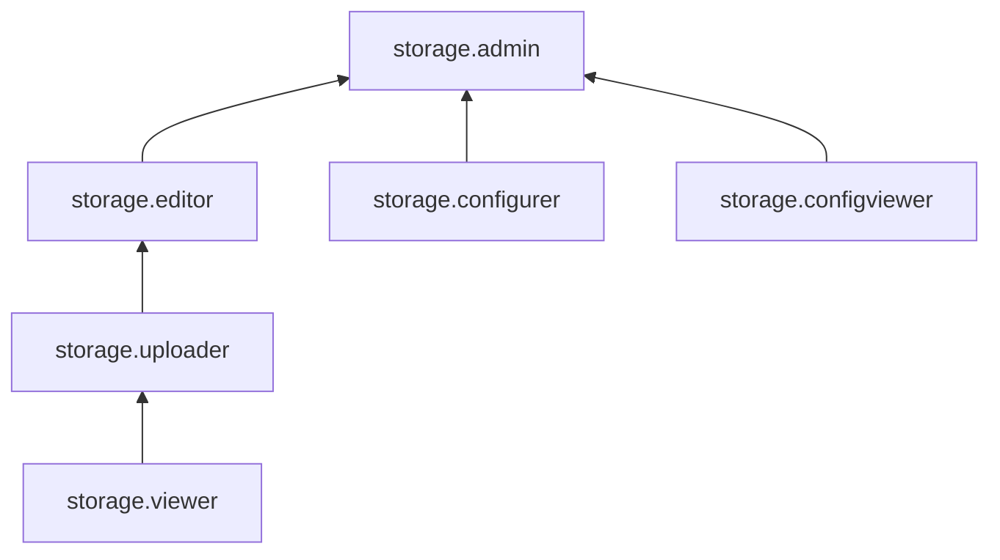

# Управление доступом с помощью Yandex Identity and Access Management

В Object Storage реализовано несколько механизмов для управления доступом к ресурсам. Алгоритм взаимодействия этих механизмов см. в [Обзор способов управления доступом в Object Storage](overview.md).

В этом разделе вы узнаете:

* [на какие ресурсы можно назначить роль](#resources);
* [какие роли действуют в сервисе](#roles-list).

## Об управлении доступом {#about-access-control}

Все операции в Yandex Cloud проверяются в сервисе [Yandex Identity and Access Management](../../iam/index.md). Если у субъекта нет необходимых разрешений, сервис вернет ошибку.

Чтобы выдать разрешения к ресурсу, [назначьте роли](../../iam/operations/roles/grant.md) на этот ресурс субъекту, который будет выполнять операции. Роли можно назначить [аккаунту на Яндексе](../../iam/concepts/users/accounts.md#passport), [сервисному аккаунту](../../iam/concepts/users/service-accounts.md), [локальному пользователю](../../iam/concepts/users/accounts.md#local), [федеративному пользователю](../../iam/concepts/federations.md), [группе пользователей](../../organization/operations/manage-groups.md), [системной группе](../../iam/concepts/access-control/system-group.md) или [публичной группе](../../iam/concepts/access-control/public-group.md). Подробнее читайте в разделе [Как устроено управление доступом в Yandex Cloud](../../iam/concepts/access-control/index.md).

Назначать роли на ресурс могут пользователи, у которых на этот ресурс есть роль `storage.admin` или одна из следующих ролей:

* `admin`;
* `resource-manager.admin`;
* `organization-manager.admin`;
* `resource-manager.clouds.owner`;
* `organization-manager.organizations.owner`.

## На какие ресурсы можно назначить роль {#resources}

Роль можно назначить на [организацию](../../organization/concepts/organization.md), [облако](../../resource-manager/concepts/resources-hierarchy.md#cloud) и [каталог](../../resource-manager/concepts/resources-hierarchy.md#folder). Роли, назначенные на организацию, облако или каталог, действуют и на вложенные ресурсы.

На отдельный бакет роль можно назначить в [консоли управления](https://console.yandex.cloud), а также через [Yandex Cloud API](../api-ref/Bucket/setAccessBindings.md) или [Terraform](../../terraform/resources/storage_bucket_iam_binding.md).

О том, как управлять доступом к бакетам и объектам в них, см. раздел [Список управления доступом (ACL)](../concepts/acl.md).

## Какие роли действуют в сервисе {#roles-list}

На диаграмме показано, какие роли есть в сервисе и как они наследуют разрешения друг друга. Например, в `editor` входят все разрешения `viewer`. После диаграммы дано описание каждой роли.

### Сервисные роли {#service-roles}

#### storage.viewer {#storage-viewer}

Роль `storage.viewer` позволяет читать данные в бакетах, просматривать информацию о бакетах и объектах в них, а также о каталоге и квотах сервиса Object Storage.



* просматривать список [бакетов](../concepts/bucket.md);
* просматривать списки [объектов](../concepts/object.md) в бакетах, информацию о таких объектах и их содержимое;
* просматривать информацию о назначенных [правах доступа](../../iam/concepts/access-control/index.md) к бакетам и объектам в них;
* просматривать информацию о конфигурации [CORS](../concepts/cors.md) бакетов;
* просматривать информацию о конфигурации [хостинга статических сайтов](../concepts/hosting.md) бакетов;
* просматривать информацию о [протоколе](../concepts/bucket.md#bucket-https) обращения к бакету;
* просматривать настройки [логирования](../concepts/server-logs.md) действий с бакетами;
* просматривать настройки [версионирования](../concepts/versioning.md) бакетов;
* просматривать настройки [шифрования](../concepts/encryption.md) бакетов;
* просматривать информацию о [классе хранилища](../concepts/storage-class.md#default-storage-class) по умолчанию для бакета;
* просматривать [метки](../concepts/tags.md) бакетов;
* просматривать информацию о регионе, в котором расположен бакет;
* просматривать информацию о конфигурации [жизненных циклов](../concepts/lifecycles.md) объектов;
* просматривать списки версий объектов и информацию о таких версиях;
* просматривать информацию о [блокировках версий объектов](../concepts/object-lock.md);
* просматривать [метки](../concepts/tags.md#object-tags) объектов и версий объектов;
* просматривать информацию о текущих [составных загрузках](../concepts/multipart.md) объектов и их частях;
* просматривать статистику [облака](../../resource-manager/concepts/resources-hierarchy.md#cloud), [каталога](../../resource-manager/concepts/resources-hierarchy.md#folder) и сервиса Object Storage;
* просматривать информацию о [квотах](../concepts/limits.md#storage-quotas) сервиса Object Storage;
* просматривать информацию о каталоге.



#### storage.configViewer {#storage-config-viewer}

Роль `storage.configViewer` позволяет просматривать информацию о настройках бакетов и объектов в них, но не позволяет просматривать данные внутри бакета.



* просматривать список [бакетов](../concepts/bucket.md) и списки [объектов](../concepts/object.md) в бакетах без доступа к содержимому объектов;
* просматривать информацию о назначенных [правах доступа](../../iam/concepts/access-control/index.md) к бакетам и объектам в них;
* просматривать информацию о [политиках доступа](../concepts/policy.md) к бакетам;
* просматривать информацию о конфигурации [CORS](../concepts/cors.md) бакетов;
* просматривать информацию о конфигурации [хостинга статических сайтов](../concepts/hosting.md) бакетов;
* просматривать информацию о [протоколе](../concepts/bucket.md#bucket-https) обращения к бакету;
* просматривать настройки [логирования](../concepts/server-logs.md) действий с бакетами;
* просматривать настройки [версионирования](../concepts/versioning.md) бакетов;
* просматривать информацию о регионе, в котором расположен бакет;
* просматривать информацию о [блокировках версий объектов](../concepts/object-lock.md);
* просматривать списки версий объектов в бакетах;
* просматривать настройки [шифрования](../concepts/encryption.md) бакетов;
* просматривать информацию о [классе хранилища](../concepts/storage-class.md#default-storage-class) по умолчанию для бакета;
* просматривать [метки](../concepts/tags.md) бакетов;
* просматривать информацию о конфигурации [жизненных циклов](../concepts/lifecycles.md) объектов;
* просматривать информацию о текущих [составных загрузках](../concepts/multipart.md) объектов и их частях;
* просматривать статистику [облака](../../resource-manager/concepts/resources-hierarchy.md#cloud), [каталога](../../resource-manager/concepts/resources-hierarchy.md#folder) и сервиса Object Storage;
* просматривать информацию о каталоге.



#### storage.configurer {#storage-configurer}

Роль `storage.configurer` позволяет управлять настройками жизненных циклов объектов, хостинга статических сайтов, политики доступа и CORS. Не позволяет управлять настройками списка управления доступом (ACL) и настройками публичного доступа. Не предоставляет доступа к данным в бакете.



* просматривать информацию о [политиках доступа](../concepts/policy.md) к бакетам, а также создавать, изменять и удалять такие политики;
* просматривать информацию о конфигурации [CORS](../concepts/cors.md) бакетов и изменять конфигурацию CORS;
* просматривать информацию о конфигурации [хостинга статических сайтов](../concepts/hosting.md) бакетов и изменять конфигурацию хостинга статических сайтов;
* просматривать информацию о [протоколе](../concepts/bucket.md#bucket-https) обращения к бакету, а также изменять протокол обращения;
* просматривать настройки [логирования](../concepts/server-logs.md) действий с бакетами и изменять настройки логирования;
* просматривать настройки [шифрования](../concepts/encryption.md) бакетов и изменять настройки шифрования;
* просматривать информацию о регионе, в котором расположен бакет;
* просматривать информацию о конфигурации [жизненных циклов](../concepts/lifecycles.md) объектов и изменять конфигурацию жизненных циклов;
* просматривать настройки [версионирования](../concepts/versioning.md) бакетов;
* просматривать информацию о [каталоге](../../resource-manager/concepts/resources-hierarchy.md#folder).



#### storage.uploader {#storage-uploader}

Роль `storage.uploader` позволяет загружать объекты в бакеты, в том числе перезаписывать загруженные ранее, а также читать данные в бакетах, просматривать информацию о бакетах и объектах в них, а также о каталоге и квотах сервиса Object Storage. Не позволяет удалять объекты и конфигурировать бакеты.



* просматривать список [бакетов](../concepts/bucket.md);
* просматривать списки [объектов](../concepts/object.md) в бакетах, информацию о таких объектах и их содержимое;
* загружать объекты в бакет;
* просматривать информацию о назначенных [правах доступа](../../iam/concepts/access-control/index.md) к бакетам и объектам в них;
* просматривать информацию о конфигурации [CORS](../concepts/cors.md) бакетов;
* просматривать информацию о конфигурации [хостинга статических сайтов](../concepts/hosting.md) бакетов;
* просматривать информацию о [протоколе](../concepts/bucket.md#bucket-https) обращения к бакету;
* просматривать настройки [логирования](../concepts/server-logs.md) действий с бакетами;
* просматривать настройки [версионирования](../concepts/versioning.md) бакетов;
* просматривать настройки [шифрования](../concepts/encryption.md) бакетов;
* просматривать информацию о [классе хранилища](../concepts/storage-class.md#default-storage-class) по умолчанию для бакета;
* просматривать [метки](../concepts/tags.md) бакетов;
* просматривать информацию о регионе, в котором расположен бакет;
* просматривать информацию о конфигурации [жизненных циклов](../concepts/lifecycles.md) объектов;
* просматривать списки версий объектов и информацию о таких версиях;
* просматривать информацию о [блокировках версий объектов](../concepts/object-lock.md) и настраивать такие блокировки;
* просматривать [метки](../concepts/tags.md#object-tags) объектов и версий объектов, а также изменять такие метки;
* просматривать информацию о текущих [составных загрузках](../concepts/multipart.md) объектов и их частях, а также удалять частично загруженные объекты;
* просматривать статистику [облака](../../resource-manager/concepts/resources-hierarchy.md#cloud), [каталога](../../resource-manager/concepts/resources-hierarchy.md#folder) и сервиса Object Storage;
* просматривать информацию о [квотах](../concepts/limits.md#storage-quotas) сервиса Object Storage;
* просматривать информацию о каталоге.



Включает разрешения, предоставляемые ролью `storage.viewer`.

#### storage.editor {#storage-editor}

Роль `storage.editor` позволяет выполнять любые операции с бакетами и объектами: создавать, удалять и изменять их. Не позволяет управлять настройками списка управления доступом (ACL), а также создавать публично доступные бакеты.



* просматривать список [бакетов](../concepts/bucket.md), а также создавать и удалять бакеты;
* просматривать списки [объектов](../concepts/object.md) в бакетах, информацию о таких объектах и их содержимое;
* просматривать информацию о назначенных [правах доступа](../../iam/concepts/access-control/index.md) к бакетам и объектам в них;
* загружать объекты в бакет, а также удалять объекты и версии объектов;
* просматривать информацию о конфигурации [CORS](../concepts/cors.md) бакетов и изменять конфигурацию CORS;
* просматривать информацию о конфигурации [хостинга статических сайтов](../concepts/hosting.md) бакетов и изменять конфигурацию хостинга статических сайтов;
* просматривать информацию о [протоколе](../concepts/bucket.md#bucket-https) обращения к бакету, а также изменять протокол обращения;
* просматривать настройки [логирования](../concepts/server-logs.md) действий с бакетами и изменять настройки логирования;
* просматривать настройки [версионирования](../concepts/versioning.md) бакетов;
* просматривать настройки [шифрования](../concepts/encryption.md) бакетов и изменять настройки шифрования;
* просматривать информацию о [классе хранилища](../concepts/storage-class.md#default-storage-class) по умолчанию для бакета, а также изменять класс хранилища по умолчанию;
* просматривать [метки](../concepts/tags.md) бакетов и изменять такие метки;
* просматривать информацию о регионе, в котором расположен бакет;
* просматривать информацию о конфигурации [жизненных циклов](../concepts/lifecycles.md) объектов и изменять конфигурацию жизненных циклов;
* просматривать списки версий объектов и информацию о таких версиях;
* восстанавливать версии объектов в версионируемых бакетах;
* просматривать информацию о [блокировках версий объектов](../concepts/object-lock.md) и настраивать такие блокировки;
* просматривать [метки](../concepts/tags.md#object-tags) объектов и версий объектов, а также изменять и удалять такие метки;
* просматривать информацию о текущих [составных загрузках](../concepts/multipart.md) объектов и их частях, а также удалять частично загруженные объекты;
* просматривать статистику [облака](../../resource-manager/concepts/resources-hierarchy.md#cloud), [каталога](../../resource-manager/concepts/resources-hierarchy.md#folder) и сервиса Object Storage;
* просматривать информацию о [квотах](../concepts/limits.md#storage-quotas) сервиса Object Storage;
* просматривать информацию о каталоге.



Включает разрешения, предоставляемые ролью `storage.uploader`.

#### storage.admin {#storage-admin}

Роль `storage.admin` позволяет управлять сервисом Object Storage.



* просматривать список [бакетов](../concepts/bucket.md);
* создавать бакеты, в том числе доступные публично, и удалять бакеты;
* просматривать списки [объектов](../concepts/object.md) в бакетах, информацию о таких объектах и их содержимое;
* просматривать информацию о назначенных [правах доступа](../../iam/concepts/access-control/index.md) к бакетам и объектам в них, а также изменять назначенные права доступа к бакетам и объектам;
* просматривать информацию о [политиках доступа](../concepts/policy.md) к бакетам, а также создавать, изменять и удалять такие политики;
* назначать [список управления доступом](../concepts/acl.md) (ACL);
* настраивать доступ к бакету через [сервисное подключение](../../vpc/concepts/private-endpoint.md) из Virtual Private Cloud;
* загружать объекты в бакет, а также удалять объекты и версии объектов;
* просматривать информацию о конфигурации [CORS](../concepts/cors.md) бакетов и изменять конфигурацию CORS;
* просматривать информацию о конфигурации [хостинга статических сайтов](../concepts/hosting.md) бакетов и изменять конфигурацию хостинга статических сайтов;
* просматривать информацию о [протоколе](../concepts/bucket.md#bucket-https) обращения к бакету, а также изменять протокол обращения;
* просматривать настройки [логирования](../concepts/server-logs.md) действий с бакетами и изменять настройки логирования;
* просматривать настройки [версионирования](../concepts/versioning.md) бакетов и изменять настройки версионирования;
* просматривать настройки [шифрования](../concepts/encryption.md) бакетов и изменять настройки шифрования;
* просматривать информацию о [классе хранилища](../concepts/storage-class.md#default-storage-class) по умолчанию для бакета, а также изменять класс хранилища по умолчанию;
* просматривать [метки](../concepts/tags.md) бакетов и изменять такие метки;
* просматривать информацию о регионе, в котором расположен бакет;
* просматривать информацию о конфигурации [жизненных циклов](../concepts/lifecycles.md) объектов и изменять конфигурацию жизненных циклов;
* просматривать списки версий объектов и информацию о таких версиях;
* восстанавливать версии объектов в версионируемых бакетах;
* просматривать информацию о [блокировках версий объектов](../concepts/object-lock.md) и настраивать такие блокировки;
* обходить [временную управляемую блокировку](../concepts/object-lock.md#types) (governance-mode retention);
* просматривать [метки](../concepts/tags.md#object-tags) объектов и версий объектов, а также изменять и удалять такие метки;
* просматривать информацию о текущих [составных загрузках](../concepts/multipart.md) объектов и их частях, а также удалять частично загруженные объекты;
* просматривать статистику [облака](../../resource-manager/concepts/resources-hierarchy.md#cloud), [каталога](../../resource-manager/concepts/resources-hierarchy.md#folder) и сервиса Object Storage;
* просматривать информацию о [квотах](../concepts/limits.md#storage-quotas) сервиса Object Storage;
* просматривать информацию о каталоге.



Включает разрешения, предоставляемые ролями `storage.editor`, `storage.configViewer` и `storage.configurer`.

### Примитивные роли {#primitive-roles}

Примитивные роли позволяют пользователям совершать действия во [всех сервисах](../../overview/concepts/services.md) Yandex Cloud.

#### auditor {#auditor}

Роль `auditor` предоставляет разрешения на чтение конфигурации и метаданных любых ресурсов Yandex Cloud без возможности доступа к данным.

Например, пользователи с этой ролью могут:
* просматривать информацию о [ресурсе](../../resource-manager/concepts/resources-hierarchy.md);
* просматривать метаданные ресурса;
* просматривать список операций с ресурсом.

Роль `auditor` — наиболее безопасная роль, исключающая доступ к данным [сервисов](../../overview/concepts/services.md). Роль подходит для пользователей, которым необходим минимальный уровень доступа к ресурсам Yandex Cloud.

#### viewer {#viewer}

Роль `viewer` предоставляет разрешения на чтение информации о любых [ресурсах](../../resource-manager/concepts/resources-hierarchy.md) Yandex Cloud.

Включает разрешения, предоставляемые ролью `auditor`.

В отличие от роли `auditor`, роль `viewer` предоставляет доступ к данным [сервисов](../../overview/concepts/services.md) в режиме чтения.

#### editor {#editor}

Роль `editor` предоставляет разрешения на управление любыми [ресурсами](../../resource-manager/concepts/resources-hierarchy.md) Yandex Cloud, кроме назначения ролей другим пользователям, передачи прав владения [организацией](../../organization/concepts/organization.md) и ее удаления, а также удаления [ключей шифрования](../../kms/concepts/index.md) Key Management Service.

Например, пользователи с этой ролью могут создавать, изменять и удалять ресурсы.

Включает разрешения, предоставляемые ролью `viewer`.

#### admin {#admin}

Роль `admin` позволяет назначать любые роли, кроме `resource-manager.clouds.owner` и `organization-manager.organizations.owner`, а также предоставляет разрешения на управление любыми [ресурсами](../../resource-manager/concepts/resources-hierarchy.md) Yandex Cloud, кроме передачи прав владения [организацией](../../organization/concepts/organization.md) и ее удаления.

Прежде чем назначить роль `admin` на организацию, [облако](../../resource-manager/concepts/resources-hierarchy.md#cloud) или [платежный аккаунт](../../billing/concepts/billing-account.md), ознакомьтесь с информацией о защите [привилегированных аккаунтов](../../security/standard/all.md#privileged-users).

Включает разрешения, предоставляемые ролью `editor`.

Вместо примитивных ролей мы рекомендуем использовать роли сервисов. Такой подход позволит более гранулярно управлять доступом и обеспечить соблюдение [принципа минимальных привилегий](../../security/standard/all.md#min-privileges).

Подробнее о примитивных ролях см. в [справочнике ролей Yandex Cloud](../../iam/roles-reference.md#primitive-roles).

## См. также {#see-also}

* [Настройка прав доступа к бакету с помощью Identity and Access Management](../operations/buckets/iam-access.md)